# 第二章：2

# 解决方案架构设计原则

本章阐明了解决方案架构中最重要和最常见的设计原则和特性。尽管本章的重点是最关键的设计元素，但值得注意的是，随着产品复杂度的增加和特定行业领域的不同，可能会出现其他设计方面。随着你在本书中逐步成为解决方案架构师，你将看到这些基础原则和特性在更深层次的应用，包括在制定针对不同场景和挑战的各种设计模式时。

在本章中，你将学习设计可扩展、具备弹性且性能优化的架构的原则，同时确保有可靠的安全措施来保护你的应用程序。你将探索如何通过测试和自动化来应对架构限制并接受变化，强调数据驱动的方法。通过理解和应用这些原则，你将能够批判性地思考并做出明智的决策，从而提高架构设计的有效性和可靠性。

本章将介绍以下内容：

+   构建可扩展架构设计

+   构建高度可用且具备弹性的架构

+   为性能设计

+   创建不可变架构

+   思考松耦合

+   思考服务，而非服务器

+   思考数据驱动设计

+   在每个地方增加安全性

+   让应用程序更易用和可访问

+   构建面向未来、可扩展的架构

+   确保架构的互操作性和可移植性

+   到处应用自动化

+   为操作设计

+   克服架构限制

让我们开始探索架构设计的基础要素。到本章结束时，你将深入了解在构建架构时需要考虑的各种设计方面。这些知识将成为你理解和实施有效且强大的架构解决方案的重要基石。

# 构建可扩展架构设计

可扩展性一直是设计解决方案时的一个关键因素。如果你问任何企业关于他们的解决方案，可扩展性将是一个重要的考虑因素。**可扩展性**指的是使你的系统能够处理日益增长的工作负载，这适用于多个层面，如应用服务器、Web 应用程序和数据库。可扩展性帮助你在不影响应用性能的情况下满足用户需求，从而实现更高的业务回报。

由于现在大多数应用程序都是基于 Web 的，让我们也谈谈**弹性**。这意味着通过增加更多的功能来扩展系统，或者缩小它以节省不必要的成本。随着公共云的采用，快速扩展和收缩工作负载变得更加容易，弹性现在取代了可扩展性。

传统上，有两种扩展模式：

+   **水平扩展**：由于过去十年中计算能力已成为一种指数级更便宜的商品，水平扩展变得越来越流行。在水平扩展中，团队通过增加更多的服务器来处理增加的工作负载，如*图 2.1*所示：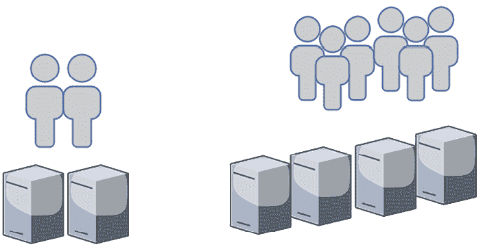

    图 2.1：水平扩展

    比如说，你的应用可以处理*每秒 1,000 个请求*，并且是*两台服务器实例*。随着用户基础的增长，应用每秒收到*2,000 个请求*，这意味着你可能需要将应用实例增加到四个，以应对增加的负载。

+   **垂直扩展**：这种方式已经存在很长时间了。这是一种做法，其中团队通过向同一台服务器增加额外的计算存储和内存能力，以应对日益增加的工作负载。如*图 2.2*所示，在垂直扩展过程中，你将获得一台更强大的服务器——而不是增加更多的服务器——来处理增加的工作负载：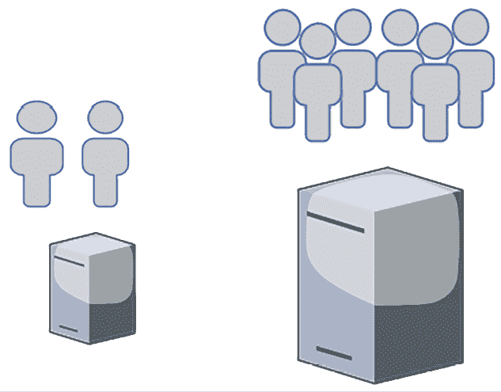

    图 2.2：垂直扩展

    垂直扩展模型可能成本效益较低；然而，当你购买具有更强计算能力和更大内存容量的硬件时，成本会呈指数级增长。除非需要应对由于高成本和服务器容量限制而增加的工作负载，否则你希望避免在达到某个阈值后继续进行垂直扩展。

垂直扩展最常用于扩展关系数据库服务器。然而，你需要考虑数据库分片问题，因为如果服务器达到了垂直扩展的极限，它无法超越特定的内存和计算能力。

分片是一种通过将数据划分并分布到多个服务器上来扩展数据库的技术。数据基于分片键进行分区，分片键决定了数据如何在各个分片之间分布。在垂直分片中，分片键可以是表中的某一列或一组列。

扩展可以是预测性的，如果你了解你的工作负载，这通常是有可能的；也可以是反应性的，如果你遇到突发流量或以前从未处理过这种负载。

**预测性扩展**是一种先进的应用工作负载管理方法，特别适用于具有可预测流量模式的场景，如电子商务网站上常见的流量模式。通过分析历史数据，组织可以预测流量趋势，并相应地调整资源。

例如，电子商务网站可能会根据星期几、一天中的时间或特定购物假期经历不同的流量，迫使其采取预先调整资源的扩展策略，以应对预期的负载增加。这种方法不仅优化了资源使用，还通过减少延迟和防止故障，提升了用户体验，这在流量激增时尤其重要，因为资源分配可能滞后于需求。

另一方面，**反应式扩展**对于应对突发的流量激增至关重要，这种流量通常远高于常规水平，可能由闪购等事件触发。了解网站不同页面的独特流量模式以及用户的导航路径，对于有效管理这些流量激增非常重要。通过识别哪些页面可以缓存，或者哪些查询是读密集型的，组织可以策略性地将流量从 Web 层卸载，利用内容分发网络来管理静态内容。

这种预测性和反应性扩展的结合确保了应用程序在流量波动的情况下仍然保持弹性和响应性。例如，下面的**自动扩展组**的最大实例数为六个，最小实例数为三个。在正常的用户流量下，三个服务器将运行并处理工作负载，但在流量激增时，服务器数量可以增加到六个。您的服务器集群将根据您定义的扩展策略增加实例数量。例如，当现有服务器集群中的 CPU 利用率超过 60%时，您可以增加一台服务器，但不会超过六台服务器。

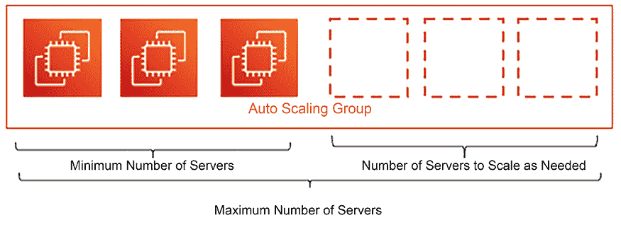

图 2.3：服务器自动扩展

无论扩展是反应式的还是预测性的，您都需要监控应用程序并收集数据，以规划扩展需求。

## 扩展静态内容

静态内容，如图片和视频，在吸引用户访问网站时发挥着至关重要的作用。然而，如果管理不当，这些元素可能会显著降低应用程序的性能。为了保持最佳的速度和用户体验，有效地扩展和分发静态内容至关重要。

以一个电子商务网站为例。每个产品可能有多张图片——甚至可能有视频——展示产品的质地和演示，这意味着网站将有大量的静态内容，并且负载主要是读取型的，因为大部分时间用户都在浏览产品。此外，用户可能会上传多个图片和视频来进行产品评价。

将静态内容存储在 Web 服务器中意味着会消耗大量存储空间，随着产品列表的增长，您必须担心存储的可扩展性。另一个问题是，静态内容通常需要较大的文件尺寸，这可能会在用户端造成显著的加载延迟。Web 架构层必须利用**内容分发网络**（**CDN**）来解决这个问题。CDN 帮助将内容缓存到离用户更近的位置，减少延迟并加快加载速度。合理地扩展静态内容确保您的应用程序在流量增加时仍然保持快速和响应，提供无缝的用户体验。

CDN 提供商（如 Akamai、Amazon CloudFront、Microsoft Azure CDN 和 Google CDN）在全球范围内提供静态内容缓存的位置，可以从靠近用户位置的 Web 服务器中缓存静态内容，从而减少延迟。*第四章*，*解决方案架构设计模式*，将向你介绍更多关于缓存的内容。

为了扩展静态内容存储，建议使用对象存储，如 Amazon S3，或本地自定义源，这样可以独立于内存和计算能力进行扩展。此外，使用流行的对象存储服务独立扩展存储可以节省成本。这些存储解决方案可以存放静态 HTML 页面，减少 Web 服务器的负担，并通过 CDN 降低延迟，从而提高用户体验。

### 应用服务器扩展的会话管理

应用架构层从 Web 层收集用户请求，执行复杂的业务逻辑计算并与数据库进行交互。当用户请求量增加时，应用层需要进行扩展以应对这些请求，然后在需求减少时缩减规模。在这种情况下，用户会与会话绑定，例如，他们可能会在手机上浏览并在桌面上购买。如果在不处理用户会话的情况下进行水平扩展，可能会导致糟糕的用户体验，因为会重置用户的购物进度。

在这里，第一步是通过将用户会话与应用服务器实例解耦来处理用户会话，这意味着你应该考虑将用户会话保存在独立的层中，例如 NoSQL 数据库，在那里你可以存储半结构化的数据。

NoSQL 数据库最适合存储半结构化数据，其中数据项的模式可能会有所不同。例如，一个用户在设置用户资料时可能输入姓名和地址，而另一个用户则可以输入更多的属性，如电话号码、性别、婚姻状况、姓名和地址。由于用户具有不同的属性，NoSQL 数据可以适应它们并提供快速搜索。

NoSQL 数据库，如 Amazon DynamoDB 或 MongoDB，提供卓越的分区能力，使得水平扩展变得轻松，并且能够超越其他数据库类型的可扩展性。

一旦你开始将用户会话存储在 NoSQL 数据库中，你的实例就可以进行水平扩展，而不会影响用户体验。你可以在一组应用服务器前添加负载均衡器，负载均衡器可以将负载分配到各个实例上；借助自动扩展功能，你可以根据需求自动增加或删除实例。

### 数据库扩展

大多数应用程序使用关系型数据库来存储其事务数据。这些数据库已经存在了几十年，并提供许多应用程序所需的强大事务一致性。然而，关系型数据库的主要问题是，除非你计划使用其他技术（如分片），并相应地修改应用程序，否则它们无法水平扩展。这将是一个繁重的工作。

对于数据库来说，采取预防措施并减少其负载是更好的做法。使用多种存储方法的组合，如将用户会话存储在单独的 NoSQL 数据库中，将静态内容存储在对象存储中，并应用外部缓存，有助于减轻主数据库的负担。最好将主数据库节点保留用于写入和更新数据，并使用额外的只读副本来处理所有读取请求。例如，Amazon RDS for MySQL 为关系数据库提供最多 15 个只读副本。只读副本在与主节点同步时可能会有毫秒级的延迟，在设计应用程序时需要考虑这一点。建议使用缓存引擎，如 Memcached 或 Redis，来缓存频繁的查询，从而减少主节点的负担。

如果数据库的增长超出了当前容量，你需要通过应用分区将其重新设计并分割成多个分片。

每个分片可以独立增长，应用程序需要确定一个分区键来将用户数据存储在相应的分片中。例如，如果分区键是`user_name`，那么`A`到`E`的用户名可以存储在一个分片中，`F`到`I`的用户名可以存储在第二个分片中，依此类推。应用程序需要根据用户名的首字母将用户记录定向到正确的分区。

正如你所看到的，扩展性是设计解决方案架构时的一个重要因素，如果规划不当，它会显著影响整体项目预算和用户体验。解决方案架构师在设计应用程序并优化工作负载以实现最佳性能和最低成本时，始终需要考虑弹性。

解决方案架构师需要评估不同的选项，如用于静态内容扩展和负载均衡的 CDN，服务器扩展的自动扩展选项，以及用于缓存、对象存储、NoSQL 存储、只读副本和分片的各种数据存储选项。

### 构建弹性架构

在专注于扩展性以提升应用性能的同时，构建一个成本意识的架构设计至关重要。这意味着，随着你扩展服务器基础设施以满足不断增长的用户需求，系统也应该在服务器负载减少时进行收缩。弹性是正确调整架构大小所必需的，它涉及将服务器基础设施扩展到准确匹配当前需求。它是一种平衡行为，确保有足够的容量高效处理峰值负载，同时避免在非高峰时段过度配置资源，导致资源闲置。

让我们继续以电子商务网站为例，考虑一种现代的三层架构，并看看如何在不同的应用层实现弹性。在这里，我们仅关注架构设计中的弹性和扩展性方面。*图 2.4*展示了 AWS 云技术栈的三层架构图：

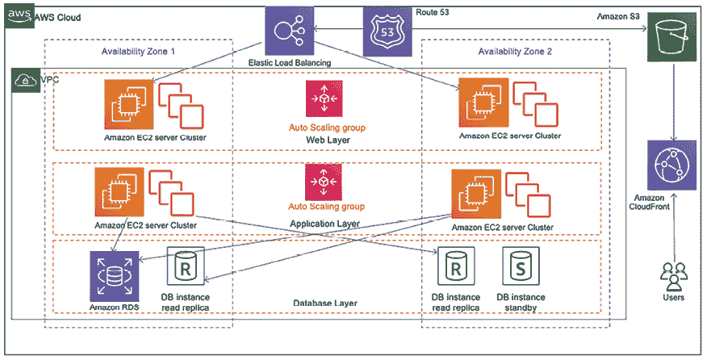

图 2.4：扩展三层架构

该图描绘了一个三层架构，旨在实现弹性和高可用性，重点是构建一个弹性的服务器集群，以高效地管理可变负载。

以下是架构组件：

+   弹性负载均衡自动将传入的应用流量分配到多个目标上，如 Amazon **弹性计算云**（**EC2**）实例、容器、IP 地址等，跨多个可用区进行分配。这增加了电子商务应用的容错能力。

+   Web 层由一个 EC2 实例的自动扩展组组成，旨在为应用提供动态内容。这个实例组可以根据定义的标准（如 CPU 利用率）自动扩展（增加实例）或收缩（移除实例），确保它能够适应传入的流量并保持一致的性能。

+   应用层还具有一个 EC2 实例的自动扩展组，负责执行应用的业务逻辑。与 Web 层类似，这一层可以根据应用负载的需求动态调整其大小。

+   在底部，数据库层包括 Amazon **关系型数据库系统**（**RDS**）实例，这些实例提供托管的关系型数据库。设置包括一个主数据库实例和一个只读副本，用于处理读取密集型操作，提高性能并减少主实例的负载。还有一个位于不同可用区的备用实例，用于高可用性和故障转移支持。

该架构允许灵活、可扩展的应用环境，可以跨多个可用区处理可变的工作负载并保持高可用性。它设计成能够根据应用需求自动扩展和收缩，确保用户体验一致、响应迅速的性能。

当用户通过网站或移动应用访问并与应用互动时，他们的请求将通过 Amazon Route 53 路由，它是一个高度可用且可扩展的 **域名系统**（**DNS**）Web 服务。Amazon CloudFront 作为 CDN 被用来高效地分发静态内容，如图片、样式表和 JavaScript 文件。这减少了 Web 服务器的负载，并通过降低延迟提升了用户体验。

在这一部分，你已经了解了各种扩展方法，以及如何将弹性注入到架构的不同层级。可扩展性是确保应用高可用性的关键因素，进而使应用具备弹性。我们将在下一部分学习更多关于高可用性和弹性的内容。

# 构建高度可用且具有弹性的架构

创建高度可用和具有弹性的架构需要设计能够容忍单个组件故障而不影响整体系统功能的系统。

## 高可用架构

一个组织想要避免的事情就是 *停机时间*。应用的停机时间会导致业务损失和用户信任度下降，使得 **高可用性** 成为设计解决方案架构时的首要因素。高可用性的原则是“设计时考虑故障，任何故障都无法发生。”

应用的正常运行时间需求因应用而异。如果你有一个面向外部的大型用户群体的应用，例如一个电子商务网站或社交媒体平台，100% 的正常运行时间变得至关重要。对于一个内部应用（由员工访问，如人力资源系统或公司内网），它可能能够容忍一些停机时间。实现高可用性与成本直接相关，因此解决方案架构师必须根据应用需求始终规划高可用性，以避免过度设计。

为了实现高可用架构，最好将工作负载规划在一个孤立的物理位置，这样，如果一个地方发生故障，应用的副本可以从另一个位置运行。高可用架构与自愈能力密切相关，你可以确保应用始终运行，但你还需要快速恢复以保持期望的用户体验。

## 弹性架构

弹性架构意味着你的应用应该在恢复故障时仍能为客户提供服务。让你的架构具有弹性包括应用最佳实践来应对由于更多用户请求、恶意攻击和架构组件故障而导致的负载增加。弹性需要在所有架构层面上应用，包括基础设施、应用、数据库、安全和网络。一个弹性架构应该在预定的时间内从故障中恢复。

为了让你的架构具备弹性，你需要定义恢复时间，并解决以下几点：

+   在需要的地方识别并实现冗余的架构组件。

+   理解何时修复与何时替换架构组件。例如，修复服务器问题可能比用相同的机器镜像替换它更耗时。

## 实现冗余

冗余是构建弹性系统的一个关键因素。构建弹性架构需要多层次的冗余策略。这包括在单一数据中心内跨不同机架部署服务器集群，扩展到同一区域内的多个数据中心，甚至跨多个地理区域进行部署。这种地理分布确保了抵御局部和区域性灾难的能力，并为全球用户群体降低延迟。

结合智能负载均衡和全球流量管理，例如基于 DNS 的路由和健康检查，确保用户始终从最优位置获取服务。通过战略性复制实现数据库的韧性，并配备自动故障转移机制，以保持数据库的可用性和完整性。

如果服务器分布在不同的物理位置，则流量路由的第一层可以通过 DNS 服务器处理，直到流量到达负载均衡器。这样，在整个区域发生故障时，您的应用程序仍然可以继续运行。

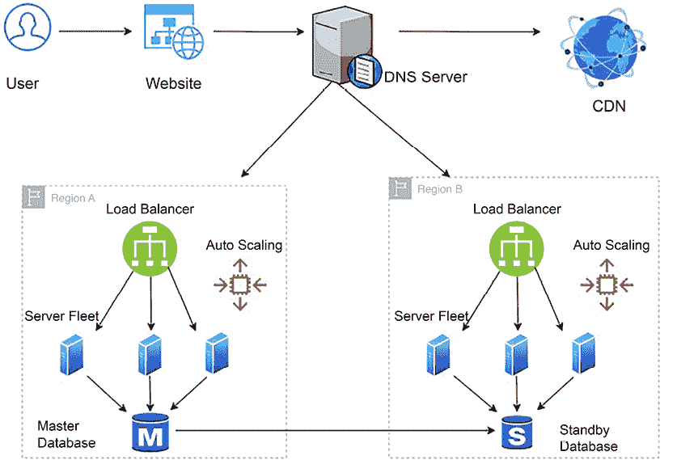

图 2.5：使用 DNS 服务器的应用架构韧性

正如您在前述架构中所看到的，韧性必须应用于所有影响应用可用性的关键层，以实现能够承受故障的设计。为了实现韧性，除了使用 DNS 服务器在不同的物理位置之间路由流量外，还需要应用以下最佳实践来创建冗余环境：

+   使用 CDN 将视频、图像和静态网页等静态内容分发并缓存到靠近用户位置的地方，这样您的应用程序仍然可以保持可用。

+   一旦流量到达某个区域，使用负载均衡器将流量路由到一组服务器，这样即使该区域的一个位置发生故障，您的应用程序仍然可以运行。

+   使用自动伸缩根据用户需求添加或移除服务器。因此，您的应用程序不应受到单个服务器故障的影响。

+   创建备用数据库以确保数据库的高可用性，这意味着在数据库故障时，您的应用程序应该仍然可用。

## 解决组件故障

如果某些组件发生故障，您应该有备份以恢复它们，并实现架构的韧性。DNS 服务器上的负载均衡器和路由器执行健康检查，确保流量仅路由到健康的应用实例。您可以配置它执行浅层健康检查，监控本地主机故障，或者执行深度健康检查，这也能处理依赖项故障。然而，深度健康检查需要更多的时间，并且比浅层健康检查更消耗资源。您将在*第八章*，*架构可靠性考虑*中了解更多关于韧性架构的内容。

在应用层面，必须避免**级联故障**，即一个组件的故障可能导致整个系统瘫痪。为减少系统中级联故障的风险，可以采取多种机制：

+   **超时**：为操作和请求设置最大时间限制可以防止无限等待响应，从而避免资源耗尽。

+   **流量拒绝**：当系统负载过重时，它可以主动拒绝新请求，以防止过载，并保持现有进程的稳定性。

+   **幂等操作**：确保操作可以重复执行而不会造成意外效果，可以帮助从中间故障中恢复而无需重复操作或引起不一致。

+   **断路器**：实施断路器模式可以检测故障模式并打开“电路”，停止对故障服务的进一步请求，使其恢复并防止故障扩散到系统的其他部分。

通过采用这些策略，系统可以变得更加弹性，保持在单个组件故障的情况下的功能性，并防止这些故障升级为广泛的系统故障。

尽管高可用性和弹性确保系统对用户可用，但在保持性能的同时，容错性也至关重要。现在让我们转向容错的主题。

# 使架构具有容错性

高可用性意味着您的应用程序对用户可用，但可能会导致性能下降。假设您需要四台服务器来处理用户流量。为此，您将两台服务器放置在两个物理隔离的数据中心中。如果一个数据中心出现故障，用户流量可以从另一个中心提供服务。但现在您只有两台服务器，这意味着只有原始容量的 50%可用，用户可能会遇到性能问题。在这种情况下，您的应用程序具有 100%的高可用性，但只有 50%的容错能力。

如*图 2.6*所示，要实现 100%的容错能力，您需要完全的冗余，并且必须保持双倍的服务器数量，以便在一个区域发生故障时，用户不会遇到任何性能问题。

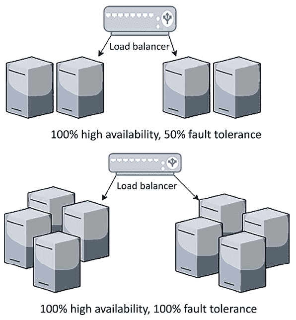

图 2.6：容错架构

容错性是在不影响系统性能的情况下处理工作负载容量。全面容错的架构由于增加的冗余而带来高昂的成本。您的用户群体能否接受应用程序恢复期间的性能降级取决于应用程序的关键性。

在设计应用程序架构时，解决方案架构师需要确定应用程序用户的性质以及是否需要 100%的容错能力，这必然会带来成本影响。例如，电子商务网站可能需要 100%的容错能力，因为性能降低直接影响业务收入。同时，内部的工资单系统，员工在月底检查其工资单时使用，可以容忍短时间内的性能降低。让我们深入探讨构建高性能架构的问题。

# 为性能设计

随着快速互联网的普及，客户正在寻求具有最低加载时间的高性能应用程序。组织已经注意到，直接的收入影响与应用程序性能成正比，而应用程序加载时间的慢速会显著影响客户参与度。现代公司在性能方面设定了高期望，这导致高性能应用程序成为在市场中保持竞争力的必要条件。

与弹性一样，解决方案架构师需要在架构设计的每一层考虑性能。DevOps 团队需要实施监控，以检查解决方案是否持续有效地运行，并不断改进。更好的性能意味着更高的用户参与度和投资回报率。

高性能应用程序设计用于应对因外部因素（如慢速互联网连接）导致的应用程序缓慢。例如，您可能已经设计了一个博客网页，在良好的互联网环境下加载时间为 500 毫秒。然而，在互联网较慢的地方，您可以先加载文本并通过这些内容吸引用户，同时图像和视频仍在加载中。

在理想环境下，随着应用程序工作负载的增加，自动扩展机制开始处理额外的请求，而不会影响应用程序性能。但在现实世界中，随着扩展生效，您的应用程序延迟会在短时间内下降。为了了解它在实际情况中的表现，最好通过增加负载来测试应用程序的性能，并了解是否能够实现预期的并发性和用户体验。

您需要根据工作负载选择正确类型的服务器。例如，选择合适的内存和计算能力来处理工作负载，因为内存拥塞可能会减慢应用程序性能，并最终导致服务器崩溃。您还应选择正确的**每秒输入/输出操作数**（**IOPS**）用于存储。对于写密集型应用程序，您需要高 IOPS 以减少延迟并提高磁盘写入速度。

IOPS 是一种性能衡量标准，用于基准测试存储设备（如硬盘、固态硬盘和存储区域网络）读取和写入数据的速度。每个输入或输出操作可能是一次数据读取或数据写入。

为了实现更高的性能，请在架构设计的每一层应用缓存。缓存使您的数据可以本地提供给用户，或将数据保存在内存中以提供超快速响应。

以下是在您的应用程序设计的各个层面添加缓存时需要考虑的事项：

+   使用用户系统上的浏览器缓存来加载经常请求的网页。

+   使用 DNS 缓存以快速查找网站。

+   使用 CDN 缓存来存储靠近用户位置的高分辨率图像和视频。

+   在服务器级别，最大化内存缓存以服务用户请求。

+   使用缓存引擎，如 Redis 和 Memcached，从缓存引擎提供频繁查询服务。

+   使用数据库缓存从内存中为频繁查询提供服务。

+   注意缓存过期问题，缓存过期是指存储在缓存中的数据变得过时，并被标记为更新或移除。而缓存淘汰则是指将数据从缓存中移除，通常是为了为新数据腾出空间。

如你所见，保持应用程序的高性能是一个至关重要的设计方面，且直接与组织的盈利能力相关。解决方案架构师在创建解决方案设计时需要考虑性能，并应不懈努力提升应用程序的性能。在*第六章*，*性能考虑*中，你将深入了解这一点，并学习优化应用程序以提高性能的技术。

# 创建不可变架构

组织在硬件上进行大量资本投入，并养成定期用新版本的应用程序和配置来刷新硬件的做法。随着时间推移，这可能导致不同的服务器运行不同的配置，排查问题变得繁琐。有时，组织可能不得不继续运行不必要的资源，因为不确定该关闭哪个服务器，这可能会导致应用程序失败。无法替换服务器使得在你的服务器集群中推出和测试任何新更新变得具有挑战性。这些问题可以通过将服务器视为可替换资源来解决，从而更快速地适应变化，如升级应用程序和底层软件，减少停机时间，并快速修复应用问题。因此，在设计应用程序时，你应该始终考虑不可变基础设施。这意味着，在应用程序升级过程中，你不仅会替换软件，还会替换硬件。

在现代云架构中，采用将服务器视为牲畜而非宠物的思维方式是至关重要的。这种方法意味着，个别服务器不会被精心维护或定制到无法替代的程度。相反，服务器被设计为可以快速配置、一致管理，并在不对整体系统造成重大影响的情况下被处置或替换。这种方法提高了可扩展性和弹性，因为它允许快速适应需求变化或从故障中恢复。

为了创建可替换的服务器，建议使你的应用程序无状态，以保持用户体验，并避免硬编码任何服务器 IP 或数据库 DNS 名称，以防止在替换过程中出现故障。你需要应用将基础设施视为代码而非硬件的理念，并避免对在线系统进行更新。

使用虚拟机创建不可变基础设施变得更加可行。你可以创建虚拟机的黄金镜像，并使用它来部署新版本的基础设施，而不是尝试更新现有版本。你应始终从黄金镜像启动新的服务器实例，该镜像作为模板，已包含所有必要的安全性和软件。这种部署策略对于服务器故障排除也很有帮助，你可以丢弃出现问题的服务器，并从黄金镜像启动新服务器。

在丢弃有问题的服务器之前，你应该备份日志以进行根本原因分析。这种方法还能确保环境的一致性，因为你使用相同的基准服务器镜像来创建所有环境。

松耦合是另一个关键的设计原则，它与“牛群而非宠物”方法相辅相成。它涉及设计系统组件，使其通过明确定义的接口进行交互，并且独立性足够强，组件之间的变化不会导致其他组件的变化。这样的分离增强了灵活性和可扩展性，使得各个组件能够独立演化、扩展或从故障中恢复。让我们更深入了解松耦合。

# 思考松耦合

传统的应用程序部署在紧密集成的服务器队列上，其中每台服务器都有特定的责任。通常，应用程序依赖多个服务器来实现功能的完整性。

如下图所示，在紧耦合架构中，网页服务器队列直接依赖于所有应用服务器，反之亦然：

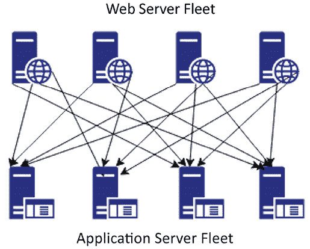

图 2.7：紧耦合架构

在之前的架构图中，如果某个应用服务器出现故障，所有的网页服务器将开始接收错误请求，因为请求会被路由到不健康的应用服务器，这可能导致整个系统的故障。在紧耦合架构下，如果你想通过添加或移除服务器来进行扩展，那么需要做很多工作，因为所有的连接都需要适当设置。

使用松耦合，你可以添加一个中间层，例如负载均衡器或队列，它会自动处理故障或扩展问题。

在下图的架构中，网页服务器和应用服务器队列之间有一个负载均衡器，它确保用户请求始终由健康的应用服务器提供服务：

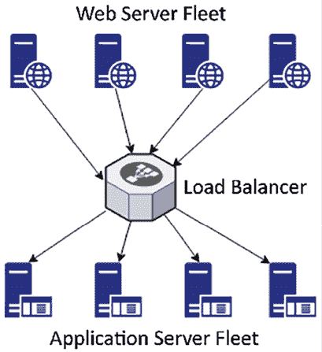

图 2.8：基于负载均衡器的松耦合架构

如果某个应用服务器出现故障，负载均衡器会自动将所有流量引导到其他三个健康的服务器上。松耦合架构还帮助你独立扩展服务器，并优雅地替换不健康的实例。它使得你的应用更具容错性，因为错误的范围仅限于单个实例。

松耦合架构也可以是基于队列的；以一个图像处理网站为例，你需要存储一张图片，然后对其进行编码、生成缩略图和版权处理。以下架构图展示了基于队列的解耦。通过在系统之间使用队列并交换消息，将工作通过这些队列传递，从而实现了系统的松耦合。

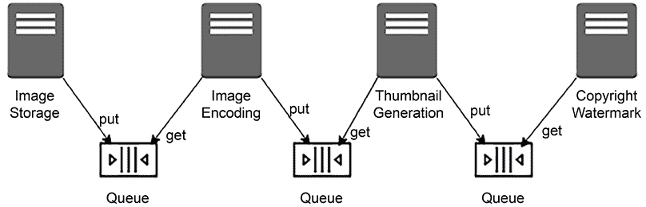

图 2.9：基于队列的松耦合架构

基于队列的解耦实现了系统的异步连接，其中一个服务器不会等待另一个服务器的响应，而是独立工作。这种方法让你可以增加接收和处理消息的虚拟服务器数量，并行工作。如果没有需要处理的图像，例如，你可以配置自动扩展来终止多余的服务器。

在一个复杂的系统中，通过创建微服务架构来实现松耦合架构，其中独立的服务包含一整套功能，并通过标准协议彼此通信。在现代设计中，这种事件驱动的设计变得非常流行，有助于应用程序组件的解耦。松耦合设计具有许多优点，从可扩展性、高可用性到易于集成。

# 想想服务，而不是服务器

在上一节中，你了解了松耦合以及为什么架构的松耦合对可扩展性和容错性如此重要。培养面向服务的思维将有助于实现松耦合架构（与面向服务器的思维相对，后者可能导致硬件依赖和紧耦合架构）。基于微服务的事件驱动架构帮助我们实现了解决方案设计的易部署和易维护。

在 RESTful 架构中，你可以将消息格式化为 XML、JSON 或纯文本，并通过简单的 HTTP 协议将其发送到互联网。RESTful 架构之所以受欢迎，是因为它非常轻量。微服务基于 RESTful 架构，并且可以独立扩展，这使得你可以在不影响其他组件的情况下，轻松扩展或缩减应用程序的某个组件。

正如你在以下图表中看到的，在单体架构中，所有组件都构建为一个服务，因此部署在单一服务器上，并与单一数据库绑定，造成了硬依赖。相比之下，在微服务架构中，每个组件都是独立的，拥有自己的框架和数据库，从而允许它们独立扩展：

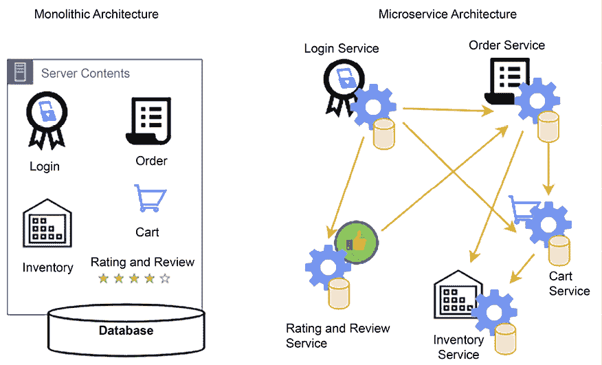

图 2.10：单体架构与微服务架构

在前面的图示中，你可以看到一个电子商务网站的例子，展示了单体架构和微服务架构，在这个架构中，客户可以登录并下单，假设他们想要的商品有货，通过将商品添加到购物车来完成。

要将单体架构转换为基于微服务的架构，你可以创建由小型、独立组件组成的应用程序，这些组件是构成更小部分并进行迭代的基础。

*模块化方法*减少了*成本*、*规模*和*变更风险*。在前述案例中，每个组件都作为服务独立创建。这里，**登录**服务可以独立扩展以处理更多流量，因为客户可能会频繁登录以浏览产品目录和订单状态。相比之下，**订单**和**购物车**服务的流量可能较少，因为客户不太可能频繁下单。

解决方案架构师在设计解决方案时需要考虑微服务。服务的明显优势是，代码的维护面更小，而且服务是自包含的。然而，监控微服务需要比传统单体应用更为细致的方法，因为微服务的分布式特性。每个微服务独立运行，这意味着监控必须在单个服务层级以及系统层级进行，以确保对应用程序健康和性能的全面视图。

你可以构建没有外部依赖的微服务。所有的前置条件都包含在服务中，这使得松耦合和扩展成为可能，同时在发生故障时可以减少冲击范围。

任何应用程序设计都围绕数据展开，从数据出发来反推设计有助于构建最佳架构。让我们进一步了解数据驱动的设计。

# 思考数据驱动设计

任何软件解决方案都围绕数据的收集和管理展开。以电子商务网站为例，软件应用程序的构建旨在展示网站上的产品数据，并鼓励客户购买产品。它从收集客户数据开始，当客户创建账户、添加支付方式、存储订单交易以及在产品销售时维护库存数据。另一个例子是银行应用程序，它存储客户的财务信息，并确保所有金融交易数据的完整性和一致性。对于任何应用程序来说，最重要的是适当地处理、存储和保护数据。数据在很大程度上影响着解决方案的设计，通过始终关注数据，你可以为自己的需求应用合适的设计驱动解决方案。

不仅仅是应用设计围绕数据展开，运营维护和商业决策也同样如此。你需要增加监控功能，确保你的应用和业务能够顺利运行。例如，在应用监控中，你需要从服务器收集日志数据并创建仪表板以可视化指标。持续的数据监控和在出现问题时发送警报可以帮助你通过触发自动修复机制快速从故障中恢复。

作为解决方案架构师，你需要考虑应用设计和整体商业价值主张，包括如何收集数据并在应用程序中加以利用，这有助于提高客户满意度并最大化投资回报。数据就是金矿，深入洞察数据能够显著影响组织的盈利能力。

# 在各个方面添加安全性

安全性是解决方案设计中至关重要的方面；任何安全上的漏洞都可能对企业或组织的未来造成灾难性的影响。许多组织因安全漏洞而遭受损害，导致客户信任丧失并损害企业声誉。行业标准的规定，如**PCI**（**支付卡行业**）、**HIPAA**（**健康保险流通与问责法案**）、**GDPR**（**通用数据保护条例**）和**SOC**（**系统与组织控制**）合规性，都是确保数据在不同领域安全的关键框架。PCI 保护金融行业的信用卡信息，HIPAA 保护医疗行业的患者数据，GDPR 增强欧盟地区的数据隐私，而 SOC 确保服务组织中的数据管理安全，执行安全保护措施以保护消费者数据，同时为组织提供标准化的指导。根据你的行业和地区，你必须遵守本地法规，满足诸如这些合规需求。

安全性会显著影响解决方案设计，因此在开始设计之前，你需要了解你的安全需求。安全性需要在硬件层面进行平台准备，同时在软件层面进行应用开发。

以下是在设计阶段需要考虑的安全方面：

+   **数据中心物理安全**：数据中心中的所有 IT 资源应防止未经授权的访问。

+   **网络安全**：网络应保持安全，防止任何未经授权的服务器访问。

+   **身份与访问管理**（**IAM**）：只有经过身份验证的用户才能访问应用程序，并且他们可以根据授权进行相应的操作。

+   **数据传输中的安全**：数据在通过网络或互联网传输时应保持安全。

+   **静态数据安全**：数据在数据库或任何其他存储介质中存储时应保持安全。

+   **安全监控**：任何安全事件都应被捕捉，团队应收到警报并采取行动。

应用程序设计需要平衡安全要求（如加密）与其他因素（如性能和延迟）。数据加密始终会对性能产生影响，因为它增加了额外的处理层，因为数据需要解密才能被使用。您的应用程序需要在不影响整体性能的情况下适应额外加密处理的开销，因此在设计应用程序时要考虑需要加密的使用场景。例如，如果数据是机密的，您需要对其进行加密。

与安全相关的应用程序设计的另一个方面是遵守当地法律的合规性。如果您的应用程序属于受监管行业（如医疗、金融或联邦政府），合规性至关重要。每种合规性都有其要求，通常包括数据保护和记录每项活动以供审计。您的应用程序设计应包括全面的日志记录和监控，以满足审计要求。

安全性是应用程序弹性最重要的方面之一。从安全角度来看，**分布式拒绝服务**（**DDoS**）攻击可能会影响服务和应用程序的可用性。DDoS 攻击通常会在服务器上产生虚假流量，使其忙碌，这意味着合法用户无法访问您的应用程序。这种攻击可能发生在网络层或应用层。采取积极的预防措施来防止 DDoS 攻击至关重要。尽可能将应用程序的工作负载保留在私有网络中，并避免将应用程序端点暴露在互联网上。

安全自动化是您应始终与设计一起实施的另一个因素，以减少和缓解任何安全事件。安全自动化涉及利用技术执行安全任务，而无需人工干预，从而简化安全事件的检测、分析和修复。通过集成自动化的安全措施，您可以实现持续监控和实时威胁检测，从而更快响应漏洞和安全漏洞。

在本节中，您已经学习了如何在设计过程中应用安全思维，并考虑任何监管需求。然而，您在这里得到的是一个高层次的概述。您将在*第七章*，*安全性考虑*中学习更多细节。

您可能会创建一个功能丰富的产品，但只有当用户发现它易于导航和访问时，才会广泛吸引用户。应用程序的可用性和可访问性在产品成功中起着至关重要的作用。让我们在下一部分了解更多内容。

# 使应用程序易用且可访问

确保应用既可用又可访问是设计中的一个关键方面，直接影响用户体验。可用性指的是用户与应用交互时的易用性和直观性，这涉及到用户友好的界面、清晰的导航以及高效的任务完成流程。另一方面，可访问性确保应用可以被各种有不同障碍的用户使用。我们来了解更多相关内容。

## 实现可用性

你希望用户在浏览应用时能够拥有无缝的体验。它应该顺畅到让用户甚至不注意到他们是如何轻松找到所需内容的，而没有遇到任何困难。你可以通过提高应用的可用性来实现这一点。

可用性是指用户第一次使用应用时能够多快学习到导航逻辑。它关乎用户如果犯错后能多快恢复，并且是否能高效完成任务。如果应用功能复杂且功能丰富，但不能有效使用，那么它就没有意义。目标是创建一个直观且用户友好的界面，提升用户体验，确保应用的功能对于所有用户都可访问且易于理解。

用户研究和测试对于定义能够满足用户体验的可用性至关重要。

## 实现可访问性

在设计应用时，你通常希望面向全球用户或重要的地理区域。你的用户群体在技术设施和身体能力方面会有很大的差异。可访问性关乎包容性；你希望你的应用对每个人都可访问，无论用户是否有慢速的互联网连接、使用旧设备，还是有身体限制。

在设计应用时，解决方案架构师必须确保考虑到可访问性。有时，可能需要完全创建应用的不同版本来实现这一目标。

可访问性设计应包括设计组件，例如语音识别与语音导航、屏幕放大器，以及能将内容大声朗读出来的功能，以帮助那些因视力或听力障碍而无法轻松访问和使用应用的用户。

本地化帮助应用以特定地区的语言（例如西班牙语、普通话、德语、印地语或日语）提供服务，使全球用户能够以自己的母语浏览应用。

如*图 2.11*所示，客户满意度是可用性和可访问性的重要组成部分。

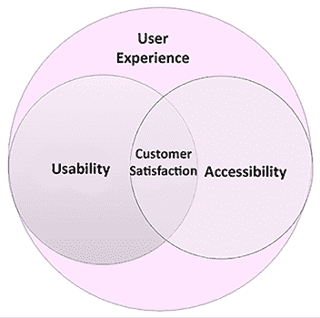

图 2.11：客户对可用性和可访问性的满意度

要实现可用性和可访问性，你必须了解你的用户——其中可访问性是可用性的一个组成部分——它们是密切相关的。在开始解决方案设计过程之前，解决方案架构师应与产品负责人一起，通过访谈和调查研究用户，并收集对前端设计原型的反馈。你需要了解用户的限制，并在应用开发过程中通过支持性功能赋能用户。

当产品上线时，团队应该规划 A/B 测试，将一小部分用户流量引导到新功能上，并了解用户的反应。A/B 测试涉及对比应用的两个版本，评估其表现，并确定哪个版本更优。上线后，应用程序必须具备收集持续反馈的机制（例如提供反馈表单或启动客户支持），以不断优化设计。

随着用户不断变化，架构应能够跟上不断增长的需求。为此，你需要设计可扩展且具有未来保障的架构。让我们学习如何使你的架构具备未来保障。

# 构建具有未来保障的可扩展和可重用架构

随着企业的成长，业务也在不断演变；应用程序需要扩展以应对日益增加的用户群体，并增加更多功能，以保持领先地位并获得竞争优势。解决方案设计需要具备足够的可扩展性和灵活性，以便修改现有功能或添加新功能。

为了实现解决方案的可扩展性，解决方案架构师必须尽可能使用松耦合架构。总体而言，创建 RESTful 或基于队列的架构有助于在不同模块或跨应用程序之间开发松耦合的通信。你将在*第四章*、*解决方案架构设计模式*中学习到更多关于其他类型架构的内容。在本节中，我们将通过一个简单的例子来解释架构灵活性的概念。

为了模块化他们的应用程序，组织通常希望构建一个包含一组功能的平台，并将其作为独立的应用程序发布。这只有通过可重用的设计才能实现。

*图 2.12* 显示了一个电商应用中的基于 API 的架构。在这里，你有独立的服务，如产品目录、订单、支付和配送，最终用户应用程序可以按需选择使用这些服务。客户通过移动端和浏览器应用程序下单。这些应用程序需要一个产品目录服务，让客户浏览网页上的产品，一个订单服务让他们下单，以及一个支付服务处理支付。

反过来，产品目录和订单服务与配送服务进行通信，将已订购的商品送到客户的家门口。另一方面，实体店使用销售点系统，客户代表扫描条形码、代为下单并收取付款。在这里不需要配送服务，因为顾客可以到店内领取商品。

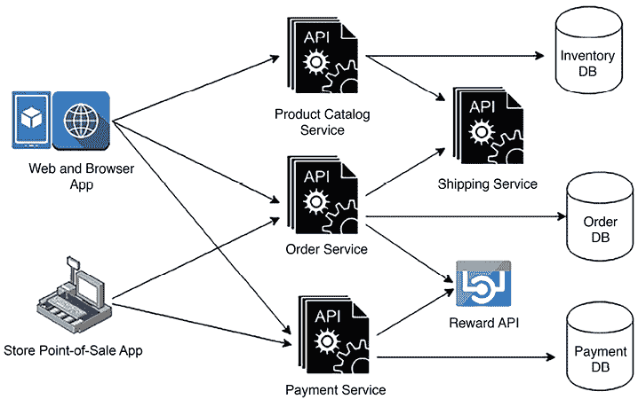

图 2.12：基于 API 的可扩展架构

在*图 2.12*中，您可以看到用于第三方 API 集成的 Reward API。这种架构允许您扩展当前设计，以集成 Reward API，从而通过在客户购买商品时提供优惠来提高客户保持率，并吸引新客户。在这里，您可以看到支付服务被在线和店内订单共同重用。如果组织希望为礼品卡服务、餐饮服务等收取付款，另一个服务也可以重用支付服务。

可扩展性和可重用性不仅限于服务设计层面——它们深入到实际的 API 框架层面，软件架构师应该使用**面向对象分析与设计**（**OOAD**）的概念，如继承，来创建一个可扩展和可重用的 API 框架，为同一服务添加更多功能。

OOAD 是软件工程中的一种基础性方法，帮助开发人员更有效地规划和建模应用程序，确保软件具有模块化、可扩展和可维护的特性。

为了扩展应用程序功能，它需要与其他产品无缝对接，以便扩展数据和事务。使应用程序与生态系统互操作有助于通过利用其他相关应用程序来添加新功能。让我们进一步了解如何构建兼容的架构。

# 确保架构的互操作性和可移植性

架构的互操作性和可移植性是现代软件架构中至关重要的方面，确保应用程序能够在不同环境中运行，并与其他系统无缝地互动。让我们来看一下这些概念。

### 使应用程序具备互操作性

互操作性是指一个应用程序通过标准格式或协议与其他应用程序协同工作的能力。通常，一个应用程序需要与多个上游系统进行通信以获取数据，并与下游系统进行通信以提供数据，因此，确保这种通信无缝进行至关重要。

例如，一个电子商务应用程序需要与供应链管理生态系统中的其他应用程序协同工作。这包括企业资源规划应用程序，用于记录所有交易，运输生命周期管理、运输公司、订单管理、仓库管理和劳动管理。

所有应用程序应该能够无缝交换数据，以实现从客户订单到交付的端到端功能。无论是在医疗保健应用、制造应用，还是电信应用中，您都会遇到类似的使用案例。

解决方案架构师在设计时需要考虑应用程序的互操作性，通过识别并处理各种系统依赖关系。一个互操作的应用程序在成本方面能够节省很多，因为它依赖于可以以相同格式进行通信的系统，无需任何数据消息传输工作。

每个行业都有其标准的数据交换大小，需要了解并遵守。一般来说，在软件设计中，架构师可以为不同的应用选择一种流行的格式，如 JSON 或 XML，以便它们能够相互通信。现代 RESTful API 设计和微服务架构都原生支持这两种格式。

### 使应用程序具备可移植性

系统可移植性允许您的应用在不同环境中运行，且只需最小的更改或不需要更改。任何软件应用都必须能够在各种操作系统和硬件上运行，以实现更高的可用性。

由于技术变化迅速，您经常会看到新的软件语言、开发平台或操作系统版本发布，您需要确保您的应用程序能够适应这些变化。如今，移动应用程序是任何系统设计中不可或缺的一部分，您的移动应用需要与主要的移动操作系统平台兼容，例如 iOS 和 Android。

在设计阶段，解决方案架构师需要选择一种可以实现应用程序所需可移植性的技术。例如，如果您的目标是将应用程序部署到不同的操作系统上，像 Java 这样的编程语言可能是一个不错的选择，因为几乎所有操作系统都支持它，您的应用将能够在不同平台上运行，而无需进行移植。对于移动应用，架构师可能会选择一个基于 JavaScript 的框架，如 React Native，它可以提供跨平台的移动应用开发。

互操作性丰富了系统的扩展性，而可移植性增加了应用程序的可用性。两者都是架构设计的关键属性，如果在解决方案设计时没有得到解决，可能会带来成倍的成本。解决方案架构师必须根据行业需求和系统依赖关系仔细考虑这两个方面。

自动化是减少错误和提高效率的关键。我们接下来会讨论这个。

# 在各处应用自动化

大多数事故发生是由于人为错误，而这些错误可以通过**自动化**避免。自动化不仅能够高效处理任务，还能提高生产力并节省成本。任何被认为是可重复的任务都可以进行自动化，从而释放宝贵的人力资源，让团队成员将时间用于更有趣的工作，并专注于解决实际问题。这也有助于提高团队士气。

在设计解决方案时，要考虑可以自动化的部分。思考哪些可重复的任务可以被自动化。考虑以下组件是否可以在你的解决方案中自动化：

+   **应用测试**：每次对应用程序进行更改时，都需要进行测试，以确保没有破坏任何功能。此外，手动测试非常耗时并且需要大量资源。自动化可重复的测试用例更有利于加速部署和产品发布。你应该在生产规模上自动化测试，并使用滚动部署技术，如金丝雀发布和 A/B 测试，来发布更改。金丝雀测试涉及将更改发布给一小部分用户，以评估影响并在全面推出之前发现问题，充当潜在问题的早期警告系统。A/B 测试，或称为分流测试，比较应用程序的两个版本，以确定哪个版本在用户中表现更好，基于数据做出决策。

+   **IT 基础设施**：你可以通过使用*基础设施即代码*脚本来自动化你的基础设施，例如 Ansible、Terraform 和 Amazon CloudFormation。基础设施的自动化使得环境的创建能够从几天缩短到几分钟。将基础设施作为代码进行自动化可以避免配置错误，并创建环境的副本。

+   **日志记录、监控和警报**：监控至关重要，你需要时刻监控一切，以确保应用程序的各个部分都正常运行，并能主动采取措施解决任何问题。只有通过自动化才能有效监控庞大的系统。你需要自动化所有活动监控和日志记录，以确保你的应用程序平稳运行并按预期工作。此外，基于监控，你应该采取自动化措施，如扩展系统或向团队发出警报以采取行动。

+   **部署自动化**：部署是一个可重复的任务，非常耗时，并且在许多实时场景中会导致最后时刻的发布延迟。通过应用**持续集成和持续部署**（**CI/CD**）自动化部署管道，能够帮助你更灵活，快速迭代产品特性，并进行频繁的发布。CI/CD 帮助你对应用程序进行小规模、增量式的更改。

+   **安全自动化**：在自动化一切时，记得加入安全自动化。如果有人试图攻击你的应用程序，你需要立即知道并迅速采取行动。

+   你需要通过自动化任何进出系统边界的流量，并设置警报以监控可疑活动，从而采取预防措施。

自动化通过帮助确保产品无故障运行，提供了安心感。在设计应用程序时，总是从自动化的角度思考，并将其视为一个关键组件。你将在*第九章*，*运营卓越的考虑因素*中深入了解自动化。

# 业务连续性规划

可能会出现这样的情况：由于大规模电网故障、地震、洪水或安全攻击，数据中心所在的整个区域出现停机，但你的全球业务应该继续运行。在这种情况下，你必须有一个灾难恢复计划，通过在完全不同的地区，甚至不同的大陆或国家，准备足够的 IT 资源来规划业务连续性，以便在出现问题时，业务能够迅速恢复或完全没有停机。

在规划灾难恢复时，解决方案架构师必须了解组织的**恢复时间目标**（**RTO**）和**恢复点目标**（**RPO**）。RTO 衡量业务可以承受多长时间的停机而不会造成重大影响；RPO 则表示业务可以容忍多少数据丢失。减少 RTO 和 RPO 意味着需要更高的成本，因此了解业务是否是关键任务并需要最小的 RTO 和 RPO 非常重要。例如，股票交易应用不能承受丢失任何数据点，而铁路信号系统应用不能有一秒钟的停机，因为人的生命安全依赖于此。

*图 2.13*中的架构图展示了一个多站点灾难恢复架构。主要数据中心位于欧洲爱尔兰，灾难恢复站点位于美国弗吉尼亚州，托管在 AWS 公有云上。在这种情况下，即使发生了欧洲地区或公有云的故障，企业仍然可以继续运营。基于多站点模型的灾难恢复计划，能够实现最小的 RTO 和 RPO，这意味着几乎没有停机时间和数据丢失。

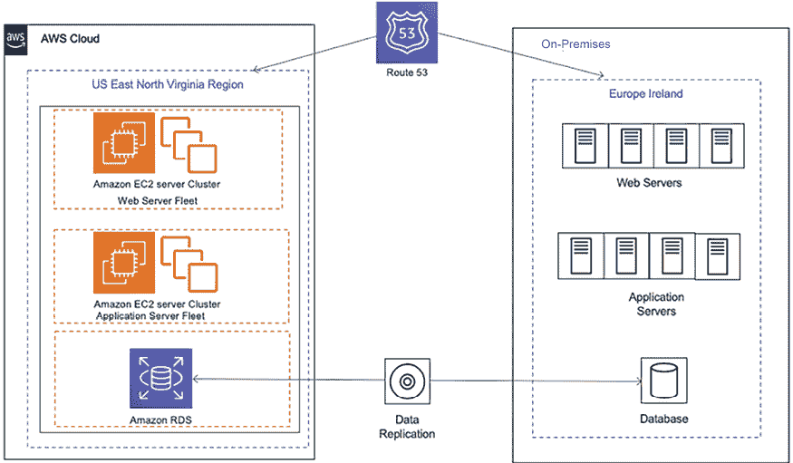

图 2.13：混合多站点灾难恢复架构

以下是最常见的灾难恢复计划，所有这些你将在*第十一章*，*DevOps 与解决方案架构框架*中了解：

+   **备份与存储**：这是成本最低的方案，但具有最大的 RTO 和 RPO。在该方案中，所有服务器的机器镜像和数据库快照应存储在灾难恢复站点。团队将在灾难发生时尝试从备份中恢复灾难站点。

+   **Pilot lite**：在此计划中，所有服务器的机器镜像都会被存储为备份，并且在灾难恢复站点维护一个小型数据库服务器，与主站点进行持续的数据同步。其他关键服务，如 Active Directory，可能会在小型实例中运行。在灾难发生时，团队将尝试从机器镜像中启动服务器，并扩展数据库。Pilot lite 方案比备份和存储更昂贵，但具有较低的 RTO 和 RPO。

+   **Warm standby**：在此计划中，灾难恢复站点中的所有应用程序和数据库服务器（以低容量运行）实例继续与主站点同步。在灾难发生时，团队将尝试扩展所有服务器和数据库。Warm standby 方案比 Pilot lite 更昂贵，但具有更低的 RTO 和 RPO。

+   **Multi-site**：此计划是最昂贵的，具有接近零的 RTO 和 RPO。此计划在灾难恢复站点中保持主站点的副本，并拥有相同的容量，能够主动服务用户流量。在灾难发生时，所有流量将被路由到备用位置。

通常，组织会选择成本较低的灾难恢复方案，但必须定期进行测试以确保故障切换能够正常工作。团队应将操作卓越性作为常规检查点，以确保在灾难恢复期间保持业务连续性。将应用程序投入生产并维护多年非常重要。让我们了解如何使应用程序具有可维护性和操作性的原则。

# 为运营设计

操作卓越性可以成为您应用程序的巨大差异化因素，通过提供高质量的服务给客户，减少停机时间。主动应用操作卓越性还帮助支持和工程团队提高生产力。可维护性与操作卓越性密切相关。易于维护的应用程序有助于降低成本，避免错误，并使您获得竞争优势。

解决方案架构师需要为运营设计，包括工作负载如何部署、更新和长期运营。规划日志记录、监控和警报至关重要，以捕捉所有事件并采取快速行动以确保最佳的用户体验。在可能的情况下应用自动化，无论是部署基础设施还是更改应用程序代码，以避免人为错误。

在设计中包括部署方法和自动化策略非常重要，因为这可以加速任何新变更的上市时间，而不影响现有的运营。操作卓越性规划应考虑安全性和合规性因素，因为监管要求可能会随时间变化，您的应用程序必须遵守这些要求才能正常运行。

维护可以是主动的，也可以是被动的；例如，一旦有新版本的操作系统发布，你可以立即更新你的应用程序以切换平台，或者监控系统健康状况，直到软件生命周期结束才进行任何更改。在任何情况下，变更都应该以小的增量进行，并且有回滚策略。为了应用这些变更，你可以通过设置 CI/CD 流水线来自动化整个过程。在发布时，你可以计划 A/B 测试或蓝绿部署。

对于运营准备，架构设计应包括适当的文档和知识共享机制——例如，创建并维护运行手册以记录日常活动，并创建操作手册以指导你的系统过程应对问题。这使得你在发生事故时能够迅速采取行动。你应该使用*根本原因分析*进行事后报告，以确定问题发生的原因，并确保不会再发生。

运营卓越和维护是持续进行的；每一次操作事件和故障都是通过从以往的错误中学习来改善操作的机会。你必须分析操作活动和故障，进行实验，并不断改进。你将在*第九章*，*运营卓越的考虑因素*中学到更多关于运营卓越的内容。

在*第一章*，*组织中的解决方案架构师*中，你学习了一个解决方案架构需要处理和平衡的各种约束。处理约束是一个关键的架构原则，我们接下来会详细讨论这个问题。

# 克服架构约束

在设计应用架构时，主要的限制因素是成本、时间、预算、范围、计划和资源。克服这些约束是设计解决方案时必须考虑的重要因素。你应该将这些限制视为可以克服的挑战，而不是障碍，因为挑战总是推动你达到创新的极限。

解决方案架构师需要在考虑约束的同时做出适当的权衡。例如，高性能应用需要在架构的多个层次中添加额外的缓存，这会导致更多的成本。然而，有时，成本比性能更重要，特别是当一个系统被内部员工使用时，这可能不会直接影响收入。有时，市场的需求比推出一个功能全面的产品更为重要，在这种情况下，你需要在范围和速度之间做出权衡。在这种情况下，你可以采用**最小可行产品**（**MVP**）的方法；你将在下一节中学到更多关于这一点的内容。

在大型组织中，技术约束变得尤为明显，因为在数百个系统中进行变更将是一个巨大的挑战。在设计应用程序时，需要使用组织内最常见的技术。还需要确保应用程序能够升级，以便采用新技术，并能够插入在不同平台上构建的组件。

当团队可以自由选择任何技术进行开发时，RESTful 服务模型非常受欢迎。它们只需要提供一个 URL，客户就可以通过该 URL 访问他们的服务。即使是旧的系统，如大型主机，也可以通过围绕其构建的 API 封装器集成到新系统中，这有助于克服技术挑战。

在本书中，您将学习如何处理各种架构约束。MVP 方法帮助您克服这些约束，构建以客户为中心的产品。

## 采取 MVP 方法

对于成功的解决方案，始终将客户放在首位，从客户的需求出发进行反向思考，确定他们的关键需求，并以敏捷的方式规划解决方案交付。

MVP 是一种开发策略，用于构建一个新的产品或网站，只包含满足早期用户需求和在产品开发周期初期验证产品想法所必需的最少功能。在这种方法中，产品的初始版本仅包含允许产品部署的核心功能，其他一切都不包含。目标是提供即时价值，最小化开发成本，并尽可能快速地收集客户反馈，以便不断迭代和改进产品。

优先排序客户需求的一个流行方法是**MoSCoW**，您可以将需求划分为以下几类：

+   **Mo (必须具备的)**：对客户至关重要的需求，没有这些需求，产品无法发布

+   **S (应该具备的)**：一旦客户开始使用应用程序后，最希望具备的需求

+   **Co (可以具备的)**：需要的需求是非常理想的，但其缺失不会影响应用程序所需的功能

+   **W (不需要的)**：如果客户没有注意到，可能不会觉得缺少的需求

您需要为客户规划一个 MVP，确保具备必须具备的需求，并进行下一次交付迭代，确保具备必须具备的需求。通过这种分阶段交付的方法，您可以充分利用资源，克服时间、预算、范围和资源的挑战。MVP 方法帮助您确定客户需求。您不是在尝试构建一切，而是知道您的功能是否为客户带来价值。这种以客户为中心的方法有助于明智地利用资源，减少资源浪费。

在下图中，您可以看到一个卡车制造交付的 MVP 评估，其中客户最初需要交付的卡车，并根据客户的需求和反馈逐步演变这个过程：

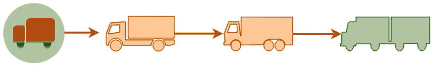

图 2.14：MVP 方法构建解决方案

一旦客户得到第一辆功能完备的交付卡车，他们就能判断是否需要更强大或更大的卡车来处理更大的负载。基于此，制造商可以制造 6 轮、10 轮或 18 轮卡车拖车。这种逐步推进的方法提供了具备基本功能的工作产品，客户可以使用这些产品，团队也可以根据客户需求继续在其基础上构建。

你可以看到，MVP（最小可行产品）方法如何帮助高效利用有限资源，从而为高质量产品开发争取更多时间并明确范围，这与一种方法相比显得更加高效：在我们第一次到达时，发现只需要一辆 6 轮卡车而不是一辆 18 轮卡车。将工作的产品尽早交到客户手中，可以让你更清楚地了解需要在哪些方面进行投资。由于你的应用程序已经开始产生收入，你可以展示使用案例，以便根据需要申请更多资源。

# 总结

本章为你提供了设计原则的深入概述，这些原则是构建有效且高效系统所必需的。最初，我们探讨了可扩展架构设计，详细介绍了预测性和反应性扩展策略，并讨论了扩展架构的技术，包括静态内容策略、应用服务器扩展的会话管理以及数据库扩展。我们还讨论了弹性的意义。

本章接着探讨了如何构建高可用性和高韧性的架构，强调了容错的必要性，并利用可替换资源来设计强健的系统架构。专门有一节讨论了性能，强调了如何在不同条件下构建性能最优的系统。

接下来讨论了松耦合的原则，强调了它在现代设计中的重要性，随后介绍了“服务而非服务器”的方法，这是无服务器计算范式的核心。本章还强调了数据驱动设计的重要性，通过数据来做出关于系统架构的明智决策，并探讨了架构中对强大安全性的需求。此外，还讨论了应用程序设计中可用性和可访问性的重要性。

构建面向未来的、可扩展的架构是接下来的议题，重点讨论了架构的互操作性和可移植性，以确保系统能够随着需求变化不断发展和适应。讨论了在系统架构的各个方面应用自动化，以提高效率并减少错误率。

强调了操作设计，特别是系统维护和更新的简便性。最后，本章讨论了克服架构限制的挑战，并提供了识别和缓解特定系统设计限制的策略。MVP 方法也被作为一种工具，快速验证架构选择。

在下一章中，你将深入探讨云迁移所必需的各种策略和方法，重点介绍企业如何将其基础设施、应用程序和数据迁移到云端。此外，本章还将涵盖设计和实施混合云架构的复杂性，混合云架构将本地基础设施与云服务结合，提供灵活且可扩展的解决方案。

# 留下评论！

喜欢这本书吗？通过在亚马逊上留下评论，帮助像你一样的读者。扫描下面的二维码，获取你选择的免费电子书。

