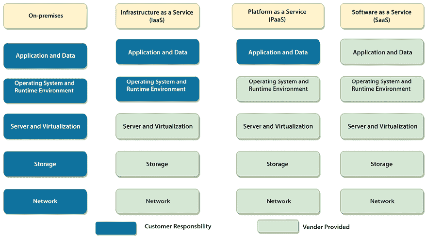
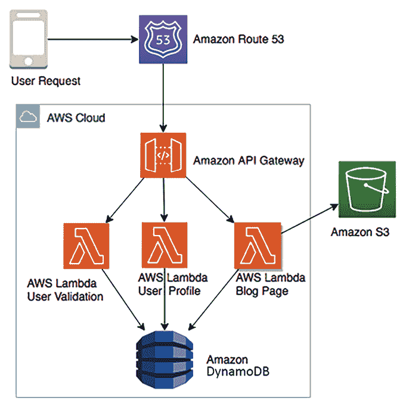
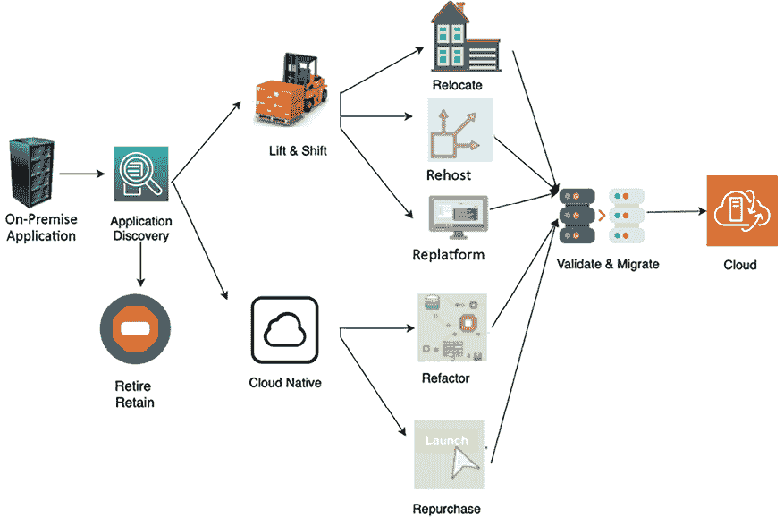
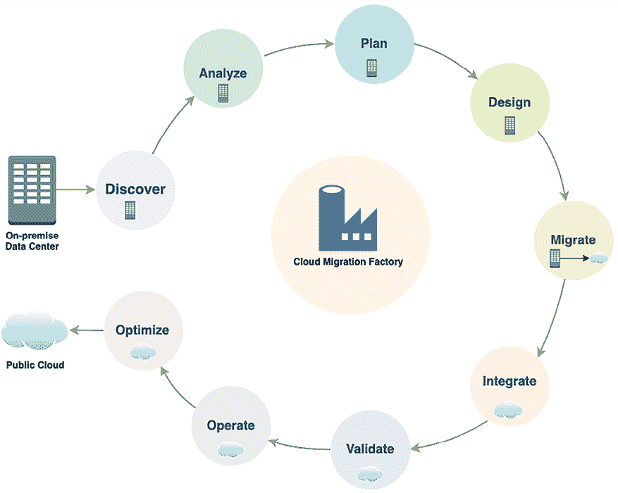
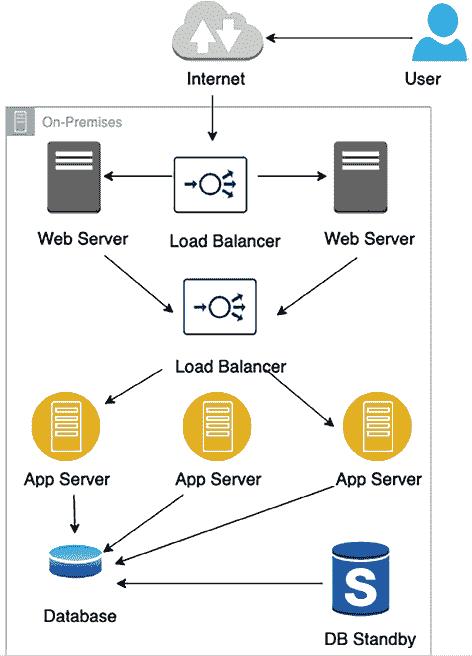
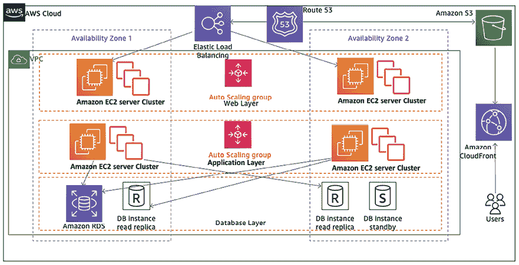
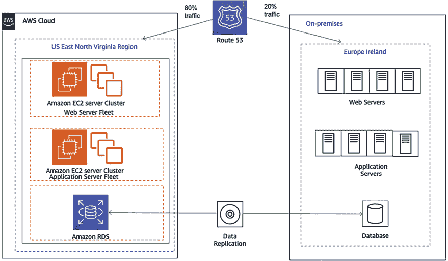
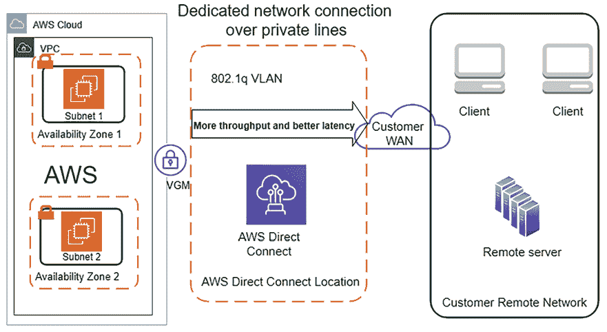
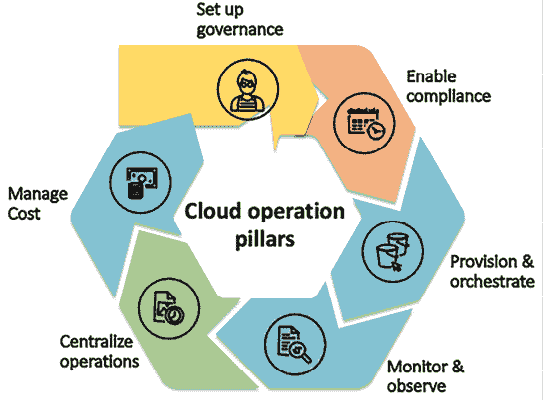

# 3

# 云迁移与云架构设计

组织必须不断吸引新客户，满足他们的需求，同时在激烈的竞争环境中工作。如今，组织必须更具灵活性以应对日益增长的客户需求，这要求它们能够迅速扩展以应对数百万客户，并在需要时缩减规模而不影响预算。云迁移可能是实现灵活性和速度的解决方案。云端能够频繁发布应用程序，并通过应用自动化和数据中心整合来降低成本。

云计算已成为每个企业战略的核心。大多数组织通过迁移到公有云来减少开支，除了节省成本外，还将前期资本支出转变为运营支出。许多在过去十年中诞生的初创公司都起步于云端，并借助*云基础设施*实现快速增长。随着企业迁移到云端，它们必须关注云迁移策略和混合云。

公有云，如**Amazon Web Services**（**AWS**）、**Microsoft Azure**和**Google Cloud Platform**（**GCP**），正在成为托管应用程序的主要目标，因此了解迁移到云端的策略和方法至关重要。在本章中，你将了解云的各个方面，并培养“云思维”，这将帮助你更好地理解后续章节。

本章涵盖以下主题：

+   公有云、私有云和混合云

+   公有云中的解决方案架构

+   云原生架构

+   创建云迁移策略

+   选择云策略

+   云迁移步骤

+   云端应用优化

+   创建混合云架构

+   采用多云策略

+   实施 CloudOps

到本章结束时，你将了解到云的好处，并理解不同的云迁移策略和步骤。你还将学习到混合云设计、采用多云策略以及实施 CloudOps。

# 公有云、私有云和混合云

有三种不同类型的云模型：公有云、私有云和混合云。

**公有云**基于标准计算模型，在该模型中，服务提供商通过互联网向客户提供如**虚拟机**（**VMs**）、应用程序和存储等资源。在云计算模型中，公有云供应商提供按需可用的 IT 资源，如服务器、数据库、网络和存储，组织可以通过安全的基于 Web 的界面或通过互联网的应用程序来使用这些资源。公有云服务提供*按需付费*模式，在大多数情况下，客户只需为他们正在使用的服务付费，按使用时长计费，通过优化 IT 资源减少闲置时间，从而节省成本。

你可以将公共云视为一种电力供应模型，在这种模型中，你打开灯并仅为你使用的电量按单位付费。你从关掉灯的那一刻起就不再付费。它让你远离了使用涡轮机发电、维护设施资源以及建立庞大基础设施的复杂性，你以一种简化的方式使用整个服务。

除了成本优势外，主要的公共云提供商，如 AWS、GCP、Microsoft Azure、阿里云和 Oracle Cloud Platform (OCP)，通过云扩展他们的技术平台，帮助推动创新。这些公共云提供商已经掌握了可扩展性和面向未来的架构，提供全面的机器学习和分析功能。通过公共云，你可以访问这些前沿技术，并选择使用它们来推动你的架构发展。

**私有云**，或称**本地云**，是由单个组织注册、拥有并访问的。私有云作为公司现有数据中心的复制或扩展。相比之下，公共云有共享租户，这意味着来自多个客户的虚拟服务器共享同一物理服务器；然而，如果客户需要满足许可证或合规性需求，公共云也提供专用的物理服务器。

第三种模型是**混合云**，大企业使用它将工作负载从本地迁移到云，企业可能仍然有一些无法直接迁移到云的遗留应用，或者他们可能有需要保留在本地的许可应用——有时由于合规性原因，他们需要在本地保护数据。在这种情况下，混合模型能够帮助企业保持部分环境在本地，并将其他应用迁移到公共云。有时，组织将测试和开发环境迁移到公共云，并将生产环境保留在本地。混合模型的应用可能会根据组织的云战略有所不同。

由于市场上有多个公共云提供商，你可能会看到**多云**趋势，企业选择将工作负载分布在不同的公共云供应商之间，以最大化每个云技术的优势，或根据团队的技能集为他们提供选择。

让我们进一步了解公共云，以及它如何成为企业的关键技术平台。

# 公共云中的解决方案架构

云中的解决方案架构变得越来越重要，随着更多企业选择将工作负载迁移到云，这一趋势正在成为“新常态”。公共云已成为推动初创企业增长的关键因素，因为它们只需要较少的前期投资，而无需像本地解决方案那样进行大量前期投资。这使得企业能够像进行实验一样运作，并具备敏捷性和创新性。

云计算架构的好处在于，您可以全面查看所有架构组件，包括前端平台、应用开发平台、服务器、存储、数据库、自动化、交付以及管理整个解决方案景观所需的网络。

让我们更深入地了解公共云架构。

## 公共云架构

公共云的典型定义是通过互联网和私人网络访问的完全虚拟化环境。然而，公共云供应商最近开始提供本地物理基础设施，以实现更好的混合云采用。公共云提供多租户模型，其中 IT 基础设施（如存储和计算能力）在多个客户之间共享；但在软件和逻辑网络层面是隔离的，不会干扰彼此的工作负载。组织可以在公共云中创建网络级隔离，使其虚拟私有云等同于逻辑数据中心。鉴于组织的监管需求，公共云还提供专用的物理实例；然而，这也可以通过网络访问，但这是一个不太常见的选项。

公共云存储通过使用多个数据中心和强大的数据复制实现高耐用性和可用性的冗余模型。这使其实现了架构的弹性和轻松扩展性。

有三种主要的公共云计算模型，如*图 3.1*所示。为了比较，还显示了本地解决方案。

图 3.1：云计算模型类型

在*图 3.1*中，您可以比较本地环境中客户的责任与云计算服务模型。在本地环境中，客户必须管理一切，而在云计算模型中，客户可以将责任转移到供应商，并专注于其业务需求。以下是不同云计算模型下提供的服务的高级详细信息：

+   **基础设施即服务**（**IaaS**）：在这里，云供应商提供基础设施资源，如计算服务器、网络组件和数据存储空间，作为托管服务。它帮助客户使用 IT 资源，无需担心处理数据中心的诸多开销，如加热与冷却、机架堆叠、物理安全等。

+   **平台即服务**（**PaaS**）：PaaS 模型增加了一层服务，云供应商负责您开发平台所需的资源，如**操作系统**（**OS**）、软件维护和打补丁，以及基础设施资源。PaaS 模型通过为您处理平台维护的负担，帮助您的团队专注于编写业务逻辑和处理数据。

+   **软件即服务**（**SaaS**）：SaaS 模型在 PaaS 和 IaaS 模型之上增加了一层抽象，其中云或软件供应商提供现成的软件服务，你为此支付费用。例如，你使用的电子邮件服务如 Gmail、Yahoo Mail、AOL 等，提供了自己的电子邮件空间作为服务，你无需担心底层的应用或基础设施。

第四种新兴模型是**函数即服务**（**FaaS**）模型，这一模型在构建无服务器架构中越来越受到欢迎，通过使用包括 AWS Lambda 在内的服务。你将在*第五章*，*云原生架构设计模式*中学习到更多关于无服务器架构的细节。让我们快速回顾一下公共云服务提供商的概况。

## 主要的公共云服务提供商

全球云市场主要由四大云服务提供商主导。根据 Statista 2023 年的报告，AWS 以 32%的市场份额领先，提供包括计算、存储、网络、数据库、分析、机器学习和人工智能在内的广泛云服务。AWS 在本书中作为示例进行说明。

微软 Azure 紧随其后，市场份额为 24%，在企业应用和混合云计算方面表现出色。GCP（Google Cloud Platform）市场份额为 11%，并且增长迅速，尤其在机器学习和人工智能领域享有盛誉。阿里云以 4%的市场份额位列第四，在亚太地区表现突出。这四大提供商占据了全球云市场超过 70%的份额。其他重要参与者包括 Oracle、IBM Cloud、腾讯云和 Salesforce。你可以在此参考详细报告：[`www.statista.com/chart/18819/worldwide-market-share-of-leading-cloud-infrastructure-service-providers/`](https://www.statista.com/chart/18819/worldwide-market-share-of-leading-cloud-infrastructure-service-providers/)。

由于公共云的功能和收费模式截然不同，我们来学习如何开发云原生架构设计方法。

## 云原生架构

随着云计算的普及，云原生（或基于云的）架构优化了系统架构，以适应云的能力。典型的本地架构通常是为固定基础设施构建的，因为添加新的 IT 资源（如服务器和计算能力）往往需要花费大量的时间、成本和精力。然而，云计算是按使用量收费的，并通过自动化提供便利，例如按需扩展或缩减服务器，而无需担心漫长的采购周期。云原生架构专注于实现按需扩展、分布式设计，并替换失败的组件，而不是修复它们。

在云原生架构中，你不断地创建自动化操作，以实现恢复、可扩展性、自我修复和高可用性，利用云的**持续集成** (**CI**)、部署和基础设施自动化能力。这鼓励你在成本和性能方面不断优化应用程序，使用每天发布和改进的最新云能力。

公有云提供商允许全球基础设施覆盖世界各地，从而帮助应用程序在接近用户群体的地方进行全球扩展。为了鼓励采用，所有云服务都提供免费的基础服务，并附有大量学习资源，让你可以尝试并发展你的知识。

*云原生方法*帮助员工发展创新思维，并立即实施他们的想法，而不是等待长期的基础设施周期。

借助云计算，客户无需为应对高峰期（如零售商的假日购物季节）而规划过剩的容量；他们可以利用云的弹性，根据需求即时配置资源。这大大有助于降低成本，并改善客户体验。任何想要保持竞争力的组织，都必须快速创新。

云计算使企业能够快速在全球范围内部署基础设施，并访问以前无法使用的各种技术。这些技术包括以下前沿技术：

+   大数据和分析

+   机器学习和人工智能

+   **物联网** (**IoT**)

+   区块链

+   生成式人工智能

构建云解决方案架构不同于常规的企业架构。在迁移到云的过程中，你必须培养云思维，并理解如何利用云的内建能力。对于云思维，你需要遵循*按需付费*模式，这意味着你需要确保正确优化工作负载，并且只在需要时运行服务器。

在云中，解决方案架构师必须全面考虑每个组件的性能、扩展性、高可用性、灾难恢复、容错性、安全性和自动化等方面。

其他优化领域包括**云原生监控**和**警报机制**。你可能不需要将现有的第三方监控工具从本地带到云端，因为你可以更好地利用原生云监控，避免昂贵的第三方许可软件。此外，你现在可以在几分钟内将部署能力扩展到世界任何地方。不要局限于某个特定区域；利用全球部署模型来构建更好的高可用性和灾难恢复机制。

云提供了出色的自动化方案；*你可以自动化一切*。自动化减少了错误，加快了市场推出的时间，并通过高效利用人力资源并将其从繁琐重复的任务中解放出来，节省了大量成本。

云采用*共享责任模型*，其中云服务提供商负责保护物理基础设施。然而，应用程序及其数据的安全性完全由客户负责。因此，重要的是要锁定您的环境，并通过使用云原生工具进行监控、警报和自动化来密切关注安全性。

## 设计云原生架构

每个组织可能对云原生架构有不同的看法，但从本质上来说，云原生就是以最好的方式利用所有云服务功能。真正的云原生架构是从应用程序的基础设计开始，让它从一开始就适合云平台构建。

云原生并不意味着将应用程序托管在云平台上；而是要利用云提供的服务和功能。这可能包括以下内容：

+   将单体架构容器化为微服务，并为自动化部署创建 CI/CD 流水线。

+   使用技术如 AWS Lambda FaaS 和 Amazon DynamoDB（云中的托管 NoSQL 数据库）构建无服务器应用程序。

+   创建无服务器数据湖，例如，使用 Amazon S3（托管对象存储服务）、AWS Glue（托管 Spark 集群用于 ETL）和 Amazon Athena（托管 Presto 集群用于临时查询）。

+   使用云原生监控和日志服务，例如，Amazon CloudWatch。

+   使用云原生审计服务，例如，AWS CloudTrail。

以下图示为一个云原生无服务器架构示例，用于微博客应用程序：

图 3.2：云原生微博客应用架构

上述图示展示了如何在 AWS 云中利用云原生无服务器服务。在这里，管理 DNS 服务的 Amazon Route 53 负责路由用户请求。Lambda 作为服务来处理用户验证、用户资料和博客页面的代码。所有博客资产存储在管理对象存储服务的 Amazon S3 中，所有用户资料数据存储在由 NoSQL 数据库管理的 Amazon DynamoDB 中。

当用户发送请求时，AWS Lambda 验证用户并查看其个人资料，确保他们在 Amazon DynamoDB 中有订阅；然后，它从 Amazon S3 中获取博客资产，如图片、视频和静态 HTML 写作，并将其展示给用户。由于所有服务都是云原生托管服务，并且您不需要处理任何基础设施，因此此架构可以以无限的方式进行扩展。

关键因素如高可用性、灾难恢复和可扩展性由这些云原生服务保障，这样你就可以专注于功能开发。在成本方面，只有当请求访问博客应用时，你才需要付费。如果晚上没有人浏览博客，你将不需要为托管代码支付任何费用，只需支付名义上的存储费用。

云原生架构的好处在于，它能够促进快速创新并提高团队的敏捷性。它简化了构建复杂应用和基础设施的过程。当你专注于设计和构建网络、服务器、文件存储和其他计算资源时，可以将物理实现交给你的云计算服务提供商。

其他云原生架构的优势包括：

+   **按需快速扩展**：你可以在需要时请求所需的资源。你只需为实际使用的部分付费。

+   **快速复制**：基础设施即代码意味着你可以一次构建并多次复制。你不再需要手动构建基础设施，而是可以将其结构化为一系列脚本或应用程序。通过程序化构建基础设施，你可以按需构建和重建它，满足开发或测试的需求。

+   **轻松拆卸和重建**：在云中，服务是按需提供的，因此建立一个大型实验系统非常简单。你的系统可能包括一个可扩展的 Web 和应用服务器集群、多个数据库、数 TB 的存储空间、工作流应用和监控。实验完成后，你可以将其拆除，从而节省成本。

在存储、网络和自动化领域，还有许多其他构建云原生架构的例子。你将在*第五章*，*云原生架构设计模式*中学到更多关于此架构的内容。

在本书中，你将学习到解决方案架构的云视角，并深入理解云架构。在下一节中，你将了解各种云迁移策略。

# 创建云迁移策略

你的云策略帮助你确定迁移策略并优先考虑应用程序。这些是促发云迁移和混合云策略倡议的一些原因：

+   数据中心需要技术更新

+   数据中心的租约即将到期

+   数据中心的存储和计算能力已耗尽

+   应用程序现代化

+   利用前沿技术，如生成性 AI、高级分析、机器学习、物联网等

+   需要优化 IT 资源以节省运营成本

+   灾难恢复规划和操作韧性

+   利用内容分发网络来优化网站

+   降低前期资本支出并消除维护成本

+   提高员工效率和生产力

+   提高业务敏捷性

每个组织都有不同的战略，在云迁移方面，没有“一刀切”的解决方案。常见的用例是将开发和测试环境放在云端，为开发人员提供更高的敏捷性，以便他们更快地行动。随着托管 Web 应用程序在云端变得更加经济和简便，组织正在通过将其网站和数字资产托管在云端，利用云进行数字化转型。

对于应用程序的可访问性，不仅需要为 Web 浏览器构建应用程序，还要确保其能够通过*智能手机*和*平板电脑*进行访问。云正在助力这种转型。数据处理和分析是企业利用云的另一个领域，因为在云中收集、存储、分析和共享数据更加便宜和高效。

云迁移不仅仅是选择平台、安全设计和运营；您还需要考虑人员、流程和文化，除了技术之外。为了确保云迁移的成功，您必须与领导对齐，并通过提升技能来获得团队的承诺。您需要在整个组织中定义愿景，以确保云转型的成功。

通常，迁移项目会采用多种策略，并根据不同的工具进行调整。迁移策略将影响迁移所需的时间，以及应用程序在迁移过程中如何进行分组。下图展示了将现有应用程序迁移到云端的一些常用策略：

图 3.3：云迁移策略

如上图所示，您可以将服务器或应用程序进行**提升与迁移**，将其从源环境转移到云端。迁移资源时，只需要进行最少的更改即可使其在云端正常工作。如果采取更加**云原生**的方法，您可以重构应用程序，以充分利用云原生功能，例如，将单体应用程序转换为微服务。

如果您的应用程序是无法迁移或不兼容云的遗留应用程序，您可能需要将其淘汰，并用云原生的 SaaS 产品或第三方解决方案替代。

一个组织可以采用多种迁移策略；例如，如果应用托管的操作系统已到达生命周期末期，您需要升级它。您可以借此机会迁移到云端以获得更好的灵活性。在这种情况下，您很可能会选择**重新平台**的方法，将代码重新编译成操作系统的新版本，并验证所有功能。测试完成后，您可以将应用程序迁移到云端提供的服务器操作系统。如果您想购买一个新的平台，例如，用 Salesforce 提供的基于 SaaS 的解决方案替代您的旧**客户关系管理**（**CRM**）系统，您可以选择**退役并重新购买**策略。如果您想将应用程序从单体架构重构为微服务以增加灵活性，您可以选择**重构**。

您的业务目标将推动您决定迁移应用程序，并根据优先级定义迁移策略。例如，当成本效益是主要驱动力时，迁移策略通常包括大规模迁移，并重点采用**提升与迁移**方法。然而，如果主要目标是实现灵活性和创新，云原生方法（如重构和重架构）在云迁移策略中发挥着至关重要的作用。让我们在接下来的小节中详细了解每种策略。

## 提升与迁移

**提升与迁移**是最快的迁移模式；它只需要很少的工作来移动您的应用程序。然而，这种模式需要利用云原生功能。让我们看看最常用的迁移策略（**重托管**、**重新平台**和**迁移**），这些策略通常用于提升与迁移。

### 重托管

重托管速度快、可预测、可重复且经济实惠，这使得它成为迁移到云端的首选方法。重托管是最快的云迁移策略之一，其中服务器或应用程序从源本地环境被提升并迁移到云端。迁移过程中对资源进行的修改很少。

客户常常使用重托管技术快速将应用迁移到云端，然后在资源在云中运行时专注于优化。这项技术使他们能够实现使用云计算的成本效益。

客户通常使用重托管技术来实现以下目的：

+   临时的开发和测试环境

+   当服务器运行打包软件时，如 SAP 和 Microsoft SharePoint

+   当应用程序没有活跃的路线图时

虽然重托管通常适用于打包软件，帮助您快速迁移到云端，但您可能需要升级底层应用平台，如操作系统。在这种情况下，您可以使用云迁移中的重新平台方法。

### 重新平台

当操作系统、服务器或数据库版本达到生命周期的尽头时，可能会触发云迁移项目，例如，将你的 Web 服务器操作系统升级到 Microsoft Windows 2022，或将数据库升级到 Oracle 23c 等。此策略涉及在云迁移项目中升级平台，而不改变应用程序架构。你可以决定将操作系统或应用程序更新到较新的版本，作为迁移的一部分。

当使用重新平台迁移策略时，你可能需要在目标环境中重新安装应用程序，这会触发应用程序的变更。重新平台后，需要对应用程序进行全面测试，以确保和验证其迁移后的运营效率。

以下常见原因需要使用重新平台技术：

+   将操作系统从 32 位更改为 64 位

+   更改数据库引擎

+   更新应用的最新版本

+   升级操作系统

+   升级数据库引擎

+   为了获得云供应商提供的托管服务的好处，如托管存储、数据库、应用部署和监控工具

重新平台有助于在迁移到云的同时推动应用程序的底层平台升级。如果你的应用程序部署在容器或 VMware 中，可以将其迁移到云。现在，让我们深入了解迁移策略。

### 迁移

你可能在本地数据中心使用容器或 VMware 设备部署应用程序。你可以使用加速迁移策略：**迁移**，将这些工作负载迁移到云。迁移可以帮助你在几天内移动数百个应用程序。你可以基于 VMware 和容器技术，轻松、快速地将应用程序迁移到云。

重新定位策略只需要少量的前期开发者投入或测试计划，因为它提供了你期待的云的敏捷性和自动化。你需要确定现有的配置，并使用 VMotion 或 Docker 将服务器迁移到云。你将在*第六章*，*性能考虑*中学习更多关于 Docker 的内容。

VMotion 以实时迁移而闻名。它是 VMware 的一项技术，可以将虚拟实例从一台物理主机服务器迁移到另一台，而不会中断服务。

在将应用程序迁移到云时，你可能希望借此机会重新构建和重新设计整个应用程序，使其更加云原生。云原生方法使你能够充分利用云的全部能力。让我们进一步了解云原生方法。

## 云原生方法

当你的团队决定迁移到云原生时，短期内看起来似乎需要更多的前期工作，并且向云的迁移速度较慢。这有点昂贵，但从长远来看，当你使用所有云的优势，并与敏捷团队一起进行创新时，它是值得的。

采用云原生方法后，你将看到成本随着时间的推移大幅下降，因为你可以根据适当的价格优化工作负载，同时保持性能不变，采用*按需付费*模式。云原生方法包括通过将应用程序架构转为微服务或选择纯粹的无服务器架构来进行容器化。

让我们更深入了解云原生迁移方法中的重构和重新购买策略。

### 重构

重构方法涉及在将应用程序迁移到云端之前重新架构和重写应用程序，使其成为云原生应用程序。在重构过程中，你将应用程序更改为更模块化的设计，例如从单体架构转为微服务架构。重构为微服务帮助组织创建小型独立团队，能够完全负责各自的服务，从而提高创新速度。

云原生应用程序是专门设计、架构和构建以便在云环境中高效运行的应用程序。这些云固有能力的好处包括*可扩展性*、*安全性*、*敏捷性*和*成本效益*。

重构需要在迁移之前花费更多的时间和资源来重新编码应用程序和架构。这种方法通常被拥有丰富云计算经验或高技能劳动力的组织采用。重构的另一种选择是将应用程序迁移到云端后再进行优化。你可以使用云原生的无服务器技术来减少模块化设计的管理开销。

重构的常见示例包括以下内容：

+   更换平台，例如从 AIX 转为 Unix

+   从传统数据库过渡到云数据库

+   替换中间件产品

+   将应用架构从单体架构转为微服务架构

+   重建应用架构，例如容器化或采用无服务器架构

+   重新编码应用组件

+   数据仓库现代化，以便将组织与客户连接起来

决定是否将应用程序重新架构为微服务，或重建以适应容器化或无服务器架构，需要仔细考虑组织的战略目标、成本影响和技术能力。将应用架构转为微服务能够提供更强的可扩展性和灵活性，使每个服务能够独立开发、部署和扩展，这对于长期的敏捷性和效率具有显著的好处。然而，这种方法可能涉及大量的重构，并且在服务协调和网络通信方面可能引入复杂性。另一方面，重建架构以采用容器化或无服务器模型可以简化操作、减少基础设施开销，并提高部署速度，尽管这需要在开发上的初期投资，并且团队可能面临学习曲线。

决策应考虑应用程序与新架构的兼容性、团队的专业技能，以及对性能和可靠性的潜在影响。虽然微服务可以改善故障隔离并促进更细粒度的资源管理，容器化和无服务器架构则可以优化资源使用，并有可能降低成本。安全性和合规性也是关键考虑因素，因为每种架构风格都会带来独特的挑战，必须主动应对。

有时会投入大量精力重建一个应用程序。作为架构师，你应评估购买 SaaS 产品是否能为你带来更好的**投资回报**（**ROI**）。让我们更详细地探讨一下重新购买策略。

### 重新购买

当你的 IT 资源和项目迁移到云时，可能需要一些服务器或应用程序，这要求你购买与云兼容的许可证或版本。例如，在云中运行应用程序时，可能需要验证当前本地部署的许可证。

解决此类许可问题有多种方式。你可以购买新的许可证并继续在云中使用你的应用程序，或者放弃现有许可证并用另一个云中的许可证替换它。此替换可能是相同应用程序的 SaaS 版本。

云可能并非所有问题的解决方案，有时你会发现一个遗留的应用程序可能无法从云迁移中获益，或者发现一些很少使用的应用程序可以退役。

**工作负载优化**

工作负载优化是云迁移和架构设计中的一项战略过程，专注于将相似的服务整合以简化操作并提高效率。该方法涉及评估并合并不同的系统，例如将多个 CRM 系统合并为一个统一的解决方案。其目标是消除冗余、降低复杂性，并优化整个组织 IT 环境中的资源利用。

在许多公司中，工作负载优化是一项关键任务，它指导决策者决定哪些应用程序应该保留、更新、退役或合并。这个过程不仅有助于简化技术架构，还能将 IT 资源与业务目标对齐，确保每项服务都是必要的、高效的，并有助于实现组织的整体目标。通过优化，公司可以实现更加灵活、成本效益高且可扩展的 IT 基础设施，这在云迁移和混合云架构中尤为重要，因为在这些环境中，效率和适应性至关重要。

接下来，让我们更详细地了解一下*保留或退役策略*。

## 保留或退役

在规划云迁移时，可能只需要迁移某些应用程序。由于技术限制，您可能需要保留一些应用程序；例如，可能有与本地服务器耦合的遗留应用程序无法迁移。另一方面，您可能会退休一些应用程序，并利用云原生的功能，例如第三方应用程序监控和告警系统。让我们了解更多关于保留或退休策略的信息。  

### 保留  

在您的本地环境中，您可能会遇到一些对业务至关重要，但由于技术原因（例如操作系统或应用程序在云平台上不受支持），不适合迁移的应用程序。在这种情况下，您的应用程序不能迁移到云端，但您仍然可以继续在本地环境中运行它。  

对于这些服务器和应用程序，您可能只需要进行初步分析，以确定它们是否适合云迁移。然而，这些服务器或应用程序可能仍然与已迁移的应用程序存在依赖关系。因此，您可能需要保持这些本地服务器与云环境之间的连接。在本章的*创建混合云架构*部分，您将进一步了解本地与云的连接。  

您可能希望保留复杂的遗留系统在本地，并优先处理它们，以便稍后迁移；然而，在发现阶段，组织经常会找到一些不再使用但仍然存在并占用基础设施空间的应用程序。您可以选择退休这些应用程序。让我们深入了解一下退休策略。  

### 退休  

在迁移到云端时，您可能会发现以下情况：

+   很少使用的应用程序  

+   消耗过多服务器资源的应用程序  

+   由于云不兼容可能不再需要的应用程序  

在这种情况下，您可以退休现有的工作负载，并采取更适合云原生的全新方法。  

退休策略可以应用于即将停用的主机和应用程序，也可以应用于不必要和冗余的托管应用程序。根据您的业务需求，这些应用程序可以在本地停用，而无需迁移到云端。通常适合退休的主机和应用程序包括以下内容：  

+   用于灾难恢复的本地服务器和存储  

+   服务器整合以解决冗余问题  

+   由于并购产生的重复资源  

+   典型高可用性设置中的替代主机  

+   作为云内置功能提供的第三方授权工具（如工作负载监控和自动化）  

大多数迁移项目都会采用多种策略，每种策略都有不同的工具可供选择。迁移策略将影响迁移所需的时间以及应用程序在迁移过程中如何分组。云迁移是检查你整体资源清单并清除未被记录的“幽灵服务器”的好时机。在这一部分，你学习了各种云迁移策略。接下来，我们来快速比较一下这些策略。

# 选择云迁移策略

选择适合自己业务需求的云迁移策略至关重要。需要考虑财务、资源、时间和技能等各种约束条件。你可以通过下表对比前一部分讨论的不同策略所需的努力。表格中的条形图展示了每种策略所需的时间与成本，以及优化机会的程度。

| 迁移策略 | 描述 | 时间与成本 | 优化机会 |
| --- | --- | --- | --- |
| **重构** | 重新设计应用程序，使其更模块化，变得云原生 |  |  |
| **重新平台化** | 将应用程序迁移到升级后的平台，但不改变核心架构 |  |  |
| **重新购买** | 通过购买云基础解决方案来替代当前环境 |  |  |
| **重新托管** | 快速将应用程序迁移到云端，而无需改变架构 |  |  |
| **保留** | 暂时将应用程序保留在本地 |  | 无 |
| **重新定位** | 快速将应用程序迁移到云端，无需进行任何更改 |  | 无 |
| **停用** | 识别不再有用的资源并彻底移除 | 无 | 无 |

表 3.1 – 云迁移策略对比

云迁移虽然提供了可扩展性、灵活性和成本效益等众多好处，但也伴随有一定的风险。组织必须意识到这些潜在的陷阱，以便有效地进行规避。可能的风险包括：

+   **数据丢失与泄露**：在迁移过程中，如果没有正确的加密和管理，敏感数据可能面临泄露风险。在迁移过程中确保数据完整性和安全性对于防止数据泄露至关重要。

+   **停机时间**：迁移可能会导致系统停机，影响业务运营。通过分阶段规划和执行迁移，或在非高峰时段进行迁移，可以最小化对业务连续性的影响。

+   **成本超支**：如果没有适当的规划和对云定价模型的理解，组织可能会面临意外的费用。因此，制定明确的迁移路线图和预算至关重要。

+   **性能问题**：由于架构差异或不可预见的兼容性问题，应用程序在云中的初始表现可能不如预期。迁移后需要进行严格的测试和优化。

+   **技能差距**：组织内缺乏云计算专业知识可能会妨碍迁移过程和未来的运营。投资培训并可能聘请专家可以降低这一风险。

+   **互操作性和集成挑战**：确保现有系统和应用程序与云服务无缝协作可能非常复杂，需采用强大的集成和测试策略。

+   **合规性**：遵守行业法规和合规标准在云环境中可能是一个挑战，尤其是当组织处于高度监管的行业时。

+   **供应商锁定**：过度依赖单一云服务商的技术和服务可能导致将来更换供应商时的困难，可能影响灵活性和成本效益。

为了减少与云迁移相关的风险，通常建议在将应用程序迁移到云时采取分阶段的方法。首先，优先考虑业务功能，并优化应用程序以实现成本节省、性能提升和资源生产力的差异。尽量先进行迁移；然后，在后续阶段，你可以进行优化。例如，如果你正在迁移一个使用 MS SQL 数据库的应用程序，并用云原生数据库（如 Amazon Aurora 或 Azure SQL）替换它，最佳做法是先迁移应用程序，在第二阶段迁移数据库，同时监控风险和应用程序的稳定性。你可以在后续步骤中使用云原生无服务器技术栈（如 AWS Lambda、Amazon API Gateway 和 Amazon DynamoDB）来优化你的应用程序。

迁移策略应定义为便于快速执行，允许团队独立工作。云迁移策略可能影响其他组织因素，例如在组织内部构建工程职能，而不是外包。迁移到云还为组织内采用或增强 DevOps 文化提供了一个绝佳机会。这种文化强调开发和运维团队之间的协作，简化工作流程，提高效率。

组织通常会发现，通过应用程序发现来准备迁移的过程中，优化工作负载和加强安全性是意外的好处。

云迁移涉及多个阶段。在下一部分，你将学习云迁移的步骤。

# 云迁移步骤

在上一节中，您了解了不同的迁移策略，并且可能已经开始将应用程序分组，以应用合适的迁移技术。这些策略也被称为 7Rs（保持、退休、重新定位、重新托管、重新购买、重新平台化和重构），这些策略中的某些或所有都可能是您云迁移旅程的一部分。

由于您可能需要迁移和管理多个应用程序到云中，因此建议设置一个云**卓越中心**（**CoE**），并通过云迁移工厂对这一过程进行标准化。云卓越中心包括来自组织各个 IT 和业务团队的经验丰富的人员，他们作为专门的云团队，致力于加速组织内部云技术的建设。云迁移工厂定义迁移流程和工具，以及需要采取的步骤，如下图所示：

图 3.4：云迁移步骤

如前面的图示所示，云迁移步骤如下：

+   **发现**：发现云迁移投资组合和本地工作负载

+   **分析**：分析发现的数据和工作负载

+   **规划**：规划迁移到云端并定义迁移策略

+   **设计**：根据迁移策略设计应用程序

+   **迁移**：执行迁移策略

+   **集成**：与其他应用程序和系统依赖项集成

+   **验证**：在迁移后验证功能

+   **运营**：规划在云中运营

+   **优化**：为云优化您的工作负载

云迁移项目的初始步骤之一是评估并优先考虑要迁移的应用程序。为此，您需要获取完整的 IT 资产清单，以确定哪些服务器、应用程序和业务单元适合迁移到云中，优先考虑迁移计划，并为这些应用程序确定迁移策略。让我们深入了解每个步骤并学习更多内容。

## 发现您的投资组合和工作负载

在迁移项目的发现阶段，您会发现并捕捉有关您的*云迁移投资组合*的详细数据，例如迁移项目的范围。您将识别投资组合中的服务器和应用程序，以及它们之间的相互依赖关系和当前的基准性能指标。此外，工作负载发现还包括理解以下组件：

+   **存储**：识别存储的数据量和类型，例如数据库和文件。例如，发现某个应用程序是否使用 1 TB 的块存储进行数据库操作。

+   **网络配置**：理解网络拓扑，包括子网、防火墙和负载均衡器。例如，识别某个应用程序是否分布在多个子网中，并具有特定的防火墙规则。

+   **安全性和合规性需求**：记录安全政策、数据保护机制和合规要求，例如识别应用程序必须遵守 GDPR，并对静态数据进行加密。

+   **应用发布频率**：了解新版本发布的频率，例如确定应用程序是否遵循每两周发布一次的发布计划。

+   **DevOps 模型**：了解集成和部署流程、使用的工具以及自动化程度。例如，注意到组织使用 Jenkins 进行 CI/CD，并且高度自动化了管道。

+   **升级路径**：记录处理事件和故障的流程，例如识别关键联系人和服务中断时的处理程序。

+   **操作系统维护和补丁**：了解操作系统更新的应用方式和时间，例如服务器是否每月自动打补丁，或是手动更新。

+   **许可要求**：识别需要维护或更新的任何软件许可证，例如检查应用程序是否使用了需要在云中进行核算的授权中间件。

+   **其他相关资产**：记录与工作负载相关的额外组件，如外部依赖、第三方服务或集成工具。例如，识别应用程序对外部支付网关服务的依赖。

除了帮助您设计和架构目标云环境并识别成本外，详细的发现过程还可以帮助识别当前应用程序中可能需要在迁移到云之前进行缓解的任何问题。

**组合发现**：识别所有参与云迁移项目的 IT 资产，包括服务器和应用程序、它们的依赖关系以及性能指标。

您还需要收集有关资源的业务细节，如资源的当前状态、应用程序的更新周期、应用程序的路线图以及服务器或应用程序的业务重要性。这些细节将帮助您确定迁移策略并制定迁移计划。在大多数组织中，这些细节由多个业务单元和团队维护。因此，在发现过程中，您可能需要与多个团队进行互动，如业务、开发、数据中心、网络和财务等。

需要理解的是，您的发现范围将取决于多种因素：

+   已经迁移到云的内容是什么？

+   存在什么应用程序依赖关系，以及相应的资源和资产？

+   云迁移的业务驱动因素是什么？

+   整个迁移项目的预计持续时间是多少？

+   迁移过程将分为几个阶段？

迁移项目的主要挑战之一是*确定应用程序之间的相互依赖性*，特别是当它们涉及到**输入/输出**（**I/O**）操作和通信时。随着组织因并购和扩展而不断增长，云迁移变得更加具有挑战性。组织往往无法获得以下完整信息：

+   服务器数量的清单

+   服务器规格，如操作系统类型和版本、内存、CPU 和磁盘

+   服务器利用率和性能指标

+   服务器依赖关系

+   总体网络详细信息

进行彻底的投资组合发现有助于回答如下问题：

+   哪些应用程序、业务单元和数据中心是迁移的理想候选者？

+   应用程序迁移到云端的适宜性如何？

+   迁移应用程序到云端可能面临的已知或未知风险是什么？

+   应该如何对应用程序进行迁移优先级排序？

+   应用程序依赖于哪些其他 IT 资产？

+   应用程序的最佳迁移策略是什么？

+   对于应用程序来说，是否更好有一些停机时间，而不是因其依赖关系和风险进行实时迁移？

市面上有多个工具可以帮助自动化发现过程，并提供更多不同格式的详细信息。这些工具可以根据各种特性进行分类，如部署类型、操作、支持以及发现和报告的数据类型。大多数现有的解决方案可以大致分为两类：

+   **基于代理的解决方案**，要求在服务器上安装其软件客户端以收集必要的详细信息。例如，在环境中的所有服务器上安装监控代理，以跟踪性能指标、软件清单和系统日志。

+   **无代理解决方案**，可能能够在不进行任何额外安装的情况下捕获这些信息。一个例子是使用基于网络的扫描工具，远程检查服务器的开放端口、运行的服务和漏洞，通过与现有的网络协议和管理接口进行交互来实现。

一些解决方案执行*端口扫描*，探测服务器或主机的开放端口。与此不同的是，另一些解决方案执行*数据包扫描*，通常涉及捕获并分析网络数据包以解码信息。这些工具也会根据发现数据的粒度、存储类型和报告选项有所不同。例如，一些工具可以提供更高层次的智能，超越网络层次，还能确定正在运行的应用程序类型。

发现过程的复杂性取决于组织的工作负载以及是否已经有良好维护的库存。发现过程通常会运行至少几周，以便收集有关环境的更全面的信息。一旦你发现了所有必要的信息，就需要对其进行分析。让我们更详细地看看分析步骤。

## 信息分析

信息分析对云迁移至关重要，因为它提供了对当前 IT 环境的详细了解，从而支持做出明智的决策。这项分析有助于确定哪些应用程序和工作负载适合迁移，评估它们与云环境的兼容性，并确定最优的云服务和架构。它还揭示了应用程序与基础设施之间的依赖关系，确保平稳过渡而不干扰业务操作。此外，深入的分析有助于预测和缓解潜在风险，优化资源分配，并预测成本，从而确保一次成本效益高且成功的云迁移。

要识别服务器和应用程序的依赖关系，你需要分析主机上的网络连接数据、端口连接、系统和进程信息。根据你的工具，你可以可视化服务器的所有联系，以识别其依赖关系，或者你可以运行查询，列出所有运行特定进程、使用特定端口或与特定主机通信的服务器。

要对服务器和应用程序进行迁移调度分组，你需要识别主机配置中的模式。通常，某些前缀会嵌入到服务器主机名中，以标识它们与特定工作负载、业务单元、应用程序或需求的关联。有些环境还会使用标签和其他元数据将这些细节与主机相关联。

要为目标环境调整资源大小，你可以分析服务器和应用程序的性能指标：

+   如果服务器被*过度配置*，你可以修改你的正确尺寸映射信息。你还可以通过利用服务器/应用程序的使用数据，而不是服务器规格来优化这个过程。

+   如果服务器被*配置不足*，你可能需要为该服务器分配更高的优先级，以便将其迁移到云端。

你可以结合你获得的洞察力与资源的可用性和业务需求，优先安排你的云迁移工作负载。这可以帮助你确定每个云迁移冲刺中包括的服务器数量。

基于对云迁移组合的发现和分析，您可以为您的应用程序确定合适的云迁移策略。例如，复杂性较低并且运行在受支持操作系统上的服务器和应用程序可能是提升和迁移策略的合适候选者。运行在不受支持操作系统上的服务器或应用程序可能需要进一步分析，以确定合适的策略。

迁移项目的下一个阶段是*规划云迁移*。在这一阶段，您将利用在组合发现阶段和分析阶段收集的信息来创建一个高效的迁移计划。让我们更详细地了解迁移规划。

## 创建迁移计划

在云迁移项目中，发现、分析和规划是紧密集成的。您需要全面发现云迁移组合，并分析数据以创建迁移计划。在分析阶段结束时，基于您的分析和从业务负责人那里收集的详细信息，您应该能够对每个服务器/应用程序执行以下操作，这些服务器/应用程序是您云迁移组合的一部分：

+   根据您组织的云采纳战略选择迁移策略。您可能会在保留、退休、重新定位、重新购买、重新托管、重新平台化和重构策略中受到特定选择的限制。

+   为迁移资源到云端分配优先级。最终，所有属于云迁移组合的资源都可能迁移到云端，但这个优先级将决定迁移的紧急性。优先级较高的资源可能会在迁移计划中更早地迁移。

+   记录迁移资源到云端的业务驱动因素，这将推动迁移资源到云端的需求和优先级。

规划利用在发现和分析阶段收集的信息来创建迁移波次。波次是资源的逻辑分组，可以在云迁移过程中按顺序部署到生产环境和测试/开发环境中。

在迁移项目的这一阶段结束时，您应该能够创建一个有序的应用程序待迁移列表，这些应用程序可以迁移到云端。

除了选择迁移策略外，迁移规划阶段的主要目标还包括以下内容：

+   定义迁移的成功标准

+   确定云中资源的合适大小

+   确定迁移到云端的应用程序的优先级

+   确定迁移模式

+   创建详细的迁移计划、检查清单和时间表

+   创建迁移冲刺团队

+   确定迁移工具

冲刺和待办事项是敏捷和 Scrum 持续交付方法论的一部分。

在迁移规划阶段的准备过程中，你需要对所有属于云迁移组合的 IT 资产进行详细发现和分析。迁移规划包括确定云账户结构并为你的应用创建网络结构。同时，理解与目标云环境的混合连接性也至关重要。混合连接性将帮助你为那些仍在本地运行的资源依赖应用进行规划。

应用迁移的顺序可以通过三个高层步骤来确定：

1.  从多个业务和技术维度评估每个应用程序，准确量化迁移环境的潜力。

1.  识别每个应用程序的依赖关系，分为紧耦合、松耦合等，确定任何依赖性排序的需求。

1.  确定组织的优先级策略，以确定各个维度的适当相对权重。

如果组织策略是最小化风险，那么业务重要性将在识别应用时占有更大的权重。如果策略是迁移的简易性，那么能够使用重新托管方法迁移的应用将具有更高的优先级，因为重新托管比其他策略更为直接。规划的结果应是一个有序的应用列表，用于安排云迁移的时间表。

## 设计应用程序

在设计阶段，你的重点应该放在成功迁移应用程序，并确保你的应用设计符合规划阶段确定的成功标准。你还应确保应用程序在迁移到云后保持最新。例如，如果你在本地应用服务器中维护用户会话（以便进行水平扩展），那么在迁移后，确保在云端实现类似的架构，这样可以定义成功标准。

在设计阶段，你将识别架构差距，并根据应用需求增强架构。当你有多个账户时，每个账户可能具有某种程度的关系或依赖；例如，你可以有一个安全账户，以确保所有资源符合公司范围内的安全指南。

在思考应用程序的网络设计时，你需要考虑以下几点：

+   进入应用边界的网络数据包流

+   外部和内部流量路由

+   网络保护的防火墙规则

+   应用程序与互联网及其他内部应用的隔离

+   整体网络合规性和治理

+   网络日志和流量审计

+   根据应用程序与数据和用户的暴露程度，划分应用风险等级

+   DDoS 攻击保护与防御

+   生产环境和非生产环境的网络要求

+   基于 SaaS 的多租户应用访问要求

+   组织内业务单元级别的网络边界

+   在业务单元之间共享服务模型的计费和实施

根据您的连接需求，您可以考虑与本地系统的混合连接选项。

为了在云中构建和维护一个安全、可靠、高效并且成本优化的架构，您需要应用最佳实践。在迁移到云之前，回顾您的云基础架构，确保符合云最佳实践。

在迁移到云时，您可以设计应用架构，利用全球云基础设施，增加与最终用户的接近度，降低风险，提高安全性，并解决数据驻留限制。预计会随着时间增长的系统应当构建在可扩展架构之上，这种架构能够在不影响性能的情况下支持用户、流量或数据的增长。

对于需要维护一些用户状态信息的应用程序，可以使特定架构组件无状态。如果架构中的某些层需要保持状态，可以利用会话亲和性等技术来扩展这些组件。对于处理大量数据的应用程序，可以采用分布式处理方式。

另一种减少运行应用程序操作复杂度的方法是使用无服务器架构。这种架构可以降低成本，因为您既不会为未充分利用的服务器付费，也无需提供冗余的基础设施来实现高可用性。在*第五章*，*云原生架构设计模式*中，您将学习更多关于无服务器架构的内容。

以下图示展示了一个从本地环境到 AWS 云的迁移设计示例。本地设计如下：

图 3.5：本地架构映射

所描绘的架构概述了一个高可用性设置，适用于跨多个层级的 Web 应用程序，每个层级在处理用户请求中扮演特定角色。用户通过互联网访问该应用程序，负载均衡器将他们的请求均匀地分配到一组 Web 服务器。这些服务器提供前端内容，并且可能还会执行一些初步的请求处理。

随后，更深层的业务逻辑由一个单独的应用服务器层处理，该层可能会与数据库进行交互以进行数据检索和存储。为了确保数据的完整性和连续性，维护一个备用数据库，准备在主数据库出现问题时接管。

这种多层次的方式，在 Web 层和应用层都有冗余设计，并且数据库还具备故障切换策略，旨在提供对服务器故障的鲁棒性，并在高流量情况下提供最佳性能。

现在我们转向 AWS 云设计：

图 3.6：本地到 AWS 云架构映射

在前面的图示中，作为云迁移策略的一部分，决定重新托管 Web 服务器并引入自动伸缩以提供弹性，从而帮助应对需求激增。还添加了弹性负载均衡器，将传入的流量分配到 Web 服务器实例。应用程序服务器通过重构方法进行迁移，数据库层的平台从传统数据库更改为云原生的**Amazon Relational Database Service**（**Amazon RDS**）。整个架构分布在多个可用区，并且数据库会复制到第二个可用区的备用实例，以提供高可用性。

作为设计阶段的输出，你应该创建一份关于你在云端应用架构的详细设计文档。设计文档应包括以下细节：

+   **用户账户迁移**：迁移过程中将转移的用户账户

+   **网络配置**：新环境中应用程序所需的网络设置

+   **访问控制列表**：需要访问迁移数据的用户、组和应用程序的全面列表

+   **托管详情**：迁移后应用程序将如何和在哪里托管

+   **备份需求**：特定于应用程序的备份策略和要求

+   **许可需求**：与应用程序相关的任何许可要求

+   **监控协议**：将实施的监控系统和协议

+   **安全措施**：应用程序必须遵守的安全措施和合规标准

+   **维护和修补**：定期维护和修补的程序和时间表

确保为每个应用程序创建设计文档。在迁移验证阶段，你必须执行基本的云和应用程序功能检查。

## 执行应用程序迁移到云端

迁移执行步骤将把你的计划付诸实践。在执行阶段，你必须定义步骤和配置，因为在开发/测试和生产阶段你将重复这些步骤。在执行迁移之前，确保你已经制定了迁移计划，并且已经确定了冲刺团队、迁移波次和时间表，创建了优先级排序的待办事项清单，并通知了所有应用程序利益相关者有关迁移时间表、时间线以及他们的角色和责任。

您还必须确保云端的目标环境已经设置好基础架构和核心服务。您可能需要一些特定于应用程序的预备步骤，例如在迁移之前执行备份或同步、关闭服务器，或从服务器卸载磁盘和设备。确保将必要的组件放置到位，例如网络和防火墙规则、身份验证和授权以及账户。所有这些都需要适当配置。您需要在基础设施上测试应用程序，确保它们能够访问所需的服务器、负载均衡器、数据库、认证服务器等。您必须关注应用程序的日志记录和监控，以衡量迁移后的性能。

在迁移过程中确保与云环境有良好的网络连接。正确估计需要迁移的数据量也有助于您适当估计将数据迁移到云端所需的时间，考虑到带宽和网络连接等其他因素。您还需要了解可用于执行迁移的工具。考虑到市场上可用设备的数量，您可能需要根据您的要求和其他限制缩小选择标准。

正如您所知，重新托管通常是将应用程序迁移到云端的最快方式。当应用程序在云中运行时，您可以进一步优化以利用其所有的优势。通过应用提升和转移方法将应用程序迁移到云中，您可能会更早地实现成本和敏捷性的优势。

根据迁移策略的不同，通常可以迁移整个服务器，包括应用程序及其运行所需的基础设施，或者只迁移属于应用程序的数据。让我们看看如何迁移数据和服务器。

### 数据迁移

云数据迁移指将现有数据移动到新的云存储位置。大多数应用程序在向云端发展过程中都需要数据存储。存储迁移通常与以下两种方法之一对齐，但组织也可能同时执行两种方法：

+   首先，单一的提升和转移移动。在云端启动新应用程序之前可能需要进行此操作。

+   第二，一个以云为主的混合模型，结果是新架构的云原生项目与一些传统的本地数据。随着时间推移，传统数据存储可能会向云端转移。

然而，您对数据迁移的方法将会有所不同。这取决于诸如数据量、网络和带宽限制、数据分类层级（例如备份数据、关键数据、数据仓库或存档数据）、数据安全级别以及您可以分配给迁移过程的时间量等因素。

假设您有大量的数据归档或数据湖，且带宽和数据量不现实的情况下，您应将数据从当前位置直接迁移到云服务提供商的数据中心。您可以通过使用专用的网络连接来加速数据传输，或者通过物理方式将数据从硬盘转移。

如果您的数据存储可以逐步迁移，或当新数据从多个非云源聚合时，考虑采用提供友好界面的迁移方法，这些方法可以连接到云存储服务。这些迁移服务可以利用或补充现有的安装，如备份和恢复软件或**存储区域网络**（**SAN**）。

对于小规模的数据库，一步迁移是最佳选择，这要求根据工作负载的复杂性，关闭应用程序几个小时到几天。在停机期间，所有来自数据库的信息都会被提取并迁移到云端的目标数据库。一旦数据库迁移完成，必须与源数据库进行验证，确保没有数据丢失。之后，可以完成最终切换。

相反地，如果系统要求最小的停机时间，那么对于任何规模的数据库，更常用的做法是采用两步迁移过程：

1.  信息从源数据库中提取。

1.  数据在数据库运行时迁移。您可以配置**更改数据捕捉**（**CDC**）来确保所有数据都被迁移，并且在迁移期间应用程序可以正常运行。

在整个过程中没有停机时间。完成迁移任务后，您可以根据需要对连接外部应用程序或其他任何标准进行功能和性能测试。

在此期间，由于源数据库仍在运行，必须在最终切换之前将更改数据传播或复制到目标数据库。此时，您需要安排数据库的停机时间，通常为几个小时，并同步源数据库与目标数据库。所有更改数据传输到目标数据库后，应执行数据验证，以确保迁移成功并将应用流量切换到新的云数据库。

您可能有一些关键任务数据库，不能承受任何停机时间。进行零停机迁移需要详细的规划以及适当的数据复制工具。您需要使用连续数据复制工具来应对这种情况，如 AWS DataSync、Oracle GoldenGate 或 NetApp SnapMirror。需要注意的是，在同步复制的情况下，源数据库的延迟可能会受到影响，因为它需要等待数据在各处复制完成后，才能响应应用程序请求，同时复制操作仍在进行中。

如果你的数据库停机时间只有几分钟，可以使用异步复制。通过零停机迁移，你可以更灵活地选择切换时间，因为源数据库和目标数据库始终保持同步。

### 服务器迁移

有几种方法可以将服务器迁移到云端：

+   主机或**操作系统克隆**技术涉及在源系统上安装代理，用于克隆系统的操作系统镜像。在源系统上创建快照并将其发送到目标系统。这种类型的克隆用于一次性迁移。

+   通过**操作系统复制**方法，所有操作系统文件都会从源机器复制并托管在云实例上。为了使操作系统复制方法有效，执行迁移的人员和/或工具必须理解底层操作系统环境。

+   **灾难恢复**复制技术在源系统上部署代理，将数据复制到目标系统。然而，数据是以文件系统或块级别复制的。一些解决方案会持续地将数据复制到目标卷，提供持续的数据复制解决方案。

+   使用**磁盘复制**方法，整个磁盘卷会被复制。一旦磁盘卷被捕获，它可以作为卷加载到云中，然后可以附加到云实例上。

+   对于虚拟机（VM），你可以使用无代理技术将虚拟机导出/导入到云中。通过**虚拟机复制**方法，本地虚拟机镜像会被复制。如果本地服务器以虚拟机形式运行，如 VMware 或 OpenStack，那么你可以复制虚拟机镜像并将其作为机器镜像导入云中。这种技术的主要好处是可以拥有可重复启动的服务器备份镜像。

+   **用户数据复制**方法仅复制应用程序的用户数据。一旦数据从原始服务器导出，你可以选择三种迁移策略之一——*重新购买、重新平台化或重构*。用户数据复制方法仅适用于了解应用程序内部的人。然而，因为它只提取用户数据，所以用户数据复制方法是一种与操作系统无关的技术。

+   你可以将应用程序容器化，然后在云中重新部署它。**容器化方法**复制了应用程序二进制文件和用户数据。一旦应用程序二进制文件和用户数据被复制，它就可以在托管在云中的容器运行时上运行。由于底层平台不同，这就是平台迁移策略的一个例子。

市面上有多种迁移工具可以帮助你将数据和/或服务器迁移到云端。每个主要的公有云提供商都有自己的迁移工具；不过，你也可以使用其他流行的云迁移工具，如**CloudEndure**、**NetApp**、**Dynatrace**、**Carbonite**、**OpenText**等。一些工具采用灾难恢复策略进行迁移，还有一些灾难恢复工具也支持连续复制，以便进行实时迁移。有些工具专门用于提升和迁移你的服务器、跨平台执行数据库迁移或数据库模式转换。该工具必须支持你熟悉的业务流程，并且有相应的操作人员来进行管理。

## 集成、验证与切换

迁移、集成和验证是并行进行的，因为你希望在将应用程序集成到云端时能够持续进行验证。

### 验证

团队首先会执行必要的云功能检查，以确保应用程序在适当的网络配置下运行（在所需的地理位置），并具有一定的流量流动。当基本的云功能检查完成后，实例可以根据需要启动或停止。建议验证服务器配置（如 RAM、CPU 和硬盘）是否与预期一致。

执行这些检查需要一定的应用程序及其功能知识。当主要检查完成后，你可以对应用程序进行集成测试。

### 集成

集成测试包括检查与外部依赖项和应用程序的集成，例如确保应用程序能够连接到 Active Directory、CRM 服务、补丁或配置管理服务器以及共享服务。例如，你的应用程序可能需要与 Active Directory 服务器、配置管理服务器或共享服务资源进行通信，而这些都属于应用程序外部的内容。你的应用程序也可能需要与客户或供应商的外部应用程序集成，例如在采购订单下达后，供应商通过 API 接收来自你的数据流。

当集成过程完成后，你需要通过进行单元测试、冒烟测试和**用户验收测试**（**UATs**）来验证集成的有效性。这些测试的结果将帮助你获得应用程序和业务所有者的批准。

集成和验证阶段的最后一步包括来自应用程序和业务所有者的签字流程，这将允许你将应用程序从本地环境迁移到云端。

### 切换过程

云迁移的下一个阶段是**切换过程**。在此阶段，你将采取必要步骤，将应用流量从源本地环境重新定向到目标云环境。根据数据或服务器迁移的类型（一阶段、二阶段或零停机迁移），你的切换步骤可能会有所不同。确定切换策略时需要考虑的一些因素包括：

+   应用程序的可接受停机时间

+   数据更新频率

+   数据访问模式，如只读或静态数据

+   应用程序特定的要求，如数据库同步、备份和 DNS 名称解析

+   业务约束，例如切换可以发生的日期或时间以及数据的关键性

+   更改管理指南和批准

实时迁移在业务关键型工作负载迁移中最为流行。让我们深入了解一下它。

#### 实时迁移切换

在此方法中，数据持续复制到目标地，并且你在应用程序仍在运行时进行大多数功能验证和集成测试。下图展示了一个适用于实时零停机迁移的切换策略。

图 3.7：使用蓝绿部署的实时迁移切换

上述图示描述了一种混合云架构，用于蓝绿部署策略中的实时迁移切换。

蓝绿部署的理念是，蓝色环境是你现有的生产环境，承载着实时流量。同时，你可以配置一个绿色环境，它除了新版本的代码外，与蓝色环境完全相同。你将在*第十一章*，*DevOps 与解决方案架构框架*中进一步了解蓝绿部署。

以下是该方法在图示中的工作原理：

1.  **当前设置（蓝色环境）**：位于欧洲（爱尔兰）的本地数据中心，包括 Web 服务器、应用服务器和数据库。它处理一定比例的用户流量（20%，如所示）。

1.  **目标设置（绿色环境）**：位于美国东部（北弗吉尼亚）区域的 AWS 云环境是准备接管整个流量的新环境。该环境包括一个用于 Web 服务器群集的 Amazon EC2 实例群集和另一个用于应用服务器群集的群集。Amazon RDS 被用于数据库。

1.  **流量路由和分配**：Amazon Route 53，一项 DNS 服务，用于在本地和 AWS 云环境之间路由用户流量。最初，它被配置为将大部分流量（80%）发送到 AWS 云环境，而剩余的流量仍然指向本地数据中心。

1.  **数据复制**：数据复制持续进行，从本地数据库复制到 AWS 云中的 Amazon RDS，以确保数据一致性和云环境中的最新信息。

1.  **实时迁移切换**：在蓝绿部署的切换阶段，AWS 中的新（绿色）环境已完全投入使用，并处理大部分流量。

1.  在经过彻底测试并确认新环境稳定、按预期运行后，Route 53 将逐步将 100% 的流量从内部（蓝色）环境切换到 AWS 云（绿色）环境。

1.  在此阶段，内部环境处于待命状态。如果 AWS 云设置中出现任何关键问题，流量可以重新路由回内部服务器以确保服务连续性。

1.  **完成**：一旦切换成功完成，AWS 云环境开始处理所有流量，企业内部基础设施可以按需停用或重新利用。

这种方法通过在停用旧环境之前，使用实时流量完全测试新环境，从而最大限度地减少停机时间和风险。如果在切换过程中出现问题，还提供了一个简单的回滚策略。

最初，应用程序在内部和云中都在运行，流量在两者之间分配。你可以逐步增加流量到云应用程序，直到所有流量都导向新应用程序，从而实现无停机的切换。

其他常用的切换策略涉及一些停机时间。你可以为应用程序安排停机时间，暂停流量，停用应用程序，然后通过应用 CDC 过程进行最终同步。

在最终同步后，在目标端进行快速冒烟测试检查所有关键功能是否按预期工作是一个不错的选择。此时，你可以将流量从源端重新导向到在云中运行的应用程序，从而完成切换。

数据在迁移过程中至关重要，因为当应用程序上线时数据会不断变化。你可以使用数据迁移工具，如 AWS **数据库迁移服务**（**DMS**）和 Oracle GoldenGate，来执行一次性 CDC 数据迁移。

## 操作云应用程序

迁移过程的操作阶段帮助你按照与业务相关方达成的水平，在云中允许、运行、使用和操作应用程序。

大多数组织通常已经为其内部环境定义了指导方针。此操作卓越流程将帮助你识别需要调整的流程变更和培训，以便支持云采纳目标。

以下是你在云中需要处理的 IT 操作：

+   服务器修补

+   服务和应用日志记录

+   云监控

+   事件管理

+   云安全操作

+   配置管理

+   云资产管理

+   变更管理

+   具有灾难恢复和高可用性的业务连续性

IT 组织通常遵循**信息技术基础架构库**（**ITIL**）和**信息技术服务管理**（**ITSM**）等标准来执行这些操作。ITSM 组织和描述了规划、创建、管理和支持 IT 服务的活动和流程，而 ITIL 则应用最佳实践来实施 ITSM。你需要现代化你的 ITSM 实践，以充分利用云提供的敏捷性、安全性和成本效益。

迁移到云后，工作并未结束；要充分利用云的全部潜力，必须进行持续的优化。让我们深入了解一下。

## 云中的应用优化

优化是云计算中运营的一个重要方面，这是一个持续改进的过程。在本节中，你将学习各种优化领域。本书中有专门的章节讨论每个优化考虑因素。以下是主要的优化领域：

+   **性能**：优化性能，确保系统架构能够为一组资源（如实例、存储、数据库和空间/时间）提供高效的性能。你将在*第六章*，*性能考虑*中了解更多关于架构性能的内容。

+   **安全性**：持续审查和改善组织的安全政策和流程，以保护云中的数据和资产。你将在*第七章*，*安全性考虑*中了解更多关于架构安全的内容。

+   **可靠性**：为可靠性优化应用，以实现高可用性和为应用定义的停机阈值，这将有助于从故障中恢复、应对需求增长并减少长期的中断。你将在*第八章*，*架构可靠性考虑*中了解更多关于架构可靠性的内容。

+   **运营卓越**：优化运营效率和运行及监控系统的能力，以提供业务价值，并不断改进支持过程和程序。*第九章*，*运营卓越考虑*将教你更多关于架构运营的内容。

+   **成本**：优化应用或一组应用的成本效益，同时考虑波动的资源需求。你将在*第十章*，*成本考虑*中了解更多关于架构成本的内容。

作为对一些主要元素的快速概述，你需要了解当前在云环境中部署的内容以及每个资源的价格，以优化成本。你可以通过使用详细的账单报告和启用账单警报，主动监控云中的成本。

你需要维护和扩展基础设施，并且通过卸载更多工作负载来减少成本。优化成本的另一种方法是设计具有*弹性*的架构。确保为资源选择合适的规模，使用自动扩展，并根据价格和需求调整使用率。例如，让应用程序使用更多小型实例而不是较少的大型实例，可能会更具成本效益。

一些应用架构修改可以帮助提高应用程序的性能。提高 Web 服务器性能的一种方法是通过缓存卸载网页。你可以编写一个应用程序，允许缓存图像、JavaScript，甚至整个页面，从而为用户提供更好的体验。

你可以设计多层次和面向服务的架构，使每一层和模块可以独立扩展，这有助于优化性能。*第四章*，*解决方案架构设计模式*，将教你更多关于这种架构模式的内容。

客户可能希望在云迁移过程中保留本地工作负载，原因可能是分阶段的迁移方式或由于应用程序复杂性或许可问题而无法迁移到云中。在这种情况下，你必须构建一个混合云架构，使本地工作负载能够与云工作负载无缝交互和交换信息。接下来，我们将更详细地了解如何创建混合云架构。

# 创建混合云架构

云的价值正在增长，许多大型企业正在将其工作负载迁移到云中。然而，通常情况下，不能在第一天就完全迁移到云中，对于大多数客户来说，这是一段旅程。这些客户寻求混合云模型，在本地环境中保留部分应用程序，并使其能够与云模块进行通信。

在混合部署中，你必须建立本地和云环境中运行的资源之间的连接。最常见的混合部署方法是在云与现有本地基础设施之间进行，以便将组织的基础设施扩展到云中，同时将云资源连接到内部系统。设置混合云的常见原因可能包括以下几点：

+   你希望在本地环境中运行遗留应用程序，同时在云中通过蓝绿部署模型进行重构和部署。

+   诸如大型机的遗留应用程序可能没有兼容的云选项，因此必须继续在本地运行。你需要时间来重构技术堆栈。

+   由于合规要求，你需要将部分应用程序保留在本地。

+   为了加速迁移，你希望将数据库保留在本地，并将应用服务器迁移到云中。

+   你希望对部分应用程序进行更精细的控制。

+   你希望从本地将数据摄取到云中进行分析。

公有云供应商提供了一种机制，用于在客户现有的基础设施和云之间进行集成，以便客户可以轻松地将云作为当前基础设施投资的无缝扩展。这些混合架构功能使客户能够进行一切操作，从集成网络、安全性和访问控制，到支持自动化工作负载迁移，并通过其本地基础设施管理工具控制云。

如下图所示，通过 AWS Direct Connect，您可以在数据中心与 AWS 云之间建立高速连接，实现低延迟的混合部署：

图 3.8：混合云架构（本地到云连接）

在图中，VPC 指的是亚马逊虚拟私有云（Amazon Virtual Private Cloud）。VLAN 是虚拟局域网，VGM 是虚拟专用网关，WAN 是广域网。

如前图所示，**AWS Direct Connect 位置**建立了本地数据中心与 AWS 云之间的连接。这帮助您实现客户对专用光纤线路连接到 AWS Direct Connect 位置的需求；客户可以从第三方供应商（如 AT&T、Verizon、T-Mobile 或美国的 Comcast）选择这条光纤线路。AWS 在全球每个地区都有 Direct Connect 合作伙伴。

在 AWS Direct Connect 位置，客户的光纤线路连接到 AWS 专用网络，这为数据中心到 AWS 云提供了专用的端到端连接。这些光纤线路可以提供高达 10 GB/s 的速度。为了通过直接连接保护流量，可以设置 VPN 并应用 IPSec 加密流量。

为了有效平衡混合云模型的风险与收益，需要进行全面评估。

混合云模型的好处包括：

+   **灵活性与控制**：混合云提供了利用公有云可扩展性的能力，同时将关键工作负载保留在本地，以便更好地控制和性能。

+   **可扩展性**：企业可以按需扩展其 IT 资源，确保能够处理高峰负载，而无需在物理基础设施上进行大量资本投资。

+   **增强的韧性**：通过在多个环境中分布资源，混合云策略可以提高整体系统的韧性和业务连续性。

+   **创新与实验**：混合云模型使组织能够测试新的云技术和服务，而不会干扰仍然在本地部署的核心业务应用程序。

但是，也存在一些风险，包括：

+   **复杂性**：混合云环境本身复杂，需要先进的编排和网络能力，以便在多个平台之间无缝管理工作负载。

+   **安全问题**：由于公共云和私有云的互联互通，潜在攻击面增大，这需要严格的安全措施和持续的警惕。

+   **合规性挑战**：当数据和应用分布在不同的云环境中时，遵守监管标准变得更加困难。

+   **成本管理**：如果没有仔细规划和监控，混合云的运营成本可能会由于资源未充分利用或影子 IT 问题而迅速超出预算预期。

实施混合云策略的决策应权衡这些风险与潜在收益，并与组织的具体需求、能力和战略目标相一致。

随着市场上来自知名供应商的云产品不断增多，组织可能会选择采取多云策略。接下来，让我们了解一下多云策略。

# 采用多云策略

在云计算存在之前，组织使用多个供应商以获取最优的服务，并避免供应商锁定。随着越来越多的公共云供应商进入市场，组织开始寻求采用多云策略。多云策略利用两个或更多的公共云提供商来满足组织的基础设施和技术需求。多云策略可以是像 AWS、GCP、Microsoft Azure、Oracle Cloud、IBM 等主要公共云供应商的组合。组织可以根据地理位置、技术能力和成本在云之间分配工作负载。它们还可以将多云策略与本地部署结合使用。

采用多云策略的主要优势如下：

+   **供应商灵活性**：通过多云，你可以在多个供应商之间进行选择，保持谈判的主动权、灵活性和敏捷性。如果出现**服务级别协议**（**SLA**）未达标的情况，你可以切换到更好的云服务提供商。

+   **灾难恢复**：另一个优势是在同一区域规划灾难恢复，当某个云提供商发生故障时，可以依赖其他提供商。每个云提供商都有其优势，你可以根据需要在云端挑选最好的服务。

尽管多云方法为组织提供了竞争优势，但它也带来了一些挑战：

+   最突出的一大挑战是技能要求。你需要具备了解多个云的人员来制定工作负载托管策略，此外，你还需要组建团队深入研究每个云技术栈。可以考虑聘请顾问或将云管理外包给具有全球人力资源池的系统集成商。

+   另一个主要挑战是协调跨多个云的数据信息可用性、安全性和性能。尽管每个云服务商都提供内置安全性、跨区域应用和云原生工具来提高性能，但这方面的管理责任由组织承担。你需要在云中实施一致的数据管理，将数据从一个云平台转移到另一个，并确保性能的一致性。

如你所见，多云策略具有一定的优势和劣势，选择此类策略时需要考虑这些因素。

一旦你开始了云计算之旅，就可以构建云原生应用程序。让我们深入了解如何构建云原生架构。

# 实施 CloudOps

云操作模型，即 CloudOps，是组织为管理成本、提升效率并减轻云基础设施、安全性和操作风险而建立、监控和调整的一系列规则和指南。这一操作模型为将人员、流程和技术与云相关任务（包括安全性、预算管理和跨云工作负载合规性）对齐提供了指导原则。

CloudOps 模型提供了几个关键的好处：

+   **解锁速度和敏捷性**：组织可以利用云服务固有的敏捷性和快速响应能力，加速云的采用和应用现代化努力，成为数字化转型的一部分。

+   **利用自动化提升效率**：自动化通过简化日常任务减少人为错误和干预，释放宝贵的资源和时间。

+   **大规模一致性治理**：云治理在不同的环境中保持一致，确保组织内的标准化和合规性。

+   **有效利用熟练人才**：CloudOps 使熟练的人员能够专注于交付业务成果，而非重复的手动任务。

+   **避免超支**：通过利用自动化和治理，组织可以避免意外的成本超支，并优化云开支。

有效的管理和治理对于转型到云端的企业至关重要，能够保持云 IT 操作中的最佳实践。云管理和治理服务提供了更快的创新，并在成本、合规性和安全性方面提供强有力的控制。

云自动化在帮助组织开发高效的云操作模型中扮演着关键角色，通过自动化云资源的创建、修改和删除。按需云服务的概念承诺灵活性，但实际上，许多组织仍依赖手动流程来配置、测试、识别需求以及退役云资源。这些手动工作流可能导致劳动密集型任务、潜在错误和成本增加。

云自动化可能需要初期的投入，但随着复杂任务可以通过少数几次点击迅速完成，优势逐渐显现。除了显而易见的减少人工工作的好处，云自动化还带来了其他优势，包括：

+   **提高安全性和恢复力**：自动化有助于通过减少人为错误来增强安全性，并确保正确实施安全措施，例如为新添加的开发环境设置安全凭证。此外，自动化还可以在容量相关问题发生时自动恢复，确保恢复力并避免停机。

+   **简化的备份过程**：自动化备份确保在灾难恢复事件中保持业务连续性和客户信任，最大限度地减少业务损失。自动化备份消除了对个人启动备份的依赖，降低了数据丢失的风险。

+   **增强治理**：自动化确保对各个环境中的活动进行全面监控，通过有效跟踪服务器、数据库和访问控制来提供更好的治理。

云服务提供商提供一系列服务和第三方工具，以支持现代企业实施 CloudOps 模型，促进创新、提高应用性能，并更快地响应客户反馈，同时保持治理和合规性。

CloudOps 模型包括几个支柱，涵盖了 IT 工作负载自动化的各个方面。接下来我们来看看这些内容。

# CloudOps 支柱

在规划你的 CloudOps 战略过程中，采用全面的 360 度视角至关重要。目标是以业务敏捷性和治理控制为重点，来配置和管理你的云环境。无论你的云迁移旅程如何，建立一个强大的 CloudOps 模型，使你能够在不同的基础设施环境中实现一致的治理和简化的操作。这种战略方法使你能够优化关键资源，进而加速业务成果的交付，缩短市场时间，并改善安全性、效率和成本控制。

下图展示了 CloudOps 模型的关键支柱，涵盖了完整的 IT 工作负载自动化。

图 3.9：CloudOps 支柱

以下是 CloudOps 的基本支柱，如图所示：

1.  **建立治理**：创建一个强大、架构良好且具有多账户的云环境，并设置护栏，作为治理的基础。遵循 Well-Architected Framework 检查清单，确保安全性、操作卓越性、成本优化、可靠性和性能的全面监控和告警机制。

1.  **确保合规性**：持续监控云资源的合规性和配置，使用自动化方法及时修复故障，并收集审计证据，以确保遵守行业法规和内部政策。

1.  **提供与编排**：使用**基础设施即代码**（**IaC**）原则加速应用程序和资源的提供，同时在整个云环境中保持一致性和合规性。

1.  **监控与观察**：有效地衡量和管理你的应用程序和云资源，迅速识别并解决问题，以确保最佳性能和可靠性。

1.  **集中化操作**：简化并自动化整个应用程序组合的操作，确保无缝执行，同时保持安全性、保密性和合规性标准。

1.  **管理成本**：通过实施成本透明、控制措施、预测能力和优化策略来转变业务运营，优化云支出。

你可以通过参考我们的另一本书《*AWS for Solutions Architects*》：*迁移到、构建、扩展并在云中成功的 AWS 解决方案架构权威指南*（第二版）详细了解每个支柱。

# 总结

在本章中，你探讨了公有云中解决方案架构的基本方面。你还了解了云原生架构和混合架构，全面理解了云计算及其优势。

我们从公有云、私有云和混合云的比较开始，帮助你掌握不同的云部署模型及其各自的应用场景。

我们随后通过其架构更详细地定义了公有云的概念，并介绍了一些流行的公有云提供商。

此外，你深入了解了云原生架构，获得了采用云原生架构的优势的见解，例如增强的可扩展性、灵活性和成本效益。

通过扎实的公有云基础知识，我们讨论了创建云迁移战略。详细探讨了不同的迁移方法，包括提升与迁移、重新托管、重新平台化、迁移、重构、重新购买、保留和退役。你探讨了如何根据业务需求选择最合适的云迁移战略的指导。

随后的章节概述了云迁移的关键步骤，从工作负载发现和分析开始。你学习了如何创建全面的迁移计划并设计应用程序，以实现无缝迁移到云。此外，我们还介绍了应用程序迁移的关键方面，包括数据迁移、服务器迁移、集成、验证和切换，并向你介绍了云中应用程序优化技术，以确保最佳性能和成本效益。

由于组织通常处理复杂的基础设施，你学习了如何创建混合云架构，并采用多云策略，充分利用多个云提供商的优势。

本章以设计云原生架构为重点，强调 CloudOps 的原则，帮助你将云工作负载操作化。

在下一章中，你将深入了解各种架构设计模式和参考架构，例如多层架构、面向服务架构、无服务器架构和微服务架构。

# 进一步阅读

要了解更多关于主要公共云提供商的信息，请参考以下链接：

+   **亚马逊网络服务** ([`aws.amazon.com`](https://aws.amazon.com)):

    +   *AWS 解决方案架构师*，作者：Saurabh Shrivastava, Neelanjali Srivastav, Alberto Artasanchez 和 Imtiaz Sayed: [`www.amazon.com/gp/product/180323895X`](https://www.amazon.com/gp/product/180323895X)

    +   *AWS 高架构框架*: [`aws.amazon.com/architecture/well-architected/`](https://aws.amazon.com/architecture/well-architected/)

+   **谷歌云平台** ([`cloud.google.com`](https://cloud.google.com)):

    +   *GCP 云架构框架*: [`cloud.google.com/architecture/framework`](https://cloud.google.com/architecture/framework)

+   **微软 Azure** ([`azure.microsoft.com`](https://azure.microsoft.com)):

    +   *Azure 高架构设计*: [`azure.microsoft.com/en-us/solutions/cloud-enablement/well-architected#reliability`](https://azure.microsoft.com/en-us/solutions/cloud-enablement/well-architected#reliability)

+   **甲骨文云基础设施** (**OCI**): [`www.oracle.com/cloud/`](https://www.oracle.com/cloud/)

+   阿里云: [`us.alibabacloud.com`](https://us.alibabacloud.com)

+   IBM Cloud: [`www.ibm.com/cloud`](https://www.ibm.com/cloud)

几乎每个云提供商都提供给新用户学习的机会，这意味着你可以使用邮箱注册并在选择合适的服务前先尝试它们的产品。

# 加入我们书籍的 Discord 社区

加入书籍的 Discord 工作区，提问并与作者和其他解决方案架构师互动: `packt.link/SAHandbook`

