# 4

# 解决方案架构设计模式

你是否曾想过大型企业是如何设计可扩展的系统的？在开始应用开发之前，解决方案架构师需要跨组织工作，权衡多个选项，制定架构设计以应对业务需求。

设计解决方案有多种方式。解决方案架构师需要根据用户需求以及成本、性能、可扩展性和可用性等架构约束来选择合适的方法。在本章中，你将了解各种解决方案架构模式、参考架构，以及如何将它们应用于实际场景。

在前几章中，你学习了解决方案架构设计的原则。本章既激动人心又至关重要，因为你可以将所学应用于各种架构设计模式。在本章中，你将了解一些重要的解决方案架构模式，如分层架构、事件驱动架构、微服务架构、松耦合架构、面向服务架构和 RESTful 架构。

你将了解各种架构设计的优势，并查看示例，演示何时使用它们。你还将了解架构设计中的反模式以及以下架构设计模式：

+   构建 n 层架构

+   创建基于多租户的 SaaS 架构

+   理解面向服务的架构

+   RESTful Web 服务架构

+   构建基于缓存的架构

+   **模型-视图-控制器**（**MVC**）架构

+   构建**领域驱动设计**（**DDD**）

+   理解断路器模式

+   实现舱壁模式

+   创建浮动 IP 模式

+   使用容器部署应用程序

+   应用架构中的数据库处理

+   清洁架构

+   避免解决方案架构中的反模式

到本章结束时，你将了解如何优化你的解决方案架构设计并应用最佳实践，使得本章成为你学习的中心和核心。

# 构建 n 层架构

在*n*层架构（也称为**多层架构**）中，你需要应用松耦合设计原则，并具备可扩展性和弹性属性。在 n 层架构中，你将产品功能划分为多个层次，例如展示层、业务层、数据库层和服务层，使得每个层次可以独立实现和扩展。

使用 n 层架构，采用新技术并提高开发效率变得容易。这种分层架构提供了灵活性，可以在每一层中添加新功能，而不影响其他层的功能。在安全性方面，您可以确保每一层都安全且彼此隔离，这样如果一层被攻破，其他层不会受到影响。应用程序故障排除和管理也变得更加可控，因为您可以快速定位问题所在，并明确需要进行故障排除的应用程序部分。

最常见的多层设计架构是**三层架构**，所以让我们进一步了解它。以下图示展示了一个 AWS 示例架构，允许您通过浏览器与 web 应用程序进行交互，并执行所需功能，例如订购您喜欢的 T 恤或阅读博客并留言：

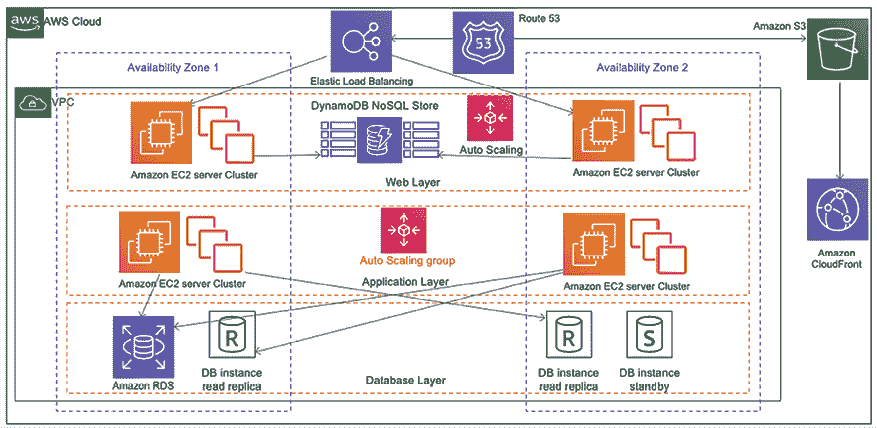

图 4.1：三层网站架构

在上述架构中，您有以下三层：

+   **网络层**：网络层是应用程序的面向用户部分。最终用户通过网络层与应用程序互动，以收集或提供信息。

+   **应用层**：应用层主要包含业务逻辑，并根据从网络层接收到的信息进行处理。

+   **数据库层**：所有类型的用户数据和应用数据都存储在数据库层中。

让我们更详细地看一下这些层次。

## 网络层

网络层也被称为**表现层**。网络层提供用户界面，帮助最终用户与应用程序进行交互。网络层是你的用户界面（在这个例子中是网站页面），用户在此输入信息或浏览内容。网页开发者可能使用 HTML、CSS、Angular、React、**JavaServer Pages**（**JSP**）和**Active Server Pages**（**ASP**）等技术来构建表现层用户界面。这个层次从用户处收集信息，并将其传递给应用层。

网络层是面向用户的，因此组织会花费大部分时间来提升用户体验。许多组织有专门的**用户体验**（**UX**）团队，研究各个领域，以了解用户如何与应用程序互动。

此外，解决方案架构师必须确保架构设计包括用户体验（UX）的输入和页面加载性能。网络层和应用层之间应该有无缝的信息流，以便在预期的时间内将正确的信息返回给用户，例如用户登录、个人资料加载等。

让我们来看一下应用层。

## 应用层

应用层也被称为**逻辑层**，因为这是产品的核心，所有业务逻辑都驻留在此。展示层从用户处收集信息并将其传递给逻辑层进行处理，以获取结果。例如，在像 Amazon 这样的电子商务网站上，用户可以在网站的订单页面输入日期范围，以查找其订单摘要。作为回报，web 层将数据范围信息传递给应用层。应用层处理用户输入以执行业务逻辑，如订单数量、金额总和和购买的商品数量。然后，这些信息返回给 web 层并呈现给用户。

一般来说，在三层架构中，所有算法和复杂的逻辑都位于应用层，包括创建推荐引擎或根据用户的浏览历史向用户展示个性化页面。你可以添加诸如领域层、数据访问层或展示层等层次，以构建四层或五层架构。开发人员可以选择在服务器端编程语言中实现这一层，例如 C++、Java、.NET 或 Node.js。应用层是系统设计的核心，通常需要最多的设计工作。大多数应用功能都依赖于在应用层构建的逻辑。应用层对存储在数据库层的数据进行逻辑处理。让我们更详细地了解数据库层。

## 数据库层

数据库层，也称为**数据层**，存储与用户档案和交易相关的所有信息。本质上，它包含需要持久化存储在数据层中的任何数据。这些信息被发送回应用层进行逻辑处理，然后最终在 web 层呈现给用户。例如，假设用户使用 ID 和密码登录网站。在这种情况下，应用层会验证存储在数据库中的用户凭证。如果凭证与存储的信息匹配，用户将被允许登录并访问网站的授权区域。

架构师可以选择在关系型数据库中构建数据层，例如 PostgreSQL、MariaDB、Oracle Database、MySQL、Microsoft SQL Server、Amazon Aurora 或 Amazon RDS。架构师也可以添加 NoSQL 数据库，如 Amazon DynamoDB、MongoDB 或 Apache Cassandra。

数据层用于存储交易信息、用户会话信息和应用程序配置。架构师可能会考虑添加缓存数据库，如 Memcached 和 Redis，以满足性能需求。你将在*第十二章*，*解决方案架构的数据工程*中了解更多关于各种数据库的知识。

在安全方面，数据层需要特别注意。您必须通过在静止状态和传输过程中应用数据加密来保护用户信息。在*n*-层分层架构图中，您会注意到每一层都有自己的自动扩展配置，这意味着可以独立扩展每一层。此外，每一层都有网络边界，这意味着访问一层并不能访问其他层。您将在*第七章*，*安全考虑*中了解更多关于安全方面的内容。

架构师需要根据应用程序的复杂性和用户需求决定层数。例如，您可以添加额外的层，如用于数据库访问逻辑的数据访问层，并保持数据存储层作为数据库引擎。您可以通过定义逻辑分离来增加应用程序的整体可维护性、扩展性和性能。

# 创建基于多租户 SaaS 的架构

在前一节中，您了解了多层架构，也称为**单租户**，适用于单个组织构建。随着组织欢迎数字革命，多租户架构变得越来越流行，同时保持整体应用程序和运营成本较低。

**软件即服务**（**SaaS**）模型建立在多租户架构之上，其中软件实例和相关基础设施为众多客户提供服务。在这个框架内，每个客户都以共享方式使用应用程序和数据库。通过每个租户独特的配置、身份和数据隔离，他们彼此相互隔离，同时共享同一产品。

作为多租户 SaaS 提供商，它们负责从硬件到软件的一切，基于 SaaS 的产品将组织的责任转移到应用程序的维护和更新上，因为 SaaS 提供商负责处理这些事务。

每个购买 SaaS 产品的组织都被视为租户。这些租户可以使用配置而无需进行代码更改来自定义其用户界面。由于多个客户共享公共基础设施，它们可以从规模中受益，进一步降低成本。一些最受欢迎的 SaaS 提供商包括 Salesforce CRM、Jira Software、Slack、Google Workspace 和 Amazon Connect。

如下所示的架构图表明，两个组织（租户）使用相同的软件和基础设施。SaaS 供应商通过为每个组织分配唯一的租户 ID，提供对应用层的访问：

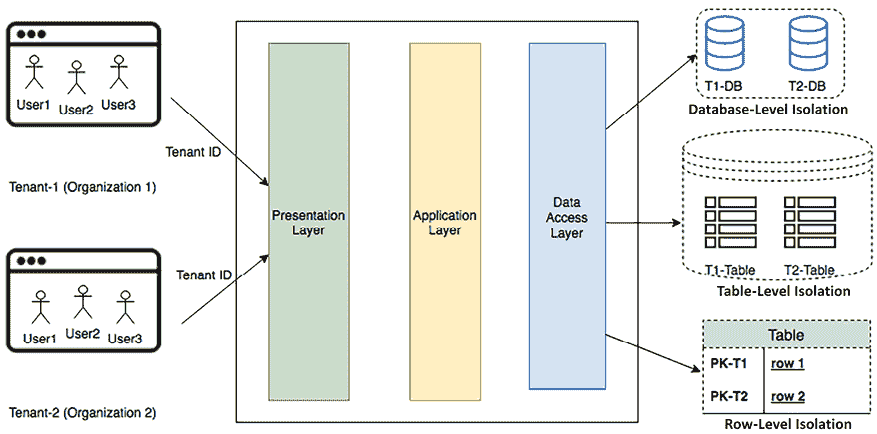

图 4.2：多租户 SaaS 架构

前述架构设计显示，表现层提供用户界面，应用层保存业务逻辑。在数据访问层，每个租户将通过以下一种方法实现数据级隔离：

+   **数据库级隔离**：在这种模型中，每个租户都有与其租户 ID 关联的数据库。当每个租户从用户界面查询数据时，将其重定向到其数据库。如果客户出于合规性和安全性原因不希望使用单一共享数据库，则需要此模型。

+   **表级隔离**：可以通过为每个租户提供单独的表来实现此隔离级别。在此模型中，需要为每个租户唯一分配表，例如使用租户 ID 前缀。当每个租户从用户界面查询数据时，根据其唯一标识符将其重定向到其表中。

+   **行级隔离**：在这种隔离级别中，所有租户在数据库中共享同一张表。表中有一个额外的列，存储每行针对的唯一租户 ID。当单个租户希望从用户界面访问其数据时，应用程序的数据访问层根据租户 ID 向共享表生成查询。每个租户仅获取属于其用户的行。

对企业客户而言，应进行仔细评估，以了解 SaaS 解决方案是否适合基于其独特功能需求。这是因为，通常情况下，SaaS 模型的定制能力有限。

隔离方法的选择基于组织的合规性、安全性、成本以及租户合同要求等考虑因素。

如果需要许多用户订阅，找到成本价值主张非常重要。在进行“构建还是购买”决策时，成本比较应基于总体拥有成本来计算。这是因为构建软件并不是大多数组织的主营业务，因此 SaaS 模型因其使组织能够专注于业务并让专家处理其 IT 方面而变得非常流行。

**面向服务的架构** (**SOA**) 是设计和构建应用程序的流行方法，特别是当组织有独特的定制需求时。让我们更多地了解它。

# 理解面向服务的架构

在**SOA**模式中，不同的应用程序组件通过网络上的通信协议进行交互。每个服务提供端到端的功能，例如*获取订单历史记录*。SOA 被大型系统广泛采用，以集成业务流程，例如从主应用程序中取出您的支付服务并将其作为单独的解决方案。

从一般意义上讲，SOA 将单体应用程序拆分为一些独立运行的 *服务*。使用 SOA 的目标是松耦合应用程序的服务。有时，SOA 包括将服务彼此拆分并将资源拆分为该服务的独立实例。例如，虽然有些人选择将公司数据存储在一个通过表格拆分的单一数据库中，但 SOA 会考虑按功能模块化应用程序，将其拆分成完全独立的数据库。这使得你可以根据每个数据库中表格的个别需求进行扩展和管理吞吐量。

SOA 具有多个优点，例如开发、部署和运营的并行化。它解耦了服务，使你能够单独优化和扩展每个服务。

然而，它也需要更强有力的治理来确保每个服务团队所执行的工作符合相同的标准。在 SOA 中，解决方案可能会变得足够复杂，从而增加开销，因此你需要选择工具并实施自动化来进行服务监控、部署和扩展。

实现 SOA 的方式有多种。

**简单对象访问协议** (**SOAP**) 最初是最流行的消息传递协议，但由于完全依赖 XML 进行数据交换，它的重量较重。**表现层状态转移** (**REST**) 架构越来越受欢迎，因为开发人员需要构建更轻量的移动和 Web 应用程序。在撰写本文时，SOAP 架构已被视为遗留架构，因此在本书的这一版本中，我们将重点学习 REST 架构。

## RESTful Web 服务架构

**REST** 或 RESTful Web 服务因其轻量级架构而提供更好的性能。与仅允许 XML 的 SOAP 不同，REST 允许多种消息格式，如 JSON、纯文本、HTML 和 XML。REST 是一种架构风格，定义了使用 HTTP 协议进行数据传输的松耦合应用程序设计标准。

**JavaScript 对象表示法** (**JSON**) 是 REST 架构中更易于访问的数据交换格式。JSON 也是轻量级的，且与语言无关。它包含一个简单的键值对，使其与大多数编程语言中定义的数据结构兼容。

RESTful Web 服务，也称为 REST Web 服务，建立了一个具有特定规则的框架，用于设计 Web 服务。其目的是确保通过互联网连接的各种计算机系统之间的兼容性。通过 RESTful Web 服务，系统可以使用一致的、预定义的一组操作访问和修改基于文本的数据，而不依赖于过去的交互或状态。以下是 RESTful Web 服务架构的一些基本原则，以及使用电子商务网站示例来说明 RESTful Web 服务架构的原则：

+   **无状态**: 客户端到服务器的每个请求必须包含服务器理解和处理所需的所有信息。客户端发出的每个请求都包含完成该请求所需的所有必要信息，并且无需在服务器端维护任何会话相关的信息；相反，所有信息完全由客户端管理。以一个电子商务网站为例，客户端的每个请求，比如查看产品或将其添加到购物车，都必须包含处理该请求所需的所有信息。如果用户想查看他们的购物车，请求必须包含用户的 ID 或其他相关细节，以便服务器能够识别并返回相应的购物车详情。

+   **客户端-服务器架构**: 在这种设计中，客户端和服务器是两个独立的部分，它们通过网络进行通信。客户端负责管理用户界面并与用户互动，而服务器负责后端和数据处理。它们可以独立演化而不互相影响。客户端（浏览器或应用程序）管理用户交互，比如选择产品，而服务器处理数据检索、购物车管理和结账处理。它们通过 HTTP 请求和响应进行交互。

+   **统一接口**: REST 使用统一接口，简化和解耦架构。对于 RESTful API，交互通过一组标准的 HTTP 方法来促进，这些方法对应 **CRUD**（**创建、读取、更新、删除**）操作。这些方法包括：

    +   **GET**: 这种方法用于从服务器检索数据。例如，当用户想要查看 example.com 上的产品列表时，他们的浏览器会向服务器发送一个 GET 请求。URL 可能看起来像 `https://example.com/api/products`，服务器会以结构化格式（如 JSON 或 XML）返回产品列表。

    +   **POST**: 这种方法用于在服务器上创建新的资源。假设用户想在 `example.com` 上将一个新产品添加到购物车中。他们可能会填写一个包含产品详情的表单，并点击 **添加到购物车**。这个操作会触发一个 POST 请求，发送到 `https://example.com/api/cart`，并将产品详情包含在请求体中。然后，服务器处理这些数据并将新产品添加到用户的购物车中。

    +   **PUT**：此方法用于更新服务器上已存在的资源。如果用户想要更新购物车中某个商品的数量，则会向像`https://example.com/api/cart/{productId}`这样的特定 URL 发送 PUT 请求。请求体中会包括更新后的数量，服务器将会更新用户购物车中对应的商品。

    +   **DELETE**：此方法用于从服务器移除某个资源。例如，如果用户决定从购物车中删除某个商品，浏览器会向像`https://example.com/api/cart/{productId}`这样的 URL 发送 DELETE 请求。服务器随后会从购物车中移除指定的商品。

    通过遵循这些标准方法，API 为开发者提供了一种与 Web 服务交互的一致方式，使开发者能够对资源执行基本操作，而无需了解底层实现细节。

+   **基于资源**：在 REST 中，所有事物都被视为资源，每个资源都可以通过特定的 URL 进行访问。资源是 REST 中的关键抽象，资源可以表示一个单独的对象或多个对象的集合。像商品、用户、订单和购物车商品等资源都通过 URL 进行标识。例如，特定商品可以通过`www.amazon.com/products/{product_id}`进行访问。

+   **资源的表示**：资源可以有不同的表示形式，如 JSON、XML、HTML 等。客户端通过获取资源的表示并操作这些表示来与资源交互。当客户端持有资源的表示时，它拥有足够的信息来修改服务器上的资源。相同的商品资源可能在网页浏览器和移动应用中以不同的方式呈现。

+   **分层系统**：这种架构允许引入中间层（如负载均衡器或缓存层），而不影响客户端与服务器的交互方式。每一层可以提供特定的功能集，从而提高系统的可扩展性和可维护性。一个电子商务网站可能会有多个层次，如负载均衡层、缓存层或认证层。客户端不需要了解这些层次。请求查看商品时，可能会经过缓存层以提高响应速度，但客户端对此并不知情。

+   **按需代码**：服务器可以向客户端提供可执行代码，供客户端在其上下文中执行。这允许部分应用逻辑转移到客户端。例如，一个电子商务网站可以向客户端的浏览器发送 JavaScript 代码，以执行客户端验证或增强用户浏览体验中的交互性。

RESTful 架构风格使用标准的 HTTP 方法，并通过遵循这些原则，RESTful Web 服务旨在简单、可扩展和可维护。许多现代 Web API 遵循 RESTful 原则开发，使用标准约定对资源执行 CRUD 操作。让我们了解基于 RESTful 架构的参考架构。

## 构建基于 RESTful 架构的电子商务网站

例如 [www.amazon.com](http://www.amazon.com) 的电子商务网站具有全球用户和庞大的数百万产品目录。每个产品都有多个图像、评论和视频。为全球用户群维护如此庞大的目录是一项非常具有挑战性的任务。

此 AWS 中的参考架构遵循 RESTful 原则。服务尽可能独立运行：

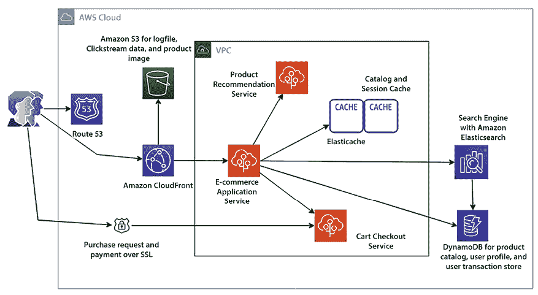

图 4.3：电子商务网站的 RESTful 架构

如前述架构图所示，我们可以注意到以下内容：

+   当用户在浏览器中输入网站地址时，用户请求会到达 DNS 服务器以加载网站。Amazon Route 53 将网站的 DNS 请求路由到托管 Web 应用程序的服务器。

+   用户群体是全球的，用户继续浏览要购买的产品，因为该网站具有庞大的产品目录，包括静态图像和视频。像 Amazon CloudFront 这样的内容分发网络缓存和向用户传递静态资产。

+   存储在 Amazon S3 中的目录内容，如静态产品图像和视频，以及其他应用程序数据，如日志文件。

+   用户将从多个设备浏览网站；例如，他们将从移动设备向购物车添加商品，然后在桌面上进行付款。需要持久的会话存储，如 DynamoDB，来处理用户会话。DynamoDB 是一个 NoSQL 数据库，无需提供固定的模式，因此它是产品目录和属性的优秀存储选项。

+   Amazon ElastiCache 用作产品的缓存层，以减少对数据库的读写操作，提供高性能并减少延迟。

+   便捷的搜索功能对产品销售和业务成功至关重要。Amazon CloudSearch 通过从 DynamoDB 加载产品目录来帮助构建可扩展的搜索能力。您还可以使用 Amazon Kendra 实现 AI 驱动的搜索引擎。

+   推荐可以鼓励用户基于浏览历史和过往购买行为购买其他产品。独立的推荐服务可以消耗存储在 Amazon S3 上的日志数据，并向用户提供潜在的产品推荐。

+   电子商务应用程序还可以具有多个层和组件，需要频繁部署。AWS Elastic Beanstalk 处理基础设施的自动配置，部署应用程序，通过应用自动扩展来处理负载，并监视应用程序。

你在本节中了解了 RESTful 架构。接下来让我们深入了解基于缓存的架构设计中的关键方面。

# 构建基于缓存的架构

缓存涉及将数据或文件临时存储在请求者与永久存储之间的中间位置。这种做法旨在加速未来的请求并最小化网络带宽的使用。缓存提高了应用程序的速度并降低了成本。它允许你重复使用先前检索的数据。为了提高应用程序性能，缓存可以应用于架构的各个层次，如 Web 层、应用层、数据层和网络层。

通常，服务器的 **随机存取内存** (**RAM**) 和内存缓存引擎被用来支持应用程序缓存。然而，如果缓存与本地服务器耦合，那么在服务器崩溃时缓存将不会持久化数据。大多数应用程序都运行在分布式环境中，因此最好拥有一个独立于应用生命周期的专用缓存层。如果你对应用程序进行水平扩展，那么所有服务器都应该能够访问集中式缓存层，以实现最佳性能。

下图描述了解决方案架构各层中的缓存机制：

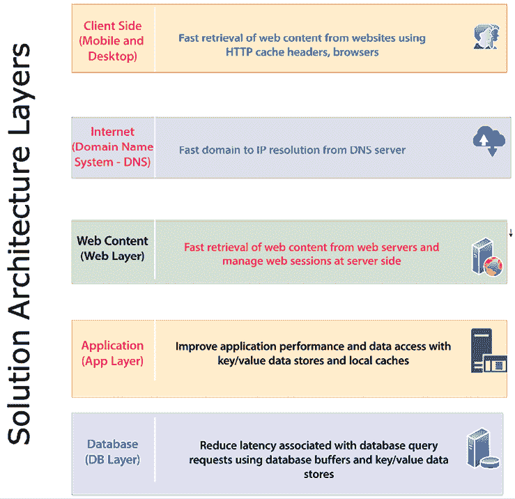

图 4.4：架构层的缓存

如上图所示，以下是每一层架构中的缓存机制：

+   **客户端缓存**：客户端缓存应用于用户设备，如手机和桌面。客户端缓存将先前访问的网页内容缓存起来，以便更快地响应随后的请求。每个浏览器都有自己的缓存机制。HTTP 缓存通过在本地浏览器缓存内容来加速应用程序。`cache-control` HTTP 头定义了客户端请求和服务器响应的浏览器缓存策略。这些策略定义了内容应该缓存在哪里，以及它会持续多长时间，这被称为 **生存时间** (**TTL**) 。Cookies 是另一种用于存储信息在客户端计算机上，以便更快响应浏览器的方法。

+   **互联网 DNS 缓存**：当用户在互联网上输入网站地址时，公共 **域名系统** (**DNS**) 服务器会查找 IP 地址。缓存此 DNS 解析信息将减少网站的加载时间。DNS 信息在第一次请求后可以缓存到本地服务器或浏览器中，任何进一步对该网站的请求都将更快。

+   **Web 内容缓存**：许多请求涉及检索 Web 内容，如图像、视频和 HTML 页面。将这些资产缓存到用户附近的位置可以为页面加载提供更快的响应。这还消除了磁盘读取和服务器负载时间。**内容分发网络**（**CDN**）提供了一个边缘位置的网络，在这些位置可以缓存静态内容，如高分辨率图像和视频。这对重读型应用程序（如游戏、博客、电商产品目录页面等）非常有益。用户会话包含有关用户偏好和状态的大量信息。通过将用户会话存储在自己的键值存储中，提供了快速的用户响应，从而提供了良好的用户体验。

+   **应用缓存**：在应用层，可以通过缓存来存储复杂的重复请求的结果，从而避免业务逻辑计算和数据库访问。总体而言，它提高了应用性能，减少了数据库和基础设施的负担。

+   **数据库缓存**：应用性能高度依赖于数据库提供的速度和吞吐量。数据库缓存显著提高了数据库的吞吐量，并降低了数据检索的延迟。数据库缓存可以应用于任何关系型或非关系型数据库之前。一些数据库提供商集成了缓存功能，而应用程序则处理本地缓存。

**Redis** 和 **Memcached** 是最流行的缓存引擎。虽然 Memcached 更快（它适用于低结构数据，并以键值对格式存储数据），但 Redis 是一个更持久的缓存引擎，能够处理应用所需的复杂数据结构，例如游戏排行榜；你将在本章的 *Memcached 与 Redis* 部分学习更多细节。接下来让我们了解几种其他的缓存设计模式。

## 三层 Web 架构中的缓存分发模式

传统的 Web 托管架构遵循常见的三层 Web 应用模型，将架构划分为表示层、应用层和持久层。

如下图所示，在 AWS 架构中，缓存应用于 Web、应用和数据库层：

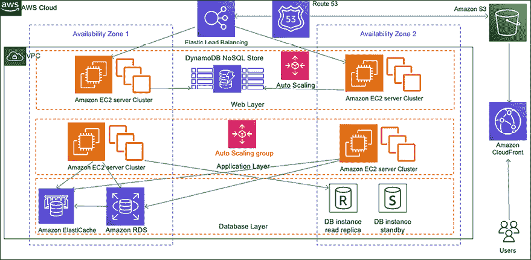

图 4.5：缓存分发模式架构

在缓存模式中，目标是尽量减少后端的访问。你可以编写一个应用程序，在其中缓存图像、JavaScript，甚至是整个页面，从而为用户提供更好的体验。在上图中，缓存被战略性地实施在架构的各个层次上：

+   Amazon Route 53 在缓存 DNS 到 IP 的映射中起到了作用，从而简化了域名管理。

+   Amazon S3 作为静态内容的存储位置，包括高分辨率图像和视频。

+   Amazon CloudFront 提供边缘缓存服务，用于高流量内容，通过使用缓存控制头部来确定从源服务器更新的频率。

+   亚马逊 DynamoDB 用于会话存储，帮助 Web 应用通过缓存管理用户会话。

+   弹性负载均衡 (Elastic Load Balancing) 将流量均匀分配到 Web 服务器的自动扩展组中。

+   亚马逊 ElastiCache 提供应用程序的缓存服务，能有效减轻数据库层的负担。

通常，静态内容会被缓存，但也有一些场景中，缓存动态或唯一的内容可以提高应用程序性能。是否缓存取决于具体的使用模式和需求。

让我们来看看一个更具体的模式。

## 重命名分发模式

使用 **CDN**（如 Amazon CloudFront）时，你可以将经常使用的数据存储在离用户较近的边缘位置，以便获得更快的性能。通常，你会在 CDN 中为你的数据设置 TTL，这意味着在 TTL 到期之前，边缘位置不会回到服务器请求更新的数据。TTL 是指对象在缓存系统中存储的时间，直到被删除或刷新。你可能会遇到需要立即更新 CDN 缓存内容的情况，例如，如果你需要修正错误的产品描述。

在这种情况下，你不能等待文件的 TTL 到期。重命名分发模式可以帮助你在新更改发布后立即更新缓存，这样用户就能立刻获得更新的信息。下图展示了 AWS 中的这一模式：

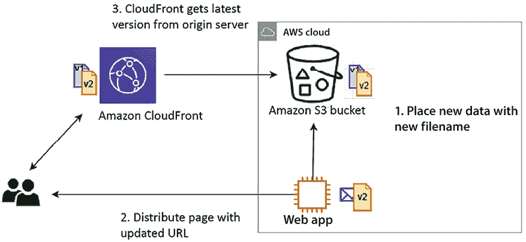

图 4.6：重命名分发模式架构

如前图所示，使用重命名分发模式与缓存分发模式结合有助于解决更新问题。通过这种模式，服务器上传带有新文件名的更新文件，而不是覆盖原始服务器中的文件并等待 CloudFront 中 TTL 到期，然后更新网页中的新 URL。当用户请求原始内容时，CloudFront 必须从源服务器获取内容，不能提供已缓存的过时文件。

然而，你可以立即使旧文件失效，但这会产生更多成本，因此最好上传文件的新版本，供 CDN 立即获取。同样，你必须在应用程序中更新 URL 以便获取新文件，这相比使失效的选项会增加一些开销。最好根据你的业务需求和预算来做出决定。

你可以使用代理缓存服务器来代替 CDN，尤其是当用户分布在全国各地时。让我们在下一部分中详细了解它。

## 缓存代理模式

通过添加缓存层，你可以显著提高应用程序的性能。在缓存代理模式中，静态或动态内容会被缓存到 Web 应用服务器的上游。如下面的架构图所示，你在 Web 应用集群前面有一个缓存层：

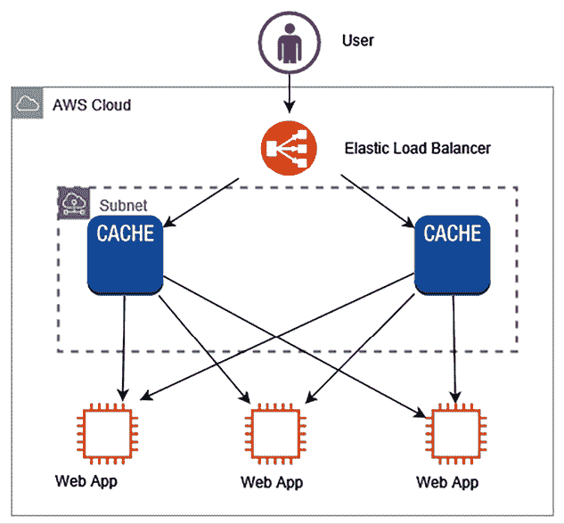

图 4.7：缓存代理模式架构

在前面的图中，为了高效交付，缓存内容由缓存服务器传递。缓存代理模式的一些好处如下：

+   缓存代理模式帮助您通过缓存传递内容，这意味着无需在 web 服务器或应用服务器级别进行修改。

+   它们减少了动态内容生成的负载。

+   可以在浏览器级别设置缓存，例如在 HTTP 头、URL、Cookies 等中。或者，如果不想在浏览器级别存储缓存，可以在缓存层存储信息。

在缓存代理模式中，必须维护多个缓存副本，以避免单点故障。有时，您可能希望从服务器和 CDN 提供静态内容，每个方法需要不同的处理方式。让我们在下一节深入探讨这种混合情况。

## 重写代理模式

有时，您希望更改静态网站内容的访问目标，如图像和视频，但又不想更改现有系统。您可以通过提供代理服务器来实现这一点，使用重写代理模式。要将静态内容的目标更改为其他存储，如内容服务或互联网存储，您可以在 web 服务器群集前使用代理服务器。如以下架构图所示，您在应用层前放置一个代理服务器，帮助在不修改实际应用的情况下更改内容交付目标：

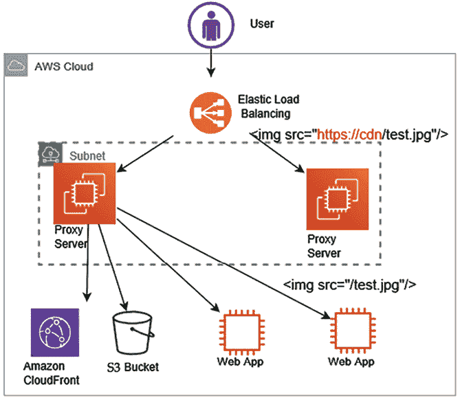

图 4.8：重写代理模式架构

如前图所示，将代理服务器放置在当前运行系统的前端，以重写代理模式。您可以使用如**Apache**或**NGINX**等软件构建代理服务器。以下是构建重写代理模式的步骤，使用 AWS 作为示例：

1.  将运行中的代理服务器放置在 EC2 实例上，代理服务器可以在**负载均衡器**和存储服务（如存储静态内容的**Amazon S3**）之间覆盖内容。

1.  在代理服务器规则中添加覆盖内容中 URL 的规则。这些规则将帮助**弹性负载均衡**（**ELB**）指向新位置，如前图所示，将代理服务器规则从`https://cdn/test.jpg`重定向到/test.jpg。ELB 是 AWS 提供的一项服务，可以自动将传入的应用流量分配到多个目标上，如 Amazon EC2 服务器、容器和 IP 地址。

1.  按照应用负载要求，为代理服务器配置自动扩展，设定代理服务器的最小和最大数量。

在本节“构建基于缓存的架构”中，你学习了如何处理静态内容分发的缓存。然而，在应用层进行缓存非常重要，可以提高应用性能，改善整体用户体验。接下来，让我们了解更多关于应用缓存模式的内容，以应对动态用户数据传输的性能需求。

## 应用缓存模式

在为应用程序应用缓存时，你需要在应用服务器和数据库之间添加一个缓存引擎层。应用缓存模式可以帮助你减少数据库的负载，因为最频繁的查询是通过缓存层提供的。*应用缓存模式*可以提升整体应用和数据库的性能。

如下图所示，你可以看到在 AWS 中，缓存层应用于应用层和数据库层之间：

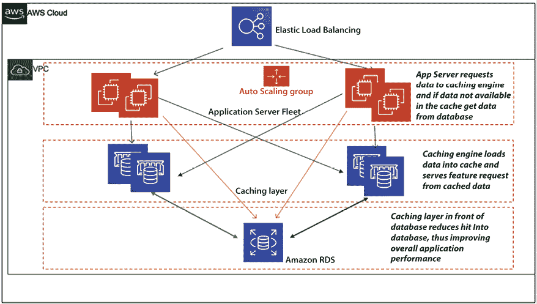

图 4.9：应用缓存模式架构

如前图所示，你可以根据数据访问模式使用**惰性缓存**或**写穿透缓存**。在惰性缓存中，缓存引擎检查数据是否在缓存中，如果没有，它将从数据库中获取并存入缓存，以便服务未来的请求。惰性缓存也叫做**缓存旁路模式**。在**写穿透**方法中，数据同时写入缓存和数据存储。如果数据从缓存中丢失，可以从数据库中重新获取。

当你的应用是读密集型且能接受过时数据时，选择惰性缓存；而当处理写密集型操作并需要即时数据一致性时，选择写穿透缓存。例如，你可以在电子商务网站的产品目录中使用惰性缓存，其中产品细节经常被读取，但更新较少。当用户访问不在缓存中的产品详情时，它会从数据库中获取并存入缓存，供后续访问，减少数据库负载。在电子商务网站的用户评价部分，你可能希望使用写穿透缓存，因为用户生成的评价需要即时显示在产品页面。当用户提交评价时，它会同时写入缓存和数据库，确保后续的读取请求获取到最新数据。

让我们深入了解流行的缓存引擎*Redis*和*Memcached*。

## Memcached 与 Redis

Redis 和 Memcached 是两种在应用设计中常用的缓存引擎。Redis 缓存引擎通常用于更复杂的应用缓存需求，例如为游戏创建排行榜。然而，Memcached 性能更高，有助于处理重负载应用。每种缓存引擎各有优缺点。我们来看看它们之间的主要区别，这将帮助你决定使用哪种：

| **Memcached** | **Redis** |
| --- | --- |
| 提供多线程支持 | 单线程 |
| 能够利用更多的 CPU 核心进行更快速的处理 | 无法利用多核处理器，导致相对较慢的性能 |
| 支持键值对数据 | 支持复杂和高级数据结构 |
| 缺乏数据持久性；在崩溃时丢失缓存中的数据 | 可以通过内建的读取副本和故障转移来保持数据持久性 |
| 易于维护 | 由于需要维护集群，涉及更多复杂性 |
| 适合缓存简单字符串，如简单 HTML 页面、序列化 JSON 等 | 适合为游戏排行榜、实时投票应用等创建缓存 |

表 4.1 – Memcached 与 Redis 的比较

如果你需要决定使用哪个引擎，应该根据一个能够证明使用 Redis 或 Memcached 的用例来选择。Memcached 简单且维护成本较低，通常在你的缓存不需要 Redis 提供的高级功能时优先选择。然而，如果你需要数据持久性、高级数据类型或其他任何 Redis 列出的特性，Redis 是最好的解决方案。

在实现缓存时，理解需要缓存的数据的有效性是至关重要的。如果**缓存命中**率很高，则数据在需要时可以从缓存中获取。为了提高缓存命中率，通过减少直接查询来卸载数据库，从而提升整体应用性能。**缓存未命中**发生在数据不在缓存中时，这会增加数据库的负担。缓存不是一个大型数据存储，因此你需要根据应用需求设置 TTL 并逐出缓存。

如你所见，应用缓存有多个好处，包括提升应用性能、提供可预测的性能以及减少数据库成本。

让我们了解更多应用程序架构，展示松耦合和约束处理原则的 MVC 架构。

# 模型-视图-控制器（MVC）架构

MVC 是开发软件应用程序时最流行的设计模式之一。它将应用程序分为三个互相关联的组件：模型、视图和控制器。这样的分离实现了更模块化的开发、更容易的测试和出色的可维护性。让我们详细探讨这些组件：

+   **模型**：模型表示应用程序的内部状态，以及管理和操作该状态的规则、逻辑和数据。模型不依赖于视图或控制器，这意味着 UI 或业务逻辑的变化不会影响数据处理。它确保应用程序的数据在不同部分之间保持一致。它的责任包括：

    +   **管理数据**：它包含所有与数据相关的逻辑。无论是从数据库还是 API 中检索数据，模型都会处理。

    +   **实现业务规则**：实现业务逻辑，如计算或数据转换。

    +   **通知变更**：当数据发生变化时，通知相关的视图和控制器，以便它们可以相应地更新自己。

+   **视图**：视图是模型数据的可视化表现。它定义了应用程序数据如何呈现给用户。当底层模型数据发生变化时，视图会自动更新，确保用户始终看到最新的数据。可以从同一模型数据创建多个视图，允许不同的表现形式（例如，表格、图表、详细视图）。它的职责包括：

    +   **显示数据**：从模型中获取数据，并以易于理解的格式呈现。

    +   **处理用户界面**（**UI**）：处理应用程序的所有 UI 逻辑，如用户输入字段、按钮、显示屏等。

+   **控制器**：控制器在模型和视图之间进行调解。它从视图获取用户输入，处理这些输入（可能会更新模型），并将输出显示返回给视图。控制器确保视图和模型始终保持同步。它充当所有用户交互的集中处理器，使得这些交互的管理更加系统化和有序。它的职责包括：

    +   **处理用户输入**：接收并解释用户命令，将其转化为模型执行的动作

    +   **更新模型**：通过向模型发送命令来修改模型中的数据

    +   **更新视图**：根据用户输入和模型变化更改视图中呈现的内容

以下是应用 MVC 模式的主要优势：

+   **关注点分离**：通过将应用程序的数据、用户界面和控制逻辑隔离开来，MVC 促进了模块化开发。

+   **可重用性**：组件可以在应用程序的不同部分甚至不同的应用程序之间重用。

+   **可维护性**：使得更新、测试和调试应用程序的不同部分变得更加容易。

+   **灵活性**：使开发者能够在不影响其他部分的情况下更改系统的一部分，例如更改 UI 而不改变底层数据处理。

MVC 是一种强大的架构模式，提供了强大的数据管理、用户界面和业务逻辑管理。它广泛应用于各种应用开发环境，从 Web 开发框架到桌面应用程序，帮助创建可扩展和易于维护的软件。通过遵循 MVC 原则，应用程序架构师可以创建组织良好、高效且灵活的应用程序，便于更新和维护。让我们通过一个例子更好地理解 MVC。

## 将 MVC 应用于设计一个在线书店

例如，在设计一个在线书店时，MVC 架构可以高效地处理书籍数据、用户界面和用户输入之间的复杂交互，从而构建一个更加健壮和可扩展的系统。让我们来看看每个模块的详细内容：

+   **模型**：管理与书籍、作者、分类、客户评价等相关的数据。操作示例包括：

    +   获取特定书籍的详细信息

    +   购买后更新库存

    +   添加新书到目录

+   **视图**：以易读和互动的格式向用户展示信息。视图的示例包括：

    +   **书籍列表页面**：显示书籍的标题、封面和价格列表

    +   **书籍详情页**：显示有关特定书籍的详细信息，包括作者、简介、评价等。

    +   **购物车页面**：允许用户查看、添加或移除购物车中的商品

+   **控制器**：处理用户交互，根据需要更新模型，并更新视图以反映变化。操作示例包括：

    +   **搜索书籍**：用户输入搜索词。控制器查询模型中匹配的书籍，并更新视图以显示结果。

    +   **添加到购物车**：用户点击**添加到购物车**，控制器更新模型，反映购物车中的新商品，视图随之更新以显示新的购物车状态。

    +   **结账**：用户决定购买。控制器处理交易，更新模型（包括库存），并重定向到确认视图。

MVC 模式提供了清晰的关注点分离，使得扩展、维护和测试应用程序变得更加容易。

# 构建领域驱动设计（DDD）

**领域驱动设计**（**DDD**）是一种方法论和一组实践，旨在理解并解决软件核心复杂性。该方法用于基于“领域”或业务核心逻辑和关键概念来设计和建模软件。通过使用通用语言并将系统划分为清晰的上下文，DDD 促进了对问题空间的深入理解，并导致一个准确反映底层业务需求的设计。它在复杂领域中特别有价值，因为在这些领域，确保软件与它所代表的现实世界概念紧密对齐至关重要。

让我们通过一个具体的示例和用例深入探讨 DDD。为此，我们将考虑一个**医疗健康管理系统**（**HMS**）的领域。假设我们正在开发一个为医疗服务提供商管理患者记录、预约、医疗治疗、账单等的系统。我们可以将 DDD 的概念应用到这个领域，方法如下：

+   **领域**： "领域"指的是软件旨在解决的特定问题领域。应用逻辑围绕着这一知识和活动范围展开。理解领域对于创建一个真正满足业务需求的系统至关重要。对于医疗管理系统（HMS）来说，领域将是医疗管理，聚焦于病人、医疗人员、预约、治疗和账单。

+   **通用语言**：通用语言是开发人员和非技术利益相关者之间共享的语言，用来描述领域。这种共同的语言确保团队成员对关键术语和概念有统一的理解，减少误解，促进清晰的沟通。对于 HMS，创建一个既能被医疗专业人员又能被开发人员理解的共享语言，例如，**病人**、**预约**、**治疗**、**医疗人员**等。

+   **限界上下文**：在领域驱动设计（DDD）中，应用程序被划分为不同的限界上下文，每个上下文代表领域内的特定职责或功能。限界上下文封装了该领域特定部分的所有术语、定义和逻辑，并明确什么是其边界内的，什么是边界外的。例如，**病人管理**限界上下文处理病人记录、个人信息、病历等；**预约调度**限界上下文包括管理预约、调度、取消、重新安排等；而**账单**限界上下文则包括处理付款、保险、发票等事务。

+   **实体**：这些对象具有独特的身份，贯穿不同的时间和状态，例如病人（拥有唯一 ID）和医疗人员（拥有独特的资格证书）。

+   **值对象**：描述事物特征但没有概念性身份的对象。它们是不可变的，可以轻松替换。例如，**地址**、**出生日期**和**病历**（因为这些没有单独的身份）。

+   **聚合**：聚合是指一组关联对象，作为数据更改的单一单元进行处理。聚合内的一个实体被称为根实体，外部引用仅限于该根实体，以确保数据完整性。例如，在一个在线医疗管理系统中，医疗预约可以被建模为一个聚合。该聚合可能包括像**病人**（预约的对象）、**医疗人员**（为病人提供服务的人员）、**治疗室**（预约地点）、**时间段**（预约的时间）等实体和值对象。在这里，**预约**实体将是聚合根。与特定预约相关的任何**病人**、**医疗人员**、**治疗室**或**时间段**的更改都应通过预约实体进行。这确保了预约聚合的一致性，并强制执行所有与医疗预约相关的业务规则。

+   **仓储**：仓储用于从底层持久化层中检索聚合。它们提供了一种抽象，使得应用程序的其他部分可以以与领域模型一致的方式与数据存储进行交互。例如，**病人**仓储用于获取和管理病人实体，而预约仓储用于检索和存储预约聚合。

+   **工厂**：工厂负责封装创建复杂对象和聚合的逻辑。它们确保对象或聚合在一致且有效的状态下创建。例如，**病人**工厂用于创建一个具有有效初始状态的新**病人**实体，而**预约**工厂用于创建一个包含必要细节的新**预约**聚合。

+   **服务**：当某个操作在逻辑上不属于值对象或实体时，可以将其定义为服务。服务是领域模型的一部分，包含针对领域概念的业务逻辑。例如，在**计费**上下文中，计费服务包含计算总费用、应用保险折扣、生成发票等操作。

+   **领域事件**：领域事件捕捉领域内发生的重大事件。它们可以触发系统内或其他系统中的其他活动。例如，预约调度事件会在新预约安排时触发，通知相关工作人员；支付处理事件则会在支付成功后发生，可能会启动生成收据的流程。

+   **反腐层**：这一层负责在使用不同语言或模型的系统各部分之间进行转换。它确保每个模型的完整性得到维护，并处理不一致性。如果计费系统必须与外部第三方支付网关进行交互，反腐层可以在计费上下文中的领域模型与外部系统使用的模型之间进行转换。

在这个 HMS 中，DDD 确保复杂的领域逻辑得到精心建模和组织。它鼓励医疗专业人员（领域专家）与开发人员之间的协作，以创建共享的理解和语言。

系统的设计紧密结合了现实世界的医疗操作，通过定义明确的界限上下文、实体、聚合和其他 DDD 概念。这种对齐确保了软件提供了一种稳健且灵活的解决方案，满足医疗领域的特定需求。

这个例子展示了 DDD 如何通过关注核心领域并促进不同利益相关者之间的协作，成为打造复杂、结构良好的系统的关键工具。

依赖处理是处理复杂系统时的重要方面。让我们学习如何通过熔断器处理不同服务之间的依赖，以确保一个服务中的错误不会导致整个系统崩溃。

# 理解熔断器模式

分布式系统通常会调用其他下游服务，而该调用可能失败或挂起，且没有响应。你通常会看到代码会重试失败的调用多次。远程服务的问题在于，它可能需要几分钟甚至几个小时来修复，而立即重试可能会导致另一次失败。因此，最终用户会更长时间等待错误响应，而你的代码在重试多次。这种重试功能会消耗线程，可能会引发级联故障。

熔断器模式是关于理解下游依赖的健康状态。它会检测这些依赖是否不健康，并实现逻辑，优雅地失败请求，直到检测到它们再次健康。熔断器可以通过使用持久化层来实现，监控过去请求时间间隔内的健康和不健康请求。

如果在过去的时间间隔内，观察到请求的某一比例呈现不健康行为，或者总的异常计数超过预定义值，不管该比例如何，电路将标记为打开。在这种情况下，所有请求都会抛出异常，而不是与依赖集成，直到定义的超时期过去。一旦超时期结束，少量请求将尝试与下游依赖集成，以检测健康状态是否已恢复。当足够比例的请求在一段时间内再次健康，或者没有错误出现时，电路将再次关闭，所有请求将正常进行集成。

实现决策涉及到状态机跟踪/共享健康/不健康请求计数。服务的状态可以保存在 DynamoDB、Redis/Memcached 或其他低延迟持久化存储中。

接下来，我们来讨论隔舱架构模式，它有助于减少服务之间的依赖，并在服务出错的情况下缓解问题。

# 实现隔舱模式

隔舱是船只上用来创造独立密闭区域的结构隔板。其主要目的是在船体发生破损时，控制进水的后果，防止水在船只中蔓延。这种设计作为一种重要的安全措施，旨在最小化单一区域损坏时整个船只沉没的风险。

相同的概念有助于在大型系统架构中限制故障的范围，在这种架构中，你希望划分系统以解耦服务之间的依赖。其核心思想是一个故障不应该导致整个系统失败，正如下图所示：

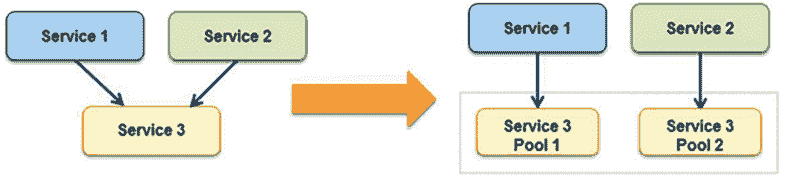

图 4.10：舱壁模式

在舱壁模式（bulkhead pattern）中，最好将应用程序的高依赖元素隔离到服务池中，这样如果其中一个发生故障，其他的可以继续为上游服务提供服务。**Service 3** 在前面的图中从单一服务分隔成了两个池。在这里，如果**Service 3** 发生故障，**Service 1** 或 **Service 2** 的影响将取决于它们对该池的依赖，但整个系统不会崩溃。引入舱壁模式时，需要特别注意以下几点，尤其是在共享服务模型下：

+   保存部分船体，这意味着你的应用程序不应因一个服务的失败而关闭。

+   决定是否可以接受资源使用效率较低。一个分区中的性能问题应该不会影响整个应用程序。

+   选择合适的粒度。确保服务池是可管理的，并且能够处理应用程序负载。

+   监控每个服务分区的性能，并遵守服务水平协议（SLA）。确保所有组件协同工作，并在一个服务池宕机时测试整个应用程序。

应根据每个业务或技术需求定义一个服务分区。最好使用这种模式，以防止应用程序发生级联故障，并将关键消费者与普通消费者隔离开来。

通常，遗留应用服务器的配置中会包含硬编码的**互联网协议**（**IP**）地址或**域名系统**（**DNS**）名称。进行现代化和升级时，任何服务器变更都需要修改和重新验证应用程序。在这种情况下，你希望保持服务器地址不变。在下一节中，我们将学习如何通过浮动 IP 来处理这种情况。

# 创建浮动 IP 模式

通常，单体应用程序对其部署的服务器有很多依赖。应用程序配置和代码通常会根据服务器的 DNS 名称和 IP 地址进行硬编码。如果你想在原始服务器出现问题时启动新服务器，硬编码的 IP 配置会带来挑战。此外，你不希望因升级而使整个应用程序停机，这可能会导致较长时间的停机。

要处理这种情况，您需要创建一个新的服务器，保持相同的服务器 IP 地址和 DNS 名称。这可以通过将网络接口从有问题的实例移动到新服务器来实现。网络接口通常基于**网络接口卡**（**NIC**），用于在网络上服务器之间进行通信。它可以是硬件或软件形式。移动网络接口意味着现在您的新服务器承担了旧服务器的身份。您的应用程序可以使用相同的 DNS 和 IP 地址。它还允许通过将网络接口移回原始实例来轻松回滚。

公共云（例如 AWS）通过提供**弹性 IP**（**EIP**）和**弹性网络接口**（**ENI**）简化了操作。如果您的实例发生故障，并且需要将流量推送到具有相同公共 IP 地址的另一个实例，则可以将 EIP 地址从一台服务器移动到另一台服务器，如下面的架构图所示：

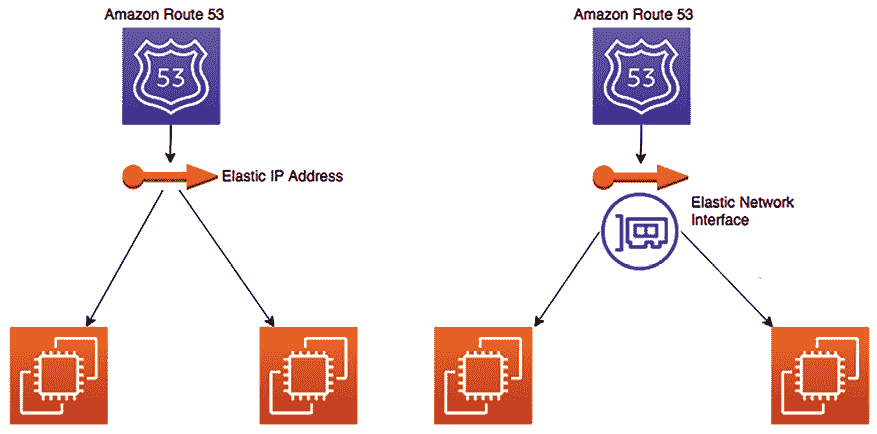

图 4.11：浮动 IP 和接口模式

由于您正在移动 EIP，DNS 可能不需要更新。EIP 可以将您的服务器公共 IP 移动到不同的实例。如果需要移动公共和私有 IP 地址，则可以使用更灵活的方法，例如 ENI，如前图右侧所示。ENI 可以跨实例移动，并且您可以使用相同的公共和私有地址进行流量路由或应用程序升级。

到目前为止，您已经了解了多种架构模式，其中应用程序部署在虚拟机中。但是，在许多情况下，您可能需要帮助来利用虚拟机。为了进一步优化您的利用率，您可以将应用程序部署在容器中。容器最适合于微服务部署。让我们在下一节中深入了解基于容器的部署。

# 使用容器部署应用程序

随着许多编程语言的发明和技术的进步，这带来了新的挑战。不同的应用堆栈需要不同的硬件和软件部署环境。通常需要在不同平台上运行应用程序并迁移至另一个平台。解决方案需要一种可以在任何地方运行并且一致、轻量且可移植的东西。

就像运输集装箱标准化了货物的运输一样，软件容器标准化了应用程序的运输。Docker 创建一个包含软件应用程序运行所需的所有内容的容器，例如文件系统结构、守护程序、库和应用程序依赖项。

容器为软件提供了相应开发和测试环境中的隔离。这种隔离至关重要，因为它可以防止多个团队在相同底层基础设施上运行各种软件应用时产生冲突。

虚拟机在操作系统级别进行隔离，而容器则在内核级别进行隔离。这种隔离允许多个应用程序在单一主机操作系统上运行，并且仍然拥有各自的文件系统、存储、RAM、库，以及大多数情况下，各自的*系统视图*：

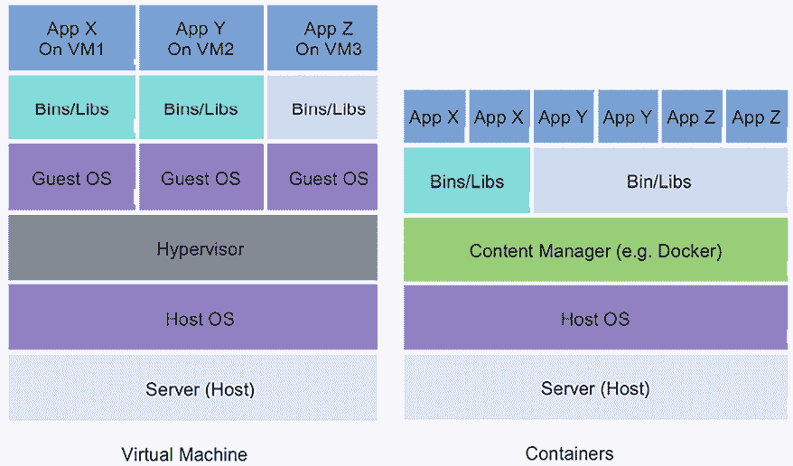

图 4.12：应用程序部署的虚拟机和容器

如前图所示，容器在单个虚拟机中部署多个应用程序。每个应用程序都有其运行时环境，因此您可以在保持服务器数量不变的情况下运行多个独立应用程序。容器共享机器的操作系统内核。它们具有快速启动时间和高效利用计算资源（如 RAM）的优点。容器镜像是通过文件系统的层构建的，可以共享公共文件。这种共享资源的方法减少了磁盘使用量并加快了下载容器镜像的速度。

让我们来看看为什么容器越来越受欢迎，以及它们的好处。

## 容器的好处

关于容器，经常会有人提出以下问题：

+   当我们已有实例时，为什么还需要容器？

+   难道实例不已经为我们提供了与底层硬件的隔离吗？

尽管前面的问题是有效的，但使用像**Docker**这样的系统仍然有许多好处。Docker 的一个关键优势是，它允许您通过在同一实例中托管多个应用程序（在不同端口上）来充分利用虚拟机资源。

Docker 利用 Linux 内核的某些特性，特别是内核命名空间和组，来实现每个 Docker 进程之间的完全隔离，正如下图所示：

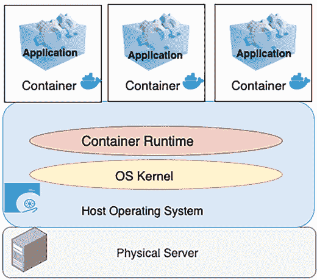

图 4.13：应用程序基础架构中的容器层

如前图所示，实际上可以在同一台机器上运行两个或多个需要不同版本 Java 运行时的应用程序，因为每个 Docker 容器都有自己安装的 Java 版本和相关库。进而，应用程序基础架构中的容器层使得将应用程序拆解为微服务变得更加容易，这些微服务可以在同一实例上并行运行。容器具有以下优点：

+   **可移植的运行时应用环境**：容器提供平台无关的能力，您可以一次构建应用程序并在任何地方部署，无论底层操作系统如何。

+   **更快的开发和部署周期**：修改应用程序并快速启动，通常几秒钟内即可运行，几乎可以在任何地方进行。

+   **将依赖项和应用程序打包成单一工件**：将代码、库和依赖项打包在一起，使应用程序能够在任何操作系统上运行。

+   **运行不同版本的应用程序**：具有不同依赖关系的应用程序可以在同一服务器上同时运行。

+   **一切皆可自动化**：容器管理和部署通过脚本进行，帮助减少成本并降低人为错误的风险。

+   **更好的资源利用**：容器提供高效的扩展和高可用性，同一微服务容器的多个副本可以在服务器之间部署，为您的应用程序提供支持。

+   **轻松管理安全性**：容器是特定于平台的，而不是特定于应用程序的。

由于其优势，容器部署变得非常流行。有多种方式可以编排容器。接下来，我们将更详细地了解容器部署。

## 容器部署

使用容器部署，具有多个微服务的复杂应用程序可以迅速部署。容器使得构建和部署应用程序更加可管理，因为环境是一致的。在开发模式下构建容器，将其推送到测试环境，再发布到生产环境。对于混合云环境，容器部署非常有用。容器使得在微服务之间保持环境一致性变得更容易。由于微服务通常不会消耗大量资源，它们可以被放置在同一个实例中以降低成本。

有时，客户的工作流较短，需要临时的环境设置。这些环境可能是队列系统或持续集成任务，这些任务不总是高效地利用服务器资源。容器编排服务如 Docker 和 Kubernetes 可以作为解决方案，允许它们将容器推送到实例并随时弹出。

Docker 的轻量级容器虚拟化平台提供了管理应用程序的工具。它的独立应用程序可以安装在任何计算机上，以运行容器。Kubernetes 是一个与 Docker 以及其他容器平台配合使用的容器编排服务。Kubernetes 允许自动化容器配置，并精心处理安全性、网络和扩展等方面的问题。

容器帮助企业创建更多的云原生工作负载，公共云服务提供商如 AWS 扩展了服务来管理 Docker 容器和 Kubernetes。

以下图示展示了 Docker 使用 Amazon **弹性容器服务** (**ECS**) 进行容器管理，提供全托管的弹性服务，自动化 Docker 容器的扩展和编排：

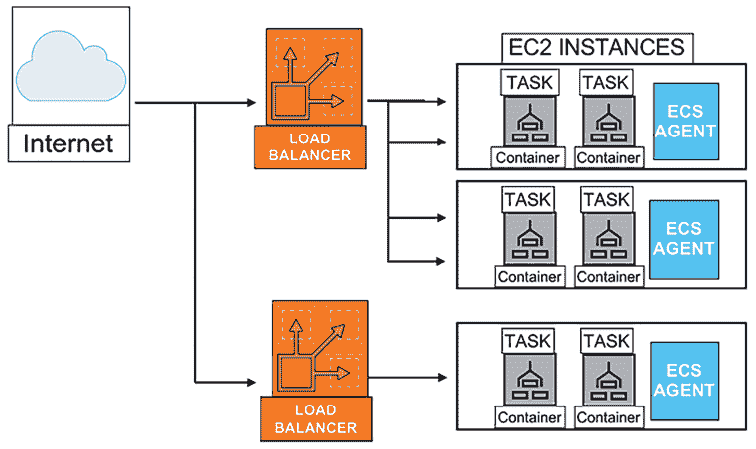

图 4.14：容器部署架构

在上述图中，多个容器被部署在单个通过 Amazon ECS 管理的 Amazon EC2 虚拟机中，该虚拟机促进了代理通信服务和集群管理。所有用户请求通过负载均衡器在容器之间分发。同样，AWS 提供了 Amazon **Elastic Kubernetes Service**（**EKS**）来使用 Kubernetes 管理容器。

容器是一个广泛的话题，作为解决方案架构师，你必须熟悉所有可用的选项。本节提供了容器的概述。然而，如果你将容器用于微服务部署，你需要更深入地了解。让我们在下一节中看看基于容器的架构。

## 构建基于容器的架构

如你在前一节所学，容器化有助于创建可重复和可扩展的应用环境。要开始采用容器，你需要识别一个由容器编排管理的试点工作负载。你可以将现有的微服务组件部署到容器中。在识别出差距和运营需求后，你可以定义一个迁移策略，将工作负载迁移到容器中。

如果你的应用最初并未设计为在容器化环境中运行，容器迁移可能会很具挑战性。这是因为许多应用通常将文件存储在本地，并依赖有状态会话。在迁移到容器时，必须处理这些特定要求，并确保你的应用可以在容器环境中平稳运行。

对于容器平台，你可以做出选择；你可以选择 Docker、OpenShift、Kubernetes 等。然而，Kubernetes 正变得越来越流行，成为一个开源的容器编排工具。像 AWS 这样的公共云服务商提供了管理容器的平台，例如 Amazon ECS 用于 Docker，Amazon EKS 用于 Kubernetes。这些云服务提供了一个控制平面，可以选择不同的计算选项，比如选择自管节点、托管节点或与 AWS Fargate 一起使用的无服务器选项。控制平面作为中央管理接口，允许对容器化应用及其资源进行编排和操作监督。如果你正在利用 Amazon EKS 部署基于微服务的应用程序，例如，由 AWS 管理的 Kubernetes 控制平面负责容器部署的编排、状态管理和保持期望配置。这样的设置让你能够专注于应用程序开发，而不是基础设施管理。

以下架构图展示了在 Amazon EKS 上运行有状态服务，使用你选择的编程语言，如 Java 或 .NET。在这个架构中，你可以在 Redis 数据库中管理会话状态。

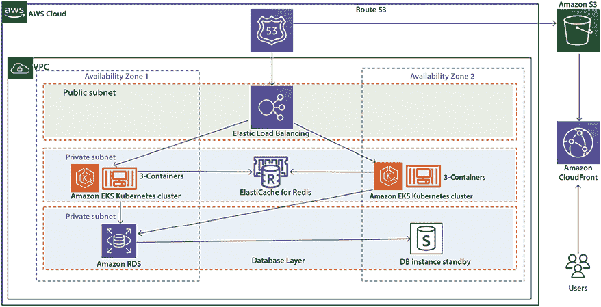

图 4.15：在容器上部署有状态应用

正如你在前面的图表中看到的，基于容器的架构包含了几个关键组件：

+   一个 Amazon **虚拟私有云**（**VPC**），包含特定的子网：

    +   公有子网：托管负载均衡器

    +   私有子网：用于部署应用和数据库

+   应用负载均衡器，负责提供对托管在容器中的网站的访问。

+   一个 Amazon **弹性 Kubernetes 服务**（**EKS**）集群，包含 Kubernetes 中的托管节点组。这些节点负责运行多个应用容器。

+   一个 Amazon ElastiCache Redis 数据库，用于存储用户会话状态。

这种架构通过将用户会话存储在 Redis 数据库中，支持应用的可扩展性。然而，请注意，实现此解决方案可能需要修改应用代码，这在某些情况下可能不可行。

现在，你已经了解了多种专注于应用开发的架构模式。数据是任何架构设计中不可或缺的一部分，且大多数架构围绕着数据的收集、存储和处理展开。在下一节中，让我们深入了解如何在应用架构中处理数据。

# 应用架构中的数据库处理

数据始终是任何应用开发的核心，数据扩展一直是一个挑战。高效地处理数据可以提升应用的延迟和性能。在前面一节 *构建基于缓存的架构* 中，你学习了如何通过在数据库前面放置缓存来处理频繁查询的数据，属于应用缓存模式。你可以将 Memcached 或 Redis 缓存放在数据库前面，从而减少对数据库的多次访问，并提高数据库的响应速度。

在应用部署中，随着应用用户基础的增长，你需要通过关系型数据库处理更多的数据。你需要增加更多的存储或通过增加更多的内存和 CPU 来垂直扩展数据库服务器。通常，当涉及到扩展关系型数据库时，横向扩展会更加复杂。如果你的应用是读密集型的，你可以通过创建只读副本来实现横向扩展。将所有的读请求路由到数据库的只读副本，同时保持主数据库节点处理写入和更新请求。由于只读副本采用异步复制，它可能会增加一些延迟时间。如果你的应用可以容忍几毫秒的延迟，选择只读副本是合适的。你可以利用只读副本来卸载报表查询。

你可以使用数据库分片技术，为你的关系型数据库创建一个多主架构，并引入横向扩展的概念。分片技术用于通过多个数据库服务器提升写入性能。数据库被结构化并划分为相同的部分，适当的表列作为键，用于分配写入过程。

如下架构图所示，客户数据库可以分成多个分片：

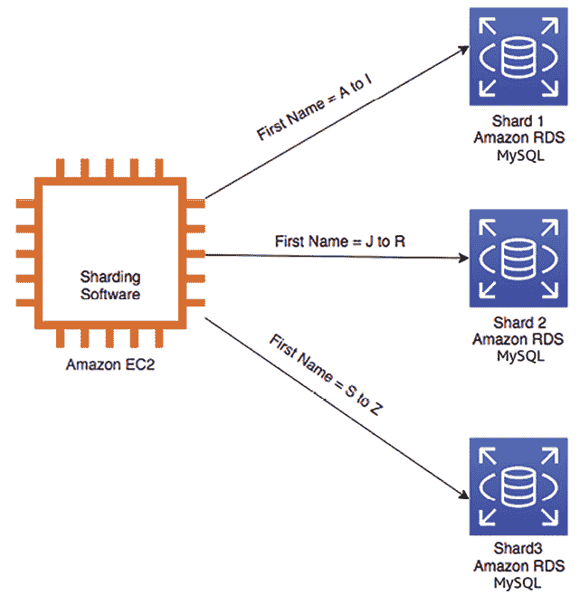

图 4.16：关系型数据库分片

如前图所示，未进行*分片*时，所有数据都位于一个分区中，例如，所有用户的名字都存储在同一个数据库中。进行分片后，数据会被分割成称为分片的大块。例如，所有名字以**A 到 I**开头的用户在一个数据库中，**J 到 R**在另一个数据库中，**S 到 Z**在第三个数据库中。在许多情况下，分片能提供更高的性能和更好的操作效率。

使用 Amazon RDS 进行分片后端数据库时，需要在 Amazon EC2 实例上安装分片软件，如 MySQL，并搭配 Spider 存储引擎。随后，您可以开始设置多个 RDS 数据库，并将它们作为分片的后端数据库。

然而，如果您的主数据库实例宕机怎么办？在这种情况下，您需要保持数据库的高可用性。让我们更详细地了解一下高可用性数据库模式。

## 高可用性数据库模式

为了确保应用程序的高可用性，保持数据库持续运行至关重要。由于关系型数据库的水平扩展并非直接可行，因此带来了额外的挑战。为了实现高可用性的数据库，您可以拥有一个主数据库实例的备用副本，如下图所示：

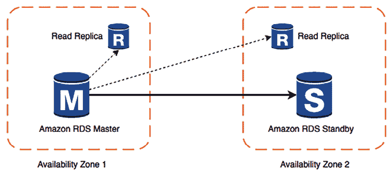

图 4.17：高可用性数据库模式

如前图所示，如果主实例出现故障，您的应用服务器会切换到备用实例。读取副本将分担主实例的负载，以处理延迟。主实例和备用实例位于不同的**可用区**，因此即使一个可用区完全故障，您的应用程序仍然可以正常运行。这种架构还帮助实现零停机时间，避免了数据库维护窗口期间可能出现的停机。当主实例进行维护时，应用程序可以切换到次级备用实例，继续处理用户请求。

对于灾难恢复，您需要根据应用程序的**恢复点目标**（**RPO**）来定义数据库备份和归档策略，决定您希望多频繁地进行备份。您将在*第八章*，*架构可靠性考虑*中深入了解 RPO 和 RTO。

如果您的恢复点目标（RPO）是 30 分钟，意味着您的组织只能容忍 30 分钟的数据丢失。在这种情况下，您应每半小时进行一次备份。在存储备份时，您需要确定数据可以存储多长时间以便客户查询。您可以将数据存储六个月作为活跃备份，然后根据合规要求存储到归档存储中。

考虑您需要多快访问备份，并根据公司的**恢复时间目标**（**RTO**）确定所需的网络连接类型，以满足您的备份和恢复要求。

例如，如果贵公司的 RTO 是 60 分钟，意味着您应具备足够的网络带宽，以便在一个小时内检索并恢复您的备份。同时，确定您是备份整个系统的快照，还是备份附加到系统的卷。

您可能还需要对数据进行分类，例如，如果数据包含客户敏感信息，如电子邮件、地址、个人身份信息等，您最好根据此定义数据加密策略。您将在*第七章*，*安全性考虑*中学习更多关于数据安全的内容。

根据您应用程序的增长和复杂性，考虑将从关系型数据库管理系统（RDBMS）迁移到 NoSQL 数据库。NoSQL 可以提供比大多数关系型数据库更强的可扩展性、管理性、性能和可靠性。然而，从 RDBMS 迁移到 NoSQL 的过程可能既耗时又费力。

在任何应用程序中都需要处理大量数据，例如点击流数据、应用日志数据、评分和评论数据、社交媒体数据等。分析这些数据集并获得洞察可以帮助您以指数级增长您的组织。*第十二章*，*解决方案架构的数据工程*将教您更多关于这些用例和模式的内容。

现在，让我们了解如何使用清洁架构构建一个可维护的系统。

# 清洁架构

清洁架构，也称为六边形架构或端口和适配器架构，是一种用于设计业务应用程序的架构模式。由 Robert C. Martin 提出，强调关注点分离、可维护性和可测试性。清洁架构旨在随着时间的推移创建一个灵活、可适应且易于维护的系统。

清洁架构将您的应用程序分为五个关键组件；让我们通过在线书店的示例来理解它们：

1.  **实体（最内层）**：实体是封装核心业务规则的业务对象。它们独立于任何特定技术、数据库或框架。实体代表系统中的“事物”及其能够执行的操作。在在线书店中，一个`Book`实体可能具有诸如标题、作者、价格等属性，并且具有检查可用性或应用折扣的方法。

1.  **用例**：用例包含应用程序特定的规则，并定义实体如何互动以完成特定的场景或用户故事。它们协调实体与外部接口之间的数据和动作流。它们也是与技术无关的，只关注业务逻辑。例如，结账用例可能涉及验证购物车、应用折扣、计算运费和处理支付等操作。

1.  **接口（端口）**：接口定义了不同层之间如何交互的契约。它们创建了一个边界，将内层（实体和用例）与外层（适配器、框架和驱动）分开。这种分离提供了灵活性和可维护性。可能会有一个支付处理的接口，定义了处理支付和退款等方法。

1.  **适配器**：适配器实现接口并在内外层之间进行转换。它们使得应用能够与外部组件（如数据库、API 或第三方库）进行交互。适配器让核心逻辑保持与技术变化或外部依赖的隔离。一个数据库适配器可能会实现一个数据访问接口来处理与特定数据库技术的交互。

1.  **框架和驱动（最外层）**：这一层包含了构建应用程序所使用的所有技术细节和工具，包括 web 服务器、数据库、UI 框架、第三方库等。这一层通过适配器与核心应用连接到外部世界。这可能包括使用特定的 web 框架实现 RESTful API、设置与 SQL 数据库的连接，或与第三方支付网关集成。

在清洁架构中，每一层都是独立的，允许对一层的修改不影响其他层。你可以更换数据库、更改 UI 框架或修改业务逻辑，而不会在系统中引起连锁反应。由于架构有明确定义的接口，创建模拟对象或存根进行测试变得更加容易。核心业务逻辑可以独立于数据库、UI 或其他外部依赖进行测试。

在使用清洁架构时，确保避免过度工程化。对于简单或小型项目，清洁架构的复杂性和开销可能需要重新评估。需要仔细考虑其带来的好处是否超出了增加的复杂性和开发时间。

清洁架构为开发能够适应不断变化的技术和需求的软件提供了一个稳健且灵活的基础。专注于分离关注点并明确各层之间的边界，有助于提升可维护性、可扩展性和可测试性。这是一个强大的模式，能够在复杂系统中发挥良好作用，但必须在理解具体项目需求和背景的基础上应用，以避免不必要的复杂性。

现在，你已经学习了各种架构模式和最佳实践。让我们了解一下设计应用架构时需要小心的关键反模式。

# 避免在解决方案架构中使用反模式

在本章中，你学习了使用各种设计模式设计解决方案架构的不同方法。通常，由于时间压力或资源不足，团队可能会偏离最佳实践。建议尽量避免以下架构设计反模式。反模式作为设计不良系统的示例：

+   在反模式中，扩展是反应式和手动处理的。当应用服务器达到最大容量且没有更多可用资源时，用户会遇到访问应用程序的中断问题。只有当用户开始报告问题时，管理员才会意识到这个问题。然后，管理员启动新服务器实例的过程，以减轻现有服务器的负载。然而，这种方法有一个缺点，通常在实例启动和实际可用之间会有几分钟的延迟。在此期间，用户会遇到服务中断，无法访问应用程序。你应该采取主动的方法，使用自动扩展，在服务器达到某个阈值时添加处理能力，例如 CPU 使用率达到 60% 或内存使用率达到 60%。

+   在反模式下，缺少自动化。当应用服务器崩溃时，管理员手动启动并配置新服务器，并手动通知用户。自动化检测不健康资源并启动替换资源可以简化操作。此外，还可以在发生资源变化时实现自动通知。

+   在反模式下，服务器会长时间保持硬编码的 IP 地址，这限制了灵活性。随着时间的推移，服务器配置可能变得不一致，导致资源分配效率低下，部分资源在不需要时仍然运行。你应该保持所有服务器的一致性，并能够切换到新的 IP 地址。你还应该自动终止任何未使用的资源。

+   在反模式下，应用程序是以单体方式构建的，其中所有架构层，包括 web 层、应用层和数据层，都紧密耦合并依赖于服务器。如果某个服务器崩溃，会导致整个应用程序崩溃。通过在应用层和 web 层之间添加负载均衡器，可以保持它们的独立性。如果某个应用服务器不可用，负载均衡器会自动将所有流量重定向到剩余的健康服务器。

+   在反模式中，应用程序与服务器绑定，服务器之间直接通信。用户认证和会话存储在服务器本地，所有静态文件都从本地服务器提供。你应该创建一个面向服务的 RESTful 架构，在这种架构中，服务之间使用标准协议如 HTTP 进行通信。用户认证和会话应该存储在低延迟的分布式存储中，以便横向扩展应用程序。静态资源应该存储在与服务器解耦的集中式对象存储中。

+   在反模式中，会使用单一数据库来满足所有需求。你使用关系数据库处理所有需求，这会引入性能和延迟问题。你应该根据需求使用正确的存储，例如以下几种：

    +   使用 NoSQL 存储用户会话

    +   用于低延迟数据可用性的缓存数据存储

    +   用于报告需求的数据仓库

    +   用于事务数据的关系数据库

+   在反模式中，你可能会发现单点故障，即只有一个数据库实例来为应用程序提供服务。每当可能时，应该从架构中消除单点故障。建立一个备用服务器，并复制数据。当主数据库服务器出现故障时，备用服务器可以接管工作负载。

+   在反模式中，静态内容如高分辨率图像和视频直接从服务器提供，而不进行缓存。最好考虑使用 CDN 来缓存重型内容，靠近用户位置，这有助于提高页面延迟并减少页面加载时间。

+   在反模式中，你可能会发现安全漏洞，导致服务器访问没有细粒度的安全策略。你应该始终应用最小权限原则，即从没有访问权限开始，只给需要的用户组提供访问权限。

上述内容提供了一些最常见的反模式。在本书中，你将学习如何在解决方案设计中避免这些反模式的最佳实践。

# 总结

本章深入探讨了如何通过各种架构范式构建强大且可扩展的软件架构。首先，讨论了 n 层分层架构，分析了构成 Web、应用和数据库层的基本组件。讨论随后过渡到多租户**软件即服务**(**SaaS**)架构，深入探讨了在统一框架中容纳不同用户群体的复杂性和好处。

至于 Web 服务，本章深入探讨了 RESTful 架构风格，阐明了其原则和应用。随后，作者带领读者构建了一个 RESTful 电商架构，提供了关于实际应用的实用见解。

随后讨论了基于缓存的架构，全面探索了缓存分发、代理模式（如缓存代理和重写代理）以及应用缓存等高效缓存策略。对 Memcached 和 Redis 的比较研究揭示了选择最佳缓存解决方案的方法。

通过探索**模型-视图-控制器**（**MVC**）方法和**领域驱动设计**（**DDD**）方法论，强调了架构模式的重要性，使架构师能够创建结构化、适应性强和可维护的系统。

通过深入讨论断路器模式和实施隔舱模式以提升系统稳定性，涵盖了架构的弹性。进一步介绍浮动 IP 模式丰富了您实现高可用性的工具包。

本章深入探讨了容器化，揭示了容器的多重好处，并提供了有效容器部署的路线图。在应用架构中研究了数据库处理策略，关注高可用性模式以确保数据完整性和持续运行。

本章以突出**干净架构**原则为主题，并传授避免解决方案架构中有害反模式的策略作为结束语。

通过参与这次架构探险，您深入了解了构建具有弹性、可扩展和未来准备性软件系统的复杂性，并且现在拥有了足够的知识来应对现代技术动态的挑战。

# 留下评论！

喜欢这本书吗？通过留下亚马逊评论来帮助像您一样的读者。扫描下方的二维码，获取您选择的免费电子书。

