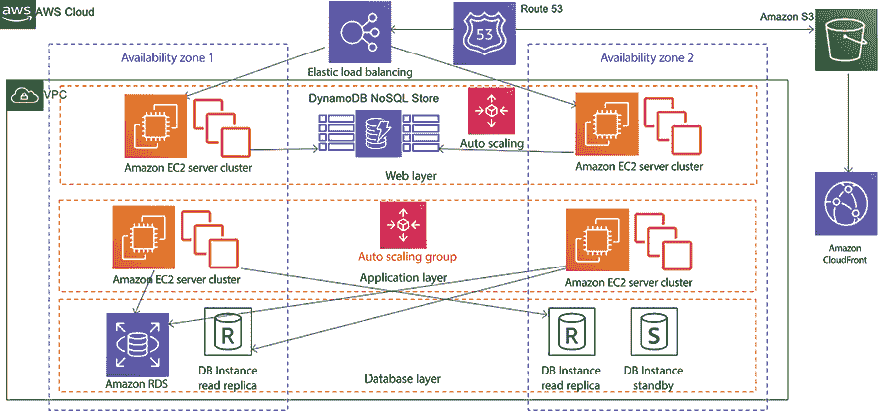
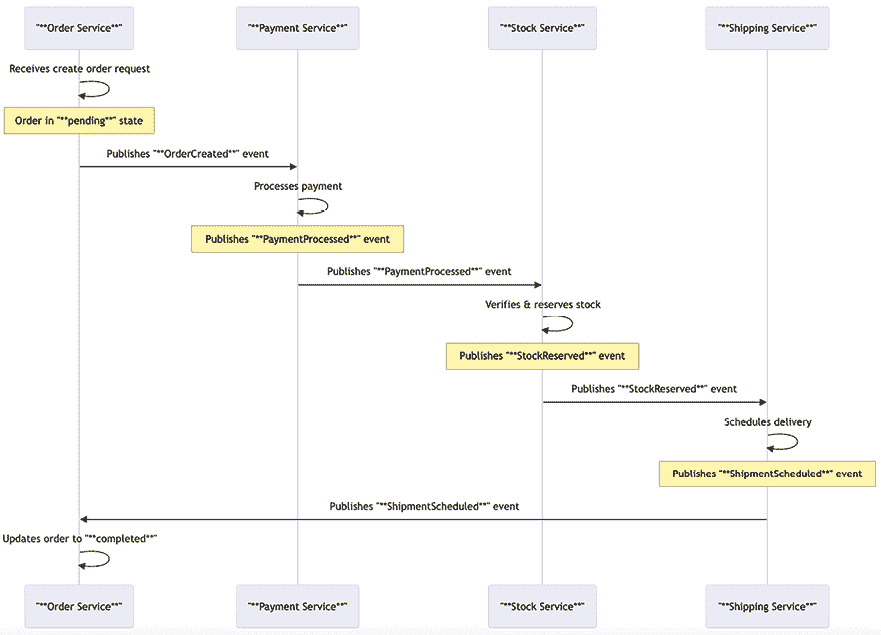
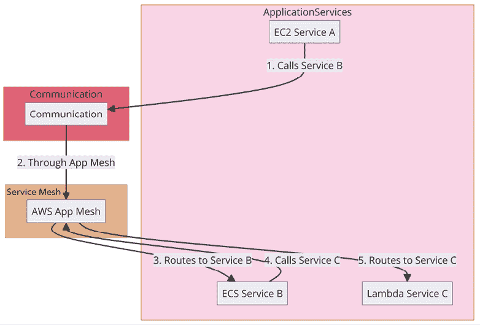
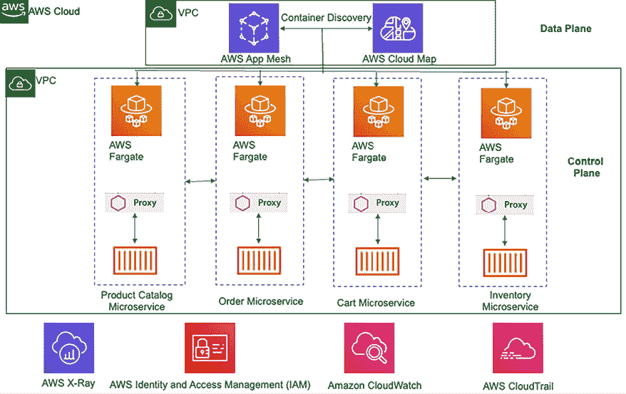
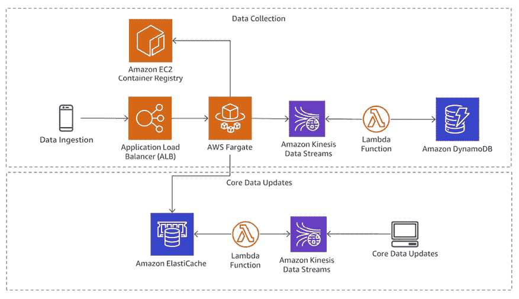
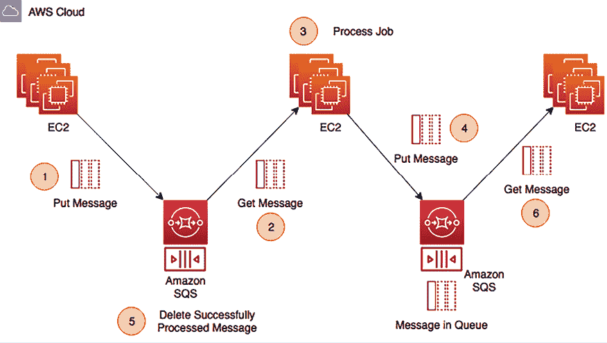
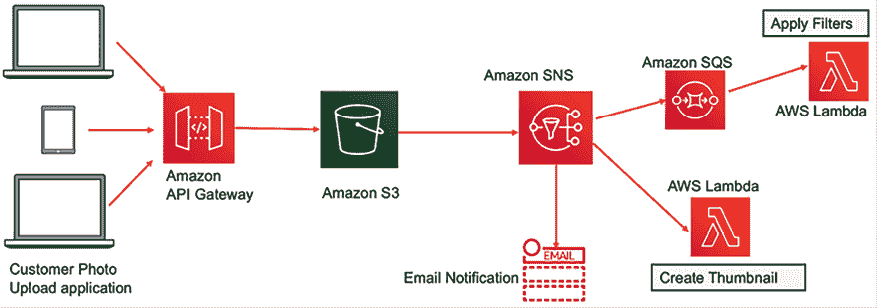
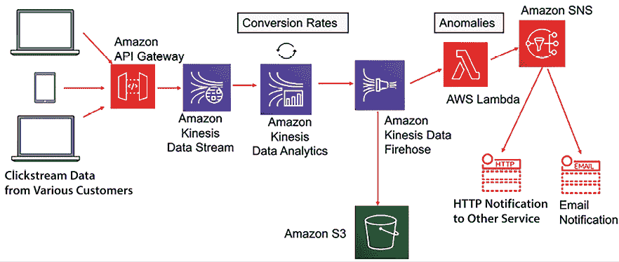

# 第五章：5

# 云原生架构设计模式

在数字化转型快速发展的时代，企业越来越多地转向云平台，提供可扩展、具备弹性且具成本效益的解决方案。采用云原生架构正成为寻求敏捷性、创新和运营效率的组织的战略必需。本章将引导您设计和实施云原生架构的旅程，重点介绍架构模式、设计和最佳实践。

本章将全面介绍各种云原生设计模式，包括设计原则和实际案例。除了架构设计模式外，您还将学习云原生架构设计中的反模式，帮助您了解应避免的做法。

本章将涵盖以下主题。

+   什么是云原生架构？

+   构建无服务器架构

+   构建无状态与有状态的架构设计

+   创建微服务架构

+   响应式架构

+   构建基于队列的架构

+   管道与过滤器架构

+   创建事件驱动架构

+   前端后端（BFF）

+   云原生架构反模式

到本章结束时，您将对云原生架构模式有一个坚实的理解，并能够设计、构建和优化您的云原生解决方案。

# 什么是云原生架构？

在*第三章*，*云迁移与混合云架构设计*中，您介绍了云迁移的不同策略，包括提升与迁移、重新平台化、重新购买、淘汰等。为了充分利用云的优势和定价模型，采用云原生架构至关重要。云原生架构指的是一种构建和运行应用程序的设计方法，旨在最大化利用云计算的优势和能力。它涉及将应用程序设计为在动态云环境中高效、可扩展且具有弹性。

云原生应用程序是基于利用云服务、自动化和现代开发实践的原则进行开发的。云原生架构的关键特点包括：

+   **微服务**：云原生应用程序通常由较小、松耦合的服务组成，这些服务被称为微服务。每个微服务处理一个特定的业务能力，可以独立开发、部署和扩展。

+   **无服务器计算**：云原生应用通常利用无服务器计算来实现无缝扩展和成本降低。这种方法使开发者能够专注于代码和应用逻辑，而无需担心管理服务器，从而实现自动扩展和高效的资源使用，显著降低运营成本。无服务器架构将应用程序及其依赖项打包，确保在不同环境中的一致性，便于无缝部署、扩展和应用的可移植性。

+   **弹性和可扩展性**：云原生应用能够根据需求进行上下扩展，实现高效的资源利用和成本节省。这是通过自动扩展和负载均衡来实现的。

+   **弹性和容错性**：云原生应用被设计为具备容错能力。它们采用冗余、自动恢复和容错机制等实践，确保即使在发生故障时也能持续运行。

+   **自动化**：云原生架构强调自动化，包括部署、扩展、监控和恢复等过程。自动化减少了人工干预，提高了效率，并降低了人为错误的风险。

+   **DevOps 实践**：云原生开发鼓励开发与运维团队的紧密合作，促进持续集成、持续交付和快速迭代的文化。

+   **无状态性**：云原生应用设计为无状态，即每个组件不依赖于服务器的本地状态。这增强了可扩展性，并便于水平扩展。

+   **API 优先**：**API**（**应用程序编程接口**）在云原生架构中至关重要。应用程序设计时会提供清晰且文档化的 API，促进微服务之间的通信，并促进与其他服务的集成。

+   **持续监控和改进**：云原生应用会持续监控，以确保最佳性能和可靠性。通过数据驱动的洞察来识别需要改进和优化的领域。

在将应用迁移到云端时，不仅仅是将它们原封不动地搬移。相反，这是一个优化并充分利用云端特性以获得最大优势的机会。首先，云端的按需付费模式是一个变革性的因素。意味着你只需为实际使用的资源付费，成本直接与实际消耗挂钩。这提供了弹性和成本效率，因为你可以根据需求进行上下扩展，而无需投资固定基础设施。仔细规划资源配置非常重要，以避免过度配置和不必要的成本。

云计算中可用的全球基础设施是另一个重要的优势。你可以将应用部署在更接近用户的不同地区，从而减少延迟并改善用户体验。这种全球覆盖使你能够在不投资全球物理数据中心的情况下，服务更广泛的用户群体。

从**资本支出**（**CapEx**）到**运营支出**（**OpEx**）的转变是云计算中的一个重要财务优势。与前期的硬件和维护投资不同，费用在时间上得以分摊。这更符合预算规划，并允许你更高效地分配资源。然而，在分布式团队和应用的背景下，成本管理成为一大挑战。必须在不同团队之间建立有效的成本控制措施。

云原生架构使得组织能够充分利用云计算的优势，包括可扩展性、灵活性和成本效益。考虑一个媒体流应用的例子，以突出云原生架构与无服务器方法相比于传统本地架构的区别和优势。

在云原生架构中，媒体流应用通过微服务和无服务器计算来设计。应用的不同部分，如用户认证、内容推荐、视频编码和存储，分别作为独立的微服务开发。这些微服务被封装在无服务器函数中，使其能够响应特定的事件或触发条件。例如，当新视频上传时，可以自动调用视频编码功能，而内容推荐功能可以响应用户互动。托管的云服务负责数据库、存储、认证，甚至无服务器函数的执行。

在传统本地架构中，媒体流应用托管在公司的服务器和基础设施上。单体应用处理所有任务，包括认证、内容提供和视频处理。扩展需要人工干预和额外的硬件采购。

在采用云原生开发时，需要注意潜在的服务提供商锁定问题。这意味着，使用特定云服务提供商的原生工具和服务（如 AWS）设计架构时，由于每个平台的服务具有独特的专有性质，可能无法顺利迁移到另一个提供商。不同平台上的服务名称可能不同，调用这些服务的方法也可能存在显著差异。虽然云原生功能为优化特定平台上的操作提供了强大的能力，但如果你后来决定迁移到其他云服务提供商，可能会带来一些挑战。仔细考虑利用这些先进功能与保持一定程度平台独立性之间的平衡。

采用云原生架构和无服务器方法，相较于传统的本地部署方式，具有许多优势。微服务和无服务器计算的结合使得应用能够在确保弹性和实时响应用户动态需求的同时，提供卓越的性能、可扩展性、成本效益和快速创新。

让我们更详细地了解无服务器架构。

# 构建无服务器架构

在传统的场景中，如果你想开发一个应用程序，你需要有一台服务器来安装你所需的操作系统和软件。在编写代码时，你需要确保服务器正常运行。在部署过程中，你需要添加更多的服务器以应对用户需求，并添加自动扩展等机制，来管理所需的服务器数量以满足用户请求。在这种情况下，大量精力投入到基础设施管理和维护上，这与您的业务问题无关。

无服务器意味着不需要服务器来托管你的代码，从而免除了自动扩展和解耦的开销，同时提供了一种低成本的模式。采用无服务器架构使你能够专注于应用，编写功能实现的代码，而无需担心底层基础设施的维护。

在 AWS 中，提到无服务器，首先想到的是 AWS Lambda 函数，这是 AWS 云提供的**函数即服务**（**FaaS**）。为了使您的应用成为面向服务的架构，Amazon API Gateway 提供了将 RESTful 接口放置在 AWS Lambda 函数前端的能力，帮助您将其作为微服务暴露。Amazon DynamoDB 提供了一个高度可扩展的 NoSQL 数据库，一个完全无服务器的 NoSQL 数据存储，而 Amazon **简单存储服务**（**S3**）提供无服务器的对象数据存储。

让我们看一个在 AWS 上交付安全调查的无服务器架构示例，见下图：

图 5.1：AWS 无服务器架构示例——安全调查交付

上述图示展示了用于客户调查应用的安全无服务器架构的流程，该应用托管在 AWS 上：

1.  客户发起对调查网站的安全 HTTPS 请求。静态网页，包括用于 AJAX 调用的任何客户端脚本，将直接从配置为网页托管的 Amazon S3 存储桶中提供。

1.  完成调查后，客户提交他们的回答。这触发了客户端浏览器向 Amazon API Gateway 发起 AJAX 调用。API Gateway 被配置为暴露接收调查数据所需的接口，并且进行了安全配置，确保只有授权的调用被处理。

1.  Amazon API Gateway 与 AWS CloudTrail 内建集成，后者会记录所有对 API 的请求。这意味着每个调查提交都会被记录下来，提供一条审计跟踪，便于排查丢失数据或调查可疑活动。

1.  API Gateway 将传入的 AJAX 调用转换为触发 AWS Lambda 函数的事件。这个无服务器函数负责处理调查数据，可能包括验证、转换以及应用与调查要求相关的业务逻辑。

1.  在处理完数据后，Lambda 函数会将调查结果安全地发送到另一个专门用于存储这些提交内容的 Amazon S3 存储桶。结果通过服务器端加密进行加密，确保静态数据受到保护，防止未经授权的访问。

1.  除了加密的调查结果，任何非敏感的元数据（不包括个人身份信息）会同时存储在 Amazon DynamoDB 表中。这些元数据可能包括时间戳、调查版本信息或其他与未来查询、报告或分析相关的上下文数据。

由于无服务器架构的日益流行，随着本书的进展，您将看到更多使用无服务器服务的示例架构。现在，AWS **SAM**（**无服务器应用模型**）提供了简洁的语法，用于创建函数、API 和专门为无服务器环境量身定制的数据库。让我们深入了解无服务器架构的设计考虑因素。

## 无服务器架构的考虑事项

在构建无服务器架构时，必须考虑一些关键因素，以确保应用程序的成功部署和运行。无服务器架构非常适合将应用拆分为更多模块化组件的设计。当你可以将应用程序分解为独立可扩展的服务时，这种方法尤其有效。然而，如果你的项目需要在一个单一的、庞大的模块中构建复杂的逻辑，那么选择传统的基于服务器的架构可能更为有利。

尽管无服务器架构提供了诸多好处，但通常会面临冷启动的问题，这可能影响应用启动的延迟。虽然对用户而言，基础设施看似是无服务器的，但像 AWS 这样的云服务商通过在后台创建一个抽象层来运营，根据需要动态启动服务器。这一过程有时可能需要一些时间，导致在函数空闲后被调用时出现延迟——即“冷启动”。在设计无服务器架构时，必须关注冷启动问题，并实施相应的策略来缓解这一问题，确保应用保持响应迅速并高效运行。

让我们通过一个例子来探讨：为社交媒体平台开发一个实时通知系统。系统必须在用户收到点赞、评论或新好友请求时，立即向他们的设备发送通知。以下是我们为通知系统设计无服务器架构时需要考虑的一些关键因素：

+   **精细化函数设计**：将应用程序逻辑分解为小而独立的函数。每个函数应执行特定任务或处理特定事件。这种精细化设计确保了资源的高效利用和更好的可扩展性。你可以为发送点赞、评论和好友请求设计独立的函数。

+   **无状态性**：无服务器函数设计为无状态的。任何需要的状态应该由外部管理，例如在数据库或存储服务中。这确保了函数可以扩展，并且在不影响应用程序行为的情况下轻松替换。确保每个函数都是无状态的，并且不依赖于本地内存。所有必要的数据，例如用户偏好或通知历史，应该存储在数据库中。

+   **事件驱动设计**：无服务器架构非常适合事件驱动型应用程序。设计你的函数以响应特定事件触发，例如用户操作或数据变化。例如，当用户收到新的好友请求时，应触发相应的函数。

+   **冷启动**：无服务器函数在首次调用时可能会出现延迟，称为“冷启动”。这可能会延迟通知的发送，因此架构设计应尽量减少冷启动的影响，例如通过使用预配置的并发性来保持一定数量的函数实例处于“热”状态，随时准备处理传入的请求。

+   **可扩展性**：无服务器平台会根据需求自动扩展函数。这使得应用程序能够处理突发流量峰值而无需人工干预。随着用户活动的增加，系统能够处理更多的通知，而无需人工干预。

+   **性能考虑**：了解无服务器平台的限制，例如执行时间限制和内存约束。优化你的函数性能，确保你的通知系统在高流量期间依然能保持响应。

+   **分布式追踪和监控**：实现监控和分布式追踪，以便了解无服务器函数的性能。这对于识别瓶颈和诊断通知传送问题至关重要。

+   **安全性**：为无服务器应用程序实施安全最佳实践，避免未经授权访问通知。这包括适当的身份验证、授权以及数据在静态和传输过程中的加密。

+   **成本管理**：虽然无服务器架构可以节省成本，但监控使用情况和费用至关重要。设置预算提醒并使用云服务提供商的工具分析支出模式。采用无服务器架构时，您为执行时间付费，因此优化代码以减少执行时间，并考虑使用成本分析工具来监控使用情况。

+   **数据存储和持久化**：为您的数据选择适当的存储解决方案，例如托管数据库、对象存储或数据仓库。确保在函数调用之间的数据持久性。对于我们的通知系统，我们将把用户偏好和通知历史存储在托管数据库中，确保数据在函数调用之间的持久性。

+   **依赖关系**：在编写函数时，要注意依赖关系。包含不必要的库或组件会增加部署包的大小，并影响性能。尽量减少依赖，以保持函数部署包小巧高效。

+   **测试和调试**：为您的无服务器函数开发有效的测试策略。使用云服务提供商提供的本地模拟器和调试工具。

+   **利用托管服务**：无服务器架构并不意味着每个组件都必须是一个函数。可以使用托管服务来处理应用架构中的其他部分，例如数据库、队列和认证。

+   **合规性和法规**：考虑与您的应用程序相关的合规性或监管要求，特别是在处理敏感数据或涉及严格监管的行业时。确保架构符合数据保护法规，特别是在处理个人信息时。

通过仔细处理这些注意事项，您可以创建一个架构良好的无服务器应用程序，充分利用自动扩展、成本效益和简化的管理。无服务器架构确保了可扩展性、成本效益和响应迅速的通知交付，而无需担心管理基础设施。

在开发无服务器架构时，强调无状态性至关重要。通过设计无状态应用程序，您减少了对服务器管理会话状态的依赖，从而有助于扩展性。无状态架构是扩展云原生架构的关键。让我们更深入了解它。

# 构建无状态和有状态的架构设计

无状态和有状态架构设计代表了在软件应用程序中管理客户端-服务器交互的两种不同方法。无状态架构将每个客户端请求视为一个独立的、单独的事务，不需要了解之前的交互；这简化了设计并增强了可扩展性，因为任何服务器都可以响应任何请求，无需维持会话信息。另一方面，有状态架构在多个请求之间保留客户端会话信息，允许进行更个性化和上下文感知的交互，但需要在管理会话数据时付出更高的复杂性代价，并且在扩展时面临挑战，因为状态必须在服务器实例之间始终可用并保持同步。

在设计复杂的应用程序（如电子商务网站）时，你需要处理用户状态以保持活动流程，用户可能会执行一系列活动，例如将商品添加到购物车、下单、选择配送方式和进行支付。用户可以通过各种渠道访问应用程序，因此很可能会在设备之间切换——例如，从手机上将商品添加到购物车，然后从笔记本电脑上完成结账和支付。为应对这种情况，你应该在不同设备之间保持用户活动的持久化，并保持其状态直到交易完成。因此，你的架构设计和应用程序实现必须规划用户会话管理，以满足这一需求。

为了保持用户状态并使应用程序无状态，用户会话信息需要存储在持久化的数据库层中，例如 NoSQL 数据库。这些用户状态可以在多个 Web 服务器或微服务之间共享。

传统上，单体应用程序使用有状态架构，将用户会话信息存储在服务器中，而不是通过任何外部持久化数据库存储。

无状态和有状态应用程序设计的关键区别在于它们如何处理会话存储。在有状态应用程序中，会话信息存储在服务器本地，这意味着它不能轻易地与其他服务器共享。这种设置对扩展性构成挑战，并且不太适合现代微服务架构，因为它要求所有后续请求都必须路由到处理第一个请求的原始服务器。这会大大限制应用程序在多个服务器或实例之间扩展的能力。另一方面，无状态设计不在服务器上存储会话数据，使得任何服务器都可以处理任何请求，这增强了应用程序的可扩展性和灵活性。是否采用无状态或有状态方法，取决于应用程序的需求，特别是在扩展性需求和持续个性化用户体验之间如何平衡。

## 有状态架构

在有状态应用程序中，状态信息由服务器处理，因此一旦用户与特定服务器建立连接，他们必须坚持使用该服务器直到事务完成。你可以在有状态应用程序前放置负载均衡器，但要做到这一点，你必须在负载均衡器中启用粘性会话。

粘性会话是一种确保来自特定用户会话的所有请求都被定向到处理初始请求的相同服务器的技术。在有状态应用程序中，这种方法是必要的，以保持会话一致性，因为它可以防止在随后的请求被路由到不同的服务器时丢失会话数据。通过使用粘性会话，负载均衡器偏离了其通常通过轮询方法将请求均匀分配到各个服务器的标准做法，而是将用户的请求路由到其会话信息所在的特定服务器。尽管这种方法支持会话持久性，但它也带来了挑战，例如可能因过多的持久连接而导致单个服务器超载。为了解决这个问题，实施会话超时机制变得至关重要，确保会话不会无限期地占用服务器资源。

通常，有状态应用程序不支持良好的水平扩展，因为应用程序的状态保留在服务器中，无法替换。当用户基数较小时，有状态应用程序表现良好。然而，随着互联网的普及，合理的假设是，你将在一个 Web 应用程序中拥有数百万活跃用户。因此，高效的水平扩展对于处理大量用户并实现低延迟应用程序至关重要。

## 无状态架构

使用无状态方法时，你的设计方法应该更多地关注共享会话状态，因为它允许水平扩展。

以下图表展示了一个无状态应用程序架构，适用于一个使用 AWS 的示例 Web 应用程序：

图 5.2：无状态应用程序架构

所示的 AWS 架构为跨两个可用区的三层应用程序提供了一个安全、高可用和可扩展的环境，以实现容错。它使用弹性负载均衡将流量分配到 EC2 服务器集群，这些集群通过自动扩展动态调整以满足变化的需求。由 Amazon RDS 支持的数据库层包括一个用于查询扩展的只读副本和一个用于故障转移的备用实例，确保数据持久性和高可用性。静态内容通过 Amazon S3 提供，并通过 Amazon CloudFront 高效传递，同时 AWS Route 53 管理 DNS 服务以优化用户流量路由。该设置确保了应用程序的运营弹性、成本效益和性能优化。为了使应用程序松散耦合并具备可扩展性，所有用户会话都持久存储在 NoSQL 数据库中，例如 Amazon DynamoDB。

对于会话 ID，你应该使用客户端存储，如 cookies。这种架构使你可以通过增加更多服务器来水平扩展应用程序，而无需担心丢失用户状态信息。无状态架构消除了创建和维护用户会话的开销，并允许应用程序各模块之间的一致性。无状态应用程序还具有性能优势，因为它减少了服务器端的内存使用，并消除了会话超时问题。

实现无状态架构涉及一些复杂性，例如集成额外的数据库组件来存储用户会话，以及创建一个附加层以便在服务器间检索正确的用户会话。然而，通过正确的方法，你可以为用户群体创造出一个有益的体验。你可以使用微服务方法结合 REST 设计模式来开发应用程序，并将其部署在容器中。为此，使用身份验证和授权来将用户连接到服务器。

在接下来的章节中，你将学习更多关于微服务和 REST 设计模式的知识。由于从多个 Web 服务器访问用户会话信息时，重点是单一的数据存储位置，因此必须小心，以防止数据存储的性能成为瓶颈。

# 创建微服务架构

在云原生架构中，微服务在将庞大的功能拆分为可以独立扩展的更小模块方面发挥着至关重要的作用。这种方法使得可以根据需要扩展或缩减特定组件，而不会影响整个系统。通过使用微服务，系统设计时会考虑到故障容忍性，意味着系统是基于潜在故障构建的，从而可以优雅地降低应用程序的可用性，并防止广泛的系统故障。

微服务的明显优势在于你只需维护较小的代码面。微服务应该始终是独立的。你可以构建每个服务时没有外部依赖，所有的前提条件都包含在内，这减少了应用模块之间的相互依赖，实现松耦合。

微服务的另一个核心概念是**界限上下文**，它们是构成单一业务领域的模块。一个业务领域可以是零售、汽车制造、书籍销售，或者涉及完整业务流程的社交网络互动。每个微服务定义了一个边界，所有细节都在其中封装。例如，我们考虑一个电商平台。在这样的系统中，你将有几个微服务处理业务的不同方面。以下是平台中的一些界限上下文：

1.  **用户账户上下文**：这个微服务处理与用户账户相关的所有事务，包括用户注册、个人资料管理、登录和认证。它的边界涵盖了用户信息和可以在这些数据上执行的操作，例如更新个人资料或重置密码。其他微服务不会管理这些操作。

1.  **产品目录上下文**：这个微服务负责管理产品列表、类别和产品详情。它独立于用户账户上下文操作，专注于产品、它们的组织以及如何向用户展示这些信息。

1.  **订单处理上下文**：这个微服务处理结账流程、订单跟踪和支付处理。它使用来自产品目录上下文（例如，产品 ID、价格）和用户账户上下文（例如，客户详情）中的信息来完成其功能，但保持独立操作，例如更新订单状态或处理退货。

每个界限上下文都是一个自包含的系统，具有自己的领域逻辑和数据库，通过明确定义的 API 与其他上下文进行通信。这些边界使得每个微服务可以独立开发、部署、扩展和更新，从而使整体系统更具韧性和适应变化的能力。

通过定义这些边界，电商平台可以确保一个上下文中的更改，例如在订单处理上下文中添加新的支付方式，不会影响用户账户或产品目录上下文，从而使系统更加可维护和可扩展。

在处理大规模访问应用时，扩展每个服务是至关重要的，因为不同的工作负载有不同的扩展需求。

让我们来学习一些设计微服务架构的最佳实践：

+   **创建独立的数据存储**：为每个微服务采用独立的数据存储，允许各个团队为他们的服务选择最合适的数据库。例如，网站流量团队可以使用可扩展的 NoSQL 数据库来存储半结构化数据。处理订单服务的团队可以使用关系数据库，以确保数据完整性和事务一致性。这还帮助实现松耦合，即一个数据库的变更不会影响其他服务。

+   **保持服务器无状态**：正如你在上一节*构建无状态和有状态架构设计*中学到的，保持服务器无状态有助于扩展。服务器应该能够轻松关闭并被替换，最小化或不需要在服务器上存储状态。

+   **创建独立的构建**：为每个微服务创建独立的构建，可以让开发团队更容易地引入新的变更，提高新功能发布的敏捷性。这有助于确保开发团队只为特定的微服务构建所需的代码，而不会影响其他服务。

+   **容器化部署**：在容器中进行部署可以为你提供一种标准化的工具，用相同的方式部署所有内容。使用容器，你可以选择以相同的方式部署所有微服务，而不论它们的性质如何。你可以使用像亚马逊 Fargate 这样的无服务器容器部署服务来管理你的容器，而无需担心基础设施。

+   **无服务器架构**：当你的微服务足够简单时，尝试使用无服务器平台或具有服务功能的函数，例如 AWS Lambda。无服务器架构可以帮助你避免基础设施管理的开销。

+   **蓝绿部署**：对于应用部署，最佳方法是创建一个生产环境的副本。部署新功能并将少量用户流量路由到新环境中，以确保新功能在新环境中按预期工作。之后，逐步增加新环境中的流量，直到整个用户群体都能看到新功能。在*第十一章*，*DevOps 与解决方案架构框架*中，你将学习更多关于蓝绿部署的内容。

+   **监控你的环境**：良好的监控是反应故障和通过适当的重新路由、扩展和管理降级来主动防止故障之间的区别。为了防止应用停机，你需要服务提供并将它们的健康状态推送到监控层，因为没有什么比服务本身更了解状态。监控可以通过多种方式进行，例如使用插件或通过写入监控 API。

尽管微服务架构具有多种优点，但模块化方法也带来了管理更多基础设施的开销。你必须仔细选择工具来帮助你管理并扩展多个模块的并行运行。在设计微服务架构时，尽可能使用无服务器平台，这将有助于减轻基础设施和运营的开销。接下来，让我们看看一个基于微服务的实时投票应用架构示例。

在下面的图示中，我们展示了一种使用微服务的实时投票应用设计。该应用通过多个小的、独立的服务来处理和统计用户的投票。当用户通过手机设备投票时，应用会记录每一票，然后将所有投票存入一个 NoSQL 数据库，Amazon DynamoDB。

在 AWS Lambda 函数中包含了应用逻辑，用来聚合所有用户投给他们最喜欢演员的投票数据，并返回最终结果：

图 5.3：基于微服务的实时投票应用架构（使用 AWS）

在前面的架构中，发生了以下事情：

1.  用户向第三方提供的电话号码或短代码发送文本投票，例如 *Twilio*。

1.  第三方被配置为将消息内容发送到由 Amazon API Gateway 创建的端点，后者将响应转发到在 AWS Lambda 中构建的函数。

1.  这个函数从消息内容中提取投票，并将结果及相关元数据写入 Amazon DynamoDB 中的表。

1.  这个表启用了 DynamoDB Streams，它会跟踪表格上的变化，持续进行更新。

1.  更新后，DynamoDB Streams 通知第二个 AWS Lambda 函数，其中包含聚合投票（每秒）的应用逻辑，并将其写回到另一个 DynamoDB 表。第二个表仅存储每个类别的投票总数。

1.  用 HTML 和 JavaScript 创建了一个仪表盘，用于显示投票汇总，并作为静态网站托管在 Amazon S3 中。此页面使用 AWS JavaScript SDK 查询聚合后的 Amazon DynamoDB 表，并实时显示投票结果。

1.  最后，Amazon Route 53 是一个 DNS 提供商，用于创建指向 Amazon S3 存储桶中的自定义域名的托管区域。这使得你能够以成本效益高的无服务器方式在 S3 存储桶中托管静态网站。

这种架构不仅是基于微服务的，而且是无服务器的。通过使用微服务，你可以创建由小的独立组件组成的应用，这些组件作为更小的部分进行迭代。基于微服务的架构意味着成本、规模和变更风险都得到了降低，从而提高了变更的速度。

如果你的系统是使用微服务进行分布式的，协调多个服务变得至关重要。接下来，让我们学习如何编排多个微服务。

## Saga 模式

Saga 模式是一种设计模式，用于管理长期运行的复杂业务事务。它在微服务架构中非常有用，因为单一的业务事务可能涉及多个微服务。与传统的两阶段提交不同，Saga 模式将事务分解成多个较小、独立的事务。每个微服务处理这些较小的事务，并协调它们以确保跨服务的数据一致性。如果某个小事务失败，将执行补偿事务以撤销之前的步骤。

在需要多个服务协同完成单一操作的复杂系统中，如处理订单或预订航班，Saga 模式有助于确保如果在任何环节出现问题，整个操作要么完全完成，要么回滚。

以下是 Saga 模式的工作原理：

+   **分解**：需要执行的操作被分解成更小的、独立的步骤或事务。每个步骤对应一个由特定微服务执行的操作。

+   **补偿操作**：对于每个步骤，都会定义一个相应的补偿操作。如果某个步骤失败或发生错误，补偿操作会被执行以撤销之前步骤的效果。这样，系统会恢复到一致状态。

+   **协调者**：协调者负责协调步骤的顺序及其相应的补偿操作。它启动 Saga，监控其进度，并确保所有步骤完成或采取必要的补偿操作。

+   **本地事务**：每个步骤及其补偿操作都封装在各自微服务中的本地事务内。这保证了每个微服务内操作的原子性。

+   **最终一致性**：Saga 模式支持最终一致性，这意味着即使发生故障，系统最终也会通过成功完成整个操作或回滚到一致状态来达到一致性。

想象一个电子商务应用，客户下了一个订单。Saga 模式可以用于处理整个订单处理流程：

1.  **启动**：订单服务为订单处理启动一个新的 Saga。

1.  **步骤**：Saga 包括多个由不同微服务执行的步骤：检查产品可用性、向客户收费、更新库存并通知客户等。

1.  **补偿操作**：定义相应的补偿操作，例如，如果物品缺货：释放已收取的金额、重新进货并向客户发送道歉邮件。

1.  **协调者**：协调者负责监督 Saga，确保每个步骤都成功执行或得到补偿。例如，步骤包括检查产品是否有货、下订单、向客户收费并完成订单配送。

1.  **最终一致性**：如果任何步骤失败（例如，如果客户支付失败），则触发补偿操作，使系统回到一致的状态。

每个参与 Saga 的服务都会生成和监听事件，如下图所示：

图 5.4：电商应用架构的 Saga 模式顺序图

如前图所示，当一个服务完成其事务部分时，它会生成一个事件，触发 Saga 中的下一个服务。例如：

1.  **订单服务**接收到创建订单的请求。

1.  **订单服务**通过创建一个**待处理**状态的订单并发布**订单创建**事件来启动 Saga。

1.  **支付服务**监听**订单创建**事件，处理支付，并发布**支付处理**事件。

1.  **库存服务**监听**支付处理**事件，验证商品是否有库存，保留库存，并发布**库存已保留**事件。

1.  **运输服务**监听**库存已保留**事件，安排配送，并发布**配送已安排**事件。

1.  **订单服务**监听**配送已安排**事件，并将订单状态更新为**已完成**。

如果任何服务未能完成其事务部分，它会发布一个补偿事件来触发回滚前面的步骤。例如，如果**库存服务**发现库存不足，它可以发布**库存不足**事件。**支付服务**会监听此事件并发起退款。**订单服务**会监听**库存不足**事件并将订单状态更新为**失败**。

Saga 模式是一种设计方案，旨在解决分布式系统中数据一致性的问题，特别是在处理微服务时。Saga 模式并不依赖于单一的大规模事务来确保不同服务之间的数据一致性，而是将事务拆分为每个服务的一系列本地事务。每个本地事务更新数据库并发布事件或消息，指示事务的成功或失败。然而，Saga 模式引入了最终一致性的概念，这意味着系统的状态会随着时间的推移变得一致，但不一定是立即的。此外，实施 Saga 模式可能会很复杂，因为它需要处理失败场景并确保补偿事务正确撤销先前的操作。这通常涉及复杂的协调和强大的消息系统，以管理服务之间的异步通信。

Saga 模式允许将复杂的操作分解为可管理的步骤，并提供安全网来处理故障并保持数据完整性。它通过确保系统在发生故障时仍然保持一致性并最终达到一致，提升了分布式系统的韧性。然而，实现 Saga 模式需要谨慎的设计和协调，以有效地处理各种故障场景。如果你有大量需要多个微服务处理的信息，并且需要将其整合以生成有意义的见解，怎么办？在这种情况下，fan-out/fan-in 模式可以帮助你。让我们来了解一下它。

## Fan-out/fan-in 模式

Fan-out/fan-in 模式是分布式系统中常用的设计模式，用于高效地处理请求并从多个来源汇总数据。它适用于需要从不同输入流或来源收集、处理和整合数据的场景。该模式得名于数据如何从多个来源扩展（fan out），然后再汇聚（fan in）进行整合。

假设我们有一个社交媒体平台的实时分析系统。Fan-out/fan-in 模式可以应用于收集和处理来自各种用户活动的数据。让我们看看 fan-out/fan-in 模式是如何工作的：

+   **Fan-out 阶段**：

    +   在 fan-out 阶段，数据从多个来源收集，包括不同的微服务、API 或数据流。每个来源将其数据发送到一个独立的处理组件。用户的帖子、评论、点赞、分享和关注者生成实时数据流。

    +   每个来源的处理组件独立且同时操作。这使得高效的并行处理成为可能，减少了从不同来源收集数据的时间。每种活动类型都有一个专门的处理组件，计算诸如参与率、热门内容和趋势话题等统计信息。

+   **Fan-in 阶段**：一旦个别处理完成，来自每个处理组件的结果会被汇总或合并，在这个例子中是用来计算整体平台参与度指标。这种汇总可能涉及计算、总结或任何其他为最终结果所需的操作。汇总的数据生成所需的结果或最终报告。这可以是单一报告、总结分析或任何其他形式的整合数据。在我们的例子中，这些数据显示给管理员，作为一个实时参与度分析的仪表盘。

在这个例子中，fan-out/fan-in 模式允许分析系统高效地处理和整合来自多个用户活动的数据，为管理员提供实时的参与度见解。

**Fan-out/fan-in 模式的好处**

Fan-out/fan-in 模式是分布式系统中的一种战略方法，显著增强了数据的管理和处理方式。采用这种模式的主要好处如下：

+   **并行性**：该模式利用并行处理，允许从多个源快速收集和汇总数据。

+   **效率**：该模式通过并行处理多个源，而不是按顺序处理每个源，优化了处理时间。

+   **可扩展性**：每个源可以独立处理，使得系统能够随着源数量的增加而高效扩展。

+   **模块化**：该模式通过将数据收集（fan-out）阶段与汇总（fan-in）阶段分离，鼓励模块化设计。这使得系统更易于维护和扩展。

虽然 fan-out/fan-in 模式在分布式系统中对并行处理和提高效率有利，但它也带来了需要谨慎应对的具体挑战。实现这一模式增加了复杂性，因为它要求对多个并行任务及其后续汇总进行精确协调。错误处理变得更加复杂，因为系统必须考虑到任何 fan-out 任务中的潜在失败，并确保具备强大的恢复机制，以维持数据一致性。

该模式也可能会消耗大量资源，因为它可能需要大量的计算能力来管理并行处理，这可能导致更高的运营成本，并需要先进的扩展策略。此外，汇总阶段可能成为瓶颈，尤其是当处理大量数据时，这可能会延迟整体数据处理进度。此外，该系统可能只能实现最终一致性，这对于需要实时处理的应用程序构成挑战。最后，该模式的分布式特性使得调试和监控变得复杂，需要全面的工具来确保跨所有任务的可视性。尽管存在这些挑战，但通过精心设计和管理，fan-out/fan-in 模式依然是提高分布式架构中数据处理效率的有效策略。

总体而言，fan-out/fan-in 模式对于在分布式系统中管理和处理来自各种源的数据非常有价值，它实现了高效的并行处理和简化的汇总。

增加微服务的数量需要精心的协调，这就是服务网格发挥作用的地方。让我们进一步了解它。

## 服务网格模式

在现代软件开发中，微服务已成为构建灵活且可扩展应用程序的首选方法。然而，随着微服务数量的增加，管理它们的通信和可靠性可能变得比穿越繁忙的道路交叉口还要复杂。这时，服务网格的概念就应运而生，它简化了微服务之间的通信，同时增强了它们的稳健性。

想象你处在一个繁忙的城市交叉口，那里有多条车道。每辆车代表一个微服务，执行特定的任务。为了确保交通顺畅，防止发生碰撞，交通信号灯、标志和道路规则是必不可少的。同样，服务网格就像微服务的交通指挥员，调节它们的互动，确保它们协调工作。

服务网格是基础设施的一层，管理云应用中不同服务之间的通信。它确保这些服务之间的可靠消息传递。开发者可以专注于核心应用程序编程，而服务网格则负责系统基础设施中的网络和安全工作。

以下图示展示了以 AWS 服务为例的服务网格基础设施。

图 5.5：AWS 云中服务网格模式架构

让我们逐步了解服务网格图中展示的每个步骤：

1.  **EC2 服务 A**：表示运行服务（**服务 A**）的 Amazon EC2 实例。EC2 实例提供可扩展的计算能力，运行在**Amazon Web Services**（**AWS**）云中。

1.  **调用服务 B**：服务 A 发起对**服务 B**的调用。这是服务间通信过程的开始。

1.  **通信**：此模块表示通信层，其中捕获服务 A 的请求并通过服务网格路由。

1.  **通过 App Mesh**：来自服务 A 的请求通过 AWS App Mesh，该服务网格提供应用级网络功能。App Mesh 标准化了服务之间的通信方式，提供端到端可见性，并确保应用的高可用性。

1.  **路由到服务 B**：AWS App Mesh 将请求路由到适当的服务，本例中为服务 B。

1.  **ECS 服务 B**：表示运行服务 B 的 Amazon **Elastic Container Service**（**ECS**）任务。ECS 是一个高度可扩展、高性能的容器管理服务，支持 Docker 容器。

1.  **调用服务 C**：在服务 B 完成处理后，它调用**服务 C**。这可能是涉及多个微服务的大型事务的一部分。

1.  **路由到服务 C**：同样，AWS App Mesh 将来自服务 B 的调用路由到服务 C。

1.  **Lambda 服务 C**：表示服务 C 的 AWS Lambda 函数。AWS Lambda 让你无需配置或管理服务器就可以运行代码。它仅在需要时执行代码，并自动扩展。

该架构抽象了服务网格中服务间复杂的相互作用，展示了 AWS App Mesh 在管理、路由和控制不同服务之间通信中的作用。

以下是服务网格提供的主要功能：

+   **流量管理**：服务网格通过丰富的路由规则、重试、故障转移和故障注入提供对流量行为的详细控制。

+   **可观察性**：它们通过可视化、追踪、监控和日志记录服务之间的流量，为你提供深入的应用洞察。

+   **安全性**：服务网格提供自动化的**双向 TLS**（**mTLS**）流量加密，确保服务之间的安全通信。

+   **策略执行**：它们允许你在所有服务中一致地定义和执行策略，无论这些服务运行在哪里。

+   **弹性**：服务网格支持先进的负载均衡、超时和重试功能，帮助你构建更具弹性的应用。

实现服务网格的一种流行方式是使用 sidecar 代理。每个微服务应用中的服务实例都配有一个 sidecar 代理，处理所有进出该服务的网络通信。所有这些代理通过网络连接成网格，因此得名“服务网格”。

服务网格正成为现代云原生应用架构中不可或缺的一部分，提供多种根据不同需求和环境量身定制的实现方式。在最受欢迎的服务网格实现中，包括：

+   **Istio**：这款全面的服务网格解决方案为在微服务架构中控制服务间通信提供了强大的方式。它允许开发者定义详细的路由规则和策略，实施诸如重试和断路器等弹性模式，并收集应用流量的洞察。Istio 的政策执行和度量收集能力有助于保护和监控服务间的通信，从而提高网络的可靠性和性能。

+   **Linkerd**：以专注于简洁性和性能而闻名，Linkerd 是一个开源服务网格，提供关键特性，如服务发现、路由、故障处理和对现代应用架构的可视化。它被设计为轻量级且易于安装，具有最小的资源占用，因此对于希望在不增加大量开销的情况下采用服务网格技术的团队来说，是一个有吸引力的选择。

+   **AWS App Mesh**：专为 AWS 用户设计，App Mesh 是一种托管的服务网格服务，使得管理和控制 AWS 服务之间的微服务通信变得更加简单。它支持应用级网络，使应用服务能够在网络上进行通信，并提供更多的可见性和控制。AWS App Mesh 简化了服务通信的配置，提供了应用级的洞察力，并确保应用的高可用性。

+   **Consul Connect**：作为 HashiCorp Consul 的一部分，Consul Connect 专注于通过自动 TLS 加密和基于身份的授权来保障服务间的通信安全。它旨在平台无关，提供一种一致的、统一的方法来保障和配置跨服务的通信，无论底层平台如何。Consul Connect 强调安全性，确保只有经过授权的服务才能相互通信，从而减少内部威胁的风险。

尽管服务网格为微服务架构提供了一系列优势，如改善服务间通信、增强安全性和更好的可观察性，但在引入服务网格时，必须考虑它对基础设施带来的复杂性。引入服务网格意味着需要管理、监控和维护额外的组件，这可能会增加团队的运维负担。这一额外的基础设施层要求进行精心规划、配备专业人员进行管理，并且需要明确了解其对系统性能和复杂性的影响。因此，在决定实施服务网格之前，评估应用的具体需求，并权衡其优势与基础设施复杂度的潜在增加是非常重要的。这种谨慎的方法确保了采用服务网格的好处能够与应用的需求和团队应对额外复杂性的能力相匹配。

AWS App Mesh 是一项规范化服务间通信的服务，提供全面的监控并促进一致的可用性。以下架构图展示了使用 AWS 云服务实现服务网格模式的实现：

图 5.6 – 由 App Mesh 在 AWS 中管理的电商应用

如前图所示，Amazon Fargate 作为无服务器容器计算引擎，兼容 Amazon **弹性容器服务**（**ECS**）和 Amazon **弹性 Kubernetes 服务**（**EKS**）。以下是通过 App Mesh 实现电商应用的步骤：

1.  **创建 Fargate 服务**：将每个微服务（用户、订单、支付、产品目录和认证）定义为一个在 EKS 上的 Amazon Fargate 服务，并附上所需的任务定义。

1.  **设置 AWS App Mesh**：创建一个作为服务之间网络流量逻辑边界的网格。

1.  **定义虚拟节点**：为每个 ECS 服务在 App Mesh 中创建一个虚拟节点。虚拟节点充当指向特定 ECS 服务的逻辑指针。

1.  **创建虚拟路由器和路由**：定义虚拟路由器和路由，以控制虚拟节点之间的流量流动。

1.  **配置虚拟服务**：虚拟服务将流量路由到虚拟节点，从而实现网格内服务的发现。

1.  **部署边车代理**：将 Envoy 代理附加到每个 ECS 任务定义中，作为边车容器。Envoy 代理拦截并管理微服务之间的流量。

1.  **监控与日志记录**：使用 AWS CloudWatch 和 AWS X-Ray 监控和记录流经服务网格的流量。

实施服务网格可以增强服务间的通信、安全性和可观察性。这种方法使得您能够更高效、更有效地管理微服务架构，为复杂应用程序提供一个强大且可扩展的解决方案。从故障中恢复是构建大规模架构的一个重要方面。让我们了解反应式架构来解决这个问题。

# 反应式架构

由于云原生架构可能由于多个微服务和小模块而包含多个动态部分，因此它们需要防止故障。反应式架构是一种构建能够高效应对变化并在各种条件下保持响应性的设计方法。它有利于需要保持高可用性和响应性的、大规模和分布式系统，即使在面临故障或高需求时。

反应式架构的原则基于反应式宣言，这是一份概述反应式系统核心特征的文档：响应式、弹性、可扩展和消息驱动。您可以通过访问[`www.reactivemanifesto.org/`](https://www.reactivemanifesto.org/)了解反应式宣言的详细信息：

+   **响应式**：反应式系统优先考虑响应性，确保无论系统的负载或状态如何，都能及时响应用户请求。

+   **弹性**：反应式系统被设计为能够优雅地处理故障。即使某些组件发生故障，它们也能快速恢复并继续运行。

+   **可扩展**：反应式系统能够根据需求进行扩展或缩减，高效利用资源，并在不同负载下保持响应性。

+   **消息驱动**：在反应式系统中，组件通过异步传递的消息进行通信。这种方式使得组件可以松散连接、独立隔离，并能够从不同位置访问。

反应式架构风格高度依赖于微服务，它将功能划分为更小的、可独立扩展的服务，以提高可扩展性、可维护性和更快的部署周期。反应式系统中的通信是事件驱动的，这意味着组件通过异步事件进行交互和响应，从而更高效地利用资源并提升系统性能。

为了管理数据，响应式架构采用了去中心化的方法，每个微服务管理自己的数据，最大限度地减少对共享数据资源的依赖和争用。这不仅增强了系统的弹性，还提升了其从故障中快速恢复的能力。隔离性和自治性是响应式系统的核心，确保组件可以独立失败，而不会影响整体系统的可用性，从而增强了容错性。

可扩展性是通过横向扩展来实现的，在横向扩展中，系统通过增加更多服务实例而不是升级现有实例的容量，来应对更高的负载。

此外，响应式架构还实现了如电路断路器、超时和重试等弹性模式。这些机制帮助管理和从故障中恢复，防止单个组件的问题蔓延成系统级别的中断。综合这些原则，有助于创建更加响应用户需求、对故障具备弹性，并能在负载下优雅降级的系统。

响应式架构有利于处理需要应对不同工作负载、快速从故障中恢复并提供响应性用户体验的大规模分布式系统。

想象一个在线游戏平台，成千上万的玩家在虚拟世界中同时互动。响应式架构可以在这里应用，确保无缝且响应迅速的游戏体验：

+   **响应式**：系统能迅速响应玩家的操作，使得角色可以实时移动、施放法术和与物体互动。

+   **弹性**：如果服务器因技术故障突然崩溃，架构会自动将负载重新分配到健康的服务器上，确保其他玩家的游戏不中断。

+   **弹性扩展**：当更多玩家在高峰时段加入游戏时，架构会动态分配额外的服务器资源来应对增加的负载。当玩家人数减少时，多余的资源将被释放，以节省成本。

+   **消息驱动**：玩家的操作，例如施放法术或交易物品，是通过消息进行传递的。这种异步通信最小化了瓶颈，确保即使在大量并发操作的情况下也能顺畅的游戏体验。

要实现响应式架构，您可以采取以下步骤：

+   设计组件以使用消息队列异步通信。这可以防止阻塞并提高响应性。

+   实现 Actor 模型，其中组件（演员）通过消息进行通信。每个演员按顺序处理消息，避免了并发问题。

+   集成像电路断路器和舱壁等弹性模式，以应对故障并防止错误蔓延。你在*第四章*，*解决方案架构设计模式*中学到了这些模式。

+   利用自动扩展机制，根据负载动态分配资源。像 AWS 这样的云平台提供了相关工具。

+   利用像 Akka、Spring WebFlux 或 ReactiveX 这样的反应式库或框架，它们提供了用于构建反应式系统的抽象。

让我们探讨如何使用 AWS 服务实现反应式架构，应用于广告追踪的用例。下图展示了广告技术公司使用的反应式架构：

图 5.7 – 广告追踪应用程序的参考架构

上图所示的架构演示了一个广告追踪应用程序，使用了 AWS 的架构来进行实时和批处理处理。

在给定的架构布局中，当用户查看或点击广告时，应用负载均衡器会捕获该请求，并将其转发到主应用程序中的相应服务。应用程序独立地、及时且稳健地处理每个请求，避免了立即写入数据库。相反，Amazon Kinesis 数据流收集这些事件，AWS Lambda 函数随后负责将信息记录到 Amazon DynamoDB 表中。Amazon Kinesis 数据流是一种高度可扩展和持久的实时数据流服务，旨在收集、处理和分析流数据。这种数据流的设置充当了一个保护性的中介，确保在高流量期间没有数据丢失。

为了优化对关键数据的访问速度，Amazon ElastiCache for Redis 充当主要缓存。核心数据更新通过消息传递架构进行同步，使用事件流来捕获并传递来自所有相关系统的变化。这种安排能够处理不同的请求量，Lambda 函数处理流数据并刷新主缓存，以确保系统的完整性和性能。

集成这些 AWS 服务使你能够为你的在线广告平台构建反应式架构。AWS 提供的服务符合反应式系统定义的核心原则——响应性、弹性、可伸缩性和基于消息的通信。松耦合架构在构建高度可扩展的云原生架构中起着关键作用，而消息队列在其中扮演着举足轻重的角色，因此让我们来学习一些基于队列的架构模式。

# 构建基于队列的架构

在前面的章节中，你学习了使用 RESTful 架构的微服务设计。RESTful 架构帮助你的微服务易于发现，但如果你的服务出现故障会发生什么呢？RESTful 是一种现代架构，其中客户端服务等待主机服务的响应，这意味着 HTTP 请求会阻塞 API。有时，由于下游服务不可用，你的信息可能会丢失。在这种情况下，你必须实现一些重试逻辑，以便保留你的信息。

基于队列的架构通过在服务之间添加消息队列来解决此问题，队列代表服务存储信息。基于队列的架构提供完全异步的通信和松耦合的架构。在基于队列的架构中，你的信息仍然保存在消息中。如果服务崩溃，消息将在服务恢复后立即得到处理。让我们了解一些基于队列的架构的术语：

+   **消息**：消息有两个部分——头部和主体。头部包含关于消息的元数据，而主体包含实际的消息内容。

+   **队列**：队列保存可以在需要时使用的消息。

+   **生产者**：一种将消息生成并发布到队列中的服务。

+   **消费者**：一种消耗并利用消息的服务。

+   **消息代理**：帮助在生产者和消费者之间收集、路由和分发消息。

让我们探索一些典型的基于队列的架构模式，了解它们的工作原理。

## 队列链模式

当需要在多个连接的系统上进行顺序处理时，应用队列链模式。让我们通过一个图像处理应用程序的例子来理解队列链模式。在图像处理管道中，捕捉图像并将其存储在服务器上的顺序操作、运行作业以创建不同分辨率的图像副本、为图像加水印以及生成缩略图等操作紧密相连。任何部分的故障都可能导致整个操作中断。

你可以在各种系统和作业之间使用队列，消除单点故障，并设计真正松耦合的系统。队列链模式有助于将不同的系统连接起来，并增加可以并行处理消息的服务器数量。如果没有图像需要处理，可以配置 **自动扩展** 来终止多余的服务器。

下图展示了我们图像处理应用程序的队列链模式架构。在这里，AWS 提供的队列称为 Amazon **简单队列服务**（**SQS**）：

图 5.8：队列链模式架构

前述架构包含以下步骤：

1.  当原始图像上传到服务器时，应用程序必须为所有图像添加公司的水印。一个 Amazon **EC2**（**弹性云计算**）服务器集群运行批处理作业，为所有图像加水印并将处理后的图像推送到 Amazon SQS 队列。

1.  第二批 Amazon EC2 服务器从 Amazon SQS 队列中提取带水印的图像。

1.  第二批 EC2 工作节点处理图像并创建不同分辨率的变体。

1.  在编码完图像后，EC2 工作节点将消息推送到另一个 Amazon SQS 队列，用于缩略图的创建。

1.  随着图像的处理，作业会从之前的队列中删除消息以腾出空间。

1.  最终的 EC2 服务器集群从队列中获取编码消息，并生成缩略图和版权信息。

这种架构的好处如下：

+   你可以使用松耦合的异步处理来快速返回响应，而无需等待其他服务的确认。

+   你可以通过使用 Amazon SQS 将 Amazon EC2 实例或容器松耦合来构建系统。

+   即使 Amazon EC2 实例出现故障，队列服务中的消息仍然完好无损。这对保持数据完整性和系统的健壮性至关重要，因为它确保了在服务器恢复后可以继续处理。这种设计创建了一个能够抵御和从服务器故障中恢复的强大系统，不会丢失关键数据。

你可能会遇到应用需求的波动，这可能会导致消息负载的意外增加。使用队列链模式自动化工作负载将帮助你应对任何波动。让我们深入了解如何使用任务观察者模式来处理突发的工作负载波动。

## 任务观察者模式

队列链模式有助于你设计一个松耦合的架构，但如何处理工作负载的峰值呢？在请求波动的情况下，你需要根据用户需求调整处理能力，而任务观察者模式可以解决这一问题。

在任务观察者模式中，你可以根据队列中的消息数量创建一个自动扩展组来处理任务。任务观察者模式帮助你通过增加或减少用于任务处理的服务器实例数量来维持性能。

下图展示了任务观察者模式：

图 5.9：任务观察者模式架构

在前述架构中，第一批 Amazon **EC2** 服务器，即 AWS 的虚拟服务器，位于左侧，运行批处理任务并将消息放入队列，例如图像元数据。右侧的第二批 EC2 服务器则消费并处理这些消息，例如图像编码。当消息达到某个阈值时，Amazon CloudWatch 会触发自动扩展，在消费者集群中添加额外的服务器以加速任务处理。当队列深度低于阈值时，自动扩展还会移除额外的服务器。

任务观察者模式根据任务规模计算扩展，提供了高效性和成本节约。任务观察者模式架构允许任务快速完成。该过程具有弹性，这意味着如果服务器故障，任务处理不会停止。

虽然基于队列的架构提供了松耦合，但它主要依赖于**异步拉取**方法，消费者可以在消息可用时从队列中拉取消息。

在云原生架构中，通常有助于在不同的架构组件之间构建较小的独立步骤，其中一个事件触发另一个事件。为了实现这一点，我们将在下一部分详细了解管道-过滤器架构。

# 管道-过滤器架构

管道-过滤器架构是一种软件设计模式，它将复杂任务划分为一系列较小、独立的处理步骤或阶段。每个阶段对输入数据执行特定操作，并通过“管道”将处理过的数据传递给下一个阶段。各个阶段被称为“过滤器”，连接器则称为“管道”。让我们更详细地了解这种架构的主要组成部分：

+   **过滤器**：这些处理单元对数据执行特定操作。过滤器读取输入数据，处理它，并生成输出数据。每个过滤器独立工作，可以单独实现和测试。

+   **管道**：管道是连接器，负责在过滤器之间传输数据。它们可以是简单的数据流，也可以是更复杂的机制，如消息队列，它们提供缓冲、同步和数据格式转换。

这种架构模式的主要优点在于它是一种健壮的结构，能够促进关注点分离和模块化，使得理解、修改和维护复杂系统变得更加容易。它因其可重用性、可组合性、顺序处理和可扩展性而受到青睐。每个独立的过滤器执行离散的处理任务，可以在各种应用中复用，从而确保一致性并减少开发时间。这些过滤器的可组合性使得可以构建复杂的处理链，且通过重新排列过滤器来轻松修改。数据以清晰、顺序的方式流经管道，使得每个过滤器能够逐步地转换数据，这简化了对系统的理解和维护。此外，这种模式支持可扩展性，因为过滤器可以并行运行，并分布在多个计算节点上，从而使系统能够有效地处理日益增长的工作负载。

让我们通过一个例子来理解这一点。假设有一个文本处理管道，它读取一个文本文件，去除停用词，进行词干提取（将单词还原为根词），并统计每个单词的出现次数。这可以通过使用管道-过滤器架构来实现：

1.  **过滤器 1—读取文件**：读取文本文件并输出文本行

1.  **过滤器 2—分词**：将行分割成单独的单词

1.  **过滤器 3—去除停用词**：去除诸如“and”、“the”、“is”等常见词

1.  **过滤器 4—词干提取**：将单词还原为根词（例如，将“walking”还原为“walk”）

1.  **过滤器 5—统计单词**：统计每个单词的出现次数

过滤器通过管道连接，管道负责在过滤器之间传输数据。管道读取文本文件，逐步处理它，并输出单词的频率。

管道与滤镜架构是一种强大的设计模式，用于构建模块化和易于扩展的系统。架构师可以通过将复杂的任务分解为一系列较小的独立滤镜，并通过管道连接它们，来创建灵活、可维护和可扩展的应用程序。

接下来，让我们更深入了解**事件驱动架构**（**EDA**），这是一种设计范式，其中程序的流程由用户操作或其他程序发出的消息等事件决定。这些事件由独立的组件异步处理，使得系统能够对变化或工作负载的波动作出高度响应和适应。

# 创建事件驱动架构

当 EDA 被应用于云原生架构时，它增强了系统对实时数据和事件的响应能力。通过这种结合，可以构建出高效、可扩展的系统，能够快速应对变化。云原生环境支持动态资源分配，以处理事件驱动系统的可变负载，而 EDA 则提供了立即响应和处理的机制。

事件驱动架构（EDA）帮助你将一系列事件串联起来，以完成功能流程。例如，当你在网站上进行支付购买时，你期望在支付完成后立即生成订单发票并收到一封电子邮件。事件驱动架构帮助将这些事件连接起来，从而使支付操作能够触发其他任务以完成订单流程。通常，在讨论 EDA 时，你会看到消息队列（在前一节中已学习过）作为核心点。EDA 还可以基于发布/订阅模型或事件流模型。

## 发布者/订阅者模型

在**发布者**/**订阅者**（**pub**/**sub**）模型中，当事件被发布时，通知会发送给所有订阅者，每个订阅者可以根据其数据处理需求采取必要的行动。

让我们来看一个照片工作室应用的例子，它通过不同的滤镜美化照片，并向用户发送通知。以下架构描述了这个发布/订阅模型：

图 5.10：照片工作室应用的发布/订阅事件驱动架构

在前面的图示中，你会注意到以下几点：

1.  用户首先通过 Web/移动应用将图片上传到**Amazon S3**存储桶。

1.  **Amazon S3**存储桶然后向**Amazon Simple Notification Service**（**SNS**）发送通知。**Amazon SNS**是一个消息主题，具有以下订阅者：

    +   这里，第一个订阅者使用电子邮件服务，一旦照片上传完成，就会向用户发送电子邮件。

    +   第二个订阅者使用**Amazon SQS**队列，从**Amazon SNS**主题获取消息，并在 AWS Lambda 中编写的代码中应用各种滤镜，以提高图像质量。

    +   第三个订阅者使用直接的**AWS Lambda**函数，创建图像缩略图。

在这个架构中，Amazon S3 作为生产者将消息发布到 SNS 主题，多个订阅者进行消费。此外，一旦消息到达 SQS，它会触发事件，启动 Lambda 函数处理图像。

## 事件流模型

在事件流模型中，消费者可以从生产者那里读取连续的事件流。例如，你可以使用事件流来捕获点击流日志的持续流，并在检测到异常时发送警报，如下图所示的架构图所示：

图 5.11：点击流分析事件流架构

亚马逊 Kinesis 是一项用于摄取、处理和存储持续流数据的服务。在前面的图示中，来自 Web 和移动应用程序的各种客户点击电子商务应用程序，生成一系列点击事件。

这些点击流通过**Amazon API Gateway**发送到分析应用程序，进行实时分析。在这个分析应用中，**Amazon Kinesis Data Analytics**计算**转化率**，例如过去五分钟内完成购买的人数。实时聚合数据后，**Amazon Kinesis Data Analytics**将结果发送到**Amazon Kinesis Data Firehose**，后者将所有数据文件存储在**Amazon S3**存储中，以便根据需要进一步处理。

一个 Lambda 函数从事件流中读取数据，并开始检查数据中的**异常**。当检测到转换率的异常时，**AWS Lambda**函数会通过电子邮件发送通知，提醒活动团队。在这种架构中，事件流持续发生，**AWS Lambda**会从流中读取特定的事件。

在 EDA 中，生产者和消费者独立操作，事件充当通信媒介。这种解耦意味着生产者可以发送事件，而无需知道哪些消费者会处理它们，消费者则可以监听自己感兴趣的事件，而无需知道是哪些生产者生成的。这导致了一个灵活且可扩展的系统，新的消费者可以在不修改现有生产者的情况下添加，以处理事件，从而促进了系统的可扩展性和适应性。然而，尽管 EDA 有诸多优点，但也存在需要解决的挑战：

+   **避免重复处理**：在分布式系统中，由于网络重试或服务故障，相同的事件可能会被多次发送。通过在事件消费者中实现幂等性，确保多次处理同一事件时不会导致不正确的行为或数据不一致。

+   **错误消息处理**：一个健壮的 EDA 必须具有有效处理错误的机制。这可以包括死信队列，用于存储无法处理的事件，供以后检查或重试；以及消费者中的错误处理逻辑，用于管理异常而不干扰整个系统。

+   **事件顺序**：确保事件按正确顺序处理可能至关重要。这可能涉及序列模式，或使用事件溯源（event sourcing）来维护每个实体的事件顺序。

+   **事件追踪与监控**：随着系统的扩展，追踪事件流动和监控系统健康状况变得至关重要。实施适当的日志记录、追踪和警报机制确保了对系统运行的可视化，并能快速诊断问题。

+   **事件模式管理**：随着系统的演进，事件模式可能会发生变化。管理这些变化而不破坏系统的稳定性，需要一个模式注册表和版本控制策略，以便消费者能够理解事件的不同版本。

尽管 EDA（事件驱动架构）促进了高度可扩展和可扩展的云原生架构，但它需要精心设计和操作考虑，以确保系统具备弹性、一致性和可维护性。

在讨论模块化架构时，至关重要的一点是，模块化应当贯穿所有架构层次，才能真正实现可扩展性。让我们深入探讨 BFF 设计模式，它倡导这种做法。

# 前端专属后台模式

BFF 模式是一种云原生架构方法，它为每种特定类型的前端应用量身定制后台服务。BFF 是一种设计模式，作为对现代网页和移动应用日益复杂化的回应而出现。它涉及为每个前端或用户体验创建独立的后台服务。通过这样做，BFF 旨在简化前端开发，并根据每个前端的独特需求优化后台响应。

以下是 BFF 模式的关键方面概述：

+   **量身定制的 API**：每个前端（例如网页、移动端或智能电视）都有针对其特定需求定制的后台服务（**BFF**）。BFF 提供的 API 仅返回前端所需的数据，并以合适的格式呈现。这种方法减少了前端的数据转换需求，从而优化了 API 响应。

+   **简化的前端开发**：前端开发人员可以与 BFF 密切合作，从而实现更好的协作和更快的开发周期。BFF 可以使用与前端相同的编程语言编写，这使得前端开发人员更容易理解和修改后台。

+   **委派复杂性**：BFF（前端专属后台）可以处理本应由前端承担的任务，例如身份验证、数据聚合和错误处理。这种复杂性的委派减少了前端的工作负担，提升了用户体验的流畅度。

+   **独立演进**：每个 BFF 可以独立演进，这使得在不影响其他前端的情况下推出特定前端的更新和功能变得更加容易。BFF 作为前端和核心后台服务之间的适配器，最小化了两层之间变化的影响。

让我们以一个具有网页、移动端和智能电视前端的电商应用为例：

+   **Web BFF**：提供产品详情、用户评价和针对 Web 前端优化的推荐。聚合来自多个后端服务的数据，如产品信息、用户资料和推荐引擎。将数据转换为适合 Web 显示的格式。

+   **移动 BFF**：提供简化的产品视图、用户评价和针对移动设备优化的推荐。处理诸如图像调整以适应小屏幕等任务。聚合数据并根据移动前端的具体需求进行调整。

+   **智能电视 BFF**：提供产品信息、用户评价和针对智能电视显示优化的推荐。将数据转换为适合大屏幕和简化导航选项的格式，符合智能电视的前端需求。

通过为每个前端创建独立的 BFF，电子商务应用可以在不同平台之间提供优化的用户体验，同时简化前端开发，减少后端服务的复杂性。

BFF 设计模式对于构建现代 Web 和移动应用非常有力，它提供了量身定制的 API、简化的前端开发、委托的复杂性以及独立演进。架构师使用 BFF 来创建更加高效、响应迅速且用户友好的跨平台应用。

到目前为止，你已经了解了各种云原生架构设计模式。接下来，我们将学习一些需要避免的反模式。

# 云原生架构反模式

在云原生架构中，和任何系统设计一样，某些做法被视为反模式。反模式是看似有益，但通常效果不佳，甚至可能对应用造成负面影响的方法。以下是一些常见的反模式，值得在云原生架构中避免。

## 单点故障

单点故障是指一个组件的故障可能导致整个系统的崩溃。设计云原生架构时，要考虑冗余和故障转移机制，以优雅地处理此类故障。如果一个依赖单一数据库实例且没有备份或复制的云应用，若该数据库实例发生故障，系统可能会全面崩溃。通过实现具有复制和自动故障转移的冗余数据库配置，可以避免这一情况。

## 手动扩展

手动扩展涉及手动添加或移除资源以应对需求变化。这可能既耗时又容易出错，效率较低。使用无服务器服务和自动扩展功能，可以根据需求自动调整运行实例的数量。

例如，如果一个流媒体服务在一场热门事件中突然迎来大量观众，手动扩展基础设施可能无法及时跟上。使用无服务器服务或自动扩展可以让服务快速扩展资源以应对需求激增，并在需求减少时迅速缩减资源。

## 紧耦合服务

在微服务架构中，服务应当是松耦合的，以便独立运作。紧密耦合的服务可能会导致脆弱的系统，难以维护和发展。例如，如果一个电商平台中的支付服务和运输服务是紧密耦合的，对其中一个服务的更改可能会无意间影响到另一个服务。设计这些服务时，要明确服务边界和 API，这样它们可以独立演进。

## 忽视安全最佳实践

安全应当是任何云原生架构中的首要任务。忽视安全最佳实践可能会导致数据泄露、未授权访问以及其他安全事件。例如，存储用户密码明文的应用程序容易遭受数据泄露。实施适当的密码哈希、加盐和其他安全措施可以防止此类事件的发生。

## 没有监控或日志记录

监控和日志记录对于诊断问题、优化性能和理解系统行为是必不可少的。实施监控工具来追踪应用程序健康状态，并记录日志来诊断问题。如果云应用出现性能问题，详细的监控和日志记录可以帮助识别原因，比如网络延迟增加、资源限制或应用错误。

## 忽视网络延迟

网络延迟可能会影响分布式系统中的应用程序性能。设计系统时应考虑如何优雅地处理网络延迟。例如，在基于微服务的电商平台中，服务之间的网络延迟可能会拖慢用户互动，比如浏览商品或结账。实施缓存、数据复制和异步通信等技术可以缓解这些影响。

## 缺乏测试

适当的测试确保应用程序按预期功能运行，并有助于在问题进入生产环境前进行识别。一个处理用户数据的云原生应用应当有全面的单元测试、集成测试和端到端测试，以确保数据处理的正确性，防止数据丢失或损坏，并验证服务之间的正确集成。

## 过度优化

过早地对应用程序进行过度优化可能会使代码复杂且难以维护。为云应用实现一个高度优化的自定义数据结构，可能会稍微提高性能，但也会使代码变得难以理解、维护和适应未来的变化。

## 没有考虑成本

如果没有正确管理，云服务可能会变得非常昂贵。监控并优化云资源使用，避免产生意外的成本。例如，对于需求波动的应用程序，如果 24/7 运行大型虚拟机实例，成本将非常高。通过实现自动扩展和使用无服务器服务，可以通过根据需求调整来优化成本。

通过避免这些反模式，你可以创建一个强大、可扩展且易于维护的云原生架构。遵循最佳实践，避免这些反模式，并利用微服务方法，可以确保你的云应用程序具有可扩展性、稳健性和安全性。在持续构建和演化你的应用程序时，始终保持警惕，关注潜在挑战，并不断努力改进设计、操作和监控策略。

# 总结

在本章中，你全面探索了云原生架构，揭示了设计具有弹性、可扩展且高效系统所必需的基本概念、模式和实践。

你从云原生架构的本质入手，欣赏了它在现代软件开发中的变革性潜力。你了解了它的核心优势，包括可扩展性、弹性和敏捷性，这些优势使得它在当今动态的软件环境中变得不可或缺。

你深入研究了无服务器架构，发现它如何提供成本节省、无缝扩展性和简化的操作。你了解了无状态与有状态设计之间的对比和细微差别，理解了它们各自的使用场景、挑战和实施策略。你进入了微服务架构领域，掌握了它在可扩展性、容错性和部署简便性方面的固有优势。

你了解了 Saga 模式，深入探讨了它在管理长时间运行事务中的应用，并学习了其有效实现的考虑因素。你探索了 fan-out/fan-in 模式，理解了它在并行数据处理和后续聚合中的强大作用。你了解了服务网格模式，欣赏了它在去中心化服务管理、增强可观察性和流量管理方面的贡献。

你沉浸于反应式架构，掌握了它的异步和事件驱动特性，并认识到它在提升响应性和可扩展性方面的潜力。你探索了基于队列的架构，了解了它们在解耦和异步处理中的优势。你学习了排队链模式，深入了解了它在构建强大的顺序工作流中的应用和策略。

你被介绍到作业观察者模式，理解了它在高效监控和管理作业中的实用性。你发现了管道和过滤器架构，欣赏了它在处理数据流时的灵活性和可组合性。你深入研究了事件驱动架构，了解了它们在可扩展性、响应性和解耦方面的优势。你探索了发布/订阅模型，理解了它在可扩展且松散耦合的事件分发中的潜力，并深入研究了事件流模型，认识到它在处理连续事件流时的优势。

你探索了 BFF 模式，了解了它如何根据特定用户界面量身定制后端，从而提高灵活性和性能。最后，你揭示了常见的云原生架构反模式，学习如何避免这些陷阱并遵循最佳实践。

通过对云原生架构的全新理解，你将更好地设计出符合你独特需求和目标的健壮、可扩展、高效的云原生系统。

在本章中，你学习了各种架构模式，而在下一章中，你将学习针对性能优化的架构设计原则。此外，你还将深入探讨计算、存储、数据库和网络中的技术选择，这些都有助于提升你应用程序的性能。

# 加入我们书籍的 Discord 空间

加入本书的 Discord 工作区，向作者和其他解决方案架构专家提问并互动：`packt.link/SAHandbook`

