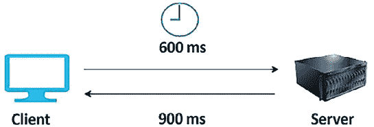

# 6

# 性能考虑因素

实验表明，每一秒钟的应用加载延迟都会导致组织收入的显著损失。因此，应用的性能是解决方案设计中最关键的属性之一，它会影响产品的增长和用户的采纳。

在上一章中，我们讨论了可以用来解决复杂业务问题的各种解决方案架构设计模式。在本章中，我们将探讨一些优化应用性能的最佳实践，这些实践需要在每一层以及每个架构组件中进行。你将学习如何为架构的各个层次选择合适的技术，以持续提高应用的性能。本章将重点关注以下内容：

+   高性能架构的设计原则

+   性能优化的技术选择

+   移动应用性能考虑

+   性能测试

+   性能监控管理

到本章结束时，你将理解性能提升的几个重要属性，如延迟、吞吐量和并发性。你将能够在技术选择上做出更好的决策，帮助你提升架构各层的性能，例如计算、存储、数据库和网络。

# 高性能架构的设计原则

架构性能效率专注于利用应用基础设施和资源来满足日益增长的需求和技术演进。性能效率指导架构师创建不仅能满足当前需求，还能灵活扩展和发展的系统，确保在用户期望和技术环境变化时，性能保持强大和响应迅速。让我们来看看一些优化工作负载性能的关键设计原则。

## 降低延迟

延迟可能会显著影响你的产品采纳，因为用户都在寻找最快的应用程序。无论用户身处何地，你都需要提供高效可靠的服务，才能让产品成长。延迟是指数据包从一个指定点传输到另一个指定点所需的时间。简单来说，就是你在执行某个操作后，看到设备或系统响应时所经历的延迟或滞后。延迟受多种因素的影响，包括客户端与服务器之间的物理距离、传输介质的速度（如光纤或无线信号）以及网络的繁忙程度。

举个例子，假设你正在浏览一个网站。当你点击一个链接或按下一个按钮时，一个请求从你的设备发送到网站的服务器。这个服务器可能位于与你相同的城市，也可能位于世界的另一端。请求从你的设备传送到服务器、服务器处理该请求并返回响应的时间，就是我们所说的延迟。虽然你可能无法实现零延迟，但目标应该是让响应时间保持在用户可以接受的容忍范围内。

如下图所示，假设在一个场景中，从你的设备到服务器的消息传递需要 600 **毫秒**（**ms**）（这可能是因为数据需要跨越物理距离，或者数据包通过多个中间设备进行路由，如路由器和交换机）。如果服务器再花 900 毫秒来处理请求并返回响应，那么总的延迟将是 1.5 秒（1,500 毫秒）。在这段时间里，你可能会注意到网页加载的延迟。

图 6.1：客户端-服务器模型中的请求-响应延迟

现在，任何应用程序都需要访问互联网，以便拥有全球范围的多样化用户作为消费者。这些用户期望无论地理位置如何，性能都能保持一致。但这有时很具挑战性，因为数据从世界的一个地方传输到另一个地方需要时间。

各种因素，如**网络传输介质**、**路由器跳数**和**传播**，都可能导致网络延迟。企业通常使用光纤线路来建立公司网络与云之间的连接，这有助于防止不一致性。组织还可以利用**内容分发网络**（**CDN**）将重型图像和视频数据存储在靠近用户的位置，以减少网络延迟并提高性能。通过边缘位置，更容易将工作负载部署到靠近用户群体的地方。

除了网络引起的问题外，延迟还可能出现在各种架构组件中。由于内存和处理器问题，计算服务器可能在基础设施层面上出现延迟，其中 CPU 与 RAM 之间的数据传输*较慢*。磁盘也可能因读写过程缓慢而产生延迟。**硬盘驱动器**（**HDD**）的延迟取决于选择磁盘存储扇区的时间以及该扇区定位到磁头下进行读写的时间。磁盘存储扇区是数据在内存磁盘中的物理位置。在 HDD 中，数据在写入操作期间会分布到存储扇区。由于磁盘持续旋转，数据可以随机写入。在读操作中，磁头需要等待旋转将其带到相应的磁盘存储扇区。

在数据库层面，延迟可能由硬件瓶颈或查询处理缓慢导致的数据读取和写入问题引起。通过分区和分片来分布数据，可以减少数据库负载，从而降低延迟。

低延迟意味着*更高的吞吐量*，因为延迟与吞吐量是直接相关的，所以我们来深入了解吞吐量。

## 提高吞吐量

网络吞吐量是指在给定时间内成功通过网络传输的数据量。这个指标对于了解网络在特定条件和负载下的表现至关重要。吞吐量会受到多种因素的影响，包括网络的容量（带宽）、连接的质量以及用于数据传输的协议。带宽决定了网络中可以传输的最大数据量。

吞吐量和延迟之间存在直接关系。低延迟意味着高吞吐量，因为可以在更短的时间内传输更多的数据。为了更好地理解这一点，我们可以用国家的交通基础设施做个类比。

假设高速公路的车道是网络管道，汽车是数据包。假设一条高速公路在两座城市之间有 16 条车道。并非所有的车辆都能按时到达目的地，它们可能因交通拥堵、车道关闭或事故而被延误。在这里，延迟决定了汽车从一座城市到另一座城市的旅行速度，而吞吐量告诉我们有多少辆车能够到达目的地。对于网络来说，充分利用带宽是具有挑战性的，因为会有错误和交通拥堵。

网络吞吐量通过以每秒比特数（bps）计算的传输数据量来衡量。网络带宽是指网络管道的最大容量，表示可以处理的数据量。下图展示了客户端和服务器之间传输的数据量：

图 6.2：网络中的吞吐量

除了网络，吞吐量还适用于磁盘层面。磁盘吞吐量是一个重要的指标，描述了数据从存储设备读取或写入的速度。它以**每秒兆字节**（**MB/s**）为单位进行测量，受两个主要因素的影响：**每秒输入/输出操作数**（**IOPS**）和每次 I/O 操作的大小（平均 I/O 大小）。

计算磁盘吞吐量的公式是：

下面是公式的分解：

+   **平均 I/O 大小**是指每次读写操作的平均大小，单位为字节。根据工作负载的不同，这个值可能会有所不同；例如，数据库操作的 I/O 大小通常比大视频文件的流媒体操作要小。

+   **IOPS**（每秒输入/输出操作数）衡量存储在一秒钟内能够处理多少次读写操作。较高的 IOPS 值表示存储系统速度较快，能够并行处理大量操作。

+   **吞吐量（MB/s）** 提供了存储设备实际数据传输速率的度量。它将 IOPS 和平均 I/O 大小结合起来，反映每秒可以从存储系统中移动多少数据。

为了将结果转换为 MB/s，我们将平均 I/O 大小和 IOPS 的乘积除以 1,024*1,024（因为 1 KB 等于 1,024 字节，1 MB 等于 1,024 KB）。

给定磁盘 IOPS 为 20,000，I/O 大小为 4 KB（即 4 * 1,024 字节 = 4,096 字节），可以按如下方式计算吞吐量：

1.  首先，将 I/O 大小从字节转换为兆字节：

    +   

1.  然后，乘以 IOPS 以得到 MB/s 为单位的吞吐量：

    +   吞吐量 = I/O 大小（MB）× IOPS

    +   吞吐量 = 0.00390625 MB × 20,000

    +   吞吐量 = 78.125 MB/s

所以，给定磁盘 IOPS 为 20,000，I/O 大小为 4 KB，吞吐量大约为 78.125 MB/s。这个计算结果显示了在这些条件下，每秒可以从磁盘读取或写入的总数据量。

在操作系统层面，吞吐量由每秒在 CPU 和内存之间传输的数据量决定。在数据库层面，吞吐量由数据库每秒可以处理的事务数决定。在应用层面，你的代码需要通过垃圾回收和内存缓存的高效使用来管理应用内存，从而处理每秒能够处理的事务。

当你考虑延迟、吞吐量和带宽时，还有一个因素叫做并发，它适用于各种架构组件，并有助于提高应用性能。让我们来了解更多关于并发的知识。

## 处理并发

并发在设计可扩展和高效的应用程序中起着至关重要的作用。它允许应用程序同时执行多个任务，更好地利用系统资源，提高整体应用性能。通过实现并发，开发者可以确保应用程序能够在不等待某个任务完成后再开始另一个任务的情况下处理多个操作。这对于服务成千上万用户的 Web 应用程序以及需要高效处理大量数据的数据处理任务尤为重要。实现并发可以显著提高响应时间和吞吐量，从而增强用户体验并提升应用程序的扩展能力。

并行性是软件设计中的另一个关键概念，它通过在不同的处理器或核心上同时执行多个操作来补充并发性。虽然并发性涉及同时处理许多任务（例如，在单核 CPU 上进行多任务处理，任务快速切换，给人同时执行的假象），但并行性进一步扩展了这一概念，通过多核处理器或分布式系统真正实现同时执行多个操作。这种方法通过将工作划分为可以并行处理的小块，大大加快了计算密集型任务的处理时间。处理大型数据集、复杂计算或可以分解为独立单元的任务的应用，能从并行性中获得极大的益处，实现更高的吞吐量和效率。

如下图所示，并发就像一个交通信号灯，控制着所有四个车道之间的交通流动。由于所有交通必须经过单一的车道，其他车道的处理必须暂停，直到一个车道中的交通处于*清理过程*中。在并行的情况下，存在并行车道，所有车辆可以在不互相干扰的情况下并行运行，如下图所示：

图 6.3：并发与并行

数据库始终是架构设计的核心。并发在数据处理中的作用至关重要，因为数据库应该具备同时响应多个请求的能力。数据库的并发性更为复杂，因为一个用户可能正在尝试读取一条记录，而另一个用户则在同时更新它。数据库应该仅在数据完全保存后允许查看数据。在另一个用户尝试更新数据之前，确保数据已经完全提交。

缓存可以显著提高性能；让我们了解一些架构中的不同缓存类型。

## 应用缓存

在*第四章*，*解决方案架构设计模式*中，你学到了如何在*基于缓存的架构*部分应用不同层级的缓存。缓存显著地帮助提升应用性能。尽管你已经学习了通过添加外部缓存引擎和技术（如**内容分发网络**（**CDN**））来应用不同的设计模式，但必须理解的是，几乎每个应用组件和基础设施都有一个缓存机制。在每一层利用缓存机制有助于减少延迟并提高应用性能。

CPU 在服务器级别有其硬件缓存，这可以减少从主内存访问数据时的延迟。CPU 缓存包括指令缓存和数据缓存；数据缓存存储频繁使用的数据副本。缓存也在磁盘级别使用，但由操作系统软件管理（称为**页缓存**）；然而，CPU 缓存完全由硬件管理。磁盘缓存来源于二级存储设备，如 HDD 或 **固态硬盘**（**SSD**）。频繁使用的数据会存储在主内存的空闲部分（即 RAM 中的页缓存，这样可以更快速地访问内容）。

通常，数据库有一个缓存机制，将数据库的查询结果保存起来，以便更快速地响应。它们有一个内部缓存，根据你的使用模式准备数据。它们还拥有查询缓存，如果你多次查询某些数据，这些数据会被存储在主服务器内存（RAM）中。如果表内的数据发生变化，查询缓存会被清空。如果服务器内存不足，最旧的查询结果会被删除以腾出空间。

你在网络级别有一个 DNS 缓存，将网页域名和相应的 IP 地址保存在服务器的本地。如果你再次访问相同的网站域名，DNS 缓存可以快速进行 DNS 查询。操作系统管理着 DNS 缓存，并保存所有最近访问的网站。你在*第四章*《解决方案架构设计模式》中了解了客户端缓存机制，如**浏览器缓存**，以及缓存引擎如 **Memcached** 和 **Redis**。

在这一节关于高性能架构设计原则中，你了解了需要处理的原始设计因素，如延迟、吞吐量、并发性和缓存，以优化架构性能。架构的每个组件（无论是服务器级别的网络，还是数据库级别的应用程序）都有一定的延迟和并发问题需要解决。

你应该根据期望的性能来设计应用程序，因为提高性能是有代价的。性能优化的具体细节可能因应用程序而异。解决方案架构需要相应地引导工作方向——例如，一个股票交易应用无法容忍甚至是亚毫秒级的延迟。而另一方面，一个电商网站则可以接受几秒钟的延迟。为了克服性能挑战，让我们了解如何为不同架构层次选择技术。

# 性能优化的技术选择

在 *第四章* 和 *第五章* 中，你学习了多种设计模式，包括微服务、事件驱动、基于缓存和无状态模式。一个组织可以根据其解决方案的设计需求选择这些设计模式的组合。根据工作负载，你可以有多种架构设计方法。一旦你确定了策略并开始实施解决方案，下一步就是优化应用程序。为了优化应用程序，你必须通过进行负载测试并根据应用程序的性能要求定义基准来收集数据。

性能优化是一个持续改进的过程，在这个过程中，你需要从解决方案设计的开始直到应用程序上线后，都关注资源的最佳利用。你需要根据工作负载选择合适的资源，或调整应用程序和基础设施的配置。例如，你可能会选择使用 NoSQL 数据库来存储应用程序的会话状态，并将事务存储在关系数据库中。

对于分析和报告目的，你可以通过将数据从应用程序数据库加载到数据仓库解决方案中，从而卸载生产数据库，并从中创建报告。

在服务器的情况下，你可以选择虚拟机或容器。你也可以完全采用无服务器的方式来构建和部署应用程序代码。无论你采用什么方式和应用程序工作负载，你都需要选择主要的资源类型：计算、存储、数据库或网络。让我们更详细地看看如何选择这些资源类型以进行性能优化。

## 做出计算选择

在这一节中，你会看到使用 *compute* 代替 *server* 的术语，因为如今软件部署不再局限于服务器。像 AWS 这样的公共云服务提供商提供无服务器服务，你不再需要服务器来运行应用程序。最受欢迎的 FaaS 服务之一是 AWS Lambda。像 AWS Lambda 一样，其他流行的公共云提供商也在 FaaS 领域提供解决方案——例如，微软的 Azure 提供 Azure Functions，GCP 提供 Google Cloud Functions。

然而，组织通常仍然默认选择带有虚拟机的服务器。随着自动化需求和资源利用率的提高，容器也变得越来越受欢迎。容器，尤其是在微服务应用程序部署领域，正在成为首选。

计算的最佳选择——无论是选择服务器实例、容器还是无服务器——取决于你的应用程序使用案例。让我们来看看各种计算选择。

以下表格提供了 CPU、**图形处理单元**（**GPU**）、**现场可编程门阵列**（**FPGA**）和**应用特定集成电路**（**ASIC**）之间的差异快照，重点介绍它们的主要用途、编程的难易度、核心结构、成本影响以及它们在并行处理等方面的适用性。让我们首先定义这些术语：

+   **CPU**：计算机中的主要处理器，执行大多数数据处理操作，通常被称为计算机的“大脑”。

+   **GPU**：一种专门的电子电路，设计用于快速操作和修改内存，加速在帧缓存中生成图像，供显示器输出。

+   **FPGA**：一种集成电路，设计为在制造后由客户或设计师进行配置，因此称为“现场可编程”。

+   **ASIC**：为特定用途定制的芯片，而非用于通用用途。

根据工作负载的变化，您可能会使用一个或多个这些处理单元选择。

| **特点** | **CPU** | **GPU** | **FPGA** | **ASIC** |
| --- | --- | --- | --- | --- |
| 主要用途 | 通用应用 | 图形处理，大数据应用 | 可编程硬件用于特定任务 | 定制集成电路用于特定应用 |
| 编程难易度 | 容易 | 需要特定库的知识（例如，CUDA） | 复杂，需要硬件编程 | 不适用（硬件为定制设计） |
| 多任务处理 | 是 | 受限于并行设计的焦点 | 是，可重新配置 | 否，仅限单一用途 |
| 多功能性 | 高 | 中等 | 中等，可重新配置以适应任务 | 低，仅适用于特定应用 |
| 性能度量 | GHz（每秒十亿次周期） | TFLOP（每秒万亿次浮点操作） | 通常不以 Flops（每秒浮点操作）衡量 | 优化功耗与性能 |
| 核心结构 | 少数大核心 | 数千个小核心 | 可重新配置的逻辑单元 | 不适用（定制设计） |
| 并行处理 | 有限 | 高，具有**大规模并行处理**（**MPP**）能力 | 支持 MPP，可配置为 CPU | 针对特定应用进行了优化 |
| 成本 | 低 | 高于 CPU | 高于 CPU 和 GPU，需定制 | 最高，因定制设计和较长开发周期 |
| 功耗 | 中等 | 高 | 低 | 针对应用进行了优化 |
| 灵活性 | 适用于各种应用 | 专用于计算密集型应用 | 可重新配置，但需要开发 | 固定，变更需要重新设计 |
| 开发周期 | 短 | 短到中等 | 长，由于需要定制 | 最长，需要硬件级重新设计 |

表 6.1：各种处理器类型的比较

上述表格比较了各种处理类型。ASIC 是最高效的，但实施周期长。ASIC 提供了最优性能，但灵活性最低，而 CPU 非常灵活，可以适用于许多用例。

今天，CPU 已经成为一种普遍商品，广泛用于一般用途设备以降低成本。GPU 因计算密集型应用而著名，而 FPGA 则在需要更定制性能时成为首选。这些处理选择可通过公共云提供商（如 AWS）获得。

在本节中，您了解了最受欢迎的计算选择。

您可能还会听说其他类型的处理器，例如**加速处理单元**（**APU**）。APU 结合了 CPU、GPU 和**数字信号处理器**（**DSP**），专为分析模拟信号并需要高速实时数据处理而优化。

让我们进一步了解其他因其优化虚拟机内资源利用能力而迅速受到欢迎的流行计算容器。

### 使用容器工作

在 *第四章*，*解决方案架构设计模式* 中，您了解到了在 *使用容器部署应用程序* 部分中部署容器的好处。由于其自动化和资源利用效率的便利性，容器的使用正成为部署复杂微服务应用程序的常态。有多种平台可供容器部署使用。

由于其受欢迎程度和与平台无关的能力，容器已成为构建云无关平台的首选。您可以在本地数据中心部署容器，并通过云端进行管理。此外，您还可以采用迁移方法，将容器从本地迁移到云端，而无需进行任何更改。

您可以使用容器构建多云平台，现在每个主要的公共云供应商都提供了管理跨多个平台的容器环境的工具。例如，AWS 提供了**弹性容器服务**（**ECS**）**Anywhere**，使您能够轻松在客户管理的基础设施上运行和管理容器工作负载。同样地，GCP 提供了**Google Anthos**，为您提供跨本地和其他云平台的容器管理。让我们学习一些在容器领域中最受欢迎的选择、它们的区别以及它们如何协同工作。

#### Docker

Docker 是最受欢迎的技术之一。它允许您将应用程序及其相关依赖项打包为容器，并部署到任何操作系统平台上。Docker 提供了与软件应用程序无关的能力，使整个软件开发、测试和部署过程变得简单和易于访问。

Docker 容器帮助您构建更复杂的多层应用。例如，您需要同时运行应用服务器、数据库和消息队列。在这种情况下，您可以使用不同的 Docker 镜像将它们并行运行，并在它们之间建立通信。这些层中的每一层可能使用不同的库版本，而 Docker 允许它们在同一台计算机上运行且不会发生冲突。

Docker 容器镜像可以通过局域网或互联网在系统之间进行传输，使用 Docker Hub 进行管理和分发。您可以通过 Docker Hub 容器仓库管理和分发您的容器。假设您在 Docker 镜像中做了更改，导致环境问题，这时可以轻松回滚到有效版本的容器镜像，从而简化整体故障排查过程。

使用 Docker 时，开发团队构建应用并将所需的依赖打包成容器镜像。此应用镜像将在 Docker 主机上的容器中运行。就像您管理 GitHub 等代码库中的代码一样，Docker 镜像也应存储在一个注册中心中。Docker Hub 是一个公共注册中心，其他公共云供应商也提供他们自己的注册中心，如 **AWS** **Elastic Container Registry** (**ECR**) 和 **Azure Container Registry**。此外，您还可以在本地为您的 Docker 镜像设置私有注册中心。

像 AWS 这样的公共云服务商提供容器管理平台，如 **Amazon ECS**。容器管理平台在云虚拟机 Amazon EC2 上管理 Docker 容器。AWS 还提供了一种无服务器的容器部署选项 Amazon Fargate，您可以在不配置虚拟机的情况下部署容器。

复杂的企业应用是基于跨多个容器的微服务构建的。将多个 Docker 容器作为一个应用的一部分进行管理可能会变得复杂。Kubernetes 有助于解决多容器环境的挑战；让我们深入了解 Kubernetes。

#### Kubernetes

Kubernetes 在生产环境中管理和协调多个容器方面表现出色，作为一个全面的容器编排系统，它支持在物理服务器或虚拟机节点上托管 Docker 容器，这些节点通常被称为工作节点。Kubernetes 高效地协调这些节点群集的操作，自动化执行部署、扩展以及容器化应用管理等任务，从而确保基础设施上应用的顺畅和可靠运行。

Kubernetes 通过在应用错误的情况下替换无响应的容器，使您的应用实现自我修复。它还提供水平扩展能力和蓝绿部署能力，以防止停机。Kubernetes 会在容器之间分配传入的用户流量负载，并管理各容器共享的存储。

下图展示了 Kubernetes 和 Docker 如何协同工作，以编排您的软件应用程序。Kubernetes 负责工作节点与 Docker 容器之间的网络通信：

图 6.4：Docker 和 Kubernetes

Docker 作为应用程序的独立部分，而 Kubernetes 负责协调，确保这些部分按照设计一起工作。通过 Kubernetes，整体应用程序的部署和扩展非常容易自动化。在 Docker 中，容器托管在节点中，每个 Docker 容器在单个节点中共享相同的 IP 地址。在 Docker 中，你需要通过处理任何 IP 冲突来管理容器之间的连接。Kubernetes 通过有一个主实例来解决这个问题，该实例跟踪所有托管 Pods 的节点。

Kubernetes 的主节点分配一个 IP 地址，并托管一个用于容器配置的键值存储和一个 **kubelet** 来管理容器。kubelet 是每个节点上的主要“节点代理”，确保在 Pods 中定义的容器被启动并持续运行。Docker 容器被分组为 **Pods**，共享相同的 IP 地址。整个配置被称为 **Kubernetes 集群**。

Kubernetes 维护起来较为复杂。云服务提供商为其提供了自己的管理工具。例如，AWS 提供了 Amazon **弹性 Kubernetes 服务** (**EKS**)，以简化 Kubernetes 集群的管理。OpenShift 是由 Red Hat 管理的另一个 Kubernetes 发行版，并作为 **平台即服务** (**PaaS**) 提供。类似地，微软 Azure 提供了 **Azure Kubernetes 服务** (**AKS**)，而 GCP 提供了 **谷歌 Kubernetes 引擎** (**GKE**)，这些服务提供了一个简单的方式来自动部署、扩展和管理 Kubernetes。

总的来说，容器为整个应用程序基础设施增加了一层虚拟化。尽管它们在资源利用方面非常有帮助，但如果您的应用程序需要超低延迟，建议选择裸机物理机进行部署。

### 无服务器架构

最近几年，随着来自 Amazon、Google 和 Microsoft 等云服务提供商的公共云解决方案的普及，无服务器计算变得可行。无服务器计算使得开发者可以专注于代码和应用程序开发，而无需担心底层的资源配置、配置和扩展基础设施。无服务器解决方案将服务器管理和基础设施决策从开发者中抽象出来，让他们专注于自己擅长的领域和他们正在尝试解决的业务问题。无服务器计算带来了相对较新的 **功能即服务** (**FaaS**) 概念。

FaaS（功能即服务）由 AWS Lambda、Microsoft Azure Functions 和 Google Cloud Functions 提供。例如，你可以在云编辑器中编写代码，AWS Lambda 负责底层的计算基础设施，运行并扩展你的函数。你可以通过使用 Amazon API Gateway 和 AWS Lambda 函数添加 API 端点，设计基于事件的架构或 RESTful 微服务。Amazon API Gateway 是一个维护的云系统，它为 Lambda 函数添加 RESTful API 和 WebSocket API，作为前端接口，并实现应用程序之间的实时通信。你还可以将微服务进一步拆分为可自动扩展和独立的任务。

除了专注于你的代码外，在 FaaS 模型中，你无需为闲置资源付费。你可以根据需要独立扩展所需的函数，且具有内置的可用性和容错性，而不是扩展整个服务。然而，如果你需要协调数千个功能，预测自动扩展成本可能会比较复杂。这非常适合任务调度、处理 Web 请求和排队消息。

在本节中，你已经了解了可以为性能优化做出的各种计算选择。我们讨论了服务器实例、容器和无服务器选项。你需要为你的应用程序选择合适的计算服务。没有任何规则强制要求你选择特定类型的计算；这完全取决于你组织的技术选择、创新的步伐以及软件应用的性质。

然而，对于单体应用程序，你通常可以选择虚拟机或裸金属机器；对于复杂的微服务，你可以选择容器。对于简单的任务调度或基于事件的应用程序，无服务器函数是一个显而易见的选择。许多组织已经完全基于无服务器计算构建了复杂的应用程序，这帮助他们降低了成本，并在不管理任何基础设施的情况下实现了高可用性。

让我们了解基础设施的另一个重要方面，以及它如何帮助你优化性能。

## 做出存储选择

存储在任何软件应用的性能中起着至关重要的作用，而**数据亲和性**的概念在讨论应用存储时尤为重要。数据亲和性指的是将数据战略性地放置在靠近应用程序的位置，以减少延迟、提高性能并确保高效的数据检索。

在多云或混合云环境中，并非所有存储都必须靠近应用服务器。现代分布式系统旨在允许数据存在于多个位置，无论是本地还是不同的云提供商，同时仍保持可接受的延迟和性能水平。这种灵活性对于使用各种云服务的组织或具有数据驻留要求的组织至关重要，这些要求规定某些数据必须保持在特定的地理或司法边界内。

然而，决定数据存储的位置——是靠近应用服务还是在其他位置——需要仔细考虑多个因素：

+   **延迟要求**：请求与响应之间的可接受延迟可能会显著影响数据存储位置的选择。需要实时访问数据的应用程序可能需要具有最小延迟的存储解决方案，通常意味着需要物理或网络上的接近。

+   **数据主权和合规性**：法律和监管要求可能会决定数据可以存储和处理的地点，这意味着架构需要与合规要求保持一致。

+   **成本考虑**：在不同位置或云中存储和访问数据可能会产生额外费用。在考虑云环境中的数据外流费用时，平衡性能需求与预算限制是至关重要的。

+   **带宽和吞吐量**：应用服务器与数据存储位置之间的可用网络带宽和吞吐量会影响性能。高带宽和高吞吐量可以减轻一些延迟问题，从而提供更多灵活的数据存储选项。

+   **数据访问模式**：了解应用程序如何访问数据（例如，频繁访问的数据与不常访问的数据）可以帮助你选择合适的存储位置。频繁访问的数据可能需要靠近应用程序存储，以加速访问速度。

+   **灾难恢复和可用性**：数据弹性策略可能要求在不同地理位置复制数据，以确保在故障发生时仍能保持可用性。

在多云策略中，通过实施缓存、数据复制或边缘计算解决方案，可以通过将关键数据的同步副本保持在应用程序附近，从而帮助保持性能标准，无论主要数据存储位置在哪里。这些方法使得应用程序能够在最小延迟下访问数据，即使主要数据源地理位置较远。

选择合适的存储方式依赖于对这些因素的全面分析。你应该在运营需求、性能、成本和合规性之间找到平衡。最终目标是构建一个满足应用程序性能需求的解决方案，同时遵守组织、法律和预算约束。

您首先需要决定数据是存储在块存储、文件存储还是对象存储中。这些是以不同方式存储和呈现数据的存储格式。让我们更详细地看一下这个问题。

### 使用块存储和存储区域网络

块存储将数据划分为块并将其作为数据块存储。每个块都有一个唯一的 ID，允许系统将数据存储在最容易访问的位置，因为块本身不存储有关文件的任何元数据。因此，基于服务器的操作系统管理并使用这些硬盘上的块。每当系统请求数据时，存储系统会收集这些块，并将结果返回给用户。

部署在**存储区域网络**（**SAN**）中的块存储能够高效且可靠地存储数据。当需要存储大量数据并频繁访问时，它表现出色——例如，数据库部署、电子邮件服务器、应用程序部署和虚拟机。

SAN 存储系统功能复杂，支持*复杂且关键的应用程序*。它是一个高性能存储系统，负责在服务器和存储之间传输块级数据；然而，SAN 系统价格昂贵，应该用于需要低延迟的大型企业应用。

在配置基于块的存储时，您必须在 SSD 和 HDD 之间做出选择。HDD 是服务器和企业存储阵列的传统数据存储系统。HDD 便宜但速度较慢，并且需要大量电力和冷却。SSD 使用半导体芯片，比 HDD 更快。尽管 SSD 成本较高，但随着技术的发展，SSD 变得更加实惠和受欢迎，因为它们具有更高的效率，且对电力和冷却的需求较低。

### 使用文件存储和网络附加存储

文件存储已经存在了很长时间，并且被广泛使用。在文件存储中，数据作为一个整体存储并在文件夹中进行组织。当需要访问数据时，您提供文件路径并获取数据文件；然而，随着文件在多个文件夹层级下嵌套，文件路径可能变得复杂。

每条记录都有有限的元数据，包括文件名、创建时间和最新的时间戳。可以将其类比为图书馆，在图书馆中，书籍存放在书架上，并且有一本日志记录了每本书的位置。

**网络附加存储**（**NAS**）是一种附加到网络的文件存储系统，向用户展示存储和访问文件的位置。NAS 还管理用户权限、文件锁定及其他保护数据的安全机制。NAS 在文件共享系统和本地归档中表现良好；然而，考虑到 NAS 的元数据有限且文件夹层级结构复杂，对于存储数十亿文件，NAS 并不是最优解。为了存储数十亿个文件，需要使用对象存储。让我们更深入地了解对象存储及其与文件存储相比的优势。

### 使用对象存储和云数据存储

对象存储将数据与唯一标识符和可定制的元数据捆绑在一起。与文件存储中的层次化地址或块存储中分布在多个块上的地址不同，对象存储使用平坦的地址空间。平坦的地址空间使得无论数据存储位置在哪里，都能更容易地快速定位和检索数据。对象存储还帮助用户实现存储的无限扩展性。

对象存储的元数据可以包含许多细节，如对象名称、大小、时间戳等，用户可以定制它以添加比文件存储中标记更多的信息。一个简单的 API 调用即可访问数据，而且存储成本非常低。对象存储在处理高容量、非结构化数据时表现最佳；然而，对象无法修改，只能被替换，因此它并不适合用作数据库。

云数据存储，如**Amazon Simple Storage Service**（**S3**），提供具有高可用性和耐久性的无限扩展对象数据存储。你可以通过唯一的全局标识符和元数据文件前缀访问数据。

以下图表概述了三种存储系统：

图 6.5：数据存储系统

如上图所示，块存储将数据存储在块中。块存储非常适合需要单个实例独占存储访问的场景，如数据库或需要高性能和快速数据访问的应用程序。文件存储将数据存储在层次化的文件夹结构中，几乎没有额外的延迟。你应该在数据需要被多个实例同时访问时使用文件存储系统，就像不同的人可能需要访问共享房间中的文件一样。对象存储将数据存储在桶中，每个对象都有一个唯一标识符。它通过网络提供访问，以减少延迟并提高吞吐量。你应该使用对象存储来存储和访问静态内容，如图片和视频。你可以在对象存储中存储大量数据并进行大数据处理和分析。

**直接附加存储**（**DAS**）是另一种直接附加到主机服务器的数据存储类型；然而，它的可扩展性和存储容量非常有限。

磁带驱动器是另一种流行的备份和归档存储系统。由于其低成本和高可用性，磁带驱动器用于归档目的，但由于其高延迟，不适合直接应用。

通常，你需要提高任务关键型应用程序（如事务数据库）的吞吐量和数据保护，其中数据存储在 SAN 存储中。

选择与访问模式匹配的存储解决方案，以最大化性能。通过云服务，您可以选择块存储、文件存储和对象存储等多种选项。例如，AWS 公共云提供**Amazon Elastic Block Store**（**EBS**）作为云中的 SAN 存储，以及**Amazon Elastic File System**（**EFS**）作为云中的 NAS 存储。

亚马逊 S3 在对象存储中非常流行。同样，微软 Azure 提供 Azure 磁盘存储用于 SAN，Azure 文件存储用于 NAS，以及 Azure Blob 存储用于块存储。

### 数据库存储

选择合适的存储类型对于数据库性能至关重要，以确保最佳操作和效率。选择通常取决于数据库工作负载的具体要求，如 IOPS、数据库大小、数据访问的地理位置以及数据库操作的性质（**在线事务处理**（**OLTP**）与**在线分析处理**（**OLAP**））。下面是一个比较表，概述了不同存储类型在数据库中的选择标准和适用性。

| **存储类型** | **IOPS 能力** | **适用的数据库大小** | **位置考虑** | **最佳应用场景** | **适用性** |
| --- | --- | --- | --- | --- | --- |
| SSD | 高 | 小到大 | 靠近应用服务器 | OLTP 和 OLAP | 非常适合大多数数据库，特别是在 IOPS 高和延迟低至关重要的场景下。 |
| HDD | 中等到低 | 大型 | 靠近应用服务器 | 大型 OLAP | 适用于大规模、访问频率较低的数据库或对成本敏感的场景，但不推荐用于高性能 OLTP 系统。 |
| NAS | 低到中等 | 小到中等 | 灵活，可离线 | OLAP 和备份 | 适用于性能要求中等的数据库，或用于备份/归档目的。 |
| SAN | 高 | 大型 | 灵活，最好靠近 | OLTP 和 OLAP | 非常适合需要高 IOPS、吞吐量和可扩展性的大型数据库。可以是本地部署或基于云的。 |
| 云存储 | 可变 | 可变 | 本地或云端 | OLTP 和 OLAP | 适用于各种数据库规模和类型。性能和适用性取决于特定的云服务提供商。 |

表 6.2：不同存储类型的比较

在涉及多云或混合环境的场景中，其他因素，如数据主权和合规性（决定数据存储位置的法规要求）、访问模式（数据是以读取为主还是写入为主）、网络延迟、带宽和成本考虑等，也起着至关重要的作用。尤其是在通过**广域网**（**WANs**）访问数据库时，这些因素尤其重要，因为延迟可能会影响性能。

现在您已经了解了为实现最佳性能所需的计算和存储选择，让我们来看看应用程序开发的下一个关键组成部分：数据库。选择适合需求的数据库将改善应用程序的性能并减少整体应用程序延迟。市面上有多种数据库类型，选择正确的数据库至关重要。

## 做出数据库选择

通常，您会希望标准化一个通用平台，并使用数据库以便于管理；然而，根据数据需求考虑使用不同的数据库解决方案。选择错误的数据库解决方案可能会影响系统延迟和性能。

您选择的数据库将取决于应用程序的可用性、可扩展性、数据结构、吞吐量和持久性要求。选择数据库时需要考虑多个因素。例如，访问模式可能会显著影响数据库技术的选择，这取决于用户数量和数据访问频率。您应该根据访问模式来优化您的数据库。

数据库通常具有用于工作负载优化的配置选项。您应该考虑内存、缓存、存储优化等方面的配置。您还应当探讨关于可扩展性、备份、恢复和维护的数据库技术的操作方面。让我们来看一下可以用于满足应用程序数据库需求的不同数据库技术。

### 在线事务处理

大多数传统的关系型数据库被认为使用**在线事务处理**（**OLTP**）。事务型数据库是最古老和最流行的存储和处理应用程序数据的方法。关系型 OLTP 数据库的一些例子包括 Oracle、Microsoft SQL Server、MySQL、PostgreSQL 和 Amazon RDS。OLTP 的数据访问模式涉及通过查找 ID 来获取一个小的数据集。数据库事务意味着要么所有相关的数据库更新都完成，要么一个也没有完成。

关系模型允许在应用程序中处理复杂的业务事务，如银行、交易和电子商务。它使您能够聚合数据，并使用跨表的多个连接来创建复杂的查询。

在优化关系型数据库时，您需要考虑包括以下优化内容：

+   包含计算、内存、存储和网络功能的数据库服务器

+   操作系统级设置，如存储卷、卷管理和块大小

+   根据需要配置数据库引擎和分区

+   数据库相关选项，如模式、索引和视图

对于关系型数据库来说，扩展性可能会有挑战，因为它们只能垂直扩展，最终会遇到系统容量的上限。可以利用只读副本来分担读取负载。这使得你可以将读取查询从主数据库转移到一个或多个副本，从而增强系统的读取能力。通过实现分区（分片）来扩展写入性能。通过将较大的数据库划分成较小、更易管理的部分（分区或分片），每个部分包含数据的一个子集，你可以将写入负载分散到多个服务器或实例上，从而提高写入性能。

在上一章中，你学习了如何在*应用架构中的数据库处理*部分中扩展关系型数据库。

OLTP 数据库适用于大型和复杂的事务型应用；然而，当需要聚合和查询大量数据时，它们需要更好的扩展性。同时，随着互联网的爆炸式发展，很多非结构化数据从各个地方涌现，而关系型数据库无法高效地处理这些非结构化数据。在这种情况下，非关系型数据库或 NoSQL 数据库可以派上用场。让我们进一步了解如何处理这些数据。

### 非关系型数据库

很多非结构化和半结构化的数据来自于社交媒体程序、**物联网**（**IoT**）、点击流数据和日志等应用程序，这些应用有着非常动态的架构。这些数据类型可能会有不同的架构用于每一组记录。将这些数据存储在关系型数据库中可能是一项非常繁琐的任务。所有内容都必须按照固定的架构进行存储，这可能导致大量的空值或者数据丢失。非关系型数据库，通常称为 NoSQL（“Not Only SQL”或“非 SQL”），提供了一种灵活的数据存储和管理方式。与传统的关系型数据库不同，关系型数据库需要在存储数据之前定义固定架构，而 NoSQL 数据库允许在没有预定义架构约束的情况下存储和管理数据。具有可变列数的记录可以存储在同一张表中。

NoSQL 数据库可以存储大量数据并提供*低访问延迟*。当需要时，它们通过添加更多节点来轻松扩展，并且可以支持水平扩展。它们非常适合用于存储用户会话数据，并使你的应用程序无状态，以便实现水平扩展而不妥协用户体验。你可以在 NoSQL 数据库之上开发分布式应用程序，提供良好的延迟和扩展性，但查询连接必须在应用层处理，因为 NoSQL 数据库不支持诸如连接表和实体的复杂查询。

有多种 NoSQL 数据库选项可供选择，如 Cassandra、HBase 和 MongoDB，你可以在虚拟机集群中安装它们。AWS 提供了一种托管的 NoSQL 数据库——**Amazon DynamoDB**，它提供高吞吐量、子毫秒级延迟和无限制的扩展能力。

你可以使用 OLTP 来处理关系型数据库，但它的存储能力有限。它需要更好地响应大量数据的查询，并进行数据仓库所需的聚合。数据仓库的需求更偏向于分析而非事务处理。**OLAP** 填补了 OLTP 在查询大规模数据集方面的不足。让我们更深入了解 OLAP。

### 在线分析处理

OLTP 和 NoSQL 数据库对于应用程序部署很有帮助，但在大规模分析方面能力有限。OLAP 主要用于数据仓库技术。对于大规模结构化数据的分析查询，更适合使用为更快访问结构化数据而设计的数据仓库平台。现代数据仓库利用列式存储格式和**大规模并行处理**（**MPP**）架构，显著提升数据检索和分析速度。与传统的行式数据库不同，行式数据库是按行存储数据，而列式存储按列组织数据。

列式格式意味着当你只需要对某一列进行数据聚合时，无需扫描整个表。例如，如果你想确定某个月的库存销售量，订单表中可能有数百列，但你只需要聚合购买列的数据。使用列式格式，你只需要扫描购买列，相比于行式格式，这减少了扫描的数据量，从而提高了查询性能。

使用 MPP，你将数据以分布式方式存储在子节点之间，并向主节点提交查询。根据分区键，主节点会将查询分发到子节点。每个节点然后处理查询的一部分进行并行处理。主节点随后从每个子节点收集子查询结果，并返回聚合结果。这种并行处理帮助你更快地执行查询，并快速处理大量数据。

你可以通过安装 IBM Netezza 或 Microsoft SQL Server 等软件在虚拟机上使用这种处理方式，或者选择更符合云原生的解决方案，比如 Snowflake。AWS 作为公共云，提供了 PB 级数据仓库解决方案 Amazon Redshift，它使用列式格式和 MPP。你将在*第十二章*，*面向解决方案架构的数据工程*中了解更多关于数据处理和分析的内容。

你需要存储和搜索大量数据，尤其是当你想在日志中找到特定错误或构建文档搜索引擎时。为了实现这种功能，你的应用程序需要创建数据搜索功能。让我们了解一下数据搜索功能。

### 构建数据搜索功能

经常需要快速搜索大量数据来解决问题或获取商业洞察。搜索应用数据可以帮助你从不同角度访问和分析详细信息。为了低延迟和高吞吐量地搜索数据，你需要使用搜索引擎。

Elasticsearch 是最流行的搜索引擎平台之一；它建立在 **Apache Lucene** 库的基础上。Apache Lucene 是一个免费的开源软件库，许多流行的搜索引擎都基于它。**ELK**（即 **Elasticsearch**、**Logstash** 和 **Kibana**）堆栈易于使用，可以自动发现大规模数据并为搜索建立索引。由于其特性，围绕 Elasticsearch 已开发了多种可视化和分析工具。例如，**Logstash** 与 Elasticsearch 配合使用，收集、转换并分析大量应用日志数据。**Kibana** 与 Elasticsearch 内建连接器，提供了一种简单的解决方案来创建仪表板并分析已索引的数据。Elasticsearch 可以部署在虚拟机中，通过水平扩展来增加容量，方法是向集群中添加新节点。AWS 公有云提供了托管的 **Amazon OpenSearch Service**，使得在云中扩展和管理 Elasticsearch 集群既经济又简单。

在本节中，你了解了各种数据库技术及其应用场景。你的应用可以使用多种数据库技术来支持不同的组件，以实现最佳性能。对于复杂的事务，需要使用关系型 OLTP 数据库；而对于存储和处理非结构化或半结构化数据，则需要使用非关系型 NoSQL 数据库。当需要在多个地理区域提供非常低的延迟时，或者在应用层需要处理复杂查询时，比如在游戏应用中，就应该使用 NoSQL 数据库。如果需要对结构化数据进行大规模分析，应使用数据仓库 OLAP 数据库。

让我们来看看架构的另一个关键组成部分：**网络**。网络是整个应用程序的支柱，负责建立服务器与外界之间的通信。让我们了解一下与应用性能相关的网络知识。

## 提升网络性能

在这个几乎每个角落都有快速互联网连接的时代，应用程序需要拥有全球用户覆盖。系统响应时间的任何延迟都取决于请求负载和最终用户与服务器之间的距离。如果系统无法及时响应用户请求，可能会产生连锁反应，持续占用系统的所有资源，并堆积大量请求积压，这将导致整体系统性能下降。

为了减少延迟，你应该模拟用户的地理位置和环境，以找出任何差距。根据你的发现，你应该设计服务器的物理位置和缓存机制来减少网络延迟；然而，应用程序的网络解决方案选择取决于网络速度、吞吐量和延迟要求。一个面向全球用户的应用程序需要与其客户之间有快速的连接，而地理位置在此过程中起着重要作用。CDN 提供的边缘位置帮助本地化丰富内容并减少整体延迟。

在*第四章*，*解决方案架构设计模式*中，你学习了如何使用 CDN 在*基于缓存的架构*部分将数据放置在靠近用户的位置。如果你的应用程序内容以静态文件为主（例如，需要向最终用户传递大量图像和视频内容），那么可以使用 CDN 解决方案。市场上一些较为流行的 CDN 解决方案包括 Akamai、Cloudflare 和 Amazon CloudFront（由 AWS 云提供）。

### 使用边缘计算

边缘计算是一种分布式计算范式，它将计算和数据存储靠近需要它们的地点，以提高响应时间并节省带宽。这些是为提供 IT 基础设施而在使用地点附近设置的小型数据中心。边缘计算已经成为优化软件应用性能的变革性策略，尤其是在延迟、带宽和实时数据处理至关重要时。你可以利用边缘计算来提升应用程序的性能，尤其是当你的用户群体遍布全球时。

假设一个著名的全球社交媒体网站，如 Facebook、X 或 TikTok，因重大事件（如体育比赛或名人宣布）而遭遇用户活动激增。在传统模式下，集中式服务器可能无法处理大量请求，导致加载时间变慢并可能发生中断。这时，**内容分发网络**（**CDN**）就发挥了作用，行业巨头如 Akamai、Cloudflare、Imperva 和 Amazon CloudFront 处于领先地位。

Akamai 是 CDN 领域的先驱之一，拥有广泛的边缘服务器网络，战略性地分布在全球多个国家和城市。比如，当一位来自日本东京的用户在高流量事件期间访问其全球社交媒体网站时，东京的 Akamai 边缘服务器便开始工作。这些服务器会从离用户更近的地方缓存并传输经常访问的内容，如图像、视频和静态文件，而不是通过集中式数据中心。这样，用户就能体验到超快的加载速度、减少的延迟和顺畅的内容传输。

此外，Akamai 的边缘服务器还提供先进的安全功能，如**分布式拒绝服务**（**DDoS**）保护和**Web 应用防火墙**（**WAF**）功能，确保社交媒体网站在面对网络攻击和未授权访问时保持韧性。与**Amazon Web Services**（**AWS**）紧密集成的 Amazon CloudFront 也为各种规模的企业提供了强大的边缘计算解决方案。

除了社交媒体，边缘计算正在改变各行各业。例如，在自动驾驶汽车中，边缘设备实时处理传感器数据，做出瞬间决策，确保道路安全。在物联网领域，边缘计算使智能设备能够在本地分析数据，减少延迟并节省带宽。例如，一款智能温控器可以根据本地传感器数据调整温度设置，而无需与集中式服务器进行持续通信。

在医疗保健领域，边缘计算被用于远程患者监控。配备边缘处理能力的可穿戴设备能够实时分析健康数据，并在发生异常时向医疗服务提供者或患者本人发送警报，从而实现及时干预。

通过将计算推近数据源和最终用户，边缘计算提升了性能、响应能力和可扩展性，使其成为提高应用程序性能的重要技术。

如果您的应用程序是全球部署的，我们来看看一些 DNS 路由策略，以实现低延迟。

### 定义 DNS 路由策略

您可以将应用程序部署到多个地理区域，以实现全球覆盖。在用户请求路由方面，您需要将用户请求路由到最近且响应最快的服务器，以便快速响应应用程序的请求。DNS 路由器提供域名与 IP 地址之间的映射。它确保当用户输入域名时，请求能被正确的服务器处理——例如，当您在浏览器中输入 [amazon.com](http://amazon.com) 进行购物时，您的请求总是被路由到 Amazon 应用程序服务器的 DNS 服务。

AWS 提供了一项名为**Amazon Route 53**的 DNS 服务，您可以根据应用程序的需求定义不同类型的路由策略。Amazon Route 53 提供的 DNS 服务旨在简化域名管理。以下是最常见的路由策略：

+   **简单路由策略**：顾名思义，这是一种最直接的路由策略，不涉及任何复杂的设置。它有助于将流量路由到单一资源——例如，用于向特定网站传递信息的 Web 服务器。

+   **故障转移路由策略**：该路由策略要求通过配置主动-被动故障转移来实现高可用性。如果您的应用程序在某一地区出现故障，所有流量可以自动转移到另一个地区。

+   **地理位置路由策略**：如果用户位于特定位置，你可以使用地理位置策略。地理位置路由策略将流量路由到特定区域。

+   **地理邻近路由策略**：这类似于地理位置策略，但在需要时，你可以将流量转移到附近的地点。

+   **延迟路由策略**：如果你的应用运行在多个区域，你可以使用延迟策略来从延迟最低的区域提供流量。

+   **加权路由策略**：加权路由策略用于 A/B 测试，其中你希望将一定量的流量发送到一个区域，并随着测试的成功增加此流量。

此外，Amazon Route 53 可以检测 DNS 查询的来源和流量异常，并优先处理已知的*可靠*用户的请求。它还可以保护你的应用免受 DDoS 攻击。

一旦流量通过 DNS 服务器，在大多数情况下，下一站将是负载均衡器，负载均衡器会将流量分配到一组服务器。让我们进一步了解负载均衡器。

### 应用负载均衡器

负载均衡器将网络流量分配到各个服务器，以提高并发性、可靠性和应用延迟。负载均衡器可以是*物理的*或*虚拟的*。最好选择适合你的应用需求的负载均衡器。通常，有两种类型的负载均衡器可以被应用使用：

+   **第 4 层或网络负载均衡器**：第 4 层负载均衡根据数据包头部的信息（例如，源/目标 IP 地址和端口）路由数据包。第 4 层负载均衡不会检查数据包的内容，因此其计算强度比第 7 层或应用负载均衡低，速度也更快。网络负载均衡器可以处理每秒数百万个请求。

+   **第 7 层或应用负载均衡器**：第 7 层负载均衡检查并基于数据包的完整内容进行路由。第 7 层负载均衡与 HTTP 请求一起使用。影响路由决策的因素包括 HTTP 头部、URI 路径和内容类型等。它允许更强大的路由规则，但需要更多的计算时间来路由数据包。应用负载均衡器可以根据容器的独特端口号将请求路由到你集群中的容器。

根据不同的环境，你可以选择基于硬件的负载均衡器，如 F5 负载均衡器或 Cisco 负载均衡器。你也可以选择基于软件的负载均衡器，如 **Nginx**。

AWS 提供了一种托管的虚拟负载均衡器，称为 Amazon **弹性负载均衡**（**ELB**）。ELB 可以作为应用负载均衡器在第 7 层（Layer 7）应用，也可以作为网络负载均衡器在第 4 层（Layer 4）应用。

负载均衡器是保护应用程序的一个极佳方式，它通过将请求发送到健康的实例来使应用程序高度可用。它与自动扩展一起工作，根据需要添加或移除实例。让我们来看看自动扩展，并了解它如何帮助提高整体性能并确保应用程序的高可用性。

### 应用自动扩展

你在*第二章*《解决方案架构设计原则》中了解了自动扩展。你在*按需设计*部分学习了预测型和响应型自动扩展。自动扩展的概念随着云计算平台提供的灵活性而流行开来。云基础设施允许你根据用户或资源需求快速地扩展或缩减服务器集群。

使用像 AWS 这样的公共云平台，你可以在架构的每一层应用自动扩展。你可以根据展示层的请求数量扩展 Web 服务器集群，基于服务器的内存和 CPU 利用率扩展应用层。如果你知道服务器负载增加时的流量模式，还可以执行计划性扩展。在数据库层，像 Amazon Aurora Serverless 和 Microsoft Azure SQL Database 等关系型数据库支持自动扩展。像 Amazon DynamoDB 这样的 NoSQL 数据库可以根据吞吐量能力进行自动扩展。

在自动扩展时，你需要定义所需的服务器实例数量。你需要根据应用程序的扩展需求来确定服务器的最大和最小容量。以下截图展示了在 AWS 云中的自动扩展配置示例：

图 6.6：自动扩展配置

在前面的自动扩展配置设置中，如果三个 Web 服务器实例正在运行，当服务器的 CPU 利用率超过 50%时，它可以扩展到五个实例；如果 CPU 利用率低于 20%，它将缩减到两个实例。如果实例在标准情况下变得不健康，实例总数将低于所需容量。在这种情况下，负载均衡器将监控实例的健康状况，并使用自动扩展提供新的实例。负载均衡器监控实例健康，并触发自动扩展来根据需要配置新的实例。

自动扩展是一个很好的功能，但请确保设置适当的配置，以限制 CPU 使用率变化带来的成本。在出现**分布式拒绝服务**（**DDoS**）攻击时，自动扩展可能会显著增加成本，造成预料之外的流量增加。它将有助于保护你的系统免受此类事件的影响。你将在*第七章*《安全考虑因素》中了解更多内容。

在本节中，你已经了解了可以帮助提高应用程序性能的各种网络组件。你可以根据用户位置和应用需求优化应用程序的网络流量。由于移动设备已成为许多应用程序的首选用户界面，你应该对移动应用程序进行主动的性能监控，以改善客户体验。接下来，让我们进一步了解移动应用程序的性能考虑。

# 移动应用程序的性能考虑

移动应用程序现在已成为许多数字平台的重要组成部分。如今，用户往往首先查看移动应用程序，然后再访问桌面网站。此外，用户流量的一个重要部分是通过移动应用程序驱动的，这使得确保这些应用程序具有高性能变得至关重要。随着移动应用程序越来越成为我们数字互动的核心，确保其性能、安全性和可用性显得尤为重要。接下来，让我们深入了解一些构建高效移动应用程序的最佳实践。

## 加载时间优化

在移动应用程序中，加载时间是一个关键因素，它既可以增加用户参与度，也可能成为用户流失的原因。快速高效的加载时间至关重要，尤其是在用户常常需要随时随地使用应用程序并期望即时响应的情况下。提高加载时间的一些方法包括优化图片尺寸、使用懒加载技术加载元素，并确保初始可见内容能迅速加载。

## 资源高效使用

移动设备的资源有限，如 CPU、内存和电池，这些限制了其性能。为了确保应用程序在不消耗设备资源的情况下平稳运行，开发人员需要优先考虑最小化这些资源的使用。策略包括使用高效算法、通过适当管理内存分配来减少内存泄漏，以及优化查询仅获取必要的数据。

## 响应式用户界面 (UI)

用户界面应直观且高度响应，确保用户输入能立即反馈。为实现这一点，任何计算密集型的过程，如数据检索或图像处理，都应在后台执行，以避免干扰 UI 交互。使用异步编程和多线程可以保持 UI 的灵活性和响应性。

## 网络效率

考虑到移动环境中可能存在不稳定或慢速的网络连接，应用程序应有效地管理网络请求。实现对不常变动数据的缓存、优化 API 调用，并通过提供适当的用户反馈优雅地处理网络故障，可以显著提升用户体验和应用性能。

## 电池消耗

应用程序如果过度消耗电池，将很快失宠于用户。您应该注意优化流程并管理后台任务，以最小化能耗。确保 GPS、蓝牙和其他耗电量大的进程在不需要时得到谨慎使用和关闭是至关重要的。

## 跨平台兼容性

随着大量设备、操作系统和屏幕尺寸的出现，应用程序应在各种平台上保持高性能。利用跨平台开发框架并在多种设备上进行彻底测试，可以确保一致和最佳的用户体验。

## 用户体验（UX）设计

确保用户体验（UX）无缝和直观对于任何应用程序的成功至关重要。这涉及设计用户友好的界面，确保导航的便利性，并在整个应用程序中保持逻辑流，以确保用户可以以最小的努力完成他们想要的操作。

## 有效的数据管理

通过利用本地存储频繁使用的数据，确保本地和远程数据之间的平稳同步，对于提供用户最新信息而不影响性能至关重要。

## 测试和质量保证

实施严格的测试协议，包括在不同条件和不同设备上进行性能测试，确保应用程序即使在负荷下也能保持最佳性能。采用自动化测试和持续集成可以帮助在开发阶段及时识别和纠正问题。

构建高性能的移动应用程序涉及用户中心设计和技术专业性的和谐结合。通过精心优化应用程序的每个方面，从界面和加载时间到数据管理和安全功能，开发人员可以确保它在各种条件和多种设备上表现最佳。在您实施各种策略以提高应用程序性能的同时，始终建议进行测试。让我们更深入地了解性能测试。

# 性能测试

性能测试是软件测试的一个关键子集，旨在确保软件应用在预期工作负载下表现良好。它围绕评估应用程序在各种情况下的稳定性、速度、响应能力和可扩展性展开。性能测试不是为了识别错误或缺陷，而是确定应用程序在不同需求水平下的反应方式。考虑到今天用户期望的无缝和迅速的功能，性能测试变得更加关键。

在今天的数字时代，性能良好的应用程序意义重大。首先，它直接影响用户满意度。用户习惯了在设备上进行迅速且无缝的互动，因此，应用程序反应迟缓或频繁崩溃会让人非常反感。没有人愿意浪费时间在一个无法迅速响应的应用程序上，尤其是在高需求或使用高峰期。此类体验带来的挫败感可能会导致用户完全放弃该应用，转而选择提供更流畅体验的竞争对手。

假设一个受欢迎的电子商务网站正在为黑色星期五促销做准备。预计会有成千上万甚至数百万的用户访问该网站，因此必须确保系统不会崩溃，交易处理迅速，且即便在用户激增的情况下，用户体验依然流畅。在这种情况下，性能测试不仅是有帮助的，而是至关重要的。

## 性能测试的类型

性能测试有几种类型，每种类型都是为了应对应用程序性能的特定方面。以下是主要性能测试类型的简要概述：

+   **负载测试**：这种测试旨在了解系统在预期的实际负载下的表现。这相当于通过逐渐增加重量来测试一座桥梁，直到它承载预期的最大车辆数量。例如，如果一家电子商务网站预计在节假日促销期间会有 10,000 名访客，负载测试将模拟这 10,000 名用户，确保网站在这种情况下平稳运行。

+   **压力测试**：想象一下，把太多人塞进电梯，超出了电梯的承载能力，看它是继续运行还是崩溃；这就是压力测试的本质。它旨在将系统推向极限，确保即便在最坏的情况下，故障也不会导致灾难性的结果。例如，银行应用可能会进行压力测试，看看如果一百万用户同时尝试登录，远超正常流量时，系统会如何表现。

+   **耐力测试**：耐力测试回答的问题是：“系统在长时间承受预期负载时能否高效运行？”例如，流媒体服务可能会进行耐力测试，以确保它能够连续流畅地为用户播放电影和节目，且质量和速度不受影响。

+   **突发测试**：在现实世界中，用户流量往往不可预测。突发测试就像观察电网在热浪期间每个人同时开启空调时的反应。一个例子可能是测试新闻网站在重大事件期间（如奥运会）是否能承受突如其来的大量用户访问，这些用户可能会查看比赛结果或更新。

+   **容量测试**：在这里，重点是数据。这类似于检查一个图书馆如何组织并借出数百万本书。对于数据库驱动的应用程序，容量测试可能包括查看系统在数据库拥有数十亿条记录时的表现。一个实际的例子是全球电子邮件服务测试其系统在通过大量存储邮件时的响应能力。

有许多性能测试工具可供使用，例如**JMeter**、**LoadRunner**和**WebLoad**。这些工具通过模拟各种场景和负载来测试应用程序的性能。

性能测试在软件开发生命周期中扮演着至关重要的角色。确保应用程序的健壮性、可靠性和速度对于其在实际环境中的成功至关重要。

性能测试和性能监控是确保应用程序效率和可靠性的两个关键方面，但它们在开发和部署生命周期中有不同的作用。性能测试旨在在问题影响用户之前识别潜在的性能问题，而性能监控则是持续关注系统性能并迅速应对部署后发生的任何问题。让我们在下一节中了解更多关于性能监控的内容。

# 性能监控管理

性能监控在你试图关注性能问题并主动减少最终用户影响时至关重要。

你应该定义你的性能基准，并在超出阈值时向团队发出警报——例如，应用程序的移动端加载时间不应超过三秒。你的警报应该能够触发自动化操作来处理表现不佳的组件——例如，向 Web 应用程序集群中添加更多节点以减少请求负载。

有多种监控工具可以衡量应用程序性能和整体基础设施。你可以使用像 Splunk 这样的第三方工具，或 AWS 提供的 Amazon CloudWatch 来监控任何应用程序。

监控解决方案可以分为**主动监控**和**被动监控**两种类型：

+   在主动监控中，你必须模拟用户活动并提前识别性能差距。应用程序的数据和工作负载情况不断变化，要求进行持续的主动监控。主动监控与被动监控协同工作，你需要运行已知的可能场景来复制用户体验。你应在所有的开发、测试和生产环境中运行主动监控，以便在问题影响用户之前发现它。

+   被动监控尝试实时识别未知模式。对于基于 Web 的应用，被动监控需要从浏览器收集可能导致性能问题的关键指标。你可以收集关于用户的地理位置、浏览器类型和设备类型的指标，以了解应用的用户体验和地理性能。监控就是关于数据，包括大量数据的摄取、处理和可视化。

性能总是有代价的，作为解决方案架构师，你需要考虑权衡，以选择正确的方法。例如，组织的内部应用，如时间表和人力资源程序，可能不需要像外部产品（如电子商务应用）那样高的性能。处理交易的应用（例如）需要非常高的性能，这就需要更多的投入。你应该平衡耐久性、一致性、成本和性能，以适应应用的需求。你将在接下来的章节中继续了解各种监控方法和工具，并在*第八章*、*架构可靠性考虑*中深入探讨监控和警报。

跟踪和改进性能是复杂的任务，你需要收集大量数据并分析模式。访问模式帮助你为性能优化做出正确的选择。结合主动监控和被动监控的持续应用，帮助你维持应用的一致性性能。

# 总结

在本章中，你了解了影响应用性能的各种架构设计原则。你了解了不同架构层次中的延迟和吞吐量，以及它们之间的关系。

对于高性能的应用，你需要在每一层架构中实现低延迟和高吞吐量。并发性有助于处理大量请求。你还学到了并行性和并发性的区别，并了解了缓存如何帮助提高整体应用性能。

然后，你了解了选择技术及其工作模型，这可以帮助实现你期望的应用性能。在查看计算选项时，你了解了不同的处理器类型及其差异，帮助你在选择服务器实例时做出正确的决策。你还了解了容器，以及它们如何帮助你有效利用资源，同时提升性能。你还学到了 Docker 和 Kubernetes 如何相互配合并融入你的架构中。

在选择存储部分，你了解了不同类型的存储，例如块存储、文件存储和对象存储及其差异。你还了解了在本地和云环境中可用的存储选择。

在选择数据库这一章节中，你了解了各种数据库类型，包括关系型数据库、非关系型数据库和数据仓库。你还了解了不同的请求路由策略，这些策略可以帮助你改善全球分布用户的网络延迟，同时你学会了负载均衡器和自动扩展如何帮助你管理大量的用户请求而不影响应用性能。由于移动应用对于任何应用程序至关重要，你也学习了移动应用的性能考虑因素。你还了解了性能测试的重要性以及如何监控应用的性能。

在下一章中，你将学习如何通过应用认证和授权来保障你的应用安全，这将帮助你在数据静态存储和传输过程中保护数据，并确保你的应用免受威胁和攻击。你还将了解合规性要求，以及在设计应用时如何满足这些要求。你将学习到安全审计、警报、监控和自动化的相关内容。

# 加入我们书籍的 Discord 空间

加入本书的 Discord 工作区，向作者和其他解决方案架构专业人士提问并互动：`packt.link/SAHandbook`

