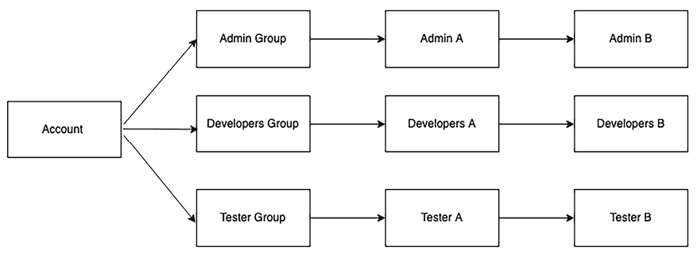
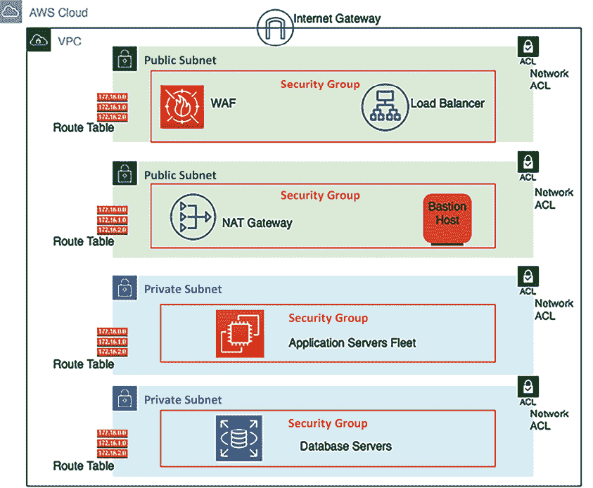

# 第七章：7

# 安全性考虑

安全性始终是架构设计的核心。许多企业因安全漏洞导致客户数据泄露而遭受财务损失。因此，组织不仅可能失去客户信任，还可能失去整个业务。

有许多行业标准的合规性和法规，以确保您的应用程序是*安全的*并且保护客户敏感数据。在前一章中，您了解了关于架构性能改进和技术选择的各个方面。本章将帮助您了解如何采用最佳实践来保护您的应用程序，并确保它符合行业标准的法规要求。

架构中的安全性不仅仅是保护 IT 工作负载的边缘。它还包括确保应用程序基础设施的不同部分相互之间是安全的。例如，在服务器上，您可以使用防火墙来控制哪些数据可以进出以及可以去哪里。这样，如果某个部分存在安全问题，它不会影响其他部分。您需要对所有部分进行相同的操作，如数据和程序。安全性需要应用于架构的每一层和每个组件。本章还讨论了保持云系统安全的不同方法。

在本章中，您将学习以下安全实践：

+   架构安全设计原则

+   选择技术以实现架构安全

+   安全性和合规性认证

+   云的共享安全责任模型

+   安全威胁建模

# 架构安全设计原则

安全性关乎于在为客户提供业务价值的同时保护您的系统和信息。缺乏良好的安全性可能对您的客户和业务产生严重影响。

您需要进行深入的安全风险评估，并规划出连续运营的缓解策略。接下来的章节将讨论标准设计原则，帮助您加强架构的安全性。

## 实施身份验证和授权控制

**身份验证**的目的是确定用户是否可以使用提供的凭据访问系统，而**授权**则决定用户进入系统后可以做什么。

您应该创建一个集中式系统来管理用户的身份验证和授权。集中式用户管理系统可以帮助您跟踪用户活动，以便在他们不再是系统的一部分或不再正确使用系统时停用他们。您可以定义标准规则来为新用户提供入职，并为不活跃的用户取消访问权限。集中式系统消除了对长期凭据的依赖，并允许您配置其他安全方法，例如密码轮换。

在授权方面，你应当遵循**最小权限原则**——这意味着用户初始时不应拥有任何权限，且仅根据其职位角色分配所需的访问权限。根据职位角色创建访问组，有助于在一个地方管理授权策略，并在大量用户中应用授权限制。例如，你可以限制开发团队仅能访问开发环境的全部权限，而只能以只读方式访问生产环境。如果有新的开发人员加入，他们应被添加到这个开发组，所有授权策略都在此集中管理。

启用**单点登录**（**SSO**）并使用集中的用户存储库，有助于减少用户群体记住多个密码的麻烦，并消除密码泄露的风险。为了进一步增强安全性，将**多因素认证**（**MFA**）与 SSO 结合，可以增加额外的保护层。MFA 要求用户提供两个或更多的验证因素来访问资源，例如安全令牌、指纹或面部识别。

大型组织使用集中式用户管理工具，例如**Active Directory**（**AD**），对员工进行身份验证和授权，从而提供访问内部企业应用程序的权限，如人力资源系统、费用系统和考勤系统。

在面向客户的应用程序中，例如电子商务和社交媒体网站，你可以使用 OpenID 身份验证系统来维持一个集中的系统。OpenID 是一种开放标准的身份验证协议。你将在本章的*OAuth 和 OpenID Connect*部分详细了解大规模用户管理工具。

## 在各个层级应用安全

通常，组织主要关注确保数据中心的物理安全，并保护外部网络层免受任何攻击。与其仅专注于单一的外层防护，不如确保在每个应用层都实施安全措施。

运用**深度防御**（**DiD**）方法，将安全控制措施层层叠加在应用程序中；例如，Web 应用程序需要通过保护**全球演进增强数据速率**（**EDGE**）网络和**域名系统**（**DNS**）路由来防止外部互联网流量的侵入。在负载均衡器和网络层面应用安全，阻止恶意流量。

通过仅允许必要的进出流量来保护每个应用实例，在 Web 应用和数据库层面实施这一措施。使用杀毒软件保护操作系统，以防止任何恶意软件攻击。通过在流量流动前放置**入侵检测系统**（**IDS**）和**入侵防御系统**（**IPS**），以及使用**Web 应用防火墙**（**WAF**）来保护应用免受各种攻击。你将在本章的*选择技术以确保架构安全*部分了解更多有关各种安全工具的细节。

## 减少爆炸半径

在每一层应用安全措施时，你应该保持系统的隔离，将其分隔成较小的区域，以减少爆炸半径。如果攻击者访问了系统的某一部分，你应该能够将安全漏洞限制在应用程序的最小区域内。例如，在 Web 应用中，将负载均衡器放在与架构其他层分离的独立网络中，因为它是面向互联网的。此外，在 Web、应用和数据库层之间应用网络隔离。如果一个层发生攻击，应该防止它扩展到架构的其他层。

相同的规则也适用于你的授权系统，给用户最小权限，只提供最低限度的必要访问权限。实施多因素认证（MFA），即使用户访问遭到突破，攻击者也始终需要第二级身份验证才能进入系统。

提供系统的最小访问权限，确保不暴露整个系统，并提供临时凭证以确保访问仅在短时间内开放。提供编程访问时，采取预防措施，通过使用安全令牌并频繁更换密钥来保证安全。

## 时刻监控和审计一切

你需要为系统中的每个活动设置日志机制，并应定期进行审计。审计功能通常是各种行业合规要求的一部分。收集来自每个组件的日志，包括所有交易和每次 API 调用，以实现集中监控。一个好的做法是对集中日志账户添加一层安全性和访问限制，以防止任何人篡改。

采取积极主动的方法，做好准备在用户受到影响之前处理任何事件。通过集中监控的警报功能，帮助你迅速采取行动并减少任何事件的影响。监控所有用户活动和应用程序账户，以限制安全漏洞。

## 自动化一切

自动化对于快速应对任何安全规则违规行为至关重要。你可以使用自动化来恢复与所需配置不符的更改，并向安全团队发出警报。例如，如果有人将管理员用户添加到你的系统，并将防火墙打开到未经授权的端口或 IP 地址，你可以应用自动化来删除这些不需要的系统更改。

将自动化应用于安全系统已成为 DevSecOps 概念中的一部分。DevSecOps 旨在将安全性融入应用开发和操作的每个部分。你将在*第十一章*，*DevOps 与解决方案架构框架*中进一步了解 DevSecOps。

创建安全的架构并实施定义和管理为代码的安全控制。你可以对安全作为代码模板进行版本控制，并根据需要分析更改。作为软件代码的自动化安全机制帮助你更快速、更具成本效益地扩展安全操作。

## 数据保护

数据是你架构的核心，保护和确保数据安全至关重要。大多数合规性法规的制定都是为了保护客户数据和身份。大多数攻击的目的是窃取用户数据。

你应该根据数据的敏感性级别对其进行分类，并相应地进行保护。例如，客户的信用卡信息应为最敏感的数据，并应以极大的谨慎处理。另一方面，客户的名字可能不那么敏感，而卡号则属于敏感信息。

在数据的整个生命周期中保护数据对维护其机密性、完整性和可用性至关重要。数据可以存在三种状态，每种状态都需要特定的安全措施来确保全面保护：

+   **静态数据**：指存储在物理介质上的数据，无论是在服务器的硬盘、笔记本电脑、USB 闪存驱动器还是云存储中。保护静态数据的一个机制是加密，它确保即使存储设备落入不法之手，数据也无法访问，除非拥有加密密钥。此外，你还需要设置访问控制并定期审计，确保只有授权用户可以访问或修改数据。

+   **传输中的数据**：当数据在网络中传输时——从用户的计算机到服务器、服务器之间，或通过互联网——它被视为处于传输中。为了保护传输中的数据，你可以使用加密协议，如**传输层安全性**（**TLS**）。这确保即使数据在传输过程中被拦截，它也对攻击者保持不可读。

+   **使用中的数据**：这通常是保护最具挑战性的状态，因为数据正在被应用程序处理或使用。加密可以保护数据在静态和传输中的状态，但一旦加载到内存并被应用程序使用，数据就变成了明文，可能会有安全漏洞。新技术如**受信执行环境**（**TEEs**）和同态加密正在兴起，用于保护使用中的数据，允许在加密数据上执行操作而无需先解密。

创建最小化直接访问数据需求的机制和工具。通过应用基于工具的自动化，避免手动数据处理，从而消除人为错误，特别是在处理敏感数据时。在可能的情况下对数据应用访问限制，以减少数据丢失或数据修改的风险。

一旦按敏感性分类数据，您可以使用适当的加密、令牌化和访问控制来保护数据。数据不仅需要在静态状态下保护，还需要在传输过程中保护——即在网络上传输时。您将在本章的*数据安全*部分学习各种保护数据的机制。

## 响应安全事件

保持随时准备应对任何安全事件。根据您的组织政策要求创建事故管理流程。事故管理因组织和应用程序而异。例如，如果您的应用程序处理客户的**个人身份信息**（**PII**），则需要在事故响应中采取更严格的安全措施。然而，如果应用程序处理的是少量敏感数据，如库存管理应用程序，则其处理方式将不同。

确保模拟响应安全事件，以查看您的安全团队如何从中恢复。

您的团队应使用自动化工具加速检测、调查和响应任何安全事件。您需要设置警报、监控和审计机制，进行**根本原因分析**（**RCA**），以防止类似事件再次发生。

在本节中，您学习了应用于应用程序安全架构中的一般安全原则。在下一节中，您将学习如何使用不同的工具和技术来应用这些原则。

# 选择用于架构安全的技术

前一节专注于设计架构时考虑的一般应用程序安全规则，但问题是：*我们如何在实施过程中应用这些规则来确保应用程序安全？* 每个应用程序层都有各种工具和技术可用，用于使其安全。

本节中，你将详细了解在用户管理以及应用程序的 Web 层、基础设施和数据保护领域中可用的多种技术选择。让我们从第一个领域——用户身份和访问管理开始。

## 用户身份和访问管理

用户身份和访问管理是信息安全的关键部分。因为最好的做法是确保只有经过身份验证和授权的用户才能以特定方式访问你的系统资源。

随着组织的发展和产品被广泛采用，用户管理可能成为一项艰巨的任务。用户访问管理应区分并管理组织员工、供应商和客户的访问权限。

企业或公司用户可能是组织的员工、承包商或供应商。他们是拥有特殊权限的专家用户，负责开发、测试和部署应用程序。此外，他们可能需要访问其他企业系统以完成日常工作——例如，**企业资源系统** (**ERP**)、薪资系统、人力资源系统、工时表应用等。随着组织的扩展，用户数量可以从几百人增加到几千人。

最终用户是指使用应用程序并拥有足够权限来探索和利用应用程序所需功能的客户——例如，游戏应用的玩家、社交媒体应用的用户，或电子商务网站的客户。随着你的产品或应用程序的普及，这些用户的数量可以从几千人到几百万不等。当应用程序面向外部互联网流量时，你需要特别注意安全性，以保护其免受各种威胁。

首先，我们来谈谈企业用户管理。你需要一个集中式的存储库来执行安全策略，如强密码创建、密码轮换和多因素认证（MFA），以便更好地进行用户管理。MFA 提供了另一种验证身份的手段，如果密码可能已被泄露的话。常见的 MFA 提供商包括 Google Authenticator、Gemalto、YubiKey、RSA SecurID、Duo 和 Microsoft Authenticator。

从用户访问的角度来看，**基于角色的认证** (**RBA**) 简化了用户管理；你可以根据用户的角色创建用户组，并为每个组分配适当的访问策略。如以下图示所示，你可以有三个组——管理员、开发者和测试人员，并为每个组应用相应的访问策略。例如，管理员可以访问任何系统，包括生产环境，而开发者的访问仅限于开发环境，测试人员只能访问测试环境：

图 7.1：用户组组织

如上图所示，当新用户加入团队时，他们会被分配到适合其角色的组中。通过这种方式，每个用户都拥有一组定义好的标准访问权限。如果引入了新的开发环境，所有开发人员都需要访问它，用户组也可以更新访问权限。

SSO 是一个标准过程，有助于减少安全漏洞并自动化系统。SSO 使得用户通过一个单一的用户 ID 和密码登录不同的企业系统。**联合身份管理**（**FIM**）允许用户通过预先认证的机制在没有密码的情况下访问系统。我们来看看更多的细节。

### 联合身份管理与单点登录

**FIM**提供了一种连接身份管理系统的方式，当用户信息存储在第三方**身份提供者**（**IdP**）中时。通过 FIM，用户仅向 IdP 提供认证信息，而 IdP 与服务之间已经建立了信任关系。

如下图所示，当用户登录以访问服务时，服务提供者从 IdP 获取凭证，而不是直接从用户处获取：

图 7.2：FIM 认证流程

SSO（单点登录）允许使用一组登录凭证来访问多个服务。在这里，服务提供者可以针对你想要登录的环境进行设置——例如，**客户关系管理**（**CRM**）应用程序或你的云应用程序。身份提供者（IdP）可以是公司内部的 AD。联合身份认证类似于 SSO，但无需密码，因为联合服务器知道用户信息，并允许他们访问相关信息。

实现 FIM 和 SSO 的方式有很多种。我们来看一些流行的**身份与访问管理**（**IAM**）选项。

### Kerberos

Kerberos 是一种身份验证协议，允许两个系统安全地识别对方，并实现 SSO。它基于客户端-服务器模型，并使用票证系统来确认用户身份。

Kerberos 具有一个**密钥分发中心**（**KDC**），它促进了两个系统之间的身份验证。KDC 由两个逻辑部分组成——**认证服务器**（**AS**）和**票证授权服务器**（**TGS**）。

Kerberos 存储并维护每个客户端和服务器的密钥。在通信过程中，它在两个系统之间建立一个安全会话，并通过存储的密钥来识别它们。以下图示展示了 Kerberos 身份验证的流程：

图 7.3：Kerberos 认证

如上图所示，当你想要访问一个服务时，涉及以下步骤：

1.  当你想要访问计算机网络上的某项服务时，你的计算机（客户端）会向一个名为**认证服务器**（**AS**）的特殊服务器请求一个票据。

1.  AS 会检查你是否在其数据库中。如果在，它会创建一个**票据授予票**（**TGT**）和会话密钥，并将它们发送回你的计算机。你可以用密码解锁会话密钥，但无法解锁 TGT，因为它是用只有**票据授予服务器**可以解锁的密钥加密的。

1.  你的计算机将这个 TGT 提交给另一个服务器，即 TGS，申请一个服务票据，以访问你所需的服务。

1.  TGS 检查 TGT，如果一切正常，则返回一个服务票据，你的计算机可以用它向服务证明你有权限访问该服务。

1.  你的计算机将此票据展示给服务，如果服务同意票据有效，你就能获得访问权限。

虽然 Kerberos 有其优势，但它是一个开源协议，通常，大型企业喜欢使用更多管理化的软件，且具有强大支持，例如 AD。接下来，我们来看一下最流行的用户管理工具之一，基于**轻量级目录访问协议**（**LDAP**）的微软 AD 的工作机制。

### 微软活动目录

**AD** 是微软为用户和计算机开发的身份服务。AD 拥有一个域控制器，也称为**活动目录域服务**（**AD DS**），用于存储用户信息、访问凭据和身份，以及系统信息。

以下图示说明了身份验证过程的简单流程：

图 7.4：AD 认证流程

如上图所示，用户登录由域网络上的 AD 管理。用户首先将请求发送到域控制器，并提供凭据，同时与**活动目录认证库**（**ADAL**）进行通信。ADAL 验证用户凭据后，返回一个访问令牌，并为请求的服务创建一个持续会话。

**LDAP** 是处理存储在目录中的信息的树形层次结构的标准协议。**活动目录轻量级目录服务**（**AD LDS**）为用户和系统的目录提供 LDAP 接口。对于文件加密和网络流量加密，**活动目录证书服务**（**AD CS**）提供密钥基础设施功能。**活动目录联合服务**（**AD FS**）为外部资源提供访问机制，例如许多用户的 Web 应用登录。

随着许多组织开始使用云服务，下面让我们了解一下 AWS 云提供的活动目录服务。

#### 亚马逊 Web 服务目录服务

**Amazon Web Services** (**AWS**) 目录服务将您账户中的 AWS 资源与现有的本地用户管理工具（如 AD）连接。AWS 目录服务在 AWS 云中设置一个新的用户管理目录，并为本地目录提供安全连接。建立连接后，所有用户可以使用现有凭证访问云资源和本地应用程序。

AWS AD Connector 是另一项服务，帮助您将现有的 Microsoft AD 连接到 AWS 云；您无需特定的目录同步工具。管理员用户可以使用 AWS IAM 管理 AWS 资源。

AD Connector 通过与您现有的 MFA 基础设施（如 YubiKey、Gemalto 令牌或 RSA 令牌）集成，帮助启用 MFA。

对于小规模用户群（少于 5000 个用户），AWS 提供了 Simple AD，这是一个由 *Samba 4 Active Directory 兼容服务器* 提供支持的托管目录。Simple AD 具有常见功能，如用户账户管理、用户组管理、基于 Kerberos 的 SSO 和用户组策略。

其他主要技术公司提供的目录服务包括 Okta、Centrify、Ping Identity 和 Oracle **身份云服务** (**IDCS**)。

### 安全断言标记语言

在本节的 *联合身份管理与单点登录* 部分，您了解了 IdP 和服务提供商。要访问服务，用户通过 IdP 进行验证，而 IdP 与服务提供商之间建立了信任关系。**安全断言标记语言** (**SAML**) 可用于通过 **可扩展标记语言** (**XML**) 在 IdP 和服务提供商之间建立信任关系，从而标准化它们之间的通信。

SAML 断言是一个 XML 文档，IdP 将其发送给服务提供商，并包含用户授权信息。下图展示了 SAML 断言的流程：

图 7.5：使用 SAML 进行用户认证

如前面的图所示，以下步骤用于通过 SAML 实现用户认证：

1.  用户向服务请求访问权限——例如，Salesforce CRM 应用程序——作为服务提供商。

1.  服务提供商（如 CRM 应用程序）向 SAML IdP 发送包含用户信息的 SAML 请求。

1.  SAML IdP 会弹出 SSO 登录页面，用户在此输入认证信息。

1.  用户访问凭证发送到用户数据库，这是一个身份存储，用于验证。在此情况下，用户身份存储是一个 *AD*。

1.  用户身份存储将用户验证状态发送给与其建立信任关系的 SAML IdP。

1.  SAML IdP 向服务提供商（如 CRM 应用程序）发送 SAML 断言，包含用户验证的信息。

1.  在收到 SAML 响应后，服务提供商允许应用程序访问用户。

有时，服务提供商也可以充当身份提供者（IdP）。SAML 在建立身份存储和服务提供商之间的关系方面非常流行。所有现代身份存储应用程序都与 SAML 2.0 兼容，这使得它们能够无缝地相互通信。SAML 允许用户身份被联合管理，并为企业用户启用单点登录（SSO）。

对于像社交媒体和电子商务网站这样的大型用户群体，**OAuth**（即**开放授权**）和 **OpenID** 比 SAML 更为适合。让我们来了解一下 OAuth 和 **OpenID Connect**（**OIDC**）。

### OAuth

OAuth 是一种开放标准的授权协议，提供安全的访问委托给应用程序。OAuth 不共享密码数据，而是使用授权令牌在服务提供商和消费者之间建立身份。应用程序的用户在不提供登录凭据的情况下授权访问他们的信息。

虽然 OAuth 主要用于授权，但许多组织已开始添加他们自己的身份验证机制。

OIDC 是一个协议，它在 OAuth 2.0 授权框架之上定义了身份验证标准。OAuth 2.0 提供了一个授权框架（授予访问资源的权限），而 OIDC 添加了一个额外的层来处理用户身份验证。这意味着 OIDC 不仅帮助应用程序知道用户可以访问哪些资源，还验证访问服务的用户身份。它是一种基于授权服务器执行身份验证后，客户端验证用户身份，并以可互操作和类似 REST 的方式获取用户基本资料信息的方法。

亚马逊、Facebook、谷歌和 X 等大型科技公司允许用户与第三方应用共享其帐户中的信息。例如，您可以使用 Facebook 登录一个新的照片应用程序，并授权新应用程序仅访问您的 Facebook 照片信息。下图说明了一个 OAuth 访问委托流，用户请求 LinkedIn 应用程序从 Facebook 获取其个人资料照片：

图 7.6：使用 OAuth 2.0 的用户访问委托

如上图所示，身份验证流程遵循以下步骤：

1.  在此场景中，用户向 LinkedIn 应用程序发出请求，要求从 Facebook 获取个人资料照片。

1.  LinkedIn 应用程序请求授权访问 Facebook 个人资料照片。

1.  授权服务器（在本例中是您的 Facebook 帐户）创建并向用户展示同意屏幕。

1.  用户同意 LinkedIn 应用程序仅访问其 Facebook 个人资料照片的请求。

1.  在获得用户批准后，Facebook 授权服务器将授权码发送回请求的 LinkedIn 应用程序。

1.  LinkedIn 应用程序随后使用授权代码向授权服务器（Facebook 账户）请求访问令牌。

1.  授权服务器识别 LinkedIn 应用程序并检查认证代码的有效性。如果访问令牌验证通过，服务器会向 LinkedIn 应用程序发放访问令牌。

1.  LinkedIn 应用程序现在可以使用访问令牌访问资源，例如 Facebook 个人资料照片。

    OAuth 2.0 比 OAuth 1.0 更快，且更容易实现，现在是最常用的版本。

**JSON Web 令牌**（**JWT**）是一种简单且易于访问的令牌格式，可与 OAuth 一起使用，并且在 OpenID 中广受欢迎；我们接下来会讨论这个。

### JWT

JWT 是一种紧凑且自包含的方式，用于在各方之间以 JSON 对象的形式安全地传输信息。这些信息可以通过数字签名进行验证和信任。JWT 可以使用密钥或公/私钥对进行签名。

JWT 具有 JSON 结构，其中包含关于过期时间、发行者、主题等的信息。它比**简单 Web 令牌**（**SWT**）更强大，比 SAML 2.0 更简洁。你可以在以下截图中看到 JWT：

图 7.7：JWT 示例

上面的截图展示了 JWT，它分为三个部分，每个部分之间由点分隔。第一部分是头部，告诉我们令牌类型——JWT——以及它使用的签名算法，例如 HS256 或 RSA。第二部分是有效载荷，包含声明，即关于用户及其他数据的信息。最后一部分是签名，它确保令牌没有被篡改，并确认了发送 JWT 的人。

JSON 的结构比 XML 简单，而且更小，这使得 JWT 比 SAML 更紧凑。JWT 是将信息传递到 HTML 和 HTTP 环境中的绝佳选择。由于其小巧的体积，JWT 是在微服务架构中在服务之间传递经过认证用户身份的理想选择，或者用来提供让用户访问资源的访问令牌。它们在各种身份验证和授权场景中都有应用，尤其是在 Web 和移动应用程序中。

在本节中，你了解了最常见的用户管理工具和服务。然而，还有许多其他协议和服务可用于用户身份验证和授权。前面提到的协议实现可能会很复杂，而且有大量打包软件可以简化这项工作。

Amazon Cognito 是 AWS 提供的用户访问管理服务，包含基于标准的授权，如 SAML 2.0、OIDC 和 OAuth 2.0，并且提供一个企业用户目录，支持与 AD 连接。Okta 和 Ping Identity 提供企业用户管理，并能在一个地方与各种服务提供商工具进行通信。

一旦您的应用程序暴露于互联网，始终会有各种类型的攻击可能发生。让我们学习一些最常见的攻击方式，以及如何为 Web 层保护设置第一层防御。

## 处理 Web 安全

随着用户需求的变化，要求服务全天候 24/7 可用，企业正在向线上模式转型，为此，它们采用了 Web 应用程序模型。Web 应用程序还帮助企业获得全球客户群。像在线银行和电子商务网站这样的企业始终保持在线，并且处理敏感的客户数据，如支付信息和支付者身份。

现在，Web 应用程序已经成为任何企业的核心，这些应用程序暴露在全球互联网上。Web 应用程序可能存在漏洞，使其容易受到网络攻击和数据泄露的威胁。让我们来探讨一些常见的网络攻击类型，以及如何减轻这些风险。

### 网络攻击

Web 应用程序容易受到安全漏洞的影响。黑客从不同的位置和使用各种方法协调网络攻击。就像您锁住并保护物理建筑一样，您的 Web 应用程序也需要防止非法活动。让我们探讨一些可能导致 Web 应用程序安全漏洞的常见攻击方式。

#### 拒绝服务和分布式拒绝服务攻击

**拒绝服务**（**DoS**）攻击试图使您的网站无法访问。为了成功实施 DoS 攻击，攻击者使用各种技术消耗网络和系统资源，从而中断合法用户的访问。攻击者使用多个主机来协调攻击一个单一的目标。

**分布式拒绝服务**（**DDoS**）攻击通过使用许多被劫持的系统，通常是被恶意软件感染的系统，向单一目标系统发送大量请求。这会使目标系统不堪重负，导致服务中断。攻击者远程控制被感染的系统发起攻击。如以下图所示，当多个系统消耗目标系统的带宽资源时，就会发生 DDoS 攻击：

图 7.8：DDoS 攻击

DDoS 攻击的基本概念是利用额外的主机来放大对目标发出的请求，使其超载并无法使用。DDoS 攻击通常是由多个被感染的系统发起的，僵尸网络向目标系统发送大量流量。

僵尸网络是通过恶意软件感染并控制的设备网络。

最常见的 DDoS 攻击发生在应用层，使用 DNS 洪水攻击或 **安全套接字层** (**SSL**) 协商攻击。在 DNS 洪水中，攻击者通过过多请求消耗 DNS 服务器的资源。在 SSL 协商中，攻击者发送大量无法理解的数据，用于计算密集型的 SSL 解密。攻击者还可以对服务器集群执行其他基于 SSL 的攻击，使其不堪重负。

在基础设施层，典型的 DDoS 攻击以以下形式发生：

+   **用户数据报协议** (**UDP**) **反射**：通过 UDP 反射，攻击者伪造目标服务器的 IP 地址，发起请求，从被黑的反射服务器返回放大的响应。

+   **SYN 洪水**：通过 SYN 洪水，攻击者通过创建并放弃大量连接来耗尽目标服务器的 **传输控制协议** (**TCP**) 服务，从而阻止合法用户访问服务器。

攻击者通常试图窃取敏感的客户数据，为此他们使用一种称为 **SQL 注入** (**SQLi**) 的不同攻击方式。让我们了解更多关于它的信息。

#### SQLi 攻击

顾名思义，在 SQLi 攻击中，攻击者注入恶意的 **结构化查询语言** (**SQL**)，以控制 SQL 数据库并获取敏感用户数据。攻击者利用 SQLi 访问未经授权的信息，控制应用程序，添加新用户等。

以贷款处理的 Web 应用程序为例，你有一个 `loanId` 字段，客户可以用它来获取与其贷款相关的所有信息。如果没有采取适当的防护，攻击者可以执行如 `SELECT * FROM loans WHERE loanId = 117 or '1=1'` 的查询，并获取整个客户数据库的访问权限，因为这个查询始终会返回真结果。

另一种通过脚本注入来黑客入侵用户数据的常见方式是 **跨站脚本** (**XSS**)，黑客伪装成合法用户。让我们了解更多关于它的信息。

#### XSS 攻击

你可能遇到过伪装成你熟悉网站的钓鱼邮件链接。点击这些链接可能导致通过 XSS 被泄露的数据。在 XSS 攻击中，攻击者将其恶意代码嵌入合法网站。当无辜用户访问网页时，这段代码就会执行。

攻击者可以通过多种方式引入此代码，例如将其直接嵌入 URL 字符串中，或者通过在网页上插入一段 JavaScript 代码。当你加载网页时，这段客户端 JavaScript 代码会执行，并窃取你的浏览器 cookies。

这些 cookies 通常包含敏感信息，例如你的银行或电子商务网站的访问令牌和身份验证。利用这些被窃取的 cookies，黑客可以进入你的银行账户，甚至其他账户，窃取你的辛苦钱。

#### 跨站请求伪造攻击

**跨站请求伪造**（**CSRF**）攻击利用用户身份，通过制造混乱并欺骗已认证的用户进行状态更改操作，例如，修改购物网站的密码或请求将钱转账到你的银行账户。

它与 XSS 攻击略有不同，因为 CSRF 攻击者尝试伪造请求，而不是插入代码脚本。例如，攻击者可以伪造一个请求，要求从用户的银行账户转账一定金额，并将该链接通过电子邮件发送给用户。当用户点击这个链接时，银行收到请求并将钱转账到攻击者的账户。如果攻击者能够进入管理员账户，CSRF 攻击会特别危险。

#### 缓冲区溢出和内存损坏攻击

软件程序会将数据写入一个临时内存区域，以便快速处理，这个区域叫做**缓冲区**。在缓冲区溢出攻击中，攻击者可以覆盖与缓冲区相关的内存部分，故意引发缓冲区溢出，并访问连接的内存区域，其中可能存储着应用程序的可执行文件。攻击者可以将可执行文件替换为实际的程序，从而控制整个系统。整体来看，基础设施层、网络层和数据层存在更多的安全威胁。接下来，我们将探讨一些标准方法来减轻和预防 web 层的安全风险。

### Web 安全缓解

安全性需要应用到应用程序的每一层，特别需要关注 web 层，因为它直接暴露给外部世界。对于 web 的保护，必要的步骤包括跟进最新的安全补丁、遵循最佳的软件开发实践，并确保正确的身份验证和授权得以执行。

有几种方法可以保护和确保 web 应用的安全；我们来探讨两种常见的方法。

#### Web 应用防火墙

WAF 是一种防火墙，它应用于 HTTP 和 HTTPS 流量（即端口 `80` 和 `443`）。WAF 会检查你的 web 流量，并验证它是否符合预期的行为规范。它们提供了一层额外的保护，防止 web 攻击。

WAF 限速是通过查看发送到服务的请求数量或类型，并定义一个阈值，限制每个用户、会话或 IP 地址所允许的请求次数。通过批准和不批准列表，你可以明确地允许或阻止用户。

AWS WAF 是一个 Web 应用防火墙（WAF）的例子，它通过创建并应用规则来过滤 Web 流量，从而为你的 Web 层增加安全性。这些规则基于诸如 HTTP 头、用户地理位置、恶意 IP 地址、自定义 **统一资源标识符** (**URIs**) 等条件。AWS WAF 规则可以阻止常见的 Web 攻击，如 XSS 和 SQL 注入。你可以为一个运行多个网站和 Web 应用程序的环境创建一组规则，并且可以跨应用重用规则，而无需重新创建它们。

总体而言，WAF 是一种应用规则集以处理 HTTP 流量的工具。它基于 IP 地址、HTTP 头、HTTP 正文或 URI 字符串等数据来过滤 Web 请求。它可以通过卸载非法流量来缓解 DDoS 攻击。让我们进一步了解 DDoS 缓解。

#### DDoS 攻击缓解

弹性架构可以防止或缓解 DDoS 攻击。保持基础设施安全的基本原则是减少攻击者可能攻击的目标数量。简而言之，如果某个实例不需要公开，就不要让它公开。

你可以采用多种策略来最小化攻击面：

+   在可能的情况下，减少必要的互联网入口点数量——例如，开放传入的互联网访问到你的负载均衡器，而不是到 Web 服务器。

+   识别并消除任何不必要的互联网入口点。例如，你可以为供应商设置文件共享存储以上传数据，但应将访问权限限制在一个有限的群体中，而不是让全球互联网流量都能访问。

+   隐藏任何必要的互联网入口点，以防止不受信任的终端用户访问它们。

+   隔离访问点，并对终端用户流量与应用管理流量应用特定的限制策略。

+   创建一个解耦的互联网入口点，以最小化攻击面。

你的主要目标是在 CDN 的边缘位置缓解 DDoS 攻击。如果 DDoS 攻击渗透到你的应用服务器，处理起来会更具挑战性且成本更高。以下图示展示了 AWS 云工作负载的 DDoS 缓解示例：

图 7.9：DDoS WAF 三明治缓解策略

上述图示展示了一个 **WAF 三明治架构**，其中 WAF 设备被放置在两个负载均衡器之间，以应对 DDoS 攻击。

常见的 DDoS 攻击来自如 SYN 洪水和 UDP 反射等策略，Amazon CloudFront 通过只接受格式正确的连接，防止攻击策略在到达应用服务器之前进入。像 Amazon CloudFront 这样的 CDN 通过将 DDoS 攻击隔离到地理上独立的地点，并防止流量影响其他位置，来帮助应对 DDoS 攻击。网络防火墙安全帮助你在单个服务器级别控制进出流量。

如上一节所述，WAF（Web 应用防火墙）用于保护 Web 应用免受 XSS 和 SQLi 等漏洞攻击。除此之外，WAF 还帮助检测和防止 Web 应用层的 DDoS 攻击。

要应对 DDoS 攻击，你可以应用水平或垂直扩展。你可以通过以下方式利用扩展：

1.  首先，选择适合你 Web 应用程序的服务器大小和配置。

1.  其次，使用负载均衡器将流量分配到服务器群集，并添加自动扩展功能，根据需要添加或移除服务器。

1.  最后，使用 CDN 和 DNS 服务器，因为它们是为了处理大规模流量而设计的。

针对 DDoS 攻击进行扩展是一个很好的例子，说明了为服务器设置合理的最大数量是非常必要的。DDoS 攻击可能会将你的服务器扩展到一个极为昂贵的数量，而仍然可能无法防止服务器变得不可用。为常规流量波动设定合理的最大限制，可以避免 DDoS 攻击给公司带来过大的经济损失。

在本节中，你了解了 Web 层的各种安全风险和漏洞以及一些标准的保护方法。由于安全性需要应用于每一层，让我们更详细地探讨如何保护基础设施层。

## 保护应用程序及其基础设施

在上一节中，你了解了如何保护 Web 层。由于安全性需要应用于工作负载的每一层，让我们学习如何保护架构中的应用层和网络层。

### 应用程序和操作系统加固

虽然无法完全消除应用程序中的漏洞，但你可以通过加固应用程序的操作系统、文件系统和目录来限制系统攻击。一旦攻击者能够进入你的应用程序，他们就可以获得 root 权限，并对整个基础设施发起攻击。

通过 *加固权限* 来限制目录，以将攻击限制在应用程序级别是至关重要的。在进程级别，限制内存和 CPU 使用率，以防止 DoS 攻击。

在文件、文件夹和文件分区级别设置正确的权限。避免将 root 权限授予应用程序或其用户。你应该为每个应用程序创建一个包含所需访问权限的独立目录，这样只有需要的用户才能访问应用程序。对于某些应用程序，只使用公共访问权限。

通过使用 **DAEMON Tools** 和 **Supervisord** 等进程工具来自动化应用程序重启，以避免人工操作，防止用户需要登录服务器进行启动。对于 Linux 操作系统，像 **systemd** 或 **System V init** 脚本这样的工具可以启动/停止应用程序。

### 软件漏洞缓解与安全编码

始终建议应用操作系统厂商提供的最新安全补丁。这有助于修补系统中的安全漏洞，保护系统免受攻击者窃取安全证书或执行任意代码的威胁。

保持系统更新，及时安装最新的安全补丁非常重要。最好是自动化处理最新补丁的安装，一旦补丁发布就能迅速应用。然而，运行安全补丁有时可能会导致现有软件出现问题，因此，设置一个**持续集成**（**CI**）和**持续部署**（**CD**）的自动化测试和部署管道非常有用。你将在*第十一章*，*DevOps 和解决方案架构框架*中深入了解 CI/CD 流程。

AWS 云提供了一种系统管理工具，允许你在云中应用安全补丁并监控你的服务器群。你可以使用像**自动更新**或**无人值守升级**这样的工具来自动化安装安全补丁。当你选择云提供商的托管服务时，实际上是解放了你对底层基础设施的运维负担。云提供商负责服务的设置、管理、操作和优化。这包括定期的维护任务，如补丁安装，这对安全性和性能至关重要。

确保将安全编码最佳实践整合到你的软件开发过程中，正如**开放网页应用安全项目**（**OWASP**）推荐的，更多信息请参考：[owasp.org/www-project-secure-coding-practices-quick-reference-guide/stable-en/01-introduction/05-introduction](http://owasp.org/www-project-secure-coding-practices-quick-reference-guide/stable-en/01-introduction/05-introduction)。

### 网络安全

在保护基础设施时，确保网络安全应该是你的首要考虑。数据中心的物理安全由数据中心提供商负责。我们来谈谈如何确保网络安全，这部分是作为应用程序所有者的你需要负责的。

让我们以 AWS 等公有云服务提供商为例，帮助你理解网络安全。你可以将这个示例应用到你的本地或私有云网络基础设施中。

如下图所示，安全性应该在每一层都得到应用，并且应该定义每一层的受信边界，确保最小化访问权限：

图 7.10：基础设施安全的网络配置

在前面的图中，负载均衡器位于公有子网中，可以接受互联网流量并将其分发到应用程序服务器群。WAF 根据设定的规则过滤流量，保护应用程序免受各种攻击，正如你在上一节中所学的那样。应用程序服务器群和数据库服务器位于私有子网中，这意味着它们无法直接访问互联网。

让我们深入分析前面的架构图，并逐层进行讲解：

+   **Amazon 虚拟私有云**（**VPC**）为你的云基础设施提供了一个逻辑上隔离的网络。它作为你在云中的个性化网络环境，承载各种资源。为了更好地控制，它允许将不同的环境和资源进行隔离。你可以在每个 AWS 账户或区域内设置多个 VPC。在设置 VPC 时，你需要使用**无类域间路由**（**CIDR**）符号定义其 IP 地址范围。这种符号是一种简洁的表示特定 IP 地址范围的方式。例如，CIDR 块 `10.0.0.0/16` 包括从 `10.0.0.0` 到 `10.0.255.255` 所有 IP 地址。这个范围包含总共 65,535 个可用的 IP 地址。

+   **子网**是网络的一部分，通过 CIDR 范围划分，用于建立私有资源和公有资源之间的安全边界。与其按应用程序或功能（如 Web、应用或数据层）组织子网，不如根据互联网访问需求进行安排更为高效。这种设置能在子网级别实现明确的隔离，将面向公众的资源与私有内部资源区分开来。

    在此设置中，需要互联网访问的资源，如面向公众的负载均衡器、**网络地址转换**（**NAT**）实例和堡垒主机，都会被放置在**公有子网**中。其他资源，如数据库和应用程序，将放置在私有子网中。这种方式创建了不同资源层之间的明确分隔，将应用程序实例和数据资源分别分配到各自的私有子网。在 AWS 中，大多数资源可以托管在**私有子网**中，只有在需要互联网访问时才使用公有子网。因此，建议为你的私有子网分配比公有子网更多的 IP 地址，以确保为大多数将驻留在私有网络中的资源提供足够的空间。子网通过**网络访问控制列表**（**NACL**）规则提供基本的资源隔离，但安全组则提供更为细致的流量管理。这种方法避免了基础设施过于复杂以及 IP 地址使用效率低下的问题。

+   **路由表**由规则组成，这些规则被称为路由，决定哪些应用程序服务器接收网络流量。为了增强安全性，建议为每个子网使用不同的自定义路由表。

+   **安全组**作为虚拟防火墙，管理一个或多个实例的入站和出站流量。这些实例可以在给定的 CIDR 块范围内指定，或者可以是另一个指定安全组的一部分。遵循最小权限原则，安全组默认设置为拒绝所有入站流量。然后，您可以建立特定的规则，根据协议（如 TCP、UDP 和**互联网控制消息协议**（**ICMP**））来过滤流量。此设置确保只有必要且授权的流量可以访问您的实例，从而增强网络安全性。

+   **NACL**是一个可选的安全层，作为虚拟防火墙控制您网络中子网级别的入站和出站流量。与安全组不同，安全组是有状态的，而 NACL 是无状态的。无状态性意味着每个请求，无论是入站还是出站，都是独立处理的。例如，即使一个入站请求被允许通过，相关的出站响应也必须通过在 NACL 中设置的规则明确允许。这要求您精确地定义入站和出站流量规则，以确保子网级别的流量流动和安全。

+   互联网流量通过**互联网网关**（**IGW**）路由，以使子网变为公网。默认情况下，您的环境中会拒绝互联网流量的访问。需要将 IGW 附加到您的 VPC，并且子网的路由表应定义 IGW 的规则。

+   私有子网阻止所有进出互联网的流量，但服务器可能需要外向互联网流量来进行软件和安全补丁安装。**NAT 网关**使得私有子网中的实例能够发起向互联网的外向流量，并保护资源免受来自互联网的流量。

+   **堡垒主机**充当跳板服务器，允许访问私有子网中的其他资源。堡垒主机需要进行加固，确保只有授权的人员可以访问它。要登录服务器，请始终使用*公钥密码学*进行身份验证，而不是常规的用户 ID 和密码方法。

组织通常会出于多种原因收集、存储和审查网络流量日志。这些原因包括诊断连接问题、解决安全问题和评估网络访问策略。您需要监控系统 VPC 的流量，这包括记录来自网络的入站和出站流量信息。**VPC 流日志**使您能够捕获这些信息，以及指定资源的接受和拒绝流量信息，帮助您更好地了解流量模式。

流日志作为监控流量到实例的安全工具。你可以为特定流量类型设置报警，并创建度量标准来发现趋势和模式。流日志可以为 VPC、子网或网络接口创建。当为子网或 VPC 创建时，它们会监控该子网或 VPC 内的每个网络接口。例如，假设你有一个包含多个子网的 VPC。通过为 VPC 设置流日志，你可以监控其网络接口上的所有进出流量。如果你注意到异常的流量模式，比如来自未知 IP 地址的数据请求突然激增，你可以配置报警来提醒你。这种主动监控有助于及早识别潜在的安全威胁或网络低效。

如你所见，在网络层面有多层安全防护可用于保护你的基础设施。将资源保存在其独立的子网中有助于减少爆炸半径。如果攻击者能够突破一个组件，你应该能够将其限制在有限的资源中。你可以在基础设施前使用 IDS 和 IPS 来检测和阻止任何恶意流量。接下来我们来了解它们。

### 入侵检测系统和入侵防御系统

IDS 通过识别攻击模式，检测通过网络流量发生的任何网络攻击。IPS 则进一步主动帮助阻止恶意流量。

IPS 提供对潜在威胁的关键分析，位于防火墙后面。它可以识别危险的内容，如恶意数据包，并可以阻止流量或重置连接。IPS 使用两种主要的检测方法：

+   **基于特征的检测**：这种方法依赖于一个不断增长的数据库，其中包含与每个已知漏洞相关的唯一模式或“特征”。

+   **基于统计异常的检测**：这种方法建立正常网络性能的基准，并将网络流量的随机样本与此基准进行比较。如果流量偏离基准较大，IPS 会介入。

你需要确定 IDS/IPS 系统是否适用于你的应用需求。IDS 可以是基于主机的，也可以是基于网络的。

#### 基于主机的 IDS

基于主机或代理的 IDS 在你环境中的每个主机上运行。它可以检查该主机内的活动，以确定是否发生了攻击并且攻击是否成功。它可以通过检查日志、监控文件系统、监控与主机的网络连接等方式来实现。然后，软件或代理与一个中央/指挥应用程序沟通，报告它所监控的主机的健康状况或安全性。

主机基础的解决方案的优点包括能够深入检查每个主机内部的活动。它们可以根据需要进行横向扩展（每个主机都有自己的代理），并且不需要影响正在运行的应用程序的性能。缺点包括如果在许多服务器上管理代理，可能会引入额外的配置管理开销，这对组织来说是负担。

由于每个代理在隔离状态下运行，广泛的/协调性的攻击可能难以检测。为了处理协调攻击，系统应该在所有主机上立即响应，这需要主机基础的解决方案与部署在主机上的其他组件（如操作系统和应用接口）合作。

#### 基于网络的 IDS

基于网络的 IDS 将一个设备插入到网络中，所有流量都会通过该设备进行路由，并检查是否存在攻击。

优点包括只需部署和管理一个简单/单一的组件，且该组件不在应用主机上。此组件也可以以可能对所有主机造成负担的方式进行加固或监控。安全的单一视图存在于一个地方，以便可以检查整体情况是否存在异常或攻击。

然而，基于网络的入侵检测系统（IDS）则包括了增加一个网络跳点对应用程序性能的影响。必须解密/重新加密流量以进行检查，这不仅是一个巨大的性能损失，也是一个安全风险，使得网络设备成为一个吸引的目标。IDS 无法解密的任何流量都无法进行检查/检测。

IDS 是一个检测和监控工具，不能自行采取行动。IPS 根据设定的规则检测、接受并拒绝流量。IDS/IPS 解决方案通过其异常检测能力帮助防止 DDoS 攻击，使其能够识别何时有效协议被用作攻击工具。IDS 和 IPS 通过分析网络数据包并将其内容与已知威胁的数据库进行比较来工作。这个过程使它们能够识别并响应潜在的安全风险。为了主动保护您的基础设施免受任何攻击，必须进行持续的审计和扫描。

在这一部分，你学习了如何保护你的基础设施免受各种类型的攻击。这些攻击的目标是获取你的数据。你应该以某种方式保护你的数据，使得攻击者即使获取了数据，也无法获得敏感信息。接下来，让我们了解如何使用数据层安全性、加密和备份来保护数据。

## 数据安全

在今天的数字化世界中，每个系统都围绕数据运转。有时，这些数据可能包含敏感信息，如客户健康记录、支付信息和政府身份信息。确保客户数据的安全，防止未经授权的访问至关重要。许多行业都对数据保护和安全性施加了巨大压力。

在设计任何解决方案之前，你应该定义与目标相一致的基本安全实践，例如遵守监管要求。

有几种不同的方法用于保护数据。我们将在接下来的章节中讨论这些方法。

### 数据分类

最佳实践之一是对数据进行分类，这为根据敏感性级别对组织数据进行分类和处理提供了一种方式。

根据数据敏感性，你可以规划数据保护、数据加密和数据访问要求。

通过根据系统的工作负载需求进行数据分类，你可以创建所需的数据控制和访问级别。例如，像用户评分和评论这样的内容通常是公开的，允许公开访问是可以接受的，但用户的信用卡信息是高度敏感数据，需要加密并受到严格的访问限制。

从高层次来看，你可以将数据分类为以下几类：

+   **受限数据**：这类数据包含一旦泄露会直接对客户造成危害的信息。处理不当可能会损害公司的声誉，并对业务产生不利影响。受限数据可能包括客户的个人身份信息（PII），例如社会保障号码、护照信息、信用卡号码和支付信息。

+   **私密数据**：如果数据包含可能被攻击者用来策划获取受限数据的客户敏感信息，则可以将其归类为私密数据。私密数据可能包括客户的电子邮件地址、电话号码、全名和地址。

+   **公开数据**：这些数据对所有人可用且可以访问，保护要求较低——例如，客户评分和评论、客户位置，以及如果用户将其公开，客户的用户名。

你可以根据行业类型和用户数据的性质设立更细化的分类。数据分类需要平衡数据的可用性与数据的访问权限。设置不同级别的访问权限，正如前面提到的，有助于限制只有必要的数据，并确保敏感数据不被暴露。始终避免直接给人类访问数据的权限，并增加一些工具来生成只读报告，以限制用户的访问方式。

### 静态数据加密

静态数据是指存储在某个地方的数据，例如**存储区域网络**（**SAN**）、**网络附加存储**（**NAS**）驱动器或云存储。所有敏感数据必须通过本节中解释的对称或非对称加密进行保护，并采用适当的密钥管理。

除了加密，还有其他方法可以保护静态数据，例如数据掩码和令牌化。这些方法提供了额外的安全层，特别适用于需要使用或共享敏感信息而不暴露实际数据的情况。

数据加密是一种保护数据的方式，您可以通过使用加密密钥将数据从明文转换为编码的密文格式。此密文需要使用解密密钥进行解密才能读取，且只有授权用户可以访问解密密钥。

常用的基于密钥的加密属于两类密码学之一：

+   **对称密钥加密**：使用对称加密算法时，数据的加密和解密都使用相同的密钥。每个数据包都使用一个秘密密钥进行自我加密。数据在保存时被加密，在检索时被解密。对称加密曾经按照**数据加密标准**（**DES**）应用，该标准使用了一个 56 位的密钥。如今，**高级加密标准**（**AES**）被广泛应用于对称加密，因为它使用 128 位、192 位或 256 位的密钥，提供了更高的可靠性。

+   **非对称密钥加密**：借助非对称算法，可以使用两种不同的密钥：一个用于加密数据，另一个用于解密数据。在大多数情况下，加密密钥是公钥，解密密钥是私钥。非对称密钥加密也称为**公钥加密**。公钥和私钥是*不相同的*，但它们是成对的。私钥只对一个用户可用，而公钥可以分发给多个资源。只有持有私钥的用户才能解密数据。**里韦斯特–沙密尔–阿德尔曼**（**RSA**）是最早也是最流行的公钥加密算法之一，广泛用于保护网络上的数据传输。

数据加密和解密会带来性能开销，因为它们增加了额外的处理层。在选择加密数据时，您需要仔细权衡。最好仅在必要时使用加密，以减少性能损失和密钥管理开销。

如果使用 AES 256 位安全密钥对数据进行加密，几乎不可能破解该加密。解密的唯一方法是获取加密密钥，这意味着您需要保护好您的代码并将其保存在安全的地方。让我们了解一些基本的管理方法，以保障您的加密密钥。

#### 加密密钥管理

密钥管理对于有效的加密至关重要。它确保只有授权人员可以访问和管理加密密钥。密钥管理包括密钥的创建、存储、轮换和删除，并控制谁可以访问这些密钥。信封加密是一种特定的密钥管理技术，通常用于对称加密，其中数据密钥加密明文，而主密钥加密数据密钥。通过要求两个密钥进行解密，这种方法增强了安全性，增加了额外的保护层。

AWS **密钥管理服务**（**KMS**）提供信封加密功能。它提供一个安全的环境，其中数据密钥加密客户数据，KMS 的主密钥则加密数据密钥。该服务提供集中式的密钥管理控制，包括用户访问和密钥轮换。

AWS KMS 是一个多租户的密钥管理模块。其他云供应商也提供类似的密钥管理系统，如 GCP 的云密钥管理和微软的 Azure Key Vault。

有时，基于监管要求，客户更倾向于选择包含物理硬件安全的专用密钥管理存储。在这种情况下，他们可以选择将密钥存储在**硬件安全模块**（**HSM**）中。像 AWS 这样的云提供商也提供此类存储，如 AWS **CloudHSM**。您也可以选择自己喜欢的 HSM 供应商。

HSM 是一种专门设计用于保护加密密钥和操作的设备，具有强大的物理和逻辑安全机制。在物理层面，它能够检测和响应篡改行为，通过删除密钥来防止泄露。在逻辑层面，它采用严格的访问控制，只允许授权用户对设备进行特定角色和操作。为了防止数据丢失，确保 HSM 的高可用性至关重要，通常通过在不同位置部署多个单元来实现。

### 传输中的数据加密

传输中的数据是指通过网络传输的数据。您可以在源和目标上对数据进行静态加密，但在传输数据时，您的数据传输管道需要是安全的。当通过未加密的协议（如 HTTP）传输数据时，可能会受到**窃听攻击**或**中间人攻击**（**MITM**）的威胁。

在窃听攻击中，攻击者捕获来自网络的小数据包，并利用它搜索任何其他类型的信息。中间人攻击是一种基于篡改的攻击，攻击者秘密地更改通信内容，以代表接收方进行通信。这类攻击可以通过使用强协议（如**传输安全层**（**TSL**））通过 SSL 传输数据来预防。

您会发现，现在大多数网站都使用 HTTPS 进行通信，通过 SSL 加密数据。默认情况下，HTTP 流量是不受保护的。所有 Web 服务器和浏览器都支持 HTTP 流量的 SSL/TSL 保护（HTTPS）。HTTP 流量还适用于面向服务的架构，如**表现层状态转移**（**REST**）和**简单对象访问协议**（**SOAP**）架构。

SSL/TSL 握手使用证书来交换公钥，采用非对称加密，然后使用公钥交换私钥，采用对称加密。安全证书由可接受的**认证机构**（**CA**）颁发，例如 Verisign。获取的安全证书需要通过**公钥基础设施**（**PKI**）进行保护。以下是使用 RSA 密钥交换的标准 SSL 握手过程概述：

1.  **客户端 Hello**：客户端通过向服务器发送消息来启动 SSL 通信。此消息包括 SSL 版本号、首选密码设置以及与用户会话相关的数据。

1.  **服务器 Hello**：服务器回应客户端，同意使用 SSL 进行通信。它验证 SSL 版本号，并发送包含公钥的证书。

1.  **认证与预主密钥生成**：客户端验证服务器的证书，检查证书的常用名称、有效期和颁发机构。然后，客户端基于所选密码生成预主密钥，并使用服务器的公钥加密后发送给服务器。

1.  **解密与主密钥创建**：服务器使用其私钥解密预主密钥。双方随后使用该预主密钥生成主密钥，按照所选密码的步骤进行。

1.  **会话密钥加密**：服务器和客户端都发送消息，表明后续的通信将使用会话密钥加密，也称为共享密钥。他们确认消息加密和解密成功，确保会话中剩余的通信能够安全加密。

网络上传输的数据也应加密，包括**安全外壳协议**（**SSH**）和**互联网协议安全**（**IPsec**）加密。SSH 在连接到服务器时最为常见，而 IPsec 则用于保护通过**虚拟专用网络**（**VPN**）传输的公司流量。文件传输应使用**SSH 文件传输协议**（**SFTPS**）或**FTP 安全**（**FTPS**）进行加密，电子邮件服务器通信则需要通过**简单邮件传输协议安全**（**SMTPS**）或**互联网邮件访问协议**（**IMAP**）来加密。

在本节中，你了解了使用不同加密技术来保护静态数据和传输数据的各种方式。

数据备份和恢复是保护数据免受任何突发事件影响的重要方面。你将在*第八章*、*架构可靠性考虑*中的*灾难恢复规划*部分了解更多有关数据备份的信息。

## 安全 API

**应用程序编程接口**（**APIs**）是不同软件系统之间的连接纽带。它们促进无缝的互动和数据传输。将 API 想象成餐厅中的服务员；你（软件应用）向服务员（API）提出订单（请求），然后服务员从厨房（另一个软件系统或数据库）拿回菜肴（数据/响应）。由于 API 在现代软件基础设施中，特别是在云服务和微服务架构中的关键作用，它们已成为网络攻击者的诱人目标。因此，确保 API 安全性比以往任何时候都更为重要。API 本身就暴露了可能涉及敏感应用功能和数据的入口。若未进行妥善安全防护，API 可能导致各种威胁，例如未经授权访问敏感数据、数据破坏、拒绝服务，甚至是完全的系统妥协。此外，考虑到当今软件生态系统的互联性，一个 API 的漏洞可能会危及整套应用程序和服务的安全。随着企业日益依赖 API 来集成第三方服务并实现支付网关等功能，API 被攻破的后果可能非常严重，影响收入、品牌声誉和法律地位。

以下是确保 API 安全性的一些最佳实践：

+   **身份验证和授权**：采用强身份验证方法，如 OAuth 或 JWT，来确认尝试访问 API 的实体身份。此外，实施有效的授权协议来管理访问权限。这意味着，即使是已通过身份验证的用户，也只能访问他们明确被授权的数据和功能。一个安全的 API 知道谁在发起请求，以及该实体被允许访问的内容。

    一款银行应用程序使用 API 允许用户查看账户余额。该应用程序使用 OAuth 来确保只有经过身份验证和授权的用户才能查看他们的特定账户信息。

+   **速率限制**：实施速率限制，以防止任何形式的滥用，包括暴力破解攻击。通过限制用户或 IP 在特定时间范围内可以发出的请求次数，您可以阻止潜在攻击者通过大量快速尝试不同的组合来压垮系统。在线商店的 API 可以限制用户每分钟的请求次数，防止系统过载和潜在滥用。

+   **输入验证**：始终验证并清理发送到 API 的数据。这可以防止各种类型的攻击，包括 SQL 注入（SQLi），攻击者通过发送恶意数据来操控系统。一个在线反馈表单使用 API 提交用户评论。系统会检查输入内容，以确保其中不包含可能危及网站安全的恶意脚本。

+   **加密**：传输到和从 API 的数据应该使用 TLS 等协议进行加密。这确保即使数据包被拦截，它们对未经授权的方也是无法理解的。一个消息应用确保用户之间发送的消息是加密的。如果有人拦截了这些消息，他们看到的只是乱码，而不是实际的内容。可以把它想象成用密码语言交谈。即使有人偷听了你的对话，除非他们懂得密码，否则他们也无法理解。

+   **定期监控和审计**：持续监控 API 活动。任何异常的模式，比如请求量突增或数据访问模式异常，可能是攻击或漏洞利用的早期迹象。定期审计还可以帮助发现任何存在的安全配置问题。一个云存储提供商监控其 API，以发现异常的数据传输模式，确保没有大量数据被意外下载或上传，这可能是安全漏洞的迹象。可以将其比作商店里的监控摄像头，它们监视活动，能够发现并阻止盗窃行为。

+   **实现 API 网关**：使用 API 网关可以作为额外的保护层。它们负责请求路由、API 组合和其他功能，确保只有合法的请求能够到达后端系统。一个电子商务网站使用 API 网关来管理请求，确保只有合法且结构良好的请求能够到达其数据库，过滤掉潜在的恶意请求。可以把它比作酒店礼宾，礼宾会在允许你进入房间之前检查并确认你的预订。

+   **错误处理**：避免通过错误信息暴露敏感信息。应返回通用的错误信息给用户，同时在服务器端安全地维护详细的错误日志以供诊断使用。当用户尝试重置密码且他们的电子邮件未被识别时，系统不会具体说明电子邮件是错误还是不存在。它仅提示用户重新尝试，从而防止潜在的数据钓鱼。

+   **使用 Web 应用防火墙**：WAF 可以检测并阻止对你的 API 的恶意请求，提供另一层防御，抵御常见的基于 Web 的威胁。例如，如果你在运营一个电子商务平台，WAF 可以审查进入 API 端点的流量，识别并阻止潜在的有害请求，如 SQL 注入和跨站脚本攻击（XSS）。这确保只有合法的请求得到处理，保护你的应用免受网络攻击。

+   **版本控制**：在你的 API 中实现版本控制。如果在某个 API 版本中检测到安全问题，可以在不影响其他版本的情况下进行修复，确保使用未受影响版本的应用程序服务持续可用。例如，假设你有一款依赖 API 获取用户数据的移动应用。通过实现版本控制（例如 v1、v2、v3），如果在 v2 版本中发现安全漏洞，你可以迅速修复该版本的问题，而旧版本（v1）和新版本（v3）则继续安全运行且不受影响。这种方法使你的开发团队能够对特定版本的 API 进行修补或升级，最小化对最终用户的影响。

+   **定期安全测试**：定期对你的 API 进行渗透测试和漏洞评估。这种主动的做法有助于在漏洞被利用之前识别并修复潜在的弱点。一个音乐流媒体平台定期测试其 API，确保未授权用户无法在没有有效订阅的情况下访问高级功能。

随着 API 在现代数字基础设施中发挥着核心作用，确保其安全性变得愈加重要。通过遵循行业最佳实践并保持积极的安全防范态势，企业能够保护其运营、客户和声誉免受任何威胁。

有许多管理机构发布关于数据安全的合规要求，这些要求可能以一套清单的形式呈现。合规还确保组织遵守行业和当地政府的规定。让我们在下一节中深入了解各种合规措施。

# 安全性和合规认证

许多用于保护客户隐私和确保数据安全的合规认证取决于你的行业和地理位置。对于任何解决方案设计，合规要求是必须评估的关键标准之一。以下是一些最广为人知的地理和行业标准合规要求：

+   全球合规认证包括所有组织必须遵守的认证，无论其所在地区。这些包括 ISO 9001、ISO 27001、ISO 27017、ISO 27018、SOC 1、SOC 2、SOC 3 和 CSA STAR（云安全）。

+   美国政府要求处理公共部门工作负载的各种合规性要求，包括 FedRAMP、DoD SRG Level-2、4 和 5、FIPS 140、NIST SP 800、IRS 1075、ITAR、VPAT 和 CJIS。

+   应用程序的行业级合规性适用于特定行业，包括 PCI DSS、CDSA、MPAA、FERPA、CMS MARS-E、NHS IG 工具包（英国）、HIPAA、FDA、FISC（日本）、FACT（英国）、共享评估和 GLBA。

+   地区合规认证适用于特定国家或地区。这些包括 EU GDPR、EU 模式条款、UK G-Cloud、中国 DJCP、新加坡 MTCS、阿根廷 PDPA、澳大利亚 IRAP、印度 MeitY、新西兰 GCIO、日本 CS Mark Gold、西班牙 ENS 和 DPA、加拿大隐私法以及美国隐私盾牌。

如您所见，不同的监管机构提供了许多与行业、地区和政府政策相关的合规性认证。我们不打算深入探讨合规性细节，但在开始解决方案设计之前，您必须评估您的应用程序是否符合合规性要求，因为合规性要求会对整体解决方案设计产生重大影响。您需要根据合规性需求决定所需的加密类型，以及日志记录、审计和工作负载的位置。

日志记录和监控有助于确保强大的安全性和合规性，并且是必不可少的。如果发生事件，您的团队应立即收到通知并准备响应。您将在*第九章*，*运营卓越考虑事项*中进一步了解监控和警报方法。

多个合规性行业依赖于您的应用程序的地理位置、行业和政府规则。您已了解不同类别的合规性以及适用于每个组的常见合规性标准。许多组织正在转向云，因此了解云中的安全性至关重要。

# 云的共享安全责任模型

随着云成为常态，许多组织将工作负载迁移到 AWS、GCP 和 Azure 等公共云，客户需要了解云安全模型。

云中的安全是客户与云服务提供商的共同努力。

客户负责使用云服务实施的内容以及连接到云的应用程序。在云中，客户对应用程序安全的责任取决于他们使用的云服务提供商以及系统的复杂性。

以下图表展示了来自最大公共云提供商之一（AWS）的云安全模型，几乎适用于任何公共云提供商，如 Azure、GCP、Oracle、IBM 和阿里巴巴：

图 7.11：AWS 云共享安全责任模型

客户负责**云中的安全**，包括以下内容：

+   **服务器的操作系统**：安装在服务器上的操作系统可能会受到攻击。操作系统的修补和维护是客户的责任，因为软件应用程序严重依赖于操作系统。

+   **应用程序**：每个应用程序及其环境（如开发、测试和生产）由客户维护。因此，处理密码策略和访问管理是客户的责任。

+   **操作系统/基于主机的防火墙**：客户必须保护其整个系统免受外部攻击。云提供了该领域的安全性，但客户应考虑使用 IDS 或 IPS 来增加额外的安全层。

+   **网络配置与安全组**：云平台提供工具来创建网络防火墙，但需要停止或允许通过的流量取决于应用程序的要求。客户负责设置防火墙规则，以保护其系统免受外部和内部网络流量的侵害。

+   **客户数据与加密**：数据处理是客户的责任，因为客户更清楚所需的数据保护级别。云平台通过各种加密机制提供数据保护工具，但客户需要负责应用这些工具并确保数据安全。

如*图 7.11*所示，AWS 和其他公共云提供商负责**确保云安全**，特别是托管您资源的物理基础设施。这项安全措施涵盖了几个关键领域：

+   **数据中心**：AWS 数据中心是一些不起眼的设施，配备了全天候的保安。它们实施严格的访问控制，包括双因素认证、全面的访问日志记录和定期审核，以及视频监控。此外，AWS 还通过磁盘去磁和销毁等方法，确保数据存储设备的安全处置。

+   **硬件基础设施**：这包括服务器、存储设备以及支撑 AWS 服务的各种其他设备。AWS 确保这些硬件的安全性和完整性。

+   **软件基础设施**：这指的是 AWS 服务中使用的宿主操作系统、服务应用程序和虚拟化软件。AWS 维护这一软件层的安全性，确保它能够抵御威胁。

+   **网络基础设施**：AWS 保障其网络基础设施的安全，其中包括路由器、交换机、负载均衡器、防火墙、电缆等。这项安全措施的一部分是对网络外部边界进行持续监控。AWS 还维护着安全的访问点和冗余的网络基础设施，以防止中断并增强安全性。

为了使您的应用程序符合行业法规，如金融数据安全的 PCI-DSS 和欧洲数据保护的 GDPR，您需要处理并完成针对应用层的合规审核。公共云提供了适用于它们所管理硬件部分的各种合规认证。作为客户，您可以通过继承云服务提供商所提供的安全性和合规性，获得额外的优势。

云平台提供各种工具和服务来保障您的应用程序安全，并在 IT 基础设施层面提供内建安全性。然而，如何使用这些服务并确保应用程序在云中的安全，取决于客户自身。云平台提供了更强的可见性和集中控制，帮助有效管理和保护您的系统。

安全是任何解决方案的首要任务，解决方案架构师必须确保他们的应用程序是安全的，且能够防止任何攻击。目标是尽可能地融入自动化的安全最佳实践。利用基于软件的安全机制可以显著提高可扩展性、成本效益和整体安全性。从创建虚拟服务器的自定义基准镜像开始，该镜像包含了你的安全标准。然后，可以在每次部署新服务器时一致地使用该镜像，确保整个基础设施的安全性一致性。此外，在定义和管理的模板中设计整个基础设施。这种方法可以让你在每个新环境中复制已建立的安全最佳实践。

安全是一个持续的努力。每一次安全事件都应该被视为对应用程序的改进机会。一个强大的安全机制应该具备身份验证和授权控制。组织和应用程序应当自动响应安全事件，并在多个层次上保护基础设施。

# 威胁建模

威胁建模是一种结构化的方法，用于识别、评估和优先排序潜在的应用程序威胁。通过了解潜在威胁，你可以设计并实施适当的对策，以防止、检测或减轻这些威胁的影响。威胁建模通常用于软件开发，但也可以应用于其他领域，如基础设施和运营。

以下是威胁建模的组件：

+   **系统表示**：在分析威胁之前，你需要清楚地了解系统。这通常涉及创建系统架构、组件、数据流和潜在入口点的图表或模型。对于一个简单的在线电子商务网站，你可能有一个供用户使用的前端，一个处理请求的后端服务器，一个存储用户凭证的数据库，以及一个用于交易的外部支付网关。在推出一个允许用户保存多个送货地址的新功能之前，开发团队希望确保没有安全漏洞。他们创建了一个数据流图，展示了该新功能如何与现有系统交互。

+   **威胁识别**：根据系统的表示列举潜在的威胁。这可能包括使用像**欺骗、篡改、否认、信息泄露、服务拒绝和权限提升**（**STRIDE**）和攻击树等技术。对于我们的电子商务网站，威胁可能包括 SQL 注入（访问数据库）、钓鱼攻击（窃取用户凭证）或 DoS 攻击（使网站瘫痪）。团队意识到，允许用户保存地址可能会在发生数据泄露时暴露这些地址。他们将这个威胁与其他威胁一起列出。

+   **威胁分析**：评估每个已识别威胁的潜在影响和发生的可能性。这可以帮助你优先处理威胁。虽然 SQL 注入可能暴露大量敏感的用户数据，但钓鱼攻击可能影响较少的用户，但发生的可能性更大。开发团队评估，泄露已保存的地址可能导致用户信任丧失并可能被滥用。他们将此威胁评定为高严重性。

+   **缓解策略**：对于每个已识别的威胁，确定减少其风险的最佳行动方案。这可能包括添加安全控制、改变系统架构，甚至接受风险（如果其潜在影响是可以接受的）。为了防止 SQL 注入，团队可以使用参数化查询。为了应对钓鱼攻击，他们可能引入双因素认证。为了保护用户地址，团队决定在数据库中加密这些地址。他们还为任何与地址更改相关的可疑活动添加了警报。

+   **文档**：记录调查结果，包括潜在威胁、其严重性以及采取的缓解策略。创建一份文档，详细说明用户地址已加密及所使用的加密方法。六个月后，需要切换到另一个数据库。文档帮助新的数据库团队理解现有的安全措施。

+   **审查和更新**：威胁建模不是一次性的任务。随着系统的发展，新的威胁可能出现，而一些威胁可能变得不再相关。定期审查和更新威胁模型确保其始终保持相关性。电子商务网站决定引入一个新的聊天机器人功能。在部署聊天机器人之前，团队参考了他们的威胁模型，查看引入这一新功能是否会带来新的漏洞，或者现有的威胁是否发生了变化。

本质上，威胁建模帮助团队在安全工作中保持积极主动，在漏洞成为问题之前先行应对。

# 总结

在本章中，你学习了应用安全最佳实践的各种设计原则。这些原则包括通过使用适当的访问控制、数据保护和监控来保护应用程序的关键考虑因素。

你需要在每一层应用安全。从用户身份验证和授权开始，你学习了如何在 Web 层、应用层、基础设施层和数据库层应用安全。每一层都容易受到不同类型的攻击，而你学习了使用可用的技术选择来保护你的应用。

对于用户管理，你学习了如何使用 FIM 和 SSO 来处理企业用户，以及实现用户身份验证和授权的各种方法。这些方法包括像 Microsoft AD 和 AWS 目录服务这样的企业管理服务。你还可以通过 OAuth 2.0 处理数百万用户。

在 Web 层面，你了解了各种攻击类型，如**DDoS**、**SQL 注入**和**XSS**。你学习了如何使用不同的预防技术和网络防火墙来保护免受这些攻击。你了解了在应用层保护代码的各种技术，并确保基础设施的安全。你深入研究了不同的网络组件和方法，以建立受信任的边界来限制攻击范围。

你通过实施适当的数据分类并将数据标记为机密、私密或公开，学习了数据保护。你了解了对称和非对称算法以及它们之间的区别。你研究了如何使用密钥管理来保护公钥/私钥加密密钥。数据可以是活动的，也可以是静态存储的，你学习了如何在这两种模式下保护数据。你探讨了 API 安全性以及确保所有暴露应用程序的 API 都是安全的最佳实践。你了解了适用于云工作负载的各种合规性和共享安全责任模型。最终，你学习了如何构建威胁模型。

本章介绍了应用安全最佳实践，而可靠性是任何解决方案设计的另一个重要方面。为了使你的业务成功，你需要创建一个始终可用并能处理工作负载波动的可靠解决方案。在下一章中，你将学习如何利用现有技术使应用程序更可靠的最佳实践。你将学习各种灾难恢复和数据复制策略，以提高应用程序的可靠性。

# 留下评论！

享受这本书吗？通过在亚马逊上留下评价帮助像你一样的读者。扫描下面的二维码，获取你选择的免费电子书。

