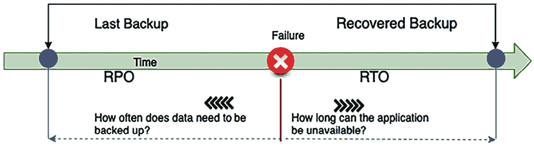
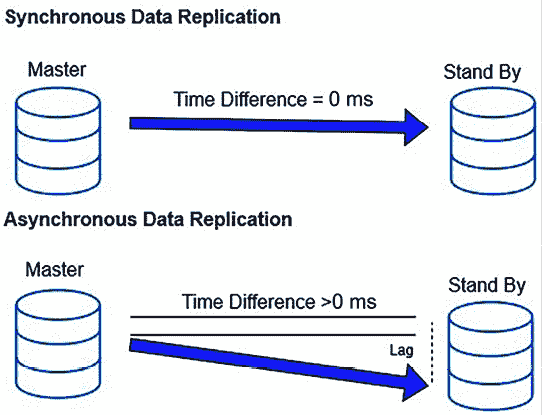
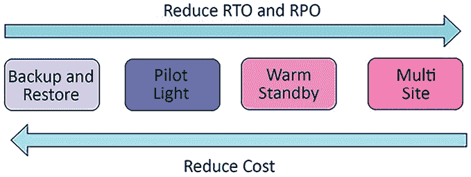
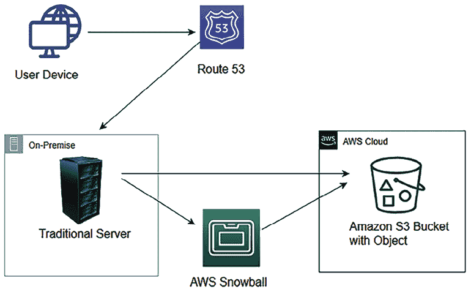
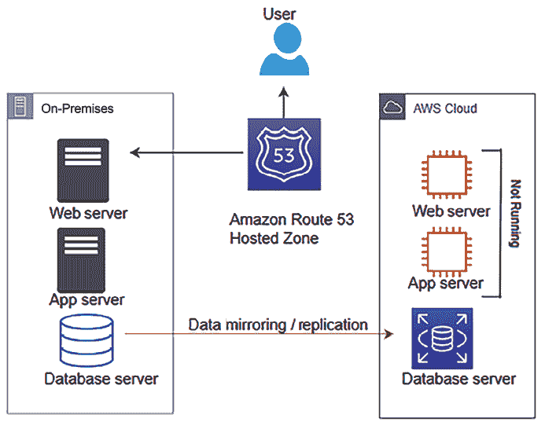
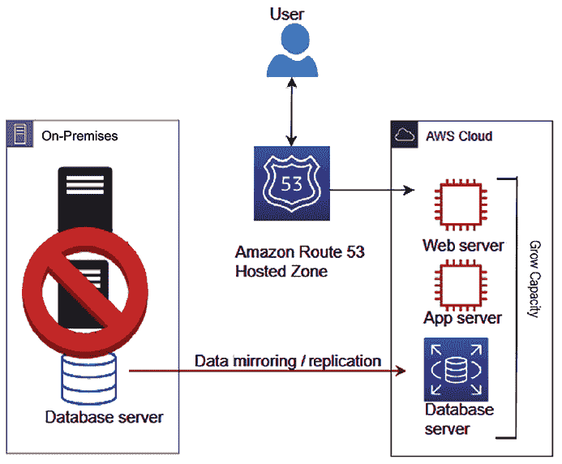
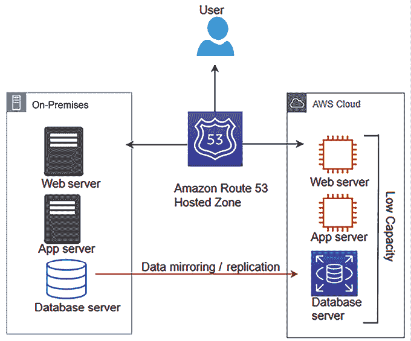
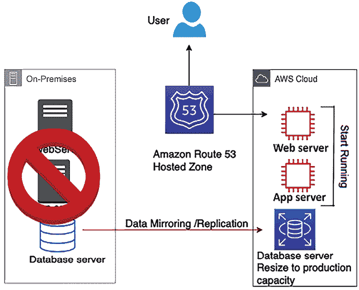
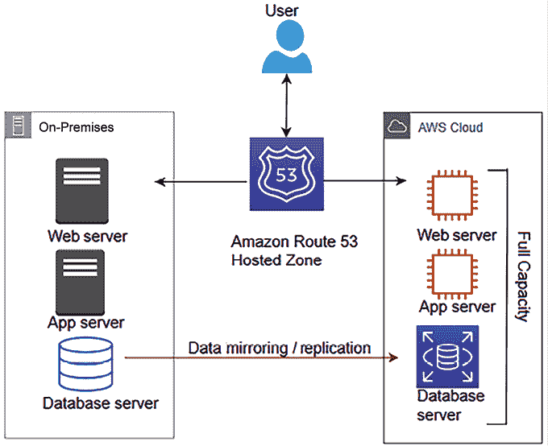

# 第八章：8

# 架构可靠性考虑因素

应用程序可靠性是架构设计中的关键方面，是任何企业成功的关键。

**可靠性**意味着系统从故障中恢复的能力。这涉及使您的应用程序具有容错能力，能够从任何基础设施或服务器故障中恢复，而不会影响客户体验。您的系统应该做好准备，能够应对任何可能导致中断的情况。

随着各种企业现在都在线上，高可用性也成为在线应用程序的强制性标准。用户希望随时浏览您的应用程序，并在他们方便的时候完成购物和银行等任务。在本章中，您将学习各种设计原则，以使您的解决方案可靠。在评估可靠性时，您需要考虑架构的每个组件。您将了解如何选择合适的技术，以确保每一层架构的可靠性。

在本章中，您将学习以下最佳的可靠性实践：

+   架构可靠性的设计原则

+   架构可靠性的技术选择

+   通过云提升可靠性

本章结束时，您将了解各种灾难恢复技术和数据复制方法，以确保应用程序的高可用性和业务流程的持续性。

# 架构可靠性的设计原则

可靠性和**高可用性**（**HA**）是确保应用程序和基础设施能够满足用户需求、不中断地运行的基础支柱。可靠性侧重于系统在特定条件下和一定时间内正常运行的能力。

这涉及到设计系统以在尽可能小的范围内容纳和管理故障，最大程度地减少对整体操作的影响。该方法需要全面理解潜在的故障模式，并实施针对性的缓解策略，以防止这些故障发生或在故障发生后优雅地恢复。

在*第二章*中详细讨论的 HA 与可靠性密切相关，但重点是确保服务始终可访问。HA 策略涉及创建冗余系统和组件，以消除单点故障，从而在发生故障时实现无缝切换。其目标是在硬件故障、网络中断或软件漏洞的情况下，保持服务的连续性。通过将可靠性和 HA 集成到系统设计中，组织可以确保其应用程序能够抵御故障，并能够维持一致的服务水平。

本讨论包含了有助于增强系统可靠性的标准设计原则。您会发现，所有的可靠性设计原则是密切相关的，并且相辅相成。

## 通过应用自动化使系统具备自愈能力

将自愈能力和自动化集成到系统设计中，可以通过让系统预测并自动从故障中恢复，增强其可靠性。自愈系统能够主动检测并修复硬件、网络或软件等各个系统层面的故障，最大限度地减少对终端用户的影响。这一方法要求识别与你的应用程序和业务运营相关的关键**关键绩效指标**（**KPI**），例如每秒请求处理能力或网页加载时间。基础设施级别的 KPI 可能包括 CPU 和内存利用率的阈值，确保其不超过预定限制。

为了实现自愈架构，实施一个强大的监控系统，跟踪这些关键绩效指标（KPIs），并在它们接近临界阈值时发出警报。该系统应当有自动化策略支持，例如，当 CPU 使用率接近其最大允许百分比时，自动启动额外的服务器来应对增加的负载。这种积极的监控和自动响应不仅能防止潜在的故障，还能帮助系统在无需人工干预的情况下保持最佳性能水平。

此外，贯穿应用程序生命周期的自动化—从部署和配置到基础设施扩展—能够促进一个更加敏捷和有弹性的环境。它使你的团队能够快速部署新特性，更自由地进行实验，并确保系统在负载波动时仍保持一致的性能。通过根据预定需求或意外流量激增来自动化资源扩展，可以确保应用程序保持响应能力和可用性。通过利用自动化部署独立任务并汇总其结果，你不仅可以实现更高的可靠性和效率，还可以增强系统自我恢复事件的能力，使基础设施真正具备弹性和自我维持能力。

### 质量保证

经常需要将你在开发环境中使用的相同配置应用于**质量保证**（**QA**）环境。每个测试阶段可能有多个 QA 环境，包括功能测试、**用户验收测试**（**UAT**）和压力测试环境。

通常，QA 测试人员会发现由于资源配置错误导致的缺陷，这可能会进一步延迟测试进度。最重要的是，你不能在生产服务器中出现配置错误，因为这可能会导致大规模的停机，因此最好提前进行测试。

为了在你的开发环境和 QA 环境中精确复现相同的配置，你可能需要编写一步一步的配置说明。手动重复相同的配置步骤容易出错。总是存在人为错误的可能性，比如在数据库名称中打错字。解决这个问题的方法是通过创建脚本来自动化这些步骤。自动化脚本本身就是文档。

只要脚本正确，它比手动配置更可靠。它无疑是可复制的。检测不健康的资源并启动替代资源可以实现自动化，当资源发生变化时，你可以通知 IT 运维团队。自动化是一个基础的设计原则，应该在系统的各个方面应用。

## 创建一个分布式系统

单体应用程序在系统正常运行时间方面的可靠性较低，因为某个模块的小问题可能会导致整个系统崩溃。将你的应用程序拆分成多个小服务可以减少*影响范围*。应用程序的一个部分不应该影响整个系统，且应用程序可以继续提供关键功能。例如，在电子商务网站上，支付服务出现问题不应影响客户下单的能力，因为支付可以稍后处理。

在服务层面，水平扩展你的应用程序以提高系统的可用性。设计一个系统，使用多个较小的组件协同工作，而不是一个单一的整体系统，从而减少影响范围。在分布式设计中，请求由不同的系统组件处理，一个组件的故障不会影响系统其他部分的功能。例如，在一个电子商务网站上，仓库管理组件的故障不会影响客户下单。

然而，在分布式系统中，通信机制可能会变得复杂。这种复杂性源于确保在不同网络计算机之间可靠的数据交换的需求，每台计算机可能运行不同的操作系统，并且位于不同的地理区域。挑战包括应对网络延迟、处理消息传递保证、在各节点之间同步数据以确保一致性，以及实施容错机制以应对部分系统故障。此外，开发和维护一个高效支持分布式架构多样化需求的通信协议也增加了复杂性。

熔断器模式可以帮助处理系统依赖性。正如你在*第四章*《解决方案架构设计模式》中所学到的，基本概念很简单。你将一个受保护的函数调用包装在熔断器对象中，熔断器监控故障并采取自动化措施来减轻它们。

## 监控和增加容量

资源饱和是导致应用失败的最常见原因。通常，你会遇到因 CPU、内存或硬盘过载导致应用开始拒绝请求的问题。

在传统的本地环境中，你必须提前根据假设计算服务器容量。在线流量非常不可预测，且波动剧烈，受到全球趋势的驱动。通常，硬件采购需要 3 到 6 个月，而提前猜测容量非常困难。订购过多的硬件会导致额外成本，因为资源会闲置，而资源不足则会因为应用不可靠而导致业务损失。

你需要一个无需猜测容量的环境，且你的应用能够按需扩展。

像**亚马逊 Web 服务**（**AWS**）这样的公共云提供商提供**基础设施即服务**（**IaaS**），便于按需提供资源。

在云环境中，你可以监控系统的供需情况。你可以根据需要自动添加或移除资源。这使你能够维持一个足够满足需求的资源水平，避免过度配置或资源不足的情况。

## 执行恢复验证

在基础设施验证方面，大多数组织通常专注于验证一条顺利的路径，即一切都在正常运行。实际上，你应该验证系统是如何失败的，以及恢复过程的有效性。假设一切都可能失败，验证你的应用程序。不要仅仅依赖于你的恢复和故障转移策略能够正常工作，确保定期进行测试，以防万一出现问题时不会感到惊讶。

基于模拟的验证有助于发现潜在的风险。你可以自动化可能导致系统失败的场景，并相应准备事件响应。你的验证应当提高应用程序的可靠性，确保生产环境中不会发生故障。

恢复能力有时被忽视作为可用性的一部分。为了提高系统的**恢复点目标**（**RPO**）和**恢复时间目标**（**RTO**），你应该将数据、应用程序及其配置备份为机器镜像。在下一节中，你将了解更多关于 RTO 和 RPO 的内容。假设自然灾害导致一个或多个组件不可用，或者摧毁了你的主要数据源。在这种情况下，你应该能够快速恢复服务，且不会丢失数据。接下来，我们将讨论特定的灾难恢复策略，以提高应用程序的可靠性以及相关的技术选择。

# 架构可靠性的技术选择

应用程序可靠性通常关注应用程序是否能够持续为用户提供服务。有多个因素决定了你的应用程序是否具备高度可用性。然而，**容错性**指的是应用程序组件的内建冗余。你的应用程序可能是高度可用的，但并不一定具备 100%的容错能力。例如，如果你的应用程序需要四台服务器来处理用户请求，你可以将它们分配到两个数据中心以实现高可用性（HA）。

如果一个站点出现故障，你的系统仍然能在 50%的容量下保持高可用性，但这可能会影响用户的性能预期。然而，如果你在两个站点之间创建相等的冗余，每个站点都有四台服务器，那么你的应用程序不仅将具有高度可用性，还将具备 100%的容错能力。

假设你的应用程序不是 100%容错的。在这种情况下，你需要添加自动化的可扩展性，定义你的应用程序的基础设施如何响应容量需求的增加，以确保应用程序的可用性，并在你的标准要求内保持性能。为了让你的应用程序更加可靠，你应该能够快速恢复服务并且不丢失数据。接下来，我们将讨论这个恢复过程，即**灾难恢复**（**DR**）。在进入不同的灾难恢复场景之前，让我们先了解 RTO/RPO 以及数据复制，因为它们是灾难恢复规划中的关键因素。

## 规划 RPO 和 RTO

企业应用程序需要以**服务水平协议**（**SLA**）的形式定义服务可用性。组织通过定义 SLA 来确保应用程序的可用性和可靠性。例如，你可以在 SLA 中声明你的应用程序在一年内应保持 99.9%的可用性，或者组织可以容忍每月 43 分钟的停机时间，等等。定义的 SLA 主要驱动应用程序的 RPO 和 RTO。

RPO 是指组织在特定时间段内能够容忍的数据丢失量。例如，如果我的应用程序可以接受丢失 15 分钟的数据，那就没有问题。在这种情况下，如果你每 15 分钟处理一次客户订单，那么在订单履行应用程序发生系统故障时，你可以容忍重新处理这段数据。RPO 有助于定义数据备份策略。

RTO 是指应用程序停机时间以及在故障发生后，应用程序恢复并正常运行所需的时间。下图展示了 RTO 和 RPO 之间的区别：

图 8.1：RTO 和 RPO

在前面的图示中，假设故障发生在早上 10 点，而你最后一次备份是在早上 9 点；如果发生系统崩溃，你将丢失 1 小时的数据。当你恢复系统时，数据丢失的时间为一个小时，因为你每小时进行一次数据备份。

在这种情况下，你的系统 RPO 是 1 小时，因为它可以容忍最多 1 小时的数据丢失。这里的 RPO 表示最大可容忍的数据丢失为 1 小时。

如果你的系统需要 30 分钟才能恢复到备份并启动系统，那么 RTO 就定义为半小时。这意味着可以容忍的最大停机时间是 30 分钟。RTO 是指在系统故障导致停机后，恢复整个系统所需的时间，在这个案例中是 30 分钟。

组织通常会根据用户体验以及系统不可用时对业务的财务或声誉影响，决定一个可接受的 RPO（恢复点目标）和 RTO（恢复时间目标）。组织会根据定义的 RTO 和 RPO 规划有效的系统恢复解决方案。随着时间的推移，你应该致力于减少 RTO/RPO，这将直接带来业务上的好处，因为应用程序的正常运行时间会增加。现在你可以看到数据是系统恢复的关键，因此让我们学习一些方法来最小化数据丢失。

## 数据复制

数据复制和快照是灾难恢复（DR）和确保系统可靠性的关键。复制会在备份站点创建主数据站点的副本。若主系统发生故障，系统可以故障转移到备份系统，继续可靠地运行。这可能是你存储在**NAS 硬盘**中的文件数据，**数据库快照**或**虚拟机镜像快照**。站点可以是两个地理位置分离的本地系统，两个位于同一场所的独立设备，或是物理分隔的公共云。

数据复制不仅有助于灾难恢复，还能通过快速创建新的测试和开发环境，提高组织的敏捷性。数据复制可以是同步的或异步的。

### 同步与异步复制

同步复制会实时创建数据副本。实时数据复制有助于减少 RPO，并在灾难发生时提高可靠性。然而，它的成本较高，因为它需要额外的资源来进行持续的数据复制。

异步复制会在某些延迟的情况下，或者根据定义的时间表创建数据副本。然而，异步复制比同步复制成本低，因为它使用的资源较少。如果你的系统可以容忍较长的 RPO，你可以选择异步复制。

对于像 Amazon RDS 这样的数据库技术，当我们创建一个具有多个**可用区**（**AZ**）故障转移的 RDS 时，会应用同步复制。该配置确保你的主数据库和其在另一个可用区的副本始终保持同步，从而提供高可用性（HA）和数据持久性。如果主数据库遇到问题，服务可以自动故障转移到副本，且对业务的影响最小。对于只读副本，则使用异步复制，你可以用它来处理报告和读取请求。

如下图所示，在同步复制中，主数据库实例和备用数据库实例之间的数据复制没有延迟，而在异步复制中，主数据库实例和复制实例之间可能会存在一些数据复制延迟：

图 8.2：同步与异步数据复制

让我们来探索一些用于同步和异步方法的数据复制方式。

### 复制方法

复制方法是一种从源系统提取数据并创建副本以用于数据恢复的方式。根据存储类型，有不同的复制方法可以存储数据副本，以便业务流程的继续。复制可以通过以下方式实现：

+   **基于阵列的复制**：在这种方法中，内建的软件会自动进行数据复制。然而，源存储阵列和目标存储阵列必须兼容并且是同类的才能进行数据复制。存储阵列包含多个存储磁盘，在机架中进行安装。

    大型企业通常使用基于阵列的复制，因为它易于部署，且能减少主机系统的计算负载。你可以选择像 HP Storage、EMC SAN Copy 和 NetApp SnapMirror 这样的基于阵列的复制产品。

+   **基于网络的复制**：这可以在不同类型的异构存储阵列之间复制数据。它使用一个附加的交换机或设备，在不兼容的存储阵列之间复制数据。在基于网络的复制中，由于涉及到多个厂商，复制的成本可能较高。你可以选择像 NetApp Replication X 和 EMC RecoverPoint 这样的基于网络的复制产品。

+   **基于主机的复制**：在这种方法中，你需要在主机上安装一个软件代理，该代理可以将数据复制到任何存储系统，如 NAS、SAN 或 DAS。你可以使用基于主机的软件供应商，例如 Symantec、Commvault、CA 或 Vision Solution。

    由于较低的前期成本和异构设备兼容性，这在**中小型企业**（**SMBs**）中很常见。然而，由于需要在主机操作系统上安装代理，它会消耗更多的计算资源。

+   **基于虚拟化管理程序的复制**：这是虚拟机感知型的，意味着将整个虚拟机从一个主机复制到另一个主机。由于组织通常使用虚拟机，因此它提供了一种非常高效的灾难恢复方法，以减少恢复时间目标（RTO）。基于虚拟化管理程序的复制具有高度的可扩展性，并且比基于主机的复制消耗更少的资源。它可以通过 VMware 和 Microsoft Windows 中内建的本地系统执行。你可以选择像 Zerto 这样的产品来执行基于虚拟化管理程序的复制，或者选择其他供应商提供的产品。

在*第二章*中，*解决方案架构设计原则*，你学习了可扩展性和容错性。在*第四章*中，*解决方案架构设计模式*，你学习了多种设计模式，以使你的架构高度可用。现在，你将发现多种从故障中恢复系统并使其高度可靠的方法。

## 灾难恢复规划

灾难恢复（DR）是关于在系统故障期间保持业务连续性。它是关于为任何可能的系统停机做好准备，并具备从中恢复的能力。DR 规划涉及多个维度，包括硬件和软件故障。

在进行 DR 规划时，始终确保考虑到操作损失，例如停电、网络中断、供暖和制冷系统故障、物理安全漏洞以及其他事件，如火灾、洪水或人为错误。

组织根据系统的重要性和影响，在 DR 规划上投入努力和资金。一个生成收入的应用程序需要始终保持在线，因为它对公司形象和盈利能力有重大影响。对于这样的应用程序，组织会投入大量精力来创建基础设施并培训员工应对 DR 情况。DR 就像一份保险政策，即使你没有使用它，你也必须投资并保持它，因为在不可预见的事件发生时，DR 计划将是你业务的救命稻草。

基于业务关键性的基础，例如软件应用程序，可以放置在一个*复杂性谱系*上。DR 有四种场景，按照 RTO/RPO 从高到低排序如下：

+   备份与恢复

+   引导灯

+   热备份

+   多站点

如下图所示，在 DR 规划中，随着每个选项的进展，RTO 和 RPO 会减少，而实施成本会增加。你需要根据应用程序的可靠性要求，在 RTO/RPO 要求和成本之间做出适当的权衡：

图 8.3：DR 选项的范围

DR 策略高度定制化，根据每个组织的独特需求制定，执行完整站点故障转移的决定取决于多种关键因素。触发这种 dr 联合行动的点各不相同，范围从轻微的中断到数据中心的大灾难，如破坏。例如，在重大灾难事件中，组织可能需要迅速评估和优先考虑关键服务，通常这些服务占其收入的重要部分。这些优先服务可能有预定义的 rto，例如在金融影响变得过于严重之前，需要在 24 小时窗口内恢复运营，考虑到罚款、sla 违规和减少销售等潜在损失。另一方面，对于不那么灾难性但仍然关键的服务中断，公司可能为更短的停机时间容忍度设置自动故障转移协议，如 15 分钟。在这两种情况下，dr 的决策标准包括评估业务影响分析，了解关键服务的 rto 和 rpo，评估停机成本与恢复过程，以及确保遵守任何法规要求。此外，技术可行性，包括备用站点的可用性和准备情况，在确定适当响应以确保连续性和最小化运营中断方面起着至关重要的作用。

让我们详细探讨涉及的每个选项及其涉及的技术选择。请注意，像 AWS 这样的公共云能够以成本效益和高效的方式实现上述每种 dr 策略。

### 备份和恢复

备份和恢复是成本最低的选择，导致较高的 rpo 和 rto。这种方法易于启动，成本效益高，因为您只需要备份存储空间。这种备份存储可以是磁带驱动器、硬盘驱动器或网络访问驱动器。随着存储需求的增加，跨区域添加和维护更多硬件可能是一项艰巨的任务。使用云作为备份存储的最经济和简单的选择之一。Amazon S3 就是一个例子；它以低成本和按需付费模式提供无限的存储容量。

下图显示了一个基本的 dr 系统。在此图中，数据位于传统数据中心，备份存储在 AWS 中。使用 AWS Import/Export 或 Snowball 类型的物理硬盘（8 TB 到 100 TB）将数据导入 AWS，并将信息存储在 Amazon S3 中：

图 8.4：从本地基础设施备份数据到 Amazon S3

您可以使用其他备份和恢复的第三方解决方案。一些最流行的选择包括 NetApp、VMware、Tivoli 和 Commvault。

在云环境中规划灾难恢复（DR）时，必须结合利用各种云服务提供商的优势，例如 AWS、**谷歌云平台**（**GCP**）和微软 Azure。此方法确保在不同平台之间具有灵活性和韧性。以下是适用于这些云服务的通用程序：

+   **备份和存储解决方案**：利用云存储服务来保存系统的备份。对于 AWS，Amazon S3 可作为可靠的备份存储解决方案；在 GCP 中，Google Cloud Storage 提供耐用且高度可用的对象存储；Azure 的等效服务 Azure Blob Storage 提供类似的存储服务，用于存储大量非结构化数据。

+   **机器镜像和配置**：准备包含操作系统、应用程序和配置的机器镜像。AWS 使用 **亚马逊机器镜像**（**AMIs**），GCP 使用 Compute Engine 镜像，Azure 提供 Azure 虚拟机镜像。这些镜像可以根据需要进行定制和预配置，包含必要的软件和安全补丁，以便在灾难发生时进行部署。

+   **系统恢复文档**：明确记录从不同云平台的备份恢复系统所需的步骤。该文档应包括如何部署存储的机器镜像，以及如何从备份恢复数据库和应用程序。

+   **流量路由和故障切换程序**：概述将流量从主站点重新路由到云中的备份站点的过程。AWS 提供 Route 53 进行 DNS 管理和流量路由，GCP 提供 Cloud DNS 和 Traffic Director，Azure 提供 Azure Traffic Manager 和 DNS Zone。了解如何利用这些服务进行故障切换场景至关重要。

+   **部署运行手册**：制定一份详细的运行手册，说明部署配置、潜在问题及其解决方案。该手册应为云无关型，并可根据 AWS、GCP 和 Azure 的具体要求进行调整，确保团队无论使用何种云平台都能做好准备。

在准备阶段，创建并存储自定义机器镜像和备份到各自的云存储解决方案——AWS 的 S3、GCP 的 Cloud Storage 和 Azure 的 Blob Storage。同时，准备数据库快照、存储卷以及任何重要文件。通过这种主动方式，确保无论使用哪个云服务提供商，组织都能在灾难发生时迅速恢复，最小化停机时间和数据丢失。

这种灾难恢复模式易于设置且相对便宜。然而，在这种情况下，RPO 和 RTO 都会较高；RTO 将是系统从备份恢复并开始运行的停机时间，而 RPO 则取决于系统的备份频率。接下来我们将探讨“灯塔模式”，它能够进一步提升你的 RTO 和 RPO。

### 灯塔模式

试点灯方法是继备份和恢复之后的第二低成本灾难恢复方法。就像您家中气炉的试点灯一样，一个始终亮着的小火焰，能够迅速点燃整个炉子为房子加热，采用这种灾难恢复方法时，您需要保持最少数量的核心服务在不同区域内保持运行。在发生灾难时，您可以快速启动额外的资源。

您可以主动复制数据库层，然后从虚拟机镜像启动实例，或者使用基础设施即代码（如 CloudFormation、Terraform、Ansible 等）构建基础设施。

下图显示了试点灯灾难恢复模式。在这种情况下，数据库已复制到 AWS，Web 服务器和应用程序服务器的 Amazon EC2 实例已准备好，但当前未运行：

图 8.5：试点灯数据复制到灾难恢复站点场景

试点灯场景类似于备份和恢复，您将大部分组件进行备份并被动存储。然而，您为关键组件（如数据库或认证服务器）维护低容量的活动实例，这些组件可能需要较长时间才能启动。您需要根据需要自动启动所有必需的资源，包括网络设置、负载均衡器和虚拟机镜像。由于核心组件已经在运行，因此恢复时间比备份和恢复方法更快。试点灯方法非常具有成本效益，因为您仅以完全容量运行部分资源。

您需要启用所有关键数据到灾难恢复站点（在本例中为 AWS 云）的复制。您可以使用 AWS 数据迁移服务在本地和云数据库之间复制数据。对于基于文件的数据，您可以使用 Amazon File Gateway。

许多其他第三方管理工具提供高效的数据复制解决方案，例如 Attunity、Quest、Syncsort、Alooma 和 JumpMind。

如果主系统发生故障，如下图所示，您可以启动带有最新数据副本的 Amazon EC2 实例。然后，您可以将 Amazon Route 53 重定向到新的 Web 服务器：

图 8.6：试点灯方法中的恢复

对于试点灯方法，在灾难发生时，您需要执行以下步骤：

1.  启动处于待命模式的应用程序和 Web 服务器。此外，通过使用负载均衡器进行水平扩展，扩展应用程序服务器。

1.  垂直扩展运行在低容量的数据库实例。

1.  更新路由器中的 DNS 记录，指向新站点。

在引导灯方法中，你会自动启动围绕复制的核心数据集的资源，并根据需要扩展系统以处理当前流量。引导灯灾难恢复模式相对容易设置且成本低。然而，在这种情况下，RTO（恢复时间目标）需要更长的时间来自动启动替代系统，而 RPO（恢复点目标）则主要取决于复制类型。让我们来探讨下一个方法，热备用，它进一步改善了 RTO 和 RPO。

### 热备用

热备用，或完全运行的低容量备用，代表了一种通过利用云的灵活性提供成本效益灾难恢复解决方案的先进方法。这种方法通过保持环境服务的子集处于持续运行状态，尽管容量低于完整生产环境，从而增强了基础引导灯策略。

热备用方法的关键优势在于它在成本节约和恢复准备之间取得了平衡。通过让必要的服务已经启动并运行，尽管规模较小，但与冷备用或引导灯策略相比，灾难发生时的恢复时间显著缩短，因为冷备用或引导灯策略在恢复过程中需要配置或扩展资源。

组织可以根据其恢复目标和预算考虑，将热备用环境量身定制为处理其生产流量的特定百分比，如 20%、30% 或 50%。这种灵活性使得灾难恢复解决方案能够根据业务需求和风险承受能力水平进行定制。

此外，热备用环境不仅仅局限于灾难恢复（DR）场景；它还可以通过提供一个非生产环境的平台，如测试、预发布或开发工作，发挥双重作用。这种热备用环境的双重使用通过将基础设施用于除单纯备用外的其他目的，最大化了灾难恢复投资的价值，从而优化了资源利用率和成本效益。

下图展示了两种系统在热备用方法下运行——中央系统和低容量系统——在 AWS 云上。你可以使用像 Amazon Route 53 这样的路由器来分配请求到中央系统和云系统：

图 8.7：热备用场景下，运行一个低容量的活动-活动负载

在数据库方面，热备用采取与引导灯（pilot light）类似的方法，即数据不断从主站点复制到灾难恢复站点。然而，在热备用中，你会全天候运行所有必要的组件，但它们并不会扩展以应对生产流量。

通常，组织会选择热备份策略来处理更关键的工作负载，因此你需要通过持续测试确保灾难恢复站点没有问题。最佳做法是 A/B 测试，其中主站点将处理更多的流量。约 1%到 5%的流量将被路由到灾难恢复站点。这将确保在主站点发生故障时，灾难恢复站点能够提供流量服务。同时，确保定期修补和更新灾难恢复站点上的软件，以保持与生产环境的同步。

如下图所示，在主环境不可用时，路由器会切换到次级系统，次级系统设计为在主系统发生故障时自动扩展其容量：

图 8.8：热备份场景中的恢复阶段

假设主站点发生故障，在这种情况下，你可以采取以下方法：

1.  通过将流量从 5%增加到 100%，立即将关键生产工作负载的流量转移到灾难恢复站点。例如，在银行业务中，你必须首先启动面向客户的网站以保持其正常运行。

1.  扩展低容量运行的环境。你可以对数据库进行垂直扩展，对服务器进行水平扩展。

1.  当你扩展环境时，其他在后台运行的非关键工作负载也可以转移，例如仓库管理和发货。

可用于热备份的工具包括 Terraform，这是一个由 HashiCorp 开发的开源工具，因其能够在各种云提供商之间以安全高效的方式构建、修改和版本化基础设施而闻名。与此同时，Veeam 凭借其提供的全面备份和复制解决方案，在云环境、虚拟环境和物理环境中脱颖而出，确保对多云策略的强大支持。Zerto 进一步补充了这些功能，提供了为虚拟化基础设施和云环境量身定制的灾难恢复、备份和工作负载迁移软件。

热备份灾难恢复（DR）模式相对较复杂且成本较高。关键工作负载的恢复时间目标（RTO）比备用灯模式要快得多。然而，对于非关键工作负载，它取决于你能够多快地扩展系统，而恢复点目标（RPO）则主要取决于复制类型。接下来我们将探讨下一种方法——多站点，它提供近乎零的 RTO 和 RPO。

### 多站点

最后，多站点策略，也称为热备份，帮助你实现接近零的恢复时间目标（RTO）和恢复点目标（RPO）。通过这种方法，你的灾难恢复站点是主站点的副本，且站点之间进行持续的数据复制和流量流动。由于自动化的流量负载均衡，跨区域或本地与云端之间的流量管理，这种方法被称为多站点架构。

如下图所示，多站点是灾难恢复的下一个层级，具有在云端与本地系统同时运行的完全功能系统：

图 8.9：在 AWS 上运行全负载的活动-活动工作负载的多站点场景

多站点方法的优势在于它随时准备承载完全的生产负载。它类似于温备份，但灾难恢复站点在全负载运行。如果主站点出现故障，所有流量可以立即切换到灾难恢复站点，这相比温备份下切换和扩展灾难恢复站点时的性能损失和时间延迟要好得多。

实施多站点灾难恢复策略需要选择一些先进的工具和技术，这些工具和技术旨在自动化和管理无缝的故障转移过程，从而确保在最小性能损失的情况下保持操作连续性。像 VMware 的 vRealize Automation 和 Microsoft Azure Site Recovery 等云管理平台，在协调虚拟机和数据的复制方面起着至关重要的作用，确保在必要时可以立即切换到灾难恢复站点。负载均衡器和全局流量管理器（包括 F5 BIG-IP 和 AWS Route 53 等解决方案）会根据站点的可用性和负载动态地引导流量，确保灾难恢复站点能够瞬间处理传入的请求。

**基础设施即代码**（**IaC**）工具如 Terraform 和 AWS CloudFormation 使得必要的基础设施能够快速配置和扩展，从而使灾难恢复站点能够迅速复制生产环境的能力。此外，网络性能监控工具如 SolarWinds 和 Nagios 提供实时的网络健康状况洞察，帮助快速检测可能需要故障转移的问题。

多站点灾难恢复模式是最昂贵的，因为它要求为所有组件建立冗余；然而，对于那些需要高可用性（HA）且不能承受任何停机时间的企业，如金融机构、医疗服务和电子商务平台，投资多站点架构是合理的，因为潜在的停机成本非常高。

在这种情况下，所有工作负载的恢复时间目标（RTO）都要快得多，而恢复点目标（RPO）则主要取决于复制类型。

让我们探讨一些关于灾难恢复的最佳实践，确保你的系统可靠运行。

## 应用灾难恢复的最佳实践

当你开始考虑灾难恢复（DR）时，以下是一些重要的注意事项：

+   **从小做起，按需扩展**：确保首先启动最关键的工作负载，这些工作负载对业务影响最大，然后再逐步扩展，启动那些影响较小的负载。

+   **应用数据备份生命周期**：备份一切，无论是文件服务器、机器镜像还是数据库。保持大量的活动备份可能会增加成本，但一定要应用生命周期策略，根据你的业务需求归档并删除数据。例如，你可以选择保留 90 天的活动备份，在此之后将其存储在低成本的归档存储中，如磁带驱动器或 Amazon Glacier。1 到 2 年后，你可能想设定生命周期策略来删除数据。遵守像 PCI-DSS 这样的标准可能要求你存储数据 7 年，在这种情况下，你必须选择归档数据存储以减少成本。

+   **检查你的软件许可证**：管理软件许可证可能是一项艰巨的任务，尤其是在当前微服务架构环境中，你有多个独立运行的服务，每个服务都运行在虚拟机和数据库上。软件许可证可能与多个安装、多个 CPU 和多个用户相关联。当你进行扩展时，这会变得更加复杂。监控并检查这些许可证很重要；你需要确保有足够的许可证来支持扩展需求。同时确保不要购买过多的许可证，这些许可证可能不会被利用，反而会浪费更多的资金。总的来说，确保像管理基础设施或软件一样管理你的许可证库存。

+   **规划你的扩展**：对于水平扩展，添加更多安装了软件的实例；对于垂直扩展，添加更多的 CPU 或内存。你需要了解你的软件许可协议，并确保你有足够的许可证来支持系统的扩展。

+   **经常测试你的解决方案**：灾难恢复（DR）站点是为罕见的灾难恢复事件创建的，常常被忽视。你需要确保你的灾难恢复解决方案能够按预期工作，以便在发生事故时实现高可靠性。妥协已定义的服务水平协议（SLA）可能会违反合同义务，并导致金钱和客户信任的流失。

+   **进行演练**：经常测试解决方案的一种方法是进行*演练*。进行演练时，你选择一个生产工作负载较小的日子，召集所有负责维护生产环境的团队成员。你可以通过关闭部分生产环境来模拟灾难事件，让团队处理情况以保持环境的正常运行。这些事件确保你有可用的备份、快照和机器镜像来应对灾难事件。

+   **持续监控资源**：建立监控系统，确保在发生事件时，能够自动切换到灾难恢复站点。监控帮助你采取主动的方法，监控容量可以避免资源饱和问题，这些问题可能会影响应用程序的可靠性。

创建灾难恢复计划并定期进行恢复验证，有助于实现预期的应用程序可靠性。接下来，让我们了解如何通过使用公共云来提高可靠性。

# 通过云提高可靠性

在前面的章节中，您已经看到灾难恢复（DR）站点的云工作负载示例。许多组织已经开始选择云作为灾难恢复站点，以提高应用程序的可靠性。此外，像 AWS、Azure 和 GCP 等主要云服务提供商的云市场提供了各种第三方解决方案，可以集成到灾难恢复规划和执行中。这些服务通常包括备份和复制、编排、监控和安全工具。

云提供了遍布地理位置的数据中心，随时触手可及。您可以轻松地在另一个大洲创建一个可靠的站点，毫不费力。借助云，您可以轻松创建和跟踪基础设施的可用性，例如备份和机器镜像。

在云中，轻松的监控和跟踪帮助确保您的应用程序根据业务定义的 SLA 保持高可用性。云为您提供对 IT 资源、成本的精细控制，以及在 RPO/RTO 需求方面的权衡处理能力。

云提供了轻松有效地测试您的灾难恢复计划的功能。您可以继承云中可用的特性，如各种云服务的日志和指标。内建的指标是深入了解系统健康状况的强大工具。

通过所有可用的监控功能，您可以通知团队任何阈值突破，或触发自动化以实现系统自愈。例如，AWS 提供了 CloudWatch，它收集日志并生成指标，同时监控不同的应用程序和基础设施组件。它可以触发各种自动化来扩展您的应用程序。

云提供了一个内建的变更管理机制，有助于跟踪配置的资源。云服务提供商扩展了开箱即用的功能，以确保应用程序和操作环境运行的是已知软件，并能够以受控方式进行修补或替换。例如，AWS 提供了 AWS Systems Manager，它具备批量修补和更新云服务器的功能。

使用云，您可以设计一个可扩展的系统，提供灵活性，自动添加和删除资源以匹配当前需求。数据是任何应用程序可靠性的重要组成部分。云提供了开箱即用的数据备份和复制工具，包括机器镜像、数据库和文件。在灾难发生时，您的所有数据都被备份并妥善保存在云中，这有助于系统快速恢复。

应用程序开发与运营团队之间的定期互动将有助于解决和防止已知问题以及设计漏洞，从而减少故障和停机的风险。不断架构您的应用程序，以实现弹性并分布式处理任何停机。

# 总结

在本章中，你了解了使系统可靠的各种原则。这些原则包括通过应用自动化规则使系统自我修复，并通过设计分布式系统来减少故障时的影响，在该系统中，工作负载跨多个资源分布。

整体系统的可靠性在很大程度上依赖于系统的可用性以及从灾难事件中恢复的能力。你已经学习了同步和异步数据复制类型，以及它们如何影响系统的可靠性。你还学习了各种数据复制方法，包括基于阵列、基于网络、基于主机和基于虚拟机监控程序的方法。每种复制方法都有其优缺点。市面上有多家供应商提供实现所需数据复制的产品。

你了解了根据组织需求以及 RTO 和 RPO 来选择不同的灾难规划方法。你学习了备份和恢复方法，它具有较高的 RTO 和 RPO，且易于实施。引导灯方法通过在灾备站点保持关键资源（如数据库）的活跃，来提高你的 RTO/RPO。热备份和多站点方法通过保持灾备站点工作负载的活跃副本，降低系统的 RTO/RPO，并通过降低系统复杂性和成本来提高应用程序的可靠性。

你已经了解了如何利用云平台的内建功能来确保应用程序的可靠性。

解决方案的设计和发布可能只是偶尔发生，但运营维护却是每日任务。在下一章中，你将学习解决方案架构中的警报和监控方面内容，包括各种设计原则和技术选择，以提升应用程序的运营效率，并实现卓越的运营。

# 加入我们书籍的 Discord 空间

加入本书的 Discord 工作区，向作者和其他解决方案架构师提问并互动：`packt.link/SAHandbook`

