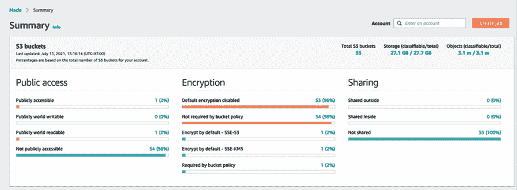

# 9

# 操作卓越考虑因素

应用程序可维护性是解决方案架构师在架构设计过程中需要考虑的主要方面之一。每个新项目开始时都需要大量的规划和资源，团队会花费最初的几个月来创建和发布应用程序。生产发布后，应用程序需要进行多方面的维护才能继续运行。你需要持续监控应用程序，以便在日常运营中发现并解决任何问题。

运维团队需要处理应用程序基础设施、安全性以及任何软件问题，以确保你的应用程序可靠运行，没有任何问题或故障。通常，企业应用程序非常复杂，并且有明确的**服务级别协议**（**SLA**），涉及到应用程序的可用性。你的运维团队需要理解业务需求，并做好相应准备，以应对任何事件。

操作卓越的核心在于确保系统架构的每个组件和层次都以高效的方式运行。这涉及到对过程、系统和服务的持续监控、优化和改进。

操作卓越应当在架构的每个组件和层次中实施。在现代微服务应用中，涉及到许多不同的部分，使得系统的操作和维护成为一项复杂的任务。

你的运维团队需要建立适当的监控和警报机制，以解决可能妨碍业务流的任何问题。操作问题涉及多个团队的协调，进行准备和解决。

在本章中，你将学习适用于实现操作卓越的各种设计原则。你将了解如何选择合适的技术，以确保软件应用程序每一层的操作可维护性。你将学习以下操作卓越的最佳实践：

+   操作卓越的设计原则

+   选择技术实现操作卓越

+   在公共云中实现操作卓越

+   通过 CloudOps 提升效率

本章结束时，你将了解实现操作卓越的各种流程和方法。你将学到可以在应用程序设计、实施和后期生产过程中应用的最佳实践，以提高应用程序的可操作性。

# 操作卓越的设计原则

操作卓越是指以最小的中断运行应用程序，以获得最大的业务价值。它是通过应用持续改进来使系统高效。

以下部分将讨论可以帮助你增强系统可维护性的标准设计原则。你会发现所有的操作卓越设计原则都彼此紧密相关，并相互补充。

## 自动化手动任务

技术发展迅速，IT 运营需要跟上这一速度，尤其是在硬件和软件库存来自多个供应商的情况下。企业正在构建混合云和多云系统，因此您必须学习如何处理本地和云端的操作。现代系统拥有广泛的用户基础，各种微服务协同工作，数百万设备通过网络连接。IT 运营中有许多动态组件，使得手动操作变得非常困难。

组织保持敏捷，运营需要迅速响应，以便为新服务的开发和部署提供所需的基础设施。运营团队有更大的责任，确保服务持续运行，并能在发生意外事件时快速恢复。如今，IT 运营要求采取主动的方式，而不是等到事件发生后再进行反应。

通过应用自动化，您的运营团队可以高效工作。需要将手动工作自动化，以便团队能够将精力集中在更具战略性的任务上，而不是被战术性的工作压得喘不过气来。自动化主动发现和响应任何安全威胁是最重要的，以释放团队的精力。通过**基础设施即代码**（**IaC**）的方法，启动新服务器或启动和停止服务应该自动化。自动化让团队能够投入更多时间进行创新。

对于您的面向 Web 的应用程序，您可以通过使用机器学习预测提前发现异常，避免其对系统造成影响。如果有人通过 HTTP 端口`80`暴露了您的服务器，您可以自动化地生成安全工单。几乎可以自动化整个基础设施，并多次重新部署，作为*一键解决方案*。自动化还有助于防止人为错误，即使一个人重复做同一工作时，也可能发生错误。自动化现在是 IT 运营的必备工具。

## 进行渐进式和可逆的变更

运营优化是一个持续的过程，需要不断努力识别差距并加以改进。这些差距可能集中在可靠性、可用性、性能和成本效益上，确保架构支持业务目标并适应不断变化的需求。实现卓越运营是一段旅程。在维护过程中，您始终需要对工作负载的各个部分进行更改。例如，通常需要通过供应商提供的安全补丁更新服务器的操作系统。您应用程序使用的各种软件也需要进行版本升级。您可能需要对系统进行更改，以符合新的合规要求。

你应该设计工作负载，使所有系统组件都能定期更新，从而使系统能够受益于最新和最重要的更新。自动化流程以应用小而渐进的变化，避免任何重大影响。任何变化都应该是可逆的，以便在出现问题时恢复系统的正常运行状态。渐进式变化有助于彻底测试，并提高整体系统的可靠性。自动化任何变更管理，以避免人为错误并提高效率。

## 预测故障并作出响应

预防故障对于实现卓越的操作至关重要。故障是难以避免的，关键是尽早发现并预见它们。在架构设计过程中，预见到故障并确保设计能够应对故障，从而防止其发生。假设一切都会随时失败，并准备好备份方案。定期进行演练，以识别任何潜在的故障源。尽量去除或减轻在系统运行过程中可能导致故障的任何资源。

基于你的 SLA 创建一个测试场景，包括系统**恢复时间目标**（**RTO**）和**恢复点目标**（**RPO**）。测试你的场景，并确保你理解它们的影响。通过模拟类似生产的场景，确保你的团队准备好响应任何事件。测试响应流程，确保它能够有效解决问题，并打造一个熟悉响应执行的自信团队。

## 从错误中学习并改进

随着系统中操作故障的发生，你应该从错误中学习并识别其中的差距。确保这些相同的事件不会再次发生，并准备好解决方案，以防故障重演。

改进的一种方式是进行**根本原因分析**（**RCA**）。在 RCA 过程中，召集团队并提问五个*为什么*。每提一个*为什么*，就揭开问题的一层，直到最后一个*为什么*，你就能找到问题的根本原因。确定了问题的实际原因后，你可以准备解决方案，并更新操作手册，提供可立即使用的解决方案。

随着工作负载随时间的变化，你必须确保操作程序相应更新。确保定期验证和测试所有方法，并确保团队熟悉最新的更新以便执行它们。

## 保持操作手册的更新

通常，团队会忽视文档，这导致手册过时。手册提供了一个执行一系列操作的指南，用于解决由于外部或内部事件引发的问题。缺乏文档可能会使你的操作依赖于人员，这样由于团队人员流失可能会带来风险。始终建立流程以保持系统操作独立于人员，并记录所有方面。

在操作手册中，你需要跟踪所有之前的事件和团队成员采取的解决措施，这样任何新成员都可以快速解决类似的事件，帮助他们在运营支持过程中迅速应对。  

系统管理员应维护操作手册，记录启动、停止、修补和更新系统的步骤。运营团队应包括系统测试和验证结果，以及应对事件的程序。你的操作手册还应包括与 RTO/RPO、延迟、可扩展性、性能等相关的定义服务级别协议（SLA）。  

自动化流程，记录文档，当团队对系统进行更改时以及每次构建后进行标注。你可以通过标注来自动化你的操作，且这些标注可以通过代码轻松读取，以持续适应业务优先级和客户需求。  

# 选择运营卓越的技术  

运营团队需要创建程序和步骤来处理任何运营事件，并验证他们行动的有效性。他们需要理解业务需求，以提供高效的支持，并收集系统和业务指标来衡量业务成果的实现情况。  

运营程序可以分为三个阶段——规划、执行和改进。让我们来探索可以帮助每个阶段的技术。  

## 运营卓越的规划

运营卓越过程的第一步是定义运营优先级，聚焦于对业务影响较大的领域。这些领域可以是例如：应用自动化、简化监控、随着工作负载变化发展团队技能，以及专注于提升整体工作负载性能。  

有一些工具和服务可以扫描系统日志和活动，逐步检查你的系统。这些工具提供了一套基本的评估功能，提出对系统环境的优化建议。它们通过提供关键洞察和优化建议，帮助形成优先事项。  

在识别并理解优先级之后，你需要设计运营流程，其中包括要设计的工作负载，并构建支持这些负载的程序。工作负载的设计应涵盖其实施、部署、更新过程以及运营策略。一个完整的工作负载可以视为由不同的应用组件、基础设施组件、安全、数据治理和运营自动化组成。在设计运营流程后，创建一个操作就绪检查表。这些检查表应该是全面的，以确保系统在生产环境上线时已经准备好进行操作支持。内容包括日志记录和监控、沟通计划、警报机制、团队技能、团队支持章程、供应商支持机制等。  

对于运营卓越规划，以下是需要适当工具进行准备的领域：  

+   IT 资产管理  

+   配置管理  

让我们更详细地探索每个领域，以了解可用的工具和流程。

## IT 资产管理

运营卓越规划需要列出 IT 资产清单并追踪其使用情况。这些资产包括基础设施硬件，如物理服务器、网络设备、存储、终端用户设备等。你还需要跟踪软件许可证、运营数据、法律合同、合规性等。IT 资产包括公司用于执行业务活动的任何系统、硬件或信息。

跟踪 IT 资产有助于组织做出关于运营支持和规划的战略性和战术性决策。然而，在大型组织中管理 IT 资产可能是一项艰巨的任务。有多种**IT 资产管理**（**ITAM**）工具可供运维团队帮助管理资产过程。最受欢迎的 ITAM 工具包括**SolarWinds**、**Freshservice**、**ServiceDesk Plus**、**Asset Panda**、**PagerDuty**和**Jira Service Desk**。

IT 管理不仅仅是追踪 IT 资产。它还涉及持续监控和收集资产数据，以优化使用情况和运营成本。ITAM 通过提供端到端的可视化以及快速应用补丁和升级的能力，使组织更加敏捷。下图展示了 ITAM：

图 9.1：ITAM 过程

如上图所示，ITAM 过程包括以下阶段：

+   **计划**：资产生命周期从规划开始，这是一个更具战略性的关注点，用于确定整体 IT 资产的需求和采购方法。它包括成本效益分析和总拥有成本。

+   **采购**：在采购阶段，组织根据规划结果获取资产。他们还可能决定根据需要开发一些资产——例如，用于日志记录和监控的内部软件。

+   **集成**：在这一阶段，资产被安装到 IT 生态系统中。该阶段包括资产的操作和支持，包括定义用户访问——例如，安装日志代理来从所有服务器收集日志并将其显示在集中式仪表板上，同时将监控仪表板的度量限制为 IT 运维团队。

+   **维护**：在维护阶段，IT 运维团队会跟踪资产，并根据资产生命周期采取升级或迁移的行动——例如，应用软件供应商提供的安全补丁。这包括跟踪许可软件的生命周期结束，比如计划从 Windows Server 2008 迁移到 Windows 2022，因为旧操作系统已经接近生命周期末期。

+   **退役**：在退役阶段，运维团队处置生命周期结束的资产。例如，如果一台旧的数据库服务器即将结束其生命周期，团队则采取措施对其进行升级，并将所需的用户和支持迁移到新服务器上。

ITAM 帮助组织遵守**ISO 19770**合规性要求，包括软件采购、部署、升级和支持。ITAM 提供更好的数据安全性并有助于改善软件合规性，还促进了业务单位之间更好的沟通，例如运维、财务、营销团队以及一线员工。配置管理是规划运营卓越的另一个方面，有助于维护 IT 库存数据，以及诸如所有者和当前状态等细节。让我们深入了解它。

### 配置管理

配置管理维护**配置项**（**CIs**），以管理和交付 IT 服务。配置项在**配置管理数据库**（**CMDB**）中进行跟踪。CMDB 记录服务器是物理的还是虚拟的，操作系统及其版本（例如，Windows 2022 或 **Red Hat Enterprise Linux**（**RHEL**）8.0），服务器的所有者（即，支持、市场或人力资源），以及它是否依赖于其他服务器，如订单管理等。

配置管理与资产管理不同。资产管理处理资产的整个生命周期，从规划到退役，而 CMDB 是资产管理的一个组成部分，用于存储单个资产的配置记录。如下面的图所示，配置管理实现了资产管理的集成和维护部分：

图 9.2：IT 资产生命周期与配置管理对比

如前图所示，配置管理实现了资产管理的*集成*和*维护*部分。

配置管理和变更管理是 IT 运维中的互补过程。配置管理专注于维护组织 IT 环境中所有组件的准确且最新的记录，包括它们的版本、配置和相互关系。这确保了系统的一致性和高效性部署与运行。另一方面，变更管理则负责监督和控制 IT 基础设施的修改，确保变更以协调和系统化的方式实施，从而防止意外后果。二者共同作用，帮助维护 IT 资产的完整性和稳定性，配置管理提供评估变更影响所需的详细信息，变更管理则确保配置变更经过充分规划、执行并文档化。

配置管理工具可以通过提供资产配置的现成信息，帮助运维团队减少停机时间。最流行的配置管理工具包括 Chef、Puppet、Ansible 和 Bamboo。在*第十一章*，*DevOps 和解决方案架构框架*中，你将了解更多关于它们的细节。

如果您的工作负载托管在像 AWS、Microsoft Azure 或 GCP 这样的公共云上，IT 管理会变得更加轻松。云服务商提供内建工具，以便在一个地方跟踪和管理 IT 库存和配置。例如，AWS 提供 AWS Config 等服务，跟踪作为 AWS 云工作负载一部分的所有 IT 库存，以及 AWS Trusted Advisor 等服务，它会推荐成本、性能和安全方面的改进，您可以利用这些建议来决定如何管理您的工作负载。以下截图展示了 AWS Trusted Advisor 的示例：

图 9.3：AWS Trusted Advisor 仪表板

如前所示的截图所示，AWS **Trusted Advisor 仪表板**显示了 12 个安全问题，可以进一步探索以了解更多细节等内容。

配置管理在持续监控和记录 IT 资源配置中起着至关重要的作用，它使得根据预定义标准自动化配置评估成为可能。配置管理的好处包括：

+   **持续监控**：它允许对 IT 资源配置的变化进行持续观察和记录。

+   **变更管理**：帮助追踪资源之间的相互关系，并在实施任何变更之前审查依赖关系。

+   **持续评估**：便于定期审计和评估，确保您的 IT 资源符合组织的政策和指南。

+   **企业级合规性监控**：提供企业范围内合规状态的全面视图，定位任何不符合要求的账户，并允许在区域账户级别进行深入检查。

+   **第三方资源管理**：支持记录第三方资源的配置，如 GitHub 仓库、Microsoft Active Directory 资源及服务器，无论是在本地还是云端。

+   **操作故障排除**：捕捉配置变化的详细历史记录，帮助简化操作问题的解决。

通过配置管理，您可以进行安全分析，持续监督资源配置，并评估这些配置是否存在潜在的安全漏洞。它在确保 IT 和第三方资源配置符合内部政策和监管标准方面起着重要作用，并且能够持续审查资源配置变化是否符合您的预期标准。

在本节中，你了解了资产管理和配置管理。这些都是**信息技术基础设施库**（**ITIL**）框架的一部分，ITIL 实施了**信息技术服务管理**（**ITSM**），与运营卓越密切相关。ITSM 帮助组织日常运行其 IT 操作。你可以通过访问其官方网站 ([`www.axelos.com/best-practice-solutions/itil`](https://www.axelos.com/best-practice-solutions/itil))，了解更多关于 ITIL 的信息，AXELOS 还提供 ITIL 认证，帮助提升 IT 服务管理流程中的技能。

既然你已经了解了规划，让我们在下一节中探讨 IT 操作的运作。

## 运营卓越的运作

运营卓越的关键在于主动监控，以及在发生意外事件时的快速响应与恢复。通过了解工作负载的运营健康状况，可以识别出事件和响应对其的影响。使用能够通过**指标**和**仪表盘**帮助你理解系统运营健康的工具。你应该将日志数据发送到集中存储，并定义指标以建立基准。这些工具还能够自动化响应操作事件，在特定警报触发时自动执行。

设计工作负载组件时，要确保它们是可替换的。这种方法意味着，你可以通过用已知、可靠的版本替换故障组件，来减少恢复时间，而不是花费时间修复问题。然后，你可以分析故障资源，而不会影响生产环境。

为了实现运营卓越，以下领域需要合适的工具：

+   监控系统健康状况

+   处理警报和事件响应

让我们通过可用工具和流程的信息来探讨每个领域。

### 监控系统健康状况

跟踪系统健康状况对理解*工作负载行为*至关重要。运营团队使用系统健康监控来记录系统组件的任何异常并做出相应处理。传统上，监控通常只局限于基础设施层，关注服务器的 CPU 和内存利用率。然而，监控应该应用于架构的每一层。监控应用的重要组件包括：

+   基础设施监控

+   应用监控

+   平台监控

+   日志监控

+   安全监控

我们将在以下小节中讨论这些内容。

#### 基础设施监控

基础设施监控至关重要，并且是最常见的监控形式。基础设施包括托管应用所需的组件。这些核心服务包括存储、服务器、网络流量、负载均衡器等。

基础设施监控可能包括以下指标：

+   **CPU 使用率**：在特定时间段内，服务器 CPU 的利用百分比

+   **内存使用情况**：服务器在给定时间段内使用的**随机存取内存**（**RAM**）百分比

+   **网络利用率**：在给定时间段内的网络数据包 *进出*

+   磁盘利用率：磁盘读写吞吐量和**每秒输入/输出操作**（**IOPS**）

+   **负载均衡器**：在给定时间段内的请求数量

还有许多其他可用的指标，组织需要根据其应用监控需求来定制这些监控指标。以下截图展示了一个网络流量的监控仪表盘示例：

图 9.4：基础设施监控仪表盘

从前面的系统仪表盘可以看到，**网络输入平均值**面板在某一天出现了峰值，并且对不同的服务器应用了颜色编码。运维团队可以深入分析该图表及其他图表和资源，获取更精细的视图，以确定基础设施的整体健康状况。

#### 应用监控

有时候，除了应用程序由于代码中的某个漏洞或第三方软件问题出现问题之外，基础设施本身是健康的。你可能应用了某个供应商提供的操作系统安全补丁，结果影响了你的应用程序。应用监控可以帮助解决这一问题。

应用监控可能包括以下指标：

+   **端点调用**：在给定时间段内的请求数量

+   **响应时间**：完成请求的平均响应时间

+   **限制**：由于系统无法处理更多请求，导致溢出的有效请求数量

+   **错误**：应用在响应请求时抛出错误

以下截图展示了一个应用端点监控仪表盘示例：

图 9.5：应用监控仪表盘

根据应用和技术，可能还有更多的监控指标。例如，Java 应用的内存垃圾回收量，RESTful 服务的多个 HTTP `POST` 和 `GET` 请求，`4XX` 客户端错误的计数，`5XX` 服务器错误的计数，以及可能表明应用健康状况不佳的指标。

#### 平台监控

你的应用可能会利用多个第三方平台和工具，这些也需要被监控。它们可能包括以下内容：

+   **内存缓存**：Redis 和 Memcached

+   **关系型数据库**：Oracle 数据库，Microsoft SQL Server，Amazon **关系型数据库服务**（**RDS**），PostgreSQL

+   **NoSQL 数据库**：Amazon DynamoDB，Apache Cassandra，MongoDB

+   **大数据平台**：Apache Hadoop，Apache Spark，Apache Hive，Apache Impala，Amazon **弹性 MapReduce**（**EMR**）

+   **容器**：Docker，Kubernetes，OpenShift

+   **商业智能工具**：Tableau，MicroStrategy，Kibana，Amazon QuickSight

+   **消息系统**：MQSeries，**Java 消息服务**（**JMS**），RabbitMQ，**简单队列服务**（**SQS**）

+   **搜索**：基于搜索的应用程序，如 OpenSearch 和 Solr

上述提到的每个工具都有其自己的指标，您需要监控这些指标，以确保您的应用程序整体健康。以下截图显示了关系数据库平台的监控仪表板：

图 9.6：关系数据库管理系统（RDBMS）的平台监控仪表板

在上述仪表板中，您可以看到数据库有大量写入活动，表明应用程序正在持续写入数据。另一方面，读取事件相对一致，除了某些尖峰情况。

#### 日志监控

传统上，日志监控是一个手动过程，组织在遇到问题时采取反应性方法来分析日志。然而，随着竞争加剧和用户期望不断提高，必须在用户察觉到任何问题之前快速采取行动。为了采取积极的措施，您应该能够将日志流式传输到集中位置，并运行查询以监控和识别问题。例如，如果某个产品页面抛出错误，您需要立即了解错误并修复问题，避免用户投诉；否则，您将遭受收入损失。

在发生任何网络攻击的情况下，您需要分析网络日志并屏蔽可疑的 IP 地址。这些 IP 地址可能会发送大量错误的数据包，导致您的应用程序崩溃。像 AWS CloudWatch、Logstash、Splunk、Google Stackdriver 等监控系统提供了可以安装在应用程序服务器上的代理。该代理会将日志流式传输到集中式存储位置。您可以直接查询集中日志存储，并为任何异常设置警报。

以下截图显示了集中存储的示例网络日志：

图 9.7：原始网络日志流式传输到集中式数据存储

您可以在这些日志中运行查询，找出请求被拒绝次数最多的前 10 个源 IP 地址，如下图所示：

图 9.8：通过运行查询从原始网络日志中获得的洞察

如前面的查询编辑器所示，您可以创建图表并设置警报，如果检测到的拒绝次数超过某个阈值（例如超过 5000 次）。

#### 安全监控

安全是任何应用程序的关键方面。在解决方案设计时应该考虑安全监控。如在*第七章*《安全考虑》一节中所学，安全需要在所有层面进行应用。建议实施安全监控，以便对任何不利事件进行响应和处理。

以下列表显示了安全监控需要应用的地方：

+   **网络安全**：监控任何未经授权的端口开放、可疑 IP 地址和活动

+   **用户访问**：监控任何未经授权的用户访问和可疑的用户活动

+   **应用安全**：监控任何恶意软件或病毒攻击

+   网络安全：监控 **分布式拒绝服务攻击** (**DDoS**)、SQL 注入或 **跨站脚本攻击** (**XSS**)

+   **服务器安全**：监控任何安全补丁的漏洞

+   **合规性**：监控任何合规性漏洞，例如 **支付卡行业** (**PCI**) 对支付应用程序的合规性检查或 **健康保险流通与问责法案** (**HIPAA**) 对医疗应用程序的合规性检查

+   **数据安全**：监控未授权的数据访问、数据屏蔽以及静态和传输中的数据加密

使用 **Amazon GuardDuty** 进行 AWS 云安全监控的一个示例如下所示：

图 9.9：使用 Amazon GuardDuty 进行安全监控

其他可以用于安全监控的工具包括 Imperva、McAfee、Qualys、Palo Alto Networks、Sophos 和 Symantec。

当您在部署应用监控工具以监控系统的所有组件时，监控监控系统本身也至关重要。确保监控您的监控系统主机。例如，如果您将监控工具托管在 **Amazon Elastic Compute Cloud** (**EC2**) 中，那么 AWS CloudWatch 可以监控 EC2 的健康状况。

#### 处理警报和事件响应

监控是运营卓越的一部分；另一部分是处理警报并根据警报采取行动。通过使用警报，您可以定义系统阈值以及何时需要工作。例如，如果服务器的 CPU 使用率在 5 分钟内达到 70%，那么监控工具会记录高服务器利用率并向运营团队发送警报，要求采取措施在系统崩溃之前降低 CPU 使用率。响应这一事件时，运营团队可以手动添加服务器。当自动化到位时，自动扩展会根据需求触发警报，增加更多服务器。它还会向运营团队发送通知，通知可以稍后处理。

事件响应对于处理这些警报并解决问题至关重要。采取的行动可以是自动化的，也可以由运营团队管理，以应对系统停机或故障。这个过程确保任何中断都能及时有效地处理，从而减少对组织运营的影响，保持系统的可靠性和可用性，以便为用户和利益相关者提供服务。

通常，您需要定义警报类别，并根据警报严重性准备运营团队进行响应。以下严重性级别提供了如何对警报优先级进行分类的示例：

+   **严重性 1**：这是一个关键优先级问题。只有当存在显著的客户影响且需要立即人工干预时，才应提出 Sev1 问题。Sev1 警报可能是整个应用程序崩溃。典型团队需要在 15 分钟内响应这些警报，并需要 24/7 支持来解决问题。

+   **严重性 2**：这是一个高优先级警报，应在工作时间内处理。例如，应用程序正常运行，但某个特定产品类别的评分和评论系统无法工作。典型的团队需要在 24 小时内响应这些警报，并需要常规工作时间支持来解决问题。

+   **严重性 3**：这是一个中等优先级的警报，可以在工作时间内处理——例如，服务器磁盘将在 2 天内填满。典型的团队需要在 72 小时内响应这些警报，并需要常规工作时间支持来解决问题。

+   **严重性 4**：这是一个低优先级的警报，可以在工作时间内处理——例如，**安全套接层**（**SSL**）证书将在两周后过期。典型的团队需要在一周内响应这些警报，并需要常规工作时间支持来解决问题。

+   **严重性 5**：属于通知类别，无需升级，通常是简单的信息——例如，发送一个部署完成的通知。在这种情况下，不需要回复，因为它仅供参考。

每个组织可以根据其应用需求设置不同的警报严重性级别。有些组织可能希望设置四个严重性级别，而其他组织可能选择六个。同时，警报响应时间也可能不同。有些组织可能希望在 24/7 基础上，在 6 小时内解决 Sev2 警报，而不是等到工作时间内再处理。

在设置警报时，确保标题和摘要是 *描述性* 且 *简洁* 的。通常，警报会发送到手机（如短信）或寻呼机（如消息），需要简洁且信息量足够，便于接收者立即采取行动。确保在消息正文中包含适当的度量数据。例如，在消息正文中，包含特定信息，如 *生产服务器 production-web-1 的磁盘已满 90%*，而不仅仅是说 *磁盘已满*。以下是来自 **CloudWatch** 的警报仪表板截图示例：

图 9.10：警报仪表板

如前所示的警报仪表板，当名为 testretail 的 NoSQL Amazon DynamoDB 数据库表使用低写入容量单位并导致不必要的额外费用时，会有一个警报正在进行中。

底部的警报和顶部的两个警报状态为 **正常**，因为在监控过程中收集的数据完全在阈值范围内。

有时可能会出现 **数据不足** 的警报，这意味着需要更多的数据点来确定您监控的资源状态。如果能够收集数据并将其移至“正常”状态，则可以认为此警报有效。

测试在关键警报情况下的事件响应非常重要，以确保你准备好根据定义的 SLA 进行响应。确保正确设置阈值，以便你有足够的时间来处理问题，并且不会发送过多的警报。确保一旦问题解决，警报会重置为原始设置，并准备好再次捕获事件数据。

事件是指任何未计划的中断，可能对系统和客户产生负面影响。在发生事件时，首要响应是恢复系统并恢复客户体验。解决根本问题可以在系统恢复并开始正常运行后进行。自动化警报有助于主动发现事件并最小化用户影响。如果整个系统宕机，它可以作为灾难恢复站点的备份。主系统可以稍后修复并恢复。

例如，Netflix 使用*Simian Army*（[`netflixtechblog.com/the-netflix-simian-army-16e57fbab116`](https://netflixtechblog.com/the-netflix-simian-army-16e57fbab116)），这是一组工具，用于测试系统的弹性，包括 Chaos Monkey。Chaos Monkey 随机终止一个生产服务器，以测试系统是否能够在不影响终端用户的情况下响应灾难事件。类似地，Netflix 还有其他猴子，用于测试系统架构的各个维度，如 Security Monkey、Latency Monkey，甚至 Chaos Gorilla，后者可以模拟整个可用区的故障。

监控、警报和事件响应是实现运营卓越的关键组件。所有监控系统通常都集成了警报功能。一个完全自动化的警报和监控系统可以提高运营团队维持系统健康和提供专业知识的能力，使他们能够迅速采取行动并提升用户体验。

在监控应用环境时，持续改进至关重要，必须不断努力追求卓越。让我们进一步了解如何提升运营卓越。

## 提升运营卓越

对任何流程、产品或应用的持续改进是其卓越的必要条件。运营卓越需要持续改进，才能随着时间的推移达到成熟。

在执行根本原因分析（RCA）时，建议逐步实施小幅增量的变更，从各种运营活动中学习经验。通过从失败中学习，你将能够预见到任何可能的运营事件，这些事件可能是计划内的（如部署）或计划外的（如利用率激增）。你应该记录所有学到的经验教训，并在操作手册中更新解决方案。对于运营改进，以下是需要适当工具的领域：

+   **IT 运营分析** (**ITOA**)

+   根本原因分析（RCA）

+   审计和报告

### IT 运营分析

ITOA 是一种从各种资源收集数据以做出决策并预测您可能遇到的潜在问题的实践。分析所有事件和操作活动对于改进至关重要。分析故障将有助于预测未来事件，并使团队做好准备，以便提供适当的响应。

一个大型组织可能有数百个系统生成大量数据。实施机制以收集操作事件日志、工作负载中的各种活动以及基础设施更改，将这些数据存储一段时间（如 90 天或 180 天）。IT 运营分析（ITOA）使用大数据架构来存储并分析来自各地的多个 TB 数据。

它帮助您发现通过查看单个工具无法发现的问题，并帮助您确定各个系统之间的依赖关系，提供全局视图。

如下图所示，每个系统都有自己的监控工具，帮助获得洞察并维护各个系统组件。对于运营分析，您需要将这些数据汇集到一个集中地点。将所有操作数据收集在一个地方为您提供了一个单一的真实数据源，在这里您可以查询所需数据并运行分析，以获得有意义的洞察：

图 9.11：IT 运营分析的大数据方法

要创建一个运营分析系统，您可以使用可扩展的大数据存储，如 Amazon **简单存储服务**（**S3**）。您还可以将数据存储在本地的 Hadoop 集群中。对于数据提取，可以在每个服务器上安装一个代理程序，如 Amazon CloudWatch 代理，该代理程序可以将所有监控数据发送到集中存储系统。第三方工具如 ExtraHop 和 Splunk 可以帮助从各个系统中提取数据。

一旦数据集中存储，您就可以执行数据转换，将数据转换为适合搜索和分析的形式。数据转换和清理可以通过使用大数据应用程序，如 Spark、MapReduce、AWS Glue 等来实现。

要可视化数据，您可以使用任何商业智能工具，如 Tableau、MicroStrategy、Amazon QuickSight 等。这里，我们讨论的是构建**提取、转换和加载**（**ETL**）管道。您将在*第十二章*，*面向解决方案架构的数据工程*中学习更多细节。

您可以进一步进行机器学习，进行未来事件的预测分析。您将在*第十三章*，*机器学习架构*中了解更多关于机器学习的内容。

### 根本原因分析

为了持续改进，您希望防止任何错误的再次发生。如果能够正确识别问题，可以制定并应用有效的解决方案。找到问题的根本原因对于解决问题至关重要。

**五个为什么**是一种简单但有效的技术，用于识别问题的根本原因。在*五个为什么技巧*中，你将团队召集起来回顾一个事件，并连续提出五个问题，以识别实际问题。举个例子，假设数据应该出现在你的应用监控仪表盘中，但当前没有显示。你将通过五个为什么来找出根本原因。

**问题**：应用程序仪表盘没有显示任何数据。

1.  原因：因为应用程序无法与数据库连接。

1.  原因：因为应用程序出现了数据库连接错误。

1.  原因：因为网络防火墙未配置到数据库端口。

1.  原因：因为配置端口是手动检查，基础设施团队错过了这一点。

1.  原因：因为团队没有自动化工具。

**根本原因**：基础设施创建过程中出现手动配置错误。

**解决方案**：实施自动化基础设施创建工具。

在前面的例子中，乍一看，问题似乎与应用程序有关。但经过*五个为什么*分析，结果发现这是一个更大的问题，需要引入自动化来防止类似事件的发生。

RCA 帮助团队记录经验教训，并在此基础上不断改进，以实现卓越运营。确保你更新并维护运行手册——因为你将编写并与团队共享最佳实践。

### 审计和报告

审计是识别系统内外部恶意活动的关键环节，它可以帮助制定建议并解决问题。特别是当你的应用程序必须遵守监管机构要求时，审计变得尤为重要——例如，PCI、HIPAA、**联邦风险与授权管理计划**（**FedRAMP**）和**国际标准化组织**（**ISO**）。大多数监管机构要求定期进行审计，并验证系统中的每一项活动，以准备合规报告并颁发证书。

审计对于防止和检测安全事件至关重要。黑客可能悄无声息地进入你的系统，系统地窃取信息，而没人察觉。定期的安全审计可以揭示隐藏的威胁。

考虑定期进行成本优化审计，以识别在不需要时是否有资源处于闲置状态。同时，确定资源需求和可用容量，以便进行规划。

IT 审计确保你保护 IT 资产和许可证，并确保数据完整性和操作充分，以实现组织目标。

下面的截图展示了存储在 Amazon S3 存储桶中的数据审计，使用了 Amazon Macie。Amazon Macie 是一种由机器学习和模式匹配技术驱动的数据安全和隐私服务，专门设计用于检测和保护 AWS 环境中的敏感数据。

图 9.12：来自 Amazon Macie 的数据审计报告摘要

前述截图中的数据审计报告展示了数据访问性、加密、数据共享报告以及数据存储和大小的详细信息。

审计步骤包括规划、准备、评估和报告。任何风险项目必须在报告中突出显示，并应进行后续跟进以解决未解决的问题。

# 实现公共云的运营卓越

像 AWS、GCP 或 Azure 这样的公共云提供商提供了许多内建功能和指导，帮助实现云中的运营卓越。例如，云提供商提倡自动化，这是运营卓越的最关键因素之一。

以 AWS 云为例，以下服务可以帮助您实现运营卓越：

+   以下 AWS 服务帮助您在**规划**阶段：

    +   **AWS Trusted Advisor**：AWS Trusted Advisor 根据预设的最佳实践检查您的工作负载，并提供实施建议。

    +   **AWS CloudFormation**：通过 AWS CloudFormation，整个工作负载可以被视为代码，包括应用程序、基础设施、策略、治理和操作。

    +   **AWS Systems Manager**：AWS Systems Manager 提供批量管理云服务器的能力，用于修补、更新和整体维护。

+   以下 AWS 服务帮助您在**运作**阶段：

    +   **Amazon CloudWatch**：CloudWatch 提供数百个内建指标，用于监控工作负载的运行情况，并根据定义的阈值触发警报。它提供了一个集中式日志管理系统，并触发自动化事件响应。

    +   **AWS Lambda**：该 AWS 服务可用于自动化响应操作事件。

+   以下 AWS 服务将帮助您在**改进**阶段：

    +   **Amazon OpenSearch**：OpenSearch 可用于分析日志数据，以获取洞察力，并通过分析从经验中学习。

    +   **AWS CodeCommit**：您可以通过将学习内容、库、脚本和文档作为代码存储在中央仓库中，与他人分享知识。

AWS 提供多种功能，允许将您的应用程序和基础设施作为代码进行配置。这些功能帮助您自动化操作和事件响应。使用 AWS，您可以轻松地用良好的版本替换失败的组件，并分析失败的资源，而不会影响生产环境。

在 AWS 上，您可以收集并结合来自系统操作、工作负载活动和基础设施的日志，创建一份全面的活动历史记录，这个任务可以通过 AWS CloudTrail 等服务高效完成。利用 AWS 工具，您可以查询和分析这些操作日志。该分析可以帮助您识别改进的领域，提高系统的效率和安全性。在云端，资源发现非常容易，因为所有资产都位于同一层级的 API 和基于 Web 的接口中。您还可以从云端监控本地工作负载。对于 AWS 云的安全审计，Amazon GuardDuty 和 Amazon Detective 提供了跨多个账户的出色洞察力和详细信息。

操作卓越需要持续的承诺。每次操作失败都应进行彻底分析，以提高应用程序的性能和可靠性。这个过程涉及理解应用程序负载的特定需求和特性，并根据这些需求调整操作策略。此外，通过将常规活动文档化为运行手册，遵循指导问题处理的步骤，使用自动化并提高意识，您的操作将能应对任何故障事件。

# 通过 CloudOps 提高效率

CloudOps 指的是高效运营和管理云环境的过程、工具和最佳实践。CloudOps 的好处包括提高效率、降低成本、增强安全性和合规性、更快从故障中恢复，以及能够快速扩展。

CloudOps 的关键支柱，适用于所有云服务提供商，包含：

+   **建立治理**：实现一个安全、良好架构的环境。利用 AWS Organizations、Azure Management Groups 或 Google Cloud Resource Manager 等工具进行账户组织和治理。通过 AWS Control Tower、Azure Blueprints 或 Google Cloud 的 Policy Intelligence 等工具强制执行政策。

+   **启用合规性**：使用 AWS Config、Azure Policy 或 Google Cloud Security Command Center 等工具持续监控配置。自动化合规性检查和修复，以与行业标准保持一致。

+   **配置与协调**：使用基础设施即代码的方式加速环境设置，借助 AWS CloudFormation、Azure Resource Manager 模板或 Google Cloud Deployment Manager 等工具。使用 AWS Service Catalog、Azure Service Catalog 或 Google Cloud Service Catalog 等工具管理标准化 IT 服务组合。

+   **监控和观察**：使用 AWS CloudWatch、Azure Monitor 或 Google Cloud Operations Suite 等工具确保可观察性。快速识别并排除故障，以保持系统性能和可靠性。

+   **集中运营**：使用 AWS Systems Manager、Azure Automation 或 Google Cloud Operations 等工具管理大规模基础设施，实现自动化和集中管理，提高运营效率。

+   **管理成本**：使用 AWS 成本探测器、Azure 成本管理或 Google Cloud 成本管理等工具控制和优化开支。设置预算，监控支出，发现异常，以保持成本的可控。

通过统一 CloudOps 实践，你可以在任何云环境中保持一致且高效的运营框架。

自动化是 CloudOps 的核心支柱。它帮助组织更高效地管理复杂的云环境，并减少错误。例如，通过 AWS CloudFormation 或类似工具，基础设施变更可以自动化执行，这样可以避免手动操作中可能出现的错误，从而确保一致性和速度。当像 AWS CloudWatch 这样的监控工具发现性能问题时，可以触发自动化操作来解决这些问题，无需人工干预。

采纳 CloudOps 是一个从基础治理和合规开始的过程。例如，一个数字营销公司可能会首先根据最佳实践来确保他们的云环境安全，然后再逐步实现部署管道的完全自动化。随着数字营销公司规模的扩大，跨团队合作变得至关重要，以便分享最佳实践和工具。从治理和合规入手，逐步增加自动化，团队可以有效管理成本并高效扩展运营。

在这里，我们以 AWS 为例，但同样的概念适用于任何公共云，如 GCP 和 Azure。

使用 CloudOps，构建、部署、监控和操作云环境的整个生命周期得到了简化，为敏捷开发和卓越运营铺平了道路。

要了解更多关于 CloudOps 的详细信息，你可以参考我们的另一本书，*AWS 解决方案架构师指南*。

# 总结

卓越运营可以通过根据运营需求和从过去事件中获得的经验教训不断改进来实现。通过提升运营的卓越性，你可以获得业务成功。专注于以提高效率和确保高度响应性部署的方式开发和管理应用程序。在工作负载中实施最佳实践是实现卓越运营的关键。

在这一章节中，你学习了实现卓越运营的设计原则。这些原则倡导操作自动化、持续改进、增量方法、预测故障并做好响应准备。

你了解了卓越运营的各个阶段和相应的技术选择。在规划阶段，你了解了 ITAM（IT 资产管理），用于跟踪 IT 资源的库存，并通过配置管理识别它们之间的依赖关系。

你了解了在卓越运营的功能阶段中的警报和监控，并考虑了各种类型的监控，包括基础设施、应用、日志、安全和平台监控。你了解了警报的重要性，以及如何定义警报的严重性并做出响应。

在运营卓越的改进阶段，你通过构建大数据管道来进行分析，了解了 IT 运营中的分析方法、使用*五个为什么*进行根本原因分析（RCA）的方法，以及审计的重要性，以防止系统遭受恶意行为和未被察觉的威胁。

你了解了云中的运营卓越以及 AWS 云中可以用于运营卓越的不同内置工具。最后，你学习了 CloudOps 以及它如何帮助你简化云操作。

到目前为止，你已经学习了在性能、安全性、可靠性和运营卓越领域的最佳实践。在下一章，你将学习关于成本优化的最佳实践。你还将了解各种工具和技术，以优化整体系统成本，以及如何在云中利用多种工具来管理 IT 支出。

# 加入我们书籍的 Discord 空间

加入本书的 Discord 工作空间，向作者和其他解决方案架构专业人士提问并互动：`packt.link/SAHandbook`

