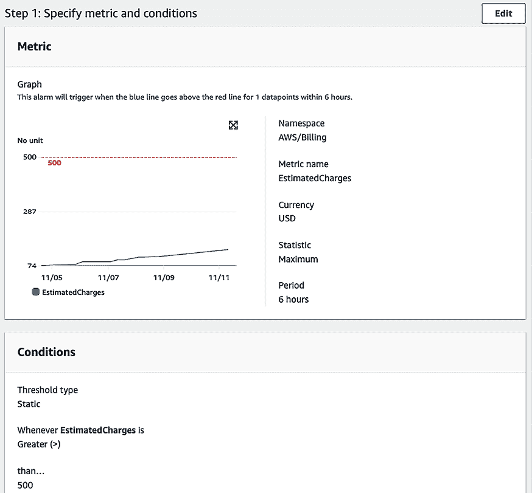

# 10

# 成本考虑

在上一章中，你了解了运营卓越和使用自动化来优化后期生产操作，从而减少人为错误、提高效率，并最终实现成本节约。优化架构的成本是维持高效且可持续 IT 环境的重要方面。这包括理解和管理你的应用所消耗的资源，确保你只为所需的内容付费。在本章中，我们将探讨多种成本优化策略，包括资源的适当配置、选择合适的定价模型以及使用预算和成本管理工具。

每个企业的主要目标之一是提高盈利能力，同时服务客户。项目启动时，成本是一个至关重要的讨论话题。应用程序升级和新产品功能的添加在很大程度上依赖于可用资金。产品的成本是每个人的责任，必须在产品生命周期的每个阶段（从规划到后期生产）加以考虑。本章将帮助你理解优化 IT 解决方案和运营成本的最佳实践。

**成本优化**是一个持续的过程，需要谨慎管理而不牺牲客户体验。成本优化并不意味着降低成本，而是通过最大化**投资回报率**（**ROI**）来降低商业风险。在规划任何成本优化策略之前，你需要了解客户的需求，并据此行动。通常，如果客户追求质量，他们愿意支付更高的价格。

在本章中，你将学习关于你解决方案的成本优化的各种设计原则。成本方面需要在架构的每个阶段和组件中加以考虑。你将理解如何在每一层优化成本的正确技术选择。在本章中，你将学习以下成本优化的最佳实践：

+   成本优化设计原则

+   理解成本优化的技术

+   在公共云中推动成本优化

+   绿色 IT 及其对成本考虑的影响

到本章结束时，你将了解各种优化成本的技术，而不会危及业务敏捷性和成果。你将学会如何监控成本并应用治理来进行成本控制。首先，让我们从成本优化的设计原则开始，这将为构建成本意识架构打下基础。

# 成本优化设计原则

成本优化包括提高业务价值和最小化风险，同时减少业务成本。你需要通过估算预算和预测支出来规划你的应用成本。为了实现成本节约，你需要实施成本优化计划，并密切监控支出。

有几个原则可以帮助你实现成本优化；常见的设计原则将在以下章节中讨论。你会发现，所有的成本优化设计原则是紧密相关并相互补充的。让我们来看看这些原则。

## 计算拥有总成本

通常，组织往往忽视**拥有总成本**（**TCO**），并基于获取软件和服务的前期成本做出决定，这一成本被称为**资本支出**（**CapEx**）。虽然前期成本的确定至关重要，但在长期来看，TCO 才是最重要的。TCO 包括 CapEx 和**运营支出**（**OpEx**），涵盖了应用生命周期的各个维度。CapEx 成本指组织为获取服务和软件而支付的前期费用，而 OpEx 包括软件应用的运营、维护、培训和退役成本。在计算长期的 ROI 时，考虑 CapEx 和 OpEx 成本有助于做出更具战略性的决策。

例如，当你购买一台全天候运行的冰箱时，你会关注节能评级以保持电费低廉。你愿意支付更高的前期价格，因为你知道，由于节省电费，随时间推移的总成本会较低。现在，让我们以数据中心为例。数据中心有前期的硬件获取成本（CapEx）。然而，数据中心的搭建还需要额外的持续成本（OpEx），包括供暖、制冷、机架维护、基础设施管理、安全等。

对于典型的使用案例，当你购买并实施软件时，考虑以下成本来计算 TCO：

图 10.1：IT 应用的 TCO

让我们更详细地看看。每个 TCO 组成部分都有以下常见成本，适用于*现成*软件，例如 Oracle 或 MS SQL 数据库：

现成软件是指预构建的、大规模生产的应用程序，旨在满足具有相似需求的大众群体，而不是为特定业务或用户量身定制的定制软件。

+   **购买和设置成本**：这些是获取软件和部署服务的前期成本。包括以下内容：

    +   软件成本包括软件购买价格和用户许可证

    +   硬件成本包括购买服务器和存储设备以部署软件

    +   实施成本包括使软件准备好投入生产所需的时间和精力

    +   迁移成本包括将数据迁移到新系统

+   **运营和维护成本**：这些是持续的成本，用于保持软件在业务使用案例中的正常运行，包括以下内容：

    +   软件维护和支持

    +   修补和更新，软件供应商经常发布这些更新来修复潜在的 bug

    +   定制增强功能，以适应软件对组织需求的要求

    +   数据中心维护硬件服务器的成本

    +   安全性

    +   许可证续订

+   **人力资源和培训成本**：这些是用于培训员工使用软件以满足业务活动的间接费用。包括以下成本：

    +   应用程序管理员

    +   IT 支持人员

    +   功能和技术顾问

    +   培训和培训工具

为了优化成本，您有多种选择，包括订阅**软件即服务**（**SaaS**）产品，例如 Salesforce 的**客户关系管理**（**CRM**）平台。SaaS 模式通常是按用户订阅的方式，因此需要评估是否达到了预期的成本节省。对于大量用户，您可以采用混合模式，通过选择**基础设施即服务**（**IaaS**）选项并安装现成软件，利用云服务来处理硬件。总的来说，如果软件不能满足需求，您可以自己开发。在任何情况下，都要计算 TCO（总拥有成本），以决定在哪些地方实现最大化的投资回报率（ROI）。让我们看看预算和预测的规划，它可以帮助控制总成本并实现 ROI。

## 预算和预测的规划

每个企业都需要规划开支并计算投资回报率（ROI）。预算规划为组织和团队提供了成本控制的指导。组织制定长期预算，通常为 1 至 5 年，帮助他们根据所需资金来运营业务。预算随后会细化到每个具体项目和应用程序。在解决方案设计和开发过程中，团队需要考虑可用的预算并做相应规划。预算帮助量化业务希望实现的目标，而预测则提供了公司当前实际运营的估算。

预算规划是长期战略规划中非常重要的一部分，预测则提供了一个在更具战术性层面上的估算，帮助决定业务方向。在应用开发和运营中，如果没有预算和预测，企业可能会迅速失去方向并超出预估成本。这两个术语可能会让人困惑，下面我们来澄清预算和预测的区别：

| **方面** | **预算** | **预测** |
| --- | --- | --- |
| 定义 | 一份详细的财务计划，概述特定时期内预期的收入、支出和资源分配。 | 基于当前趋势和短期预期的公司财务表现更新预测。 |
| 时间框架 | 通常设置为长期，比如按年度。 | 更具动态性；定期更新（每月或每季度）。 |
| 调整频率 | 不经常调整，可能一年调整一次，或者在重大变更时进行调整。 | 根据实际业务进展和短期展望定期更新。 |
| 目的 | 用于指导业务决策、战略规划和资源分配。 | 用于根据最近的趋势和预测做出知情的操作决策和调整。 |
| 性能评估 | 用于通过比较计划与实际成本和收入来确定性能。 | 通常不用于对目标进行性能评估，而是用于了解潜在的未来财务状况。 |
| 示例 | 决定组织重组、规划年度营销支出和设定年度销售目标。 | 根据近期表现调整员工配置、修改营销策略和更新收入预期。 |

表格 10.1：预算与预测对比

预测信息帮助您立即采取行动，而预算可能因市场变化而变得不可实现。如下面的图示所示，当您在处理日常解决方案时，基于历史支出预测的开发可能会促使您调整下个月的成本：

图 10.2：预测报告

如前所示的*成本与使用*预测报告所示，如果您的月度预算为$450，您将在 2024 年 11 月底前达到预算。这里，预测帮助您采取行动并控制成本，以保持在预算范围内。

在下一节中，让我们看看通过管理需求和服务来提高成本效率的机制。

## 管理需求和服务目录

几乎每个组织都有一个集中的 IT 团队，该团队与内部业务合作伙伴（如各业务单元的应用开发和支持团队）合作。IT 团队管理 IT 基础设施的需求，包括所有软件和硬件的成本及应用托管支持的管理。业务合作伙伴通常需要更深入地了解其 IT 服务的成本驱动因素。例如，应用开发团队倾向于过度配置其开发或测试环境，导致额外的成本。

您可以提前从各个组织单元获取需求预测，这有助于您更好地协调整个组织的 IT 基础设施供应。通过将所有需求集中在一个地方，组织可以从规模经济中受益。您可能会通过大型合同实现更高的规模经济，从而获得更低的可变成本。通过将所有组织单元的需求聚合在一起，可以实现更低的价格。

例如，在利用公共云服务如 AWS、GCP 或 Azure 时，企业有机会通过**私人定价协议**（**PPAs**）或**企业折扣计划**（**EDPs**）获得更有利的定价。这些协议对那些通过将资源集中在单一云服务提供商下，承诺更大工作负载的组织尤其有利。通过承诺一定水平的使用或支出，企业可以谈判更低的价格，从而实现显著的成本节约。

组织可以采取以下两种方法之一来管理需求和服务：

+   **需求管理**：为了在现有 IT 环境中节省成本（如果你发现过度支出的现象普遍存在），你可以采取*以需求为主导的方法*。这种方法有助于在短期内提高成本效率，因为你可以引入一些新服务。你可以分析历史数据，了解推动需求的因素，并捕捉过度配置的情况。建立 IT 团队与业务伙伴之间的流程，以精简 IT 服务的运营成本。

+   **服务目录管理**：如果有对新服务的需求且没有太多历史数据，你可以采取*以服务为主导的方法*。在这种方法中，你需要了解最常用服务的需求并创建一个目录。例如，假设开发团队请求一台带有 MySQL 数据库的 Linux 服务器来创建开发环境，在这种情况下，IT 团队可以创建一个服务目录，帮助开发团队获取一台小型 Linux 服务器和一台数据库服务器。类似地，IT 团队可以识别最常用的一组服务，并附加一个详细的成本。

每种方法都可以在短期和长期内实现显著的成本节省。然而，这些转型带来了巨大的挑战，因为你需要改变项目规划和审批流程。业务和财务团队需要对齐并理解业务增长与增加的 IT 能力之间的明确关系。成本模型需要围绕最有效的方法构建，通过结合云、内部部署和现成的产品。

## 跟踪支出

你可以通过跟踪支出并将其与系统或业务所有者关联来找到各个系统的成本。透明的支出数据有助于识别投资回报率（ROI）并奖励所有者，优化资源并降低成本。它可以帮助你确定一个部门或项目的月度成本。

节省成本是共同的责任，你需要有一个机制来让每个人都对其负责。通常，组织会引入**展示式回溯（show-back）**或**费用回溯（charge-back）**机制，在组织单元之间分担成本责任。

集中账单账户通过**展示式回溯（show-back）方法**告知每个组织单元其支出，但不收取实际费用。在**费用回溯（charge-back）方法**中，组织内的每个业务单元在主支付账户下管理其预算。主账户根据业务单元的月度 IT 资源消耗将费用回溯到各个业务单元。这些方法使得每个组织单元在支出上更具成本意识和责任感。

在为组织实施成本控制时，最好从展示式回溯开始作为踏脚石，然后随着组织模型的发展逐步过渡到费用回溯。

对于每个业务单元，你应该通过配置通知来提高开支意识，使团队在接近预期或预算消费金额时能够收到警报。创建机制，通过将开支合理分配到正确的业务计划，来监控和控制成本。为每个团队提供可见性，以创建对成本开支的责任感。成本追踪将帮助你了解团队的运营。

每个工作负载都是不同的；你应该使用适合你工作负载的定价模型来最小化成本。建立机制，确保通过应用成本优化的最佳实践来实现业务目标。你可以通过定义标签策略，将业务单元与特定开支关联起来，避免超支，并采用**制衡**方法。

## 持续的成本优化

如果你遵循成本优化的最佳实践，你应该能够与现有的活动进行良好的成本比较。随着时间的推移，减少迁移和成熟应用的成本是始终可能的。成本优化不应结束，直到识别节省资金机会的成本超过你将节省的金额为止。在达到这个点之前，你应该持续监控开支，并寻找节省成本的新方法。你应该不断寻找通过移除闲置资源来节省成本的机会。例如，考虑一个场景，其中一家公司在其开发、测试和生产环境中使用云服务。通过持续监控其云开支，该公司发现开发环境中的一些实例在非高峰时段依然处于低利用率或闲置状态。为了节省成本，该公司实施了一种计划，在实例未被使用时自动关闭它们，例如在夜间和周末。通过这种方式，它们大大减少了云开支，因为只在资源被积极使用时才支付费用。随着时间的推移，识别和消除闲置资源的做法可以带来显著的成本节省，使公司能够更有效地分配预算。

对于在成本和性能方面平衡的架构，确保为资源支付的费用得到充分利用，避免出现显著低利用率的 IT 资源，如服务器实例。

一个偏倚的利用率指标，如果显示异常高或低的成本，将对你组织的业务造成伤害。当组织在评估利用率指标时未考虑上下文时，可能会导致偏颇的解读和决策。例如，基于电子商务网站如黑色星期五等高峰时期的数据来进行基础设施配置，可能导致严重的资源过度配置。在较为清闲的时段，这会导致资源的严重低利用率，这样是成本低效的。必须在正确的上下文中分析这些指标，以避免此类问题，并确保资源的配置与实际需求一致，而不仅仅是根据高峰或非常规使用期间的需求。这种方法可以避免不必要的支出，支持更具战略性和有效的成本管理。

在考虑应用层面的指标以进行成本优化时需要特别小心。例如，制定归档策略以控制数据存储容量。为了优化数据库，你应该检查是否有适当的数据库部署需求，比如数据库是否需要进行多地部署，或者根据你的数据库利用率需求，是否需要预配置**每秒输入/输出操作数**（**IOPS**）。你还可以使用 SaaS 模型帮助员工专注于应用程序和业务活动，从而减少行政和运营的开销。

为了识别差距并实施必要的变更以节省成本，你应该在项目生命周期中实施资源管理和变更控制流程。其目的是帮助你的组织尽可能优化和成本效益地设计架构。不断寻找能够直接减少成本的新服务和新功能。

在本节中，你探讨了旨在优化成本的各种设计原则，从有效的预算规划到积极的成本监控和持续的节省成本策略。这些原则对于确保你的架构不仅满足性能和操作要求，而且与财务目标保持一致至关重要，从而使你的组织能够最大化投资的价值并最小化不必要的开支。让我们学习一些能够帮助你优化成本并提高投资回报率的技巧。

# 理解成本优化的技巧

企业正在加大对技术的投资，以获取竞争优势并跟上快速增长的步伐。在经济不稳定的情况下，成本优化成为一项既必要又具有挑战性的任务。公司花费大量时间在采购、运营和供应商方面进行研究并降低成本。许多公司甚至共享数据中心、呼叫中心和办公空间，作为节省成本的一种方法。有时，组织需要更多时间进行升级，以避免购买新的、昂贵的硬件。

组织通过审视整个 IT 架构可以节省更多的成本。改善现有架构能够为公司带来更多的机会和业务，即使这需要对预算进行一些调整。让我们确定一些关注领域，通过迁移到云端、简化架构、虚拟化和共享资源等技术帮助公司节省开支并获得更多收入。

## 降低架构复杂性

组织通常需要一个集中的 IT 架构，导致每个业务单元都试图建立自己的工具集。缺乏整体控制会导致大量重复的系统和数据不一致。个别业务单元的 IT 项目往往是由短期目标驱动的。

在这种情况下，业务单元需要与长期的组织愿景更加对齐，例如整个组织的数字化转型。此外，这也增加了维护和升级这些系统的复杂性。定义标准并避免重复的简单步骤有助于节省成本。

下图展示了左侧的复杂架构，业务单元在没有标准化的情况下各自进行应用，导致了许多依赖关系的重复应用——这种架构会导致高成本和高风险。任何新的实验都需要较长的时间才能投入市场，最终失去竞争优势。流程标准化、可复用架构模式的开发以及一整套共享服务的建立共同提供了一个全面且灵活的框架，支持敏捷环境的运行。通过在该框架内应用自动化，组织可以简化操作，避免重复劳动，并大幅降低成本。这种整体性的方法不仅提升了运营效率，还提高了投资回报率（ROI），展现了架构实践与业务目标之间的战略对齐，以实现最佳的财务表现。

图 10.3：架构标准化

首先需要消除重复，识别业务单元之间的功能复用，从而减少架构复杂性。将所有这些可复用的组件跨组织整合到服务目录中，可以显著提升可访问性和效率。服务目录作为一个集中的存储库，团队可以在其中找到并利用预定义的架构模式、服务和资源。在现有架构的*差距分析*过程中，你会发现有很多代码、许多现有组件，以及一个可以跨组织重用的项目，以支持你的业务需求。为了减少 IT 架构的复杂性，可以考虑一种符合业务需求并提供 ROI 的现成解决方案。如果没有其他选择，定制化应是最后的选择。

任何新应用都需要有一个可访问的集成机制，以便使用**RESTful 架构**与现有系统进行交互。统一应用程序的 UI 设计提供了一套标准 UI 包，可以在任何新应用中重用。

同样，其他模块可以通过面向服务的设计进行再利用。你在*第四章*中学习过 RESTful 模式，*解决方案架构设计模式*；这些有助于保持不同的软件组件单独运行，同时能够相互通信，构建整个系统。

在模块化方法中，每个团队负责开发一个所有团队都可以使用的服务，以避免重复工作。作为架构师，您应帮助团队创建面向服务的设计，每个团队将各自的架构组件作为服务进行处理，且这些服务可以独立开发。在微服务架构的帮助下，您可以模块化地部署整个应用程序。如果某个组件出现问题，可以重新开发该组件，而不影响整个应用程序。例如，开发一个用于从访问电子商务网站的客户处收款的支付服务，也可以用于在供应商管理系统中支付供应商费用。

一旦你建立了集中化的 IT 架构，采取模块化的方法有助于降低成本。赋能你的 IT 架构团队可以帮助将组织单位与公司的愿景对齐，并支持其他并行项目遵循整体战略。它还帮助提供在其他常被忽视的关键服务中的一致性，如法律、会计和人力资源。

在 IT 架构团队的帮助下，你可以获得优秀的反馈，确保项目与业务需求和要求对齐。通过监督跨团队的整体架构，架构师可以建议是否有重复的工作、项目、流程或系统需要与业务需求对齐。集中化的架构将减少复杂性和技术负担，带来更多的稳定性，并提高质量。集中化架构的整体理念是提高 IT 效率，因此让我们深入了解这一点。

## 提高 IT 效率

现在，每个公司都在使用和消耗 IT 资源。拥有过多的服务器、笔记本电脑、软件许可证以及高存储容量会消耗大量资金。许可证是有时被低估、未发现、闲置或安装不当的资源，且会消耗大量资金。一个集中的 IT 团队可以领导许可证优化工作，通过跟踪已使用的软件许可证并退役多余的许可证来节省成本。他们还可以通过与供应商谈判批量折扣来节省费用。

为了提高 IT 效率，应取消那些需要额外资金和资源的非合规项目。同时，您还应帮助团队重新审视策略，以支持或持续终止未使用和不对齐的项目。

以下方法可以用于成本优化：

+   重新评估高成本项目，因为它们可能需要更好地与业务愿景对接。重新塑造那些高价值但对 IT 战略没有直接影响的项目。

+   降低那些即使与 IT 战略一致但几乎没有商业价值的项目的优先级。

+   取消低商业价值且不合规的项目。

+   停用或退役不再使用的应用程序。

+   通过现代化替换旧的遗留系统，以降低维护成本。

+   通过重新利用现有应用程序来避免重复项目。

+   在可能的情况下，整合数据并开发集成数据模型。你将在*第十二章*，*解决方案架构的数据工程*中了解如何维护集中式数据湖。

+   在组织内整合供应商采购，以节省 IT 支持和维护开支。

+   整合所有执行支付和访问管理相同功能的系统。

+   消除昂贵、浪费和过度配置的项目和支出。

迁移到云端是提高 IT 资源效率和降低成本的一个优秀选择。公共云提供商，如**亚马逊网络服务**（**AWS**），提供*按需付费*模式，这意味着你只需为实际使用的部分付费。例如，开发者的桌面可以在非工作时间和周末关闭，从而将工作空间的成本降低高达*70%*。

批处理系统只需要启动以处理任务，处理完后可以立即关闭。这就像任何不需要时关闭的电器一样，以节省电费。

应用自动化是提高整体 IT 效率的一个很好的机制。自动化帮助消除昂贵的人力劳动，减少执行日常工作所花费的时间，并避免出错。尽可能自动化，进行服务器配置、监控任务和数据处理。

在决定优化成本时，确保做出合适的权衡以改善结果。举个例子，如果你去一个主题公园，想要玩很多好玩的项目，你会愿意支付更高的价格来感受你的消费价值。为了吸引更多顾客，如果供应商决定通过减少好玩的项目数量来降低价格，你可能会选择去另一个主题公园，因为你追求的是愉快的体验。在这种情况下，竞争者会占据优势并吸引现有客户，而当前的供应商则会失去业务。此时，降低成本带来了商业风险，这不是正确的成本优化方法。

您的目标应该是可衡量的，这些衡量标准应同时关注业务输出和系统成本。量化的指标有助于您了解增加输出和降低成本的影响。组织级和团队级的目标必须与应用程序的最终用户对齐。在组织层面，目标将跨越组织的业务单元。在团队层面，目标则会更加与单个系统对齐。例如，您可以在业务单元级别设定目标：每个季度降低 10%的每交易成本，或每六个月降低 15%。定义目标确保系统在其生命周期中得到改善。让我们来看一下如何应用标准化和治理。

## 应用标准化和治理

组织需要制定策略来分析不一致性和过度消耗，减少复杂性，定义使用合适且高效系统的指南，并在需要的地方实施流程。创建并实施这些指南将帮助公司开发标准化的基础设施，减少重复项目和复杂性。

要实现治理，您必须在整个组织中设置资源限制。通过实施**基础设施即代码**（**IaC**）服务目录，有助于确保团队不会因资源超出分配的容量而过度配置。您应该有一个机制，能够快速理解并采取行动应对业务需求。在应用资源限制和定义更改流程时，考虑资源的创建和退役。

使用 IaC，整个基础设施设置，包括网络、服务器、数据库和应用服务，可以通过像 YAML 或 JSON 这样的编程语言在代码文件中定义。然后，这些文件可以进行版本控制，使团队能够追踪变更、回滚到先前的配置，并在不同环境之间应用相同的配置，确保一致性并减少配置漂移。像 Terraform、AWS CloudFormation 和 Ansible 等流行工具支持 IaC，允许团队定义 IaC 并应用这些定义来创建或更改基础设施。

企业由多个团队运营各种应用程序。这些团队可能隶属于其收入来源内的不同业务单元。确定资源成本对于应用程序、业务单元或团队有助于推动高效的使用行为，并帮助降低成本。您可以根据成本归属以及小组、组织单元或部门的需求定义资源容量。您可以使用资源标签和账户结构来组织成本结构。

如下图所示，您可以将账户组织到不同的**组织单元**（**OUs**）中，例如人力资源（HR）和财务（Finance），而每个组织单元下的部门可以拥有自己的账户。例如，在此，**人力资源**有单独的账户用于**薪资**和**市场营销**，而**财务**则有单独的账户用于**销售**和**市场营销**：

图 10.4：面向组织单位的企业账户结构

你可以在前述账户结构策略中控制每个业务单元和部门层级的成本。为每个部门采用费用追溯机制可以在更精细的层级增加对成本的问责制，从而有助于优化成本。

账户结构帮助你在整个组织中应用高安全性和合规性标准。由于每个账户都与父账户关联，你可以通过合并整个组织的支出来显著处理供应商资源的大规模使用。

### 资源成本标签

几乎每个公共云服务提供商都提供开箱即用的标签功能。你可以嵌入服务器元数据，如 DNS 名称或主机名，适用于本地部署。标签有助于你组织成本，并定义容量限制、安全性和合规性。它是库存管理的一个优秀工具，能够随时关注组织各级对资源日益增长的需求。

资源标签是管理和优化云计算环境中成本的强大策略。它涉及将元数据标签分配给云资源，如虚拟机、存储实例或数据库，以根据项目、环境、部门或成本中心等不同标准对其进行分类和跟踪。

如下图所示，为了实现跨资源的完整成本可视化和合并，你可以在团队层级为每个资源添加标签，从而提供更精细的控制：

图 10.5：用于成本可视化的资源标签

在上面的示意图中，你可以看到标签策略，显示给定的服务器是用于应用部署的，并且由开发团队使用。财务业务单元的市场营销部门拥有这台服务器。通过这种方式，组织可以获得精细化的成本支出可视化，团队在支出上会更加节俭。然而，你可以在团队层级采用“展示式”机制，在部门和业务单元层级采用“费用追溯”机制。

你可以定义标签机制，其中可以为任何资源附加名称和值，如资源名称和拥有者名称。以下截图展示了按 **aws:createdBy** 标签排序的成本，这有助于确定 AWS 自动创建的每个资源的成本：

图 10.6：成本标签的资源支出仪表盘

商业领导者应评估整体需求，以创建高效的 IT 架构。需要协作来开发健全的 IT 架构，并在各职能团队之间定义治理框架，以建立问责机制。同时，还应建立标准来审查架构，为任何新项目倡议创建基准，并解释过程以确保系统符合正确的架构，并识别改进路径。

让所有受影响的利益相关者参与到使用和成本讨论中。首席财务官（CFO）和应用程序所有者必须了解资源消耗和购买选项。部门负责人必须了解整体商业模式和每月账单流程。这将帮助为业务单元和整个公司设定方向。

确保第三方供应商与你的财务目标保持一致，并能够调整其参与模式。供应商应提供其拥有和开发的任何应用程序的成本分析。组织内的每个团队都应能够将管理层的业务、成本和使用因素转化为系统调整，帮助应用程序实施并实现公司的预期目标。

## 监控成本使用和报告

准确的成本因素帮助你确定业务单元和产品的盈利能力。成本追踪帮助你将资源分配到合适的地方，从而提高投资回报率（ROI）。理解成本驱动因素有助于你控制业务支出。

为了优化成本，你必须了解组织内的支出模式。你需要洞察 IT 支出的历史变化，以确定节省成本的机会。通过创建成本趋势的可视化报告，你可以采取必要的优化措施，并了解其影响，报告将显示按资源和部门划分的历史成本和预测数据。

你的团队需要通过记录所有数据点来收集数据，使用监控工具进行分析，并创建可视化报告。

你需要详细了解工作负载资源的使用情况，以识别节省成本的机会。成本优化依赖于你预测未来支出的能力，并实施方法使成本和使用情况与预测对齐。以下是你应该在数据可视化方面关注的主要领域：

+   确定资源的最重大投资

+   分析并了解你的支出和使用数据

+   预算和预测

+   当你超过预算或预测的阈值时，接收警报

以下报告显示了 AWS 在六个月内的资源支出。可视化图表显示，云计算服务器**EC2**（在每个月的第五根橙色条形图中表示）从 2023 年 5 月至 2023 年 7 月期间消耗了最高的成本。由于业务单元能够看到持续高成本，系统管理员被提示深入查看成本优化并寻找空闲资源。管理员通过停止这些 EC2 服务器进行了清理，从而在 8 月降低了成本，并从 9 月起完全消除了该成本：

图 10.7：按服务分类的资源成本和使用报告

前述报告帮助业务负责人了解成本模式，并采取反应式成本控制方法。反应式方法导致了隐藏成本，这些成本在特定时间内未被发现。通过主动方法，预测帮助业务负责人提前做出决策。

以下报告展示了用实心条表示的每月成本支出和用空心条表示的预测支出以及估算范围。通过查看报告，你可以看到未来几个月成本可能增加，进而可以采取措施理解成本属性并控制成本：

图 10.8：成本趋势和成本预测报告

监控成本与预算的对比可以为你提供另一个主动控制成本的手段。当支出达到预算的某个比例（如 50%或 80%）时设置警报，有助于你审查并调整持续的成本。

在以下报告中，你可以直观地判断当前成本与预算成本的对比，预算成本在一年前很高。根据以下报告，IT 管理员可以采取措施优化成本，并将其控制在月度预算范围内。

图 10.9：成本和预算报告

成本和预算报告通过采取主动行动帮助你控制成本。将实际运行成本与预算和预测结合起来，为你提供了每日成本控制的极大帮助。

你还可以在实际成本达到预算或预测中的某个阈值时设置警报，这样可以通过电子邮件或短信主动提醒你采取措施控制成本。

以下截图显示，当估算成本超过$500 时，已经设置了警报。你可以设置多个警报，获取当成本达到例如$300 或$400 时的通知：

图 10.10：基于实际成本的警报

控制成本的一种方式是通过资源监控对环境进行调整，并触发过度或不足利用的警报。可以使用**Splunk**或**CloudWatch**等监控工具以及自定义日志来进行资源分析，通过监控系统的应用内存利用率等自定义指标来执行调整规模。低资源利用率可以作为识别成本优化机会的标准。例如，CPU 利用率、RAM 利用率、网络带宽和应用程序的连接数可以进行分析和监控。

在调整环境规模时，必须小心确保不会影响客户体验。以下是执行调整规模时应遵循的最佳实践：

+   确保监控反映终端用户的体验。选择正确的时间段。例如，性能指标应涵盖 99%的用户请求响应时间，而不是取平均响应时间。

+   选择正确的监控周期，如每小时、每天或每周。例如，如果你每天进行分析，可能会错过每周或每月的高使用周期，导致系统配置不足。

+   评估变更的成本与节省成本的对比。例如，你可能需要进行额外的测试或调用资源进行尺寸调整。这种成本效益分析将帮助你合理分配资源。

+   根据业务需求识别应用程序的使用情况。例如，查看预计在本月底或高峰季节期间会有多少用户请求。识别并优化利用差距可以帮助节省成本。为此，使用适当的工具，涵盖从节省成本到系统利用率，再到由于变更对客户体验的影响的各个维度，然后利用报告来了解因成本变化而对业务 ROI 的影响。公有云遵循不同的成本模型，通常是按需付费的结构。

在使用云资源时必须非常谨慎，因为每一秒钟都会计入成本，如果忽视了成本优化和监控，可能会造成高昂费用。让我们深入了解公有云中的成本优化。

# 推动公有云中的成本优化

公有云，如**AWS**、**Microsoft Azure**和 GCP，提供了出色的成本优化，采用*按需付费*模型。此模型允许客户用变动费用替代资本支出，按使用量支付 IT 资源费用。由于规模经济，运营支出通常较低。处于云环境中，并受益于持续的价格下降，通常是具有成本效益的。另一个优势是，你可以立即使用云服务提供商如 AWS 所提供的额外工具和功能，从而帮助你提高敏捷性。

在定义云成本结构模型时，你需要一种不同的思维方式，因为它不同于大多数企业几十年来遵循的传统成本模型。云中有你触手可及的所有基础设施，这要求你进行更大的控制和规范化。云提供了多种成本治理和常规化工具。例如，在 AWS 中，你可以为每个账户设置服务限制，以防开发团队使用超过 10 台服务器，而生产环境可以根据需要设置服务器和数据库的数量，并留有缓冲空间。

所有资源都与云中的账户关联，因此可以轻松地在一个地方跟踪 IT 资源的库存并监控其使用情况。除此之外，你还可以获得跨多个 IT 资源收集数据并提供建议的工具。如以下截图所示，**AWS Trusted Advisor**会遍历账户中的所有资源，并根据资源使用情况提供节省成本的建议：

图 10.11：AWS Trusted Advisor 的节省成本建议

在前面的截图中，AWS Trusted Advisor 发现一个闲置的负载均衡器，并建议关闭它，以节省每月最高达 40 美元的成本。进一步检查发现一个 Lambda 函数的错误率较高，需修复该函数以减少成本。

云计算可以为节省成本提供出色的价值主张。首先，你可以创建一个混合云，通过在本地数据中心和云之间建立连接，来实现资源共享。你可以将开发和测试服务器迁移到云端，以便确定成本结构和潜在的节省空间。一旦在云中建立了成本治理，就可以根据成本效益分析，迁移更多的工作负载。不过，你需要评估自己的工作负载，并判断它是否适合迁移到云端，如果适合的话，还需制定相应的策略。你在*第三章*，*云迁移与混合云架构设计*中学习过云迁移。

越来越多的公有云提供商提供托管服务，消除了基础设施维护成本以及告警和监控配置的管理开销。托管服务通过减少服务采用过程中成本，从而降低总拥有成本。

公有云提供储蓄计划或预留实例，允许组织承诺一定的使用量，以换取比按需计费更低的价格。通过分析资源使用数据，组织可以做出明智的决策，购买这些计划，并根据实际使用模式来调整承诺，从而最大化成本节省。

将储蓄计划纳入云成本优化策略，能够帮助组织在灵活性和成本效益之间找到平衡。它们可以保留按需付费模式在处理变化工作负载时的敏捷性，同时通过储蓄计划在处理可预测、稳定的使用时获得成本节约，从而确保有效优化云支出。

绿色 IT 指的是计算机及其资源的环保使用。它包括减少能源消耗、减少电子废料以及设计低能耗的数据中心等实践。让我们深入了解它。

# 绿色 IT 及其对成本考虑的影响

绿色 IT，也称为绿色计算，指的是环境可持续的计算或 IT。它是使用计算机和 IT 资源的效率更高、更加环保的研究和实践。绿色 IT 实践可以通过多种方式显著影响成本考虑：

+   **能源效率**：利用高效能的硬件和实践可以减少数据中心和 IT 基础设施的电力消耗，从而显著节省电费。例如，使用能源之星认证的设备或优化数据中心的布局以提高冷却效率，可以降低能源账单。

+   **虚拟化**：虚拟化服务器和存储可以减少对物理硬件的需求，从而降低能源消耗和冷却成本，并最小化数据中心所需的空间。

+   **云计算**：迁移到云服务相比维护本地数据中心可能更加节能。云服务提供商通常拥有规模经济效应，并且拥有更现代、高效和环保的数据中心。这可以转化为较低的电力和冷却成本，并减少碳足迹。

+   **硬件回收与再利用**：正确的 IT 设备回收和再利用可以节省成本。公司可以通过回收或出售旧设备来收回部分初期投资。此外，购买翻新硬件比购买全新的硬件要便宜得多。

+   **远程办公**：推广远程工作减少了对办公空间的需求、能源消耗和员工通勤成本。这不仅为组织和员工带来直接和间接的成本节省，同时也有益于环境。

+   **电子文档管理**：通过电子文档管理系统减少纸张使用，可以节省纸张、打印和存储成本，同时带来减少纸张浪费的环境效益。

+   **可持续 IT 采购**：选择优先考虑可持续性的供应商和产品可以带来长期的成本节省。设计更加耐用或具有更长保修期的产品可能有更高的初期成本，但随着时间的推移，其总拥有成本较低。

+   **维护优化**：定期维护和更新可以延长 IT 设备的使用寿命，推迟昂贵的替换需求，并减少电子废弃物。

+   **IT 资产处置**：高效管理 IT 资产处置可以降低废物管理成本，并确保符合环保法规，避免潜在的罚款。

+   **碳信用**：通过绿色 IT 实践减少碳排放，组织可以获得碳信用，这些信用可以出售或交易，提供潜在的收入来源或碳税节省。

绿色 IT 通过减少能源消耗、最小化废物、优化设备使用和提高整体可持续性，能够为组织带来显著的成本节省。这些节省通常能抵消实施绿色 IT 计划所需的初期投资。让我们看看像 AWS 这样的云服务提供商如何帮助改善你的绿色 IT 态度。

## 在 AWS 上进行具有成本效益且环保的应用托管

一个涉及 AWS 的绿色 IT 使用案例可能会集中在利用 AWS 的云基础设施来实现环境和成本效益。AWS 提供了支持绿色 IT 计划的服务，如无服务器架构、能源高效的数据中心和资源优化工具。AWS 一直积极支持绿色 IT 和可持续性目标，通过各种计划和服务帮助客户减少碳足迹并优化能源使用。

AWS 启动了一个客户碳足迹工具，如下图所示。该工具提供了历史碳排放数据的可视化、AWS 使用过程中碳排放趋势、使用 AWS 替代本地数据中心所避免的碳排放量，以及基于当前使用情况的预测碳排放量。

图 10.12：碳足迹报告

上述报告显示了过去两年的碳足迹，包括碳排放消耗和节省情况。随着 AWS 计划到 2025 年实现 100% 可再生能源，并在 2040 年实现碳中和，碳足迹将发生变化。

AWS 已经建立了关于构建可持续架构的全面指导。你可以通过访问 AWS Well-Architected Framework 的可持续性支柱页面来获取更多细节：[`docs.aws.amazon.com/wellarchitected/latest/sustainability-pillar/sustainability-pillar.html`](https://docs.aws.amazon.com/wellarchitected/latest/sustainability-pillar/sustainability-pillar.html)。

假设你计划部署一个预期会有不稳定流量的新 web 应用。你可以通过以下步骤，旨在优化成本并遵循绿色 IT 原则：

1.  **规划与设计**：

    +   由于 AWS 致力于可持续性并且其基础设施具有能源效率，公司决定使用 AWS。

    +   他们选择了使用 AWS Lambda 进行计算的无服务器架构，这使得他们能够在不配置或管理服务器的情况下运行代码。这一选择具有成本效益并且环保，因为它消除了对未充分利用服务器的需求。

1.  **实施**：

    +   Web 应用程序的前端通过 Amazon S3 托管，并通过 Amazon CloudFront 在全球交付，减少了延迟并通过使用靠近用户位置的能源高效数据中心来提供视频和图像等内容，从而最小化了为最终用户提供服务所需的能源。

    +   应用程序的后端基于 AWS Lambda 和 Amazon DynamoDB 构建，提供了一个无服务器数据库解决方案，可以自动扩展以适应工作负载。

1.  **优化**：

    +   为了实现持续集成和部署，使用了 AWS CodePipeline 和 AWS CodeBuild，这有助于避免维护专用构建服务器的额外开销。

1.  **监控与管理**：

    +   AWS CloudWatch 监控应用程序的性能和资源利用率，确保高效运行。

    +   应用 AWS Trusted Advisor 的建议，以进一步优化成本并确保公司使用最有效的资源。

1.  **成本管理**：

    +   公司使用 AWS 预算设置成本阈值，并在其成本可能超过预算时收到警报，从而使其能够主动调整使用情况。

    +   他们使用 AWS 成本探索器来分析和了解他们的 AWS 支出和使用情况，从而确保持续的成本优化。

公司通过利用 AWS 的无服务器服务和资源优化工具，成功地部署了可扩展且具有成本效益的 Web 应用程序。他们通过利用 AWS 节能的全球基础设施，仅在需要时消耗计算能力，遵循绿色 IT 原则，从而减少了碳足迹。此外，AWS 服务的按需定价模型确保他们仅为所消费的资源付费，优化了成本和能源使用。

AWS 可以促进绿色 IT 实践，允许您部署一个可扩展的高性能 Web 应用程序，同时关注环境影响和运营成本。AWS 的无服务器产品和高效的资源管理与公司成本优化和可持续发展的目标相一致。

# 总结

成本优化是一个持续的努力，从应用程序的开始（从概念验证到实施和生产后）就要进行。您需要不断审视架构和节省成本的努力。

在本章中，您了解了优化成本的各种设计原则。在做出任何采购决策之前，您应该考虑整个软件或硬件生命周期的总拥有成本。预算规划和跟踪预测帮助您保持成本优化的路径。始终跟踪支出，并通过管理需求在不影响用户体验或业务价值的情况下寻找持续成本优化的机会。

您学习了各种成本优化技术，包括通过简化企业架构来减少架构复杂性，并设定一个所有人都能遵循的标准。建议通过识别和整合闲置和重复资源来避免重复，并谈判批量采购成本。将在整个组织中应用标准化，以限制资源提供并开发标准架构。通过跟踪实际成本与预算和预测的对比，您可以采取主动措施。您了解了可以帮助控制成本的各种报告和警报。您还了解了云中的成本优化，这有助于您进一步优化价值。可持续性是当今 IT 工作负载的一个重要方面，您了解了绿色 IT 如何影响成本考虑。您还了解了如何使用 AWS 建立和跟踪绿色 IT 消耗。

自动化和敏捷性是提高资源效率的主要因素，而 DevOps 可以提供大量的自动化功能。在下一章中，您将学习到各种 DevOps 组件和策略，以最自动化的方式高效地部署工作负载。

# 加入我们书籍的 Discord 空间

加入书籍的 Discord 工作区，与作者及其他解决方案架构专业人士提问和互动：`packt.link/SAHandbook`

