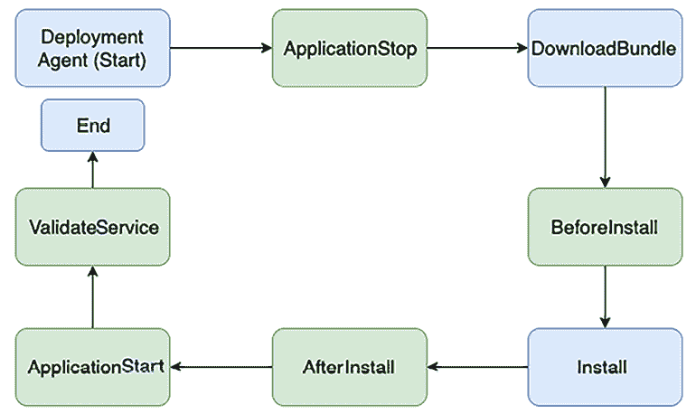

# 第十一章：DevOps 和解决方案架构框架

在上一章中，你探索了如何创建一个关注成本的架构，并通过不断优化成本而不妥协性能。自动化和团队之间的协作对于开发强健的应用程序和节省成本至关重要。本章将深入探讨 DevOps，一种促进开发和运维团队协作的方式，同时自动化应用程序部署和监控的过程。

在传统环境中，开发团队和 IT 运维团队各自为政。开发团队从业务负责人那里收集需求并开发应用程序。系统管理员则单独负责操作和满足正常运行时间要求。这些团队在开发生命周期中通常很少进行直接沟通，每个团队也很少理解其他团队的流程和需求。

每个团队都有自己的工具、流程和冗余方法，有时会导致冲突。例如，开发团队和**质量保证**（**QA**）团队可能会在特定的 **操作系统**（**OS**）补丁上测试构建。然而，运维团队将相同的构建部署到生产环境中的不同操作系统版本上，导致问题和交付延误。

DevOps 是一种方法论，旨在促进开发团队和运维团队之间的协作与协调，以持续交付产品或服务。这种方法在那些依赖于多个应用程序、工具、技术、平台、数据库、设备等的组织中，具有重要意义，尤其是在开发或交付产品或服务的过程中。虽然 DevOps 文化有不同的实践方式，但其核心目标是一致的。DevOps 旨在通过共享责任来提高运营效率，从而以最短时间交付产品或服务。

安全性是任何应用程序的首要任务，安全事件可能对业务造成严重影响。尽管如此，安全性在部署过程中往往被忽视，通常作为一个独立的问题，由组织内部的专业安全团队进行被动处理。

将安全性嵌入到 DevOps 过程中的关键方面，可以通过实施 DevSecOps 来实现。DevSecOps 是将安全性早期且贯穿整个软件开发生命周期的一部分，从而打破信息孤岛，促进开发、运维和安全团队之间的协作。DevSecOps 帮助在不妥协质量、可靠性、稳定性、韧性或安全性的情况下交付产品。

本章将介绍以下 DevOps 主题：

+   介绍 DevOps

+   理解 DevOps 的组成部分

+   持续集成/持续部署（CI/CD）

+   在安全领域介绍 DevSecOps

+   将 DevSecOps 和 CI/CD 结合

+   实施 CD 策略

+   在 CI/CD 流水线中实施持续测试

+   使用 DevOps 工具进行 CI/CD

+   实施 DevOps 最佳实践

+   在云中构建 DevOps 和 DevSecOps

到本章结束时，你将了解 DevOps 在应用部署、测试和安全中的重要性。你还将学习 DevOps 和 DevSecOps 的最佳实践以及它们的不同实施工具和技术。

# 引入 DevOps

在 **DevOps**（即 **开发与运维**）方法中，开发与运维团队在软件开发生命周期的构建与部署阶段协作，共享责任并提供持续反馈。在构建阶段，软件构建会在类似生产环境中频繁测试，从而实现缺陷的早期发现。

DevOps 是文化与实践的结合。它要求组织通过打破产品开发和交付生命周期中各个团队之间的壁垒来改变其文化。DevOps 不仅仅关乎开发和运维，它涉及到整个组织，包括管理层、业务/应用所有者、开发人员、QA 工程师、发布经理、运维团队和系统管理员。

高速度使得组织能够保持领先于竞争对手，并快速响应客户需求。良好的 DevOps 实践鼓励软件开发工程师与运维专业人员更好地合作。这导致了更加紧密的协作与沟通，从而缩短了 **上市时间**，确保了可靠的发布，提高了代码质量，并改善了维护工作。

有时在 DevOps 中，你会发现软件应用的开发和运维由同一个团队处理，工程师会贯穿整个应用生命周期工作。这样的团队需要培养一系列不局限于单一职能的技能。应用测试和安全团队也可能会在应用的创建到生产发布的整个过程中与开发和运维团队更紧密地合作。

开发人员受益于运维团队提供的反馈，并制定测试和部署策略。

系统管理员不必在生产环境中部署有缺陷或未经测试的软件，因为他们参与了 *构建阶段*。随着所有软件开发与交付生命周期的利益相关者共同协作，他们还可以在每个步骤中评估计划使用的工具，验证设备之间的兼容性，并判断是否有任何工具可以跨团队共享。

DevOps 正在成为一种日益流行的操作文化，特别适用于那些利用云计算或分布式计算技术的组织。让我们了解一下 DevOps 的一些主要好处，以及它为何对你的应用工作负载至关重要。

## 了解 DevOps 的好处

DevOps 的目标是实现 **CI/CD** 模型，利用该模型使软件开发生命周期变得可重复、可靠、稳定、弹性强且安全。这些模型特性有助于提高操作效率。为了实现这一目标，团队必须在开发和交付过程中进行协作与参与。所有技术团队成员应具备开发流水线中涉及的过程和工具经验。

一个成熟的 DevOps 过程提供了许多好处，如下图所示：


图 11.1：DevOps 的好处

DevOps 提供的好处在这里有详细说明：

+   **速度**：更快地发布产品功能有助于适应客户不断变化的业务需求，并扩大市场份额。DevOps 模型使组织能够更快地取得成果。

+   **快速交付**：DevOps 过程通过自动化端到端的流水线，提高效率，从代码构建到代码部署再到生产上线。快速交付帮助你更快地进行创新。更快的 bug 修复和功能发布让你能获得竞争优势。

+   **可靠性**：DevOps 过程提供检查，以确保交付质量和快速应用更新的安全性。像 CI 和 CD 这样的 DevOps 实践嵌入了自动化测试和安全检查，以确保用户体验良好。

+   **可扩展性**：DevOps 通过在各个环节中引入自动化，帮助按需扩展你的基础设施和应用。

+   **协作**：DevOps 模型建立了一种所有权文化，团队考虑自己的行动。运维团队和开发团队在共享责任模型中共同工作。协作简化了过程，提高了效率。

+   **安全性**：在敏捷环境中，频繁的变化需要严格的安全检查。DevOps 模型自动化了安全和合规性最佳实践，监控这些实践，并以自动化方式采取纠正措施。

团队对其交付的服务承担完全责任，通常超出传统角色的范围，并从客户角度思考，解决任何问题。让我们深入了解 DevOps 过程的不同组件。

# 了解 DevOps 的组件

DevOps 工具和自动化将开发与系统运维结合在一起。以下是 DevOps 实践中的关键组件：

+   CI/CD

+   持续监控和改进

+   基础设施即代码

+   配置管理

所有元素中的一个常见最佳实践是**自动化**。自动化可以包括脚本、模板和其他工具。在一个蓬勃发展的 DevOps 环境中，基础设施以代码形式进行管理。自动化使 DevOps 团队能够快速搭建和调整测试与生产环境。让我们深入了解每个组件的更多细节。

## 持续集成/持续部署

在**CI**中，开发者频繁地将代码提交到代码库。代码会频繁地进行构建。每次构建都会使用自动化单元测试和集成测试进行测试。在**CD**中，你会进一步操作，频繁地将代码部署到生产环境中。构建被部署到测试环境中，并通过自动化或手动测试进行验证。成功的构建通过测试后，会部署到预发布或生产环境中。

下图说明了 CI 与 CD 在软件开发生命周期中的影响：


图 11.2：CI/CD

如前图所示，CI 指的是软件开发生命周期中的构建和单元测试阶段。每次提交到代码库的更新都会触发自动构建和测试。CD 是 CI 的重要组成部分，它将 CI 过程扩展到将构建部署到生产环境中。在 CI/CD 实践中，多个开发者共同参与代码开发，他们都必须使用最新的工作版本进行开发。代码库保持不同版本的代码，并使团队能够访问这些代码。你从代码库中检出代码，进行更改，在本地副本中编写新代码，编译和测试代码，并频繁地将代码提交回主代码库。在 CI/CD 中，代码、构建、部署和测试等软件开发生命周期阶段是通过 DevOps 管道自动化的。

CI 自动化了大部分软件发布过程。它创建了一个自动化流程，完成构建、测试和更新的准备工作。然而，开发者仍然需要触发最终的部署到实时生产环境，这一过程是不可自动化的。CD 通过在构建阶段之后，将所有代码更改部署到测试和/或生产环境，进一步扩展了 CI 的功能。如果 CD 正确实施，开发者将始终拥有经过测试且准备好部署的构建版本。

下图展示了与应用程序自动化相关的所有内容，从代码提交到代码库，再到部署管道。它展示了从构建到生产环境的端到端流程，开发者将代码更改提交到代码库，CI 服务器从中拉取代码。CI 服务器触发构建，生成一个包含新应用程序二进制文件和相应依赖项的部署包。这些新的二进制文件被部署到目标开发或测试环境中。二进制文件还被提交到构件库中，以进行版本控制和安全存储：


图 11.3：CI/CD 与 DevOps

强大的 CD 流水线还可以自动化测试和生产环境的基础设施配置，并使测试和生产环境的监控与管理成为可能。CD 并不意味着开发者提交的每个更改都进入生产环境。而是意味着每个更改都已*准备好*进入生产环境。当更改在阶段环境中进行预部署和测试时，手动审批流程会启动，并给出绿色信号进行生产部署。因此，在 CD 中，部署到生产环境成为了一个商业决策，且仍然是自动化的工具。

## 持续监控与改进

持续监控帮助我们理解应用程序和基础设施的性能对客户的影响。通过分析数据和日志，你可以了解代码更改如何影响用户。主动监控在 24/7 服务和不断更新应用程序及基础设施的时代变得至关重要。

你可以通过创建警报并进行实时分析来主动监控服务。你可以跟踪各种指标，以监控并改进你的 DevOps 实践。

以下是与 DevOps 相关的指标示例：

+   **变更量**：这是开发的用户故事数量、新代码的行数和修复的 bug 数量。

+   **部署频率**：这表示团队部署应用程序的频率。这个指标通常应该保持稳定或呈上升趋势。

+   **从开发到部署的交付时间**：从开发周期开始到部署结束的时间可以用来识别发布周期中间步骤的低效之处。

+   **失败部署的百分比**：失败部署的百分比，包括导致故障的部署次数，应该保持在较低水平。

+   这个指标应该与变更量一起审查。如果变更量较低，但失败的部署次数较高，应分析潜在的失败点。

+   **可用性**：跟踪导致故障的发布，可能会导致违反**服务级别协议**（**SLA**）的情况。应用程序的平均停机时间是多少？

+   **客户投诉量**：客户提交的投诉工单数量表明了应用程序的质量。

+   **用户量变化百分比**：新用户注册使用你的应用程序的数量以及随之而来的流量增加，可以帮助你扩展基础设施以匹配工作负载。

在将部署构建到生产环境后，监控应用程序的性能至关重要。正如我们讨论的自动化环境一样，让我们详细探讨一下**基础设施即代码**（**IaC**）。

## 基础设施即代码

提供、管理甚至废弃基础设施在人工成本上是一项昂贵的活动。此外，通过反复尝试手动构建和修改环境，可能会出现错误。无论是基于以往经验还是一本详细的运行手册，人类犯错的倾向始终是一个统计概率。

我们可以通过自动化任务来创建完整的环境。任务自动化有助于完成重复性任务，并能毫不费力地提供显著价值。

使用 IaC，我们可以以 **模板** 的形式定义基础设施。一个模板可以包含部分或整个环境。更重要的是，这个模板可以反复使用，以便再次创建相同的环境。

在 IaC 中，基础设施是通过代码进行创建和管理的。IaC 模型帮助你以编程方式与基础设施互动，并通过自动化资源配置避免人为错误。这样，你就可以像使用代码一样使用代码工具来处理基础设施。由于基础设施是通过代码管理的，应用程序可以使用标准化方法进行部署，任何补丁和版本都可以反复更新且不会出错。

一些最受欢迎的基础设施即代码（IaC）脚本工具包括 Ansible、Terraform、Azure 资源管理器、Google Cloud 部署管理器、Chef、Puppet、AWS **云开发工具包**（**CDK**）和 AWS CloudFormation。

以下是来自 AWS CloudFormation 的代码示例，它提供了 IaC 功能，可以自动化 AWS 云平台上的基础设施。

```
`AWSTemplateFormatVersion: '2010-09-09' Description: 'Create an S3 Storage with a parameter to choose own bucket name.' Parameters: S3NameParam: Type: String Default: 'architect-book-storage' Description: 'Enter the S3 Bucket Name' MinLength: '5' MaxLength: '30' Resources: Bucket: Type: 'AWS::S3::Bucket' DeletionPolicy: Retain Properties: AccessControl: Private BucketName: Ref: S3NameParam Tags: - Key: 'Name' Value: 'MyBucket' Outputs: BucketName: Description: 'BucketName' Value: Ref: S3NameParam` 
```

上述代码创建了 Amazon S3 对象存储，并为用户提供了存储名称的选项，具体如下所示：


图 11.4：使用 AWS CloudFormation 的 IaC

执行代码后，Amazon S3 桶会被创建，正如在**资源**中看到的：


图 11.5：使用 AWS CloudFormation 自动化创建 AWS S3 对象存储

多个团队可以使用提供的代码创建任意数量的 Amazon S3 存储。由于数据至关重要，管理员选择添加 `"DeletionPolicy": "Retain,"` 来确保当基础设施关闭时存储不会被删除，数据也得到了保护。

你可以看到如何使用 IaC 在组织中实现标准化、一致性和合规性。配置管理是 DevOps 过程中的另一个重要方面。让我们进一步了解它。

## 配置管理

**配置管理**（**CM**）是通过自动化的方式，标准化整个基础设施和应用程序的资源配置的过程。像 Chef、Puppet 和 Ansible 这样的 CM 工具可以帮助你管理 IaC 并自动化大部分系统管理任务，包括资源的提供、配置和管理。

通过自动化和标准化开发、构建、测试和部署阶段的资源配置，你可以确保一致性并消除因配置错误导致的故障。配置管理（CM）还可以通过允许你通过一键操作将相同的配置自动部署到数百台服务器，来提高运营效率。CM 还可以用于部署配置更改。

尽管你可以使用注册表设置或数据库来存储系统配置设置，CM 应用程序还允许你在存储之外进行版本控制。CM 也是一种跟踪和审计配置更改的方法。如果需要，你甚至可以为不同的软件版本维护多个配置设置版本。

CM 工具包括一个控制机来管理服务器节点。例如，Chef 需要在每台服务器上安装客户端代理应用程序进行管理，并且在控制机上安装主 Chef 应用程序。Puppet 也以类似方式工作，通过一个集中的服务器。然而，Ansible 采用去中心化的方法，不需要在服务器节点上安装代理软件。

下表展示了各类流行的配置管理工具之间的高层次对比：

|  | **Ansible** | **Puppet** | **Chef** |
| --- | --- | --- | --- |
| **机制** | 控制机通过**安全外壳协议**（**SSH**）将更改应用到服务器 | 主机将更改同步到 Puppet 节点 | Chef 工作站寻找 Chef 服务器中的更改并将其推送到 Chef 节点。 |
| **架构** | 任何服务器都可以是控制机 | 由 Puppet 主机进行集中控制 | 由 Chef 服务器进行集中控制 |
| **脚本语言** | YAML | Ruby 中的特定领域语言 | Ruby |
| **脚本术语** | Playbook 和角色 | Manifests 和模块 | 配方和食谱 |
| **测试执行** | 顺序执行 | 非顺序执行 | 顺序执行 |

表 11.1 – 流行 CM 工具对比表

CM 工具提供了一个特定领域的语言和一组自动化功能。其中一些工具有陡峭的学习曲线，团队需要学习如何使用这些工具。AWS 提供了一个名为 OpsWorks 的托管平台，用于在云中管理 Chef 和 Puppet。它提供了多种属性来通过自动化管理 IT 基础设施，如下所示：


图 11.6: AWS OpsWorks 服务在管理 Chef 和 Puppet 中的功能

安全性已经成为任何组织的优先事项，因此完全的安全自动化是当务之急。组织正在转向严格的安全实施和监控，以避免人为错误，采用被广泛称为**DevSecOps**的 DevOps 流程。在下一节中，让我们一起探讨 **DevSecOps**（即 **开发、安全和运营** 的缩写）。

# 引入 DevSecOps 以增强安全性

我们现在比以往任何时候都更加关注安全。在许多情况下，安全是赢得客户信任的唯一途径。DevSecOps 旨在实现安全的自动化，并大规模地实施安全。开发团队不断进行更改，DevOps 团队将这些更改发布到生产环境中（这些更改通常面向客户）。DevSecOps 确保在整个过程中应用程序的安全性。

DevSecOps 不是用来审计代码或 CI/CD 工件的。组织应该实施 DevSecOps 以提高速度和敏捷性，但前提是不能以牺牲安全性为代价，因为安全验证会拖慢开发和部署过程。自动化的力量在于提高产品功能发布的敏捷性，同时实施所需的安全措施。DevSecOps 方法带来了内建的安全性；安全性不是事后才加上的。DevOps 旨在提高效率，以加速产品发布生命周期，而 DevSecOps 则验证所有构建模块，而不会拖慢生命周期。

要在组织中建立 DevSecOps 方法，首先要在开发环境中建立一个坚实的 DevOps 基础，因为安全是每个人的责任。从一开始就将安全嵌入架构设计中，以便在开发和安全团队之间创造协作关系，是最理想的做法。自动化持续的安全测试，并将其纳入 CI/CD 管道，以避免任何安全漏洞。为了跟踪任何安全漏洞，要扩展监控，实时监控设计状态的漂移，确保包括安全和合规性。监控应能够启用警报、自动修复和移除不合规的资源。

对一切进行编码是打开无限可能的关键要求。DevSecOps 的目标是保持创新的步伐，而这种步伐应当与安全自动化的步伐相匹配。可扩展的基础设施需要可扩展的安全性，这需要自动化事件响应修复来实施持续的合规性和验证。

# 结合 DevSecOps 和 CI/CD

DevSecOps 实践必须嵌入每个 CI/CD 管道步骤。DevSecOps 通过管理每台服务器分配的适当访问权限和角色来确保 CI/CD 管道的安全，并确保构建服务器（如 Jenkins）已加固，能防止任何安全漏洞。此外，我们还需要确保所有工件都经过验证，并且代码分析已经到位。

建议通过自动化持续的合规性验证和事件响应修复来为事件响应做好准备。例如，如果一个组织需要遵守支付卡行业数据安全标准（PCI-DSS），那么持续的合规性验证就包括设置自动化工具和流程，以不断检查信用卡信息的处理、存储和传输是否符合 PCI-DSS 要求。

下图为我们提供了多个阶段，用于测试安全边界、捕获安全问题，并尽早确保符合政策：


图 11.7：DevSecOps 与 CI/CD

在每个集成点，你可以识别不同的问题，如前面的图示所示：

+   在**代码**阶段，扫描所有代码，确保没有硬编码的秘密或访问密钥在代码行之间。

+   在**构建**阶段，包含所有安全工件，例如加密密钥和访问令牌管理，并为它们添加标签以便于识别。

+   在**测试**阶段，扫描配置以确保所有安全标准都已通过测试安全检查。

+   在**部署**和**配置**阶段，确保所有安全组件已注册。执行校验和以确保构建文件没有变化。校验和是一种用于确定接收文件的真实性的技术。操作系统提供了`checksum`命令来验证文件，并确保在文件传输过程中没有任何变化。

+   在**监控**阶段，监控所有安全标准。执行持续审计和自动化验证。

你可以将多个工具集成到 DevSecOps 管道中，以在不同阶段识别安全漏洞，并聚合漏洞发现结果。

**应用安全测试**（**AST**），即使用工具自动化测试、分析和报告安全漏洞，是应用开发的关键组成部分。AST 可以分为以下四个类别，用于扫描软件应用中的安全漏洞：

+   **软件组成分析**（**SCA**）：SCA 评估代码库中开源软件的安全性、许可证合规性和代码质量。SCA 尝试检测项目依赖项中包含的公开披露的漏洞。常见的 SCA 工具包括 OWASP Dependency-Check、Synopsys 的 Black Duck、WhiteSource、Synk 和 GitLab。

+   **静态应用安全测试**（**SAST**）：SAST 涉及在编译之前扫描应用程序的代码。这些工具为开发人员提供即时反馈，使他们在编码过程中能够尽早发现问题，并在代码构建阶段之前进行修正。作为一种白盒测试方法，SAST 分析源代码，以识别可能导致应用程序受到攻击的漏洞。其主要优势在于它可以在 DevOps 周期的早期阶段，即编码阶段进行集成，因为它不需要一个功能完整的应用程序或代码执行。常见的 SAST 工具包括 SonarQube、PHPStan、Coverity、Synk、Appknox、Klocwork、CodeScan 和 Checkmarx。

+   **动态应用安全测试**（**DAST**）：DAST 通过模拟外部攻击来识别应用中的安全漏洞，测试正在运行的应用。它从外部评估应用，探查暴露的接口是否存在漏洞。DAST 也被称为黑盒安全测试或 Web 应用漏洞扫描器，DAST 工具包括 OWASP ZAP、Netsparker、Detectify Deep Scan、StackHawk、Appknox、HCL AppScan、GitLab 和 Checkmarx。

+   **互动应用安全测试**（**IAST**）：IAST 在应用被积极测试或使用时检查代码中的安全漏洞，从而实时报告问题而不会导致 CI/CD 管道的延迟。IAST 工具通常在 QA 环境中与自动化功能测试一起实施。著名的 IAST 工具包括 GitLab、Veracode、CxSAST、Burp Suite、Acunetix、Netsparker、InsightAppSec 和 HCL AppScan。

你将会在本章的*构建云中的 DevOps 和 DevSecOps*部分了解如何将上述一些工具集成到 DevOps 管道中。DevSecOps CI/CD 确保代码符合公司安全政策。

它有助于避免由于不同的安全配置导致后续部署中的基础设施和应用失败。DevSecOps 保持敏捷性，并确保在不影响 DevOps 创新步伐的情况下确保安全。让我们了解 DevOps 管道中的 CD 策略。

# 实施 CD 策略

CD 提供无缝的应用版本迁移。通过 CD 实现的一些最受欢迎的技术如下：

+   **原地部署**：在当前服务器上更新应用

+   **滚动部署**：逐步在现有服务器集群中推出新版本

+   **蓝绿部署**：逐步将现有服务器替换为新服务器

+   **红黑部署**：从现有服务器即时切换到新服务器

+   **不可变部署**：完全搭建一套新的服务器

让我们更详细地探讨每个选项。

## 原地部署

原地部署是一种在现有服务器集群上推出新版本应用的方法。更新是在一次部署操作中完成的，需要一些停机时间。此更新几乎不需要任何基础设施的变更，也无需更新现有的**域名系统**（**DNS**）记录。部署过程本身相对较快。如果部署失败，恢复的唯一选择是重新部署。

简单来说，你是将应用基础设施上现有的应用版本（v1）替换为新版本（v2）。原地更新成本低，且部署速度快。

## 滚动部署

使用滚动部署，服务器群分成多个组，因此不需要同时更新。部署过程在同一服务器群上同时运行旧版和新版软件，但是在不同的子组中。滚动部署方法有助于实现零停机时间。如果新版本部署失败，那么只有整个群中的一部分服务器受到影响，风险很小，因为仍有一半的群会继续运行。滚动部署有助于实现零停机时间；然而，与原地部署相比，部署时间略长一些。

滚动部署不仅有助于实现零停机时间，提升用户体验，而且在额外资源分配方面成本中性。与需要在一段时间内加倍环境的蓝绿部署不同，滚动部署逐个更新现有资源，避免了额外基础设施的需求。虽然与原地部署相比，部署时间可能稍长，但此方法不会因提供额外资源而产生额外成本，是在不影响预算的情况下进行持续交付的高效策略。现在让我们来学习一下蓝绿部署。

## 蓝绿部署

蓝绿部署的理念是，您的蓝色环境是承载实时流量的现有生产环境。同时，您提供一个绿色环境，与蓝色环境相同，除了代码的新版本。在部署时，您将生产流量从蓝色环境路由到绿色环境。如果绿色环境遇到任何问题，您可以通过将流量恢复到原始蓝色环境来回滚。DNS 切换和交换自动扩展组是蓝绿部署中重新路由流量的两种常见方法。

使用自动扩展策略，您可以逐步将现有实例替换为托管新版本应用程序的实例，以满足应用程序扩展的需求。此选项最适合用于小版本发布和小代码更改。另一种选项是利用 DNS 路由在不同版本的应用程序之间执行复杂的负载均衡。

如下图所示，创建托管新版本应用程序的生产环境后，您可以使用 DNS 路由将一小部分流量转移到新环境：


图 11.8：蓝绿部署 DNS 逐步切换

使用生产流量的一部分来测试绿色环境，这称为**金丝雀分析**。如果环境存在功能性问题，你可以立即发现并在对用户产生重大影响之前切换流量回去。继续逐步转移流量，测试绿色环境的负载处理能力。监控绿色环境以发现问题，提供将流量切换回去的机会，从而限制影响范围。最后，当所有指标正常时，停用蓝色环境并释放资源。

蓝绿部署有助于实现零停机时间，并提供便捷的回滚功能。你可以根据需要定制部署时间。然而，这些零停机时间是有成本考量的，因为这种方法需要维持两个相同的生产环境，一个是活动的（蓝色），一个是空闲的（绿色）。环境的重复意味着由于额外资源的需求，运营成本更高。然而，这种成本通常通过它在风险缓解和用户体验持续性方面带来的价值来证明是合理的。

## 红黑部署

在红黑部署中上线新版本之前，需要进行金丝雀测试。金丝雀将现有生产系统的约 1%替换为最新版本的应用程序，并监控该版本的错误。如果金丝雀测试通过，则认为系统准备好进行部署。新的系统版本与旧版本并排部署，为切换做准备。新系统的初始容量是手动设置的，方法是查看当前在生产环境中运行的实例数量，并将这个数字设为新自动扩展组的目标容量。新系统上线后，两个系统都处于红色状态，当前版本是唯一接受流量的版本。

然后，通过 DNS 服务将系统从现有版本切换到新版本。此时，旧版本被视为黑色；它仍在运行，但不再接收任何流量。如果检测到新版本有问题，恢复操作就像将 DNS 服务器指向旧版本的负载均衡器一样简单。

红黑部署也被称为**暗启动**，它与蓝绿部署略有不同。在红黑部署中，你通过 DNS 切换将流量从旧版本直接切换到新版本，而在蓝绿部署中，DNS 会逐步将流量转移到新版本。蓝绿部署和暗启动可以结合使用，使两种软件版本并行部署。使用两个独立的代码路径，但只有一个被激活。功能开关激活另一个代码路径。这种部署方式可以作为 Beta 测试，在测试中明确启用新功能。

红黑部署，类似于蓝绿部署，通过运行两个相同的环境来确保零停机并促进轻松回滚。成本主要与部署阶段需要翻倍资源相关。你将拥有一个“红色”环境（当前的在线版本）和一个“黑色”环境（新版本）。这两个环境必须完全正常运行，这实际上将资源需求翻倍——包括计算、存储和网络资源——在过渡期间。尽管这种方法大大减少了部署风险，并提供了无缝的用户体验，但重复的环境会导致成本增加。然而，由于额外的资源仅在部署窗口期间需要，这种成本是暂时的，可以视为对稳定性和可靠性的投资。

## 不可变部署

如果应用程序具有未知的依赖关系，不可变或一次性升级会更加直接。随着时间的推移，经过多次修补和更新的旧应用基础设施变得越来越难以升级。这种升级技术在不可变基础设施中更为常见。

在新版本发布期间，通过终止旧实例来推出一组新的服务器实例。对于一次性升级，你可以设置一个克隆环境，使用 Chef、Puppet、Ansible 和 Terraform 等部署服务，或者将它们与自动扩展配置结合使用来管理更新。

除了停机时间外，在设计部署策略时，还必须考虑成本。考虑你需要替换的实例数量以及部署频率，以确定成本。根据预算和停机时间，选择最合适的方法。

在本节中，你学习了各种 CD 策略，它们有助于使应用发布更高效、无忧。接下来，我们来看选择正确部署类型的最佳实践。

# 选择正确部署策略的最佳实践

选择正确的部署策略对成功的应用更新和无缝的用户体验至关重要。以下是选择不同部署策略的最佳实践：

+   **就地部署**：就地部署适用于简单性至关重要且应用程序相对较小或用户群体有限的场景。例如，使用小团队更新公司内部工具非常适合这种方法。它涉及在当前服务器上更新应用程序，但需要注意的是，这可能会导致停机时间。对于大规模或高可用性的应用程序，这种策略并不适合。一个显著的例子是，晚上更新一个小规模的网页服务，用户流量较低。在更新失败时，恢复到先前版本并快速最小化干扰的回滚策略至关重要。

+   **滚动部署**：滚动部署适用于需要最小停机时间，但不需要额外资源的应用程序。这种方法会在现有的服务器集群中逐步更新应用程序。例如，可以分阶段将更新部署到电子商务网站的服务器，确保只有一部分用户在任何时候遇到潜在问题。然而，这种方法不适用于无法同时处理不同版本的应用程序。部署过程中对应用程序性能的持续监控是解决问题的关键。

+   **蓝绿部署**：蓝绿部署最适用于对零停机时间要求极高的关键应用程序。金融服务公司可能会使用此策略更新其面向客户的应用程序。一旦绿色环境经过彻底测试并准备就绪，流量就会从蓝色环境切换到绿色环境。这种方法需要双倍的资源，但提供无缝的用户体验和快速回滚能力。确保负载均衡和 DNS 切换机制的稳健性和可靠性至关重要。

+   **红黑部署**：红黑部署类似于蓝绿部署，但更注重快速切换到新版本。它特别适用于快速发布新版本，常用于容器化环境中。例如，一个媒体流服务可能会使用此策略部署平台的新版本，确保所有用户能够立即使用新功能。尽管它提供了快速发布和即时切换的优势，但新版本的充分测试至关重要，因为回滚涉及恢复到旧环境。

+   **不可变部署**：不可变部署确保了云环境中的一致性和可靠性。每次部署都涉及设置新的服务器，保证可预测和稳定的状态。这种方法对具有复杂依赖关系的应用程序尤其有利，因为它避免了长期存在的环境中出现的“配置漂移”问题。此策略要求高效管理基础设施资源，因为每次发布都涉及为新服务器配置和淘汰旧服务器。

在这些策略中，评估应用程序的复杂性、规模、用户群体以及潜在停机的影响非常重要。

此外，资源的可用性、基础设施成本以及应用程序的关键性应引导部署策略的选择。定期根据技术和组织变化更新和优化部署方法也是保持有效部署过程的关键。

你需要在每一步进行应用程序测试，以确保高质量交付，这通常需要大量的工作。DevOps 管道可以帮助你自动化测试流程，提高功能发布的质量和频率。让我们深入了解 CI/CD 管道中的持续测试。

# 在 CI/CD 流水线中实施持续测试

DevOps 对于基于客户反馈、对新功能的需求或市场趋势变化的持续业务场景至关重要。一个强大的 CI/CD 流水线确保可以在更短时间内加入更多功能/反馈，客户也可以更快地使用新功能。

通过频繁的代码提交，在 CI/CD 流水线中内置一个良好的测试策略可以确保你以高质量完成反馈闭环。持续测试对于平衡 CI/CD 流水线至关重要。虽然快速添加软件功能是好事，但通过持续测试确保功能符合良好的质量标准。

单元测试构成了测试策略中最重要的部分。它们通常在开发人员的机器上运行，是最快且最便宜的。一个通用的经验法则是将 70%的测试工作量集中在单元测试上。在这个阶段捕获的 Bug 可以快速修复，且复杂性较低。

开发人员通常会执行单元测试，一旦代码准备好，就会进行集成和系统测试。这些测试需要独立的环境，有时还需要单独的测试团队，这使得测试过程变得更加昂贵。一旦团队确认所有预期功能按预期工作，运营团队需要进行性能和合规性测试。这些测试需要类似生产环境的环境，且费用较高。此外，**用户验收测试**（**UAT**）也需要类似生产的环境，这会导致更多的开销。

如下图所示，开发人员在开发阶段执行单元测试，以测试代码更改/新功能。测试通常在开发人员的机器上完成，完成编码后进行。还建议对代码更改进行静态代码分析，并进行代码覆盖率、遵循编码规范等检查。没有依赖项的小型单元测试运行得更快。因此，开发人员可以迅速发现测试是否失败：


图 11.9：CI/CD 中的持续测试

**构建阶段**是不同组件和单个组件之间集成的第一次测试。构建阶段也是测试开发人员提交的代码是否破坏任何现有功能并进行回归测试的绝佳时机。

**预发布环境**是生产环境的镜像。在这个阶段进行端到端的系统测试（UI、后台逻辑和 API 会进行广泛的测试）。性能测试在特定的工作负载下测试应用程序的性能。性能测试包括负载测试和压力测试。UAT 也会在此阶段进行，为生产部署做好准备。合规性测试用于测试行业特定的法规合规性。

例如，假设你正在将持续测试集成到在线流媒体平台的视频个性化功能的 CI/CD 管道中。当你的开发团队提交代码更改时，CI 工具（例如 Jenkins）会自动启动构建过程并进行一系列自动化测试。这些测试包括单元测试，用于验证个性化功能的各个组件，集成测试，确保与现有系统组件的兼容性，以及 UI 测试，以确认用户交互流程顺畅。在这种情况下，性能测试尤为关键，用于验证新功能不会降低流媒体体验。如果在这些测试过程中出现任何问题，管道会被暂停，允许开发人员进行必要的修正，从而确保只有经过彻底审核的代码才会进入下一个阶段。在通过自动化测试后，功能会进入模拟生产环境的预发布环境，进行进一步的测试和验证。这一额外的审查层确保功能能够在各种场景和用户行为下良好表现，并通过用户验收测试后再部署。

## A/B 测试

在软件开发中，经常需要明确哪个功能的实现最有可能在现实世界中成功。整个计算机科学学科——**人机交互**（**HCI**）——致力于回答这个问题。虽然 UI 专家有多种指南帮助设计合适的界面，但最好的设计选择往往只能通过将其交给用户并观察他们是否能使用该设计完成特定任务来确定。

像 A/B 测试或金丝雀分析这样的策略会在生产阶段测试新版本的应用。在 A/B 测试中，新版本的应用会部署到少部分生产服务器上并进行用户反馈测试。随着用户对新应用的接受度逐步增加，部署会逐渐扩展到所有生产服务器。

如下图所示，A/B 测试是一种方法论，将功能的两个或多个版本分别提供给不同的用户群体。收集关于每个实现的详细使用数据，UI 工程师会分析这些数据，以决定接下来应该采用哪个实现：


图 11.10：通过 A/B 测试进行的特性实验用户拆分

上述图表展示了一个 A/B 测试场景，其中同时测试多个版本的 Web 应用，以评估其性能、用户参与度或其他定义的指标。以下是该架构中 A/B 测试过程的描述：

1.  **流量分配**：应用程序负载均衡器起着至关重要的作用，它将用户的流量引导到不同版本的网页应用程序。在这种情况下，大部分流量（90%）被引导到稳定的生产版本（V1.1），而正在测试的新版本 V1.2 和 V1.3 则分别接收较小比例的流量，分别为 7% 和 3%。

1.  **Web 服务器集群**：每个版本的应用程序运行在一组独立的 Web 服务器或实例上，确保一个版本的更改不会影响其他版本。这种隔离对于获得准确的测试结果至关重要。接收最多流量的版本作为对照组，而其他带有更改或新特性的版本则作为测试组。

1.  **数据库**：所有版本的应用程序都与同一个后台数据库进行交互。这在 A/B 测试中很常见，其中底层数据在不同用户体验之间保持一致。然而，必须小心确保数据库架构和交互在所有版本之间兼容，以避免数据处理中的错误或不一致。

你需要确保在整个 A/B 测试过程中，持续监控性能指标，以评估应用程序的每个版本在真实环境中的表现。这包括评估响应时间、错误率、资源利用率等多个因素。在收集到足够的数据后，分析结果以确定哪个版本在测试标准下表现最佳。然后，可以根据 A/B 测试的结果，决定是完全发布新版本、进行进一步修改，还是回滚更改。

# 使用 DevOps 工具进行 CI/CD

要构建一个 CI/CD 管道，开发人员需要各种工具。这些工具包括代码编辑器、源代码仓库、构建服务器、部署工具以及整体 CI 管道的协调。让我们探索一些流行的 DevOps 开发工具选择，涵盖云端和本地部署。

## 代码编辑器

DevOps 是一种实践性很强的编码角色，通常需要编写脚本来自动化环境。你可以使用 **Ace 编辑器** 或 **基于云的 AWS Cloud9 集成开发环境（IDE）**。Ace 提供了语法高亮和其他对开发人员有价值的功能。Cloud9 与 AWS 平台集成，使得开发人员可以轻松创建无服务器应用程序并使用 AWS 服务。它还支持协作编码，并配备了常用编程语言的基本工具。

你可以在本地计算机上使用基于网页的代码编辑器，或者在本地服务器上安装代码编辑器，连接到应用环境——如开发、测试和生产环境——进行交互。在环境中，你存储项目的文件并运行工具以开发应用。你可以将这些文件保存在实例或服务器上，或者将远程代码库克隆到环境中。AWS Cloud9 IDE 是一种云原生 IDE，作为托管服务提供。

Ace 编辑器让你可以快速、轻松地编写代码。它是一个基于网页的代码编辑器，但提供了类似于 Eclipse、Vim、**Visual Studio Code**（**VS Code**）等流行桌面代码编辑器的性能。它具备标准的 IDE 特性，如实时语法和匹配括号高亮、自动缩进和补全、标签之间的切换、与版本控制工具的集成以及多光标选择。它能够处理大文件，拥有数十万行代码也不会出现输入延迟。它内建对所有流行编程语言和调试工具的支持，还可以安装自己的工具。对于桌面 IDE，VS Code 和 Eclipse 是 DevOps 工程师可以选择的其他流行代码编辑器选项。

## 源代码管理

你有多个选择来设置你的源代码仓库。你可以搭建、运行和管理自己的 Git 服务器，所有操作都由你负责。

你可以选择使用 GitHub 或 Bitbucket 等托管服务。如果你正在寻找云解决方案，**AWS CodeCommit** 提供了一个安全、高度可扩展且托管的源代码控制系统，用于托管私有 Git 仓库。

你需要为代码仓库设置身份验证和授权，以便授权的团队成员可以访问代码进行读取或写入。你可以应用传输中的加密和静态数据加密。当你推送到代码仓库时（`git push`），它会加密并存储数据。当你从代码仓库拉取数据时（`git pull`），它会解密数据，然后返回给调用者。用户必须经过适当访问级别的身份验证才能访问代码仓库。数据可以通过 HTTPS 或 SSH 协议在加密的网络连接中进行传输，从而加密传输中的数据。

## CI 服务器

CI 服务器也称为**构建服务器**。当团队在多个分支上工作时，将代码合并回主分支变得复杂。在这种情况下，CI 发挥着关键作用。CI 服务器钩子提供了一种基于代码提交到仓库时触发构建的方式。钩子几乎在每个版本控制系统中都可以找到，指的是在仓库中根据特定必要操作触发的自定义脚本。钩子可以在客户端或服务器端运行。

拉取请求是开发人员在将代码合并到公共代码分支之前，用于通知和相互审查工作的一种常见方式。CI 服务器提供了一个 web 界面，用于在将变更添加到最终项目之前进行审查。如果提议的变更存在任何问题，源代码可以被退回给开发者，根据组织的编码要求进行修改。

如下图所示，服务器端钩子与 CI 服务器结合使用，用于提高集成的速度：


图 11.11：CI 自动化

如前图所示，使用`post-receive`，你可以引导新的分支触发 CI 服务器上的测试，以验证新的构建是否正确集成，所有单元是否正常工作。开发者会收到测试失败的通知，并且在修复问题后才知道将他们的分支与主干合并。开发者可以从他们的分支构建，测试那里进行的更改，并获得反馈，了解他们的更改工作得如何，然后再决定是否将他们的分支合并到主干。

运行集成和单元测试能显著减少将该分支合并到主干时的阻力。钩子还可以自定义，以测试合并到主干的变更，并阻止任何未通过测试的合并。集成最好通过 CI 服务器来完成。

Jenkins 是构建 CI 服务器的最流行选择。如下面的图所示，你可以将 Jenkins 集群托管在 AWS **弹性计算云**（**EC2**）服务器的集群中，并根据构建负载进行自动扩展：


图 11.12：Jenkins CI 服务器的自动扩展

**Jenkins 控制器**在出现负载过重时，会将构建任务转移到代理节点实例。当负载下降时，**Jenkins 控制器**会自动终止代理实例。

但是，你需要自行维护安全性并打补丁。对于本地云选项和托管服务，你可以使用像 AWS CodeBuild 这样的托管代码构建服务，免去服务器管理的需求，并通过**按需付费**模式显著降低成本——服务根据需求进行扩展。你的团队可以专注于推送代码，而将所有构建工作交给服务来完成。

虽然 CI 服务器帮助你从源代码仓库中构建正确版本的代码，通过团队成员的协作，代码部署帮助团队将代码准备好进行测试和发布，以便最终用户使用。接下来，让我们更详细地了解代码部署。

## 代码部署

一旦构建完成，你可以部署 Jenkins 服务器，或者选择 AWS CodeDeploy 作为云原生托管服务。你也可以使用其他流行的工具，如 Chef 或 Puppet，来创建部署脚本。指定部署配置的选项如下：

+   **OneAtATime**：在任何时候，部署组中的只有一个实例会安装新的部署。如果某个实例上的部署失败，则部署脚本会停止部署并返回一个错误响应，详细说明成功与失败安装的数量。

+   **HalfAtATime**：部署组中的一半实例安装新的部署。如果一半实例成功安装该版本，则部署成功。HalfAtATime 是生产/测试环境中的一个良好选择，适用于一半实例更新为新版本，另一半则保持在旧版本中可用。

+   **AllAtOnce**：每个实例在下次轮询部署服务时，都会安装最新的版本。此选项最适用于开发和测试部署，因为它有可能在部署组中的每个实例上安装一个无法正常工作的版本。

+   **Custom**：你可以使用此命令创建自定义部署配置，指定在任何给定时刻必须在部署组中存在的健康主机的固定数量。这个选项是 OneAtATime 选项的更灵活实现。它允许在某些实例因损坏或配置不当而导致部署失败的情况下进行部署。

下图展示了部署过程中的生命周期事件：



图 11.13：部署生命周期事件

部署代理会按步骤执行部署。这些步骤称为生命周期事件。在前面的图示中，浅色框中的步骤可以通过人工干预进行控制；而深色框中的步骤是自动化的，由部署代理控制。让我们详细了解每个步骤：

1.  **ApplicationStop**：触发部署的首个要求是停止应用服务器，以便在复制文件时停止处理流量。软件应用服务器的例子包括 Tomcat、JBoss 或 WebSphere 服务器。

1.  **DownloadBundle**：在停止应用服务器后，部署代理开始从工件库（如 JFrog Artifactory）下载预构建的部署包。工件库存储应用程序二进制文件，可以在新版本发布前进行部署和测试。

1.  **BeforeInstall**：部署代理会触发安装前的步骤，例如通过脚本创建当前版本的备份并进行任何必要的配置更新。

1.  **Install**：在此步骤中，部署代理开始安装过程——例如，运行 Ant 或 Maven 脚本来安装 Java 应用程序。

1.  **AfterInstall**：部署代理在完成应用程序安装后触发此步骤。它可能包括更新安装后的配置，例如本地内存设置和日志参数。

1.  **ApplicationStart**：在此步骤中，代理启动应用程序，并通知成功或失败的运维团队。

1.  **ValidateService**：验证步骤在其他所有步骤完成后触发，允许你快速检查应用程序。它包括执行自动化的健全性测试和集成测试，以验证新版本的应用程序是否正确安装。代理还会在测试成功后向团队发送通知。

你已经了解了各种代码部署策略和步骤，作为独立组件。然而，你必须将所有 DevOps 步骤串联在一起，搭建一个自动化的 CI/CD 管道。让我们深入了解代码管道，它将帮助你构建一个端到端的 CI/CD 管道。

## 代码管道

代码管道的核心是将所有内容协调在一起，实现持续交付（CD）。在 CD 中，整个软件发布过程是完全自动化的，包括构建和部署到生产环境。经过一段时间的实验，你可以建立一个成熟的 CI/CD 管道。通向生产发布的路径是自动化的，从而实现快速部署新特性并立即获得客户反馈。你可以使用云原生的托管服务，如 AWS CodePipeline，来协调整体的代码管道，或者使用 Jenkins 服务器。

代码管道使你可以向 CI/CD 管道的各个阶段添加操作。每个操作可以与一个执行该操作的提供者关联。代码管道操作类别和提供者示例如下：

+   **源代码**：你的应用程序代码需要存储在一个中央仓库中，并进行版本控制，这个仓库称为**源代码仓库**。一些流行的代码仓库包括 AWS CodeCommit、Bitbucket、GitHub、**并行版本系统**（**CVS**）、**Subversion**（**SVN**）等。

+   **构建**：构建工具从源代码仓库中拉取代码，并创建一个应用程序二进制包。一些流行的构建工具包括 AWS CodeBuild、Jenkins、Solano CI 等。构建完成后，你可以将二进制文件存储在像 JFrog 这样的制品库中。

+   **部署**：部署工具帮助你将应用程序二进制文件部署到服务器上。一些流行的部署工具包括 AWS Elastic Beanstalk、AWS CodeDeploy、Chef、Puppet、Jenkins 等。

+   **测试**：自动化测试工具帮助你完成并执行部署后的验证。一些流行的测试验证工具包括 Jenkins、BlazeMeter、Ghost Inspector 等。

+   **调用**：你可以使用基于事件的脚本来调用一些活动，比如备份和警报。任何脚本语言，如 Shell 脚本、PowerShell 和 Python，都可以用来调用各种定制化的活动。

+   **审批**：审批是 CD 中的一个重要步骤。你可以通过自动化的电子邮件触发请求手动审批，或者可以通过工具实现自动化审批。

在本节中，你了解了用于管理**软件开发生命周期**（**SDLC**）的各种 DevOps 工具，如代码编辑器、代码库以及构建、测试和部署工具。你还学习了需要集成到 DevOps 流水线中的其他工具，如持续日志记录、持续监控和运维处理，这些内容你在*第九章*《运维卓越考虑》中学到过。到目前为止，你已经学习了每个 SDLC 阶段的各种 DevOps 技巧。接下来，让我们深入了解最佳实践和反模式。

# 实施 DevOps 最佳实践

在构建 CI/CD 流水线时，要考虑是否需要创建一个项目并添加团队成员。项目仪表板提供了代码流在部署流水线中的可见性，监控构建，触发警报，并跟踪应用活动。下图展示了一个定义明确的 DevOps 流水线：


图 11.14：CI/CD 工作流最佳实践

设计流水线时，请考虑以下几点：

+   **阶段数量**：阶段可以是开发、集成、系统、用户验收和生产。有些组织还会包括开发、Alpha、Beta 和发布阶段。

+   **每个阶段的测试类型**：每个阶段可以有多种类型的测试，如单元测试、集成测试、系统测试、用户验收测试、冒烟测试、负载测试和生产阶段的 A/B 测试。

+   **测试顺序**：测试用例可以并行执行，也可以需要按顺序执行。

+   **监控与报告**：监控系统缺陷和故障，并在发生故障时发送通知。

+   **基础设施供应**：为每个阶段提供基础设施的方法。

+   **回滚**：定义回滚策略，在需要时回退到先前的版本。

拥有一个需要人工干预的系统会拖慢你的过程，尤其是在可以避免的情况下。因此，通过使用 CD 自动化流程，你将加速流程。

另一个常见的反模式是将构建的配置值保存在代码内部，甚至让开发人员在构建过程中使用不同的工具，这导致开发人员之间的构建不一致。排查为什么特定的构建在某个环境中工作而在其他环境中无法工作，通常需要花费大量的时间和精力。为了克服这一点，最好将构建配置存储在代码之外。将这些配置外部化到能在不同构建之间保持一致性的工具中，可以实现更好的自动化，并允许你的过程更快速地扩展。不使用 CD 流程可能会导致临时的、深夜的赶工来使构建工作正常。设计你的 CD 流程以*快速失败*，从而减少最后时刻的意外发生的可能性。

外部化特定环境的配置对于在各个构建中保持一致性和可扩展性至关重要。一些促进这种抽象的工具和服务包括：

+   **AWS Systems Manager Parameter Store**：为配置数据管理和机密管理提供安全的分层存储。你可以将密码、数据库连接字符串、许可证代码等数据作为参数值进行存储。

+   **Kubernetes 中的 ConfigMaps 和 Secrets**：Kubernetes 对象，允许你将配置文件与镜像内容分离，从而保持容器化应用的可移植性。

+   **Docker Swarm secrets**：用于管理与 Docker 容器相关的敏感数据，提供在 Swarm 集群中安全传输和存储机密的方式。

+   **HashiCorp 的 Consul**：一种服务网络解决方案，用于通过分布式键值存储自动化网络配置。

通过使用这些工具，你可以将配置和机密管理与应用代码和模板分开，使得在不重新部署或更改应用的情况下更轻松地管理和轮换它们，确保其安全。

为了有效评估 CI/CD 在 DevOps 框架中的影响，监控**关键绩效指标**（**KPIs**）是必不可少的。关键的 CI/CD KPI 包括：

+   部署频率，它表示更新到达生产环境的频率，反映了发布过程的敏捷性

+   变更的交付时间，它显示从代码提交到实时部署的持续时间，较短的周期表明更高效的开发周期

+   变更失败率，它识别导致故障的部署比例，较低的比例表示更好的部署稳定性

+   **平均恢复时间**（**MTTR**），它衡量从故障恢复的平均时间，较快的恢复时间体现了团队在事件管理上的高效性

+   自动化测试通过率，它通过每个 CI/CD 周期中的自动化测试成功率突出代码的可靠性

十二因素方法论可以在应用开发的每个阶段应用架构最佳实践，正如 The Twelve-Factor App（[`12factor.net/`](https://12factor.net/)）推荐的那样，企业在进行 Web 应用的端到端开发和交付时采用该方法。这适用于所有编码平台，无论编程语言如何。如今，大多数应用程序都作为 Web 应用构建，并利用云平台。让我们来学习如何在云中构建端到端的 DevOps 和安全自动化。

# 在云中构建 DevOps 和 DevSecOps

正如你在前面的章节中学到的，构建 CI/CD 管道需要多个工具，并且在此基础上增加安全自动化会增加复杂性。从头开始集成一系列工具并整合漏洞评估结果可能是一个复杂的任务。像 AWS 这样的公共云服务提供商提供了构建 DevSecOps 管道所需的适应性。这包括云原生工具和第三方工具的直接集成，以及有效聚合安全发现的能力。

DevSecOps 管道架构涵盖了 CI/CD 实践，包括 SCA、SAST 和 DAST 工具：

+   **软件组成分析**（**SCA**）工具分析应用程序中的开源组件，识别已知的漏洞、许可问题和过时的库。它们可以自动化检查更新和安全补丁的过程，使得管理应用程序的依赖关系变得更加轻松。

+   **SAST** 工具设计用于分析源代码或编译后的代码版本，以检测安全漏洞。它们可以在不执行代码的情况下识别诸如输入验证错误、不安全的依赖项和潜在的后门等问题。

+   **DAST** 工具评估运行中的应用程序漏洞。与分析静态代码的 SAST 工具不同，DAST 工具从外部与应用程序交互，执行黑盒测试，检测如 SQL 注入、跨站脚本攻击和身份验证问题等问题。

将这些工具集成到 CI/CD 管道中可以实现持续和自动化的安全测试，使团队能够及时发现并解决安全问题，从而提高应用程序的整体安全性。以下图示展示了管道中安全自动化的概念：


图 11.15：AWS 云中的 DevSecOps CI/CD 管道架构

上面的图示显示，当开发者在 GitHub 中提交代码时，CI/CD 管道会被触发。一个事件会生成，启动 AWS CodePipeline，使用 AWS CloudWatch。AWS CodePipeline 协调 CI/CD 管道，包括代码提交、构建和部署。AWS CodeBuild 编译构建，然后将生成的工件上传到 AWS CodeArtifact。为了启动扫描过程，AWS CodeBuild 从 AWS 参数存储中获取身份验证详细信息，包括扫描工具的令牌。

一旦部署成功完成，CodeBuild 启动 DAST。如果该过程发现任何漏洞，CodeBuild 会触发 Lambda 函数。然后，Lambda 函数将把安全发现记录到 AWS Security Hub 中。如果 DAST 没有发现安全问题，构建可以继续进行审批，管道将通知审批人采取行动，将构建推送到生产环境的 AWS ECS 中。在 CI/CD 管道运行过程中，AWS CloudWatch 会监控所有更改，并通过 SNS 通知将电子邮件通知发送给 DevOps 和开发团队。

AWS CloudTrail 跟踪任何关键更改，如管道更新、删除和创建，并将通知发送给 DevOps 团队以供审计使用。此外，AWS Config 跟踪所有配置更改。

在 DevSecOps 中，通过 AWS **身份与访问管理**（**IAM**）角色来实现 CI/CD 管道的安全性，这些角色严格限制对必要资源的访问。加密和 **安全套接字层**（**SSL**）被用于保护管道数据的静态和传输安全。敏感信息，如 API 令牌和密码，被安全地存储在 AWS 参数存储中。

将安全发现集中在 AWS Security Hub 中，有助于自动化修复过程。根据安全问题的性质，可以触发 Lambda 函数执行所需的修复操作。例如，如果不小心暴露了 SSH 端口，系统可以自动限制来自互联网的服务器访问。这种自动化减轻了 DevOps 和安全团队的负担，使他们能够通过单一工具解决漏洞，而不需要管理多个仪表板。

在应用程序开发生命周期的早期解决安全威胁，可以显著降低对应用程序进行更改的成本。自动化此过程可以进一步加速这些更改的交付，使得 DevSecOps 管道成为成功应用程序开发的关键组成部分。

DevOps 整合了文化、实践和工具，将应用程序开发与运营结合在一起，从而实现新功能的快速交付。DevSecOps 通过将安全融入 DevOps 过程，扩展了这一概念，确保安全且合规的应用程序更改能够快速交付，并且运营始终实现自动化。这种集成是维护安全、高效和弹性的应用程序开发环境的关键。

# 总结

在本章中，你已了解了强大 DevOps 实践的关键组件及其好处、CI/CD 和持续监控与改进。CI/CD 的敏捷性只有通过全面应用自动化才能实现。为了自动化，你了解了 IaC 和配置管理。你还了解了各种自动化工具，如 Chef、Puppet 和 Ansible，以自动化配置管理。

由于安全性是优先考虑的，你已经学习了 DevSecOps，即在安全中的 DevOps。CD 是 DevOps 的关键方面之一。你了解了各种部署策略：滚动部署、蓝绿部署和红黑部署。测试是确保产品质量的另一个方面。你了解了 DevOps 中的持续测试概念，并且学到了 A/B 测试如何通过从客户的实时反馈中帮助改进产品。

你已经学习了 CI/CD 管道中的各个阶段。你了解了可以使用的工具和服务，以及为构建一个健壮的 CI/CD 管道可以遵循的最佳实践。你已经了解了各个服务如何工作，并讨论了如何将服务集成以构建一个复杂的解决方案。

到目前为止，你已经学习了关于解决方案架构的各个方面。由于每个组织都有大量的数据，他们会投入大量精力来洞察这些数据。在下一章中，你将学习如何收集、处理和消费数据，以获得更深入的洞察。

# 留下评论！

喜欢这本书吗？通过留下亚马逊评价来帮助像你一样的读者。扫描下方二维码获取你选择的免费电子书。


