# 第十二章：解决方案架构的数据工程

在上一章中，您了解了 DevOps 过程，它自动化了应用程序部署流水线，并促进了开发、运维和安全团队之间的协作文化。本章将介绍数据工程，包括用于从应用程序的不同部分收集数据的各种工具和技术，从而获得可以推动您业务的见解。

在互联网和数字化时代，数据正在以极高的速度和量级产生。以快速的节奏从这些海量数据中获得洞察力是一个挑战。我们必须不断创新，摄取、存储和处理这些数据，以获得业务成果。

随着云计算、移动技术和社交技术的融合，基因组学和生命科学等多个领域的进展日益增长。从中挖掘数据获得更多见解的巨大价值不断增加。现代流处理系统必须基于高速输入数据在低延迟的情况下持续产生结果。

*大数据*的概念不仅仅是数据的收集和分析。组织在数据中的实际价值可以用于获得洞察力并创造竞争优势。并非所有的大数据解决方案都必须以可视化为终点。许多解决方案，如**机器学习**（**ML**）和其他预测分析，将这些答案以程序化方式输入到其他软件或应用程序中，提取信息并按设计做出响应。

与大多数事物一样，获取更快的结果需要更多的成本，大数据也不例外。有些答案可能不需要立即得到，因此解决方案的延迟和吞吐量可以灵活调整，可能需要几个小时才能完成。其他响应，比如预测分析中的响应，可能在数据可用时就需要立刻得到。

在本章中，您将学习以下主题，以处理和管理您的大数据需求：

+   什么是大数据架构？

+   设计大数据处理管道

+   数据摄取、存储、处理和分析

+   数据可视化

+   设计大数据架构

+   大数据架构最佳实践

本章结束时，您将了解如何设计大数据和分析架构。您将学习大数据管道的步骤，包括数据摄取、存储、处理、可视化和架构模式。

# 什么是大数据架构？

收集的数据量庞大可能会带来问题。随着数据的不断积累，管理和移动数据及其底层的大数据基础设施变得越来越困难。云服务提供商的崛起促进了将应用程序迁移到云端的能力。多个数据源导致数据量、速度和多样性增加。以下是一些常见的计算机生成数据来源：

+   **应用服务器日志**：应用程序日志和游戏

+   **点击流日志**：来自网站点击和浏览

+   **传感器数据**：天气、水、风能和智能电网

+   **图像和视频**：交通和安全摄像头

计算机生成的数据可以从半结构化日志到非结构化的二进制数据。计算机生成的数据源可以在数据中产生模式匹配或相关性，生成社交网络和在线游戏的推荐。你还可以使用计算机生成的数据，如博客、评论、电子邮件、图片和品牌感知，来跟踪应用程序或服务的行为。

人工生成的数据包括电子邮件搜索、自然语言查询、产品或公司情感分析以及产品推荐。社交图谱分析可以根据你的朋友圈生成产品推荐、可能感兴趣的工作，甚至根据朋友的生日、纪念日等生成提醒。

来自分析团队的典型障碍是阻止他们为组织提供最大价值的原因：

+   **对客户体验和运营的洞察有限**：为了创造新的客户体验，组织需要更好地了解他们的业务。复杂且昂贵的数据收集、处理系统和增加的规模成本迫使组织限制其收集和分析的数据类型和数量。

+   **需要做出更快的决策**：这是一个两部分的问题：

    +   传统数据系统不堪重负，导致工作负载需要很长时间才能完成。

    +   更多的决策需要在秒或分钟内做出，这要求系统实时收集和处理数据。

+   **通过机器学习推动创新**：组织正在增加并发展他们的数据科学团队，以帮助优化和发展他们的业务。这些用户需要更多的数据访问权限和选择的工具，而不必通过传统的繁琐流程，这些流程可能会拖慢他们的工作进度。

+   **技术人员和扩展自管基础设施的成本**：需要管理本地基础设施的客户，需要帮助快速扩展以满足业务需求。管理基础设施、高可用性、扩展和运营监控需要时间，特别是在大规模时。

在**大数据架构**中，一个重要数据管道的整体流程从数据开始，到洞察结束。你从开始到结束的过程取决于很多因素。下图展示了一个数据工作流管道，帮助你设计数据架构：

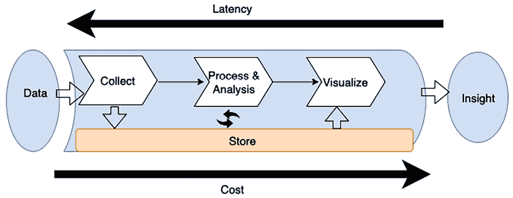

图 12.1：数据架构设计的大数据管道

如前图所示，大数据管道的标准工作流程包括以下步骤：

1.  数据通过适当的工具被收集（引入）。

1.  数据被持久存储。

1.  数据被处理或分析。数据处理/分析解决方案从存储中获取数据，进行操作，然后再次存储处理后的数据。

1.  数据随后被其他处理/分析工具或同一工具再次使用，以从数据中获取进一步的答案。

1.  为了使答案对业务用户有用，这些答案通常通过**商业智能**（**BI**）工具进行可视化，或被输入到机器学习算法中以做出未来预测。一旦适当的答案展示给用户，这将为他们提供能够进一步用于商业决策的数据洞察。

你在管道中部署的工具决定了你的*响应时间*，即数据创建时与你能够从中获得洞察时之间的延迟。考虑延迟时设计数据解决方案的最佳方式是确定如何平衡吞吐量和成本，因为更高的性能和更低的延迟通常会导致更高的价格。例如，金融交易平台需要实时分析，以便为用户提供即时洞察，从而做出快速决策。

为了实现这一目标，平台可能会采用昂贵的数据处理管道，其中包括内存数据库、实时流处理和高速数据摄取服务。该设置确保低延迟，使交易者能够即时响应市场变化。在这里，实时分析的业务需求证明了与低延迟架构相关的高成本是合理的。

# 设计大数据处理管道

许多大数据架构犯的一个关键错误是使用一个工具处理多个数据管道阶段。从数据存储和转换到可视化，管理端到端数据管道的服务器群可能是最直接的架构，但也是最容易出现管道故障的架构。这种紧密耦合的大数据架构通常无法为你的需求提供最佳的吞吐量和成本平衡。在设计数据架构时，请使用以下解释的 FLAIR 数据原则：

+   **F – 可查找性**：指的是轻松定位可用数据资产并访问其元数据的能力，包括诸如所有权、数据分类以及其他对于数据治理和合规性至关重要的属性。

+   **L – 血统**：追溯数据来源、跟踪其流动和历史的能力，并理解及可视化数据从源头到消费点的流动方式。

+   **A – 可访问性**：这涉及到请求和获取安全凭证的能力，凭证授予访问特定数据资产的权限。它还意味着需要支持高效数据访问的网络基础设施。

+   **I – 互操作性**：确保数据以大多数（如果不是全部）组织内部处理系统可以访问和使用的格式存储。

+   **R – 可重用性**：数据应使用已知的模式进行文档化，并且数据的来源应清晰注明。这个方面通常包括**主数据管理**（**MDM**）的原则，主数据管理关注于来自不同领域的关键数据的管理，以准确性和一致性为基础，提供一个单一的参考点。

大数据架构师建议解耦摄取、存储、处理和获取洞察之间的管道。将存储和处理解耦成多个阶段有几个优点，包括提高*容错能力*。例如，如果第二轮处理出现问题并且专门用于该任务的硬件发生故障，你就不必从管道的开始重新开始；系统可以从第二个存储阶段恢复。将存储从各个处理层解耦，允许你读写多个数据存储。

以下图示展示了在设计大数据架构管道时需要考虑的各种工具和过程：

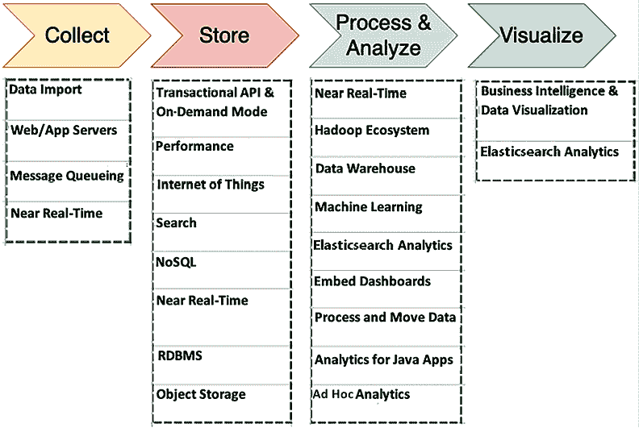

图 12.2：大数据架构设计的工具与过程

在确定适合你大数据架构的工具时，应该考虑以下因素：

+   你的数据结构

+   最大可接受延迟

+   最低可接受吞吐量

+   系统终端用户的典型访问模式

你的数据结构不仅影响你用来处理它的工具，还影响你存储它的位置。数据的排序以及每个存储和检索的对象大小也是重要的考虑因素。你的解决方案如何权衡延迟/吞吐量与成本决定了回答问题所需的时间。

用户访问模式是另一个需要考虑的关键因素。有些任务需要定期连接多个相关表，而其他任务则需要进行日常或不太频繁的数据存储。有些任务需要比较来自广泛数据源的数据，而其他任务只从一个非结构化表中提取数据。了解终端用户最常如何使用数据将帮助你确定大数据架构的广度和深度。让我们深入探讨每个过程及其涉及的工具。

# 数据摄取、存储、处理和分析

为了将原始数据转化为可以为企业决策和战略规划提供信息的可操作智能，数据需要通过几个关键阶段进行管理，从**数据摄取**开始——即从各种来源收集数据。这可以包括从用户生成的数据到机器日志，或者实时流数据。一旦收集，数据需要存储在**数据存储**中，这可以通过数据库、数据湖或云存储解决方案来实现，具体取决于数据类型和预期用途。

在存储之后，**数据处理和分析**进入关键环节，涉及对数据进行排序、聚合或转换为更易用的形式，之后可以对处理后的数据进行分析，提取有意义的洞察。分析可以从简单的查询和报告到复杂的机器学习算法和预测建模等多种形式。让我们详细了解这些阶段。

## 数据摄取

数据摄取是收集数据以进行传输和存储的行为。数据可以从很多地方进行摄取，主要分为数据库、流、日志和文件这几类。在这些类别中，数据库最为常见。这些数据库通常由应用程序的主要上游事务性系统组成，是数据的主要存储方式。它们可以是关系型数据库或非关系型数据库，并且有多种技术可以从中提取数据。

流是开放式的时间序列数据序列，例如来自网站的点击流数据或**物联网**（**IoT**）设备数据，通常通过我们托管的 API 发布。应用程序、服务和操作系统会生成日志。如下面的图所示，使用你所在环境收集的数据类型及其收集方式，来决定最适合你需求的摄取解决方案：

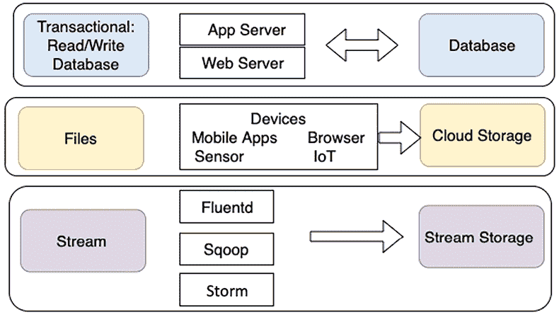

图 12.3：数据摄取类型

如图所示，事务性数据存储必须能够快速存储和检索数据。最终用户需要快速、简便的数据访问，这使得应用程序和 Web 服务器成为理想的摄取方式。出于同样的原因，NoSQL 和**关系数据库管理系统**（**RDBMS**）数据库通常是此类过程的最佳解决方案。

通过单个文件传输的数据通常来自连接的设备。与事务性数据相比，大量文件数据不需要快速存储和检索。对于文件数据，通常是单向传输，其中数据由多个资源生成，并摄取到单一的对象或文件存储中以备后用。

流数据，如点击流日志，应通过适当的解决方案摄取，例如**Apache Kafka**或**Fluentd**。Apache Kafka 是一个流行的选择，提供强大的发布-订阅功能，能够高效地处理大量数据。Fluentd 是另一种可用于数据摄取的工具，特别以其日志聚合能力而闻名。

最初，这些日志存储在流存储解决方案中，例如 Kafka，这样它们就可以进行实时处理和分析。长期存储这些日志，最好的方式是选择低成本的存储方案，如对象存储。

流式存储将你的数据采集系统（生产者）与处理系统（消费者）解耦。它为你的来数据提供持久的缓冲区。数据可以根据你的需求以不同的速率进行处理和传输。让我们了解一些流行的数据导入技术。

### 数据导入的技术选择

让我们看看一些流行的开源数据导入和传输工具：

+   **Apache DistCp**：DistCp 代表*分布式复制*，是 Hadoop 生态系统的一部分。DistCp 工具用于在集群内或集群之间复制大量数据。DistCp 通过利用 MapReduce 的并行处理分发能力，实现了高效和快速的数据复制。它将目录和文件分发为映射任务，从源到目标复制文件分区。DistCp 还在集群间进行错误处理、恢复和报告。

+   **Apache Sqoop**：Sqoop 也是 Hadoop 生态系统的一部分，帮助在 Hadoop 和关系型数据存储（如 RDBMS）之间转移数据。Sqoop 允许将数据从结构化数据存储导入到**Hadoop 分布式文件系统**（**HDFS**），并将数据从 HDFS 导出到结构化数据存储。Sqoop 使用插件连接器连接到关系数据库。你可以使用 Sqoop 扩展 API 构建新的连接器，或者使用其中之一支持 Hadoop 和标准关系数据库系统之间数据交换的连接器。

+   **Apache Flume**：Flume 是开源软件，主要用于导入大量日志数据。Apache Flume 可靠地收集和汇总数据，并将其分发到 Hadoop。Flume 促进了流式数据导入，并支持分析。

更多开源项目，如 Apache Storm 和 Apache Samza，可用于流处理，可靠地处理无界数据流。

### 将数据导入云端

将数据导入云端对于管理和利用大数据至关重要。三大云服务提供商——AWS、**Google Cloud Platform**（**GCP**）和 Azure——提供各种数据导入服务。每个服务商都有独特的功能和能力，适用于不同的需求和数据量。让我们来看看这三家云服务商的一些独特特点：

+   AWS 数据导入服务：

    +   **AWS Direct Connect**：提供一个高速、私有的网络连接到 AWS，减少延迟并增加带宽。它非常适合转移大量数据，并提供比基于互联网的传输更稳定的网络速度。

    +   **AWS Snowball 和 Snowmobile**：这些服务提供用于将大量数据（以 TB 和**PB**（**PBs**）为单位）转移到 AWS 的物理设备。Snowball 适用于数百 TB，而 Snowmobile 则可以处理单次转移高达 100PB 的数据，适合处理庞大的数据集。

    +   **AWS 数据库迁移服务（DMS）**：该服务帮助将数据库迁移到 AWS，支持同构和异构迁移，并能通过**变更数据捕获**（**CDC**）处理持续的数据复制。

+   GCP 数据摄取服务：

    +   **Google Cloud 存储转移服务**：该服务允许从在线数据源（如 Amazon S3 和 HTTP/HTTPS 位置）以及本地数据存储将大量数据转移到 Google Cloud Storage。

    +   **Pub/Sub**：该服务提供实时消息传递和流数据摄取。它是一个可扩展且灵活的服务，能够摄取如日志和事件数据等流数据，以进行实时分析。

    +   **数据流**：一个集成服务，既支持数据摄取也支持数据处理。它非常适合**提取、转换和加载**（**ETL**）任务以及实时事件流处理。

+   Azure 数据摄取服务：

    +   **Azure 数据工厂**：该数据集成服务支持本地和云端数据的迁移与转换。它可以从各种数据源摄取数据，利用计算服务如 Azure HDInsight 和 Azure Batch 处理数据，并将处理后的数据发布到如 Azure SQL 数据仓库等存储解决方案。

    +   **Azure 事件中心**：一个强大且可扩展的数据流平台和事件摄取服务，Azure 事件中心能够每秒处理数百万个事件，使其成为处理来自各种来源（如应用程序、网站或物联网设备）的实时数据分析的理想解决方案。

    +   **Azure 导入/导出服务**：该服务旨在支持大数据量的批量传输到 Azure Blob 存储和 Azure Files，利用物理磁盘进行数据传输，是在网络传输大数据量可能过慢或过于昂贵的情况下的理想选择。

每个云服务提供商都提供一套独特的工具，以满足各种数据摄取需求，从实时流数据到大规模数据迁移，确保大数据管理中的灵活性和可扩展性。

流数据的摄取与分析变得越来越重要。你将在*流数据存储*部分了解更多关于流数据的内容。让我们进一步了解你可以使用的技术，帮助你选择合适的存储及其可用的选择。

## 存储数据

在为大数据环境配置存储时，最常见的错误之一是使用单一解决方案，通常是关系数据库管理系统（RDBMS）来处理所有数据存储需求。

你将有许多工具可用，但它们需要针对它们需要完成的任务进行优化。一个解决方案不一定是满足你所有需求的最佳选择；对于你的环境，最好的解决方案可能是多种存储方案的结合，这些方案能够仔细平衡延迟与成本。理想的存储解决方案使用适合特定任务的工具。下图结合了与你的数据和相关存储选择相关的多个因素：

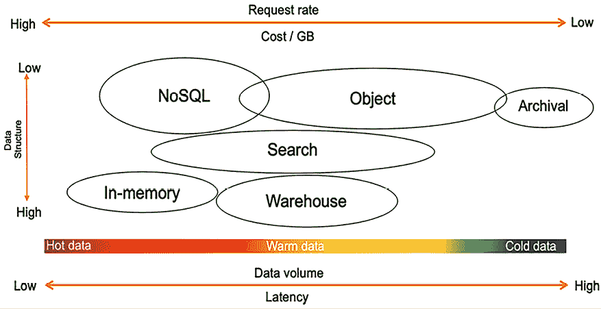

图 12.4：理解数据存储

如下图所示，选择数据存储方案取决于以下因素：

+   **你的数据结构化程度如何？** 它是否遵循特定的、格式良好的架构，例如 Apache 日志（日志通常结构不佳，不适合关系型数据库）、标准化的数据协议和合同接口？还是完全任意的二进制数据，例如图像、音频、视频和 PDF 文档？或者它是半结构化的，具有一般的结构，但记录间可能存在较大的变化，例如 JSON 或 CSV？

+   **新数据需要多快才能供查询使用？** 是实时场景，决策会随着新记录的流入而做出，例如活动经理根据转化率调整，或者网站根据用户行为相似性做出产品推荐？还是日常、每周或每月批量处理场景，例如模型训练、财务报表准备或产品性能报告？或者是介于两者之间的场景，例如用户参与邮件，它不需要实时响应，你可以在用户行为与触发点之间有几分钟甚至几小时的缓冲时间？

+   **数据摄取的大小是多少？** 数据是否随着记录的到来而被摄取，例如 REST API 中的 JSON 负载，最佳情况下至少为几 KB？是大量记录同时到达，例如系统集成和第三方数据源？还是介于两者之间，例如通过聚合几个微批次的点击流数据来进行更高效的处理？

+   **数据的总量及其增长率是多少？** 你是在 GB 或 TB 范围内，还是打算存储 PB 或 **EB**（**艾克萨字节**）级别的数据？这些数据中有多少是你的特定分析用例所需的？你大多数查询是否仅需要特定的滚动时间窗口？或者，你是否需要一个机制来查询整个历史数据集？

+   **存储和查询数据在特定位置的成本是多少**？在任何计算环境中，我们通常会看到性能、韧性和低成本之间的*约束三角*。你希望存储的性能和韧性越好，它的成本就越高。你可以对 PB 级别的数据进行快速查询，但为了满足成本要求，你可以选择以压缩格式查询 TB 级别的数据。

最后，针对数据将运行什么类型的分析查询？它是为具有固定指标集并支持深入分析的仪表盘提供数据吗？它会参与由不同业务维度汇总的大型数值聚合吗？还是它将用于诊断，利用字符串标记化进行全文搜索和模式分析？

当你确定了数据的特征并了解了数据结构后，你可以评估需要使用什么解决方案来存储数据。让我们了解一下用于存储数据的各种解决方案。

### 数据存储的技术选择

正如我们所讨论的，单一工具只能完成少数任务。你应该根据不同的工作选择合适的工具，数据湖让你能够构建一个高度可配置的大数据架构，以满足你的特定需求。业务问题需要更具体、更深刻、更复杂，单一工具无法解决一切，尤其是在大数据和分析方面。

例如，热数据需要在内存中存储和处理，因此缓存或内存数据库如 Redis 或 SAP HANA 是合适的选择。AWS 提供了 ElastiCache 服务，提供托管的 Redis 或 memcached 环境。当面对高速但小型的记录时，NoSQL 数据库是理想的选择，例如用户会话信息或物联网数据。NoSQL 数据库也适用于内容管理，用于存储数据目录。让我们了解一下最常用的结构化数据存储。

### 结构化数据存储

结构化数据存储已经存在了几十年，是存储数据最熟悉的技术选择。大多数事务性数据库，如 Oracle、MySQL、SQL Server 和 PostgreSQL，都是基于行的，因为它们需要处理来自软件应用程序的频繁数据写入。组织通常会重新利用事务性数据库用于报告目的，这需要频繁的数据读取，但数据写入较少。随着对数据读取需求的增加，更多的创新正进入结构化数据存储的查询方式，例如列式文件格式，这有助于提高分析需求的数据读取性能。

基于行的格式将数据以行的形式存储在文件中。基于行的写入是将数据写入磁盘的最快方式，但并不一定是最快的读取选项，因为你需要跳过大量不相关的数据。基于列的格式将所有列的值一起存储在文件中，这有助于更好的压缩，因为相同的数据类型会被分组。它通常还提供更好的读取性能，因为你可以跳过不需要的列。

让我们看看结构化数据存储的常见选择。例如，您需要从包含五十列的订单表中查询某个月的总销售额。使用行式架构时，查询将扫描整个表的所有五十列。而在列式架构中，查询将只扫描订单销售列，从而提高数据查询性能。让我们进一步了解关系型数据库，专注于事务数据和数据仓库，以应对数据分析的需求。

#### 关系型数据库

关系型数据库管理系统（RDBMS）更适用于**在线事务处理**（**OLTP**）应用。一些流行的关系型数据库包括 Oracle、MSSQL、MariaDB、PostgreSQL 等。这些传统数据库中的一些已经存在了几十年。许多应用程序，包括电子商务、银行业务和酒店预订，都是由关系型数据库支撑的。关系型数据库非常擅长处理需要在表之间进行复杂连接查询的事务数据。从事务数据的需求来看，关系型数据库应遵循**原子性、一致性、隔离性和持久性**（**ACID**）原则，如下所示：

+   **原子性**：原子性意味着事务将从头到尾完整执行，如果发生任何错误，整个事务将回滚。

+   **一致性**：一致性意味着所有数据在事务完成时应该被提交到数据库。

+   **隔离性**：隔离性要求多个事务可以并发执行，并且互不干扰。

+   **持久性**：在发生中断（如网络或电力故障）时，事务应能恢复到最后已知的状态。

关系型数据库中的数据通常会被卸载到数据仓库解决方案中，以进行报告和聚合处理。让我们深入了解数据仓库的更多内容。

#### 数据仓库

数据仓库是存储来自一个或多个来源的数据积累的中央存储库。它们存储当前和历史数据，帮助创建业务数据分析的分析报告。然而，数据仓库集中存储来自各种系统的数据，但不能将其视为数据湖。数据仓库只处理结构化的关系型数据，而数据湖则可以处理结构化和非结构化数据，如 JSON 日志和 CSV 数据。

数据仓库数据库更适用于**在线分析处理**（**OLAP**）应用。这些数据库经过优化，能够处理涉及大量数据读取的操作，从而实现数据的聚合和汇总，提取有价值的业务洞察。

以银行场景为例，假设某银行维护一个数据仓库，存储关于客户账户、交易、贷款详情和分支信息的全面数据。此外，银行还收集并存储客户互动、服务使用和在线银行活动的数据，存在于相关系统中。

通过 OLAP，银行可以对这些合并的数据进行复杂分析。它可以查询数据仓库，发现趋势，例如识别最受欢迎的账户或贷款类型、分析交易量随时间的变化，或评估线上与分行银行服务的使用模式。这种分析能力使得银行能够做出有关产品提供、客户服务改进和运营策略的明智决策，从而提升客户满意度并推动业务增长。

数据仓库提供对大量结构化数据的快速聚合能力。虽然像 Amazon **Redshift**、**Netezza** 和 **Teradata** 这样的技术被设计用来快速执行复杂的聚合查询，但它们必须针对高并发写入进行优化。因此，数据需要分批加载，这使得数据仓库无法提供对热数据的实时洞察。

现代数据仓库使用列式存储来增强查询性能。此类数据仓库的例子包括 Amazon Redshift、Snowflake 和 Google BigQuery。由于列式存储和提高的 I/O 效率，这些数据仓库提供了快速的查询性能。此外，像 Amazon Redshift 这样的数据仓库系统通过将查询并行化处理，跨多个节点执行，并利用**大规模并行处理**（**MPP**），进一步提高了查询性能。

列式存储通过将数据按列而非按行存储，增强了查询性能，支持更有效的数据压缩、选择性数据读取和更快的操作。该方法允许更有效的压缩，因为相似的数据按顺序存储，这有助于在查询时仅访问必要的列，从而加速数据检索。它还通过将相关数据加载到内存中，优化了 CPU 缓存的利用率，提高了处理速度。此外，列式存储支持大规模并行处理，多个处理器可以同时处理不同的数据片段，显著提升了涉及大型数据集并需要快速聚合和过滤的分析任务的性能。

像 Amazon Redshift 这样的数据仓库解决方案可以处理 PB 级别的数据，并提供解耦的计算和存储能力以节省成本。除了列式存储，Redshift 还使用数据编码、分布和区域映射来提升查询性能。更传统的行式数据仓库解决方案包括 Netezza、Teradata 和 Greenplum。

数据仓库导致不同应用程序的数据物理分离，迫使数据架构师围绕这些仓库构建新的基础设施。随着企业数据的多样性增加，包括文本、物联网数据、图像、音频和视频，传统数据仓库的局限性变得更加明显。此外，机器学习和**人工智能**（**AI**）的出现带来了迭代算法，这些算法需要直接访问数据，而不依赖 SQL，从而突显了传统数据仓库模型的局限性。你将在本章后续的*设计大数据架构*部分了解如何克服这些挑战。

### NoSQL 数据库

NoSQL 数据库，如 DynamoDB、Cassandra 和 MongoDB，解决了你在关系型数据库中常遇到的扩展性和性能问题。顾名思义，NoSQL 是一种非关系型数据库。NoSQL 数据库存储数据时没有明确和结构化的机制将来自不同表的数据链接起来（没有连接、外键或强制规范化）。

NoSQL 利用多种数据模型，包括列式、键值、搜索、文档和图形。NoSQL 数据库提供可扩展的性能、高可用性和弹性。NoSQL 通常不强制执行严格的模式，每个项可以有任意数量的列（属性），这意味着同一表中的一行可能只有四列，而另一行可能有十列。分区键用于检索包含相关属性的值或文档。NoSQL 数据库高度分布式，可以进行复制。它们是持久的，并且在高度可用的情况下不会遇到性能问题。

#### SQL 与 NoSQL 数据库的对比

SQL 数据库已存在数十年，大多数人已经熟悉关系型数据库。让我们了解一下 SQL 和 NoSQL 数据库之间的一些显著区别：

| **属性** | **SQL 数据库** | **NoSQL 数据库** |
| --- | --- | --- |
| 数据模型 | SQL 数据库中的关系模型将数据规范化为包含行和列的表。一个模式包括表、列、表之间的关系、索引以及其他数据库元素。 | NoSQL 数据库在不强制执行固定模式的情况下运行，提供了在数据存储和检索方面的灵活性。它们通常利用分区键从列集访问值。这种类型的数据库非常适合存储半结构化数据，包括 JSON、XML 等格式，以及各种其他文档类型，如数据目录和文件索引。 |
| 事务 | 基于 SQL 的传统关系数据库管理系统（RDBMS）支持并符合 ACID 事务数据属性。 | NoSQL 数据库有时会牺牲某些 ACID 属性，这些属性是传统 RDBMS 的特征，以便促进横向扩展并增强数据模型的灵活性。 |
| 性能 | 基于 SQL 的关系型数据库（RDBMS）曾用于在存储昂贵时优化存储，并最小化磁盘占用。对于传统的关系型数据库系统，性能主要依赖于磁盘。需要创建索引和修改表结构来实现性能查询优化。 | 在 NoSQL 系统中，性能受多种因素的显著影响，例如底层硬件集群的规模、网络延迟以及应用程序与数据库交互的方式。 |
| 扩展性 | 基于 SQL 的关系型数据库（RDBMS）在高配置硬件的支持下，垂直扩展最为直接。额外的工作需要将关系表扩展到分布式系统，例如执行数据分片。 | NoSQL 数据库旨在水平扩展，利用由经济型硬件组成的分布式集群。该方法旨在提高吞吐量，同时最小化对延迟的影响。 |

表 12.1 – SQL 与 NoSQL 数据库对比

根据你的数据类型，存在多种类别的 NoSQL 数据存储，用于解决特定问题。让我们了解一下 NoSQL 数据库的类型。

#### NoSQL 数据库的类型

以下是主要的 NoSQL 数据库类型：

+   **列式数据库**：Apache Cassandra 和 Apache HBase 是常见的列式数据库。列式数据存储可以帮助你在查询数据时扫描特定的列，而不是扫描整行数据。假设一个商品表有十列和一百万行数据，如果你想查询库存中商品的数量，列式数据库会将查询应用到商品数量这一列，而不是扫描整个表。

+   **文档数据库**：一些最流行的文档数据库有 **MongoDB**、**Couchbase**、**MarkLogic**、**DynamoDB**、**DocumentDB** 和 **Cassandra**。你可以使用文档数据库以 JSON 和 XML 格式存储半结构化数据。

+   **图数据库**：流行的图数据库有 **Amazon Neptune**、**JanusGraph**、**TinkerPop**、**Neo4j**、**OrientDB**、**GraphDB** 和 Spark 中的 **GraphX**。图数据库存储顶点和顶点之间的连接，称为 **边**。图可以建立在关系型和非关系型数据库之上。

+   **内存键值存储**：一些最流行的内存键值存储有 Redis 和 Memcached。它们将数据存储在内存中，以支持重度读取应用。任何来自应用的查询首先会访问内存数据库，如果数据已存在于缓存中，就不会访问主数据库。内存数据库适用于存储用户会话信息，这些信息会涉及复杂的查询和频繁请求数据，例如用户资料。

NoSQL 有许多应用场景，但你必须为所有数据建立索引才能进行搜索。让我们来了解一下搜索数据存储。

### 搜索数据存储

Elasticsearch 服务是最受欢迎的大数据搜索引擎之一，广泛应用于点击流分析和日志分析等大数据场景。搜索引擎非常适合处理可以按需查询的“热数据”，这些数据可以跨多个属性进行查询，包括字符串标记。

Amazon OpenSearch 服务提供数据搜索功能，并支持开源的 Elasticsearch 集群，包括 API 访问。它还提供 Kibana 作为可视化机制，用于搜索已索引的数据存储。AWS 负责集群的容量管理、扩展和补丁处理，消除了任何操作上的开销。日志搜索和分析是 OpenSearch 的一个热门大数据应用场景，它帮助你分析来自网站、服务器群集、物联网传感器等的日志数据。银行、游戏、营销、应用监控、广告技术、欺诈检测、推荐系统以及物联网等行业的各种应用都利用 OpenSearch 和 Elasticsearch。基于机器学习的搜索服务，如 Amazon Kendra，也提供更先进的搜索能力，利用**自然语言处理**（**NLP**）。

### 非结构化数据存储

当你考虑非结构化数据存储的需求时，Hadoop 是一个完美的选择，因为它可扩展、可扩展且非常灵活。它可以运行在消费者硬件上，拥有庞大的工具生态系统，并且看起来具有成本效益。Hadoop 使用*主从节点*模型，其中数据在多个子节点之间分配，主节点协调任务以对数据进行查询。Hadoop 系统基于 MPP（大规模并行处理），使得在所有数据类型（无论是结构化还是非结构化数据）上执行查询变得快速。

当创建一个 Hadoop 集群时，从服务器创建的每个子节点都会附带一块称为本地 HDFS 磁盘存储的磁盘存储块。你可以使用常见的处理框架（如 Hive、Pig 和 Spark）对存储的数据进行查询。然而，本地磁盘上的数据仅在相关实例的生命周期内存在。

如果你使用 Hadoop 的存储层（HDFS）来存储数据，你就将存储和计算结合在一起。增加存储空间意味着需要添加更多的机器，这也增加了计算能力。为了最大化灵活性和成本效益，你需要将计算和存储分开，并独立扩展它们。总体而言，对象存储更适合用来存储数据湖中的各种数据，能够以成本效益高且高效的方式存储数据。由对象存储支持的基于云的数据湖提供灵活性，可以将计算和存储解耦。让我们进一步了解对象存储。

### 对象存储

对象存储指的是使用单元（通常称为对象）存储和访问的数据，这些对象存储在桶中。在对象存储中，文件或对象不会被拆分成数据块，而是将数据和元数据一起存储。桶中存储的对象数量没有限制，且它们是通过 API 调用（通常通过`HTTP`、`GET` 或 `PUT`）来读取和写入桶中的数据。通常，对象存储不会作为操作系统上的文件系统挂载，因为基于 API 的文件请求的延迟以及缺乏文件级锁定会导致作为文件系统的性能较差。

对象存储提供了扩展性，并且具有平坦的命名空间，减少了管理开销和元数据管理。随着公共云的普及，对象存储变得越来越流行，并且是构建云中可扩展数据湖的首选存储方案。Amazon S3、Azure Blob Storage 和 Google Cloud Storage（GCP）是最受欢迎的对象存储选项。

### 向量数据库（VectorDB）

**VectorDB** 最近因为生成式 AI 和机器学习的关注度提高而变得非常流行。向量数据通常指高维数据点，通常用于机器学习模型的上下文中。例如，图像、文本或音频文件可以被转换为向量表示（一个数字列表），以捕捉其核心特征。这些向量被用于机器学习任务，如相似性搜索（寻找最相似的项目）、聚类或分类。例如，如果你想进行客户细分，可以使用向量嵌入将客户根据其购买行为或偏好聚类成不同的群体。通过分析客户的购买历史或与网站的互动的向量表示，企业可以识别出相似客户的不同群体。这样，企业可以定制营销策略、个性化优惠，或为每个特定客户群体开发有针对性的产品，从而提升客户满意度和忠诚度。

**VectorDB** 或向量数据库是数据库技术领域中新兴的一类，主要聚焦于高效处理向量数据。这种数据类型通常与机器学习相关，尤其是在图像识别、自然语言处理（NLP）和推荐系统等领域。

向量数据库的核心功能是高效存储和管理向量数据。这涉及到存储高维数据点，并优化数据库架构，以支持快速高效的查询，通常以最近邻搜索的形式进行。

高级向量数据库可能会将机器学习模型直接集成到数据库中，从而实现实时将原始数据（如图像或文本）转换为向量，然后可以存储或查询这些向量。

一个常见的使用案例是找到与给定查询项相似的项目。例如，数据库可以快速检索与查询图像最相似的图像用于图像搜索。向量数据库可以通过将用户资料与产品向量匹配来为推荐引擎提供支持，从而建议相关的商品。它们还可以高效地处理和查询大规模的文本数据，将其转换为向量空间，以支持各种自然语言处理应用。以下是**VectorDB**的优点：

+   **速度和效率**：专门针对处理高维数据优化的向量数据库，比传统数据库执行相似性搜索要快得多。

+   **可扩展性**：它们设计为能随着数据量的增长进行扩展，这对于机器学习应用尤为重要，因为数据集通常非常庞大。

+   **与 ML/AI 管道的集成**：与 ML 工作流的无缝集成，允许直接查询和操作向量数据。

让我们也来看看**VectorDB**的一些缺点：

+   **复杂性**：管理和索引高维向量数据可能会非常复杂。

+   **资源密集型**：这些数据库可能需要大量计算资源，尤其是在处理大规模数据集时。

+   **新兴技术**：由于相对较新，围绕向量数据库的生态系统可能不如传统数据库成熟，这可能是企业采用时需要考虑的因素。

向量数据库是朝向专门化数据库的一部分趋势，专为特定类型的数据和工作负载设计，尤其是在机器学习和人工智能领域。它们代表了数据库技术发展的重要一步，跟上数据科学和分析进展的步伐。随着这项技术的成熟，它很可能成为重度投资于机器学习和人工智能的组织数据基础设施的核心组成部分。

### 区块链数据存储

区块链技术通常与加密货币相关联，提供了一种在金融以外的多个行业中变革性的数据管理和交易处理方法。区块链数据存储为去中心化验证提供了一种强大的机制，根本改变了交易如何在各个行业中记录和验证。在基于区块链的土地登记系统中，例如，每一笔涉及房地产买卖的交易都会记录在共享的账本上，所有网络参与者可以即时访问和验证。这种透明性与传统的中心化系统形成了对比，后者由单一权威机构管理数据，从而减少了欺诈风险，并增强了参与者之间的信任。

区块链的不可篡改性和安全性特点进一步增加了其在各个行业中的应用。例如，在医疗领域，区块链确保一旦患者记录被录入系统，就保持不变且安全。这种不可篡改性对医疗专业人员至关重要，因为他们依赖于准确的历史数据来做出治疗决策。此外，区块链的加密安全性保护了敏感的健康信息，只允许授权用户访问，从而确保患者隐私。这些特性使区块链在数据完整性和安全性至关重要的行业中成为宝贵的工具。

为了实现不可篡改性，区块链网络发挥了关键作用。区块链是一种去中心化的数字账本，用于记录多个计算机中的交易，从而确保数据的完整性和安全性。在区块链网络中，交易被打包成区块，每个区块都与前一个区块相链接，形成一条链。这种结构使得没有网络参与者的共识，几乎不可能事后修改信息。以下是区块链网络的几种类型：

+   **公有区块链**：以太坊通常用于**去中心化应用**（**DApps**）和智能合约。以太坊是开放的，任何人都可以加入并参与网络。例如，开发者可能会在以太坊网络上创建一个**去中心化金融**（**DeFi**）的 DApp，允许用户进行不依赖传统银行的金融交易。

+   **私有区块链**：这种类型的区块链由一个组织进行限制和控制，提供更多的隐私性和控制权。例如，一家制药公司可能会使用私有区块链来管理其药物研发过程。区块链的访问权限仅限于公司研究人员和监管机构，确保敏感数据保持机密。

+   **联盟区块链**：这涉及多个组织共同管理一个区块链网络，平衡去中心化和控制的关系。一个例子是，一群航运公司组成联盟，共同管理一个共享的区块链。这个区块链可以用于追踪全球范围内的货物运输，每家公司在网络中维护一个节点。

像**亚马逊网络服务**（**AWS**）这样的云服务提供商提供区块链即服务，简化了区块链网络的设置和管理。亚马逊**量子账本数据库**（**QLDB**）是一个集中的账本数据库的例子，它提供不可篡改和加密验证的交易记录。流行的托管区块链服务包括**亚马逊托管区块链**（**AMB**）、**R3 Corda**、**以太坊**和**Hyperledger**，满足从金融交易到供应链管理等各种需求。

流数据处理曾经是一个小众技术，但现在它变得越来越普遍，因为每个组织都希望从实时数据处理中获取快速的洞察。让我们了解更多关于流数据存储的信息。

### 流数据存储

流数据具有持续的数据流，没有开始和结束。来自各种实时资源的大量数据，如股票交易、自动驾驶汽车、智能空间、社交媒体、电商、游戏、打车应用等，需要快速存储和处理。Netflix 根据你正在观看的内容提供实时推荐，Lyft 利用流技术将乘客与司机实时连接。

存储和处理流数据具有挑战性，因为数据是持续不断流入的，且无法预测存储容量。除了数据量大，流数据的速度也非常快，这需要一个可扩展的存储系统来存储数据并提供回放的能力。随着时间推移，数据流可能会变得非常昂贵且管理复杂。流数据存储的流行服务有 Apache Kafka、Apache Flink、Apache Spark Structured Streaming、Apache Samza 和 Amazon Kinesis。AWS 提供了托管 Kafka 服务，称为 Amazon Managed Streaming for Kafka。让我们深入了解流数据摄取和存储技术：

+   **Amazon Kinesis**：Amazon Kinesis 提供了三种能力。第一种是**Kinesis Data Streams**（**KDS**），它是一个存储原始数据流的地方，用于对所需记录进行下游处理。第二种是**Amazon Kinesis Data Firehose**（**KDF**），它促进将这些记录传输到常见的分析环境，如 Amazon S3、Elasticsearch、Redshift 和 Splunk。Firehose 会自动缓冲所有流中的记录，并根据你配置的时间或数据大小阈值，或第一个达到的条件，将记录作为单个文件或一组记录刷新到目标位置。

+   第三种是**Kinesis Data Analytics**（**KDA**），它使用 Apache Flink 对流记录进行分析。输出结果随后可以流入你创建的进一步流，以构建一个完整的无服务器流处理管道。

+   **Amazon Managed Streaming for Kafka**（**MSK**）：MSK 是一个完全托管的、高可用且安全的服务。Amazon MSK 在 AWS 云中运行基于 Apache Kafka 的应用程序，无需 Apache Kafka 基础设施管理的专业知识。Amazon MSK 提供一个托管的 Apache Kafka 集群和一个 ZooKeeper 集群，用于维护配置并构建数据摄取和处理的生产者/消费者。

+   **Apache Flink**：Flink 是另一个开源平台，用于流数据和批量数据处理。Flink 由一个流数据处理引擎组成，可以处理有界和无界数据流。一个有界数据流有明确的开始和结束，而无界数据流有开始但没有结束。Flink 可以在其流引擎上执行批处理，并支持批优化。

+   **Apache Spark 流处理**：Spark 流处理帮助以高吞吐量和容错、可扩展的方式摄取实时数据流。Spark 流处理将传入的数据流分成多个批次，然后发送到 Spark 引擎进行处理。Spark 流处理使用 DStreams，DStreams 是 **弹性分布式数据集**（**RDDs**）的序列。

+   **Apache Kafka**：Kafka 是最流行的开源流处理平台之一，帮助您发布和订阅数据流。Kafka 集群将记录的流存储在 Kafka 主题中。生产者可以在 Kafka 主题中发布数据，消费者可以通过订阅 Kafka 主题来获取输出数据流。

+   流式存储需要持续保存数据流，并在必要时提供保持顺序的能力。您将在接下来的部分中了解更多关于流式架构的内容，*流式数据架构*。

# 云数据存储

云数据存储是现代 IT 基础设施中的关键方面，提供了可扩展性、灵活性和成本效益。领先的云服务提供商 —— AWS、GCP 和 Azure —— 提供了多种数据存储选项，以满足不同需求，从简单的文件存储到复杂的数据库和数据仓库解决方案。以下列出了这些平台上云数据存储的主要特点。

+   AWS：

    +   **Amazon 简单存储服务 (S3)**：这是一种高度可扩展的对象存储服务，以其高数据可用性、安全性和性能而闻名。Amazon S3 功能多样，适用于存储各种场景下的数据量，如网站、移动应用、备份与恢复、档案存储、企业应用、物联网设备和大数据分析。

    +   **Amazon 弹性块存储 (EBS)**：EBS 为 EC2 实例提供块级存储卷。它特别适合需要一致和低延迟性能的数据，如数据库或 ERP（企业资源规划）系统。

    +   **Amazon 关系数据库服务 (RDS)**：RDS 简化了在云中设置、操作和扩展关系数据库的过程。它提供具有可调容量的高性价比解决方案，同时自动化了许多与数据库管理相关的耗时任务。

    +   **Amazon S3 Glacier**：此服务为归档和长期备份提供安全、持久和低成本的云存储。Amazon S3 Glacier 适合存储访问频率较低的数据，提供长期数据保留的解决方案。

+   GCP：

    +   **Google Cloud Storage**：为各类公司提供对象存储。它高度可扩展且灵活，为高需求应用和工作负载提供安全、持久的存储。

    +   **持久磁盘**：为 Google Compute Engine 实例提供块存储。它提供高性能的 SSD 和 HDD 存储，可以附加到运行在 Compute Engine 或 **Google Kubernetes Engine**（**GKE**）上的实例。

    +   **Cloud SQL**：一个完全托管的数据库服务，使得在 Google Cloud 上设置、维护、管理和操作关系型数据库变得更加简单。

    +   **Google Cloud Bigtable**：一个可扩展、完全托管的 NoSQL 数据库服务，适用于大规模的分析和操作工作负载。

+   Microsoft Azure：

    +   **Azure Blob 存储**：这是 Azure 的面向云的对象存储解决方案。它在存储大量非结构化数据（如文本或二进制数据）方面表现卓越。它包括各种类型的内容，如文档、媒体文件、备份和日志，使其在广泛的使用场景中具有高度的灵活性。

    +   **Azure 文件存储**：提供基于云的、完全托管的文件共享，使用标准的 SMB 协议进行访问。此服务对于希望将现有本地文件共享迁移到云环境的企业尤其有用。

    +   **Azure SQL 数据库**：一个全面的、完全托管的云关系型数据库服务。它提供了 SQL Server 的功能，但无需大量的基础设施和数据库管理任务，从而简化了数据库管理。

    +   **Azure 磁盘存储**：这提供了高性能、可靠的块存储，用于 Azure 虚拟机。Azure 磁盘存储包括 SSD 和 HDD 选项，满足从高速性能到成本效益等各种需求。

跨这些平台的云数据存储服务旨在提供安全、可扩展且易于访问的存储解决方案，适应各种应用和使用场景。每项服务都有其特定的优势，适用于不同的性能、可扩展性、数据访问和成本要求。

一旦你采集并存储了数据，按所需结构处理数据是至关重要的，这样才能可视化并分析这些数据，从而得出商业洞察。让我们进一步了解数据处理和转换。

## 数据处理和执行分析

数据分析是将数据采集、转换和可视化的过程，用于发现有价值的商业决策洞察。在过去的十年里，收集的数据比以往任何时候都多，客户希望能从他们的数据中获得更多的洞察。

这些客户还希望在最短的时间内获得这些洞察，有时甚至是实时的。他们希望能通过更多的即席查询来回答更多的商业问题。为了回答这些问题，客户需要更强大和高效的系统。

批处理通常涉及查询大量的冷数据。在批处理过程中，可能需要数小时才能回答业务问题。例如，你可能会使用批处理在月末生成账单报告。实时流处理通常涉及查询少量的热数据，并且只需很短的时间就能得到答案。基于 MapReduce 的系统（如 Hadoop）是支持批处理作业的平台示例，而数据仓库则是支持查询引擎平台的示例。

流数据处理活动摄取数据序列，并根据每条数据记录逐步更新功能。通常，它们会摄取持续产生的数据流记录，如计量数据、监控数据、审计日志、调试日志、网站点击流和设备、人员及实物商品的定位追踪事件。

以下图示展示了一个数据湖流水线，利用 AWS 云技术栈来处理、转换和可视化数据：

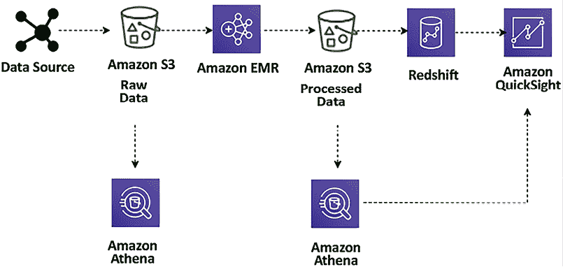

图 12.5：用于大数据处理的数据湖 ETL 流水线

在这里，ETL 流水线使用 Amazon Athena 对存储在 Amazon S3 中的数据进行临时查询。来自各种数据源（例如，Web 应用服务器）摄取的数据生成日志文件，这些日志文件会持久化到 S3 中。然后，这些文件通过使用 Amazon **Elastic MapReduce**（**EMR**）进行转换和清洗，形成一个有意义洞察所需的统一格式，并加载到 Amazon S3 中。Amazon EMR 提供了一个托管的 Hadoop 服务器，用于在云中使用各种开源技术（如 **Hive**、**Pig** 和 **Spark**）进行数据处理。

这些转换后的文件通过 `COPY` 命令加载到 Amazon Redshift 中，并使用 Amazon QuickSight 进行可视化。通过使用 Amazon Athena，你可以在数据存储和转换后（包括汇总数据集）直接从 Amazon S3 查询数据。你可以通过 Amazon QuickSight 可视化 Athena 中的数据。你可以轻松查询这些文件，而无需改变现有的数据流。

让我们来看一些流行的数据处理工具。

### 数据处理与分析的技术选择

以下是一些最受欢迎的数据处理技术，它们帮助你对大量数据进行转换和处理：

+   **Apache Hadoop** 使用分布式处理架构，在该架构中，任务被映射到一群商品服务器上进行处理。分配到集群服务器上的每一项工作可以在任何服务器上运行或重新运行。集群服务器通常使用 HDFS 将数据本地存储以供处理。Hadoop 框架将一个大任务拆分为离散的任务，并进行并行处理。它支持在大量 Hadoop 集群上进行大规模扩展。它还设计了容错机制，每个工作节点定期将其状态报告给主节点，主节点可以从未响应的集群重新分配工作。与 Hadoop 一起使用的一些最受欢迎的框架包括 **Hive**、**Presto**、**Pig** 和 **Spark**。

+   **Apache Spark** 是一个内存处理框架。Apache Spark 是一个大规模并行处理系统，具有不同的执行器，可以将 Spark 作业拆解并并行运行任务。为了提高作业的并行度，可以向集群添加节点。Spark 支持批处理、交互式和流式数据源。Spark 使用 **有向无环图**（**DAGs**）来执行作业的所有阶段。DAGs 可以跟踪作业期间的数据或血统变换，并通过将 DataFrames 存储在内存中有效地最小化 I/O。Spark 还具有分区感知功能，以避免网络密集型的洗牌操作。

+   **Hadoop 用户体验**（**HUE**）允许你通过基于浏览器的 **用户界面**（**UI**）而不是命令行，在集群上运行查询和脚本。HUE 提供了 UI 中最常用的 Hadoop 组件。它支持基于浏览器的查看和跟踪 Hadoop 操作。多个用户可以通过 HUE 的登录门户访问集群，管理员可以手动或通过 **轻量目录访问协议**（**LDAP**）、**可插拔认证模块**（**PAM**）、**简单和保护的 GSSAPI 协商机制**（**SPNEGO**）、OpenID、OAuth 和 **安全声明标记语言 2.0**（**SAML2**）认证来管理访问。HUE 允许实时查看日志，并提供元存储管理器来操作 Hive 元存储内容。

+   **Pig** 通常用于在将大量原始数据存储为结构化格式（如 SQL 表格）之前进行处理。Pig 非常适合用于 ETL 操作，如数据验证、加载、转换和将来自多个来源的多种格式的数据进行合并。除了 ETL，Pig 还支持关系型操作，如嵌套数据、联接和分组。Pig 脚本可以输入非结构化和半结构化数据（如 Web 服务器日志或点击流日志）。相比之下，Hive 始终对输入数据强制执行模式。Pig Latin 脚本包含过滤、分组和联接数据的指令，但 Pig 并不打算作为查询语言。Hive 更适合用于查询数据。Pig 脚本会根据 Pig Latin 脚本中的指令编译并运行，以转换数据。

+   **Hive** 是一个开源的数据仓库和查询包，运行在 Hadoop 集群之上。能够使用 SQL 是一项有助于团队轻松过渡到大数据世界的技能。Hive 使用一种类似 SQL 的语言，称为 **Hive 查询语言**（**HQL**），使得在 Hadoop 系统中查询和处理数据变得容易。Hive 抽象了在像 Java 这样的编码语言中编写程序以执行分析任务的复杂性。

+   **Presto** 是一个类似 Hive 的查询引擎，但它更快。它支持 **美国国家标准协会**（**ANSI**）SQL 标准，这是一种易于学习且最受欢迎的技能集。Presto 支持复杂查询、联接和聚合函数。与 Hive 或 MapReduce 不同，Presto 在内存中执行查询，这减少了延迟并提高了查询性能。选择 Presto 的服务器容量时需要小心，因为它需要较高的内存。在发生内存溢出时，Presto 作业会重新启动。

+   **HBase** 是一个 NoSQL 数据库，作为开源 Hadoop 项目的一部分开发。HBase 运行在 HDFS 上，为 Hadoop 生态系统提供非关系型数据库功能。HBase 帮助以列式格式存储大量数据，并支持压缩。此外，它还提供了快速查找，因为大量数据缓存保存在内存中，同时集群实例存储仍然被使用。

+   **Apache Zeppelin** 是一个基于 Web 的数据分析编辑器，建立在 Hadoop 系统之上，也被称为 Zeppelin 笔记本。它使用解释器的概念作为其后端语言，并允许任何语言插入到 Zeppelin 中。Apache Zeppelin 包含一些基本图表和数据透视图表。在任何语言后端的输出都可以被识别和可视化的情况下，它在灵活性方面非常强。

+   **Ganglia** 是一个 Hadoop 集群监控工具。然而，你需要在集群启动时安装 Ganglia。Ganglia UI 运行在主节点上，可以通过 SSH 隧道进行访问。Ganglia 是一个开源项目，旨在无影响地监控集群性能。Ganglia 可以帮助检查集群中单个服务器的性能，以及整个集群的性能。

+   **JupyterHub** 是一个多用户的 Jupyter Notebook 环境。Jupyter Notebook 是数据科学家在进行数据工程和机器学习时最常用的工具之一。JupyterHub 提供的笔记本服务器为每个用户提供一个基于 Web 的 Jupyter Notebook IDE。多个用户可以同时使用他们的 Jupyter Notebook 来编写和执行代码，进行探索性数据分析。

### 云端数据处理

云端数据处理是现代大数据和分析战略的基础。三大主要云服务提供商——AWS、GCP 和 Azure——提供了多种数据处理服务，每种服务都有独特的功能和能力。以下是它们各自的一些独特功能：

+   AWS 数据处理服务：

    +   **Amazon EMR**：提供云原生的 Hadoop 环境，支持多种大数据框架，如 Apache Spark、Hadoop、HBase 和 Presto。EMR 非常适合处理大规模数据集，并通过将计算与存储分离，提供灵活性，支持按需扩展，实现高效的成本控制。

    +   **AWS Glue**：一项完全托管的 ETL 服务，简化了数据准备工作，以便进行分析。它自动化了繁琐的数据准备任务，生成 ETL 脚本，并促进在不同 AWS 服务之间的数据移动。Glue 在数据目录管理和作业调度方面尤其高效。

    +   **Amazon Athena**：一项无服务器的交互式查询服务，允许直接在存储在 Amazon S3 中的数据上执行 SQL 查询。它非常适用于临时数据分析和商业智能查询，无需基础设施管理。

+   GCP 数据处理服务：

    +   **Google BigQuery**：这是一款完全托管的无服务器数据仓库解决方案，旨在对大规模数据集进行快速、成本高效的 SQL 查询。BigQuery 特别适用于实时分析，并且能够有效处理流式数据。

    +   **Cloud Dataflow**：一项完全托管的服务，专门用于流式和批处理模式下的数据处理。基于 Apache Beam，Cloud Dataflow 提供统一的编程模型，简化了并行数据处理管道的开发。它擅长处理从复杂的 ETL 过程到批量和实时流处理工作负载等各种任务。

    +   **Cloud Dataprep**：一项高级数据服务，允许用户直观地探索、清理并准备结构化和非结构化数据进行分析。与 BigQuery 和 Cloud Dataflow 无缝集成，Cloud Dataprep 增强了数据探索和转换的能力。

+   Azure 数据处理服务：

    +   **Azure HDInsight**：一个完全托管的云服务，使得使用流行的开源框架（如 Apache、Hadoop、Spark、Kafka 和 HBase）处理海量数据变得简单。它适用于各种场景，如 ETL、数据仓库、机器学习和物联网。

    +   **Azure Databricks**：一个快速、简便且协作的基于 Apache Spark 的分析平台。它与其他 Azure 服务深度集成，为 ETL 过程、流式分析、机器学习和数据仓库提供统一平台。

    +   **Azure Synapse Analytics**：这是一个全面的分析服务，融合了大数据和数据仓库的功能。它为数据的摄取、准备、管理和交付提供了一个统一的体验，便于即时的商业智能和机器学习应用。Azure Synapse Analytics 支持同时查询数据湖和数据库，简化了数据分析过程。

每个云服务提供商的数据处理服务都旨在满足数据生命周期中的特定需求，从处理和转换大数据集到交互查询和实时分析。这种多样性确保了企业可以根据其特定的数据处理需求和目标选择最合适的工具和平台。

数据分析和处理是一个庞大的主题，值得专门成书。本节提供了关于数据处理中常用和流行工具的高层次概述。还有许多其他专有和开源工具可供选择。作为解决方案架构师，你必须了解各种可用工具，以便为你的组织选择合适的工具。

商业分析师需要创建报告和仪表板，执行临时查询和分析，以识别数据洞察。我们将在下一部分学习数据可视化。

# 数据可视化

数据洞察用于回答重要的业务问题，例如按客户收入、按地区的利润或按网站的广告推荐等。在大数据管道中，来自不同来源的大量数据被收集。然而，企业很难找到关于各地区库存、盈利能力以及增加的欺诈账户支出等信息。你为合规目的持续收集的一些数据也可以被用于生成业务。

商业智能工具的两个重大挑战是实施成本和实现解决方案所需的时间。让我们来看一下数据可视化的技术选择。

## 数据可视化的技术选择

以下是一些最受欢迎的数据可视化平台，它们帮助你根据业务需求准备包含数据可视化的报告：

+   **Amazon QuickSight** 是一个基于云的 BI 工具，适用于企业级数据可视化。它提供多种可视化图表预设，如折线图、饼图、树状图、热力图和直方图。Amazon QuickSight 拥有一个名为 **超快并行内存计算引擎** (**SPICE**) 的数据缓存引擎，有助于快速渲染可视化图表。你还可以执行数据准备任务，例如重命名和删除字段、改变数据类型以及创建新的计算字段。QuickSight 还提供基于机器学习的可视化洞察以及其他机器学习功能，如自动预测功能。

+   **Kibana** 是一个开源数据可视化工具，用于流数据可视化和日志探索。Kibana 与 Elasticsearch 紧密集成，并将其作为默认选项，用于在 Elasticsearch 服务上搜索数据。与其他 BI 工具类似，Kibana 也提供流行的可视化图表，如直方图、饼图和热力图，并且提供内建的地理空间支持。

+   **Tableau** 是最受欢迎的数据可视化 BI 工具之一。它使用一个视觉查询引擎，这是一个专门构建的引擎，可以比传统查询更快速地分析大数据。Tableau 提供了一个拖放界面，并且能够将来自多个资源的数据进行混合。

+   **Spotfire** 使用内存处理来加快响应时间，使得可以处理来自多个资源的大型数据集。它允许你在地理地图上绘制数据，并将其分享在 Twitter 上。借助 Spotfire 的推荐功能，它会自动检查你的数据，并建议最佳的可视化方式。

+   **Jaspersoft** 使自助报告和分析成为可能。它还提供了拖放设计器功能。

+   **Power BI** 是微软提供的一个流行的 BI 工具。它提供了自助式分析功能，并提供多种可视化选择。

数据可视化是解决方案架构师的一个重要且庞大的主题。作为一名解决方案架构师，你需要了解可用的工具，并根据你的业务需求为数据可视化做出正确的选择。

你已经学习了各种数据管道组件，从数据摄取、存储、处理到可视化。在接下来的章节中，让我们将这些组件结合起来，学习如何协调大数据架构。

# 设计大数据架构

大数据解决方案由数据摄取、存储转换、数据处理和可视化组成，并以循环的方式支持日常业务操作。你可以使用之前章节中学到的开源或云技术来构建这些工作流。

首先，你需要通过从业务用例倒推的方式，了解哪种架构风格适合你。你需要了解大数据架构的最终用户，并创建用户角色，以便更好地理解需求。为了识别你要针对的大数据架构的关键角色，你需要理解以下一些要点：

+   他们属于组织内的哪些团队、单位或部门？

+   他们的数据分析和数据工程能力如何？

+   他们通常使用哪些工具？

+   你是否需要满足组织中员工、客户或合作伙伴的需求？

作为参考，以零售店连锁分析为例，你可以识别出以下角色：

+   **产品经理**角色，负责某一产品线/代码，但只能看到该产品的营业额。

+   **店长**角色，想要了解单个门店的销售营业额和产品组合（只能查看自己门店的数据）。

+   **管理员**角色，要求能够访问所有数据。

+   **数据分析师**，希望访问所有数据，同时对包含个人身份信息（PII）的数据进行去标识化处理。

+   **客户保持经理**，希望了解重复购买的客户流量。

+   **数据科学家**需要访问原始数据和处理过的数据，以建立推荐和预测模型。

一旦你清楚地理解了用户角色，下一步就是识别这些角色所要解决的业务用例。以下是一些例子：

+   **客户消费趋势**：分析有多少客户的消费在一段时间内呈上升或下降趋势。根据这些客户的消费模式进行分类。

+   **高消费群体中的增长类别**：识别出哪些产品或服务类别在支出逐渐增加的客户中呈现更快的增长。

+   **低消费群体中的下降类别**：确定在支出逐渐减少的客户中，哪些类别的参与度明显下降。

+   **人口统计学对消费的影响**：调查哪些人口统计学因素，如家庭规模、是否有孩子或收入水平，影响客户的消费习惯。同时，评估哪些人口统计因素对特定产品或服务类别的参与度产生影响。

+   **直接营销的有效性**：探索是否有证据表明直接营销活动能够提升整体客户参与度。

+   **直接营销跨类别的影响**：评估一个类别中的直接营销活动是否对其他类别的客户参与度产生积极影响。

在你获取使用案例的详细信息时，构建数据架构的关键方面是理解访问模式和数据保留策略，这些可以通过使用以下查询进行分析：

+   关键用户和角色多久运行一次报告、查询或模型？

+   他们对数据的新鲜度有何期望？

+   他们对数据粒度有什么期望？

+   哪部分数据最常用于分析？

+   你打算保存数据进行分析的时间是多久？

+   数据在数据湖环境中什么时候会过时？

处理数据时总是会涉及一些敏感性问题。每个国家和地区都有其本地的合规要求，解决方案架构师需要了解这些要求，例如：

+   你的业务有哪些合规要求？

+   你是否受到数据本地化、隐私或删除要求的限制？

+   谁有权查看数据集中的哪些记录和哪些属性？

+   如何强制执行在请求时删除记录？

+   你打算将数据存储在哪里，例如，是否按地理位置、本地县域或全球存储？

作为数据架构师，你还必须考虑投资回报以及它如何帮助整体的业务决策。为了理解这一点，你可能需要考虑以下几点：

+   你的数据湖支持哪些主要的业务流程和决策？

+   这些决策需要什么级别的粒度？

+   数据延迟对业务决策的影响是什么？

+   你打算如何衡量成功？

+   投入的时间和资源预期能带来什么样的回报？

最终，你希望构建一个能够提供灵活性的架构，以便做出技术选择。例如，通过使用基于云的托管服务和开源技术的最佳组合，利用现有的技能和投资。你希望构建大数据解决方案，利用并行性实现高性能和可扩展性。最好确保大数据管道的任何组件都能独立地进行水平或垂直扩展，以便根据不同的业务工作负载进行调整。

为了充分利用解决方案的潜力，你希望提供与现有应用程序的互操作性，以便大数据架构的组件也能用于机器学习处理和企业 BI 解决方案。这将使你能够在数据工作负载之间创建集成解决方案。让我们了解一些大数据架构模式。

## 数据湖架构

数据湖作为一个集中式存储库，能够容纳结构化和非结构化数据，涵盖了公司中存在的各种数据类型。它已经成为将所有企业数据转移到一个成本效益高的存储系统（如 Amazon S3）的解决方案。在数据湖中，数据可以通过通用的 API 和开放文件格式进行访问，包括 Apache Parquet 和 **优化行列式存储格式** (**ORC**)。这种存储方式以数据的原始形式保存数据，利用开源文件格式，从而便于直接进行分析和机器学习应用。

数据湖正成为在一个集中式存储库中存储和分析大量数据的流行方式。数据可以以当前的格式直接存储，无需将数据转换为预定义的模式，这提高了数据摄取速度。正如下面的示意图所示，数据湖是你组织中所有数据的单一真实来源：

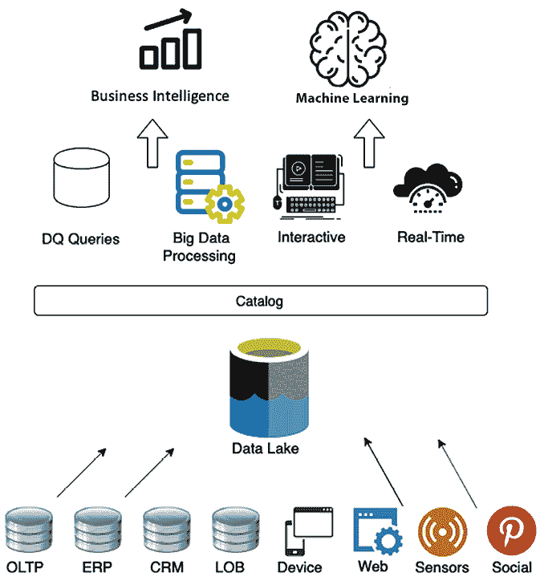

图 12.6：数据湖的对象存储

以下是数据湖的好处：

+   **来自各种来源的数据摄取**：数据湖让你能够在一个集中位置存储和分析来自多个来源的数据，如关系型数据库、非关系型数据库和数据流，作为单一的真实数据来源。这解决了诸如：*为什么数据分布在多个地方？* 和 *单一真实数据来源在哪里？* 这样的问题。

+   **高效收集和存储数据**：数据湖可以摄取任何数据结构，包括半结构化和非结构化数据，无需模式。这解决了诸如：*如何从多个来源快速摄取不同格式的数据并高效地进行大规模存储？* 这样的问题。

+   **随着生成数据量的增加进行扩展**：数据湖允许你将存储和计算层分开，单独扩展每个组件。这解决了诸如：*如何随着生成的数据量进行扩展？* 这样的问题。

+   **对来自不同来源的数据应用分析**：借助数据湖，你可以在读取时确定模式，并创建一个关于从各种资源收集的数据的集中式数据目录。这使你能够进行快速的临时分析。解决了诸如：*我能否对相同的数据应用多个分析和处理框架？* 这样的问题。

你需要一个无限可扩展的数据存储解决方案来支持数据湖。解耦处理和存储带来了许多好处，包括能够使用各种工具处理和分析相同的数据。虽然这可能需要额外的步骤将数据加载到正确的工具中，但作为中央数据存储的 Amazon S3 提供的好处超过了传统存储选项。以下示意图展示了使用 AWS 服务的数据湖视图：

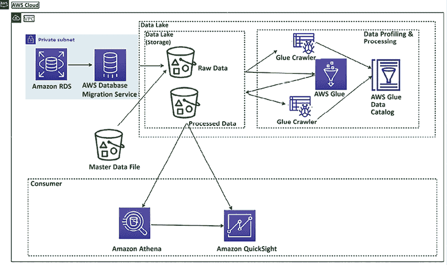

图 12.7：AWS 平台中的数据湖架构

上面的图示描述了一个使用 Amazon S3 存储的数据湖。数据从各种资源（如关系数据库和主数据文件）摄取到集中存储中。在数据湖的原始层中，所有数据都保持其原始格式。随后，这些数据通过 AWS Glue 服务进行目录管理和转换。AWS Glue 是一个无服务器的数据目录管理和 ETL 过程解决方案，基于 AWS 云平台中的 Spark 框架构建。在这里，AWS Glue 爬虫帮助进行数据存储的目录管理。它会自动扫描你的数据源，识别数据格式，并推断模式，创建并填充包含元数据的信息的数据目录。爬虫对数据进行分类，以了解其格式和结构，并在数据目录中创建表定义，从而简化了数据分析查询的构建。一旦数据被转换，它会存储在数据湖的处理层中，供各种用途消费。

数据工程师可以使用 Amazon Athena 运行临时查询，这是一种基于托管 Presto 实例构建的无服务器查询服务，并使用 SQL 直接从 Amazon S3 查询数据。业务分析师可以使用 Amazon QuickSight、Tableau 或 Power BI 为业务用户构建可视化，或将部分数据加载到 Amazon Redshift 中以创建数据仓库模型。最后，数据科学家可以使用 Amazon SageMaker 消耗这些数据，进行机器学习（ML）。

没有一个工具能做到所有事情。你需要为正确的工作使用合适的工具，而数据湖使你能够构建一个高度可配置的大数据架构，以满足你的特定需求。业务问题必须更加具体、深入且复杂，才能由一个工具来解决，尤其是在大数据和分析的领域。

然而，随着时间的推移，组织意识到数据湖有其局限性。由于数据湖使用廉价存储，组织将尽可能多的数据存储在数据湖中，从而提供了开放、直接访问文件的灵活性。很快，数据湖因数据质量问题和细粒度的数据安全性而开始变成**数据沼泽**。然而，为了解决数据湖的性能和质量问题，组织将数据湖中的一小部分数据处理到下游数据仓库中，以便在 BI 应用程序中用于重要决策。

数据湖和数据仓库之间的双重系统架构需要持续的数据工程来维护和处理这两个系统之间的数据。数据处理的每一步都存在故障的风险，这可能会影响数据质量。此外，保持数据湖和数据仓库之间的一致性既具挑战性，又成本高昂。用户面临支付双重存储费用的负担——一次是数据存储在数据湖中的费用，另一次是数据在数据仓库中的复制费用。这还不包括与持续数据处理相关的持续费用。

为了解决双系统问题，一种新的架构类型——数据湖仓架构被提出。让我们深入了解湖仓架构。

## 湖仓架构

湖仓架构作为一种解决方案应运而生，旨在弥合传统数据湖和数据仓库之间的差距，集成了两者的优势。该架构旨在利用数据湖的广泛存储容量，用于摄取和存储大量数据，并采用开放格式，这对分析至关重要。同时，它也旨在提供基于 SQL 的查询便利性和与数据仓库相关的可靠性。湖仓架构的关键特性包括：

+   **开放数据格式的存储**：湖仓架构采用开放格式存储数据，促进数据处理和分析中的互操作性和灵活性。

+   **解耦存储和计算**：它将存储和计算资源分离，允许各自独立扩展和优化，从而提高成本效率和性能。

+   **事务性保障**：为了确保数据完整性，湖仓架构提供了事务性保障，类似于传统数据库系统中的保障，支持可靠的并发访问和修改。

+   **支持多样化的消费需求**：湖仓架构旨在满足各种数据消费需求，支持从批处理到实时流处理的不同数据分析和处理方式。

+   **安全与治理**：该架构强调安全性和治理，确保数据访问受到控制，并保持符合数据隐私法规的合规性。

+   **统一平台**：湖仓架构提供一个统一的平台，涵盖从 ETL 过程、机器学习到商业智能和报告的各类数据操作，消除了对多个系统的需求。

+   **增强查询性能**：通过利用索引、缓存和数据聚类等技术，湖仓架构提升了查询性能，使其适用于复杂的分析工作负载。

+   **成本效益的可扩展性**：该架构提供成本效益的可扩展性选项，在性能需求和预算限制之间实现平衡，尤其对日益增长的数据量非常有益。

+   **灵活的数据管理**：湖仓架构支持灵活的数据管理实践，能够适应不断变化的数据模式和结构，非常适合敏捷和动态变化的业务环境。

湖仓架构代表了数据管理的一次重要进化，提供了一种全面、可扩展且高效的方法来处理庞大且多样化的数据集，同时确保数据的完整性、安全性和易访问性。

下图展示了一个使用 Redshift Spectrum 进行数据共享的样本湖屋架构。Amazon Redshift Spectrum 提供了从数据湖查询数据的能力，而无需将数据存储在数据仓库中。假设你已经在使用 Amazon Redshift 进行数据仓储，在这种情况下，你无需将所有数据加载到 Amazon Redshift 集群中，仍然可以使用 Spectrum 直接从 Amazon S3 数据湖查询数据，并将其与数据仓库中的数据结合使用。

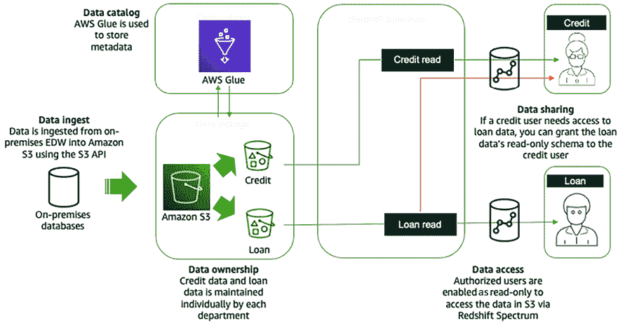

图 12.8：使用 Redshift Spectrum 在 AWS 云平台上的湖屋架构

数据通过 S3 API 从本地 **企业数据仓库** (**EDW**) 导入到 S3，如上图所示。AWS Glue 存储了元数据以及信用和贷款数据。贷款部门的数据分析师将被授予只读权限，以访问贷款数据。同样，信用分析师将被授予只读权限，以访问信用数据。在数据共享方面，如果信用分析师需要访问贷款数据，信用分析师可以获得贷款数据的只读模式。

Lakehouse 架构有其优势；然而，对于那些由地理位置分散的业务单元驱动的复杂应用程序环境的大型组织来说，还需要更多的支持。这些业务单元已经构建了数据湖和数据仓库作为其分析来源。每个业务单元可能会合并多个内部应用程序数据湖，以支持其业务。由于变更速度通常较慢，且难以满足不同业务单元的所有需求，中央化的企业数据湖或数据湖屋难以实现。为了解决这个问题，你需要基于领域的去中心化数据所有权和架构。这就是数据网格的作用所在。让我们深入了解数据网格架构。

## 数据网格架构

数据网格与数据湖架构之间的主要区别在于，数据故意保持分布式，而不是试图将多个领域合并到一个集中管理的数据湖中。数据网格提供了一种模式，使大型组织能够连接多个数据湖/湖屋，并促进与合作伙伴、学术界甚至竞争对手的共享。

数据网格代表了在架构和组织管理广泛分析数据集方面的重大转变。它建立在四个基本原则之上：

+   **基于领域的去中心化所有权和架构**：这一原则强调将数据所有权和架构决策去中心化到特定的业务领域。它鼓励各个领域对其数据负责，从而产生更具针对性和有效的数据解决方案。

+   **数据作为产品提供**：将数据视为产品意味着它会被维护、改进，并以最终用户为中心展示。它将焦点从数据作为单纯的资源转变为作为有价值的资产，能够提供实用性并解决用户问题。

+   **联邦数据治理与集中审计控制**：这一原则在去中心化的数据管理和对全面治理需求之间找到平衡。它允许进行特定领域的数据治理，同时保持集中控制以便审计和合规性。

+   **数据可消费的公共访问**：确保数据在整个组织中可访问且可用，这一原则专注于创建一个通用框架，以便轻松高效地消费数据。

它鼓励数据驱动的敏捷性，并通过轻量级的集中政策支持领域本地治理。数据网格通过明确的责任界定隔离数据资源，从而提供更好的所有权。数据网格的核心概念是将数据领域作为数据湖账户中的节点。

数据生产者将一个或多个数据产品贡献到数据网格账户中的中央目录，并在此应用联邦数据治理，以便共享数据产品，提供可发现的元数据和可审计性。数据消费者通过接受资源共享来搜索目录并访问数据产品，这遵循数据网格模式。以下是 AWS 云中的数据网格架构：

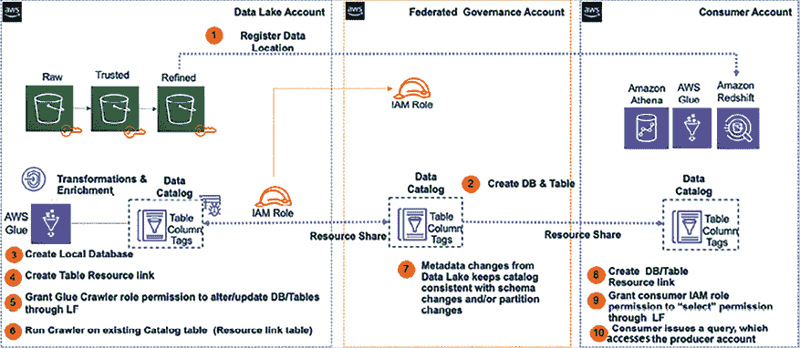

图 12.9：AWS 云平台上的数据网格架构

以下是为构建数据网格而实施的组件，如前面的图示所示：

+   中央 AWS 账户是注册数据产品的地方，包括数据库、表、列和行。

+   访问控制标签和标签访问策略由中央管理。

+   它存储执行与消费者共享的数据权限。权限可以是直接的或基于标签的。

+   将安全性和治理政策应用于生产者和消费者账户及其发布的数据产品。

通过数据网格架构，您可以加速业务领域湖仓的独立交付。数据网格增强了领域内的数据安全性和合规性，并允许自助服务的数据产品创建、发现和订阅，消费者可以透明地访问数据产品。随着基于客户需求提供快速洞察和迅速行动的需求不断增加，流数据分析已成为任何业务的关键组成部分。让我们深入了解流数据分析架构的更多细节。

## 流数据架构

流数据是数据中快速扩展的一个部分，它需要具备从各种来源快速接收和处理实时数据的能力。这些来源包括视频、音频、应用日志、网站点击流和物联网遥测数据，所有这些数据旨在提供及时的商业洞察。流数据的典型应用场景遵循一致的模式：

1.  **数据生成**：数据源持续不断地生成数据。

1.  **数据摄取**：这些数据随后通过摄取阶段传送到流式存储层。

1.  **流存储**：在这一层，进入的数据被持久化捕获，并为实时处理提供访问。

1.  **流处理**：在这一层，存储层中的数据被处理。这个处理可能涉及到数据的过滤、聚合或分析，随着数据的流动而进行。

1.  **数据输出**：处理后的数据随后被发送到指定的目的地，可能是数据库、数据湖或其他存储解决方案，用于进一步使用或长期存储。

这个流程确保数据不仅在生成时被捕获，而且在及时的过程中被处理，从而实现更快速的决策制定和更即时的业务洞察。

流数据架构与传统架构不同，因为它需要处理连续的大量数据流，并且数据流速非常高。通常，这些数据是半结构化的，需要大量处理才能得出可操作的见解。在设计流数据架构时，你需要快速扩展数据存储，同时从时间序列数据中获得实时模式识别。

最好从产生数据流的生产者角度考虑问题，比如物联网传感器，如何使用实时数据处理工具存储和处理数据，最后如何进行实时数据查询。以下图示展示了在 AWS 平台上使用托管服务的流数据分析管道：

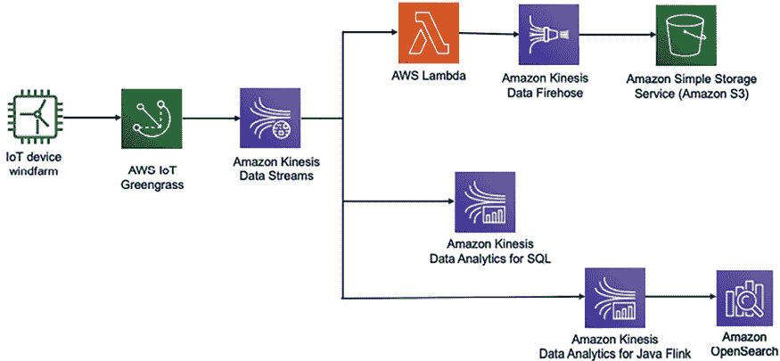

图 12.10：物联网数据的流数据分析

在前面的图示中，数据从风电场采集，以了解风力涡轮机的健康状况和转速。实时控制风力涡轮机非常重要，以避免在风速超过涡轮机的限制时发生高昂的维修费用。

风力涡轮机的数据通过 AWS IoT Greengrass 输入到 Kinesis 数据流。Kinesis 数据流可以保留流数据长达一年，并提供回放功能。采用分发技术将数据发送到多个资源，在那里你可以使用 Lambda 发送数据消息，并将数据存储到 Amazon S3 中，进一步使用 Amazon Kinesis Firehose 进行分析。

你可以使用 Kinesis 数据分析 SQL 对流数据进行实时查询，并且可以通过 Kinesis 数据分析 Java Flink 来自动化数据管道，实时转换流数据，并将处理后的数据存储到 Amazon OpenSearch 中，以获取数据洞察。你还可以将 Kibana 添加到 OpenSearch 中，实时可视化风力涡轮机数据。

前述的解决方案是数据无关的，并且易于定制，客户可以快速修改预配置的默认设置，并开始编写代码来包含特定的业务逻辑。

## 选择合适的大数据架构

在选择数据湖、湖仓和数据网格架构时，需要根据具体的业务需求、数据战略和技术能力来决定。每种架构都有其独特的优势，适用于不同的数据管理和分析场景。为了帮助做出正确的选择，以下列表列出了每种架构的优势、重要考虑事项和理想使用案例：

+   **数据湖架构**：数据湖主要用于以原始格式存储大量数据。

    +   **优势**：它提供了高可扩展性和灵活性，能够处理各种数据类型。它在存储大量数据方面具有成本效益，并且可以作为所有组织数据的中央存储库。

    +   **考虑事项**：如果没有适当的治理，数据湖可能会变得难以管理（“数据沼泽”）。它们需要谨慎管理，以确保数据质量和可访问性。

    +   **使用案例**：它适用于大数据分析、机器学习以及需要存储和分析大量多样化数据的场景，且成本低廉。特别适合需要存储多种类型数据——包括结构化、半结构化和非结构化数据——且在数据输入时没有预定架构要求的情况。

+   **湖仓架构**：该架构结合了数据湖和数据仓库的元素。

    +   **优势**：它旨在提供数据湖的低成本可扩展性，并结合数据仓库的强大架构和性能优化。它提供了一个统一的平台，支持各种类型的数据处理和分析，减少了数据孤岛现象。它还支持 ACID 事务和架构强制执行，提升了数据的可靠性和质量。

    +   **考虑事项**：实施湖仓架构可能较为复杂，需要集成各个组件并确保不同工作负载之间的一致性和可靠性。

    +   **使用案例**：它最适合需要大数据处理和传统 BI 分析的组织，并且能够从单一平台进行操作。它特别适合需要实时分析和报告大规模多样化数据集的使用场景。

+   **数据网格架构**：它侧重于去中心化的数据架构和所有权。它将数据视为产品，由面向领域的团队拥有并向整个组织提供他们的数据产品。

    +   **优势**：它鼓励更敏捷和灵活的数据管理与分析方法。它还促进了数据民主化，使得各领域内的决策更加快速，创新得以推进。

    +   **考虑事项**：它需要在数据管理和共享的文化上发生转变。它要求在各个领域间进行强有力的治理和标准化，以确保数据的互操作性和质量。

    +   **使用案例**：它适用于拥有多个独立团队或部门的大型组织，在这些组织中，不同领域生成并消费数据。

以下是一些关键的决策因素：

+   **组织结构**：考虑你的组织是集中化还是去中心化的。数据网格更适合后者。

+   **数据量与多样性**：数据湖适用于大规模、多样化的数据集，而湖仓则为此类数据提供更结构化的环境。

+   **分析需求**：如果你需要将实时分析与大数据处理相结合，湖仓可能是最合适的选择。

+   **治理与合规性**：评估你的数据治理、质量和合规需求。湖仓架构通常提供更强大的治理机制。

+   **技术专长**：实施和管理数据网格或湖仓架构需要特定的技术专长和资源。

最终，选择取决于将架构与业务目标、技术能力和数据战略对齐。每种架构都有其优势，最好的选择可能是混合方法，具体取决于你的特定需求。

# 大数据架构最佳实践

你在前面的章节中学习了各种大数据技术和架构模式。让我们看一下下面的参考架构图，了解数据湖架构不同层次的最佳实践。

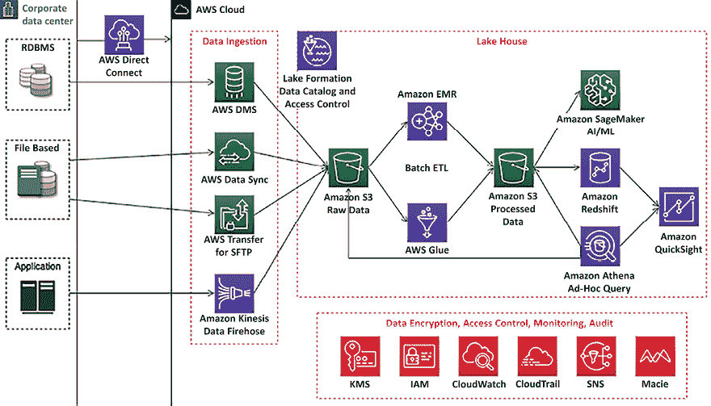

图 12.11：数据湖参考架构

上图展示了使用 AWS 云平台的端到端数据管道架构，包含以下组件：

+   AWS Direct Connect 将在本地数据中心与 AWS 之间建立高速网络连接以迁移数据。如果你有大量归档数据，使用 AWS Snow 系列产品将其迁移到离线环境更为合适。

+   一个数据摄取层，包含多个组件，用于使用 Amazon Kinesis 摄取流数据，使用 AWS **数据迁移服务**（**DMS**）摄取关系数据，使用 AWS Transfer for **安全外壳文件传输协议**（**SFTP**）进行安全文件传输，以及使用 AWS DataSync 在云端与本地系统之间更新数据文件。

+   使用 Amazon S3 存储所有数据的集中化数据存储，其中数据存储分为多个层次，存储原始数据、处理后的数据和归档数据。

+   Amazon Redshift 是一种云原生的数据仓库解决方案，配合 Redshift Spectrum 支持湖仓架构。

+   使用 Amazon Athena 进行临时查询功能。

+   基于 Spark 使用 AWS Glue 实现快速 ETL 流水线。

+   Amazon EMR 将重新利用现有的 Hadoop 脚本和其他 Apache Hadoop 框架。

+   使用 Amazon Lake Formation 在数据湖级别构建全面的数据目录和细粒度的访问控制。

+   使用 Amazon SageMaker 的 AI/ML 扩展。

其他组件包括用于数据加密的 Amazon **密钥管理服务**（**KMS**），用于访问控制的 Amazon **身份与访问管理**（**IAM**），用于 PII 数据检测的 Amazon Macie，以遵守**支付卡行业数据安全标准**（**PCI DSS**）等数据合规要求，CloudWatch 用于监控操作，CloudTrail 用于审计数据湖活动。

您需要使用以下标准验证您的大数据架构：

+   安全性：

    +   对数据进行分类，并使用基于资源的访问控制定义相应的数据保护策略。

    +   使用用户权限和**单点登录**（**SSO**）实施强大的身份基础。

    +   为审计目的启用环境和数据可追溯性。

    +   在所有层次实施安全性，并使用 SSL 和加密保护数据在传输和静态状态下的安全。

    +   将人员与数据隔离，例如锁定生产数据集的写访问权限。

+   可靠性：

    +   通过自动化数据剖析和数据目录化，强制执行数据卫生。

    +   管理数据资产的生命周期，使用数据仓库和数据湖之间的数据分层来进行过渡和过期管理。

    +   通过维护数据目录中数据流动的历史记录来保留数据血缘。

    +   为分析管道设计弹性，并通过自动恢复 ETL 作业失败来监控系统 SLA。

+   性能效率：

    +   使用数据剖析提高性能，进行数据验证，并构建一个数据清理层。

    +   持续优化数据存储，例如使用 Parquet 格式的数据压缩、数据分区、文件大小优化等。

+   成本优化：

    +   采用消费模型并确定是否需要特定的或快速查询模式。

    +   删除不再使用的数据；定义数据保留规则，并删除或归档超过保留期的数据。

    +   使用基于数据湖的解决方案解耦计算和存储。

    +   通过针对不同数据源和数据量采用不同的迁移策略，实施迁移效率。

    +   使用托管和应用级服务降低拥有成本。

+   操作卓越：

    +   使用 CloudFormation、Terraform 和 Ansible 等工具以代码方式执行操作。

    +   自动化操作，例如通过 Step Functions 或 Apache Airflow 构建编排层。

    +   通过持续监控并自动恢复 ETL 作业失败，预见故障并提前做好准备。

    +   衡量工作负载的健康状况。

您可以使用前面的检查清单作为验证大数据架构的指南。数据工程是一个广泛的主题，值得编写多本书来深入探讨每个话题。

在本章中，您了解了数据工程的各种组件及其流行架构模式，这将帮助您入门并深入探讨该主题。

# 总结

在本章中，你学习了大数据架构以及大数据管道设计的组件。你了解了数据摄取和用于收集批量数据与流式数据进行处理的各种技术选择。由于云存储在今天处理海量数据中至关重要，你了解了 AWS 云生态系统中可用的各种数据摄取服务。

数据存储是处理大数据的核心之一。你学习了各种数据存储类型，包括结构化数据和非结构化数据、NoSQL、以及数据仓库，并了解了每种存储方式所需的技术选择。你还了解了来自主流公有云提供商的云数据存储。

一旦你收集并存储了数据，就需要对其进行转化，以获得对数据的洞察并可视化业务需求。你学习了数据处理架构和技术选择，以便根据数据需求选择开源和基于云的数据处理工具。这些工具帮助你根据数据的性质和组织需求，获得数据洞察和可视化。

你学习了各种大数据架构模式，包括数据湖、湖仓、数据网格、流式数据架构、参考架构，并了解如何根据数据需求选择合适的架构。最后，你通过结合所有学习的知识，了解了大数据架构的最佳实践，并在参考架构中进行了应用。

随着数据的收集，获取未来的洞察总是非常有益的，这对于业务发展尤其重要。你通常需要机器学习来基于历史数据预测未来的结果。在下一章中，让我们深入了解机器学习以及如何让你的数据架构具有未来保障。

# 加入我们的书籍 Discord 空间

加入本书的 Discord 工作区，提问并与作者和其他解决方案架构专家互动：`packt.link/SAHandbook`

