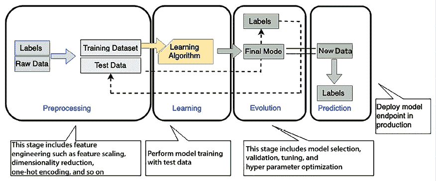
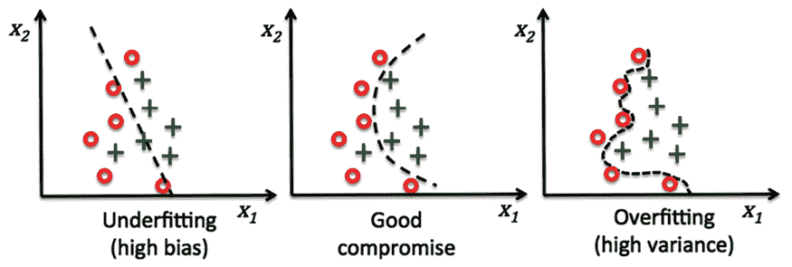
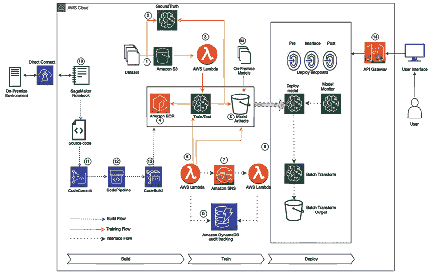
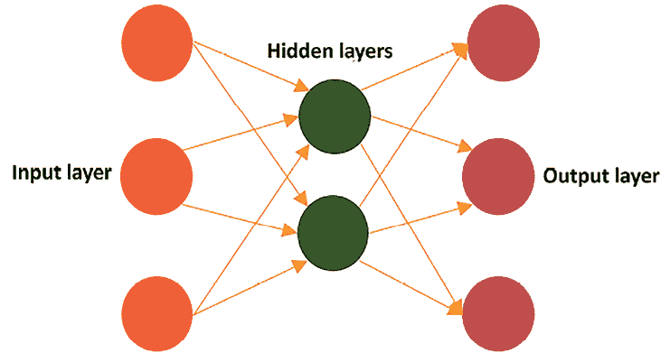
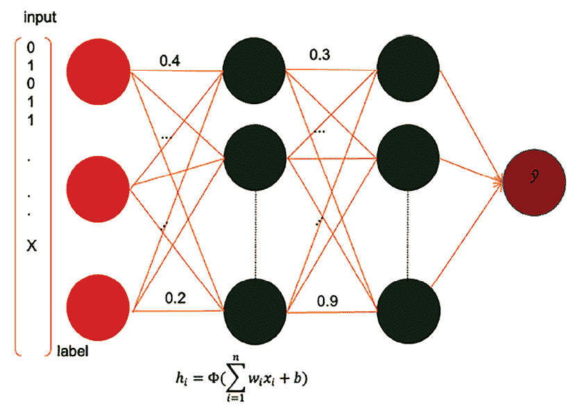

# 第十三章：机器学习架构

在上一章中，你了解了如何摄取和处理大数据，并通过洞察数据来理解你的业务。在传统的商业运营方式中，组织的决策者会查看过去的数据，并通过他们的经验来规划公司未来的发展方向。这不仅仅是设定商业愿景的问题，还包括通过预测和满足最终用户的需求或自动化日常决策活动（例如贷款审批）来改善用户体验。

然而，随着如今可用数据量的庞大，人类大脑已经很难处理所有数据并预测未来。正是因为这样，**人工智能（AI）**和**机器学习（ML）**才应运而生。人工智能是机器以智能方式执行任务的更广泛概念，比如 Siri 和 Alexa 能够理解你的问题并给出答案；而机器学习是人工智能的一个特定子集，涉及让计算机通过数据学习并做出决策。它们帮助我们通过查看大量的历史数据来预测未来的行动方向。如今，大多数企业正在投资机器学习，主要是因为生成式人工智能（GenAI）带来的加速发展。机器学习正迅速成为帮助企业脱颖而出的技术——通过创造新产品、服务和商业模式，使企业能够创新并获得竞争优势。

人工智能（AI）和机器学习（ML）非常适合解决商业问题，因为它们在公司不同业务领域中提供了无数的应用场景，并且这些应用场景所带来的影响程度也很高。例如，通过机器学习，你可以通过呼叫中心智能化提升客户服务水平，或者帮助市场营销团队通过使用基于机器学习的个性化营销活动实现个性化目标。

在本章的范围内，我们将涵盖以下主题来处理和管理你的机器学习需求：

+   什么是机器学习？

+   与数据科学和机器学习的合作

+   云中的机器学习

+   构建机器学习架构

+   机器学习架构的设计原则

+   MLOps

+   深度学习

+   **自然语言处理**（**NLP**）

到本章结束时，你将对机器学习架构有一定的了解。你将学习各种机器学习模型以及机器学习工作流。你将理解通过特征工程、模型训练、推断和模型评估等过程创建机器学习模型管道的过程。

# 什么是机器学习？

机器学习推动了更好的客户体验、更高效的业务运作以及更快速、更准确的决策制定。随着计算能力的提升和数据的泛滥，机器学习已从外围技术发展为各行业企业和组织的核心竞争力。机器学习的应用场景可以涵盖大多数企业，例如个性化产品和内容推荐、呼叫中心智能化、虚拟身份验证和智能文档处理等。也有为特定行业量身定制的应用场景，如制药行业的临床试验或制造业的生产线质量控制。

机器学习通过技术来发现新趋势，并基于过去的事实数据建立数学预测模型。机器学习能够帮助解决一些复杂问题，诸如以下问题：

+   您可能需要学习如何创建复杂的代码规则来做出决策；例如，如果您想识别图像和语音中的人类情感，目前没有简单的方式编写逻辑来实现这一目标。

+   当需要分析大量数据以做出决策，而数据量过大，人类无法高效处理时。例如，虽然人类可以进行垃圾邮件检测，但数据量大到使得快速完成这一任务变得不切实际。

+   相关信息可能仅在您需要时动态生成，此时需要根据个人数据调整和个性化用户行为；例如，个性化的产品推荐或网站个性化。

+   当有大量数据任务需要处理时，无法足够迅速地跟踪信息以做出基于规则的决策——例如，欺诈检测和自然语言处理（NLP）。

人类基于分析结果和经验进行数据预测。通过机器学习，可以训练计算机根据可用数据提供专业知识，并基于新数据进行预测。以下是机器学习在各行各业的几种普遍应用场景：

+   **预测性维护**：根据传感器数据预测组件是否会提前发生故障。常用于估算**剩余使用寿命**（**RUL**）的预测，适用于汽车车队、制造设备和物联网传感器。其主要好处是提高车辆和设备的正常运行时间，显著节省成本。这一应用广泛存在于汽车和制造行业。

+   **需求预测**：利用历史数据更快速、准确地预测关键需求指标，从而帮助做出关于生产、定价、库存管理以及采购/补货的更准确商业决策。其主要优势包括满足客户需求、通过减少多余库存来最小化库存持有成本，以及减少浪费。金融服务、制造业、零售业以及**消费品包装商品**（**CPG**）等行业经常使用这一应用场景。

+   **欺诈检测**：自动识别潜在的欺诈活动并标记以供进一步审查。其主要好处是减少与欺诈相关的成本，并保持客户信任。这个用例在金融服务和在线零售行业得到了应用。

+   **信用风险预测**：解释信用申请中的个体预测，以预测是否会按时还款的可能性（通常称为*信用违约*）。其好处在于识别偏见并遵守监管要求。这个用例主要用于金融服务和在线零售行业。

+   **从文档中提取和分析数据**：理解手写和数字文档中的文本，提取信息用于分类和决策。这种用例在医疗、金融服务、法律、机械、电气和教育等行业中广泛应用。

+   **个性化推荐**：基于历史数据做出定制化推荐。这种方法在零售和教育行业中很常见。

+   **流失预测**：估算客户停止使用服务的概率。这通常应用于零售、教育和**软件即服务**（**SaaS**）提供商等行业。

机器学习的主要思想是为机器学习算法提供一个训练数据集，让其从新的数据集中进行预测，例如，将一些历史股市趋势数据提供给机器学习模型，并让其预测市场在未来六个月到一年的波动情况。

在开发机器学习系统时，重要的是要谨慎地结合数据和代码。两者必须有组织地结合在一起，并且应该以受控的方式发展，以朝着构建一个强大且可扩展的机器学习系统的共同目标迈进。

你用来训练、测试和进行机器学习系统推断决策的数据会随着时间的推移发生变化，因为数据来自不同的地方。你的代码也需要随着数据的变化而改变，以适应来自不同来源的数据。如果没有系统的方法，代码和数据的变化可能会发生偏离。这种不匹配可能会在你尝试将机器学习系统应用于实际任务时引发问题。它还可能妨碍平稳部署，并导致难以理解、追溯或后续重现的结果。机器学习有多种类型，让我们来探索一下。

## 机器学习的类型

机器学习帮助计算机无需我们编写每个细节就能学会某些东西。就像教狗狗一个新动作：你展示给它看，之后它学会了并且做出来！通过机器学习，计算机可以从数据中学习，然后利用这些学习做出决策。让我们来看看计算机学习的不同方式。

### 监督学习

在监督学习中，算法被提供一组训练示例，其中数据和目标决策是已知的。然后，它可以预测包含相同属性的新数据集的目标值。在这种学习类型中，算法通过一个输入数据附带正确答案或目标的数据集进行学习。算法通过这些示例学习将输入与其正确输出关联起来。

这种学习类型通常用于需要将事物分类到不同类别或预测数字的任务，例如分类和回归任务。例如，它可以用来将电子邮件分类为垃圾邮件或非垃圾邮件，或根据房屋的特征预测房价。

### 无监督学习

在无监督学习中，算法会提供大量数据，并应在数据中发现模式和关系。然后，它可以从数据集中推断出结论。

在无监督学习中，不需要人工干预，例如根据上下文进行文档的自动分类。它解决了正确输出无法用于训练示例的问题，算法必须通过聚类在数据中发现模式。

在无监督学习中，模型使用未标记的数据集进行训练。算法自主工作，发现数据中的模式、结构或关系，而无需任何特定的指导或标记示例。此类学习常应用于聚类、降维和密度估计任务。新闻机构或法律事务所通常处理大量数据。通过无监督学习，它们可以实现文档自动分类，高效管理数字存储库，并改进信息检索过程，例如向读者或研究人员推荐相似的文章或案例。

### 半监督学习

这种方法结合了监督学习和无监督学习的元素。它涉及使用少量标记数据与大量未标记数据一起使用，以提高模型性能。半监督学习特别有用，尤其是在获取标记数据既昂贵又耗时的情况下。通常应用于标记数据有限但未标记数据充足的场景。例如，在生物医学领域，半监督学习可以非常有利。例如，标注医学图像需要大量时间和资源，这使得半监督学习成为一种实用的解决方案。模型可以先在一小部分标记图像上进行训练，然后使用更多未标记的图像进行微调，从而最大化效用并最小化成本和资源消耗。

### 强化学习

这种学习类型涉及训练代理（或计算机程序）在特定环境中做出一系列顺序决策。目标是让代理学会采取最佳行动，以便在时间推移中最大化累积奖励。代理通过采取行动、接收反馈（奖励或惩罚）并调整策略来学习。强化学习广泛应用于自主机器人、游戏对抗（例如 AlphaGo）和推荐系统。自动驾驶车辆通过在交通中导航，并根据环境调整行动，来应用强化学习，从而确保在各种情境下做出最优决策。车辆会做出一系列决策（如变换车道、调整车速等），对于安全高效的行动给予正向强化，而对于不良行为给予负向强化。

### 自监督学习

这是一种无监督学习类型，其中算法从数据中生成标签或目标。它通常涉及预测数据中的缺失部分等任务。自监督学习在自然语言处理（NLP）和计算机视觉中广受欢迎，常用于在大规模数据集上预训练模型，然后对特定任务进行微调。在图像处理或计算机视觉中，自监督学习可以用于预测视频序列中的下一个帧，从而帮助模型理解视觉数据中的运动和发展。通过这种方式对模型进行预训练，再针对具体任务（如物体检测）进行微调，能够获得令人印象深刻的结果。

### 多实例学习

在多实例学习中，每个数据点是一个包含多个实例（子数据点）的袋。目标是从数据袋中学习，同时仅能访问袋级别的标签。多实例学习在药物发现、图像分类和基于内容的图像检索中有应用。在电子商务平台中，多实例学习可以用于预测用户在一次会话（一个数据袋）中是否会购买产品，使用的不同实例如页面浏览量、点击的产品以及在页面上的停留时间。袋级标签可能会指示该会话期间是否发生了购买，从而为预测和个性化内容推荐提供了坚实的基础。

这些多样的学习范式，每种都有其专长和应用领域，使得机器学习成为一个多才多艺的领域，能够适应各个行业和领域中的不同场景与挑战。通过选择一个与特定问题的特点和可用数据相匹配的范式，机器学习从业者能够推导出有洞察力的模型，并推动智能化、自动化决策的应用。关键在于选择最适合现有数据和问题的学习类型，确保模型既强健又具有可应用性。

在接下来的部分，我们将学习数据科学是如何与机器学习（ML）紧密结合的。

# 与数据科学和机器学习合作

机器学习（ML）完全是关于数据的工作。训练数据的质量对 ML 模型的成功至关重要。高质量的数据可以带来更准确的 ML 模型和正确的预测。

数据常常存在多个问题，如缺失值、噪声、偏差、离群值等。探索数据使我们意识到这些问题，为我们提供有关数据质量和清洁度的信息，揭示数据中的有趣模式，并在开始建模后指引可能的前进路径。数据科学包括数据收集、数据准备、分析、预处理和特征工程。

数据准备是构建 ML 模型的第一步。它耗时且占据了 ML 开发中高达 80% 的时间。由于数据本身“脏”且未经处理，数据准备一直被认为是繁琐且资源密集型的。“脏”数据可能包括缺失值、错误值和离群值。通常需要进行特征工程来转换输入数据，从而提供更准确和高效的 ML 模型。

数据准备的第一步是理解业务问题。数据科学家通常急于直接跳入数据中，开始编写代码并产生洞见。然而，如果没有清楚地理解业务问题，任何产生的洞见都有很大的可能变成无法解决实际问题的方案。比起陷入数据的细节，先从简单的用户故事和业务目标出发显得更有意义。

在深入理解业务问题之后，你可以缩小 ML 问题的类别，并确定 ML 是否适合用来解决你的业务问题。

数据准备通常包括多个步骤，如数据清理、处理缺失值、数据规范化/标准化和数据标注。在本章后续的*构建机器学习架构*部分，你将详细学习这些步骤。大多数独立的数据准备工具都配备了数据转换、特征工程和可视化功能。数据转换可能包括诸如货币转换（例如，从美元转换为欧元）或单位转换（例如，从千克转换为磅）等任务。特征工程则涉及从现有数据中创建新的数据列（特征），以增强数据集在 ML 模型中的有效性；例如，从日期列中提取星期几或月份信息可以帮助模型识别与时间相关的模式。尽管这些工具在数据准备上表现出色，但它们通常缺乏内置的模型验证功能，而模型验证是评估 ML 模型性能的关键步骤。所需的是一个能够提供所有这些功能，并且与 ML 流水线其他部分紧密集成的框架。因此，数据准备模块在部署到生产环境之前需要经过整理和整合。

如下图所示，数据预处理和学习以创建机器学习模型是相互关联的——数据准备将深刻影响你的模型，而你选择的模型也将深刻影响你将进行的类型的数据准备。找到正确的平衡是一个高度迭代的过程，实际上非常像一门艺术（或试错法）：

图 13.1：机器学习工作流

如前图所示，机器学习工作流包括以下几个阶段：

+   **预处理**：在这一阶段，数据科学家会对数据进行预处理，并将其划分为训练集（占数据的 70%）、验证集（占数据的 10%）和测试集（占数据的 20%）。你的机器学习模型将使用训练集进行训练，这有助于它学习并给出正确的预测。一旦训练完成，模型将使用单独的验证数据集进行评估，以评估其性能和泛化能力。模型准备好后，你可以使用测试数据集对其进行测试。特征是数据集中的独立属性，可能会影响结果，也可能不会。特征工程包括寻找正确的特征，这可以帮助实现模型的准确性。标签是你的目标结果，依赖于特征选择。你可以应用降维方法来选择正确的特征，从而筛选和提取出最有力的特征。

+   **学习**：在这一阶段，你根据业务用例和数据选择合适的机器学习算法。这是机器学习工作流的核心，你将在训练数据集上训练你的机器学习模型。为了实现模型的准确性，你需要尝试各种超参数并进行模型选择。超参数是用来控制机器学习算法学习过程的配置设置。

+   **评估**：一旦你的机器学习模型在学习阶段完成训练，你需要使用已知数据集来评估其准确性。为了评估你的模型，你将使用在预处理步骤中保留的验证数据集。如果模型预测的准确性需要根据验证数据的预期进行修订，则需要根据评估结果进行必要的模型调优。

+   **预测**：预测也叫做推理。在这一阶段，你将部署模型并开始进行预测。这些预测可以是实时进行的，也可以是批量进行的。

GenAI 引领了机器学习和人工智能领域的范式转变。其核心是**基础模型**（**FMs**），如 GPT-4，这些模型已经在庞大的互联网级数据集上进行了训练，重新定义了数据标注和模型定制的传统规范。这项开创性技术使得组织能够在有限的数据令牌下微调基础模型，从而大大减少了传统数据准备过程中所需的人工努力和时间。

然而，必须认识到，生成式人工智能（GenAI）并非灵丹妙药，因为它并非设计来解决所有的人工智能和机器学习问题。此外，生成式模型（FM）的开发是一项资源密集型的工作，需要大量的计算能力和广泛的数据集。因此，许多企业选择利用由知名第三方公司提供的生成式模型，例如 OpenAI、谷歌、Meta 和 Anthropic，这些公司在这些模型的开发中处于领先地位。

然而，故事并不止于此。定制化模型训练仍然是一个有吸引力的选择，特别是当需要特定的定制解决方案时。尽管生成式人工智能提供了一种创新的问题解决方法，但采纳它的战略决策应与组织的独特目标、资源和约束相一致。您将在*第十四章*《生成式人工智能架构》中了解更多关于生成式人工智能的内容。

根据您的数据输入，机器学习模型常常会出现过拟合或欠拟合问题，您必须考虑这些问题以获得正确的结果。让我们深入了解一下这个问题。

## 评估机器学习模型——过拟合与欠拟合

在过拟合中，模型需要进行泛化，这意味着它不仅要在其训练过的数据（训练集）上表现良好，还要在新的、未见过的数据（测试集或验证集）上也能表现出色。如果模型发生过拟合，实际上它已经记住了训练数据，捕捉了噪声和底层模式，这会导致在任何新数据上的表现较差。如果模型在训练数据上的表现指标很高，但在测试数据上的指标显著较低，这就是过拟合的标志。

这通常表示模型对训练数据的灵活性过高，使其能够*记住*数据，包括噪声。过拟合对应于高方差，在这种情况下，训练数据的微小变化会导致结果的显著变化。

在欠拟合中，模型未能捕捉训练数据集中的重要模式。通常，欠拟合表示模型过于简单或解释变量过少。欠拟合模型需要更加灵活，以便能够建模真实的模式，并对应于高偏差，表明结果在某个区域系统性地缺乏拟合。

以下图表清晰地展示了过拟合与欠拟合之间的区别，因为它们对应于一个拟合良好的模型：

图 13.2：机器学习模型的过拟合与欠拟合

该机器学习模型将数据点分为两类，前面的图表中通过圆环和叉号来进行说明。该机器学习模型试图确定顾客是否会购买某个产品。图表展示了三种不同机器学习模型的预测结果。你可以看到一个过拟合的模型（右侧）在训练过程中穿过了所有带圆环的数据点，但无法将算法推广到训练数据集之外的真实世界数据。另一方面，欠拟合的模型（左侧）忽略了若干数据点，准确性不足。一个好的模型（中间）通常能够提供清晰的数据点预测。创建一个好的机器学习模型就像创作艺术；通过调优模型，你可以找到合适的适配方式。

## 流行的机器学习算法

算法的受欢迎程度通常取决于其在多种应用场景中的适用性和性能、易于理解和实现的程度，以及其扩展性和对不同类型数据的适应能力。让我们来看一些流行的机器学习算法。

### 线性回归

线性回归试图通过找出它们之间的线性关系来理解某个事物（比如*X*）如何帮助预测另一个事物（*Y*）。假设你在农贸市场上。当你观察南瓜的价格时，你会注意到随着南瓜尺寸的增大，其价格也随之上涨。线性回归就像是在所有南瓜价格点之间画一条直线，确保这条线尽可能接近所有的点。

房地产是一个线性回归发挥重要作用的行业。例如，如果一家公司想预测一座房子的售价，它会考虑房间数量、位置和房产年龄等特征。如果过去有更多房间的房子通常卖得更贵，模型就会预测未来更多房间的房子售价较高。这就像根据南瓜的大小预测它的价格一样。

### 逻辑回归

逻辑回归告诉你某件事情发生的概率或机会，给出的是“是”或“否”的答案。假设你正在预测一本书是否会成为畅销书。逻辑回归将考虑诸如页数、作者的知名度和书籍类型等特征，以预测其成为畅销书的可能性（介于`0`和`1`之间）。

在医疗健康领域，逻辑回归可以根据各种症状和检查结果预测患者患病的可能性。例如，通过考虑年龄、血压和胆固醇水平等因素，逻辑回归可以预测一个人患心脏病的概率。如果概率较高，医生可能会进行进一步检查，确保早期发现并积极管理潜在的健康风险。

### 决策树

决策树通过提问的方式帮助你做出一系列决策。想象你想决定穿什么。决策树可能会问：“下雨吗？”如果回答是“是”，它可能会建议穿雨衣。如果回答是“否”，它可能会问下一个问题，比如“天气热吗？”，然后根据回答建议合适的衣服，帮助你在各种选项中做出最佳选择。

决策树可以帮助预测零售行业中顾客是否会购买某个产品。例如，它可能会问：“顾客在过去一个月内是否购买过商品？”如果回答是“是”，他们可能很快会再次购买。如果回答是“否”，它可能会考虑其他因素，比如最近的网站访问或点击的促销活动，以预测顾客的购买行为，从而帮助零售商通过相关广告和优惠来精准地锁定顾客。

### 随机森林

顾名思义，随机森林就像是创建了一片森林，每棵树都是一棵决策树，它们通过投票来决定结果。每棵树会得到一个数据的随机子集并做出最佳决策。然后，所有的树“投票”得出最终答案。这种方法通常比单一决策树产生更好、更稳定的预测。

在金融领域，随机森林可以用来预测是否批准或拒绝贷款申请。例如，树可能会考虑不同的因素，如信用评分、收入和债务，做出各自的决策。通过所有树的多数投票，最终的决策比依赖单一模型更准确和稳健，从而减少了糟糕贷款审批的风险。

### K-最近邻（k-NN）

使用**k**-NN 就像是观察一个新事物并尝试通过将它与我们已经知道的相似事物进行比较来理解它。如果你发现了一种以前从未见过的水果，你可能会通过与其他你熟悉的口味相似的水果进行比较，来判断它是甜的还是酸的。如果它看起来像其他甜的水果，你可能会猜它是甜的。

K-NN 广泛应用于推荐系统，如电子商务网站中的推荐系统。如果用户购买了某个特定产品，k-NN 会找到其他相似用户也购买过的类似产品，并将它们推荐给该用户。例如，假设某个用户购买了一本侦探小说，那么 k-NN 会寻找其他也购买了这本小说的用户，并推荐这些用户购买的其他书籍，从而通过展示相关产品增强用户的购物体验。

### 支持向量机（SVM）

支持向量机（SVM）是一种决定性的算法，旨在保持事物的清晰和分离。想象你有一张大桌子，把苹果放在一边，香蕉放在另一边。SVM 会尝试找到一条最宽的线（或空隙）来分开这两种水果，以确保所有苹果都在一边，所有香蕉都在另一边，避免混淆。

在手写识别领域，支持向量机（SVM）非常有帮助。例如，如果你写了一个数字“4”，SVM 能帮助计算机判断它是“4”还是“9”，通过查看大量人们如何书写这些数字的例子，并找到最佳的边界，将“4”和“9”区分开来，从而帮助计算机准确识别手写数字。

### 神经网络

将神经网络视为计算机内部的一个迷你大脑，它通过大量的例子学习以做出决策。当你学骑自行车时，最初可能会摔倒，但随着时间的推移，你会通过理解之前失败的原因来学习如何保持平衡和蹬踏。神经网络的学习过程也类似，它通过调整错误来做出更好的决策。

例如，社交媒体平台使用神经网络进行图像识别，帮助识别并标记照片中的人物。网络通过查看许多该人的照片，并注意像鼻子形状和眼睛颜色等特征来进行学习。当上传一张新照片时，它将这些特征与已学到的知识进行对比，做出最合适的判断，识别照片中的人物。

### K-means 聚类

K-means 聚类是一种将相似的数据点进行分组的方法。这就像组织一个大型派对，你想把那些兴趣相似的朋友分成几个小组（或簇），让他们互相之间更好地享受彼此的陪伴。你反复尝试不同的方式来分组，确保每个小组内的人尽可能相似，从而确保每个人都能玩得开心。

k-means 的一个流行应用是用于市场营销策略中的客户细分。企业可以使用 k-means 根据顾客的购买行为将其分组。例如，一个群体可能是那些频繁购买但每次消费较少的顾客，而另一个群体则可能是那些不常购买但每次购买金额较大的顾客。每个群体可以通过不同的营销策略进行精准定位，从而最大化销售。

### XGBoost

XGBoost 从过去的错误中学习，每做出一次决策，它都会变得更加聪明。如果你在解决数学问题时答错了题，XGBoost 会分析这个错误，理解出错的原因，并记住这个错误，以便下次面对类似问题时不会重复同样的错误。

在信贷行业，XGBoost 被广泛用于预测客户是否会违约贷款。通过分析收入、年龄、以往贷款历史等多个因素，预测客户违约的可能性。如果一个申请人的违约风险较高，那么贷款可能会被拒绝，从而减少银行的风险。

这些算法是许多机器学习项目的基础，选择时会根据具体问题和数据类型（例如文本、图像、数值数据）来决定。像神经网络这样的算法可能需要更多的计算资源和数据，而像决策树或 k-NN 这样的算法，即使在较小的数据集上也可能适用。

我们继续探索机器学习，接下来将介绍流行的机器学习工具和框架。

## 流行的机器学习工具和框架

机器学习使用各种工具和框架来完成，每种工具和框架都旨在帮助开发机器学习模型的不同方面——从数据处理、算法设计到模型训练和部署。以下是一些流行的工具和框架。

数据准备和探索的流行工具和框架包括：

+   **NumPy**：核心的 Python 科学计算库。数值 Python，或称 NumPy，是一个多维数组对象库，并提供一组用于操作这些数组的运算。

    数组是相同类型的数据项集合，存储在连续的内存位置中。

    NumPy 使在大数据集上进行数值和逻辑操作变得更加容易和高效。假设某零售公司希望计算月度平均销售额，以分析业绩并决定未来的策略。他们拥有以数字格式存储的每日销售数据。使用 NumPy，他们可以轻松通过将每日销售数据组织成数组、求和并除以天数来计算月度平均销售额。

+   **Pandas**：一个为 Python 用户提供简单、高性能数据结构和数据分析能力的库，使用户能够分析和操作数据。它呈现了 Series 和 DataFrame 两个基础数据结构，它们是构建在 NumPy 之上的。

    Series 是一列，DataFrame 是由多个 Series 组成的多维表格。

    Pandas 的功能使数据清洗、分析和可视化变得简单。例如，假设某个超市希望分析其销售数据，以了解哪些产品销量最好，哪些产品销量不佳。他们拥有一个包含每笔交易信息的大数据集，其中包括产品名称、销售数量和价格。使用 pandas，他们可以轻松操作这些数据，计算每个产品的总销售额，对其进行排序，并找出最畅销的商品。

+   **Scikit-learn**：一个简单有效的预测数据分析工具，支持与 pandas 和 NumPy 一起使用。scikit-learn 支持许多监督学习和无监督学习技术。它在机器学习（ML）、数据挖掘和数据分析中得到了广泛应用。Scikit-learn 拥有许多内置工具，用于模型选择、评估、数据导入和改进。假设某银行希望预测客户是否会违约。他们拥有关于以前客户的历史数据，包括年龄、薪水、婚姻状况以及是否违约。使用 scikit-learn，他们可以建立一个模型（如决策树、逻辑回归或其他合适的算法），从这些数据中学习，然后利用该模型预测新客户违约的可能性。

数据可视化的流行工具和框架包括：

+   **Matplotlib**：一个流行且功能丰富的 Python 库，用于制作静态、互动和动画可视化图表。除了线图、散点图、误差条图、直方图、条形图、饼图、箱形图和 3D 图表外，Matplotlib 还提供了一个极为多功能的基础，能够创建各种各样的可视化图表。这个工具使开发者和数据科学家能够以多种图表形式可视化他们的数据，这对理解数据分布和模式、调试问题或可视化数据之间的关系非常有用。假设一位老师希望直观地展示班级学生的成绩，以便快速突出总体表现和异常值。使用 Matplotlib，老师可以创建多种图表，如条形图、散点图或直方图，以易于理解的可视化格式表示成绩分布。

+   **Seaborn**：一个基于 Matplotlib 的统计数据可视化库，提供了一个高层接口，用于设计美观的图表。Seaborn 具有多个内置主题和配色方案，使得创建美观且信息丰富的图表变得容易。由于它支持创建多图布局并能够可视化多个变量之间的关系，因此特别适合用于可视化具有多个变量的复杂数据集。假设一家零售公司希望了解其在不同时间段内在不同产品类别中的客户购买行为。通过 Seaborn，分析师可以创建热力图，以可视化表示各月不同产品类别的购买频率，从而快速洞察趋势和客户偏好。

+   **商业智能（BI）工具**：如 Tableau、Microsoft Power BI、Amazon QuickSight 和 MicroStrategy 等 BI 工具用于将原始数据转换为易于理解的格式。这些工具帮助人们可视化、理解并基于数据做出决策。与其他工具不同，这些工具提供图形用户界面，允许用户通过拖放项目来分析数据，使得没有编程背景的人也能轻松使用。BI 工具可以连接多个数据源，提供实时的数据洞察。你可以创建并分享仪表板，提供嵌入分析的互动式可视化图表。假设一家餐饮连锁企业希望根据客户购买行为和季节性趋势优化供应链和菜单。通过使用 BI 工具，公司可以在不同维度（如时间、客户人口统计和产品类别）上可视化销售数据，从而识别模式并为决策过程提供支持。

模型开发和训练的流行工具和框架包括：

+   **TensorFlow**：一个全面的开源平台，旨在管理各种机器学习任务。TensorFlow 支持一系列 API，用于构建、训练和部署 AI 模型。TensorFlow 的一个关键特点是其创建数据流图的能力。这些图展示了数据如何在一系列处理步骤或节点中流动。在这些图中，每个节点代表一个数学操作，节点之间的连接，称为边，表示张量，张量是多维数据数组。TensorFlow 为开发者提供了工具，支持大规模机器学习，并拥有广泛的库，方便不同水平的学习者和开发者构建 AI 模型。假设一个医疗初创公司想要利用机器学习，根据患者的年龄、基因、体重和生活习惯等多项指标预测疾病的发生。他们可以利用 TensorFlow 构建一个神经网络模型，综合考虑这些因素，预测疾病发生的可能性。

+   **PyTorch**：一个流行的机器学习库，因其灵活性、易用性和动态计算图而广受欢迎，特别适用于深度学习。开发者、研究人员和数据科学家都因其灵活性和广泛的功能在研究和生产中青睐它。动态计算图使用户能够随时更改网络行为，而该库提供了丰富的 API，适用于分类、回归、强化学习等各种机器学习任务。比如，一个电商公司想要开发一个聊天机器人来提升客户体验。使用 PyTorch，他们可以开发一个深度学习模型，理解客户语言，并实时提供有用且准确的响应。

+   **Keras**：一个开源软件库，作为构建和训练深度学习模型的易用 API。它可以运行在其他流行的机器学习库如 TensorFlow 之上，使其具有高度的灵活性。Keras 特别因其简洁性和易于实验而受到青睐。借助 Keras，数据科学家和开发者可以在最短的时间内将想法转化为成果，这在创新项目中至关重要。假设一家零售公司试图根据客户的历史购买记录向其推荐产品。该公司可以使用 Keras 创建一个推荐系统，分析客户的购买模式，建议他们可能会购买的产品。

+   **Apache Spark 的 MLlib**：这是 Apache Spark 的一部分，是一个机器学习库，旨在扩展以满足大数据的需求。MLlib 提供了多种机器学习算法，包括分类、回归、聚类和协同过滤，还提供了模型选择和评估工具。它还提供了保存模型以供后续使用的 API。MLlib 的设计旨在高效处理大规模机器学习任务。凭借其分布式计算能力，MLlib 能够迅速处理庞大的数据集，使其在大规模数据分析和模型训练至关重要的场景中尤为有价值。此外，MLlib 能够与不同的数据源和格式配合使用，提供了处理各种数据类型的灵活性。假设有一个金融机构希望实时识别信用卡交易中的欺诈行为。通过使用 MLlib，数据科学家可以利用大量的交易数据训练模型，识别出不寻常的购买模式或表明欺诈的异常交易，从而实现欺诈行为的实时检测和缓解。

常见的模型部署工具和框架包括：

+   **Docker**：一个旨在简化使用容器创建、部署和运行应用程序的的平台。Docker 本身并不是一个机器学习工具，但它在高效、一致地部署机器学习模型和应用程序中发挥着关键作用。Docker 允许开发人员和数据科学家将应用程序及其所有依赖项（库、工具和脚本）打包成一个“容器”。这个容器可以在各种计算环境中进行传输并一致运行，这意味着无论在什么地方运行，应用程序都会表现相同。假设有一个软件开发团队正在创建一个机器学习应用程序来预测股价。他们有数据科学家使用各种工具和库来创建模型，同时有软件工程师使用不同的技术来构建应用程序。通过使用 Docker，他们可以创建一个统一的工作流程，在这个工作流程中，团队中的每个人都能在一致的环境中工作，确保模型和应用程序在开发、测试和部署过程中表现一致，尽管使用了不同的工具进行开发。

+   **Flask**：一个用 Python 编写的微型 web 框架。它易于学习和使用，非常适合初学者，但不包括全栈框架可能提供的附加功能（如表单验证或数据库抽象层）。然而，正是因为其简单性和易用性，使得它在部署轻量级 web 应用程序和 API，尤其是在数据科学和机器学习社区中非常受欢迎。设想一个数据科学家的场景，他开发了一个机器学习模型来预测电子邮件是否为垃圾邮件。这个模型可以通过 web 应用程序来使用，用户提交电子邮件后，应用程序会告诉他们邮件是否为垃圾邮件。通过使用 Flask，数据科学家可以创建一个简单的 web 服务器，接收电子邮件文本，利用机器学习模型预测是否为垃圾邮件，并通过 web 界面将结果返回给用户。

常见的集成开发环境（IDEs）包括：

+   **Jupyter** **Notebook**：一个开源的 web 应用程序，能够创建和共享互动文档。这些文档可以包含实时代码、方程式、可视化内容和解释性文本，使其成为数据分析、科学研究和教育用途的多功能工具。它支持多种编程语言，如 Python、R 和 Julia，并因其互动计算环境广泛应用于数据清理、统计建模、机器学习等领域。Jupyter 在数据科学、学术研究和科学计算中至关重要，因为它使用户能够创建可复现的分析，并通过可视化和叙述性文本有力地传达其结果。我们可以考虑一个生物学家分析鸟类物种及其迁徙数据的场景。该生物学家可以使用 Jupyter Notebook 编写 Python 代码，加载数据、可视化迁徙模式，甚至可能利用机器学习根据历史数据预测未来的迁徙时间或路径。

+   **RStudio**：一个开源的 R 语言集成开发环境（IDE），适用于统计计算和图形编程语言 R，它可以与 R 的标准版本以及云端提供的 R 版本配合使用。RStudio 提供了一整套强大的功能，用于脚本开发、数据可视化和统计分析，支持 R 语言的全面应用。设想一个零售公司希望了解其客户的购买行为。通过使用 RStudio，数据分析师可以输入销售数据，进行统计分析，并创建可视化图表（如散点图、直方图或柱状图）来识别购买趋势、热门商品和高峰购物期，并可能利用机器学习预测未来的销售趋势。

+   **Apache Zeppelin**：一个开源的基于笔记本的环境，类似于 Jupyter，允许数据工程师、数据分析师和数据科学家开发、组织、执行和共享数据工作流，并协同执行代码。Zeppelin 支持多种数据处理后端，如 Apache Spark、Python 和 JDBC。用户可以使用 Scala、Python、SQL 等创建数据驱动的、互动式和协作式的文档。Zeppelin 的一个特别优势在于其内置的数据可视化功能，以及一些 Jupyter 用户无法直接使用的集成。例如，在医疗健康领域，分析师希望探索患者数据以理解疾病爆发的模式。通过 Zeppelin，他们可以互动式地探索数据集，整合各种数据处理后端，并创建如热力图或折线图等可视化效果，以便在地理区域或时间线中直观展示疾病爆发的情况。

Zeppelin、RStudio 和 Jupyter Notebook 是数据工程师用于数据发现、清理、增强、标注和为机器学习模型训练做准备的最常见环境。

随着云计算成为机器学习模型训练的首选平台，接下来让我们了解一些现有的机器学习云平台。

# 云中的机器学习

机器学习开发是一个复杂且昂贵的过程。在机器学习工作流的每个步骤都有采纳的障碍，从收集和准备数据（这是一项耗时且没有差异化的工作），到选择正确的机器学习算法（通常依赖于试错法），再到漫长的训练时间（导致成本更高）。然后是模型调整，这可能是一个非常长的周期，需要调整成千上万种不同的组合。一旦模型部署完成，还必须对其进行监控，随后进行扩展和管理其生产环境。

为了解决这些挑战，所有主要的公共云供应商都提供了一个机器学习平台，便于在任何地方以低成本进行训练、调整和部署机器学习模型。例如，Amazon SageMaker 是其中一个最受欢迎的平台，提供端到端的机器学习服务。SageMaker 通过 SageMaker Studio 将用户所需的各种工具集成在一个工作台中，提供了一个统一的工作环境。用户可以通过 SageMaker Studio 即时启动 Jupyter Notebook 和 JupyterLab 环境。SageMaker 还提供完整的实验管理、数据准备以及管道自动化和编排，帮助数据科学家提高生产力。SageMaker 还提供完全托管的 RStudio 平台，这是 R 开发者在机器学习和数据科学项目中最受欢迎的 IDE 之一。SageMaker 提供完全托管的云端服务器。除了笔记本，SageMaker 还提供其他托管基础设施功能。从分布式训练任务、数据处理任务，甚至是模型托管，SageMaker 负责所有与构建、训练和托管模型相关的扩展、修补、高可用性等工作。

类似地，GCP 提供了 Google Cloud AI 平台，包含不同的服务来执行机器学习实验，而 Microsoft Azure 提供了 Azure ML Studio。

除了托管的机器学习平台，云服务商还提供现成的人工智能服务。人工智能服务让开发者无需具备机器学习技能，就能轻松地为任何应用程序添加智能。预训练的模型为您的应用程序和工作流提供现成的智能，帮助您个性化客户体验、预测业务指标、翻译对话、提取文档中的意义等等。例如，AWS 提供了 Amazon Comprehend AI 服务，其内置的预训练模型支持多语言的关键短语检测和情感分析。

云计算越来越成为访问和使用 GenAI 基础模型的主要平台，提供一个具成本效益和可扩展的环境，用于测试和部署这些先进的人工智能系统。这些基础模型在庞大的数据集上进行了训练，并可以针对特定任务进行微调，使其成为广泛应用的多功能工具。云的可扩展性和资源可用性使其成为处理这些大型、资源密集型模型的理想环境。开放源代码和商业 GenAI 基础模型都可用，提供了适应不同需求和预算的选项。

通过云端访问 GenAI 基础模型的可获取性，正在使先进的人工智能能力更加普及，使得企业和开发者能够在无需大规模前期投资计算基础设施的情况下，利用最前沿的人工智能技术。例如，使用 API，Amazon Bedrock 允许您访问来自稳定性.ai、Meta、Mistral、Anthropic、Amazon 和 AI21 等公司的多个第三方基础模型。同样，Azure 提供了对 OpenAI GPT-4 的 API 访问，而 GCP 提供了对其基础模型 Gemini 的访问。您将在第十四章 *生成式 AI 架构* 中了解更多。

数据科学家可以利用托管的云环境来加速数据准备和模型训练。完成后，他们可以一键部署模型，并开始通过 HTTP 提供推理服务。

让我们进一步了解设计机器学习架构时需要考虑的一些关键事项。

# 构建机器学习架构

从一堆松散的代码集合中构建一个健壮且可扩展的工作流是一个复杂且耗时的过程，许多数据科学家需要积累构建工作流的经验。一个机器学习工作流可以定义为一个包含多个步骤的有序序列。数据科学家和机器学习开发者首先需要将众多代码片段进行打包，然后指定它们执行的顺序，并追踪每个步骤之间代码、数据和模型参数的依赖关系。

机器学习工作流中的复杂性增加了对训练和预测数据变化的监控需求，因为数据变化可能引入偏差，从而导致不准确的预测。除了监控数据外，数据科学家和机器学习开发人员还需要监控模型预测，确保预测的准确性，并防止随着时间推移模型的预测结果趋向某些特定方向。因此，可能需要几个月的自定义编码才能确保单独的代码能够按照正确的顺序执行，并按预期工作。

机器学习架构需要保护模型工件，并提供自服务功能来支持模型开发和训练。确保您的机器学习架构能够自动化、全面地记录整个模型开发生命周期的每个阶段，包括开发、训练和部署。

机器学习应用程序还应该采用与变更控制系统无缝集成的持续集成和持续部署（CI/CD）管道。这种集成对于模型管理和部署至关重要。此外，这些环境需要预定义的安全配置。

以下是来自**AWS**机器学习平台的机器学习架构组件，帮助您理解机器学习架构。

其他机器学习平台包括 Azure ML Studio、H2O.ai、SAS、Databricks 和 Google AI 平台。

## 准备与标注

为机器学习准备数据时，您需要运行数据处理工作负载，例如特征工程、数据验证、模型评估和模型解释。特征工程还会预处理数据集，将输入数据集转换为机器学习算法所期望的格式。例如，如果您正在处理一个包含日期的数据集，您可能会将星期几、月份和一年中的时间提取为单独的特征，因为这些特征可能对您的模型具有预测价值。您可以使用前面提到的各种工具和技术，根据您的机器学习需求处理数据。像 Amazon SageMaker 这样的托管机器学习平台还提供数据处理工具和特征存储功能，简化数据处理工作。SageMaker Data Wrangler 允许您通过可视化界面访问、合并、清理和转换数据，轻松准备数据用于机器学习。此工具帮助您在不编写代码的情况下执行常见的数据准备任务，加快了处理过程，并减少了出错的机会。

此外，SageMaker 特征存储是一个集中式仓库，用于存储、共享和管理机器学习模型的精选特征。这样可以确保不同模型之间的一致性，并减少特征工程工作中的冗余。特征存储有助于保持训练和推理过程中一致的特征集，从而促进更好的模型性能和更易于维护的模型。

在数据处理阶段，对数据进行标注是一个至关重要的步骤。这个过程有助于组织和构建准确的机器学习数据集。为了简化这一过程，你可以使用专门从事数据标注的第三方服务，如 Labelbox、CrowdAI、Docugami 和 Scale，它们在图像标注和其他类型的数据注释方面有丰富的经验。此外，像 Amazon SageMaker Ground Truth 这样的平台也提供了图像数据标注的自动化解决方案。

一旦数据准备好，下一步就是选择合适的算法并构建模型。

## 选择并构建

在创建机器学习模型之前，你需要清楚地理解业务问题，这将帮助你选择合适的算法。如前面所述，你可以从一系列算法和机器学习框架中选择，广义上包括*监督*和*无监督*机器学习算法。选择的算法可能会受可用数据的影响。一旦你为你的应用场景选择了合适的算法来构建机器学习模型，你就需要一个平台来训练和开发模型。

Jupyter Notebook 和 RStudio 是数据科学家中最流行的构建机器学习模型的平台。你可以使用云平台，如 Amazon SageMaker，来启动 Jupyter Notebook 或 RStudio Workbench。AWS 提供了 SageMaker Studio 和 RStudio，这是一个基于 web 的可视化界面，在这里你将执行机器学习的所有开发步骤。

为了选择模型，你可以选择几种内置的机器学习算法，这些算法可以用于各种问题类型，或者在云市场上找到一系列可用的模型和算法，这使得快速入门变得更加容易。

下一步是训练和调优模型。让我们进一步了解这个过程。

## 训练和调优

为了加速训练过程，建议利用分布式计算集群。这样的设置可以让你将训练负载分配到多个计算资源上，从而显著加快训练阶段。通过使用这样的集群，你可以实现计算的并行化，这意味着训练数据的不同部分可以同时处理。因此，模型训练完成得更快，应用程序可以使用的输出也更快地可用。这种方法不仅提高了效率，还使得处理更大的数据集成为可能，有助于开发出更准确、更强健的机器学习模型。模型调优，也被称为超参数调优，是实现结果精度的关键。

你需要通过在数据集上运行多个训练任务，使用所选算法并调整超参数范围，来找到最有效的模型版本。接着，选择正确的超参数值，从而获得表现最佳的模型，这个性能是通过你选择的度量标准来确定的。

在调整模型时，拥有调试功能至关重要，这可以帮助捕捉训练阶段的实时指标，例如训练和验证准确率、混淆矩阵以及学习梯度。这些指标对于提高模型的准确性至关重要。此外，生成文档以帮助提升模型准确性也是非常重要的。你需要捕获输入参数、配置和结果，并将它们归类为不同的实验。这种组织方式使你能够根据特征高效地搜索先前的实验，查看先前实验的结果，并直观地比较各种实验的结果，从而指导进一步的调整和改进。大多数托管的机器学习平台，例如 Amazon SageMaker，都会为你提供这些功能。

Amazon SageMaker 还提供了 Autopilot，这是一个自动化模型开发的功能。Autopilot 会检查原始数据并应用特征处理技术。然后，它会选择最合适的算法，进行训练，调优多个模型，并监控它们的性能。这些模型会根据其性能指标进行排名。

在最终确定你的模型后，你需要将其部署并在生产环境中进行管理，以便获取有价值的洞察并实现预期的结果。

## 部署和管理

你必须将训练好的机器学习模型部署到生产环境中，以实现实时或批量数据预测。为你的机器学习实例在不同位置实施自动扩展，以确保高冗余性，并为你的应用程序建立一个 RESTful HTTPS 端点。该应用程序应配置 API 调用机器学习端点，以实现低延迟和高数据处理速度。这种架构方法有助于将新的模型快速集成到你的应用程序中，因为模型的更改不需要修改应用程序代码。

数据由于季节性或不可预见的事件等因素可能发生快速变化，因此持续监控你的模型以确保其准确性和与业务的持续相关性至关重要。一个可能影响部署模型准确性的关键因素是，用于生成预测的数据与用于训练模型的训练数据有所不同。例如，经济条件的变化可能带来新的利率，这可能会影响到房屋购买预测。这种现象称为概念漂移（concept drift），即模型训练时所依赖的模式和关联在当前数据环境中已不再成立。为了解决这一问题，你需要自动检测部署模型中的概念漂移，并通过详细的警报帮助 pinpoint 问题的具体来源。

模型兼容性是部署过程中另一个关键因素。一旦使用 MXNet、TensorFlow、PyTorch 或 XGBoost 等构建并训练了模型，您可以从 Intel、NVIDIA 或 ARM 中选择目标硬件平台。您需要编译您的训练好的 ML 模型，以便在部署编译后的模型到边缘设备时能够优化并高效运行。此步骤确保您的模型不仅能提供高性能、低成本的推理，还能保持成本效益。

您应该能够运行大规模的 ML 推理应用程序，包括图像识别、语音识别、自然语言处理（NLP）、个性化推荐和欺诈检测等任务。当您在构建和部署 ML 模型的不同阶段取得进展时，了解如何对它们进行微调和调整以实现高效部署和操作变得尤为关键，特别是对于那些需要实时处理和响应的应用程序。让我们看看一个参考架构，连接所有组件。

## ML 参考架构

以下示例架构描述了一个基于客户数据的银行贷款审批工作流，该工作流建立在 AWS 云平台上。

客户数据被摄取到云中，ML 框架决定客户贷款申请的审批结果。

图 13.3：AWS 云中的 ML 架构

在设计上述架构时，需要考虑的一些基本设计原则包括：

+   **训练工作流**：

    1.  数据集通过 S3 进入流程。此数据可以是原始输入数据或从本地数据集预处理后的数据。

    1.  Ground Truth 用于构建高质量的、有标签的训练数据集以供 ML 模型使用。如有需要，Ground Truth 服务可以为数据进行标注。

    1.  AWS Lambda 可用于数据集传递到 SageMaker 之前的数据集成、准备和清理。

    1.  数据科学家将与 SageMaker 接口，训练和测试他们的模型。SageMaker 使用的 Docker 镜像存储在 ECR 中，可以是通过构建流程步骤创建的自定义镜像，或者使用预构建的亚马逊镜像。

    1.  用于部署阶段的模型工件输出到 S3。SageMaker 模型的输出也可以用来使用 Ground Truth 标注数据。已经在本地或其他平台预先构建并训练的模型可以存储到模型工件 S3 桶中，并通过 SageMaker 部署。

    1.  AWS Lambda 可以基于新的模型工件被存储到 S3 桶中触发审批工作流。

    1.  亚马逊简单通知服务（SNS）可以用于提供基于人工干预的自动或手动审批工作流，以部署最终模型。支持的 Lambda 函数从 SNS 获取输出并部署模型。

    1.  DynamoDB 存储所有模型元数据、操作和其他相关数据，用于审计跟踪。

    1.  为了托管最终模型，我们在工作流的最后一步部署关联的配置作为终端节点。

+   **构建工作流**：

    1.  SageMaker Notebook 实例用于准备和处理数据，并训练和部署机器学习模型。这些笔记本可以通过 SageMaker 服务的 VPC 终端节点进行访问。

    1.  CodeCommit 提供源代码的存储库，用于触发 SageMaker 所需的构建作业，以便使用任何自定义的 Docker 镜像。

    1.  CodePipeline 服务管理自定义 Docker 镜像的端到端构建管道，并在构建/测试阶段使用 CodeBuild 服务。

    1.  CodeBuild 将构建并执行自定义 Docker 镜像的单元测试，并将其推送到 Amazon ECR（该过程可以由中央管理或需要工具的业务功能来管理）。

+   **部署工作流**：

    1.  由于 SageMaker 终端节点是私有的，Amazon API Gateway 将模型终端节点暴露给最终用户以进行推理。

批量转换作业通常用于获取整个数据集的推理结果。通过使用训练好的模型和数据集，批量作业的输出将存储在 S3 中。此外，您可以利用 SageMaker Model Monitor 来监控生产模型，并在出现质量问题时发送警报。

本节介绍了具有 CI/CD 管道的机器学习架构。接下来，我们将讨论机器学习架构的设计原则。

# 机器学习架构设计原则

设计有效的机器学习架构需要采取战略性的方法，优先考虑可扩展性、可维护性、效率和可靠性。以下是开发机器学习架构时，专业人士通常遵循的一些设计原则。

## 将机器学习系统组织成模块

**模块化** 将机器学习系统拆分为独立的、可互换的组件或模块，每个模块负责特定功能。例如，在一个机器学习模型中，您可以有一个模块用于数据摄取，另一个用于预处理，一个用于模型训练，再有一个用于预测服务。以零售推荐系统为例：数据摄取模块可能负责收集用户交互和购买历史，而另一个模块使用这些数据训练一个推荐产品的模型。其优点在于，如果开发出更好的推荐算法，训练模块可以被替换或更新，而不会干扰数据摄取模块。

在 **金融欺诈检测系统** 中，模块化使开发团队能够在发现新的欺诈模式时，隔离并更新预测模型，而无需改变数据收集或交易监控模块。采用这种分隔式方法，有助于简化故障排除、进行有针对性的升级，并普遍增强系统的可管理性。

## 确保可扩展性

**可扩展性**是指机器学习架构在处理工作负载或需求增加时，能够优雅地应对，确保性能的一致性。当管理更大数据集或用户请求显著增加时，这一点尤为重要。例如，在像 Netflix 这样的流媒体服务中，推荐系统必须能够扩展，以适应不断增长的用户数量和他们的观看历史，同时不影响推荐的速度和准确性。可扩展性确保了即使数据和需求增长，服务依然能够保持不间断且持续高效。

另一个现实世界中的例子是**电子商务平台**在黑色星期五大促期间。系统必须能够扩展，以处理和分析成倍增加的交易和用户数据。

## 确保可重复性

确保机器学习模型能够可靠地再现结果至关重要。这意味着，如果用相同的数据、代码和参数重新训练模型，它应该产生相同的结果。一个电子学习平台可能会使用机器学习模型为每个用户个性化学习内容。如果某个特定版本的模型产生了显著的结果，能够再现这一结果就能确保一致的用户体验，并有助于未来的调试和开发。

以一个用于**诊断医疗状况**的机器学习模型为例，这个模型利用医疗影像数据。在医疗保健领域，确保可重复性意味着诊断结果在模型的不同实例中保持一致且可靠，从而增强医疗专业人员和患者对自动化系统的信任，并确保使用该模型的科学研究有效且可验证。

## 实施数据质量保证

**数据质量保证**是指实施机制，以验证并确保输入到机器学习模型中的数据的准确性、完整性和可靠性。对于像语音激活虚拟助手这样的系统，它会不断从用户交互中学习以提高响应准确性，确保输入数据的准确性和相关性对于有效训练模型至关重要。故障或低质量的数据可能导致模型学习到错误的模式，从而降低用户体验。

以**自动驾驶汽车导航系统**为另一个例子，确保数据质量至关重要，因为基于这些数据做出的决策直接影响车辆的安全性和效能。

## 确保灵活性

**灵活性**在机器学习架构中指的是系统能够轻松修改和适应数据、技术和需求变化的能力。一个灵活的系统可以整合新的数据源，管理不同的数据类型，并根据需要适应不同的算法或技术。比如，假设有一款新闻聚合应用，使用机器学习为用户个性化推荐内容。灵活性使得该应用能够轻松地将其模型适应新的数据源（如新的新闻网站），或整合新的数据类型（如视频新闻或播客），而无需进行全面的架构重设计。

以**客户支持聊天机器人**为例，拥有灵活性可以让聊天机器人根据不断变化的用户期望和语言趋势调整其回应和互动风格。假设模型识别到用户互动风格的变化或特定询问的激增，灵活的架构使其能够整合新数据或调整算法，从而提高用户互动和满意度。

## 确保稳健性与可靠性

确保**稳健性与可靠性**意味着机器学习架构应产生一致、可靠的结果，并能抵御输入数据变化或系统干扰。例如，一个稳健的电子邮件提供商的机器学习模型应始终如一地过滤垃圾邮件，无论垃圾邮件的技术手段或消息内容如何变化。即使垃圾邮件发送者更改策略或使用不同的语言和术语，它也应始终可靠地保护用户的收件箱。

在**自动化股票交易**中，机器学习模型的稳健性与可靠性至关重要，以确保交易决策的一致性，并能保护交易免受市场波动或欺诈性交易行为的影响。机器学习系统必须能够识别并应对市场噪声、错误数据或操控性交易活动，从而保护投资并维持投资者的信任。

## 确保隐私与安全

**隐私与安全**包括保护数据和机器学习模型免受未经授权的访问，并确保个人或敏感数据的处理符合伦理，并遵守相关法规。例如，在一款使用机器学习提供财务建议的个人财务应用中，保护用户的财务数据并确保模型的预测免受恶意攻击，既能保护用户隐私，也能维护模型的完整性。

将**个性化营销**作为一个应用场景，处理用户数据，如购物历史、偏好和个人信息时，必须确保隐私和安全。确保生成个性化营销内容的机器学习模型遵守数据保护法规，并能抵抗数据泄露，从而保护最终用户。这同时也维护了品牌的声誉和法律合规性。

## 确保效率

**效率**是指在最大化机器学习系统性能的同时，最小化资源的使用。一个高效的机器学习模型确保计算、数据存储和其他资源的使用得到优化，同时不影响模型输出的质量。在使用机器学习功能如图像识别或语言翻译的移动应用程序中，高效的模型可以提供快速准确的结果，而不会过度消耗设备的电池或使用过多的计算资源。

**实时欺诈检测**在在线交易中的一个例子突显了效率的必要性。机器学习模型必须快速分析交易数据并准确识别欺诈活动，以提供即时警报或采取行动，同时管理计算资源以处理每秒发生的无数交易。效率确保了快速、准确的欺诈检测，而不会在交易处理时带来不可持续的计算成本或延迟。

## 确保可解释性

确保机器学习架构中的**可解释性**意味着模型输出对人类来说是可理解和可解释的。例如，使用机器学习帮助医生诊断疾病的医疗平台应该提供对其预测的解释，使医生能够理解诊断建议背后的推理，从而为患者护理做出明智决策。

考虑一个**信用评分**的机器学习应用。可解释性对最终用户至关重要，他们可能希望理解影响他们信用评分的因素，同时对监管机构也很重要，监管机构确保评分模型不具有偏见并符合法律标准。一个可解释的机器学习模型可以阐明哪些因素（例如，交易历史、贷款偿还等）影响信用评分，从而提供透明度并促进用户和监管机构之间的信任。

## 实施实时能力

**实时能力**指的是机器学习架构能够实时或接近实时地处理数据并产生输出的能力，这在需要即时决策的场景中至关重要。例如，自动驾驶汽车利用机器学习根据来自各种传感器和摄像头的实时输入做出即时决策，如识别障碍物并决定最佳路径。该架构必须处理、评估并根据实时数据做出决策，以安全地导航动态环境。

在虚拟助手和聊天机器人提供的**客户支持**中，实时能力确保客户的查询能够立即并准确地得到解决，从而提升用户体验和满意度。机器学习模型必须理解用户输入、处理相关数据，并生成实时响应，以促进顺畅和连贯的互动，即使用户的查询和对话不断变化和升级。

## 确保容错性

**容错性**意味着 ML 架构应该在某些系统组件发生故障或遇到意外输入数据时，依然能保持其功能并产生合理的输出。例如，即使某些数据源（如最近的浏览历史）暂时不可用，电子商务推荐系统也应该继续向用户提供产品推荐，从而确保持续的用户参与和潜在销售。

在使用 ML 进行**工业设备监控**，以预测维护需求和检测故障时，容错性确保即使某些传感器发生故障或提供不稳定数据，系统仍能提供有价值的洞察。ML 模型应能够识别并处理这些异常，提供可靠的设备健康评估，确保工业环境中的安全和持续运作。

通过遵循这些 ML 架构原则，模型可以在各种实际应用中稳健地运行，从确保行业中的安全高效运作到在客户支持中提供实时且富有洞察力的互动。

ML 无处不在；例如，它可以应用于解决客户问题，如预测性维护、为企业提供准确的预测，或为最终用户构建个性化推荐。ML 的应用场景不仅限于客户问题，还可以帮助你管理 IT 应用程序，通过预测性扩展优化工作负载、识别日志模式、在问题产生之前修复错误，或进行 IT 基础设施的预算预测。因此，解决方案架构师必须了解 ML 的应用场景和相关技术。

在本书的早期部分，你学习了如何使用 DevOps 来自动化并使开发工作流实现操作化。随着 ML 的普及，MLOps 已成为在生产环境中大规模学习 ML 的关键。让我们进一步探索如何通过 MLOps 来实现 ML 工作流的操作化。

# MLOps

ML 工作流是一系列开发和执行的操作，旨在生成一个数学模型，最终用于解决实际问题。但这些模型在没有部署到生产环境之前，除了作为概念验证外，并没有实际价值。ML 模型几乎总是需要部署到生产环境中才能为业务提供价值。

从本质上讲，MLOps 主要关注将一个实验性的 ML 模型转变为一个完全操作化的生产系统。MLOps 是一种新兴的实践，区别于传统的 DevOps，因为 ML 的开发生命周期具有独特性，并且它生成的特定 ML 工件也有所不同。ML 生命周期围绕从训练数据中发现模式进行，这使得 MLOps 工作流对数据变化特别敏感，尤其是数据量和质量的变化。

一个完善的 MLOps 实践应支持对 ML 生命周期活动的监控，以及对已投入生产环境的模型进行持续监督。这一双重关注确保了开发过程的效率和部署模型的有效性。

MLOps 的实施使组织能够轻松自信地建立成熟的 MLOps 框架，消除大量的编码工作。像其他工作负载一样，你希望通过应用最佳实践，如安全性、可靠性、高可用性和性能，同时考虑 ML 生命周期部署阶段的成本，来开发 MLOps。让我们看看一些 MLOps 原则。

## MLOps 原则

代码、训练数据或模型的任何变化都应触发 ML 开发流程中的构建过程，以确保通过立即适应变化，模型能够良好运行。

在开发 ML 系统时，ML 流水线应遵循这些 MLOps 原则：

+   **自动化**：ML 模型的生产部署应当实现自动化。MLOps 团队应当自动化端到端的 ML 工作流，从数据工程到生产中的模型推理，且不需要人工干预。这种自动化确保了在训练数据发生变化时，生产模型不会中断，且模型始终保持相关性。MLOps 流水线可以根据事件触发模型训练和部署，事件如日历调度、消息传递、监控、数据变化、模型训练代码变化和应用代码变化。

+   **版本控制**：版本控制是 MLOps 的重要方面。每个 ML 模型及相关脚本版本都应保存在版本控制系统中，如 GitHub，以确保模型可复现且可审计。

+   **测试**：机器学习（ML）系统需要进行广泛的测试和监控。每个 ML 系统至少应该包括以下三个测试范围：

    +   特征和数据测试，包括验证数据质量并为你的 ML 模型选择合适的特征

    +   模型开发测试，包括业务指标测试、模型老化测试和模型性能验证测试

    +   ML 基础设施测试，包括 ML API 使用测试、完整的 ML 流水线集成测试以及训练和生产服务器可用性测试

+   **可复现性**：ML 工作流的每个阶段都应是可复现的，这意味着 ML 模型训练、数据处理和模型部署必须对相似输入得出相似的结果。这将确保构建一个健壮的 ML 系统。

+   **部署**：MLOps 将机器学习的原则与 DevOps 的文化相结合，强调 CI/CD 以及 **持续训练**/**持续监控**（**CT/CM**）。通过自动化部署和测试，MLOps 有助于尽早发现问题，从而快速修正并进行迭代学习。这种方法简化了将 ML 模型部署到生产环境的过程，确保它们保持有效并与时俱进。

+   **监控**：随着时间的推移，由于数据漂移等因素，模型的性能可能会在生产环境中下降。这种情况要求不断部署新的或更新的模型，以应对任何性能下降；必须持续将其推向生产环境，以应对性能下降或提升模型的公平性。在部署 ML 模型后，至关重要的是实施监控系统，以确保 ML 模型的表现符合预期，并保持其在提供准确可靠的输出方面的有效性，这对于维护 ML 应用的整体质量和可信度至关重要。

在本节中了解了 MLOps 设计原则后，让我们考虑一些最佳实践，帮助你在 ML 工作负载中应用 MLOps。

## MLOps 最佳实践

由于许多动态因素（数据、模型或代码）以及通过 ML 解决业务问题的挑战，MLOps 可能是一个具有挑战性的任务。

根据上一节中概述的原则，以下是 ML 工程师/全栈数据科学家在将 ML 解决方案部署到生产环境时应遵循的最佳实践，这将有助于减少技术债务和维护开销，并从中驱动出最大的业务价值：

+   **设计考虑因素**：为了开发一个可维护的 ML 系统，架构/系统设计应当是模块化的，并尽可能松耦合。实现松耦合架构可以使组织内的不同团队能够独立运作。这意味着他们不必依赖其他团队提供支持或服务。结果是，每个团队可以更迅速高效地工作，从而推动整个组织的价值和生产力。

+   **数据验证**：数据验证对于成功的 ML 系统至关重要。在生产环境中，数据可能会带来若干挑战。其中一个问题出现在生产数据的统计特性与训练数据的统计特性不同，这表明可能存在属性、训练数据本身或数据采样过程的问题。此外，数据漂移也可能发生，这可能导致随着时间的推移，数据的统计特性在连续的批次中发生变化。这种漂移可能影响模型的表现，因为它是基于具有不同统计特征的数据进行训练的。

+   **模型验证**：重用模型与重用软件不同。最好根据每个新场景调整模型。确保模型在投入生产之前经过充分验证非常重要。为了确认模型在实时数据上有效运行，进行在线和离线数据验证是必要的。这一过程有助于确保模型的预测在实际操作条件下是准确且可靠的。

+   **模型实验跟踪**：仔细记录所有与 ML 模型相关的实验是至关重要的。ML 中的实验可能涉及尝试不同的代码组合（包括预处理、训练和评估方法）、数据集和超参数。每种独特的组合都会生成度量指标，你应当将其与其他实验的结果进行比较。这一比较是理解哪些方法最有效，并相应地优化你的 ML 模型的关键。

+   **代码质量检查**：每个 ML 模型规范（创建 ML 模型的 ML 训练代码）都应经过代码审查阶段。作为由拉取请求激活的管道的初始路径检查代码质量是一种良好的实践。

+   **命名约定**：在 ML 编码实践中遵循标准的命名约定（如 Python 编程的 *PEP8*）是一种有效的策略，能够帮助缓解 **任何改变都会改变一切**（**CACE**）原理带来的挑战。一致且清晰的命名约定有助于更容易理解和修改代码。这不仅有助于在进行更改时保持项目的完整性，还能帮助新团队成员快速熟悉你的项目。

+   **模型预测服务性能监控**：除了计算模型行为与业务目标相关的项目指标（如 **均方根误差**（**RMSE**））外，操作性指标如延迟、可扩展性和服务更新也至关重要，必须进行监控，以避免业务损失。

+   **CT/CM 过程**：在生产环境中，由于数据漂移等因素，模型性能可能会下降。这就需要持续部署更新的模型，以增强或保持模型的公平性和准确性。为了有效管理这一过程，CT/CM 过程至关重要。CT 确保模型定期更新，并用最新数据进行训练，而 CM 则实时跟踪模型的性能，识别由于数据模式变化而可能出现的任何问题或偏差。CT 和 CM 共同构成了一个强大的框架，确保 ML 模型在生产中的长期可靠性和有效性。

+   **资源利用**：理解系统在训练和部署阶段的需求对于高效运作至关重要。这样的洞察帮助团队有效优化实验中使用的资源，从而实现显著的成本节省。合理的资源管理确保你为任务分配适量的计算能力、内存和其他必要的资源，避免资源的浪费或过度承诺。保持资源使用的平衡是确保机器学习项目性能与成本效益的关键。

MLOps 在 AI 产业化中发挥着至关重要的作用。MLOps 将机器学习（ML）、数据工程和 DevOps 相结合，能够有效地构建、部署和维护生产中的 ML 系统。

深度学习如今已成为解决复杂机器学习问题的首选方法。让我们进一步了解深度学习。

# 深度学习

机器学习（ML）是通过自然语言处理（NLP）来预测和解决复杂问题，使计算机能够以有价值和有意义的方式理解、解释和生成自然语言。NLP 被广泛应用于语言翻译、情感分析、聊天机器人和语音助手等多个领域，使得与机器的互动更加直观、类似人类。虽然机器学习需要一个预定义的标注数据集来进行监督学习，但**深度学习**使用神经网络进行无监督学习，模拟人脑的行为，利用大量数据发展机器学习能力。神经网络是一系列算法，通过模仿人脑的工作方式识别数据集中的潜在关系。

深度学习涉及一个多层的神经网络，在这个过程中，你无需提前进行数据标注。然而，根据你的使用场景，你可以结合标注数据和未标注数据来进行深度学习。以下图示展示了一个简单的深度学习模型：

图 13.4：深度学习层的概述

在前面的图示中，深度学习模型有相互连接的节点，其中输入层通过不同的节点提供数据输入。这些数据通过多个隐藏层进行计算，最后通过输出节点层给出最终的模型推理。输入层和输出层是可见层，学习发生在中间层，通过权重和偏差来实现，如下图所示：

图 13.5：深度学习神经网络模型

在前面的图示中，你可以看到一系列隐藏层，每一层都会对相互连接的节点应用某些权重函数，以学习模式，这与人类大脑的工作方式相同。你可以看到作为输入的**标签**数据，经过神经网络节点并通过它们的权重（**0.2**、**0.4**、**0.3**和**0.9**）在顶点之间传递。

权重是神经网络中的一个参数，在输入数据经过隐藏层时起着转换作用。实质上，权重决定了某一输入对输出的影响程度。它可以看作是表示网络中节点之间连接强度或密切程度的指标。

例如，如果从节点 A 到节点 B 的权重很高，意味着神经元 A 对神经元 B 的影响更大。接近零的权重表示改变这个特定的输入对输出的影响很小或没有影响。相反，如果权重为负，则表明存在反向关系——这意味着增加输入会减少输出，反之亦然。权重机制是神经网络处理和学习数据的基础。

前述的学习方法叫做**前向传播**，其中数据从输入层流向输出层。在这里，一个层的输出作为下一个层的输入，直到最终输出。

另一方面，还有一种技术叫做**反向传播**。这涉及到计算网络预测中的误差（即网络预测结果与实际结果之间的差异）。网络使用算法来计算预测误差，然后根据这个误差调整其内部参数——权重和偏差。这种调整是反向进行的，从输出层开始，逐层向后调整，这就是为什么它叫做“反向传播”。

通过前向传播和反向传播的结合使用，神经网络能够学习和改进。它处理数据（前向传播），识别预测中的任何不准确之处（反向传播），然后调整其参数以减少这些误差。这个循环是训练神经网络逐渐变得更加高效和准确的关键，使用的是训练算法。

深度学习包含不同类型的神经网络，每种神经网络适用于不同的应用。最常用的两种是：

+   **卷积神经网络** **(CNNs)**：这些网络擅长处理具有网格状拓扑的数据，如图像，使其在涉及视觉输入的任务中非常有效，如计算机视觉和图像分类任务。

+   **递归神经网络** **(RNNs)**：RNN 在处理序列数据方面表现出色，使其非常适合涉及语言和语音理解的任务，如自然语言处理（NLP）和语音识别。

构建这些神经网络模型的最流行框架之一是 TensorFlow，它内置支持各种神经网络架构；另一个是 MXNet，它也支持多种网络架构，并以其高效性和可扩展性而著称，特别是在高性能深度学习应用中。此外，其他流行的深度学习框架还包括 PyTorch、Chainer、Caffe2、ONNX、Keras 和 Gluon。

本节为您提供了深度学习的高层次概览。它是一个复杂的话题，需要整本书才能涵盖基础内容。每种框架都有多本书籍可供参考。深度学习模型的训练需要大量的计算资源，并且可能非常昂贵。然而，像 AWS、GCP 和 Azure 这样的公共云服务提供商通过按需付费的方式，使得使用高性能 GPU 实例训练这些模型变得更加容易。

## 深度学习在现实世界中的应用

深度学习广泛流行，并且在各行各业中有着多个应用案例。让我们来看看一些例子。

### 医疗：诊断与预后

深度学习模型通过提供第二意见，甚至有时能够发现人类可能忽略的细节，帮助医疗领域的专业人士。这些模型在庞大的医学图像数据集上进行训练，学习识别与疾病和病症相关的特征，并能预测患者患某种疾病的概率。例如，Google 的 DeepMind 开发了一种模型，能够在扫描中发现眼部疾病。通过分析患者眼睛的 3D 扫描，深度学习系统能够推荐如何将患者转诊治疗。

### 自动驾驶车辆：导航与安全

深度学习模型帮助自动驾驶车辆理解其周围环境、做出决策并进行导航。它们在各种驾驶场景的庞大数据集上进行训练，学习识别物体（如行人和其他车辆）、理解交通标志，并做出安全的驾驶决策（如何时刹车或转向）。深度学习本质上使这些车辆能够解释并理解它们周围的世界，从而使自动驾驶成为可能，并随着技术的进步变得越来越安全。

特斯拉、Waymo 和其他公司利用深度学习来支持其自动驾驶车辆。这些车辆配备了许多传感器，将数据输入到深度学习模型中，使其能够实时做出决策。

### 制造业：质量控制与预测性维护

在制造业中，深度学习模型优化操作并提升质量控制。通过分析制造过程中的数据，模型可以在生产链早期识别制造异常或产品缺陷，确保高质量产出。通用电气公司采用深度学习进行预测性设备维护，使用模型分析机器数据，以预测设备可能发生故障或需要维护的时间，从而减少停机时间。

通过从庞大且复杂的数据集中提取洞见的能力，深度学习在各种真实世界场景中得到了广泛应用，推动了创新，并优化了多个行业的运营。从医疗保健领域的诊断辅助，到制造业中的优化操作与质量控制，深度学习已成为众多行业技术进步的关键组成部分。

# 自然语言处理（NLP）

自然语言处理（NLP）的目标是理解、读取并有效利用人类语言。它结合了人工智能和计算语言学，使计算机能够通过口语或文本处理人类语言。让我们来看一些 NLP 的应用案例。

## 聊天机器人与虚拟助手

NLP 的一个常见应用是创建聊天机器人和虚拟助手，如 Siri、Alexa 或各大网站上的客服聊天机器人。

聊天机器人与用户进行互动对话，通常帮助用户查找信息、回答问题或促进交易。它们利用 NLP 技术理解用户输入（问题或命令）并生成相关回应。通过分析文本，NLP 模型能够辨识用户消息背后的意图并作出相应回应。这种应用在零售、银行和客户服务等行业被广泛应用，以提升用户体验并及时回应顾客询问。

## 情感分析

企业使用情感分析，也称为意见挖掘，通过分析顾客的书面或口头语言，如顾客评价和社交媒体评论，来评估顾客对品牌、产品或服务的情感态度。

情感分析模型，利用自然语言处理（NLP）技术，分析文本数据以确定其中的情感基调，将情感分类为正面、负面或中立。例如，一家公司可以分析产品评价，以识别顾客是否普遍满意或不满意。这些信息对于企业理解顾客的认知并相应地调整其产品或服务至关重要。现代的联络中心解决方案，如 Amazon Connect，通过整合实时分析顾客对话，彻底改变了客户服务。这些系统可以分析语音互动，以确定顾客的情感，从而在通话中帮助客户支持代表，推动客户参与。

## 文本摘要

自动摘要工具利用 NLP 有效理解和浓缩内容，从而生成简洁的摘要，适用于冗长的文档或文章。

文本摘要涉及在不丢失关键信息的情况下减少文本内容，并以简洁的形式呈现。NLP 模型从文档中提取关键信息和要点，提供一个保留核心信息的摘要版本。这在法律或研究等领域尤为有用，专业人士必须高效地审查大量文档并提取相关信息。

## 机器翻译

Google Translate 可以将文本翻译成不同语言，极度依赖 NLP 来准确理解和翻译文本。

机器翻译模型利用 NLP 理解源语言中的文本及其上下文，并生成目标语言中的等效文本。NLP 确保翻译遵循语法和句法规则，并保持原始信息的意义和上下文。这具有全球性影响，打破了语言障碍，促进了国际间的沟通和信息交流。

通过让机器理解和处理人类语言，NLP 开启了许多应用，增强了沟通、提供了洞察力，并简化了多个领域的流程，包括客户服务、市场营销和全球沟通。

**大语言模型**（**LLMs**），如**生成预训练变换器**（**GPT**）模型，已成为 NLP 中的变革性工具，在各种 NLP 任务中展示了令人印象深刻的能力。这些模型旨在理解、生成并处理类人文本，使它们能够参与文本补全、摘要和翻译等活动。在下一章，你将了解更多关于各种 LLMs 的信息。

总的来说，ML 和 AI 是广泛的主题，值得写多本书才能更深入地理解。在本章中，你只了解了 ML 模型、类型和工作流程的概述。

# 总结

在这一全面的章节中，你深入了解了 ML 的基本概念和实际应用。你从理解 ML 的核心原则以及它与数据科学的紧密关系开始，强调了数据在训练和评估 ML 模型中的关键作用。你探讨了不同类型的 ML，从监督学习和无监督学习到强化学习和深度学习。每种类型都通过实际案例和常见算法进行了说明，使你能够理解何时以及如何应用它们。

接下来，你深入探讨了模型过拟合和欠拟合的关键概念，探索了实现模型泛化所需的微妙平衡。你还研究了应对这些挑战的各种策略和技术。

本章介绍了流行的人工智能工具和框架，还深入探讨了基于云的机器学习（ML），展示了利用云平台进行机器学习项目的优势和能力。详细阐述了数据在机器学习中的作用，重点讲解了特征工程和选择，以及构建、训练、调优、部署和管理机器学习模型的精细过程。我们讨论了机器学习架构的设计原则，并提供了构建可扩展且高效的机器学习系统的最佳实践。

机器学习运维（MLOps）被探讨作为机器学习项目开发的关键组成部分，提供了一个结构化框架，用于设计和实施稳健的机器学习系统。

深度学习成为核心话题，揭示了它对各行各业的深远影响，从图像识别到自然语言处理。我们解析了深度学习模型的架构，并探索了其在实际应用中的使用。

本章的高潮部分是探索自然语言处理（NLP）和大型语言模型（LLMs），展示了这些模型如何改变沟通、翻译和内容生成。进一步而言，生成型人工智能（GenAI）是下一个发展阶段的关键技术。在下一章中，您将学习关于生成型人工智能架构、各种基础模型（FMs）以及可用产品的知识，帮助您在生成型人工智能领域获得专业知识。

# 加入我们书籍的 Discord 空间

加入本书的 Discord 工作区，向作者和其他解决方案架构师提问并互动：`packt.link/SAHandbook`

