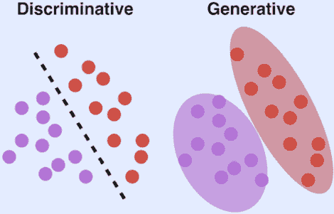
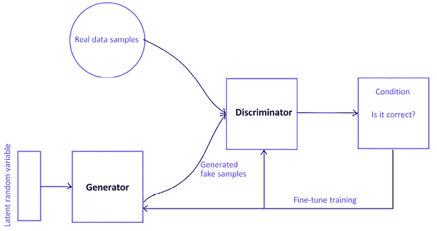
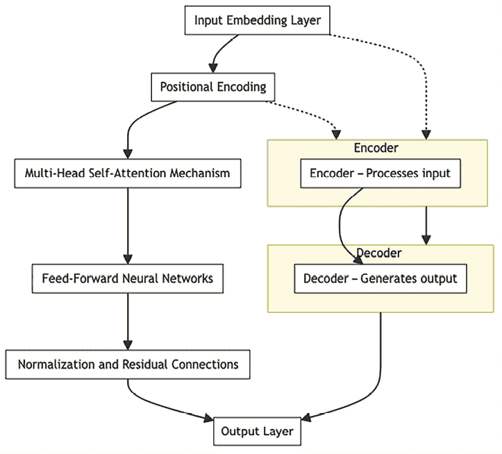
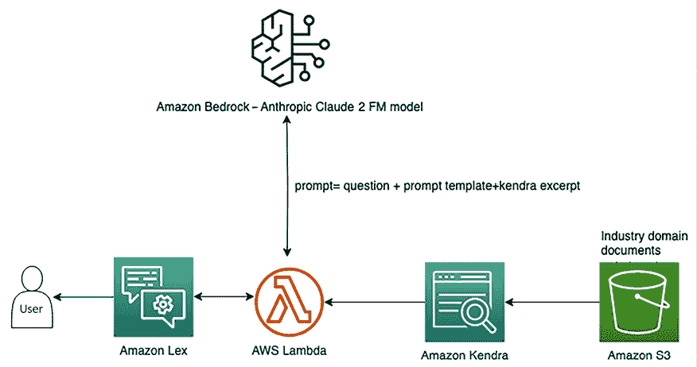

# 14

# 生成性 AI 架构

生成性 AI 技术不仅仅是行业术语——它是一种先进的工具，用于通过自动化关键任务（如内容生成、图像创建和知识辅助）来重塑商业运营。生成性 AI 代表了技术世界的重大飞跃，激发了那些热衷于技术创新的人的极大热情。生成性人工智能（GenAI）作为这一技术的缩写，其显著特点在于能够独立地生成新内容，如文本、图像、音乐、视频、代码等，其能力与人类创造力十分相似。

生成性 AI 在不同的商业领域中的使用正在增加。若使用得当，它可以大大减少运营业务所需的时间、资源和成本。例如，ChatGPT 可以协助创建产品的营销活动或充当旅行规划师，而 Midjourney 可以在一秒钟内生成图像。

你可能已经接触过一些生成性 AI 应用，如 ChatGPT、Midjourney、Gemini（前身为 Bard）、Amazon Q 和 Claude.ai 等。这项技术从大量收集的信息中学习，包括互联网信息，并利用这些知识创造新内容。就像拥有一个智能助手，能够在无需每个细节都由人类输入的情况下生成各种内容。然而，必须理解，这不是魔法——它是经过大量聪明思维和技术领域进步的结果。

但最令人兴奋的部分是，我们可以通过多种方式使用这些基础模型。例如，它们可以用于生成创意内容、通过聊天机器人自动化客户服务、增强数据分析、提供个性化推荐、简化语言翻译，甚至通过总结复杂文档来帮助研究。在本章中，你将更详细地了解生成性 AI，包括：

什么是生成性 AI？

+   生成性 AI 使用案例

+   生成性 AI 系统的基本架构

+   流行的生成性 AI 基础模型

+   如何开始使用生成性 AI

+   生成性 AI 参考架构

+   实施生成性 AI 的挑战

准备好踏上激动人心的生成性 AI 世界之旅吧。我们将揭开它在影响新世界发展方向方面的非凡能力背后的奥秘。

# 什么是生成性 AI？

生成性 AI 是一种人工智能，具有非凡的能力，能够开发新内容和创意。这包括进行对话、创作故事、制作图像和视频，甚至创作音乐等。

2022 年 12 月，位于香港的**人工智能设计实验室**（**AiDLab**）的设计团队策划了一场突破性的时尚展览——Fashion X AI（[`www.fashionxai.com/event-highlights-fashionshow`](https://www.fashionxai.com/event-highlights-fashionshow)）。这场展示的独特之处在于，展会中展示的每一件设计作品都是由人工智能创造的，灵感来自人类设计师提供的情感板、色彩调色板和概念。

像其他类型的人工智能一样，生成性人工智能依赖于**机器学习**（**ML**）模型。这些模型通常非常庞大，并且通过大量数据进行预训练。我们通常将这些模型称为**基础模型**（**FMs**）。

我们现在拥有的 FMs（例如用于大型语言任务的 OpenAI GPT-4 或 Google Gemini，来自 Stability AI 的用于将文本转换为图像的 Stable Diffusion，以及 OpenAI 的 Sora 文本到视频生成器）可以执行多个领域中的各种任务。它们可以撰写博客文章、生成图像、解答数学问题、进行对话，甚至根据文档中的信息回答问题。这些模型非常多功能，并有可能彻底改变我们创建和互动内容的方式。

生成性人工智能有潜力对全球经济带来深远的变化。根据高盛的报告，生成性人工智能可能推动全球 GDP 增长 7%（或近 7 万亿美元），并在 10 年内提升生产力增长 1.5%。你可以在高盛的**人工智能**（**AI**）报告中了解更多详细信息，链接：[`www.goldmansachs.com/intelligence/artificial-intelligence/`](https://www.goldmansachs.com/intelligence/artificial-intelligence/)。

FMs 因其规模和通用性而独树一帜，与传统的机器学习模型不同，后者通常是针对情感分析、图像分类和趋势预测等特定任务设计的。与这些传统模型不同，FMs 不需要为每个任务收集标注数据、训练和部署，而是提供了更为多样化的处理方式。一个经过预训练的 FM 可以适应多种任务。此外，这些模型还可以针对特定领域的功能进行定制，以适应各个企业的独特需求。重要的是，这种定制化可以仅使用一小部分数据，并结合所需的计算资源，而无需从头开始训练一个全新的模型。

FMs 的成功可以归因于三个关键原因：

+   **变压器架构**：变压器架构是一种神经网络，发挥着至关重要的作用。它高效、可扩展且可并行化，能够有效地建模输入和输出数据之间的关系。

+   **上下文学习**：一种突破性的训练范式——上下文学习已经出现。这种方法允许预训练模型通过指令或少量示例来处理新任务。这消除了对标注数据额外训练的需求，使得模型能够立即应用于新任务。

+   **大规模的新兴行为**：随着模型规模的增大和使用更大的数据集，模型开始展现出以前未见的能力。这一现象被称为“新兴能力”。例如，更大的模型能够生成更连贯、与上下文更相关的文本，识别数据中的复杂模式，甚至执行图像识别和语言翻译等任务，且准确性更高。它们还能够处理多步骤推理问题，提供详细的解释，甚至生成创意内容，如作曲或创作艺术作品，展现出细腻的理解和创造力。更大的模型在达到临界规模之前，具有执行超出其能力范围的任务的潜力。

为了更好地理解，让我们来看一些生成式人工智能可以帮助的使用案例。

# 生成式人工智能使用案例

让我们来看一下不同类别的各种使用案例，如客户体验、员工生产力和业务运营效率，并了解生成式人工智能如何增强现有的人工智能能力，并带来全新的可能性：

## 客户体验转型

生成式人工智能正在改变客户与企业互动的方式。假设你在网上购买鞋子。一个基于生成式人工智能的虚拟助手会在网站上迎接你，并根据你的风格和尺码偏好帮助你找到完美的鞋子。它甚至可以展示鞋子的图片，并回答你任何问题。让我们来看一些更多这样的使用案例，看看生成式人工智能如何帮助提升客户体验和互动：

+   **聊天机器人和虚拟助手**：想象一下，你访问一个网站时，聊天机器人弹出来帮助你。生成式人工智能为这些聊天机器人提供支持。它们可以像人类一样与您对话，理解您的问题，并提供有帮助的答案。

+   **智能联络中心**：当你拨打客户服务热线时，生成式人工智能在发挥作用。它确保你的互动更加个性化、高效和令人满意。你的问题会迅速且准确地得到解决。

+   **个性化**：你是否注意到像 Netflix 和 Amazon 这样的平台推荐能够理解你的偏好？这就是生成式人工智能的作用。它通过学习你的行为，并根据你的口味调整其推荐内容。

+   **内容审核**：生成式人工智能帮助社交媒体和其他平台保持清洁和安全。它扫描用户生成的内容，如评论和帖子，确保它们遵守规则和指导方针。

## 员工生产力提升

生成式人工智能不仅仅适用于客户，它还提升了员工的生产力。想象一下，你正在处理一个项目，并且需要撰写关于它的报告。与其从头开始，你可以利用生成式人工智能帮助你撰写介绍和关键点。这让你提前了解情况，可以集中精力添加自己的见解和专业知识。以下是一些生成式人工智能帮助提升员工生产力的用例：

+   **对话式搜索**：当你需要信息时，可能会使用搜索系统。生成式人工智能使这些系统更加智能。你可以用日常语言提问，AI 会理解并给出正确的答案。

+   **内容创作**：撰写报告和文章可能需要大量时间。生成式人工智能在这方面也大有帮助。它可以生成内容部分，如摘要或解释，帮助你创建精炼的文档。

+   **文本摘要**：想象一下你正在阅读一篇长篇研究论文。与其浏览所有页面，生成式人工智能可以总结主要观点。这样可以节省时间，并帮助你更快地掌握基本信息。

+   **代码生成**：对于程序员来说，编写代码是工作的重要组成部分。生成式人工智能可以根据你想要实现的目标建议代码片段。这加快了编码任务，使开发过程更加顺畅。

将生成式人工智能整合到企业场景中时，重要的是要处理其生成内容周围的法律考虑。你需要理解内容的来源，建立清晰的所有权是防止知识产权纠纷的关键。采用这种方法可以帮助企业避免法律问题，同时确保生成的内容符合组织的特定需求并保持其独特价值。

## 优化业务运营

生成式人工智能不仅局限于客户互动，它还增强了各种运营方面。在制造厂中，机器通过传感器进行监控。生成式人工智能分析这些传感器的数据，并预测机器可能出现问题的时间。这使得维护可以主动安排，预防意外故障和生产中断。以下是一些生成式人工智能帮助改善业务运营的用例：

+   **智能文档处理**：在企业中，有许多文件需要处理。生成式人工智能可以自动读取和理解这些文件，提取有意义的信息。这节省时间并减少错误。例如，生成式人工智能模型可以处理抵押贷款文件，并回答关于抵押利率、付款条件、期限等的问题。

+   **预测性维护**：对于使用机器的公司来说，预测设备何时需要维护至关重要。生成型 AI 分析来自机器和系统的数据，以预测维护需求，防止故障发生并最小化停机时间。

+   **质量控制与视觉检查**：确保产品符合高标准是制造业中的重要环节。生成型 AI 可以检查产品的图像，识别出人眼可能忽略的缺陷或不一致之处。

+   **数据增强**：训练 AI 模型需要大量的数据。生成型 AI 通过创建合成数据来帮助提高这些模型的准确性和可靠性。

在这一部分，你了解了生成型 AI 的应用场景。现在，让我们通过了解生成型 AI 的架构，来探究背后的原理。

# 生成型 AI 系统的基本架构

生成型 AI 系统的核心是一种大规模的 FM。FM 是经过大规模数据集预训练的大型模型，可以针对各种任务和应用进行微调或适配。为了理解生成型 AI 系统的架构，让我们将其拆解为简单的组成部分：

+   **生成器**：生成新数据的核心元素，无论是图像、文本、音乐还是其他形式的内容。生成器从现有数据中学习模式和关系，并利用这些知识生成新的、相似的内容。例如，生成器在图像生成中接受随机噪声，然后生成类似训练数据的图像。

+   **潜在空间**：一个概念空间，在这个空间中，模型以压缩形式表示数据。这就像是生成器用来创造新内容的数据的紧凑表示。它是一个低维向量空间，生成器从中生成数据。这就像是艺术家使用的秘密食谱本。它帮助生成器创作出不同类型的作品。例如，在文本生成中，潜在空间可以代表不同的写作风格；在图像合成中，潜在空间可能代表颜色和纹理等不同特征。

+   **损失函数**：衡量生成内容与期望输出之间匹配程度的指标。损失函数通过最小化生成数据与真实数据之间的差异，帮助模型随着时间推移不断学习和改进。可以想象，一位教练在告诉艺术家他们的作品与完美之间的差距。艺术家通过遵循这个指导，不断学习并提高。

+   **训练数据**：模型学习的现有数据。它可以是图像、文本、音频或任何其他类型的内容，模型从中学习。就像厨师通过品尝不同的食物来学习一样，生成器通过示例学习应该创造什么。例如，如果生成器正在创作歌曲，它就会通过聆听现有的歌曲来学习。

## 生成模型的类型

在了解生成模型之前，我们先了解它们与典型的机器学习判别模型有何不同。典型的机器学习判别模型，也称为判别模型，旨在区分不同类别或种类的数据。与目标是生成新数据点的生成模型不同，判别模型的重点是根据数据的特征区分现有数据点。这些模型基于输入数据预测某个结果的概率。常见的判别性机器学习模型包括逻辑回归、支持向量机等。你在*第十三章*《机器学习架构》中详细学习了这个概念。

生成模型与判别模型有所不同，后者专门用于根据预定义的分组对文本进行分类或标注。判别模型通常应用于面部识别等任务，在这些任务中，模型的训练重点是识别一个人面部的特定特征或属性。



图 14.1：生成模型与判别模型

如前面的图示所示，生成模型试图理解数据中的模式和结构。就像它们在学习游戏的潜规则，然后用这些规则创造出一个看起来像原始游戏的新事物。而判别模型则侧重于区分不同的事物。它们就像是侦探，训练用来识别事物之间的差异。判别模型通常用于监督学习任务，其中目标是分类或回归，而生成模型则用于理解数据分布或生成新数据点。

生成性人工智能涵盖了各种创建新内容的模型。我们将在接下来的子章节中讨论一些重要的类型。

### 生成对抗网络（GAN）

GAN 由两个组件组成：生成器和判别器。生成器的角色是生成内容，而判别器的任务是判断该内容的真实性，确定其是“真”还是“假”。它们进行一种“竞争”，生成器的目标是创造出足够有说服力的内容以欺骗判别器。随着这个过程的进行，生成器会逐渐提高其创造出看起来越来越逼真的内容的能力。下面的图示展示了 GAN 模型的工作原理：



图 14.2：GAN 的训练流程

上面的图示表示了生成对抗网络（GAN）的基本结构。我们以图像创作为例，逐步了解每个步骤：

+   **生成器**：GAN 的这个组件接收随机噪声作为输入。这种噪声通常被称为“潜在随机变量”。生成器的作用是生成与它所接受的真实数据相似的数据。可以把它想象成一个正在学习的艺术家，最初根据一些基本的艺术模式创作随机草图。例如，生成器开始通过创建随机图像，试图让它们看起来像著名的画作。

+   **真实数据样本**：这些是 GAN 设计来模仿的真实数据实例。它们作为生成器创建的数据质量的基准。在我们的例子中，这些是真正的历史名画，是生成器尝试模仿的艺术杰作。例如，像梵高或毕加索这样的艺术家的真实画作被输入到 GAN 中，作为“真实”艺术作品的例子。

+   **生成的虚假样本**：生成器使用输入的噪声生成新的数据样本。这些样本旨在与真实数据样本难以区分，尽管它们完全是由模型生成的。这些是生成器创建的新图像，试图复制真实艺术作品的质量和风格。例如，生成器生成的图像模仿梵高或毕加索作品的笔触和色调。

+   **判别器**：这个组件接收来自真实数据样本和生成器生成的虚假数据样本。它的工作是区分这两者，决定它收到的每个样本是现实的还是伪造的。可以把它看作一个艺术评论家，检查真实的艺术杰作和生成的图像，以判断新的图像是原作还是仿制品。例如，判别器审查这些图像，试图确定哪些是梵高或毕加索的真实画作，哪些是模仿品。

+   **条件**：判别器对数据是否真实或虚假做出判断，并将此信息作为反馈提供给生成器。艺术评论家（判别器）评估生成的图像并给予反馈，例如指出哪些方面让图像看起来像假的。例如，判别器注意到生成图像中的色调与原艺术家的风格不完全匹配，并将其标记为伪造。

+   **微调训练**：根据判别器的评估，生成器调整其参数，努力生成更有可能骗过判别器的更好的假样本。这个反馈回路继续进行，判别器也在不断提高自己辨别真实与虚假的能力。这个对抗过程持续进行，直到生成器能够熟练地生成逼真的数据。根据反馈，正在训练中的艺术家（生成器）从批评中学习，并改进技巧，以创作出更具说服力的艺术作品。例如，考虑到反馈，生成器调整技巧，可能改变颜色搭配或画笔风格，更好地模仿大师级作品。

生成器和判别器本质上处于一个持续的博弈中，生成器试图生成越来越逼真的数据，而判别器努力提高自己区分真实数据和虚假数据的能力。 “训练”完成的标志是判别器无法可靠地区分真假数据，这意味着生成器的输出足够逼真。

GAN（生成对抗网络）在各个商业领域有许多实际应用，许多流行工具都利用了这一模型。

### 变分自编码器（VAE）

想象一下，你有一堆各种形状和大小的乐高积木，你的任务是把它们整齐地存放在一个小盒子里。但有一个限制：你只能存放关于如何重建原始乐高结构的说明，而不能存放这些积木本身。这就类似于 VAE 处理数据的方式。

在这个类比中，“编码器”就像你将每个乐高结构拆解，找出用更少积木重新构建它的最佳方法，然后将这些说明写下来。你放置这些说明的盒子里的空间，就像是“潜在空间”——原始结构的压缩版本。

后来，当你想重建一个乐高结构时，你会查看盒子里的说明书。“解码器”就像你按照那些说明书，用一套新的积木来建造一个与原始结构非常相似的新乐高结构。

因此，VAE 将大型复杂的数据（原始乐高结构）压缩成一个更简单、更小的形式（盒子里的说明），然后利用这个压缩后的形式生成类似原始数据的新数据（重建乐高结构）。这个过程在技术领域非常有用，适用于创建新图像、音乐或任何模仿原始数据风格的数字内容。如下图所示，一个手写图像通过 VAE 进行编码和解码：


图 14.3：使用 VAE 进行图像重建的流程

上面的图示描述了使用变分自编码器（VAE）进行图像重建的流程。以下是 VAE 如何通常在这个任务中工作的解释，举一个重建人脸的例子：

+   **输入图像**：这些是你输入到 VAE 系统中的原始图像。目标是能够在编码和解码之后重建这些图像。假设我们有一组面部照片。每张图像都是一个清晰的高分辨率人脸照片。

+   **编码器**：VAE 的编码器部分接收输入图像，并将其压缩成一个更小、更紧凑的表示，称为潜在空间或图像编码。这个过程涉及学习输入图像中的基本特征和模式。编码器分析输入的照片，将每张图像压缩成一个包含面部关键特征的数字集，如眼睛、鼻子和嘴巴的形状。可以将其想象为创建一个独特的编码，能够代表一个面孔，而占用的空间远小于原始图片。

+   **图像编码**：在这一阶段，编码器已将输入图像转换为一组编码，这些编码代表图像的关键特征，相比原始图像，维度大大缩小。在变分自编码器（VAE）的背景下，这些编码还捕捉了输入数据的概率分布。这些数字集（编码）是照片的精髓，以紧凑的形式存储，可以看作是图像的详细特征。在面部的情况下，这些特征可能捕捉到不同个体之间面部特征的变化。

+   **解码器**：解码器接收这些编码，并尝试重建原始图像。它使用压缩数据生成尽可能接近原始输入图像的图像。解码器的作用就像一位艺术家，任务是绘制一个人的面部。它接收这些数字编码，并利用它们重建面部的照片。它尝试仅凭这些紧凑的编码尽可能准确地绘制每一张面孔。

+   **重建图像**：VAE 的最终输出。这些是由解码器从图像编码中重建的图像。这些图像的质量取决于 VAE 压缩和重建数据的能力。结果是一系列由 VAE 生成的新面部照片。这些重建的图像应该与原始输入照片非常相似。如果将它们与原始图像并排比较，你会发现它们很相似，尽管由于压缩过程中的细节损失，它们可能略显模糊或有轻微的差异。

本质上，流程描述了 VAE 学习高效数据表示的能力，并生成与原始输入相似的新数据。这个过程广泛应用于各种场景，包括图像去噪、图像修复，并作为生成模型创建与训练数据集具有相似特征的新图像。

### 基于 Transformer 的生成模型

这些模型，如 GPT-4，基于变压器架构构建，擅长理解和生成文本序列等数据。它们学习语言和上下文中的模式，使其能够生成连贯和上下文相关的文本。以下图显示了模型中变压器的工作方式：



图 14.4：基于变压器的生成模型组件

上图显示了变压器模型的工作流程，这是一种用于**自然语言处理**（**NLP**）任务，如翻译、文本生成等的先进神经网络类型。让我们通过语言翻译的示例来看每个步骤：

+   **输入嵌入层**：过程始于输入嵌入层，其中单个元素（如句子中的单词）被转换为模型可以处理的数值向量。例如，句子“How are you?”输入模型，每个单词转换为数值向量。这就像给每个单词分配一个唯一的可识别的徽章编号，以便模型可以理解和处理它们。

+   **位置编码**：将这些向量添加到位置编码中，以向模型提供有关句子中每个单词位置的信息，因为变压器本身并不理解单词的顺序。例如，除了徽章编号外，每个单词还分配了一个位置标签。“How”标记为第一个单词，“are”标记为第二个，“you”标记为第三个。这帮助模型考虑单词的顺序。

+   **编码器**：将组合的嵌入（输入嵌入加上位置编码）输入编码器。编码器处理输入数据，捕获每个单词相对于序列中其他单词的上下文。就像编码器阅读句子并理解每个单词在整个句子上下文中的含义。编码器通过它们的徽章编号和位置标签来理解句子的含义。例如，它注意到第一个位置的“How”通常用于开头问句。

+   **多头自注意机制**：在编码器内部，多头自注意机制允许模型以不同方式权衡输入的影响。就像模型通过观察周围的其他单词考虑单词含义的不同方面。编码器特别关注句子中每个单词如何与其他单词相关联。例如，它注意到“How”与“you”相连形成一个有礼貌的询问关于某人的健康状况。

+   **前馈神经网络**：接下来，处理后的信息通过前馈神经网络传递，这些网络在每一层顺序处理数据，以精炼和抽象表达。这些网络从注意机制中细化信息，几乎像一组编辑人员在修改草稿以更好地传达句子意图。

+   **归一化和残差连接**：在此过程中，应用归一化和残差连接，以帮助保持数据流并减少在网络深层中的数据变换错误的风险。这些元素确保通过模型流动的信息既不被削弱也不被放大。为了防止错误在网络层中扩展，这些组件像是检查点，确保数据沿着正确的轨迹前进。

+   **解码器**：在编码器处理完输入后，解码器使用这些信息来生成输出。它接收来自编码器的处理数据，并开始生成转换后的序列，如将句子翻译成另一种语言或在对话中生成回应。解码器从编码器接收处理过的信息，并开始生成输出。如果正在进行翻译，它会开始生成翻译后的句子。

+   **输出层**：解码器的最终输出会发送到输出层，输出层将高级神经网络的输出转回可读格式，如人类语言的句子。此时，最终的输出开始形成。如果模型正在翻译句子，这一层将根据所有处理过的信息开始构建翻译。

Transformer 模型读取并理解输入数据（如句子、段落等），处理这些数据以理解上下文，并根据这些理解生成相关的输出。对于“你好吗？”，模型的编码器部分处理问题，而解码器则根据编码器提供的信息以及已生成的内容，一次生成一个单词的回答或翻译。

可以把编码器看作是负责查看输入信息的部分，而解码器则是负责生成输出的部分。例如，GPT-4 就是基于 Transformer 模型的。当你给它一个起始点时，它可以生成符合上下文且有意义的文本。

该模型使用“自注意力”来确定起始点中的哪些单词是重要的，以及它们之间是如何连接的。通过这种方式，模型能够真正理解你的需求并给出合适的回答。

### 其他重要的生成模型

除了前面提到的类型外，还有其他值得注意的生成模型：

+   **PixelCNN 和 PixelRNN**：这些模型像素逐个生成图像，捕捉图像中的细节和相互依赖关系。可以想象你在逐个像素地绘制一幅画，确保每个像素都与周围的像素相协调。

+   **基于流的模型**：这些模型学习如何将一种数据分布转换为另一种数据分布，使其能够生成与目标分布匹配的样本。这就像是根据具体的步骤，用简单的原料制作一道精美的菜肴。

这些生成模型具有优势和应用，使其适用于从图像生成到文本创作的广泛任务。它们的多样化能力为生成式 AI 的丰富领域做出了贡献。

## 超参数调优和正则化在架构中的重要性

超参数调优和正则化是生成式 AI 架构的微调和安全措施。例如，在图像生成中，您可能会调整诸如学习率等超参数，学习率决定了模型学习的速度；如果学习率过高，模型可能会学习到错误的模式，就像有人在钢琴上弹奏一首曲子时按键力度过大或过小。正则化可能涉及像 dropout 这样的技术，在训练过程中随机忽略模型的一些神经元，以使模型更强健，就像训练一支足球队时让一些球员休息，这样球队就不会过于依赖某一个球员。它们在使这些系统良好运作并生成高质量内容方面起着至关重要的作用。让我们理解它们的重要性。

### 超参数调优

可以把超参数看作是控制生成式 AI 系统学习和创造方式的旋钮和开关。它们会影响学习速度、输出的细节程度，以及创造力与准确性之间的平衡。

想象一下，您正在寻找烘焙蛋糕的最佳烤箱温度。温度太高会烧焦；温度太低则会保持黏糊糊的状态。超参数调优类似于此。它有助于调整参数，以便 AI 系统以最佳方式学习，创造出恰到好处的内容。

例如，超参数可能控制音乐生成系统中旋律的长度、节奏或所用的乐器。调整这些超参数可以确保音乐听起来和谐，并且与期望的风格相匹配。

### 正则化

正则化就像给走钢丝的人加上安全网。它防止 AI 系统过于放纵，生成过于夸张或不真实的内容。它是一种控制输出并确保其行为得当的方式。

在生成式 AI 系统中，正则化有助于防止过拟合。过拟合是指系统在模拟训练数据时过于优秀，但在处理新的、未见过的数据时表现不佳。正则化技术通过模拟对学习过程中的某些部分施加轻微惩罚，帮助系统更好地泛化，创造出更具多样性和创意的内容。

例如，在图像生成系统中，正则化可以确保生成的图像具有一致的颜色和形状，防止它们看起来过于嘈杂或奇怪。

超参数调优和正则化很重要，因为它们微调生成式 AI 系统的性能，确保其生成高质量、一致且真实的内容。如果没有它们，系统可能会创造出过于单调的内容，或是过于混乱且毫无意义的内容。

就像厨师调整烹饪时间并加入合适的调味料来制作完美的菜肴一样，超参数调整和正则化会微调生成性人工智能系统，创造出既富有创意又符合预期输出的内容。它们确保系统始终保持正确的轨道，创作出令人兴奋且可靠的内容。

# 流行的生成性人工智能基础模型

生成性人工智能领域正在迅速发展，各种组织推动技术边界，并推出强大的基础模型以促进创新。像 ChatGPT 这样的模型的发布无疑加速了这一趋势。无论是已有的科技巨头，还是新兴的初创公司，都在积极参与生成性人工智能的浪潮，旨在开发更复杂、更强大的基础模型。以下是一些在生成性人工智能中最受欢迎的基础模型：

+   **Amazon**：**亚马逊网络服务**（**AWS**）是全球顶级的云服务提供商之一，并在机器学习和生成性人工智能领域提供大量产品。AWS 推出了一项生成性人工智能服务，名为 AWS Bedrock，用户可以通过 API 以无服务器的方式访问流行的基础模型。Amazon SageMaker JumpStart 是另一项服务，提供访问各种基础模型的功能，并可以根据需要对其进行调优。Amazon Titan 是 AWS 的旗舰生成性人工智能模型。亚马逊的 Titan 套件包括一系列适用于各种生成任务的基础模型，其中包括：

    +   **Titan 文本嵌入**：用于上下文文本表示

    +   **Titan 多模态嵌入**：用于解读文本和图像之间的数据

    +   **Titan 文本精简版**：用于资源受限环境中的高效文本处理

    +   **Titan 文本极速版**：用于快速文本处理任务

    +   **Titan 图像生成器**：用于根据文本输入创建或修改视觉内容

你可以通过访问亚马逊床岩（Amazon Bedrock）页面来了解亚马逊标题模型，并关注未来的相关发展：[`aws.amazon.com/bedrock/titan/`](https://aws.amazon.com/bedrock/titan/)。

+   **OpenAI**：OpenAI 是一个致力于创建和推广开放且符合道德标准的人工智能的研究机构。它已经创建了多个生成性人工智能模型，包括：

    +   **DistilGPT2**：高效的文本生成模型

    +   **GPT-3**：多功能文本生成与问答模型

    +   **GPT NeoXT**：用于多样语言任务的先进模型

    +   **GPT-3.5**：高效地生成更长、更连贯的文本

    +   **GPT-4**：具有类人表现的多模态模型

    +   **CLIP**：学习文本与图像之间的关系

    +   **CLIP 引导扩散**：根据文本提示创建对齐的图像

    +   **DALL·E**：根据自然语言提示生成图像

    +   **MuZero**：通过自我对弈学习玩游戏

    +   **文本转语音（TTS）**：将文本转化为自然听起来的语音

    +   **Whisper**：音频转文本的转录模型

    +   **嵌入**：将文本转换为数值数据

    +   **内容审核**：评估文本中的敏感内容

    +   **Sora**：根据书面提示生成视频

OpenAI 正在开发 GPT-5，这是他们最新且最先进的训练模型。要了解更多关于 OpenAI 模型的信息，您可以访问他们的官方网站：[`openai.com/`](https://openai.com/)。OpenAI 在其平台上提供了关于模型、研究、出版物和 API 访问的详细信息。

+   **Google**：Google 是 AI 和机器学习的先驱。它已经开发出多个生成型 AI 模型，如：

    +   **Google Gemini**：用于语言翻译、内容创作和查询回答的大型语言模型

    +   **BERT**：一种提高语言处理中的上下文理解的模型

    +   **BigGAN**：生成高分辨率、逼真的图像，用于视觉内容创作

    +   **Text-to-Text Transfer Transformer (T5)**：自动化生成各种 NLP 任务的内容

    +   **Flan T-5 模型**：针对特定语言处理任务，包括文本和代码进行定制

    +   **Pathway Language Model (PaLM)**：其中之一最大的语言模型，在文本生成和翻译方面表现出色

    +   **LaMDA**：为对话应用设计，模拟人类对话

    +   **Falcon-7B 和 Falcon-40B**：专为语言翻译、问答和文本生成设计的模型

    +   **Chinchilla by DeepMind**：一个专注于文本生成和语言翻译任务的大型语言模型

Google 目前专注于 Gemini，并正在构建一个更先进的版本，扩展到订阅模型。您可以通过访问 Google AI 网站([`ai.google/`](https://ai.google/))或 DeepMind 网站([`deepmind.com/`](https://deepmind.com/))，了解更多关于 Google 的 AI 模型和研究。

+   **Anthropic**：Anthropic 是一个研究机构，致力于创建能够与人类价值观和偏好对齐的通用和可扩展 AI。它已获得来自多家大型科技公司，包括 Amazon（投资 50 亿美元）和 Google（投资 20 亿美元）的重大投资。它已开发出一个名为 Claude 的生成型 AI 模型系列，包括以下模型：

    +   **Claude**：一个提供先进语言理解和生成能力的 FM

    +   **Claude 2**：Claude 的增强版本，具有改进的语言处理能力和上下文理解

    +   **Claude 2.1**：进一步优化的版本，提供更细腻的语言生成和理解能力

    +   **Claude Instant**：为速度而设计，提供快速响应，同时保持有效的语言理解

    +   **Claude 3**：最新的模型系列，设定了各类认知任务的新行业基准，并且提供三种变体——Haiku、Sonnet 和 Opus。

Anthropic 通过不同平台提供这些模型，例如 Amazon Bedrock 和 Google Vertex AI，以及他们自己的 Claude AI 网页聊天界面**。** 要了解最最新、最全面的模型列表，请直接访问 Anthropic 的官方网站：[`www.anthropic.com/claude`](https://www.anthropic.com/claude)。

+   **Meta (Facebook) AI**：Meta AI 是一个研究组织，开发并应用 AI 技术用于与社交媒体、通讯、内容创作等相关的各种产品和服务。它开发了多个生成式 AI 模型，如：

    +   **RoBERTa**：一种增强版的 BERT 模型，通过更广泛的训练和微调实现了更好的性能

    +   **DETR**：通过将卷积神经网络与 Transformer 架构结合，简化了图像中的目标检测

    +   **Llama**：一系列旨在理解和生成类人文本的语言模型，提供不同大小的版本以满足不同的计算和应用需求

    +   **BlenderBot**：一种对话 AI，可以进行有意义且连贯的互动，模拟类人对话

    +   **Faiss**：一个用于高效相似度搜索和聚类的库，特别适合处理大规模数据集和复杂的相似性任务

你可以访问 Meta 的官方网站，了解其在生成式 AI 领域的最新发展：[`ai.meta.com/`](https://ai.meta.com/)。

+   **Microsoft**：Microsoft 广泛使用 OpenAI 的产品，并进行了 100 亿美元的投资，同时提供**OpenAI 模型即服务**（**MaaS**）。然而，它也开发了生成式 AI 模型，如**Turing-NLG**和**MPT-7B**。在 Microsoft 的 MaaS 模型下，它提供 OpenAI 模型，如 GPT4、GPT3.5、DALL-E 和 Whisper。你可以访问他们的生成式 AI 产品页面，在这里了解 Microsoft Azure 模型目录：[`azure.microsoft.com/en-us/products/machine-learning/generative-ai`](https://azure.microsoft.com/en-us/products/machine-learning/generative-ai)。

+   **AI21 Labs**：AI21 Labs 是一个专注于自然语言理解和生成的研究组织。它创建了多个生成式 AI 模型，如**潜在逻辑深度扩展**（**DELL**）、**Jurassic-1**和**Jurassic-2**。它推出了 AI21 Studio 来普及其模型的使用，并与 Amazon 合作通过 Amazon Bedrock 提供这些模型。你可以在这里访问 AI21 的官方博客，了解最新的产品：[`www.ai21.com/blog`](https://www.ai21.com/blog)。

+   **Nvidia**：Nvidia 专注于**图形处理单元**（**GPU**）、游戏、云计算、AI 等领域。它开发了多个生成式 AI 模型，例如 StyleGAN2 和**GANVerse3D**。你可以在这里了解更多关于 Nvidia 模型的信息：[`www.nvidia.com/en-us/ai-data-science/generative-ai/`](https://www.nvidia.com/en-us/ai-data-science/generative-ai/)。

+   **Jasper.ai**：Jasper.ai 是一家为市场营销人员提供生成式 AI 解决方案的科技公司。它开发了一个名为 Jasper 的生成式 AI 模型，并推出了 Jasper AI Copilot 以扩展其产品。你可以在这里了解更多关于 Jasper 的信息：[`www.jasper.ai/`](https://www.jasper.ai/)。

+   **Hugging Face**：Hugging Face 是一家提供开源工具和平台的科技公司，专注于自然语言处理（NLP）。它创造了多个生成式 AI 模型，如**Bloom 模型**、**BloomZ 176B**、**Lyra-Fr 10B**和**Lyra-Mini**。想要了解更多关于 Hugging Face 及其生成式 AI 模型的内容，可以访问其官方网站并探索 Model Hub，在那里可以获取详细信息并访问其模型。以下是帮助你入门的链接：[`huggingface.co/docs/hub/en/models-the-hub`](https://huggingface.co/docs/hub/en/models-the-hub)。

上述列表并不完整，但涵盖了一些最流行的模型。生成式 AI 中的 FM（功能模型）正在经历巨大的发展。随着这一领域的研究不断深入，我们可以期待未来会开发出更强大、更通用的模型。

# 如何开始使用生成式 AI

开始使用生成式 AI 需要选择适合自己需求的工具和平台。无论你是希望参与 AI 生成对话的终端用户，还是作为开发者/机器学习科学家想要创建复杂应用程序，许多不同提供商的资源都可以帮助你踏上生成式 AI 的旅程。开始使用生成式 AI 是令人兴奋的！以下小节将介绍不同类型的用户如何开始探索生成式 AI。

## 面向终端用户

对于希望在日常活动中利用生成式 AI 的个人，如内容创作、营销材料、电子邮件撰写和高效学习，可以使用几种易于访问的工具：

+   **ChatGPT**提供了一个由 GPT-3.5 驱动的用户友好型聊天机器人体验。该工具根据接收到的输入以自然语言进行响应，从而使各种话题的互动对话成为可能。在撰写时，ChatGPT 可以免费访问，网址为[`chat.openai.com`](https://chat.openai.com/auth/login)，也可以选择升级到 GPT-4，获得更多高级功能，月费为 20 美元。你还可以探索 GPT 商店中由开发者社区创建的各种定制应用程序。

+   **Claude**是由 Anthropic 开发的生成式 AI 模型。Claude 专门生成电子邮件、摘要、故事等文本。它的功能可以在[`claude.ai/chat/`](https://claude.ai/chat/)找到，旨在支持内容创作，并与人类价值观相一致。

+   **Google Gemini（前身为 Bard）**是谷歌推出的一款聊天机器人。像 ChatGPT 一样，Gemini 能够全面且非正式地回答你的问题，并生成各种创意文本格式，如诗歌、代码、脚本、音乐作品、电子邮件、信件等。你可以在[`gemini.google.com/app`](https://gemini.google.com/app)探索它的功能。Gemini 是谷歌首个问答应用的继任者，原名为 Bard。

+   **Copilot**是由微软提供的生成式 AI 服务，利用如 GPT-4 等模型。它通过自然语言促进对话，使得与 AI 驱动系统的互动和沟通变得更加容易。此服务可以通过[`www.bing.com/chat`](https://www.bing.com/chat)访问，用户可以无缝、直观地进行对话。

+   **Amazon Q**，由 AWS 提供的服务，旨在显著提升组织内的生产力和决策能力。它作为一种先进工具，可以迅速提供相关答案，帮助解决问题、生成内容并执行任务，利用公司数据库、代码库和企业系统中丰富的知识。你可以通过访问 AWS 页面了解更多关于 Amazon Q 的信息：[`aws.amazon.com/q/`](https://aws.amazon.com/q/)。

+   **Perplexity AI**代表了搜索技术的突破，作为一个先进的 AI 驱动聊天工具，它超越了传统搜索引擎。作为一个对话式搜索引擎，Perplexity AI 运用 NLP 和 ML 技术，准确地回应各种问题。它为用户提供了快速访问各类主题信息的途径，简化了搜索过程。此外，它邀请用户通过提问后续问题或寻求更多细节，深入了解感兴趣的主题，从而丰富用户的理解和学习体验。你可以通过访问[`www.perplexity.ai/`](https://www.perplexity.ai/)来探索它。

还有许多其他 AI 应用可用于不同的目的，来自像 Jasper、Midjourney、Canva 和 Luminar 等公司。通过利用这些生成式 AI 工具，个人可以简化任务，激发创造力，并提高日常工作的生产力，从创作内容到进行互动对话。每个工具都有其独特的功能，使其成为简化和提升日常生活各个方面的多功能资产。

## 对于开发者

像应用开发者、数据科学家和机器学习工程师等开发者可以利用生成式 AI 通过生成代码、调整已开发模型和通过 API 访问现有模型，将他们的生产力提高多倍。让我们深入了解一下：

+   **通过代码生成提高生产力**：生成式 AI 工具提供了生成代码的能力，使你能够专注于业务逻辑，而不是编写重复的代码。一些最受欢迎的代码生成工具包括：

    +   **Amazon CodeWhisperer**：AWS 提供的这项服务使用自然语言处理（NLP）和机器学习（ML）技术，根据自然语言查询生成代码片段。例如，你可以让 CodeWhisperer 创建一个使用 SES 发送电子邮件的 Lambda 函数，它会为你生成以下代码：

        ```
        `#create a Lambda function that sends an email using SES def lambda_handler(event, context):     client = boto3.client(‘ses’)     response = client.send_email(         Source=’XXXXXXXXXXXXXXXXXXXXX’,         Destination={             ‘ToAddresses’: [                 ‘XXXXXXXXXXXXXXXXXXXXX’,             ],         },         Message={             ‘Subject’: {                 ‘Data’: ‘Hello from SES!’,             },             ‘Body’: {                 ‘Text’: {                     ‘Data’: ‘Hello from SES!’,                 },             },         },     )     print(response)     return response` 
        ```

        CodeWhisperer 支持 15 种以上的编程语言，包括 Python、Java 和 JavaScript 等，以及流行的 **集成开发环境** (**IDEs**)，如 VS Code、IntelliJ IDEA、AWS Cloud9、AWS Lambda 控制台、JupyterLab 和 Amazon SageMaker Studio。你可以在这里了解更多关于 Amazon CodeWhisperer 的信息：[`aws.amazon.com/pm/codewhisperer/`](https://aws.amazon.com/pm/codewhisperer/)。

+   **Azure Copilot**：此工具使用 OpenAI Codex，一种经过数十亿行代码训练的大型语言模型，在 VS Code 中生成代码建议。你可以使用 Azure Copilot 编写多种语言的代码，如 Python、JavaScript、TypeScript 等。以下是 Azure Copilot 工作的示例：

    ```
    `# Suppose you want to write a function in JavaScript that takes an array of numbers and returns the average # You can start by typing the function name and parameters function average(numbers) { # Then you can press Ctrl+Space to trigger Azure Copilot suggestions # Azure Copilot will suggest the following code based on the context and common patterns   // initialize the sum to zero   let sum = 0;   // loop through the array of numbers   for (let number of numbers) {     // add the number to the sum sum += number;   }   // calculate the average by dividing the sum by the length of the array   let average = sum / numbers.length;   // return the average   return average; }` 
    ```

+   **ChatGPT 解释器**：此工具使用基于 GPT-3 的聊天机器人 ChatGPT，根据自然语言输入交互式地生成代码。你可以使用 ChatGPT 解释器编写 Python、Java 和 C# 等语言的代码。以下是 ChatGPT 解释器工作原理的示例：

    ```
    `User: Write a function in Python that takes a list of numbers and returns the sum of the squares of the odd numbers. Chatgpt: def sum_of_squares_of_odd_numbers(numbers):     # initialize the sum to zero sum = 0 # loop through the list of numbers for number in numbers:         # check if the number is odd if number % 2 == 1:             # square the number and add it to the sum sum += number ** 2 # return the sum return sum` 
    ```

+   **Google Codey**：Codey 支持超过 20 种编程语言，包括 Python、Java、JavaScript 和 Go 等流行语言。Codey 的主要目标是显著加快软件开发生命周期。它通过实时代码完成和生成功能来实现这一目标。开发人员可以根据具体的代码库定制 Codey，从而增强其在各种编程项目中的实用性。

如果你有兴趣在应用程序中利用生成式 AI FMs 的强大功能，恭喜你！许多这些模型可以通过著名云平台和组织提供的 API 轻松访问。让我们详细了解一下它们。

## 使用公共云服务商提供的生成式 AI FMs 在你的应用程序中。

由于一系列云平台提供 API，将生成式 AI FMs 集成到你的应用程序中现在比以往任何时候都更容易了。下面我们将详细了解一些这些流行的平台，以及如何利用它们：

+   **AWS**：AWS 推出了 Amazon Bedrock 和 Amazon Bedrock 代理的正式发布，作为其致力于引领云 AI 领域的承诺的一部分，通过提供先进的 AI 解决方案和与行业领先的 FM 提供商的合作伙伴关系。Amazon Q 是一款新的生成式 AI 助手，专为专业用途设计，并在超过 17 年的 AWS 专业知识基础上进行训练，展示了 AWS 将 AI 集成到工作场所的创新方法，承诺提升企业的生产力和创造力。

+   **Amazon Bedrock**：Amazon Bedrock 是 AWS 提供的一个强大的基于云的平台，旨在训练、构建和部署机器学习模型。它提供了广泛的 API 套件，支持包括自然语言处理、计算机视觉和语音识别等多种任务。Bedrock 还提供访问来自 Amazon 和领先 AI 组织的基础模型（FM），如 AI21 Labs、Anthropic、Cohere、Meta 和 Stability AI。要开始使用 Amazon Bedrock 开发生成式 AI 应用程序，首先需要选择一个适合你需求的基础模型。这可以通过 Amazon Bedrock 控制台或 API 完成。选择基础模型后，你可以通过 Amazon Bedrock API 轻松将其集成到你的应用程序中。可用的基础模型示例包括 Amazon Titan 用于文本摘要、Jurassic-2 用于遵循指令的语言模型，以及 Claude 3 用于深思熟虑的对话和内容创作。你可以通过以下链接开始使用 Amazon Bedrock：[`aws.amazon.com/bedrock/`](https://aws.amazon.com/bedrock/)。

+   **SageMaker JumpStart**：SageMaker JumpStart 是 AWS 的另一项服务，旨在简化机器学习开发过程。它提供了预构建的机器学习模型和工作流，加速你的机器学习项目。SageMaker JumpStart 为各种任务提供 API，例如自然语言处理（NLP）、计算机视觉和语音识别。要通过 SageMaker JumpStart 开始使用生成式 AI 应用程序，你需要选择一个与项目需求相匹配的预训练模型。选择后，你可以通过 SageMaker JumpStart API 将该模型部署到你的应用程序中。可用的模型包括 Hugging Face 用于 NLP、ImageNet 用于图像分类，以及 YOLOv5 用于目标检测。你可以通过以下链接了解如何开始使用 SageMaker JumpStart：[`docs.aws.amazon.com/sagemaker/latest/dg/studio-jumpstart.html`](https://docs.aws.amazon.com/sagemaker/latest/dg/studio-jumpstart.html)。

+   **Microsoft Azure**：微软正在积极将生成式 AI 技术嵌入其整个产品套件，包括 Azure、M365、Dynamics 365、Power Platform、Windows 和 GitHub，展示生成式 AI 对其产品线的变革性影响。对于企业客户，微软通过 Azure OpenAI 服务推出了其生成式 AI 计划，与 OpenAI 直接提供的服务不同，它专注于私有网络、顶级安全性、可扩展性和区域服务可用性等特性，从而将其服务与众不同。

+   **Azure OpenAI**：Azure OpenAI 是微软的产品，提供访问各种基础模型，用于自然语言处理、计算机视觉和语音识别。你可以利用 Azure OpenAI API，接入像 GPT-3 这样的 NLP 模型、DALL-E 的基于文本描述的图像生成模型，以及 Speech Services 的语音识别和合成任务模型。Azure AI Studio 包括一个模型目录，类似于亚马逊的 SageMaker JumpStart。微软在 Azure AI 中引入了 MaaS，具有与亚马逊 Bedrock 相似的功能，包括即用型 API、托管微调和集成工具。你可以通过此链接注册 Azure OpenAI：[`azure.microsoft.com/en-us/products/ai-services/openai-service`](https://azure.microsoft.com/en-us/products/ai-services/openai-service)。

+   **谷歌云平台（GCP）**：GCP 将其生成性 AI 能力集成到 Vertex AI 中，展示了其增强解决方案套件的承诺。其 AI 计划的基石是 PaLM 2 FM，现在支持超过 25 个谷歌产品，并通过 PaLM API 向 GCP 客户提供。谷歌还开发了行业特定的 FM，包括用于医疗的 Med-PaLM 和用于安全应用的 Sec-PaLM，并推出了一系列名为 Duet AI 的 AI 助手，涵盖了 Google Workspace 和 Google Cloud。

    在其 FM 产品组合的重要扩展中，谷歌云宣布了 Gemini，这是其最新的第一方 FM。Gemini 将以多种配置形式提供，包括 Ultra、Pro 和 Nano，以满足广泛的应用需求。此外，谷歌云还提供了 Model Garden 和 Generative AI Studio，它们通过 Vertex AI 促进了对自家和第三方模型的访问。尽管提供了广泛的模型，但目前谷歌云仅通过 API 提供自家 PaLM 2 模型的直接访问，用于托管使用，这突显了其将专有技术与开放创新相结合，推动生成性 AI 解决方案的战略。谷歌云将其 Duet AI 产品策略分为两个部分：Duet AI for Google Workspace 和 Duet AI for Google Cloud。Duet AI for Google Workspace 将直接与微软的 M365 Copilot 竞争。Duet AI for Google Workspace 已经全面发布，并且有趣的是，它的定价恰好与 M365 Copilot 相同，至本文写作时为止。

+   **谷歌云生成性 AI**：谷歌云生成性 AI 为谷歌强大的生成预训练变换器模型打开了大门。你可以利用谷歌云生成性 AI API，接入像 DALL-E 2 这样的图像生成模型、T5 的 NLP 任务模型以及 BigGAN 的高分辨率图像生成模型，通过简单的自然语言提示生成图像。欲了解更多关于谷歌 AI 服务的信息，请访问此链接：[`cloud.google.com/ai/generative-ai`](https://cloud.google.com/ai/generative-ai)。

下表展示了目前主要公共云服务提供商通过 API 提供的 FM 模型：

| **公共云提供商** | **可用的 FM 提供商** | **可用的 FM** |
| --- | --- | --- |
| AWS | Amazon AnthropicAI21 LabsCohereMetaStability.ai | Titan 文本嵌入 Titan 多模型嵌入 Titan 文本轻量版 Titan 文本快递版 Titan 图像生成器侏罗纪-2 超版侏罗纪-2 中版 Claude 2Claude 2.1Claude 即时版 Cohere 命令 Cohere 命令轻量版 Cohere 嵌入 Llama 2Llama 2 13BLlama 2 70B 稳定扩散 XL 1.0 |
| Microsoft Azure | OpenAI 作为服务的模型 Meta | GPT-4GPT-4 Turbo,GPT-4 视觉版,GPT-3.5GTP-3.5 Turbo 嵌入模型 DALL-EWhisperLlama |
| GCP | Google | PaLM 2ImagenCodey 嵌入模型 |

表 14.1：通过公共云提供商访问的 FM

虽然这些平台是 GenAI 应用开发的顶级选择，但还有其他一些云服务商提供类似的能力，包括 IBM 云、阿里云和腾讯云。

为您的项目选择最佳平台将取决于您的具体需求，无论您是需要无服务器环境（Amazon Bedrock）、广泛的预训练模型（SageMaker JumpStart）、访问 OpenAI 的 GPT-3 模型（Azure OpenAI），还是 Google 的 LaMDA 模型（Google Cloud 生成 AI）。每个平台都具有独特的优势，可以帮助您创建适应多种用例和行业的生成 AI 应用程序。虽然您可以访问许多 FM，但选择适合的模型对于应用程序的成功至关重要。让我们一起学习如何根据您的需求选择最佳 FM。

### 选择合适的 FM

选择适合您项目的 FM 是确保生成 AI 应用成功的关键步骤。以下是选择最合适 FM 时需要考虑的一些关键因素：

1.  **问题识别**：首先明确您希望通过生成 AI 解决的具体问题。确定您的项目是涉及自然语言处理（NLP）、计算机视觉、语音识别还是其他任务。这一步有助于将您的选择范围缩小到专为您的特定领域设计的 FM。假设您正在为客户支持应用程序开发智能助手，将问题识别为一个专注于聊天和通话交互的 NLP 任务。寻找专门为 NLP 任务设计的 FM。

1.  **数据考虑因素**：可用数据的性质和规模至关重要。一些 FM 需要大量数据集才能有效训练，而其他模型则能在较小或专门的数据集上表现良好。确保您拥有适当的数据资源进行训练和评估。对于您的智能助手应用程序，获取一个包含大量客户询问和回应的数据集。如果数据集庞大且多样化，您可以考虑那些在大量数据上表现优秀的 FM。

1.  **性能评估**：一旦你确定了与你的问题和数据相符的潜在 FM，就需要在验证数据集上评估它们的表现。这项评估能帮助你了解每个 FM 在解决你的挑战和数据特点方面的效果。寻找在你的使用案例中表现出色的 FM。假设你将 GPT-3、GPT-4 和 BERT 列为应用程序的潜在 FM。通过衡量诸如响应连贯性、准确性和用户满意度等指标，在验证数据集上评估每个 FM 的性能。选择为你的特定聊天机器人需求获得最高分的 FM。这能确保你的聊天机器人为客户提供有价值且与上下文相关的回应。

1.  **微调**：微调是指在你的数据集上训练 FM，以提高其性能并使其与问题领域对接。这个过程有助于定制模型，以生成更准确和相关的输出。假设你决定使用 GPT-4 作为你的 FM，但你发现它在理解客户特定的行话时有困难。你可以对 GPT-4 进行微调，使用客户支持数据集，以增强其对行业特定术语和短语的理解。这种适应确保你的聊天机器人能提供更准确和相关的响应，从而改善整体用户体验。

1.  **迭代**：机器学习本质上是一个迭代过程。准备好根据需要对模型进行迭代。这可能涉及改进数据集、调整超参数，或尝试不同的 FM，以达到预期的性能水平。持续的改进通常是优化生成型 AI 应用程序所必需的。假设你的代理助手应用已部署，但你收到关于偶尔出现不相关响应的用户反馈。通过改进数据集、调整超参数以及解决用户提出的具体问题，持续迭代你的 FM。这一迭代过程有助于随着时间的推移保持和提升聊天机器人的表现，确保持续的客户满意度。

1.  **提示工程**：提示工程是一种技巧，通过精心设计提示词来引导生成型 AI 模型，如聊天机器人或文本生成器，生成特定的、期望的结果。这个**人类参与**（**HITL**）的方法至关重要，因为提示词的措辞会极大地影响 AI 的响应，确保其相关、准确且与上下文相符。它在优化与 AI 的交互中发挥着重要作用，能够有效地根据特定任务或目标定制其响应。

通过遵循这些扩展步骤，你可以有效地导航选择、调整和优化适合你生成型 AI 项目的 FM，同时考虑现实世界的例子和使用案例。当 FM 在一个非常大的数据集上进行训练时，它可能会产生混淆并给出不准确的回答。接下来，我们将更详细地了解如何防止这种情况的发生。

## 防止模型幻觉

在生成型 AI 模型中，模型幻觉是指模型生成不正确、不相关或虚构的响应或输出的情况。当模型遇到无法充分理解的输入，或超出其训练数据范围进行推断时，往往会产生幻觉。模型幻觉可能导致错误、荒谬或潜在有害的信息呈现给用户。例如，考虑一个基于生成模型的医学诊断 AI 工具。如果模型开始出现幻觉，可能会根据患者的症状提供错误或不相关的医学建议或诊断，导致潜在的危险健康后果。同样，在金融领域，某个用于预测市场趋势的 AI 模型可能会产生幻觉，给出不准确的预测，导致依赖其预测的用户遭受重大财务损失。解决模型幻觉问题对于确保 AI 系统的可信度和可靠性至关重要，特别是在那些决策可能带来重大后果的关键领域。

为了防止模型出现幻觉并提高生成型 AI 模型的准确性和可靠性，可以采用一些技术和策略，例如：

+   **数据质量和数量**：确保用于训练模型的数据具有高质量、多样性，并且能够代表目标应用领域。拥有一个庞大且多样化的数据集有助于模型理解广泛的上下文，并减少出现幻觉的可能性。多样化的数据集可能包括来自不同领域、语言和风格的文本。在训练聊天机器人时，丰富的数据集有助于模型理解不同的用户查询并提供上下文相关的回应。

+   **微调**：在对大规模数据集进行初步训练后，对模型进行领域特定的数据微调。微调使模型适应特定任务或知识领域，减少生成幻觉内容的机会。例如，将预训练语言模型如 Amazon Titan 或 GPT-4 微调到医学文献上，从而创建一个医学聊天机器人，能够回答问题、提供信息并帮助医疗专业人员理解复杂的医学文本。

+   **提示工程**：在与模型交互时，编写清晰且具有上下文相关性的提示或输入查询。结构良好的提示能够引导模型生成更准确的响应，符合用户期望。例如，避免使用模糊的提示“告诉我关于历史的事”，可以改为“总结第二次世界大战的关键事件”。针对教育材料的内容生成，使用清晰和具体的提示有助于确保信息传递的准确性。

+   **检索增强生成（RAG）**：实施诸如 RAG 之类的技术，从知识库或文件中检索相关信息，并利用检索到的上下文生成响应。这种方法有助于将模型的输出基于事实和领域特定信息，减少幻觉，从数据库中检索相关产品详情，并用于生成准确的产品描述。电子商务平台可以实施 RAG 以创建详细且真实的产品描述。

+   **阈值过滤**：为响应质量或相关性设置阈值。仅接受模型输出达到一定置信度或相关性水平的响应，并丢弃或重新提示那些低于此阈值的响应。拒绝置信度低于 0.8 的响应可以确保高质量的答案。客服聊天机器人可以使用阈值过滤来为用户查询提供可靠的响应。

+   **人工审查**：整合人工审查和审核，以过滤潜在的幻觉响应。人工审查员可以评估和纠正模型输出，确保准确性和安全性。内容生成平台可以使用人工审查来维护内容质量并防止误导信息。

+   **持续监控和反馈**：监控模型的性能并收集用户反馈。利用这些反馈来识别和解决模型幻觉的情况，并随时间改进模型。收集关于聊天机器人交互的用户反馈，并分析以进行改进。聊天机器人和虚拟助手可以基于用户反馈持续演进，以提供更好的帮助。

+   **安全措施**：在模型内部实施安全措施和限制，防止其生成有害、偏见或不适当的内容，并在聊天机器人中实施脏话过滤器，以屏蔽冒犯性语言。在线社区和社交平台采用安全措施维护尊重和安全的环境。

+   **领域限制**：明确定义并向用户传达模型的范围和限制。这有助于管理用户期望，并减少当面对超出范围查询时模型产生幻觉响应的可能性。它告知用户天气聊天机器人无法提供医疗建议。专门的聊天机器人，如天气或旅行助手，通过设定清晰的界限来避免误导用户。

+   **定期更新和维护**：保持模型与 AI 领域的最新数据和进展同步。定期更新和维护可以提高模型的整体性能并减少幻觉的发生。更新语言模型的最新词汇和语言趋势。新闻机构使用更新的语言模型生成实时新闻摘要。

通过结合这些策略，开发人员和组织可以最小化模型幻觉的风险，并创建更可靠和值得信赖的生成式 AI 系统。

企业在内部战略性地部署生成式 AI 应用程序，作为在更广泛的外部部署之前的谨慎初步步骤。这种方法充当了缓冲区，降低了向客户提供错误或不适当内容的风险。内部部署使组织能够在受控环境中优化 AI 模型，在这里错误的后果较为轻微，且可以迅速解决。熟悉业务背景和细微差别的员工能够为模型的输出提供有价值的反馈，识别 AI 生成的任何不相关或不正确的回应。

例如，一家公司可以内部部署一个 AI 驱动的聊天机器人来协助 IT 支持或人力资源咨询。随着员工与聊天机器人的互动，他们可以报告任何异常或机器人提供奇怪或不准确答案的情况。这个反馈循环使公司能够微调 AI 模型，在推出到面向客户的场景之前提高其准确性和相关性。

这种分阶段的方法不仅减轻了与 AI 幻觉相关的风险，而且还增强了对技术的信心，无论是在组织内部，还是在其客户之间。到生成式 AI 应用程序面向外部用户时，它已经经过了广泛的验证和优化，从而确保了更加可靠和有效的用户体验。

让我们了解一个参考架构，它将帮助您构建基于生成式 AI 的应用程序。

# 构建房贷助手应用的生成式 AI 参考架构

购房过程通常对于潜在买家来说显得令人生畏，主要是因为涉及大量的文书工作。买家经常发现自己需要更多的时间来深入理解这些文件中的复杂细节。因此，他们常常感到不知所措、困惑，甚至偶尔会因难以理解所签署内容的意义而感到沮丧，尤其是在涉及按揭相关文件时。

解决这些挑战对于提升整体客户体验至关重要，并且在贷款申请和结算过程中建立买方与贷方之间的信任。为了减轻这种负担并赋能购房者，生成式 AI 解决方案可以帮助他们更好地理解贷款条款和条件，而无需依赖按揭专家或律师。

本节深入探讨了构建虚拟房贷代理应用程序的架构。该应用的核心是对关键按揭文件的文本摘要。所呈现的架构采用了无服务器方法，使用 AWS 并借助 Amazon Bedrock 访问生成式 AI FM。值得注意的是，您可以使用您选择的技术实现此架构。



图 14.5：基于生成式 AI 的房贷虚拟助手应用

我们在前述架构图中设计了一个基于 Amazon Lex 的**虚拟助手**（**VA**）应用程序。Amazon Lex 是 AWS 提供的一个服务，用于构建无服务器的聊天机器人。这个虚拟助手是一个直观的界面，用户可以在其中互动并寻求有关他们抵押贷款文档的具体答案。通过自然语言理解和处理功能，虚拟助手可以解读用户的问题和提示，随后访问由 Amazon Kendra 索引的领域特定文档片段。

Amazon Kendra 的智能搜索功能对于高效检索相关文档片段至关重要。这些精心策划的文档片段随后被传输到 Amazon Bedrock FM Claude 2，生成具有信息性且连贯的回答来回应用户的查询。通过这种方式，生成式 AI 解决方案简化了复杂抵押贷款文档的理解。它通过为购房者提供可靠且知识丰富的资源，提升了整体购房体验，最终增加了客户满意度，并增强了借贷机构的信任度。

实施生成式 AI 解决方案时，重点确保用户仅接收到严格符合所使用文档范围的回答。为预防模型幻想或不准确回答的发生，该架构利用了 RAG。RAG 基于的方法的一个关键部分是将公司独特的知识库或内容作为一个重要的上下文组件进行整合。该知识库与用户请求无缝结合，形成一个全面的提示。然后，这个综合的提示被传递给 Amazon Bedrock FM，生成高准确度和简洁的总结作为回应。

利用 RAG 的能力，同时无缝结合领域特定的知识，确保用户始终获得不仅与上下文相关而且非常精确的回答。这种精确度是提供卓越用户体验并增强生成式 AI 应用程序在整个抵押贷款文档审查过程中可信度的关键。

该解决方案简化并优化了这些文档中的内容，确保购房者能够快速访问他们所需的相关信息。这不仅节省了时间，还帮助显著减少了混乱。

# 实现生成式 AI 的挑战

实施生成式 AI，尽管前景广阔，但也面临一系列挑战和考虑事项。在以下小节中，我们将深入探讨与生成式 AI 相关的主要挑战。

## 培训稳定性问题

在生成式 AI 中遇到的一个重大挑战是培训稳定性问题。这些问题可能表现为收敛问题、训练缓慢，甚至发散，导致很难获得高质量的生成模型。

生成式 AI 的一个常见应用是使用生成对抗网络（GAN）创建高清图像。在训练 GAN 进行图像生成时，可能会出现训练稳定性问题。例如，生成器可能会生成没有意义或高度扭曲的图像。这些问题可能会阻碍 GAN 收敛到一个令人满意的解决方案，导致图像生成质量差。

解决和防止生成式 AI 训练稳定性问题需要多方面的方法。技术如谱归一化和渐进式生长可以稳定训练过程。适当的权重初始化和仔细监控损失曲线有助于防止像模式崩溃和收敛过慢的问题。此外，使用批量归一化和正则化技术可以促进训练的稳定性。通过结合这些策略并微调超参数，开发者可以增强生成式 AI 模型的稳定性，确保其在各种应用中的更可靠和更强的性能。

## 模式崩溃

生成式 AI 在各个领域创造类人内容方面取得了显著进展。然而，它仍然面临一些困难，比如模式崩溃，这会影响输出结果的多样性和质量。当生成模型由于无法完全捕捉目标分布的多样性而产生少量或重复的输出时，就会发生模式崩溃。模型会集中在一个数据子集上，忽视数据集内更广泛的变异性。

想象一种场景，你正在训练一个文本生成模型来生成多样化的内容，比如创作新闻文章。在这种情况下，模式崩溃可能表现为模型反复生成相同的标题或内容，未能探索大量可能的文章。

假设你正在使用文本生成器来创作新闻文章。尽管拥有多样化的新闻主题数据集，模型却总是生成只有少数几种变化的标题，反复呈现相同的新闻故事，极大地降低了生成内容的质量和实用性。

通过引入多样性促进目标、微调超参数以及加入随机性，开发者可以有效应对并防止模式崩溃，从而增强生成式 AI 在众多应用中的实用性和丰富性。

## 潜在空间插值挑战

潜在空间插值是生成式 AI 中一个引人入胜的方面，它允许模型在潜在空间的两个点之间生成中间输出。然而，它也带来了与生成输出的意义性和质量相关的挑战。潜在空间插值的核心挑战在于，在潜在空间的两个点之间生成输出可能并不总是能产生语义上有意义或连贯的内容。实质上，生成的过渡可能缺乏连续性和相关性。

假设你想创建一个生成式模型，能够生成不同艺术风格之间平滑过渡的图像——例如，在保持视觉一致性的前提下，将一幅图像从梵高风格过渡到毕加索风格。当在两种风格迥异的图像之间进行插值时，生成的过渡可能显得模糊、扭曲或语义不连贯。这会削弱艺术质量和风格过渡的平滑感。

为了使生成式模型表现得更好，特别是在创建中间结果时，开发者使用特定技术来改善这些模型的学习和输出方式。以下是一个简单的概述：

+   **解耦表示学习**：这种方法帮助模型以清晰分离的方式学习特征。例如，如果模型正在学习人脸，它会学会独立区分年龄、发型或眼镜等特征。这种清晰度有助于模型生成更准确和逼真的过渡或变化。

+   **微调插值方法**：插值就像是填补两个已知点之间的空白。在生成式模型的上下文中，微调这些方法意味着使一个输出与另一个输出之间的步骤或过渡更加平滑和合理。这有助于避免模型生成一系列图像或声音时出现突兀、不真实的变化。

+   **利用半监督学习**：这种技术在训练过程中使用已标注（已知）和未标注（未知）数据的混合。它通过从已标注数据中学习模式，帮助模型更好地推测未标注数据。这种方法有助于模型在填补空白或进行过渡时，生成更连贯和逼真的输出。

通过使用这些技术，开发者确保当生成式模型生成一系列输出（如视频中的帧或转换中的步骤）时，结果能够平滑过渡并且合乎逻辑，从而提升模型在创作任务中的整体质量和实用性。

## 伦理问题和滥用

在当今的数字环境中，生成式 AI 技术的伦理问题和潜在滥用已成为重要挑战。生成式 AI 强大的内容创建和操控能力可能会被恶意利用，比如制作深度伪造视频、传播虚假信息或生成令人反感的内容。这些行为引发了严重的伦理问题，并对信任和公正构成威胁。

假设有一个场景，生成式 AI 创建深度伪造视频，冒充个人，包括公众人物、名人或政治人物。恶意行为者可能会制作包含政治人物发表虚假言论或进行不当行为的深度伪造视频。这些视频能够武器化虚假信息，操控公众舆论或破坏声誉。

解决生成式 AI 中的伦理问题和防止滥用是保持数字时代信任与诚信的关键。通过结合严格的内容审核、身份验证措施、负责任的 AI 指南、监管框架、反取证技术和公众教育，我们可以防范生成式 AI 技术的恶意滥用。这种集体努力确保生成式 AI 以负责任和伦理的方式造福社会。

这些挑战突显了使用生成式 AI 的复杂性。应对这些挑战需要技术增强、伦理考量和监管措施的结合。此外，AI 领域的持续研究与发展对于缓解这些挑战、确保生成模型的负责任和有益使用至关重要。

# 总结

在本章中，我们深入探讨了生成式 AI 的迷人世界，从全面探索它是什么开始。我们探讨了生成式 AI 启用的多样化应用场景，从转变客户体验到提升员工生产力，再到优化业务运营的各个方面。

为了理解生成式 AI 系统的基本架构，我们分解了不同类型的生成模型，包括 GANs、VAEs 和基于变换器的模型。我们强调了超参数调优和正则化在构建有效生成式 AI 架构中的重要性。

在 FMs 的背景下，我们提供了对一些由该领域主要参与者提供的流行生成式 AI FMs 的深入分析，如 Amazon、OpenAI、Google、Nvidia 等。这些模型是生成式 AI 应用的支柱。

对于那些渴望开始生成式 AI 之旅的人，我们提供了针对不同用户群体的指导。最终用户可以通过聊天机器人体验生成式 AI，开发者可以利用它生成代码，而开发人员可以将生成式 AI FMs 集成到他们的应用程序中。

我们还讨论了选择合适 FM 对于项目的关键性，确保它与特定要求和数据特征一致。为了保持模型的准确性并防止模型幻觉，我们探讨了指导生成式 AI 工作的策略。

此外，我们介绍了使用生成式 AI 构建抵押贷款助手应用程序的参考架构。这个架构简化了复杂抵押贷款文档的理解，提升了整体购房体验。

最后，我们检查了实施生成式 AI 的挑战，包括训练稳定性问题、模式崩溃、潜在空间插值问题，以及与潜在滥用相关的伦理问题。

在本章中，我们为全面理解生成式 AI、其应用、模型和挑战奠定了基础，为进一步探索和在人工智能领域的实际应用奠定了基础。

# 留下评论！

喜欢这本书吗？通过留下亚马逊评论来帮助像你一样的读者。扫描下面的二维码，获得你选择的免费电子书。


