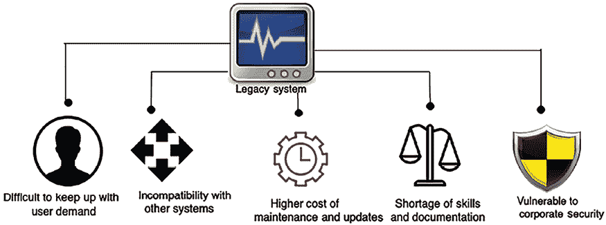
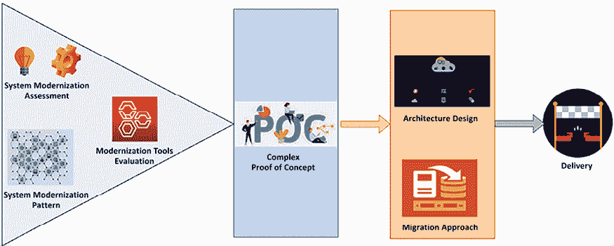
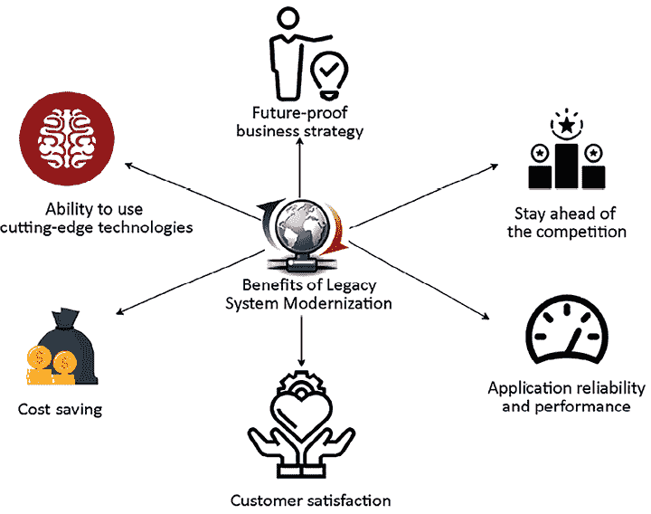
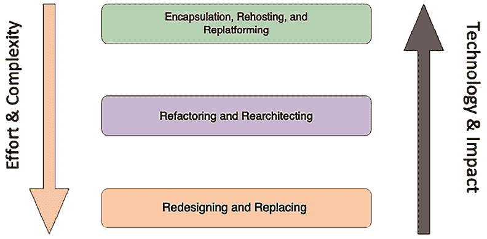
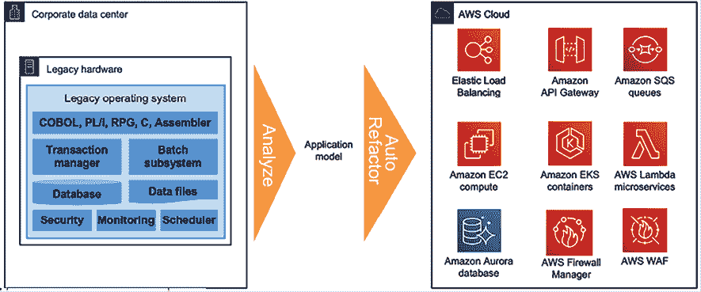
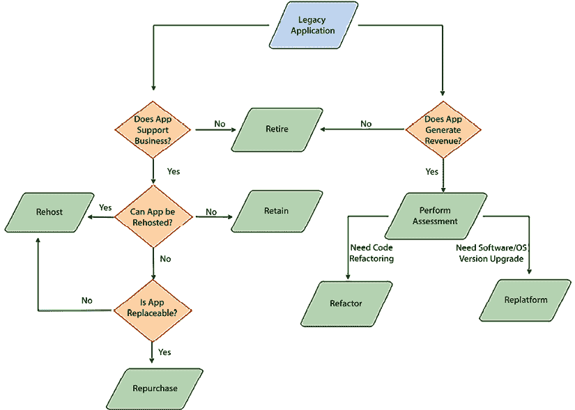
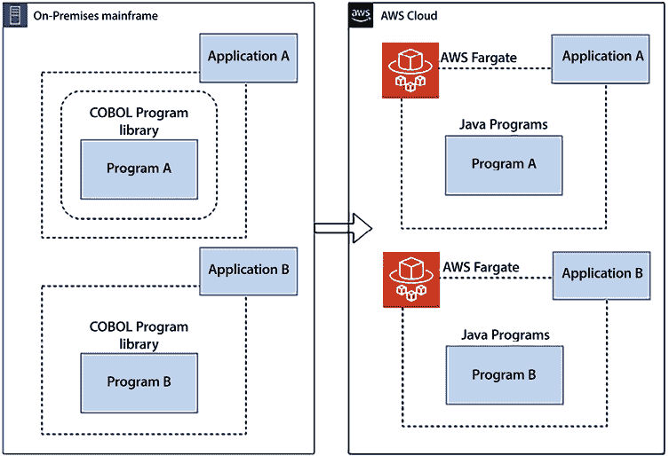
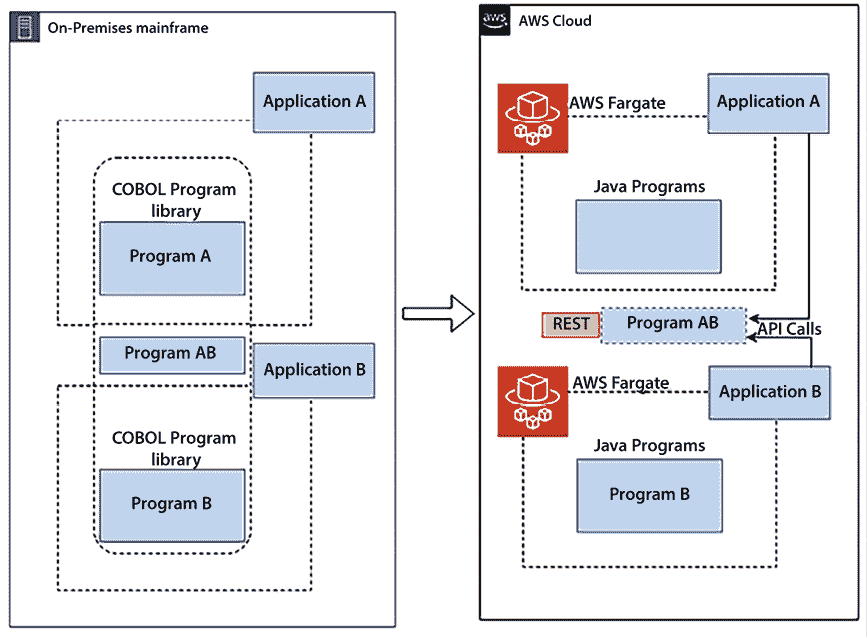
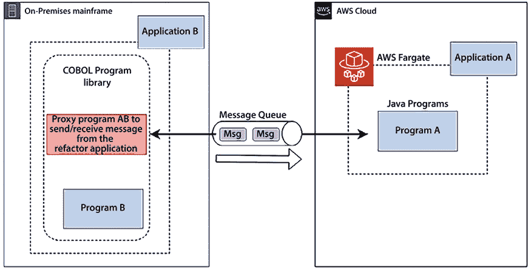

# 15

# 重构遗留系统

当今的组织在一个充满挑战的环境中运营。变革的速度前所未有。监管机构和机构正在施加新的报告和安全要求，新技术正在颠覆消费者的期望和认知，生态系统也在不断变化，新玩家不断进入市场。因此，组织正在重新定义其商业模式，以提供客户需求、敏捷性和技术，吸引人才，保持竞争力并实现增长。

应用程序现代化已经成为这些新商业模式的关键组成部分，可以快速建立开发/测试环境，实验新想法，开发新产品和服务。除了消除对昂贵和繁琐基础设施的投资需求外，新系统还通过提供一套广泛的可用技术来促进创新。

遗留系统是那些已经在您的数据中心部署了几十年且未进行过多次更改的应用程序。这些系统过时且在快速变化的技术环境中难以维护。遗留系统的定义通常基于其年龄以及由于底层架构和技术的限制，无法满足日益增长的业务需求。

通常，大型企业使用遗留应用程序来处理日常关键业务任务。这些遗留系统广泛应用于多个行业，如医疗保健、金融、交通运输、制造业和供应链等。公司通常需要在这些系统的维护和支持上花费大量资金，这也促使了对遗留系统重构的需求。重构和现代化遗留应用程序帮助组织提高敏捷性和创新力，并优化成本和性能。

在本章中，您将了解与遗留应用程序相关的挑战和问题，以及重构它们的技术。重写复杂的遗留应用程序可能会带来额外的业务中断风险，因此您将了解重构应用程序或考虑迁移到更灵活的基础架构的选项。本章将涵盖以下主题：

+   了解遗留系统的挑战

+   定义系统现代化的策略

+   探讨遗留系统现代化技术

+   定义遗留系统的云迁移策略

+   大型主机迁移到公共云

+   使用生成性人工智能现代化遗留代码

到本章结束时，您将了解遗留系统的各种挑战和现代化驱动因素。您将学习遗留系统现代化的各种策略和技术。随着公共云成为许多组织的首选策略，您还将学习遗留系统的云迁移方法。

# 了解遗留系统的挑战

遗留应用程序给组织带来了重大挑战。一方面，组织有一些关键应用程序已经使用了数十年。另一方面，遗留应用程序限制了组织创新的步伐。

终端用户在竞争激烈的环境中寻求最现代、技术最先进的应用程序。所有新功能通常都伴随最新的软件，而遗留应用程序限制了你添加那些有益于终端用户的功能的能力。

下图展示了组织在使用遗留系统时面临的一些重大挑战：

图 15.1：遗留系统的挑战

在深入探讨解决方案之前，清晰地理解问题是至关重要的。让我们更深入地探讨遗留系统所面临的挑战，以便更好地理解它们。

## 难以跟上用户需求

客户至上是商业成功的关键，无法跟上最新的技术趋势会严重损害企业。你可以拿诺基亚作为例子，它曾经主导全球手机市场。随着智能手机的出现，诺基亚仍然坚持使用遗留系统，导致几乎破产。柯达也有类似的故事——它曾是全球相机行业的龙头企业。柯达未能跟上数字化创新，并未将其整合到自己的系统中，最终导致柯达在 2012 年破产。许多大型企业都因未能进行遗留系统现代化和创新而未能生存下来。

在当前快速变化的技术和激烈竞争的环境中，用户的需求非常苛刻。现在，组织必须按照用户的需求进行变革，因为用户有多个选择。随着技术的发展，用户也随之变化，开始使用最新和最流行的应用程序。如果你的竞争对手提供了用户所需的新功能，他们就能迅速超越你。最近的一个例子是 Google，作为 AI/ML 的先驱，可能更早就开发了**生成性 AI**（**GenAI**）技术。然而，OpenAI 迅速推出了 ChatGPT，迫使 Google 处于下风并进入了追赶的局面，最终在 GenAI 市场上失去了竞争优势。这些例子凸显了采用新兴技术以保持竞争优势的重要性。

遗留系统也对有内部用户基础的企业应用程序带来挑战。一个建立在主机上的旧系统主要使用命令行，这在数字时代可能不太适合用户友好性。相比之下，新一代员工要求更用户友好的方式来执行日常任务。然而，你可能得不到管理层的支持，因为他们可能已经使用遗留系统工作了数十年，并且习惯了这些系统。

大型企业核心技术需要更新，其中包含许多已有几十年历史的系统。运行核心系统的组织在启用现代客户体验时面临严峻挑战。许多系统是多个并购的产物，导致数据孤岛碎片化、基础设施成本过高以及开发周期缓慢。这造成了低效的处理和决策，缺乏业务敏捷性，客户响应不及时，维护成本高昂。在这种情况下，IT 很难满足内部利益相关者和客户的现代需求。

## 更高的维护和更新成本

由于遗留系统已运行多年，它们可能看起来成本较低。但随着时间的推移，整体拥有成本反而变得更高，因为旧系统的支持和更新通常更加昂贵。

这些更新通常无法开箱即用，需要大量手动解决方法来维护系统。大多数遗留系统不支持自动化，导致更多的人工工作。

遗留系统通常包含大量专有软件，这导致许可证费用显著增加。除此之外，旧软件不再得到供应商的支持，购买生命周期之外的额外支持可能非常昂贵。另一方面，现代系统主要采用开源技术，降低了成本。由于技术债务和难以调试的代码，遗留系统的操作停机时间可能更长，并且会增加运营费用。维护遗留系统的技能（如 DB2、COBOL、Fortran、Delphi 和 Perl）的人才非常稀缺，导致招聘成本和系统风险显著增加。

遗留应用程序已运行数十年，随着时间推移，许多更改已被接纳，但未移除未使用的代码，积累了大量技术债务。任何减少技术债务的措施都可能存在风险，因为其影响和依赖关系未知。因此，组织不得不为维护不必要的代码和系统投入资金，以避免因做出重大更改而破坏系统。

然而，由于未知的依赖关系和停机时间，现代化遗留系统可能会非常昂贵。在决定是否进行现代化时，需要仔细进行**成本效益分析**（**CBA**），并确定**投资回报率**（**ROI**）。由于利益相关者需要看到现代化的即时效益，获取遗留系统现代化的资金可能会具有挑战性。

## 技能和文档短缺

传统技术（如大型主机）具有多个相互依赖的复杂组件。它们是庞大的专有且昂贵的服务器，如果有人希望独立开发技能，这些服务器并不容易获得。保持应用程序开发资源是一项挑战，而招聘具有旧技术和操作系统实际操作经验的人则更具挑战性。

传统系统通常已有数十年历史，大多数具有相关技能的员工已经退休。此外，这些系统可能缺乏文档，未能记录投入的多年工作。随着老一代员工的更替，知识流失的风险很大。缺乏知识使得更换系统变得风险很大，因为依赖关系不明确。由于系统复杂性和技能短缺，任何小的功能需求都难以满足。

新的前沿技术，如高级分析、机器学习、生成型人工智能和**物联网**（**IoT**），是建立在新的技术平台上的。由于新技术与传统系统整合不良，组织可能会因为无法充分利用新兴技术的全部功能而输给竞争对手。现代化系统有助于塑造一个创新型企业的品牌，而大多数新一代的劳动力都希望在这样的公司工作。对于传统技术而言，开发和培训是一个更为重要的支出。

自动化通常有助于通过减少人工劳动来降低成本。现代系统中有许多工具可以用于构建自动化——如 DevOps 流水线、代码审查和自动化测试——而这些工具可能是传统系统无法利用的，从而导致额外的成本。

## 企业安全问题的漏洞

安全性是任何组织和系统的首要任务。运行在旧操作系统上的传统应用程序（如 Windows XP 或 Windows 2008）由于缺乏供应商支持，容易受到安全问题的影响。软件供应商会不断确定新的安全威胁，并发布补丁以应对最新版本的软件。任何被供应商宣布为**生命周期结束**（**EOL**）的传统软件将不再获得新的安全补丁，这会使你的应用程序在运行旧版本软件时暴露于多种安全威胁之中。

传统应用程序的系统健康检查常常被忽视，这使得它们更容易受到安全攻击。技能差距使得持续提供支持和帮助变得困难，因此系统需要更加安全。一旦出现漏洞，就有可能使你的应用程序、数据库和关键信息暴露给攻击者。

除了安全漏洞，传统应用程序在维护上也因合规性问题而变得复杂。随着监管要求的不断变化，强制执行严格的数据处理和使用安全，传统系统需要做出更改以遵守当地的治理和合规性要求。

例如，遵守欧盟的**通用数据保护条例**（**GDPR**）要求每个系统都必须使用户能够请求删除其数据。虽然现代系统可能会提供开箱即用的自动化和自助服务功能，但在遗留系统中，这一操作可能需要手动执行，并变得更加复杂。

遵守合规需求可能会导致更多的运营成本和耗时的维护工作。

## 与其他系统的不兼容

除了终端用户外，系统之间经常需要进行集成。这些系统可能涉及不同的部门、客户、合作伙伴或供应商。不同的系统需要以标准格式交换数据，而这些格式会不断演变。几乎每隔几年，文件和数据格式标准就会发生变化，以提高数据交换效率，而大多数系统需要进行调整以适应这些变化。那些坚持使用旧格式的难以变更的遗留系统可能会导致系统不兼容，成为供应商和合作伙伴不愿使用的系统。无法满足标准需求会增加显著的业务风险，因其需要复杂的解决方法并降低生产力。

为了满足简单的业务需求而添加解决方法可能会使系统更加复杂。现代系统采用面向服务的架构，通过独立添加新服务来更轻松地适应任何新需求。旧系统通常采用单体架构，添加任何新功能都意味着需要重建并测试整个系统。

现代架构是基于 API 的，可以轻松地与其他系统集成，以减轻繁重的工作负担。例如，一款出租车预订应用程序使用 Google 地图进行**全球定位系统**（**GPS**）导航，并使用 Facebook 或 X 进行用户身份验证。如果没有 API，遗留系统中的这些集成就会更加困难，导致复杂的定制代码。

遗留应用程序在随着来自上游依赖系统的负载增加时，可能会面临可扩展性问题。遗留应用程序通常采用单体架构，且依赖硬件。由于硬件依赖性，单体系统在可扩展性方面面临重大挑战，因为它不能水平扩展，垂直扩展的能力也受到最大系统容量的限制。此外，单体系统的某一部分需求增加时，整个系统都需要扩展。将单体应用程序拆分为微服务可以帮助解决扩展性挑战，并应对负载压力。

除了软件维护，遗留应用程序对硬件基础设施也有较高的成本，因为它们依赖于特定版本的运行。这些系统分布在多个数据库中，存在重复数据和相似的功能。由于它们的单体结构，难以整合并利用基于云的基础设施的灵活性来节省成本。此外，分散的系统允许软件团队根据微服务的需求选择软件技术栈，而无需为所有系统功能统一选择一个技术栈，从而使得每个微服务的技术选择和/或支持该微服务的团队的需求多样化。

让我们来看一下系统现代化的一些关键优势。

# 定义系统现代化的策略

通常，遗留系统会被排除在企业整体数字化战略之外，问题只在需要时才得到解决。被动的做法阻止了组织实施整体系统现代化和获得好处。

如果你的遗留系统面临严重的业务挑战，例如安全性和合规性问题，或者无法满足业务需求，你可以采取**大爆炸方法**。在大爆炸方法中，你从头开始构建一个新系统，并关闭旧系统。此方法风险较大，但可以解决现有遗留系统无法缓解的业务需求。

另一种方法是**分阶段方法**，即一次升级一个模块，同时保持旧系统和新系统的并行运行。分阶段方法风险较小，但需要较长时间，并且可能更昂贵，因为需要维护两个环境，并且增加网络和基础设施带宽。

处理应用程序组合、优先考虑特定应用程序并制定整体计划是第一步。当你使用云时，你设计了一个新的运营模式，并最终形成了一种工具组合。你可以使用第三方工具来框定需求和工具偏好。最后，你可以使用咨询合作伙伴来更成功、快速地完成迁移和现代化项目。

采取这些方法中的任何一种，在应用程序现代化完成后都能带来各种好处。

## 遗留应用程序的评估

一个组织可能有多个遗留系统，包含数万到数百万行代码。在现代化过程中，遗留系统必须与业务战略和投资成本相一致。此外，可以重新利用某些部分或完全从零开始编写，但第一步是进行评估，更好地理解整体系统。

在评估阶段，解决方案架构师需要使系统易于评估并做出明智决策。评估可以在几天或几周内完成，这取决于工作负载的大小和复杂性。以下是解决方案架构师在进行评估时需要关注的主要领域：

+   **技术评估**：你需要了解现有系统所使用的技术栈。如果当前的技术已经过时并且缺乏供应商支持，可能需要替换它。如果有更好的技术版本可用，可以考虑升级。通常，新版本与旧版本是向后兼容的，所需的更改很少。

+   **架构评估**：你需要了解整体架构，以确保其能够适应未来发展。可能存在需要对技术进行小规模升级的情况，但整体架构需要更单体化和可扩展。最好对架构进行审计，考虑成本、可扩展性、可用性、性能和安全性。可能需要进行重大架构更改，以使应用程序与业务需求对齐。

+   **代码和依赖性评估**：传统系统通常在单体环境中拥有数十万行代码。各个模块之间的紧密联系使得系统变得非常复杂。如果在不充分审查的情况下删除某个模块中看似未使用的代码，可能会影响到其他模块。这些代码行可能是几十年前编写的，并且需要定期重构和审查。即使技术和架构看起来没有问题，你仍然需要判断这些代码是否可以升级和维护。你还需要了解是否需要进行与 UI 相关的升级，以改善用户体验。

作为解决方案架构师，你需要确定各个模块和代码文件之间的依赖关系。模块可能紧密耦合，在现代化整体架构时，你必须定义一种方法，进行同步升级。在评估过程中，你可能会发现以下模式：

+   首先，许多客户意识到他们有很多老旧应用程序，这些应用程序与未来的商业模式不太匹配；它们可以被淘汰。例如，大约 10-20%的应用程序组合可以被淘汰。

+   其次，五到七年前不存在的成千上万的 SaaS 供应商，如今可以替代许多本地应用程序。例如，大多数客户已经选择 Salesforce 作为 CRM 平台。转向 SaaS 可以缩减 IT 运营管理的操作组合——它仍然涉及安全性和身份管理的工作，但操作成本较低。

然后，可以做出决定，选择提升并迁移，在迁移过程中重新平台操作系统、数据库或编程语言，以减少成本。例如，客户可能选择将平台从 Windows Server 迁移到 Linux，或将数据库从 Oracle 迁移到 Postgres，以减少数据库许可费用。你在*第三章*《云迁移与混合云架构设计》中学到了这些技术。

如果选择现代化，你应该专注于现代化那些能使你业务差异化的应用程序。我们来探讨一下现代化的方式。

## 定义现代化方法

对于利益相关者而言，应用程序现代化可能没有立即的激励。你需要选择最具成本效益的方法，并更快地交付结果。

下图展示了现代化方法：

图 15.2：遗留系统现代化方法

在进行系统评估后，您必须了解现有架构模式及其限制。根据您的技术栈，您需要评估迁移工具。例如，如果您将应用程序重新托管到 VMware 上，您可能会使用模拟器进行主机迁移，或使用 vCenter。选择各种现代化方法并创建**概念验证**（**POC**）以识别差距。以下是一些方法：

+   **架构驱动的现代化**：架构驱动的方法是实现最大灵活性的必要条件。通常，架构方法是语言无关且平台无关的，通过应用面向服务的模式，赋予开发团队更多的创新灵活性。如果您的评估显示您需要进行重大架构更改，可以选择这种方法。首先实现最关键的功能，然后构建一个突出差距和所需努力的 POC。根据您的遗留应用程序，采用微服务方法以实现可扩展性，并确保与其他系统的更好集成。

+   **系统再工程**：在再工程方法中，您必须深入了解遗留系统并进行逆向工程，以构建新的现代化应用程序。您需要确保做出有助于创建面向未来系统的技术选择。如果遗留系统过于复杂并且需要长期项目，则应采取这种方法。首先进行应用现代化，然后在分阶段的方式中将数据库作为最终切换的目标进行升级。您需要建立一个机制，使得遗留和升级模块能够共存，并具有以混合方式进行通信的能力。

+   **迁移和增强**：如果您现有的系统技术相对有效，但由于硬件限制和成本问题受到制约，您可以选择迁移和小幅增强的方法。例如，您可以将整个工作负载迁移到云端，以获得更好的基础设施可用性和成本优化。此外，云服务提供商提供了多个现成的工具，帮助您更频繁地进行更改并应用更好的自动化。迁移方法使您能够以较少的努力现代化应用程序，并确保它面向未来，使其长期保持相关性。然而，迁移方法有限，可能只适用于某些工作负载。

在你计划迁移和现代化时，要考虑那些需要大量重新设计和现代化的特定 IT 领域。这一现代化包括开发人员的操作系统环境，因为它们会影响补丁管理。接下来是安全性、网络和身份，它们为扩展性、弹性和成本降低提供了绝佳机会。然后是存储、备份和数据库工具，随着更多应用迁移到云端，它们也需要现代化。此外，你还需要现代化监控和管理工具，这需要培训和重新技能提升。让我们来看看各种现代化遗留系统的策略。

## 系统现代化的好处

通过解决遗留系统现代化日益增长的需求来制定未来的数字战略，可以带来许多优势，正如下图所示：

图 15.3：遗留系统现代化的好处

以下是应用现代化的显著好处：

+   **客户满意度**：使用最新的技术提供更好的**用户界面**（**UI**）、**用户体验**（**UX**）和全渠道体验。消费者已经习惯于通过个人体验从任何设备、位置或时间实时访问信息。你不需要为 UI 构建不同的变体；它可以一次构建并部署到笔记本、平板和智能手机等设备上。快速且流畅的 UI 带来更好的客户体验和商业增长。

+   **面向未来的商业战略**：现代化你的应用程序使你能够更加灵活和创新。团队可以轻松应对业务需求的变化，并与新技术一起发展。

+   **保持领先竞争**：用户总是寻找最新的东西，并转向那些提供更好体验的新应用。应用程序的现代化帮助你通过跟随最新趋势保持领先竞争。例如，语音集成在应用中被广泛提供，你可以通过人脸识别增强安全性。只有当你的应用采用最新技术时，这才是可能的。

+   **应用程序的可靠性和性能**：每个新的软件 API 和操作系统版本都尝试解决和改进性能问题。使用最新的软件和硬件有助于你实现更好的性能、可扩展性和高可用性。应用现代化帮助你减少运营中断并增强安全性。

+   **使用前沿技术的能力**：遗留系统阻止你从数据中获得可以帮助你发展业务的洞察。通过现代化你的数据库并创建数据湖，你可以使用大数据和机器学习获得各种洞察。这还帮助你留住员工，因为人们有机会使用新技术。

+   **成本节省**：总体而言，任何现代化都能通过减少运营维护成本和提供更自然的升级带来成本节省。利用开源软件可以降低许可成本，硬件灵活性有助于采用云按需付费模式，自动化减少了日常工作所需的人力资源，并提高了整体效率。

通过迁移遗留核心系统，组织可以现代化其核心系统，从而降低拥有成本，自动化手工后勤流程，消除数据孤岛，改善客户体验，并更快地推出面向市场的新应用程序。

遗留系统现代化有许多好处，但可能非常复杂，需要大量努力。需要进行仔细评估，以采取正确的方法。让我们探讨一下遗留应用程序的评估技术。

# 查看遗留系统现代化技术

根据现有应用程序分析，您可以采取各种方法来升级您的遗留系统。最直接的方法是迁移和再托管，您无需更改现有系统。然而，简单的迁移可能无法解决长期问题或带来任何好处。

如果系统不再满足业务需求，您可以采取更复杂的方法，例如重新架构或重新设计整个应用程序。下图说明了各种方法的影响：

图 15.4：遗留系统现代化技术

让我们来看看前面图表中展示的各种现代化技术。

## 封装、再托管和再平台化

**封装** 是最直接的方法。如果系统对业务至关重要且需要与运行在最新技术上的其他应用程序通信，则应使用此方法。通过封装，您需要在遗留系统周围构建 API 包装器，允许其他业务应用程序与遗留应用程序通信。API 包装器是一种常见的方法，您可以开始将应用程序迁移到云端，但保留遗留应用程序在本地数据中心进行后续现代化。如果您的遗留代码编写良好且得到维护，您可以选择封装选项，但同样，您无法从技术进步和硬件灵活性中获益。

**再托管** 方法是其中最直接的策略之一，您可以将应用程序迁移到另一个硬件提供商（如 AWS 云），而无需进行任何代码更改。与封装一样，再托管选项可以通过供应商合同减少成本，但您可能无法从技术进步和硬件灵活性中获益。

组织通常在需要快速摆脱现有合同时采用这种方法。例如，你可以在第一阶段开始迁移到云端，并在第二阶段应用现代化。

**重新平台化**方法可能比重新托管方法更为复杂，但能够提供即时的收益。如果服务器已经达到 EOL（生命周期结束），无法获得支持，需要进行升级以处理安全问题，组织通常会选择这种方法。例如，如果 Windows Server 2012 即将达到 EOL，可以考虑将操作系统升级到 Windows Server 2022 版本。你需要使用新的操作系统重新构建二进制文件，并进行测试确保一切正常运行，但不会有重大的代码更改。同样，与重新托管类似，重新平台化可能无法享受技术进步带来的好处，但它将使你继续获得供应商的支持。

虽然前面提到的三种方法是最简单的，但它们无法提供应用程序升级的全部优势。让我们来看看一些能够帮助你充分利用应用程序现代化的方式。

## 重构与重新架构

你可以在**重构**方法中调整代码以适应新系统。重构后的整体架构保持不变，但你会升级代码以适应最新的编程语言和操作系统版本。你可以重构部分代码以实现自动化并增强功能。如果你的技术仍然相关，并且通过代码更改可以满足业务需求，那么你应该选择这种方法。

在**重新架构**方法中，你通过尽可能重新利用现有代码来改变系统架构。例如，你可以从单体架构创建微服务架构。你可以一次性迁移一个模块，将其转化为面向服务的架构，并为每个模块提供一个 RESTful 接口。重新架构有助于你实现所需的可扩展性和可靠性；然而，由于仍然使用现有代码，整体性能可能会较为一般。

## 重设计与替换

**重设计**方法是最复杂的，但能够提供最大的收益。如果遗留系统需要更新且无法满足业务需求，可以选择这种方法。通过重设计，你必须从头开始构建整个系统，同时保持整体范围不变。

以下图示展示了遗留大型主机系统迁移到 AWS 云端的过程：

图 15.5：遗留大型主机系统现代化到云端

传统主机系统经过重新架构和重构，转变为类似的云服务，作为*现代化方法*。构建云原生应用程序有助于你在可扩展性、性能、可靠性和成本等方面充分利用并从云服务中受益。它帮助你的团队更加灵活和创新，能够适应系统中迅速变化的技术。你在*第三章*，*云迁移与混合云架构设计*中学习了云迁移策略和其带来的好处。

重新设计一个传统系统需要长期的项目投入，伴随着大量的工作量和增加的成本。在启动现代化之前，作为解决方案架构师，你应当仔细分析是否有任何 SaaS 产品或**商业现成产品**（**COTS**）能够以较低的成本满足你的业务需求。在进行重新设计选项之前，进行*重新设计*与*购买*之间的**成本效益分析**（**CBA**）是至关重要的。

有时，替代传统系统以新的第三方软件更为有利。例如，你的组织可能拥有一个已有十年历史的**客户关系管理**（**CRM**）系统，它无法扩展并提供所需的功能。你可以订阅像 Salesforce CRM 这样的 SaaS 产品来替代传统系统。SaaS 产品是基于订阅的，并提供按用户计算的许可，因此如果你的用户较少，它们可能是合适的选择。对于一个拥有成千上万用户的大型企业，构建应用可能更具成本效益。你应该进行 CBA 以了解投资 SaaS 产品的投资回报率。我们来简要看一下云迁移策略。

# 为传统系统定义云迁移策略

随着云计算的日益普及，越来越多的组织希望将其传统应用迁移到云端以满足现代化需求。你在*第三章*，*云迁移与混合云架构设计*中学习了各种云迁移技术。云计算让你在保持低成本的同时扩展应用，并帮助你实现理想的性能、高可用性和可靠性，同时保障应用的安全性。

云服务提供商，如 AWS、微软 Azure 和 GCP，提供了许多帮助你现代化系统的选项。例如，你可以采用无服务器方法，利用 AWS Lambda 和 Amazon API Gateway 构建微服务，并以 Amazon DynamoDB 作为后端。

在上一节中，我们讨论了各种传统系统现代化技术及其在迁移到云端过程中的应用。下面的图表所示的流程将帮助你决定是否采用云迁移来现代化你的传统应用：

图 15.6：传统系统现代化的云迁移路径

如前图所示，如果你的应用程序仍然被业务大量使用并创造收入，你应继续保持最小的变更。在这种情况下，如果服务器即将结束生命周期，你可以将应用程序重构到云端，或者将其重新平台化。

如果你希望保持现有应用程序不变以支持业务，并且仍然希望完全迁移到云端以节省和优化成本，那么可以采用 *提升与转移策略* 将传统应用程序重新托管到云端。如果你的传统应用程序可以替代，你可以购买云原生的 SaaS 版本并淘汰旧的应用程序。如果传统系统存在过多的业务依赖，并且由于不兼容无法迁移到云端，你可能会选择将其保留在本地数据中心。

你应该进行 **总体拥有成本**（**TCO**）分析，以了解迁移到云端的优势。分析内容包括：

+   **基础设施费用**：比较本地基础设施的费用，包括服务器、存储、网络和数据中心设施费用，和云服务的费用。

+   **维护和管理成本**：考虑与维护和管理本地基础设施相关的费用，例如 IT 员工薪资，与云端托管服务相比，后者减少了对内部管理的需求。

+   **可扩展性和灵活性**：评估云端根据需求调整资源的能力所带来的成本影响，相比于固定成本的本地基础设施，这可能会带来成本节省。

+   **许可和订阅费用**：包括软件许可费用和云服务订阅费用。

+   **迁移费用**：考虑迁移工作负载到云端的单次费用，包括数据传输费用、工具费用以及可能的停机时间。

+   **安全性和合规性**：评估在本地环境和云端实现和维护安全性与合规性标准的费用。

建议选择传统应用程序中最复杂的模块，构建一个 POC，以确保在启动整个项目之前，您的系统能够与云端兼容。涵盖关键业务案例的详细 POC 将帮助你识别差距并显著降低迁移风险。

在评估云兼容性时，应该考虑几个关键因素。首先，评估架构的适配性，确保应用程序的设计符合云计算原则，如可扩展性、弹性和解耦性。接下来，识别是否存在对特定硬件或本地资源的依赖，而这些资源在云环境中可能无法得到最佳支持。还需要确认云环境是否能够满足应用程序的性能要求，考虑到诸如网络延迟和资源可用性等因素。此外，确保应用程序的安全性和合规性要求能够在云中得到充分满足。最后，评估迁移到云端的成本效益，确保其与组织的财务目标一致。这种全面的方法有助于确定应用程序是否适合云环境，从而为迁移决策提供依据。

文档和支持是任何应用程序维护的重要组成部分。让我们深入了解它们。

## 文档和支持

为新系统的长期可持续性和顺利迁移准备适当的文档和支持。提供符合大家可以遵循的编码标准文档，帮助保持新系统的最新状态。将架构文档作为工作文档，随着技术趋势的变化，保持它们的更新。保持系统更新将确保你避免再次面临遗留系统现代化的问题。

准备一个全面的运行手册，以支持新旧系统。你可以保留旧系统一段时间，直到新系统能够满足所有业务需求并正常运行。更新支持运行手册，确保你不会因员工流失而失去知识，且整体知识库不以依赖人员的方式运作。

跟踪系统依赖关系有助于你确定未来任何更改的影响。你将会在*第十六章*，*解决方案架构文档*中学到更多关于文档的内容。准备培训内容，培训员工掌握新系统，并确保他们能够在发生操作故障时提供支持。

主机是许多组织仍在本地运行的遗留工作负载之一。让我们来了解一下如何将它们迁移到云端。

# 公有云下的主机迁移

许多企业正在将他们的大型主机工作负载迁移到云端，以利用成本降低、提高灵活性、减少技术债务、支持数字化战略、解决遗留的主机技能差距以及数据分析。与基于 x86 的工作负载相比，大型主机工作负载的迁移更具挑战性，因为遗留的主机应用程序通常是紧密耦合的方式开发和部署的。例如，一个大型主机应用程序可能包含多个子系统使用的程序，或者直接被其他应用程序调用。在这些情况下，对底层程序所做的更改也会影响相关的子系统和应用程序。

从大型主机系统迁移到云端提供了一个独特的机会，尽管云服务商可能不支持完全相同的主机硬件架构。对于组织来说，这一过渡涉及战略性选择：他们可以在 x86 平台上模拟主机环境，或者重新构建他们的应用程序以实现与 x86 的兼容性。虽然重新构建需要更多的前期投资，但它为云中的可扩展应用环境铺平了道路，最终与数字化转型目标对接，并推动创新。

对于遗留应用程序，必须采取增量方式进行迁移，这是最佳实践。这种方法有助于降低风险，因为您可以选择并优先考虑紧密相关的应用程序一起迁移。然而，对于主机迁移，这种方法有时可能更复杂，因为主机应用程序代码可能使用时间耦合（同步调用）或部署耦合（链接模块）。

让我们来看看在主机迁移过程中可能面临的一些独特挑战。

## 大型主机现代化的挑战

现代化大型主机面临着独特的挑战，原因在于它们的规模、复杂性以及它们常常运行的关键应用程序。这些系统通常使用过时的编程语言，具有复杂且未记录的依赖关系，并且需要越来越稀缺的专业知识。以下是一些主要挑战：

+   **过时的编程语言**：大型主机通常运行在使用较老编程语言的遗留代码库上，而现代 IT 专业人员可能对这些语言不太熟悉。

+   **复杂的系统依赖关系**：许多大型主机应用程序经历了数十年的发展，具有复杂且未记录的依赖关系，这使得在不破坏功能的情况下解开并现代化它们变得困难。

+   **专业知识要求**：操作和维护大型主机系统所需的专业知识正变得稀缺，因为熟悉这些旧技术的员工正逐步退休。

+   **数据完整性和安全性**：在现代化过程中，维护数据的完整性和安全性至关重要，而在从封闭的安全大型主机环境迁移到更加开放的系统时，这一任务可能变得更加具有挑战性。

+   **业务连续性风险**：主机通常管理着关键的业务操作。现代化工作必须小心规划，以避免中断这些对业务至关重要的过程。

+   **与现代技术的集成**：将主机应用程序与更新的基于云的服务和技术集成可能会变得复杂，因为它们具有不同的架构和通信协议。

+   **扩展性挑战**：将主机应用程序适应现代云环境，特别是这些应用程序通常未设计为支持水平扩展，而云环境中的弹性扩展已成为常态。

+   **成本影响**：评估并证明现代化所需的财务投资是合理的，特别是在短期内，这笔投资可能非常庞大。

+   **性能考虑**：确保现代化系统在性能上与高度优化的主机系统相当或有所提升。

+   **文化与组织的抵触**：您可能需要克服组织内部的抗拒，因为主机系统深深嵌入了公司的运营结构中，变革可能会引发习惯于现有系统的利益相关者的忧虑。

在过渡过程中确保数据的完整性和安全性也是一个重大问题，尤其是在主机通常处理核心业务流程的情况下，存在中断业务运营的风险。

迁移耦合的应用程序代码会影响到依赖的应用程序，并且会带来一定的风险。为减少这些风险，您可以在不影响依赖应用程序的情况下，解耦主机应用程序代码。从代码迁移的角度来看，主要有两种类型的遗留主机应用程序：独立应用程序和共享代码的应用程序。让我们详细了解每种迁移模式。

## 迁移独立应用程序

假设有两个独立的应用程序 A 和 B，它们是独立的主机应用程序。每个应用程序由它独有的程序和子程序组成。

由于应用程序是自包含的，您可以按照应用程序将**COBOL**程序和子程序分组进行代码重构，如下图所示。

****

图 15.7：独立应用程序的主机现代化

在前面的图示中，主机程序和子程序是用 COBOL 编写的，代码迁移到了 AWS 上的 Java。然而，您可以使用这些解耦模式，选择您偏好的编程语言进行迁移。迁移模式是遗留的自动重构，其中代码、数据和依赖关系会自动转换为现代编程语言、数据存储和框架，同时保证与相同业务功能的功能等效性。重构涉及使用自动化工具将主机编程语言（如 COBOL）转换为现代编程语言（如 Java 或.NET）。

重构后的应用程序部署在由 **AWS Fargate** 提供和管理的容器中。Fargate 是一个无服务器容器计算引擎，可与 Amazon **Elastic Container Service** (**ECS**) 和 Amazon **Elastic Kubernetes Service** (**EKS**) 配合使用。在此，主机数据库表和主机文件与应用程序一起迁移。

分组后，你可以在同一波次或不同波次中迁移应用程序 A 和 B。无论哪种情况，都将每个应用程序的重构现代组件打包，并一起部署到运行时环境中。迁移后，退役本地主机应用程序及其组件。接下来，让我们看一下多个应用程序共享代码的更复杂场景。

## 迁移具有共享代码的应用程序

假设主机应用程序 A 和 B 运行共享代码程序 AB。你需要对共享程序 AB 进行影响分析，以便一起迁移应用程序 A 和 B 以及程序 AB。根据影响分析，确定使用共享程序（如程序 AB）的依赖应用程序数量。你需要完成业务领域分析，判断是否可以将共享程序聚合到包含应用程序的领域中，并作为领域服务之一暴露为 API。接下来，让我们看一下你可以采取的一些方法来解耦应用程序，为迁移做好准备。

### 使用独立 API 解耦应用程序

使用这种方法，你通过将共享的 COBOL 程序 AB 转换为 Java 程序来实例化独立的 API。你可以使用提供的自动化重构工具生成该程序的网络 API，以尽量减少重构工作量。当共享程序可以作为独立服务实例化时，你可以采用这种方法。应用程序 A 和 B 的其他组件将被重构为 Java 并迁移到云端。你可以在同一波次中迁移应用程序，具体如以下图所示：

图 15.8：使用独立 API 迁移共享程序应用程序

在这种方法中，你必须重构两个应用程序及其各自的程序，并将它们迁移到云端。你需要使用分析阶段的影响分析报告，帮助开发人员和团队识别调用共享程序 AB 的重构应用程序。用网络 API 调用替换内部程序调用。迁移后，退役本地主机应用程序及其组件。

### 使用共享库解耦应用程序

共享程序 AB 被转换为 Java 标准库，并与迁移应用程序一起打包。在这种方法中，当共享程序是支持库而不是独立服务时，应该采用此方法。应用程序 A 和 B 的其余组件被重构为 Java 程序并迁移到云端。

这种方法将应用程序 A 和 B 及其相关程序重构为 Java，并迁移到云端。您应该将应用程序的源代码保存在完全托管的源代码控制服务中，例如 AWS CodeCommit。使用共享程序的团队可以通过拉取请求、分支和合并来协作进行代码更改，并控制对共享程序代码所做的更改。迁移完成后，停用本地主机应用程序及其组件。

当应用程序过大，无法归入同一迁移波次时，您可以将其分成多个波次迁移，并在迁移过程中保持服务连续性。采用这种方法，您可以分阶段地现代化应用程序，而无需将它们捆绑在一起。将应用程序分波次迁移，能够解耦它们，而不需要对主机上的代码做出重大修改。

### 使用消息队列进行应用程序解耦

在这种方法中，共享程序 AB 被转换为 Java 程序，并作为应用程序 A 的一部分迁移到云端。使用消息队列作为云端重构应用程序和本地遗留应用程序之间的接口。采用这种方法，您可以将紧密耦合的大型主机应用程序拆分为生产者和消费者，并使其更加模块化，从而独立运行。额外的优势是，您可以分波次迁移这些应用程序。

当主机上的应用程序能够通过消息队列与迁移到云端的应用程序通信时，您可以采用这种方法。最佳做法是确保排队架构模式满足主机应用程序的业务需求，因为这涉及到重新架构现有的应用程序。

如果不属于第一波迁移的应用程序需要更长时间（六个月或更长时间）才能迁移到云端，则应该采用消息队列方法。当应用程序过大，无法归入同一迁移波次时，您可以将其分成多个波次迁移，如下图所示，并在迁移过程中保持服务连续性。

图 15.9：使用消息队列迁移共享程序应用程序

如前图所示，您需要遵循以下步骤进行迁移：

1.  将应用程序 A 及其相关程序迁移（重构）到云端，同时应用程序 B 继续保留在本地。

1.  重构应用程序 A（在云端），通过消息队列与应用程序 B（本地）进行通信。

1.  在本地重构应用程序 B，用代理程序替换共享程序，通过消息队列发送和接收来自应用程序 A 的消息。

1.  在成功迁移应用程序 A 之后，退役本地应用程序 A 及其组件（包括共享程序）。应用程序 B 及其组件将继续保留在本地。

1.  在下一波迁移过程中，迁移应用程序 B 及其组件。松耦合的队列架构继续在云中作为应用程序 A 和 B 之间的接口。这减少了对应用程序 B 的重构工作，而不影响应用程序 A。

作为最佳实践，您应该执行代码分析，以生成主机应用程序的依赖关系图，并识别由应用程序共享的程序列表。之后，将共享相同程序的应用程序分组在同一迁移波次中，以减少本地环境与云之间的程序调用。在规划阶段，进行影响分析，识别与您计划迁移的应用程序共享程序的应用程序，并选择适合的解耦模式进行应用程序迁移。在本节中，您会注意到我们使用了 AWS 的示例来进行主机现代化。让我们详细了解公共云对主机现代化的好处。

## 使用公共云进行主机现代化的好处

利用公共云进行主机现代化带来了众多好处，例如增强的可扩展性、灵活性和成本节省。云的按需付费模式降低了资本支出，而其先进的服务促进了创新，尤其是在人工智能（AI）、机器学习（ML）和分析等领域。云环境还提供了更强的灾难恢复能力，并有机会重新设计应用程序，使其更具弹性，能够适应不断变化的业务需求。让我们看看公共云迁移主机工作负载的一些关键好处：

+   **增强的可扩展性**：云平台能够自动调整资源以应对工作负载峰值，这与需要手动扩展的主机不同。例如，电商网站能够在假日购物高峰期间应对流量峰值，而不会出现停机。

+   **成本效益**：借助云的按需付费模式，公司可以节省高昂的前期硬件和维护成本。例如，初创公司可以在无需投资昂贵的主机基础设施的情况下启动新的应用程序。

+   **灵活性和敏捷性**：云服务使企业能够快速实验和部署新应用程序。例如，一家公司可以迅速在不同市场测试一个新的客户服务应用，而无需经过长时间的设置过程。

+   **创新加速**：云服务提供商提供尖端的人工智能（AI）、机器学习（ML）和分析工具。零售企业可以利用这些工具分析消费者数据并个性化营销策略，这些都可以在传统主机上得到提升。

+   **改进的灾难恢复**：云平台具有内置的冗余和备份解决方案。例如，金融机构即使在本地发生灾难时，也能确保持续运行和数据完整性。

+   **资源优化**：云使计算资源的使用更加高效。一家公司可能只在需要时使用云服务来运行应用程序，从而减少了主机环境中常见的空闲计算资源。

+   **更快的市场响应时间**：云的灵活性缩短了开发周期。移动应用开发者可以迅速部署和更新应用，保持在竞争激烈的市场中的领先地位。

+   **全球覆盖**：凭借全球范围的数据中心，云服务使企业能够将应用程序部署在离用户更近的地方。例如，在线流媒体服务可以向全球用户提供低延迟的内容。

+   **更好的安全特性**：主要云服务提供商在网络安全上投入大量资金。这意味着小型企业可以享受到与大型企业相当的安全措施，而这些在本地主机环境中是难以实现的。

+   **更容易与现代技术集成**：云简化了与现代应用程序和服务的集成。例如，医疗保健提供商可以将基于云的 AI 诊断工具与其患者管理系统集成，而在主机环境中，这一任务将复杂且资源密集。

AWS 提供了**主机现代化**（**M2**）平台，旨在将本地主机应用程序迁移并现代化为 AWS 上的云原生、完全托管的运行时环境。以下是 AWS M2 平台的关键特性：

+   **自动化重构**：使用 AWS Blu Age 将遗留语言应用程序转变为灵活的基于 Java 的服务，遵循现代 Web 框架和云 DevOps 最佳实践。

+   **重新平台化**：使用集成的 Micro Focus 工具链迁移 COBOL 应用程序，现代化基础设施，同时保持编程语言以实现 DevOps 云原生操作的灵活性。

+   **数据复制与文件传输**：通过精准的数据实时复制和 BMC 软件的文件传输能力，增强主机功能。

+   **应用程序测试**：通过自动化现代化主机应用程序的验证，降低成本，并利用可扩展的云原生服务加速测试进程。

本服务与日益增长的遗留系统现代化需求相契合，为企业从传统主机基础设施过渡到更加灵活、具有成本效益的云环境提供了全面的解决方案。你可以通过参考此 AWS 页面了解更多：[`aws.amazon.com/mainframe-modernization/`](https://aws.amazon.com/mainframe-modernization/)。

如果可能，逐步进行大型机迁移，以减少复杂性和风险。通过增量迁移，迁移团队能够更快地提供有关迁移进度的反馈，企业可以利用这些反馈来优化内部流程，从而加快迁移的步伐。随着 GenAI 变得越来越流行，并提供许多现成的解决方案，它可以帮助加速你的现代化进程。让我们深入了解一下。

# 使用生成式人工智能现代化遗留代码

使用生成式人工智能（GenAI）现代化遗留代码代表了一种前沿的软件开发方法。GenAI 工具可以分析并理解遗留代码，通常是用过时的编程语言编写的，并协助将其重写或转换为现代、更高效的编程语言或框架。这一过程加速了代码现代化，同时有助于在利用当前技术优势的同时保持遗留系统的功能。

通过自动化部分代码转换过程，GenAI 减少了所需的人工工作量和专业知识，使得现代化过程更加容易接近且不易出错。这一方法主要有利于那些希望在不打乱运营效率的情况下更新遗留系统的企业。使用 GenAI 现代化遗留代码涉及到如 Codex 这样的工具，Codex 是 OpenAI 提供的工具之一（它为 GitHub Copilot 提供支持），以及可能的基础模型。这些工具利用 AI 来理解和重构遗留代码，转换为更现代、高效的编程语言或框架。例如，Codex 可以解析较旧的、较少使用的编程语言，并提供建议或直接将其转换为更新的语言，如 Python 或 JavaScript。这有助于更新遗留系统，使其更加易于维护，并与当前的开发实践兼容。

类似地，Amazon CodeWhisperer 是 AWS 的 AI 驱动编码助手。像 GitHub Copilot 一样，它通过提供代码建议和自动化某些编码任务来帮助开发人员。CodeWhisperer 利用机器学习模型理解代码的上下文，并提供相关的推荐。这款工具可以提高开发人员的生产力，帮助编写最佳实践的代码，并通过建议现代的编码技术和解决方案来帮助现代化遗留代码。CodeWhisperer 集成到开发人员的工作流程中，能够显著简化维护、更新和优化代码库的过程，包括遗留系统的翻译或重构。CodeWhisperer 还提供上下文推荐，确保代码库重用和编码模式的一致性。

此外，基础模型通过在多个领域的多样化数据上进行训练，可以帮助理解复杂的遗留代码库，识别冗余或低效的代码段，并建议优化或现代的编码模式。

将这些工具整合到现代化过程中能够加速遗留代码的转化。这有助于构建更易维护、可扩展和安全的软件系统，对于那些希望在快速发展的数字化环境中保持竞争力的企业来说至关重要。

# 摘要

在这一章中，你了解了遗留应用程序面临的各种挑战，以及为什么它们需要进行现代化。你了解了通过将应用程序升级到最新技术，组织可以获得的好处。应用程序现代化可能复杂且充满风险，但它通常是值得的。

从升级中获得的结果是你所投入的投资和精力的权衡。在定义现代化方法之前，彻底了解你的遗留系统至关重要，你学习了应用程序在技术、架构和代码方面的各种评估属性。

在评估之后，下一步是定义现代化方法，你了解了多种现代化方法，包括以架构为驱动的、系统重构和迁移方法。你还了解了系统现代化的多种技术，包括直接方法（封装和重托管）和复杂方法（重新架构和重新设计）。云计算可以提供显著的价值主张，你还学习了在云端进行现代化时需要采用的决策方法。你了解了大型机现代化的挑战，以及云计算如何帮助简化大型机现代化的过程。最后，你学习了 GenAI 如何通过作为编码助手更新遗留代码来提高开发者效率。

你专注于解决方案架构的各个技术方面；然而，文档是架构设计中至关重要的元素之一，它能使你的系统在长期内保持可维护性。下一章将讨论解决方案架构师需要准备、参与和维护的文档，以实现最大的业务价值。

# 加入我们书籍的 Discord 空间

加入本书的 Discord 工作区，向作者和其他解决方案架构专家提问并互动：`packt.link/SAHandbook`

