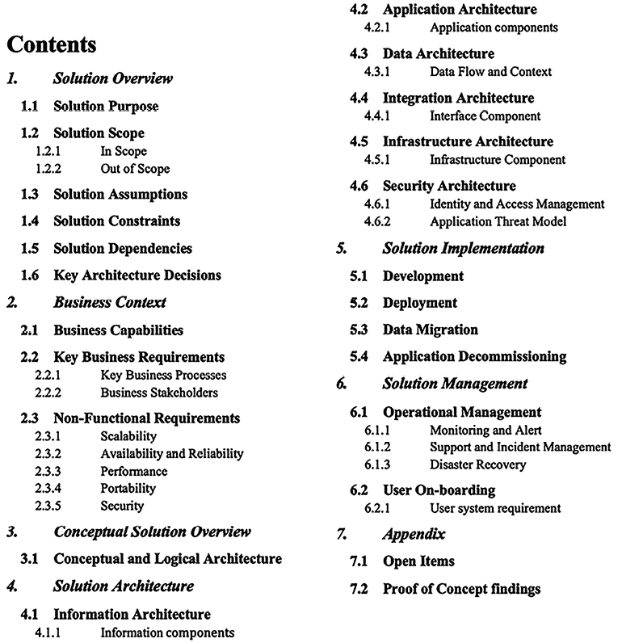

# 第十六章：解决方案架构文档

在前几章中，你学习了解决方案架构设计和优化的各个方面。当解决方案架构师进行设计时，与其他利益相关者保持一致的沟通至关重要，以确保应用程序的成功交付。解决方案架构师必须将设计传达给所有技术和非技术利益相关者。

**解决方案架构文档**（**SAD**）提供了应用程序的端到端视图，帮助所有人保持一致。在本章中，你将了解 SAD 的各个方面，SAD 解决了与应用程序开发相关的所有利益相关者的需求。

你将学习 SAD 的结构以及解决方案架构师需要了解的其他类型文档，例如提案请求（RFP），在其中解决方案架构师需要提供输入以做出战略决策。我们将涵盖以下主题，以深入了解涉及解决方案架构的文档：

+   SAD 的目的

+   SAD 的视图

+   SAD 的结构

+   SAD 的生命周期

+   SAD 最佳实践和常见的陷阱

+   解决方案架构的 IT 采购文档

在本章结束时，你将了解 SAD、其结构以及文档中需要包含的各种细节。你将学习各种 IT 采购文档，如提案请求（RFP）、信息请求（RFI）和报价请求（RFQ），在这些文档中，解决方案架构师参与并提供反馈。让我们从 SAD 的目的开始，了解其基本内容。

# SAD 的目的

通常情况下，架构文档需求没有得到解决，团队在没有理解整体架构的情况下就开始实施。SAD 提供了整个解决方案设计的广泛视图，以便让所有利益相关者保持知情。

SAD 对各方利益相关者至关重要，包括项目经理，他们依赖 SAD 来监督项目协调和进度。业务分析师用它来将项目与业务需求对齐。技术团队，包括开发人员和 IT 专业人士，参考它来实施和维护提议的解决方案。高级管理层利用该文档做出明智的战略决策。最后，客户或最终用户作为最终受益人，依赖该文档来确保项目结果符合他们的需求和期望。

SAD 有助于实现以下目标：

+   向所有利益相关者传达端到端的应用程序解决方案。

+   提供架构的高层次概述和应用程序设计的不同视图，以满足应用程序的服务质量要求，如可靠性、安全性、性能和可扩展性。

+   提供解决方案与业务需求之间的可追溯性，并审视应用程序如何满足所有功能性和**非功能性需求**（**NFRs**）。

+   提供设计、构建、测试和实施所需的所有解决方案视图。

+   定义解决方案对估算、规划和交付的影响。

+   定义解决方案在生产发布后能够持续运作所需的业务流程、延续性和操作。

SAD 定义了解决方案的目的和目标，并涉及关键组件，如解决方案的约束、假设以及常常被实施团队忽视的风险。解决方案架构师必须确保文档使用简明的语言，便于业务用户理解，并将业务背景与技术设计关联起来。文档有助于保留知识，以防资源流失，使整个设计过程不依赖于特定人员。

对于需要现代化的现有应用程序，SAD 展示了当前和未来架构的抽象视图以及过渡计划。解决方案架构师需要了解现有系统的依赖关系，并记录下来，以便提前发现潜在的风险。迁移计划帮助企业了解处理新系统所需的工具和技术，并据此规划资源。

解决方案架构师在解决方案设计过程中，通过构建**概念验证**（**POC**）或进行市场调研，开展各种评估。SAD 应列出所有架构评估及其影响，并包括技术选择。SAD 展示了解决方案设计当前状态和目标状态的概念性视图，并保持变更记录。接下来，我们将了解 SAD 的各个视图。

# SAD 的视图

解决方案架构师需要创建一个既能让业务用户也能让技术用户理解的 SAD。SAD 弥合了业务用户与开发团队之间的沟通鸿沟，使他们理解整体应用程序的功能。捕获所有利益相关者意见的最佳方式是将自己置于他们的位置，从利益相关者的角度看待问题。解决方案架构师评估架构设计的业务和技术方面，以充分考虑所有技术和非技术用户需求。

如下图所示，SAD 的全面概述包括多个视图，涵盖从业务需求中衍生出的不同方面：

图 16.1：SAD 视图

解决方案架构师可以选择标准图表，如**统一建模语言**（**UML**）图表或**Microsoft Visio**中的框图来表示各种视图。这些工具被广泛认可，帮助将复杂的架构概念以易于理解的格式传达。总体来说，图表应易于阅读，且对所有业务和技术利益相关者可理解。SAD 应该包括以下视图，以尽可能满足每个人的需求：

+   **业务视图**：架构设计关注商业问题并解决商业目标。业务视图展示了整体解决方案和产品的价值主张。为了简化，解决方案架构师可能会选择识别与业务相关的高级场景，并将其呈现为用例图。业务视图还描述了项目执行所需的利益相关者和资源。你也可以将业务视图定义为用例视图。

+   **逻辑视图**：此视图展示系统中的各种包，以便业务用户和设计师理解系统中的各个逻辑组件。逻辑视图提供了系统构建的时间顺序。它展示了系统中多个包是如何连接的，以及用户如何与它们交互。例如，在银行应用程序中，用户首先需要使用安全包进行身份验证和授权，使用账户包登录账户，使用贷款包申请贷款，等等。每个包代表不同的模块，可以作为微服务构建。

+   **过程视图**：此视图展示了更多细节，展示系统的关键过程如何协同工作。可以使用状态图来反映这一点。解决方案架构师可以创建一个序列图，展示更多细节。在银行应用程序中，过程视图可以展示贷款或账户的审批过程。

+   **部署视图**：此视图展示了应用程序在生产环境中的工作方式。它显示了系统组件（如网络防火墙、负载均衡器、应用服务器和数据库）之间的连接方式。解决方案架构师应创建一个简洁的框图，便于业务用户理解。你可以向 UML 部署图中添加更多细节，向技术用户（如开发和 DevOps 团队）展示各种节点组件及其依赖关系。部署视图表示系统的物理布局。

+   **实现视图**：这是 SAD 的核心，表示架构和技术选择。解决方案架构师需要在此处放置架构图——例如，如果是 3 层、*N*层或事件驱动架构，并附上其理由。

+   您还应该详细说明技术选择——例如，使用 Java 与 Node.js 的优缺点。在实现视图中，您需要证明执行项目所需的资源和技能。开发团队利用实现视图创建详细设计，例如类图，但这不需要包含在 SAD 中。

+   **数据视图**：大多数应用程序是数据驱动的，因此数据视图至关重要。数据视图展示了数据如何在不同组件之间流动，以及如何存储。它还可以用于解释数据安全性和数据完整性。解决方案架构师可以使用实体关系图来展示数据库中不同表和模式之间的关系。您将在*数据架构*部分进一步了解实体关系图。数据视图还解释了所需的报告和分析。

+   **操作视图**：这部分解释了系统在上线后的维护方式。通常，您会定义**服务级别协议**（**SLA**）、警报和监控功能、灾难恢复计划以及系统支持计划。操作视图还详细说明了系统维护的执行方式，例如通过部署错误修复、打补丁、备份与恢复、以及处理安全事件等。

所有列出的视图确保 SAD 覆盖了系统和利益相关者的各个方面。您还可以根据利益相关者的需求，添加其他视图——例如，物理架构视图、网络架构视图或安全（控制）架构视图。作为解决方案架构师，您必须以全面的方式来看待并理解系统的功能。接下来我们将在下一部分深入探讨 SAD 的结构。

# SAD 的结构

SAD 的结构可以根据项目的利益相关者需求和项目的性质有所不同。您的项目可能是从头开始创建新产品，现代化一个遗留应用，或者将整个系统迁移到云端。

每个项目的 SAD 文档可能有所不同，但总体上，它应考虑各种利益相关者的观点，并包括如下截图所示的多个部分：

图 16.2：SAD 的结构

在前面的 SAD 结构中，您可以看到涵盖多个解决方案架构和设计方面的不同部分。解决方案架构师可以根据项目需求选择添加额外的小节或删除某些部分。例如，您可以添加另一个介绍部分，讨论文档的目的和总结。对于过渡项目，您可能会添加一个小节，展示现有架构，并与目标架构进行对比，等等。接下来我们来详细了解每个部分的内容。

## 解决方案概述

在解决方案概述部分，我们简要介绍了解决方案，并在几个段落中描述了其功能以及不同组件的高级概况。添加一个显示各种组件的高级框图会很好。下图展示了一个电子商务平台的解决方案概述：

图 16.3：电子商务平台解决方案概述

你需要用简化的语言提供每个组件的简介，以便业务用户能够理解解决方案的整体运作。例如，上面的图示简单地概述了一个典型的电子商务订单和供应链管理流程：

+   **客户订单**：

    +   该流程始于客户通过网站或在线市场下单。

    +   客户服务在协助客户下单、处理咨询以及解决订单过程中可能出现的问题方面发挥着重要作用。

+   **供应链与订单管理**：

    +   **销售订单**：一旦下单，订单将被记录为销售订单，并触发订单履行过程。

    +   **库存数据**：系统检查库存数据，以确保所订商品有货。

    +   **发货通知**：订单处理完毕并准备好发货后，系统会发送通知，可能包括客户的跟踪信息。

+   **订单处理**：

    +   **付款**：处理客户的付款，包括税费的计算和促销代码的处理。

    +   **税费**：根据客户所在位置和购买商品计算并应用正确的销售税。

    +   **运输**：安排物流将订单送达客户指定位置。

    +   **订单履行**：实际的拣货、包装及准备发货的过程。

    +   **发货**：将订单送出并准备交付的过程。

    +   **促销**：应用可能包含在销售订单中的折扣或特别优惠。

    +   **通知**：向客户提供订单状态更新，确保其知晓订单进展。

    +   **退货**：处理客户不满意购买或订单有问题时的退货事宜。

    +   **取消**：处理客户决定在发货前取消订单的情况。

这些元素使客户订单能够从下单到交付的整个过程得到高效处理。

接下来，我们通过以下子章节概述解决方案概况：

+   **解决方案目的**：这一部分简要概述了该解决方案将解决的业务问题及构建此解决方案的理由。在我们之前提到的场景中，解决方案的目的是简化并自动化供应链内的订单管理流程。它旨在解决有关订单履行中的效率、准确性和客户满意度等业务关注点。

+   **解决方案范围**：在这里会明确列出所提议解决方案的业务范围，清楚地描述解决方案不会涵盖的内容。该范围包括从客户下单到发货通知的订单管理系统的端到端自动化。它不包括交付后客户互动，如反馈收集或退货处理。

+   **解决方案假设**：列出解决方案架构师在提出解决方案时所做的所有假设。例如，在我们的场景中，解决方案假设网络带宽至少满足实时数据处理的需求。它还假设能够与各种市场平台、运输承运商进行集成，且客户能使用数字支付方式。

+   **解决方案约束**：列出所有技术、业务和资源的约束条件。通常，约束来自行业和政府的合规要求，这些内容需要在此部分列出。你还可以强调风险和应对计划。该解决方案必须遵守数据保护法规，如欧盟的 GDPR（通用数据保护条例）以保障客户数据隐私，以及美国的 PCI-DSS（支付卡行业数据安全标准）以保护客户的支付信息。资源约束包括固定的预算和部署时间表。也可能存在与遗留系统集成相关的技术约束。

+   **解决方案依赖**：列出所有上游和下游的依赖关系。例如，一个电子商务网站必须与运输系统（如 UPS 或 FedEx）进行通信，以将包裹运送给客户。该解决方案依赖于来自库存管理系统的实时库存数据，以确保准确的订单处理。它还需要与支付网关进行集成，以处理金融交易。

+   **关键架构决策**：列出重要的议题和拟定的解决方案。描述每个选项的优缺点，为什么选择某个决策，以及背后的理由。

例如，假设我们决定使用基于云的平台来实现可扩展性。选择它是因为它能够处理不同的订单量，并且需要较少的前期资本投资。权衡的结果是持续的运营开销。

另一个决策可能是采用 API 优先的方法进行集成。之所以选择这种方法，是为了确保灵活性并简化与各种合作伙伴和服务的集成。然而，这也增加了 API 管理的复杂性。

在提供了解决方案概述后，你需要将其与业务背景联系起来。在接下来的部分中，我们将更详细地查看业务背景视图。

## 业务背景

在业务上下文部分，解决方案架构师必须提供一个高层次的概述，说明解决方案将要解决的业务能力和需求。此部分仅包含需求的抽象视图。详细需求需要在单独的文档中提及和记录。然而，可以在此提供指向需求文档的外部链接。你应包括以下主要子部分：

+   **业务能力**：简要描述为该解决方案设计的业务能力。确保包含能力的好处以及它们如何满足客户需求。

+   **关键业务需求**：列出解决方案将要解决的所有关键业务问题。提供关键需求的高层次概述，并添加指向详细需求文档的参考。

+   **关键业务流程**：解决方案架构师应通过业务流程文档展示关键流程。下图展示了一个简化版的电子商务应用业务流程模型：

图 16.4：电子商务平台的业务流程图

+   **业务利益相关者**：列出直接或间接受项目影响的利益相关者。这包括赞助人、开发人员、最终用户、供应商和合作伙伴。

+   **NFRs**：解决方案架构师必须更多关注 NFR（非功能性需求），因为这些需求通常会被业务用户和开发团队忽视。从高层次来看，NFR 应包括：

    +   **可扩展性**：随着工作负载波动，应用程序如何扩展？（例如，从每天或每月 1,000 笔交易扩展到 10,000 笔交易。）

    +   **可用性和可靠性**：系统可用性的可接受停机时间是多少？（例如，99.99%的可用性或每月 45 分钟的停机时间。）

    +   **性能**：性能要求是什么？系统在哪些地方可以处理负载增加而不影响最终用户体验？（例如，目录页面需要在 3 秒内加载。）

    +   **可移植性**：应用程序是否可以在多个平台上运行而无需额外工作？（例如，移动应用程序必须能够在 iOS 和 Android 操作系统上运行。）

    +   **容量**：应用程序可以处理的最大工作负载是多少？（例如，最大用户数、请求数、预期响应时间和预期应用负载。）

架构的概念视图是一个关键点，为业务和技术利益相关者提供了良好的系统概述。让我们更详细地了解概念视图。

## 概念解决方案概述

概念解决方案概述部分提供了一个抽象级别的图示，捕捉了整个解决方案的大局视图，包括其商业和技术方面。它为分析和权衡研究提供了基础，有助于在足够细节的层面上完善和优化解决方案架构，以支持解决方案设计和实施。以下图示展示了电子商务平台的概念架构图：

图 16.5：电子商务平台的概念架构图

上述图表展示了一个抽象视图，展示了重要模块及它们之间的信息流动。概念架构为商业用户和技术用户提供了对整体架构的良好理解。然而，技术用户需要更深入的架构细节。接下来我们将深入探讨解决方案架构。

## 解决方案架构

解决方案架构部分深入探讨了架构的各个部分。它提供了技术团队可以用来创建详细设计并进行实施的不同视图。这些视图可能面向其他用户群体，如开发人员、基础设施工程师、DevOps 工程师、安全工程师和**用户体验**（**UX**）设计师。

让我们进入以下主要子部分，了解更多细节。

### 信息架构

本节提供了应用程序的用户导航流。解决方案架构师需要在高层次上构建一个应用程序导航结构。如以下图示所示，对于一个电子商务网站，用户需要点击三次才能导航到目标页面：

图 16.6：电子商务平台的信息架构图

解决方案架构师可以添加更多细节，例如网站导航、分类法或 UX 设计师可以用来生成详细线框图的高层次线框图。

### 应用架构

本节面向开发团队。它为软件架构师或开发团队提供了更多的实施细节，以便构建详细设计。以下图示展示了一个电子商务网站的应用架构，包括缓存、网络、内容分发和数据存储等技术构建模块：

图 16.7：电子商务平台的应用架构图

如前所示，你需要列出云基础电子商务平台所需的应用架构组件，以提供理想的在线购物体验。这些组件包括：

+   **用户交互：** 客户通过 Web 界面与电子商务平台进行互动，首先通过**安全套接层**（**SSL**）进行加密通信的安全购买请求。

+   **内容交付：** 亚马逊 CloudFront，一个**内容分发网络**（**CDN**），高效地为用户提供静态内容，如图像、样式表和客户端脚本。通过将内容缓存到离用户位置更近的地方，减少了延迟。

+   **域名系统**（**DNS**）：亚马逊 Route 53 用于 DNS 管理，将用户请求导向最合适的终端，如 CloudFront 分发或应用负载均衡器。

+   **应用处理：** 在**虚拟私有云**（**VPC**）内部，电子商务应用服务处理动态请求，如基于用户个人资料和购物历史的页面渲染。VPC 内的产品推荐服务根据用户的行为和偏好，向用户提供个性化的产品建议。

+   **缓存机制：** 亚马逊 ElastiCache 被用于通过缓存频繁访问的数据，如会话状态和常看产品信息，加速数据检索。这减少了后端数据库的负担，并提高了应用程序的响应时间。

+   **数据存储与处理：** 购物车结算服务管理用户购物车交互和交易。目录和会话缓存数据存储以便快速访问。基于亚马逊 Elasticsearch 构建的搜索引擎提供强大的产品目录搜索功能。

+   **用户资料和交易数据：** 用户的资料信息以及交易数据存储在亚马逊 DynamoDB 中，提供快速和可扩展的 NoSQL 数据库功能。

+   **数据日志：** 亚马逊 S3 用于记录数据，如点击流数据、产品互动和系统日志，便于深入分析和洞察用户行为及系统性能。

本部分列出了所有需要退役、保留、重新平台化和转换的应用模块，以适应应用现代化架构。

### 数据架构

本部分主要由数据库管理员和开发团队使用，以了解数据库模式及表之间的关系。此部分通常包括一个**实体关系图**（**ERD**），展示数据库中存储的实体集之间的关系，如下所示：

图 16.8：电子商务平台的 ERD

实体关系图（ERD）是实体（通常对应数据库表）及其之间关系的可视化表示。它是数据库设计中用来说明数据库逻辑结构的图形工具。上面的图示是一个订单处理系统的 ERD 示例。该 ERD 展示了发生的事件与系统内处理的订单之间的关系。以下是组件及其关系：

+   **事件实体**：表示系统中的某个事件或操作，具有`Event_ID`（主键）、`Event_Type`、`Event_Name`和`Event_Loc`等属性。这些属性可能描述事件的类型、发生地点以及其他特征。

+   **订单实体**：表示客户订单，包含`Order_ID`（主键）、`Order_Number`、`Order_Type`、`Order_Quantity`、`Order_Date`和`Ship_Address`等属性。这些属性存储与每个订单相关的信息，如订购数量、运输详情和订单下单时间。

+   **订单处理实体**：这是一个关联实体（或连接表），用于将事件与订单连接，表示一个事件将导致订单处理。它有自己的主键（`Processing_EventID`），并包含外键`Event_ID`和`Order_ID`，分别与事件和订单实体相连接。`Order_Event_date`属性的存在表明，它还记录了事件导致订单处理的时间。

实体之间的连线表示关系。在此 ERD 中，关系线的“乌鸦脚”符号表示“多”，而单线表示“一个”，表示关系的基数。

数据架构部分列出了在应用开发过程中需要考虑的所有数据对象。

### 集成架构

集成架构是指扩展的框架，使得不同的软件应用、系统和服务能够有效地进行通信与协作。它涉及设计和实现促进数据和流程在组织内或组织与外部各方之间交换的方法和中间件。本节主要面向供应商、合作伙伴和其他团队。例如，以下图示展示了电子商务应用程序与其他系统的所有集成点：

图 16.9：电子商务平台的集成架构图

集成架构部分列出了所有向您的应用程序提供数据的上游系统。任何您的应用程序接收数据的平台、服务或数据库都在此列出，并附上数据流的性质以及您的应用程序向下游系统发送数据的详细信息。这些下游系统可能包括其他应用程序、数据库或服务，这些系统依赖于您的应用程序生成或处理的数据。您需要列出所有关于应用程序的系统依赖关系。

### 基础设施架构

本节主要面向基础设施团队和系统工程师。解决方案架构师必须包括一份部署图，概述逻辑服务器位置及其依赖关系。

例如，以下图示展示了一个电子商务应用程序的生产部署图。你可以为其他环境（例如开发环境、**质量保证**（**QA**）和**用户验收测试**（**UAT**）环境）制作单独的图示：

图 16.10：电子商务平台的部署图

本节列出了部署应用程序所需的所有服务器配置、数据库、网络和交换机。

### 安全架构

本节包括应用程序的所有安全性和合规性方面，包括：

+   **身份和访问管理**（**IAM**），例如**Active Directory**（**AD**）、用户认证和授权管理

+   基础设施安全性，如防火墙配置、**入侵防御系统**（**IPS**）/**入侵检测系统**（**IDS**）和防病毒软件

+   应用程序安全性，如**Web 应用防火墙**（**WAFs**）和**分布式拒绝服务**（**DDoS**）防护

+   使用 SSL、加密算法、密钥管理等对**数据安全**进行保护，无论是在静态状态还是传输过程中

总体而言，解决方案架构师可以包括应用程序安全威胁模型，以识别潜在的漏洞，例如**跨站脚本**（**XSS**）和**SQL 注入**（**SQLi**），并规划保护应用程序免受任何安全威胁。

## 解决方案实施

解决方案交付部分包括开发和部署解决方案时需要考虑的关键事项。它可以包含以下主要子部分：

+   **开发**：本节对开发团队至关重要。它讨论了开发工具、编程语言、代码库、代码版本管理和分支策略，以及背后的选择依据。

+   **部署**：本节主要关注 DevOps 工程师，讨论部署方法、部署工具、各种部署组件和部署清单，以及背后的选择依据。

+   **数据迁移**：本节帮助团队理解数据迁移和摄取的方法、数据迁移的范围、各种数据对象、使用的数据摄取工具、数据来源和数据格式等。

+   **应用退役**：本节列出了需要退役的现有系统，并为当前系统提供了退出策略，如果**投资回报**（**ROI**）未实现。解决方案架构师必须提供退役旧系统的方法和时间表，并评估整体影响。

SAD 包括了开发方法和工具。然而，它没有详细的应用级设计，例如类图或伪代码。这些细节需要由软件架构师或高级开发人员在相应的软件应用详细设计文档中处理。随着解决方案的部署，它需要在生产环境中进行管理。让我们了解一下解决方案管理部分的详细内容。

## 解决方案管理

解决方案管理部分专注于生产支持和其他非产品环境中的系统维护。此部分涵盖了解决方案的运营方面，包括监控、事件管理、用户入职以及支持和恢复流程。解决方案管理部分主要面向运营管理团队。此部分涉及以下内容：

+   操作管理，如开发、测试、暂存和生产环境的系统修补和升级

+   管理应用程序升级和新版本的工具

+   管理系统基础设施的工具

+   系统监控和警报；操作仪表板

+   生产支持、SLA 和事件管理

+   灾难恢复和**业务流程持续性**（**BPC**）

解决方案架构师必须在设计过程中研究并收集数据，以验证正确的解决方案。这些额外的细节可以放在附录部分。让我们进一步了解 SAD 的附录部分。

## 附录

像所有商业提案文档一样，SAD（解决方案架构文档）也有一个开放的附录部分，其中包含支持整体架构和解决方案选择的任何数据。在此部分中，解决方案架构师可以包括未解决的问题以及任何研究数据，例如 POC 的结果、工具对比数据以及供应商和合作伙伴的数据。

关于 SAD 结构的这一部分为您提供了关于 SAD 结构及不同部分的良好概述。一个 SAD 应包括前面提到的主要部分；然而，解决方案架构师可以根据组织或项目的具体需求排除某些部分或加入其他部分。像其他文档一样，持续迭代 SAD 并寻找改进机会至关重要。更强大的 SAD 有助于制定明确的实施指南，减少任何失败的风险。

SAD 是一个在初始阶段创建并在应用程序生命周期中的各种变化基础上不断更新的文档。现在，让我们深入了解 SAD 的生命周期。

# SAD 的生命周期

SAD 的生命周期与项目生命周期的不同阶段相一致。在本章之前，我们探讨了 SAD 的各个部分，这些部分在不同阶段创建。SAD 的生命周期通常包括以下几个阶段：

图 16.11：SAD 生命周期

让我们更详细地了解 SAD 生命周期中的各个阶段，如前面的图表所示：

1.  **启动**：启动阶段是在项目构思时，通常会意识到需要 SAD。此阶段定义了目标，例如为新企业应用程序概述软件架构。此步骤为文档设置了方向和范围，确保它与项目的目标和利益相关者的期望一致。

1.  **需求收集**：在这一关键阶段，从关键利益相关者处收集详细的需求。对于一个零售电商平台，这可能涉及收集关于用户体验、支付处理和库存管理的见解。此阶段确保 SAD 涵盖项目的所有关键方面。

1.  **起草**：起草阶段涉及创建 SAD 的初始版本。该文档可能会详细描述基于云的系统架构，指定某些 AWS 服务的使用、数据库模式以及安全协议。该草稿作为项目技术实施的蓝图。

1.  **审查与反馈**：草稿准备好后，会与利益相关者共享进行审查。例如，在医疗管理系统的情况下，临床医生、IT 人员和行政人员可能会就患者数据流和健康法规合规性等方面提供反馈。

1.  **最终确定**：在吸收反馈后，SAD 进入最终确定阶段。这可能涉及根据利益相关者的反馈调整网络架构，以提高数据流动效率。

1.  **实施**：最终确定的文档指导项目的实施。例如，开发人员和项目经理使用 SAD 来确保与软件开发项目中计划的架构和技术栈保持一致。

1.  **维护**：随着时间的推移，SAD 会被重新审视并更新，以反映技术变化、业务目标或外部因素。例如，推出新的数据隐私法律可能需要对 SAD 进行更新，以确保持续合规。

现在让我们来看看制定 SAD 时的一些最佳实践和需要避免的陷阱。

# SAD 最佳实践与常见陷阱

有效管理 SAD 需要遵循某些最佳实践。保持文档简洁明了至关重要，使其易于理解，同时避免使用技术术语。定期让利益相关者参与过程，确保文档符合业务和技术需求。保持 SAD 与最新的项目变更和发展同步更新，对于其相关性和实用性非常重要。此外，将 SAD 中概述的架构与组织的更广泛业务目标对齐至关重要，确保提出的技术解决方案能够支持并增强业务目标。

在使用 SAD 时也有一些常见的陷阱需要避免。过度复杂化架构可能会导致实施和维护上的挑战。文档缺乏灵活性可能会妨碍其适应项目范围或目标变化的能力。利益相关者参与不足可能会导致与实际业务需求和要求的不匹配。

此外，不良的文档实践可能导致误解、实施错误以及项目执行中的挑战。积极解决这些问题对于确保解决方案架构的成功至关重要。

除了 SAD 之外，解决方案架构通常还涉及一个具有特定要求的重大采购提案，该要求被称为**请求 x**（**RFx**）文件。让我们来了解一下 RFx 文件。

# 解决方案架构的 IT 采购文档

IT 采购文件通常被称为**RFx 文件**。这是一个包含采购过程不同阶段的术语。RFx 指的是正式的请求过程。RFx 文件可以分为**请求提案**（**RFP**）、**请求信息**（**RFI**）和**请求报价**（**RFQ**）文件。

解决方案架构师通常参与采购过程，可能是领导这一过程，也可能是提供自己的建议。这些采购可能涉及外包、合同、采购数据库或开发工具等软件，或购买 SaaS 解决方案。

由于这些文件可能涉及高度技术性内容，并且可能会产生广泛且长期的影响，解决方案架构师需要通过回应任何采购要求来提供输入。

让我们了解不同 RFx 文件之间的区别：

+   **RFI**：RFI 出现在采购过程的早期阶段，买方邀请不同的供应商提供信息，以便在后续采购阶段做出明智的决策。RFI 文件收集有关各供应商能力的信息，买方可以根据相似的参数对所有供应商进行比较，并从中筛选出供应商，进入下一步的提案环节。例如，假设一家公司正在探索市场，寻找符合其培训需求的**学习管理系统**（**LMS**）。该公司发布 RFI，收集关于 LMS 平台的功能、集成能力和用户体验的详细信息。

+   **RFP**：在这个过程中，从 RFI 流程中筛选出的供应商将获得关于项目结果的更多信息。与 RFI 文件相比，RFP 文件更加开放，供应商可以提供最佳的方式来为买方获取解决方案。供应商可以包括多种选择，并列出每种方法的优缺点。例如，假设一个政府机构希望升级其 IT 基础设施。它发布了一份 RFP，概述了当前系统、所需改进和性能标准。供应商则响应并提交包括技术解决方案、项目时间表和成本估算的提案。

+   **RFQ**：在这个过程中，买方将与 RFP 相比缩小要求范围，列出工作的具体需求、设备和供应品。供应商必须为列出的需求提供报价，买方可以选择最佳报价来授予合同。例如，假设一家技术初创公司正在准备扩展其 IT 基础设施，以适应日益增长的用户群。

启动公司需要采购额外的云计算资源以应对增加的负载。公司已经确定了在计算实例、内存、存储和带宽方面的需求。RFQ 要求 IT 基础设施提供商提交月度和年度定价选项的最佳报价，以及长期承诺的折扣。启动公司还要求提供额外服务的信息，如支持、监控和安全功能，这些可以包括在报价中。

RFP 是最常见的选择，因为为了加速过程，买方组织通常只要求潜在供应商提交 RFP 文件。在这种情况下，RFP 文档需要使用清晰的结构，以便买方可以根据能力、解决方案方法和成本等方面，快速比较首选供应商并做出决策。

由于 IT 组织采购的技术性，解决方案架构师在评估供应商能力和方法时起着至关重要的作用，并且在供应商方响应 RFP 文档时也扮演着重要角色。在 IT 工作负载的 RFP 过程中，解决方案架构师的专业知识至关重要。以下是他们可能的贡献方式：

1.  **需求理解**：解决方案架构师首先彻底理解项目的技术和业务需求，这些需求可能包括增强现有系统、迁移到云端或集成新技术。

1.  **设计解决方案**：他们起草一个初步的 IT 架构设计，解决已识别的需求。这包括选择适当的技术、设计基础设施布局，并考虑与现有系统的集成。

1.  **协作贡献**：架构师通常与跨职能团队合作，包括业务分析师、项目经理和技术负责人，以确保提案在业务目标和技术可行性方面的一致性。

1.  **资源估算**：他们估算项目所需的资源，这些资源可能包括硬件、软件、云服务和人力工时，确保提案具有竞争力且现实可行。

1.  **风险评估**：解决方案架构师识别项目中的潜在风险，并提出减轻风险的策略，以便在 RFP 响应中包含这些策略。

1.  **文档编制**：他们帮助创建详细的技术文档，解释提议的解决方案如何满足 RFP 要求。这些文档通常包括系统图、数据流图以及对提议环境的详细描述。

1.  **定价策略**：解决方案架构师可能与财务团队合作，为提案制定定价策略，确保成本与所提供的价值相符。

1.  **演示**：解决方案架构师可能是团队的一部分，负责向潜在客户展示提案，解释技术方面，并回答他们可能有的任何技术问题。

解决方案架构师的角色对定制一个不仅满足客户需求而且确保技术可行性和成本效益的解决方案至关重要。例如，如果一家公司正在寻求关于新云端 CRM 系统的提案，解决方案架构师会首先分析现有的 IT 基础设施，并评估诸如可扩展性和数据安全等必要功能。

他们会设计一个与现有系统（如 ERP）无缝集成的云解决方案，并与营销策略保持一致。通过与潜在供应商的合作，架构师确保所选的 CRM 平台符合公司的特定需求，并评估其兼容性。此外，他们还将与法律团队密切合作，确保解决方案符合严格的合规性和数据管理要求。

关键任务之一是创建迁移策略，将数据从旧系统迁移到新的 CRM 系统，目标是尽量减少对业务的干扰。这还涉及估算总拥有成本，并考虑订阅费用、定制需求、数据迁移和培训需求等因素。解决方案架构师还参与起草 RFP 回应中的技术部分，详细说明所提议的架构、数据策略和安全措施。他们会制定实施路线图，解决系统如何随时间扩展以及部署后将如何提供支持结构的问题。

此外，解决方案架构师向客户的决策者展示并辩护技术战略，阐明所提议解决方案的优势和实用性。这确保客户投资于一个可靠、安全、可扩展的系统，以支持业务增长并适应不断变化的市场需求。

# 总结

SAD 旨在使所有利益相关者达成一致，并对解决方案设计和需求达成正式协议。由于利益相关者包括业务和技术用户，你了解了解决方案架构师需要考虑的各种 SAD 视图。你必须为非技术用户包含业务、流程和逻辑视图；对于技术用户，需包括应用程序、开发、部署和运营视图。

本章内容中，你了解了 SAD 的详细结构，主要部分和子部分。

SAD 的各个部分包括解决方案、业务和概念架构的概述等详细信息。你还了解了架构图中的各种架构视图，如应用程序视图、数据视图、基础设施视图、集成视图和安全视图。你还学习了 SAD 的其他部分，涵盖了解决方案交付考虑因素和运营管理。

这是一次漫长的学习旅程，你已经接近书的结尾，但在结束之前，我们将提供一些成为解决方案架构师并提升知识的建议。

在接下来的最后一章，你将学习各种软技能，如沟通风格、责任感、批判性思维和持续学习技巧，以帮助你成为一名更优秀的解决方案架构师。

# 加入我们书籍的 Discord 频道

加入书籍的 Discord 工作区，与作者和其他解决方案架构专业人士交流提问：`packt.link/SAHandbook`

