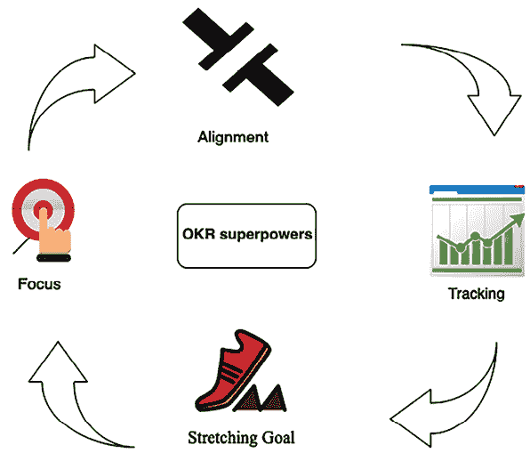
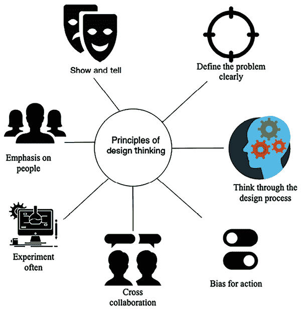
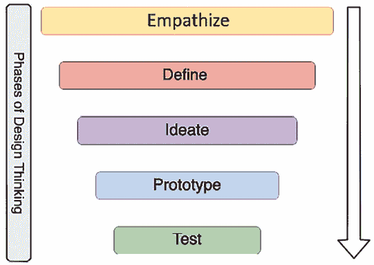

# 第十七章：学习软技能以成为更好的解决方案架构师

在前面的章节中，你学习了解决方案架构师如何满足所有利益相关者的需求。即使解决方案架构师的角色是技术性的，他们仍需要跨部门工作，从高层管理到开发团队。软技能是成为一名成功解决方案架构师的关键因素。

解决方案架构师应该随时跟进当前的技术趋势，持续提升自己的知识，并始终保持对新事物的好奇心。通过不断学习，你可以成为一名更优秀的解决方案架构师。在本章中，你将了解如何学习新技术，并且如何回馈和贡献给技术社区。

解决方案架构师需要定义并呈现一个整体的技术战略，以应对业务问题。他们需要跨业务和技术团队工作，协商出最佳解决方案，这需要优秀的沟通技巧。在本章中，你将学习解决方案架构师必须具备的软技能，包括沟通：

+   软技能在解决方案架构中的重要性

+   获得售前技能

+   承担责任和问责制

+   灵活性与适应性

+   设计思维

+   通过参与编程实践来成为一名建设者

+   通过持续学习来变得更好

+   成为他人的导师

+   成为技术传道者和思想领袖

本章结束时，你将了解解决方案架构师成功所需的软技能。你将学习获得战略技能（如售前和高层沟通）的方式，并培养设计思维和个人领导力技能（如宏观思维和责任心）。你还将学习如何建立自己的领导者身份并持续提升自己的技能。

# 软技能在解决方案架构中的重要性

软技能在解决方案架构中的重要性不容忽视，因为这些技能对于解决方案架构师的有效性和成功至关重要。

首先，有效的沟通至关重要。解决方案架构师必须将复杂的技术细节简化，以便非技术相关方理解，确保技术和业务目标之间的清晰度与对齐。这项技能在弥合技术团队与业务单位之间的沟通差距、促进相互理解和协作设定目标中至关重要。

合作与团队合作也扮演着关键角色。鉴于解决方案架构师经常在跨学科团队中工作，能够与来自不同背景和专业领域的个体和谐合作至关重要。这种合作还包括冲突解决、达成共识和营造共享责任与集体成功的环境。

此外，解决问题和批判性思维是解决方案架构师必备的软技能。他们的工作性质通常涉及应对复杂的技术挑战，并找到与业务战略相契合的创新解决方案。这需要技术理解力、创造力、分析思维以及面向解决方案的思维方式。

最后，领导力和适应力至关重要。解决方案架构师经常在项目团队中担任领导角色，指导技术方向并做出关键决策。这需要技术领导力以及激励、激发和引导团队朝着共同愿景迈进的能力。此外，技术领域不断发展变化，适应力和学习心态使解决方案架构师能够保持与时俱进，及时响应新趋势和技术变化。这些软技能和技术专长使解决方案架构师成为任何组织的宝贵资产。

在接下来的章节中，我们将探讨解决方案架构师应具备的一些关键软技能，这些技能与本文所提到的总体技能相关或包含其中。

# 获得售前技能

售前是复杂技术采购的关键阶段，客户在此阶段收集详细信息以作出购买决策。在客户组织中，解决方案架构师参与售前周期，验证来自不同供应商的技术和基础设施资源。在供应商组织中，解决方案架构师需要回应客户的**提案请求**（**RFPs**），并展示潜在解决方案，以帮助公司获取新业务。实现这一目标需要一套特定的技能组合。

## 关键技能

售前阶段要求具备独特的技能组合，将强大的技术知识与软技能结合起来，主要包括以下内容：

+   **沟通与谈判技巧**：解决方案架构师需要具备出色的沟通能力，以便向客户传递正确且最新的信息。提供精确的解决方案细节和行业相关性有助于客户理解您的解决方案如何解决他们的业务问题。解决方案架构师在销售团队和技术团队之间架起了沟通的桥梁，因此沟通与协调能力是至关重要的技能。解决方案架构师还需要通过与客户和内部团队的合作来制定协议，这要求具备出色的谈判技巧。特别是，战略层面的决策会对多个团队产生重大影响。解决方案架构师需要在团队之间进行谈判，处理权衡问题，并制定优化的解决方案。

+   **倾听与问题解决技能**：解决方案架构师需要强大的分析能力，以根据客户需求识别合适的解决方案。解决方案架构师倾听并理解客户的使用案例，通过提出正确的问题来创造出好的解决方案，这一点非常重要。解决方案架构师需要理解差距，并开发出对业务产生即时影响且具有长期**投资回报率**（**ROI**）的解决方案。对于一些客户，性能更为重要，而其他客户可能更关注根据其应用用户群体的成本。解决方案架构师必须根据客户的主要**关键绩效指标**（**KPI**）目标提供正确的解决方案。

+   **面向客户的技能**：解决方案架构师通常需要与内部和外部客户团队合作。他们在各个层级影响利益相关者，从 C 级高管到开发工程师。他们向高级管理层展示解决方案和演示，后者从商业角度审视你的提案。C 级高管的支持和承诺总是能促成所采用解决方案的成功，这使得面向客户的技能变得非常重要。C 级高管需要在确定的时间限制会议中了解解决方案的细节，而解决方案架构师需要充分利用分配的时间。你将在本章的下一节——*向 C 级高管汇报*中了解更多关于高层对话的内容。

+   **与团队合作**：解决方案架构师与业务团队和产品团队建立关系。为了准备一个最佳的应用程序，解决方案架构师必须与各级业务和技术团队合作。解决方案架构师需要成为一个优秀的团队成员，分享想法，并找到跨团队合作的方法。

上述技能是售前所需的，并适用于解决方案架构师的日常工作职能。解决方案架构师通常有技术背景，并且在这样的角色中，他们需要获得与高管层沟通的关键技能。让我们在接下来的章节中深入了解高层对话。

## 向 C 级高管汇报

解决方案架构师需要从技术和商业角度应对各种挑战。其中最具挑战性的任务之一可能是获得高管的支持。

高级管理人员如**首席执行官**（**CEO**）、**首席技术官**（**CTO**）、**首席财务官**（**CFO**）、**业务部门负责人**（**LoBs**）和**首席信息官**（**CIO**）被视为 C 级高管，因为他们的日程非常紧张，需要做出许多高影响力的决策。

作为一名解决方案架构师，你可能有很多细节需要展示，但高层管理会议的时间是有限的。解决方案架构师需要在规定的时间内最大化会议的价值。主要的问题是：*我们如何在有限的时间内获得高级管理人员的关注和支持？*

从解释议程和计划的会议结构开始。高层管理人员会提出很多问题，以便有效利用他们的时间，你的议程应表明他们将有机会提出澄清问题。随后，执行高层展示的关键是用前 5 分钟总结主要观点。你应该做好准备，以便如果原本的 30 分钟会议时间缩短到 5 分钟，你仍然能够传达你的要点并争取到下一步的支持。

用与他们所在行业和组织相符的事实和数据支持你的总结。保留细节，以便他们需要深入了解某个特定领域时，你可以随时调出并展示所有相关数据。

不要在细节上做过多展示，避免陈述那些从你角度看似相关但对高层管理人员并不重要的信息。例如，作为解决方案架构师，你可能会更多关注技术实施的好处。然而，高层管理人员更关注的是通过降低运营成本和提高生产力来获得的投资回报率（ROI）。

根据客户的行业和领域术语调整你的演示或展示。将他们熟悉的术语和概念融入其中，不仅能建立信任，还能表明你已经根据他们独特的行业挑战量身定制了技术解决方案。

你应该准备好回答以下与高层管理人员相关的问题：

+   **提议的解决方案如何使我们的客户受益？** 业务围绕客户展开。高层管理人员关注公司增长，而公司增长只有在客户满意的情况下才能实现。确保对他们的客户群和需求进行充分研究，并准备好以可靠的数据支持所提的利益。

+   **你在制定解决方案的基准时做了哪些假设？** 通常，这些会议处于初期阶段，你可能需要更多的细节。解决方案架构师总是需要做一些假设来为解决方案奠定基准。将你的假设列出，并为假设不成立的情况准备缓解计划。

+   **我的投资回报率（ROI）是多少？** 高层管理人员总是通过确定**总拥有成本**（**TCO**）来寻找 ROI。准备好提供数据，估算所有权成本、解决方案维护成本、培训成本、整体节省成本等。

+   **如果我们照目前的状态继续下去不做任何改变，会发生什么？** 高层管理人员可能会进入极为严格的审查模式，以识别投资回报率（ROI）。他们希望了解这项投资是否值得。你应该准备好你的市场研究资料，例如，技术趋势、客户趋势以及竞争形势。

+   **我们的竞争对手对你的解决方案会作出什么反应？** 竞争无处不在，且高层通常会对此感到担忧。他们希望了解你的解决方案是否具有创新性，能够击败竞争对手并为他们的组织带来优势。最好事先进行一些研究，并加入关于他们行业和客户群体的竞争数据。

+   **你的建议是什么，我能如何帮忙？** 在提供建议时，你应该始终列出清晰的行动项作为下一步。你需要获得高层的支持，并通过寻求帮助让他们感到参与其中。例如，你可以请求 CIO 将你与工程或产品团队联系，以便将整体解决方案推进到下一步。

接下来，我们来看看作为技术领导者，解决方案架构师应该具备哪些领导能力。

# 承担责任与担当

承担责任并将自己定位为领导者，帮助你通过责任感赢得信任。责任感并不意味着你需要单独执行任务；它更多的是指采取新举措并为组织坚持这些举措。你可以有一些能够提高组织生产力、灵活性、节省成本并增加客户群的想法。有时，你可能需要更多的时间或资源来执行你的想法，但你应该将其作为新举措提出来，并邀请他人共同执行。

责任感是指承担责任以推动结果的实现。拥有责任感和担当是密切相关的，你需要主动去采取行动并努力实现结果。人们可以信任你完成任何工作并推动结果。责任感帮助你与客户和团队建立信任，从而创造更好的工作环境并实现目标。

作为解决方案架构师，拥有责任感能帮助你从客户和赞助商的角度看待问题。你会感到有动力，并且成为一个有意义且你喜欢做的事情的一部分。确保定义并创建关键成功因素和目标关键结果。目标/指标应该可以通过特定的关键结果来衡量，并且必须是有时间限制的。让我们进一步了解**目标与关键结果**（**OKRs**）。

## 使用 OKRs 来定义战略执行

执行战略是复杂且具有挑战性的。卓越的战略执行对于实现组织的愿景、使命和目标至关重要。这个理念需要转化为可执行的元素，以确保团队一致并朝着相同的方向前进。目标设定和目标管理是一些最行之有效的完成任务的方式。

OKR（目标与关键结果）是目标设定的原则和实践（愿景和执行）。OKR 是一种专注于战略执行的战略管理系统，是一个简单的框架，让你能够定义组织的主要战略和优先事项。目标是原则，关键结果是实践——即组织愿景的*什么和如何*。OKR 基于四项超级能力，如下图所示：

图 17.1：OKR 的超级能力

OKR 的超级能力包括：

+   **聚焦**：从这个问题开始：*我们的主要优先事项是什么？人们应该把精力集中在哪里？* 致力于真正重要的事情，并明确什么是至关重要的。

+   **对齐**：使目标公开透明。与团队连接，并实现跨团队、底向上和横向对齐。

+   **跟踪**：直观地跟踪每个目标的关键结果，精确到百分比。

+   **挑战性目标**：设定雄心勃勃的目标，去实现一些卓越的成就。挑战性目标让人们重新构想和思考。

OKR 设置了清晰的、可衡量的目标，并将其与组织的战略使命对齐。在解决方案架构中，OKR 可以指导系统的设计和实施，确保它们有助于业务的整体目标。

对于解决方案架构师，OKR 可能涉及如下内容：

**目标**：提高系统的韧性和容错能力。

**关键结果**：

+   在下个季度内将系统停机时间减少 30%。

+   在下一个发布周期内，为关键服务实施多区域部署策略。

+   在六个月内实现面向用户的应用层 99.99% 的可用性。

在这里，架构师使用 OKR 来设定系统性能和可靠性的明确目标，这些是他们职责中的关键方面。OKR 还帮助优先排序任务，衡量进展，并将架构决策的影响传达给利益相关者。

OKR 为各级利益相关者提供了可见性和有意义的成果，从执行赞助人到团队。OKR 使得组织的愿景和使命变得清晰。日常工作的团队成员需要看到并理解使命。他们需要知道他们的日常工作如何影响组织的目标。OKR 框架允许你定义这种联系，并为团队中的每个人提供可见性和意义。

## 思考宏大

解决方案架构师应当具备宏观思维并能够预见未来。解决方案架构师为团队提供基础，团队在此基础上建立模块并启动产品。思考宏大是解决方案架构师应具备的关键技能之一，能够考虑应用程序的长期可持续性。

思考宏大并不意味着你需要设定一个非常不切实际的目标。你的目标应该足够大，能够挑战自己并把你推离舒适区。

思考大局意味着预测组织的需求，保持技术进步的领先地位，确保今天的设计能够适应并保持在未来的有效性。思考大局对个人和组织层面的成功至关重要。

在思考大局时，你应始终对自己的能力充满信心。虽然最初可能看起来很有挑战性，但你会发现，当你朝着目标努力时，你会找到前进的道路。相信自己，你会发现别人也开始支持并相信你。思考大局有助于激励你周围的人成为你成功的一部分。设定长期目标，例如*你希望在下一个十年看到自己和组织在哪里？* 一步步前进，将短期目标与长期目标对接。

一旦你通过思考大局设定了一个有挑战性的目标，它将帮助你主动探索新的挑战。然而，最好是你能获得同行和团队的支持，以实现结果，他们能为你提供正确的反馈并在需要时伸出援手。成为一个别人愿意帮助的人；这是一个双向的过程。要获得帮助，你需要愿意帮助别人。适应性是解决方案架构师与他人合作的另一个关键技能。让我们更深入了解它。

# 灵活且具有适应性

适应性和灵活性是密切相关的，作为解决方案架构师，你必须具备灵活性以适应新的环境、工作文化和技术。适应性意味着你始终对新思想保持开放，并愿意与合适的团队合作。

团队可以采纳最适合自己的过程和技术。作为解决方案架构师，你必须灵活地在解决方案设计过程中满足团队需求。例如，在微服务架构中，每个服务通过标准的 RESTful API 在 HTTP 协议上进行通信。团队可以使用不同的编程语言或工具编写代码，如 Python、Java、Node.js 或 C#。唯一的要求是，团队需要安全地暴露其 API，以便整个系统能够基于这些 API 构建。

你需要不同的思维方式和视角来看待问题，并获得更具创新性的解决方案。鼓励团队快速失败并进行创新，有助于组织保持竞争力。

灵活性的人格特质表现如下：

+   与团队一起思考各种解决方案来解决问题，并采取最佳方法

+   帮助团队成员分担工作

+   在团队成员因个人原因需要请假数周时，自愿填补空缺

+   能够与不同地点和时区的团队有效合作

你需要保持开放的心态，适应技术和流程的变化。当你为团队或组织带来变化时，可能会遇到抵抗。你需要鼓励他人保持灵活，并传达变化的重要性。例如，当一个组织希望将其工作负载从本地服务器迁移到云端时，通常需要更多的支持，因为人们必须学习一个新平台。你需要解释云计算的价值主张，以及它如何帮助他们变得更加敏捷并加快创新速度。

作为解决方案架构师，你必须适应多种任务，并设定正确的执行优先级。你应该能够根据情况调整工作方式，并在压力下工作。

解决方案架构师需要具备关键的设计思维能力，以创建创新的解决方案。让我们在下一节了解更多关于设计思维的内容。

# 设计思维

解决方案架构师的主要职责是系统设计，这使得设计思维成为一项至关重要的技能。设计思维是各行各业为解决具有挑战性和模糊问题而采用的最成功的方法之一。设计思维帮助你从不同的角度看待问题和解决方案，这些角度可能是你在第一次接触问题时没有考虑到的。设计思维更注重通过提供基于解决方案的方法来解决问题，从而实现结果。它有助于质疑问题、解决方案和相关的风险，以制定最优化的策略。

设计思维通过将自己置于最终用户和客户的位置，帮助你以更以人为本的方式重新定义问题。以下图表说明了设计思维的主要原则：

图 17.2：设计思维原则

以下是一些设计思维原则：

+   **经常进行实验**：创建原型以了解想法在现实情境中的实施。采用快速失败的策略并更多地进行实验。

+   **跨部门协作**：邀请不同背景的人加入，共同以多元化的方式寻找问题，确保解决方案能够满足每个人的需求。

+   **重视人群**：从不同用户那里收集反馈，并站在他们的立场上，从不同的角度理解问题。

+   **展示与讲解**：通过视觉化展示你的想法，以便在场的每个人都能更容易理解。

+   **明确定义问题**：为给定的挑战创建一个明确且清晰的愿景，这有助于他人清楚地理解并鼓励他们参与其中。

+   **深入思考设计过程**：理解整体设计过程，并设定明确的目标和方法。

+   **行动偏好**：最终的设计是为了交付解决方案，而不仅仅是思考。要主动推动进程，创造能够带来可行解决方案的活动。

设计思维为应用同理心并创建问题的整体视图提供了坚实的基础。为了采纳设计思维，**d.school**（[`dschool.stanford.edu/resources/getting-started-with-design-thinking`](https://dschool.stanford.edu/resources/getting-started-with-design-thinking)）提出了一个五阶段的模型。它们是设计思维教学和应用的先驱。下图展示了设计思维的五个阶段：

图 17.3：设计思维的五个阶段

设计思维是一种迭代的过程，需要不断演进。一个阶段的输出可以反过来作为其他阶段的输入，直到解决方案得以巩固。以下是各个阶段的简要概述：

+   **同理心**：同理心是设计中的基础和构建块，尤其是在人的背景下。为了培养同理心，你需要观察用户的行为并与他们互动，以了解实际问题。试着将自己置身于情境中，体验问题。

+   **定义**：同理心有助于定义问题，因为你通过体验用户的需求和他们面临的问题来帮助定义问题。在定义阶段，你运用洞察力清晰地定义问题，这为头脑风暴提供了动力，从而找到一种创新而简单的解决方案。

+   **创意**：创意阶段是从问题到解决方案的过渡阶段。你与团队一起通过挑战假设，寻找各种替代解决方案。你需要把显而易见的解决方案从脑海中去除，并通过协作找到所有可能的解决方案，从而激发创新。

+   **原型**：原型阶段有助于将想法转化为具体的解决方案。原型制作可以提供大量学习机会，并通过展示**概念验证**（**POC**）来帮助解决分歧。它帮助你发现差距和风险。你应该构建一个快速原型，投入不多，这样可以处理失败并增加学习机会。

+   **测试**：测试阶段是获取反馈并根据反馈对解决方案进行迭代。测试阶段帮助你重新定义解决方案，并更深入地了解用户。

设计思维涵盖了所有阶段，以便开发出一个逻辑且实用的解决方案。在设计应用架构时，你可以将设计思维的各个阶段和原则与现实生活联系起来。特别强调原型制作，因为这是唯一能通过数据和事实将你的提案和现有解决方案落实的方式。解决方案架构师的主要工作是理解业务需求，并创造一个技术解决方案设计，团队可以根据该设计进行实施。为了构建原型，解决方案架构师必须亲自参与实践编码。让我们深入了解一下。

# 通过亲自参与编码成为一名建设者

解决方案架构师是一个通过实践学习的建设者。构建一个原型胜过千言万语。它有助于减少误解并构思解决方案。展示一个概念验证（POC）并进行原型设计是解决方案架构师角色中不可或缺的部分。

原型设计是解决方案阶段的前期工作，它有助于加深你对应用设计和用户的理解。它帮助你思考并构建多个解决路径。通过测试一个原型，你可以改进你的解决方案，并通过演示你的愿景来激励其他人，如团队、客户和投资者。

解决方案架构师是一个技术领导者，与开发团队紧密合作。在一个有赋能的敏捷开发团队中，解决方案架构师除了展示 PowerPoint 演示文稿外，还需要展示一段代码作为 POC。解决方案架构师不需要成为开发团队的一部分，但需要与他们协作，用他们的语言将解决方案传达给开发团队。如果解决方案架构师能够理解解决方案的深层技术方面，并拥有持续编码和实践经验，成功交付才有可能。

解决方案架构师通常被视为导师和球员教练；具备一定的实际编码经验有助于他们建立可信度。解决方案架构师需要决定团队应该使用哪些编程语言和工具。亲自参与实际操作有助于识别可能不符合团队或解决方案需求的差距——不断学习新技术能让你代表组织做出更好的决策。让我们进一步了解持续学习的技巧。

# 通过持续学习变得更好

解决方案架构师需要不断吸收新知识，提升自己的技能，以帮助组织做出更好的决策。持续学习保持你的技能与时俱进，增强自信心。它开阔了你的思维，改变了前景。

结合全职工作和繁忙的家庭生活，学习可能会变得具有挑战性。持续学习是培养一种始终学习新知识的习惯，你需要保持动力和自律。你首先需要设定学习目标，并运用有效的时间管理来实现这些目标。当你忙于日常工作时，这通常会被忽略。

每个人都有自己的学习方式。有些人可能喜欢正式的教育；有些人喜欢读书；还有些人可能喜欢听或看教程。你需要找到最适合你且符合你生活方式的学习方式。

例如，你可以在上下班通勤时听有声书和教程。你可以在商务航班上阅读书籍，或者在健身房锻炼时观看视频教程。总的来说，你需要做一些调整，腾出时间从繁忙的工作生活中抽出时间来进行持续学习。以下是一些让自己保持持续学习的方法：

+   **通过实际尝试学习新技术、框架和语言**：解决方案架构师是准备好动手实验的构建者。作为一名成功的解决方案架构师，你必须通过构建一个小型 POC 来不断学习新技术。了解现代编程语言和框架将帮助你为组织和团队提供最佳的技术采纳建议。

+   **通过阅读书籍和教程学习新技能**：传统的阅读纸质书籍方法在专注学习方面具有显著优势。它能让读者从在线活动的干扰中脱离出来，促进更深的专注。这种方法对那些整天坐在电脑屏幕前的人尤其有益，因为它为眼睛提供了休息的机会。通过阅读纸质书籍，能够减少数字疲劳，增强对材料的专注，从而提高学习体验。

同样，Kindle 上有数百万本书可以随时随地阅读。像 Audible 和 Google Play 的有声书平台可以帮助你在通勤时听书。如此多方便的资源可供利用，完全没有理由不进行持续学习。

在线学习具有革命性意义，使得理解并深入学习任何领域变得更加容易。现在，你可以随时通过触手可及的巨大知识库学习任何东西。像 Udemy 或 Coursera 这样的在线平台提供了成千上万的视频教程课程，涵盖各个领域，你可以在线观看或下载到设备上进行离线学习。

+   **通过阅读网站和博客上的文章跟进技术新闻和发展**：保持自己更新技术趋势的最佳方式是订阅技术新闻和博客。[TechCrunch.com](http://TechCrunch.com)、[Wired.com](http://Wired.com) 和 [Cnet.com](http://Cnet.com) 是一些热门网站，你可以在这些网站上找到最新的技术趋势。主要报纸如 *CNBC*、*纽约时报* 和 BBC 新闻以及 CNN 频道也有技术类文章，为行业趋势提供了很好的见解。你还可以订阅相关技术领域的博客进行新学习。例如，对于云平台学习，你可以订阅 **Amazon Web Services** (**AWS**) 博客，这些博客有成千上万的关于 AWS 云的文章和用例，类似的博客也可以在其他公共云平台上找到，如 Azure 和 **Google Cloud Platform** (**GCP**)。

+   **写博客、白皮书或书籍**：分享知识是最好的学习方式，因为在试图向他人呈现时，你会思考用例。通过在流行的博客平台如 Medium、Blogger 和 LinkedIn 上发布博客和文章，帮助你分享自己的学习成果，并向他人学习。积极参与问答平台，使你能够为任何给定的问题找到替代方案。一些流行的问答平台包括 Quora、Reddit、Stack Overflow 和 Stack Exchange。

+   **通过教授他人巩固你的知识**：教授他人有助于你与他人合作，并从不同的角度理解你的知识。参与者提出的用例常常给你提供解决问题的新思路。举办一整天的工作坊，进行实践实验和概念构建，有助于你巩固学习并与他人共同学习。

+   **参加在线课程**：有时候，你希望通过正式的学习来更有纪律，同时也需要灵活性。在线课程提供了灵活性，帮助你调整其他优先事项，并节省时间。在线课程为学习新技术和增强知识提供了有组织的方式。

+   **向队友学习**：队友共享相同的工作环境，你大部分时间都会和他们一起工作。与队友一起学习可以加速你的学习过程。团队可以采用分而治之的策略，成员们可以分享各自的主题，并开展深入的午餐学习会议。这些会议是许多组织用来定期进行团队成员学习的标准方法。每个团队成员在每周的学习会议上分享他们的新学习，大家能够快速了解新话题。

+   **参加并参与用户组和会议**：所有大型行业和技术组织都会举办会议和实践课程，以提供新技术趋势的见解。参与行业会议和用户组会议有助于发展人脉并了解技术趋势。一些来自行业领导者的大型技术会议包括 AWS re:Invent、Google Cloud Next、Microsoft Ignite、SAP SAPPHIRE 和 Strata Data Conference。你还可以创建一个本地用户组，在本地举办聚会，这将有助于你与来自不同行业和组织的专业人士进行合作。

持续的职业发展对于解决方案架构师至关重要，随着技术的快速发展，需要定期更新资质和认证，以跟上新技术进展和行业标准。

解决方案架构师扮演着技术领导者的角色，而优秀的领导力要求培养更多像你一样的领导者，这可以通过导师制度实现。解决方案架构师应担任球员兼教练的角色，辅导他人。让我们更详细地看一下这一点。

# 成为他人的导师

导师关系是通过你的学习和经验帮助他人，并为他们的成功奠定基础。这是一种有效的方式来培养领导者，通过一对一的导师/学员关系。成为一名好导师，你必须建立一种非正式的沟通风格，让学员能够建立舒适的交流区域。学员可以在多个方面寻求建议，比如职业发展或个人问题，如工作与生活的平衡。你应该进行非正式的需求评估，设定共同的目标和期望。

导师关系更多的是倾听，而非讲话。有时，人们需要的是有人聆听他们的想法，并在需要时给予建议。你应该先认真倾听，并理解他们的观点。

帮助学员做出自己的决策，让他们感到更有成就感。作为一名优秀的导师，在建议他人职业发展时，你需要接受有关学员最合适选择的意见，即使这未必是对公司最合适的选择。始终提供诚实、建设性的反馈，帮助他们识别并克服差距。

一名导师的关键特质是激励他人的能力。通常，人们会选择你作为导师，如果他们在你身上看到了榜样的力量。帮助学员意识到自己的全部潜力，而不把自己的观点强加给他们，帮助他们实现他们之前从未想过的目标。成为导师总是有互惠的好处；你也会从学员身上学到关于人类行为和成长的东西。做别人的导师最终会帮助你成为一个更好的领导者和人。

为了将你的专业知识提升到一个新的水平，你可以成为一名技术传播员和思想领袖。让我们接着探讨这一点。

# 成为技术传播员和思想领袖

技术传播是关于成为一名倡导技术和产品的专家。一些拥有广泛产品线的组织会推出专门的技术传播员角色。然而，解决方案架构师通常需要在其工作中承担传播员的角色。作为一名技术传播员，你必须了解当前的技术趋势，以理解现实世界中的问题，并倡导你的技术来解决业务挑战。

技术传播包括作为公开演讲者参加行业会议并推广你的平台。它可以让你成为思想领袖和意见领袖，这有助于组织增加平台和产品的采纳度。公开演讲是解决方案架构师与不同公共平台互动，并在大规模观众面前展示的关键技能之一。

传播者还会创建并发布博客、白皮书和微博，以推广他们的产品。他们通过社交平台传播内容，增加用户的采纳度，并与用户互动，了解他们的反馈。传播者从客户需求出发，将反馈传达给内部团队，以帮助改进产品。随着时间的推移，作为传播者，您将逐步完善对组织最有利的信息传递方式。

解决方案架构师是一个责任多重的角色，承担更多的责任将有助于您在职业生涯中取得成功。

# 总结

在这一章节中，您学习了作为一名解决方案架构师，成功所需的软技能及其重要性。解决方案架构师需要具备售前技能，帮助他们支持组织的售前周期，例如参与 RFP。

您了解了高层沟通与支持所需的演讲技巧，以及解决方案架构师应该具备的战略理解，以便为组织定义关键目标和成果。为了在各个层级执行，解决方案架构师需要具备宏大的思维能力，并且灵活、适应变化。您还了解了解决方案架构师如何承担责任并对自己的行为负责。

解决方案架构师的主要职责是架构设计。您了解了设计思维及其原则和阶段。您还了解到持续学习的重要性，以及各种方法帮助您不断学习并跟上市场趋势。您还探索了解决方案架构师的其他职责——作为导师和传播者。

这是一本漫长的旅程，涵盖了关于解决方案架构师的一切，从他们的角色与职责到解决方案设计与架构优化的不同方面。我希望您学到了很多，并且这些内容能够帮助您在解决方案架构师的职业发展中取得进步，或帮助您在当前的岗位上获得成功。

祝学习愉快！

# 留下评论！

喜欢这本书吗？通过在亚马逊上留下评论帮助像您一样的读者。扫描下面的二维码，获取您选择的免费电子书。

