# 第一章：1

# 安装 Zabbix 并开始使用前端界面

对于 Zabbix 7，开发人员确实做得非常出色。在这个**长期支持**（**LTS**）版本中，我们将会发现更多的**生活质量**（**QoL**）改进，并且还加入了一些令人印象深刻的前沿特性。从 Zabbix 6.0 过渡过来，你仍然会看到 Zabbix 6.2 和 6.4 中的许多改进，因为这些版本的内容已经被包含在 Zabbix 7.0 LTS 中。我们将在本书中详细介绍所有重要的更改。

在本章中，我们将安装 Zabbix 服务器并浏览 Zabbix 用户界面，以帮助你熟悉它。我们将会介绍如何找到主机、触发器、仪表盘等，确保你能够自信地深入了解本书后续的内容。Zabbix 的用户界面有很多选项可以探索，如果你是刚开始使用，不要感到不知所措。它的结构设计得很清晰，一旦你掌握了它，我相信你能轻松找到自己的路径。你将在后续的教程中了解所有相关内容：

+   安装 Zabbix 服务器

+   设置 Zabbix 前端界面

+   启用 Zabbix 服务器**高可用性**（**HA**）

+   使用 Zabbix 前端界面

+   浏览 Zabbix 前端界面

# 技术要求

我们将从一台空的 Linux（虚拟）机器开始本章内容。你可以选择使用 RHEL 或 Debian 系列的 Linux 发行版（在示例中我们将使用 Ubuntu）。建议使用服务器版而非桌面版的 Linux 发行版。我们接下来将从零开始在这台主机上搭建 Zabbix 服务器。

所以在开始之前，确保你的 Linux 主机已准备好。我将在示例中使用 Rocky Linux 9 和 Ubuntu 22.04。

# 安装 Zabbix 服务器

在开始使用 Zabbix 之前，我们需要先安装它并做好准备。在本章中，我们将学习如何安装 Zabbix 服务器 7.0。

## 准备工作

在我们实际安装 Zabbix 服务器之前，我们需要完成一些前提条件。在本书中，我们将主要使用 **MariaDB**。MariaDB 很流行，并且有大量关于如何与 Zabbix 配合使用的信息。

到这一步，你应该已经准备好了一个运行着 RHEL 或 Debian 系列发行版的 Linux 服务器。我将会在我的服务器上安装 Rocky Linux 9 和 Ubuntu 22.04；我们将它们分别命名为`lar-book-rocky`和`lar-book-ubuntu`。

当你的服务器准备好后，我们可以开始安装过程。

## 如何操作…

1.  让我们从将 Zabbix 7.0 仓库添加到系统开始。

    对于基于 RHEL 的系统，运行以下命令：

    ```
    rpm -Uvh https://repo.zabbix.com/zabbix/7.0/rocky/9/x86_64/zabbix-release-7.0-2.el9.noarch.rpm
    dnf clean all
    ```

    对于 Ubuntu 系统，运行以下命令：

    ```
    wget https://repo.zabbix.com/zabbix/7.0/ubuntu/pool/main/z/zabbix-release/zabbix-release_7.0-1+ubuntu22.04_all.deb
    dpkg -i zabbix-release_7.0-1+ubuntu22.04_all.deb
    apt update
    ```

1.  对于基于 RHEL 的系统，我们还需要删除 Zabbix **企业 Linux 扩展包**（**EPEL**）仓库包（如果已安装）：

    ```
    vim /etc/yum.repos.d/epel.repo
    ```

1.  然后，添加以下行：

    ```
    [epel]...excludepkgs=zabbix*
    ```

1.  现在仓库已经添加，让我们在服务器上添加 MariaDB 仓库：

    ```
    wget https://downloads.mariadb.com/MariaDB/mariadb_repo_setup
    chmod +x mariadb_repo_setup
    ./mariadb_repo_setup
    ```

1.  然后，安装并启用它。

    对于基于 RHEL 的系统，运行以下命令：

    ```
    dnf install mariadb-server
    systemctl enable mariadb
    systemctl start mariadb
    ```

    对于 Ubuntu 系统，请运行以下命令：

    ```
    apt install mariadb-server
    systemctl enable mariadb
    systemctl start mariadb
    ```

1.  安装 MariaDB 后，请确保通过运行以下命令来保护您的安装：

    ```
    mariadb-secure-installation
    ```

1.  请确保回答问题时选择“是”（**Y**），并配置一个安全的 root 密码。

1.  运行安全安装设置，并确保将密码保存在某个地方。强烈建议使用密码保险库。

1.  现在，让我们安装支持 MySQL 的 Zabbix 服务器。

    对于基于 RHEL 的系统，请运行以下命令：

    ```
    dnf install zabbix-server-mysql zabbix-sql-scripts zabbix-selinux-policy
    ```

    对于 Ubuntu 系统，请运行以下命令：

    ```
    apt install zabbix-server-mysql zabbix-sql-scripts
    ```

1.  安装了 Zabbix 服务器后，我们准备创建 Zabbix 数据库。使用以下命令登录 MariaDB：

    ```
    mysql -u root -p
    ```

1.  输入您在安全安装过程中设置的密码。接下来，我们将使用以下命令创建 Zabbix 数据库。不要忘记在第二个和第三个命令中更改**密码**，因为这将是用于连接到 Zabbix 数据库的密码：

    ```
    create database zabbix character set utf8mb4 collate utf8mb4_bin;
    create user zabbix@localhost identified by 'password';
    grant all privileges on zabbix.* to zabbix@localhost identified by 'password';
    set global log_bin_trust_function_creators = 1;
    log_bin_trust_function_creators function is set to 1 here to allow the initial database data to be imported. We will disable it again afterwards.
    ```

提示

从 Zabbix 6 开始，Zabbix 默认使用 **utf8mb4**，这在所有安装文档中都有说明。我们在之前的命令中将 **utf8** 更改为 **utf8mb4**，以确保一切正常工作。参考资料，请查看 Zabbix 支持票据：[`support.zabbix.com/browse/ZBXNEXT-3706`](https://support.zabbix.com/browse/ZBXNEXT-3706)。

1.  我们现在需要将 Zabbix 数据库架构导入到新创建的 Zabbix 数据库中：

    ```
    zcat /usr/share/zabbix-sql-scripts/mysql/server.sql.gz | mariadb --default-character-set=utf8mb4 -u zabbix -p zabbix
    ```

1.  如前所述，我们现在可以再次禁用 **log_bin_trust_function_creators**：

    ```
    mysql -u root -p
    set global log_bin_trust_function_creators = 0;
    quit;
    ```

重要提示

此时，您可能会觉得系统卡住了并且没有响应。不过不用担心，这只是导入 SQL 架构需要一些时间。

我们现在已经完成了 MariaDB 方面的准备工作，准备进入下一步，即配置 Zabbix 服务器。

1.  Zabbix 服务器是通过 Zabbix 服务器配置文件进行配置的。此文件位于 **/etc/zabbix/**。让我们用自己喜欢的编辑器打开这个文件；我将在本书中使用 Vim（但您可以根据需要用 **vi** 或 **nano** 替代 Vim）：

    ```
    vim /etc/zabbix/zabbix_server.conf
    ```

1.  现在，请确保文件中的以下行与您的数据库名称、数据库用户名和数据库用户密码相匹配：

    ```
    DBName=zabbix
    DBUser=zabbix
    DBPassword=password
    ```

提示

在启动 Zabbix 服务器之前，您应该配置 SELinux 或 AppArmor 以允许使用 Zabbix 服务器。如果这是测试机器，您可以为 SELinux 使用宽松模式或禁用 AppArmor，但不建议在生产环境中这样做。

1.  完成了；我们现在准备启动 Zabbix 服务器：

    ```
    systemctl enable zabbix-server
    systemctl start zabbix-server
    ```

1.  使用以下命令检查是否一切按预期启动：

    ```
    systemctl status zabbix-server
    ```

1.  同时，请确保监控日志文件，该文件提供了 Zabbix 启动过程的详细描述：

    ```
    tail -f /var/log/zabbix/zabbix_server.log
    ```

1.  这个文件中的大部分消息都是正常的，可以安全地忽略，但请确保仔细阅读，看看 Zabbix 服务器启动时是否有任何问题。

## 它是如何工作的…

Zabbix 服务器是我们 Zabbix 设置的主要进程。它负责我们的监控、问题警报以及本书中描述的许多其他任务。一个完整的 Zabbix 堆栈至少包括以下组件：

+   一个数据库（MySQL/MySQL 分支，PostgreSQL，或 Oracle）

+   一个 Zabbix 服务器

+   Apache 或 NGINX 运行 Zabbix 前端并支持 PHP 8.0 或更高版本

我们可以通过下图看到各个组件以及它们如何相互通信：

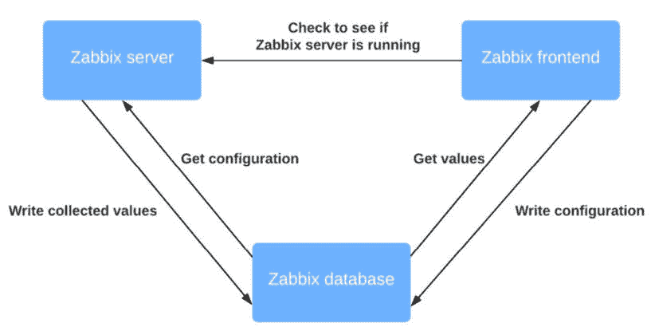

图 1.1 – Zabbix 设置通信图

我们刚刚设置了 Zabbix 服务器和数据库，通过运行这两个组件，我们基本上已经准备好开始监控。Zabbix 服务器与 Zabbix 数据库通信，将收集到的值写入数据库。

但是还有一个问题：我们无法配置 Zabbix 服务器做任何事情。为此，我们需要 Zabbix 前端，我们将在下一个章节中进行设置。

# 设置 Zabbix 前端

Zabbix 前端是我们服务器的“面孔”。它是我们配置所有主机、模板、仪表板、地图和其他所有内容的地方。没有它，我们将无法看到服务器端的情况。因此，在本章节中，我们将设置 Zabbix 前端。

## 准备工作

我们将使用 NGINX 来设置 Zabbix 前端。虽然也可以使用 Apache，但 NGINX 的速度更快，因此它在性能上略优于 Apache。由于安装 NGINX 和 Apache 都非常简单，如果前端用户较多，建议使用 NGINX。在开始本章之前，请确保您正在 Linux 发行版上运行 Zabbix 服务器。我将在这些章节中使用 `lar-book-rocky` 和 `lar-book-ubuntu` 主机，展示在 Rocky Linux 9 和 Ubuntu 22.04 上的设置过程。

## 如何操作…

1.  让我们直接进入，安装前端。

    对于基于 RHEL 的系统，请运行以下命令：

    ```
    dnf module switch-to php:8.3
    dnf install zabbix-web-mysql zabbix-nginx-conf
    ```

    对于 Ubuntu 系统，请运行以下命令：

    ```
    apt install zabbix-frontend-php zabbix-nginx-conf
    ```

提示

如果您正在使用防火墙，请不要忘记允许**80**和**443**端口。没有这一步，您将无法连接到前端。

1.  接下来，我们需要配置 NGINX 配置文件。

    对于基于 RHEL 的系统，请编辑以下文件：

    ```
    /etc/nginx/conf.d/zabbix.conf
    ```

    对于 Ubuntu 系统，请编辑以下文件：

    ```
    /etc/zabbix/nginx.conf
    ```

1.  然后，编辑以下两行：

    ```
    # listen 8080;
    # server_name example.com;
    ```

    将其修改为如下：

    ```
    listen 80;
    server_name 192.168.0.50;
    ```

重要提示

在**server_name**，重要的是添加运行此 NGINX（Zabbix）网页的 IP 地址。请在此处添加您希望前端可用的 IP 地址或 DNS 名称。

1.  重新启动 Zabbix 组件，并确保它们在服务器启动时自动启动。

    对于基于 RHEL 的系统，请运行以下命令：

    ```
    systemctl enable nginx php-fpm
    systemctl restart nginx php-fpm
    ```

    对于 Ubuntu 系统，请运行以下命令：

    ```
    systemctl enable nginx
    systemctl restart nginx php-fpm
    ```

1.  我们现在应该能够顺利访问我们的 Zabbix 前端，并开始进行设置 Zabbix 前端的最后步骤。

1.  让我们打开浏览器并导航到服务器的 IP 地址。它应该看起来像这样：

    ```
    http://<your_server_ip>/
    ```

重要提示

在 Ubuntu（某些情况下），你可能需要添加端口 **8080**，以后你可能会想把它改为 **80** 端口（或者在添加 SSL 后为 **443**）。在这种情况下，URL 应该是这样的：

http://<your_server_ip>:8080/

1.  现在我们应该能看到以下网页：

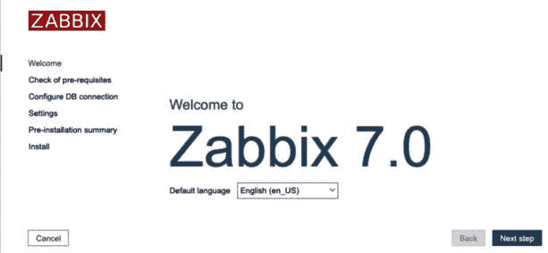

图 1.2 – Zabbix 欢迎页面

如果你没有看到这个网页，可能是你错过了安装过程中的某些步骤。回溯你的步骤，仔细检查配置文件；即使是一个小的拼写错误，也可能导致网页无法显示。

1.  在这个页面上点击**下一步**继续，这将带你进入下一页：

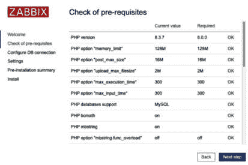

图 1.3 – Zabbix 安装前提页面

1.  现在这里的每一个选项应该都显示**OK**；如果没有，修正它所显示的错误。如果一切正常，你可以通过再次点击**下一步**来继续，这将带你进入下一页：

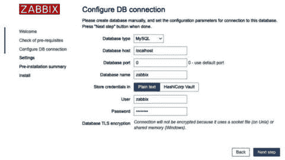

图 1.4 – Zabbix 安装数据库连接页面

1.  在这里，我们需要告诉 Zabbix 前端 MySQL 数据库的位置。因为我们将其安装在 **localhost** 上，所以只需要确保提供正确的数据库名称、数据库用户名和数据库密码。

1.  这应该使 Zabbix 前端能够与数据库通信。让我们通过再次点击**下一步**来继续：

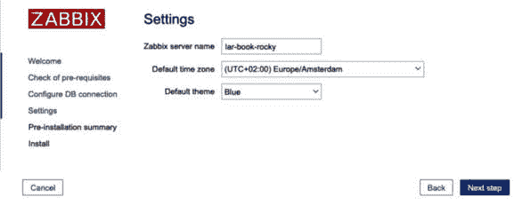

图 1.5 – Zabbix 安装服务器详细页面

接下来是 Zabbix 服务器配置。确保给你的服务器起个有用的名字或酷一点的名字。例如，我设置了一个名为 `Meeseeks` 的生产服务器，因为每次收到警报时，我们都可以让 Zabbix 说“*我是 Mr. Meeseeks。看我！*”。但像 `zabbix.example.com` 这样的名字也可以。

1.  让我们给服务器命名，设置时区以匹配我们的本地时区，然后继续下一步：

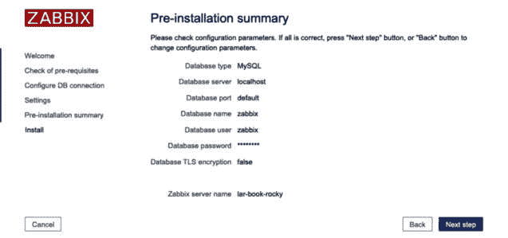

图 1.6 – Zabbix 安装总结页面

1.  验证你的设置后，再次点击**下一步**继续：

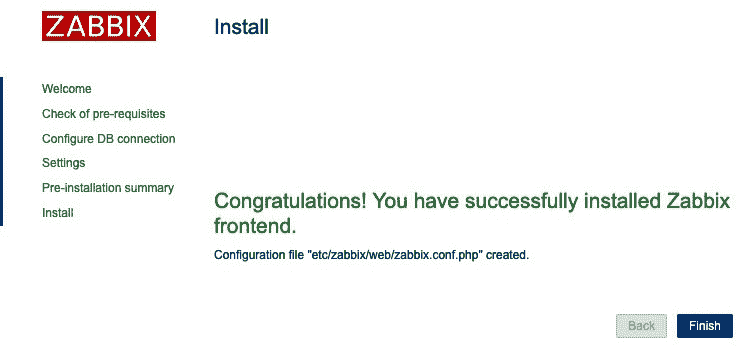

图 1.7 – Zabbix 安装完成页面

1.  你已经成功安装了 Zabbix 前端。现在你可以点击**完成**按钮，我们可以开始使用前端界面。你将看到一个登录页面，你可以使用以下默认凭据：

    +   **用户名**：**Admin**

    +   **密码**：**zabbix**

请记住，用户名和密码字段是区分大小写的。

## 工作原理…

现在我们已经安装了 Zabbix 前端，我们的 Zabbix 设置已完成，我们可以开始使用它了。我们的 Zabbix 前端将连接到我们的数据库，以编辑我们设置的配置值，正如我们在下面的图表中可以看到的那样：

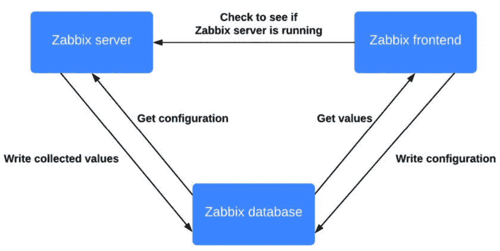

图 1.8 – Zabbix 设置通信图

Zabbix 前端还将与我们的 Zabbix 服务器进行通信，但这仅是为了确保 Zabbix 服务器正常运行并提供一些额外功能，例如项目上的测试按钮。现在我们知道如何设置 Zabbix 前端后，我们可以开始使用它。在下一个示例后，我们来看看这个。

## 还有更多...

Zabbix 提供了一个非常方便的设置指南，其中包含有关安装 Zabbix 的详细信息。我始终建议在安装 Zabbix 时保持此页面打开，因为它包含诸如最新存储库链接的信息。在这里查看：

[`www.zabbix.com/download`](https://www.zabbix.com/download)

# 启用 Zabbix 服务器 HA

Zabbix 6 附带了有史以来最受期待的功能之一，即高可用性（HA）。这一功能将通过确保如果您的一个 Zabbix 服务器出现问题，则另一个服务器将接管来将您的 Zabbix 设置提升到新的水平。当然，这一功能在 Zabbix 7 中仍然可用，我们将充分利用它。

这种实现的一个很大的优点是支持一个易于使用的专有方式将多个 Zabbix 服务器放入集群中：这是确保您的监控始终保持在线（或至少尽可能长时间在线）的绝佳方式。

Zabbix 服务器的设置将是主/备份方式，因为我们不能在 Zabbix 服务器端执行诸如负载均衡之类的操作。然而，可以使用 Zabbix 代理支持负载均衡，我们将在*第八章*中讨论*设置 Zabbix 代理*。

## 准备就绪

在开始之前，请注意创建高可用设置被认为是一个高级主题。这可能比本章其他示例更加困难。

对于此设置，我们将需要三台新的虚拟机，因为我们将创建一个分割的 Zabbix 设置，与本章第一个示例创建的设置不同。让我们看看我已经命名的三台新虚拟机及其 IP 地址：

+   **lar-book-ha1** (**192.168.0.1**)

+   **lar-book-ha2** (**192.168.0.2**)

+   **lar-book-ha-db** (**192.168.0.10**)

这些服务器中的两台将运行我们的 Zabbix 服务器集群和一个 Zabbix 前端。另一台服务器仅用于我们的 MySQL 数据库。请注意，示例中使用的 IP 地址可能与您的环境中的实际情况不同。请使用适合您环境的正确 IP 地址。

在示例中，我们还需要一个 `192.168.0.5`。

提示

在我们的设置中，我们只使用一个 MySQL Zabbix 数据库。为了确保 Zabbix 的所有部分都被设置为高可用，可能值得考虑将 MySQL 设置为主/主模式。这与 Zabbix 服务器的高可用性结合使用会是一个不错的选择。

本指南 *不会* 使用 SELinux 或 AppArmor，因此在使用本指南之前或过程中，请确保添加正确的策略。也可以禁用 SELinux，但在生产环境中不推荐这样做。此外，本指南没有详细说明如何设置防火墙，因此请确保提前进行设置。

## 如何操作…

为了方便起见，我们将 *如何操作…* 部分分成了三部分。第一部分是设置数据库，接下来是设置 Zabbix 服务器集群，最后是如何冗余地设置 Zabbix 前端。然后，*它是如何工作的…* 部分将解释整个设置过程。

### 设置数据库

让我们从设置 Zabbix 数据库开始，准备在高可用 Zabbix 服务器设置中使用。

1.  登录到 **lar-book-ha-db** 并在基于 Red Hat 的系统上使用以下命令安装 MariaDB 仓库：

    ```
    wget https://downloads.mariadb.com/MariaDB/mariadb_repo_setup
    chmod +x mariadb_repo_setup
    ./mariadb_repo_setup
    ```

1.  然后，让我们安装 MariaDB 服务器应用程序。

    对于基于 RHEL 的系统，运行以下命令：

    ```
    dnf install mariadb-server
    systemctl enable mariadb
    systemctl start mariadb
    ```

    对于 Ubuntu 系统，运行以下命令：

    ```
    apt install mariadb-server
    systemctl enable mariadb
    systemctl start mariadb
    ```

1.  安装 MariaDB 后，确保使用以下命令来保护您的安装：

    ```
    mariadb-secure-installation
    ```

1.  确保回答问题时选择是（**Y**），并配置一个安全的 root 密码。强烈建议使用密码保险库来存储它。

1.  现在，让我们为 Zabbix 服务器创建 Zabbix 数据库，以便连接。使用以下命令登录 MariaDB：

    ```
    mariadb -u root -p
    ```

1.  输入在安全安装过程中设置的密码。接下来，我们将使用以下命令创建一个 Zabbix 数据库。不要忘记在第二、第三和第四个命令中更改 **password**：

    ```
    create database zabbix character set utf8mb4 collate utf8mb4_bin;
    create user zabbix@'192.168.0.1' identified by 'password';
    create user zabbix@'192.168.0.2' identified by 'password';
    create user zabbix@'192.168.0.5' identified by 'password';
    grant all privileges on zabbix.* to 'zabbix'@'192.168.0.1' identified by 'password';
    grant all privileges on zabbix.* to 'zabbix'@'192.168.0.2' identified by 'password';
    grant all privileges on zabbix.* to 'zabbix'@'192.168.0.5' identified by 'password';
    set global log_bin_trust_function_creators = 1;
    quit
    ```

1.  最后，我们需要导入初始的 Zabbix 数据库配置，但为此，我们需要先安装 Zabbix 仓库。

    对于基于 RHEL 的系统，运行以下命令：

    ```
    rpm -Uvh https://repo.zabbix.com/zabbix/7.0/rocky/9/x86_64/zabbix-release-7.0-2.el9.noarch.rpm
    dnf clean all
    ```

    对于 Ubuntu 系统，运行以下命令：

    ```
    wget https://repo.zabbix.com/zabbix/7.0/ubuntu/pool/main/z/zabbix-release/zabbix-release_7.0-1+ubuntu22.04_all.deb
    dpkg -i zabbix-release_7.0-1+ubuntu22.04_all.deb
    apt update
    ```

1.  然后，我们需要安装 Zabbix 模块的 SQL 脚本。

    对于基于 RHEL 的系统，运行以下命令：

    ```
    dnf install zabbix-sql-scripts
    ```

    对于 Ubuntu 系统，运行以下命令：

    ```
    apt install zabbix-sql-scripts
    ```

1.  然后，我们执行以下命令，这可能需要一段时间，请耐心等待直到完成：

    ```
    zcat /usr/share/doc/zabbix-sql-scripts/mysql/server.sql.gz | mysql --default-character-set=utf8mb4 -u root -p zabbix
    ```

1.  在此步骤之后，我们需要禁用 **log_bin_trust_function_creators**：

    ```
    mysql -u root -p
    set global log_bin_trust_function_creators = 0;
    quit;
    ```

### 设置 Zabbix 服务器集群节点

设置集群节点的方式与设置任何新 Zabbix 服务器的方式相同。唯一的区别是我们需要指定一些新的配置参数。

1.  让我们从将 Zabbix 7.0 仓库添加到 **lar-book-ha1** 和 **lar-book-ha2** 系统开始：

    ```
    rpm -Uvh https://repo.zabbix.com/zabbix/7.0/rocky/9/x86_64/zabbix-release-7.0-2.el9.noarch.rpm
    dnf clean all
    ```

    对于 Ubuntu 系统，使用以下命令：

    ```
    wget https://repo.zabbix.com/zabbix/7.0/ubuntu/pool/main/z/zabbix-release/zabbix-release_7.0-1+ubuntu22.04_all.deb
    dpkg -i zabbix-release_7.0-1+ubuntu22.04_all.deb
    apt update
    ```

1.  现在，让我们安装 Zabbix 服务器应用程序。

    对于基于 RHEL 的系统，运行以下命令：

    ```
    dnf install zabbix-server-mysql zabbix-selinux-policy
    ```

    对于 Ubuntu 系统，运行以下命令：

    ```
    apt install zabbix-server-mysql
    ```

1.  现在，我们将编辑 Zabbix 服务器配置文件，从**lar-book-ha1**开始。执行以下命令：

    ```
    vim /etc/zabbix/zabbix_server.conf
    ```

1.  然后，添加以下行以允许数据库连接：

    ```
    DBHost=192.168.0.10
    DBPassword=password
    ```

    默认情况下，`DBName` 和 `DBUser` 都设置为`zabbix`。如果你使用了不同的数据库和/或用户名，你也需要更改这些设置。

1.  要在此主机上启用 HA，请在相同的文件中添加以下行：

    ```
    HANodeName=lar-book-ha1
    ```

1.  为了确保我们的 Zabbix 前端知道在节点故障转移时连接到哪里，填写以下内容：

    ```
    NodeAddress=192.168.0.1
    ```

1.  保存文件，然后我们将通过编辑**lar-book-ha2**主机的文件，做相同的操作：

    ```
    vim /etc/zabbix/zabbix_server.conf
    ```

1.  然后，添加以下行以允许数据库连接：

    ```
    DBHost=192.168.0.10
    DBPassword=password
    ```

    默认情况下，`DBName` 和 `DBUser` 都设置为`zabbix`。如果你使用了不同的数据库和/或用户名，你也需要更改这些设置。

1.  要在此主机上启用 HA，请在相同的文件中添加以下行：

    ```
    HANodeName=lar-book-ha2
    ```

1.  为了确保我们的 Zabbix 前端知道在节点故障转移时连接到哪里，填写以下内容：

    ```
    NodeAddress=192.168.0.2
    ```

1.  保存文件，然后让我们启动 Zabbix 服务器：

    ```
    systemctl enable zabbix-server
    systemctl start zabbix-server
    ```

### 设置带有 HA 的 NGINX

为确保我们的前端也已设置，当一个 Zabbix 服务器出现问题时，它能够故障转移，我们将使用`keepalived`进行设置。让我们看看如何做到这一点。

1.  让我们从登录到**lar-book-ha1**和**lar-book-ha2**开始，并安装**keepalived**。

    对于基于 RHEL 的系统，运行以下命令：

    ```
    dnf install -y keepalived
    ```

    对于 Ubuntu 系统，运行以下命令：

    ```
    apt install keepalived
    ```

1.  然后，在**lar-book-ha1**上，使用以下命令编辑**keepalived**配置：

    ```
    vim /etc/keepalived/keepalived.conf
    ```

1.  删除此文件中的所有内容（如果文件尚未为空），然后将以下文本添加到文件中：

    ```
    vrrp_track_process chk_nginx {
          process nginx
          weight 10
    }
    vrrp_instance ZBX_1 {
            state MASTER
            interface ens192
            virtual_router_id 51
            priority 244
            advert_int 1
            authentication {
                    auth_type PASS
                    auth_pass password
            }
            track_process {
                    chk_nginx
            }
            virtual_ipaddress {
                    192.168.0.5/24
            }
    }
    ```

1.  别忘了将**password**更新为安全密码，并将**ens192**接口修改为你自己的接口名称/编号。

重要提示

在之前的文件中，我们指定了**virtual_router_id 51**；请确保虚拟路由器 ID **51** 在网络中尚未使用。如果已使用，请简单地在整个操作中更改虚拟路由器 ID。

1.  在**lar-book-ha2**上，使用以下命令编辑相同的文件：

    ```
    vim /etc/keepalived/keepalived.conf
    ```

1.  使用**dG**删除文件中的所有内容（如果你使用的是 vim），这次我们将添加以下信息：

    ```
    vrrp_track_process chk_nginx {
          process nginx
          weight 10
    }
    vrrp_instance ZBX_1 {
            state BACKUP
            interface ens192
            virtual_router_id 51
            priority 243
            advert_int 1
            authentication {
                    auth_type PASS
                    auth_pass password
            }
            track_process {
                    chk_nginx
            }
            virtual_ipaddress {
                    192.168.0.5/24
            }
    }
    ```

1.  再次提醒，不要忘记将**password**更新为安全密码，并将**ens192**接口修改为你自己的接口名称/编号。

1.  现在，让我们安装 Zabbix 前端。

    对于基于 RHEL 的系统，运行以下命令：

    ```
    dnf install nginx zabbix-web-mysql zabbix-nginx-conf zabbix-selinux-policy
    apt install nginx zabbix-frontend-php zabbix-nginx-conf
    ```

1.  然后，我们将配置我们的 NGINX 配置。

    对于基于 RHEL 的系统，请编辑以下文件：

    ```
    /etc/nginx/conf.d/zabbix.conf
    ```

    对于 Ubuntu 系统，编辑以下文件：

    ```
    /etc/zabbix/nginx.conf
    ```

1.  然后，编辑以下两行：

    ```
    # listen 8080;
    # server_name example.com;
    ```

    使其看起来像这样：

    ```
    listen 80;
    server_name 192.168.0.5;
    ```

重要提示

在**server_name**处，重要的是要添加此 NGINX（Zabbix）网页将运行的 IP 地址。请在此处添加前端可用的 IP 地址或 DNS 名称。在此案例中，我们添加了**keepalived**将管理的 VIP 地址。

1.  启动 Web 服务器和**keepalived**，使你的 Zabbix 前端可用，使用以下命令：

    ```
    systemctl enable nginx keepalived
    systemctl start nginx keepalived
    ```

1.  然后，我们可以开始配置我们的 Zabbix 前端。导航至您的 VIP 地址（在示例 IP 案例中为 **http://192.168.0.5/**），您将看到以下页面：

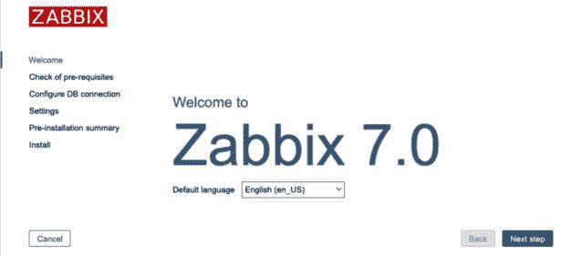

图 1.9 – lar-book-ha1 的 Zabbix 初始配置窗口

1.  连续点击两次 **下一步** 直到看到以下页面：

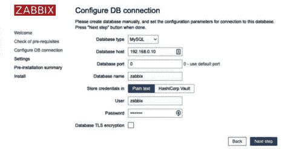

图 1.10 – lar-book-ha1 的 Zabbix 数据库配置窗口

1.  确保用我们 Zabbix MariaDB 数据库的 IP 地址（**192.168.0.10**）填写 **数据库主机**。然后，为我们的 **zabbix** 数据库用户填写数据库密码。

1.  然后，作为最后一步，对于我们的第一个节点，将 **Zabbix 服务器名称** 设置为 **lar-book-ha1**，并选择您的时区，如下截屏所示：

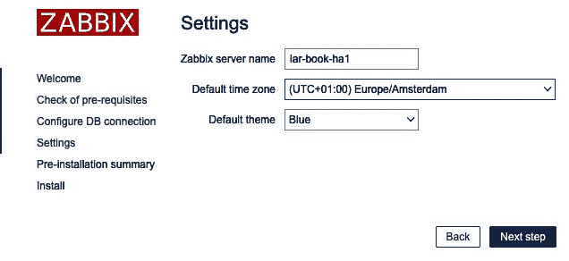

图 1.11 – lar-book-ha1 的 Zabbix 服务器设置窗口

1.  然后，点击 **下一步** 和 **完成**。

1.  现在，我们需要对第二个前端执行相同的操作。登录到 **lar-book-ha1**。

    对于基于 RHEL 的系统，请执行以下操作：

    ```
    systemctl stop nginx
    ```

    对于 Ubuntu 系统，请执行以下操作：

    ```
    systemctl stop nginx
    ```

1.  当导航到您的 VIP（在示例 IP 案例中为 **http://192.168.0.5/zabbix**）时，您将再次看到相同的配置向导。

1.  重新填写数据库详细信息：

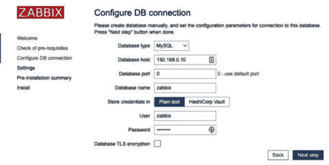

图 1.12 – lar-book-ha2 的 Zabbix 数据库配置窗口

1.  确保将 **Zabbix 服务器名称** 设置为 **lar-book-ha2**，如下截屏所示：

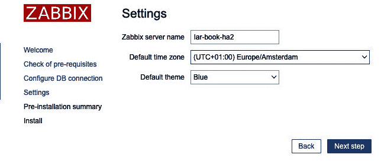

图 1.13 – lar-book-ha2 的 Zabbix 服务器设置窗口

1.  现在，我们需要再次启用 **lar-book-ha1** 前端，方法如下：

    ```
    systemctl start nginx
    ```

这应该是我们的最后一步。现在一切应该按预期工作。确保检查您的 Zabbix 服务器日志文件，以查看 HA 节点是否按预期运行。

## 它是如何运作的...

现在我们已经完成了，Zabbix 服务器在 HA 模式下实际上是如何工作的呢？让我们从检查我们 Zabbix 前端的 **报告** | **系统信息** 页面开始：

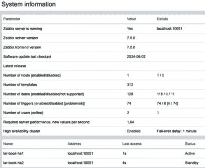

图 1.14 – lar-book-ha1 的 Zabbix 服务器系统信息及 HA 信息

现在我们可以看到一些新的可用信息；例如，**高可用性集群** 参数。此参数现在告诉我们 HA 是否已启用以及故障转移延迟是多少。在我们的情况下，这是 1 分钟，这意味着在启动故障转移之前可能需要最多 1 分钟的时间。

此外，我们可以看到集群中的每个节点。由于 Zabbix 现在支持集群中的一对多节点，我们可以在这里看到每个节点参与的情况。让我们看看我们建立的设置：

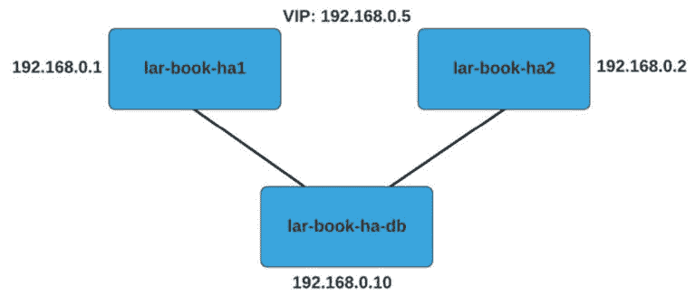

图 1.15 – Zabbix 服务器 HA 设置

正如你在设置中看到的，我们已经将两个 Zabbix 服务器节点 `lar-book-ha1` 和 `lar-book-ha2` 连接到我们的单一 Zabbix 数据库 `lar-book-ha-db`。因为我们的 Zabbix 数据库就是 Zabbix 服务器配置文件中的 `HANodeName` 值。

我们还在配置文件中加入了 `NodeAddress` 参数。该参数由 Zabbix 前端使用，确保我们的系统信息（小部件）和 Zabbix 服务器不运行前端通知工作。`NodeAddress` 参数会告诉前端在每个对应的服务器成为活动 Zabbix 服务器时，应该连接哪个 IP 地址。

为了进一步提高系统的可用性，我还为此安装添加了简单的 `keepalived` 设置。`keepalived` 配置是一种在 Linux 服务器之间构建简单 VRRP 故障转移设置的方法。在我们的案例中，我们已将 VIP 设置为 `192.168.0.5` 并添加了 `chk_nginx` 进程监控，用于确定何时进行故障转移。我们的故障转移机制如下：

```
lar-book-ha1 has priority 244
lar-book-ha2 has priority 243
```

如果 NGINX 在我们的节点上运行，它会为我们的优先级增加 10 分，导致总优先级分别为 `254` 和 `253`。现在，假设 `lar-book-ha1` 不再运行 Web 服务器进程。这意味着它的优先级会降到 `244`，低于 `lar-book-ha2` 上的 `253`，后者正在运行 Web 服务器进程。

拥有最高优先级的主机会获得 `192.168.0.5` VIP，这意味着该主机正在运行 Zabbix 前端，并将提供服务。

通过结合这两种 HA 设置方式，我们已经为 Zabbix 设置中的两个部分创建了冗余，确保可以将故障时间降到最低。

## 更多内容...

现在，你可能会想，假如我想在设置 HA 时更进一步，该怎么办？首先，Zabbix HA 功能的设计是为了简化并让整个 Zabbix 用户群体都能理解，这意味着目前，你可能看不到与第三方实现相同数量的功能。

然而，新的 Zabbix 服务器 HA 功能已被证明是一个期待已久的功能，确实为系统带来了更多价值。如果你想运行像这样的 HA 设置，增加 HA 复杂度的最佳方法是采用 MySQL 主/主设置。通过将 Zabbix 数据库与 HA 配置，作为主要的 **真理源** (**SOT**)，可以确保你的 Zabbix 设置在尽可能多的方面都是可靠的。有关 MariaDB 复制的更多信息，请查看此文档：[`mariadb.com/kb/en/standard-replication/`](https://mariadb.com/kb/en/standard-replication/)。

# 使用 Zabbix 前端

如果这是你第一次使用 Zabbix，恭喜你进入了用户界面。如果你是返回的 Zabbix 用户，可能会注意到 Zabbix 7 用户界面有些变化。我们将介绍在 Zabbix 前端中可以找到的一些不同元素，让你在本书过程中，能自信地找到所需的所有内容。

## 准备就绪

要开始使用 Zabbix 用户界面，我们只需要登录到前端。你将看到以下页面，这个页面位于运行 Zabbix 前端的服务器的 IP 上：


图 1.16 – Zabbix 登录界面

确保使用默认凭据登录 Zabbix 前端：

+   **用户名**：**Admin**

+   **密码**：**zabbix**

提示

就像在 Linux 中一样，Zabbix 在大多数地方是区分大小写的。输入用户名时，请确保大小写正确；否则，你将无法登录！

## 如何操作…

登录后，你将看到默认页面，即默认仪表板。这就是 Zabbix 所称的**全局视图**，它为我们提供了一个清晰的概览，让我们了解当前的情况。我们可以完全自定义这个以及 Zabbix 提供的所有其他仪表板，但在构建新的仪表板之前，最好先熟悉默认设置：

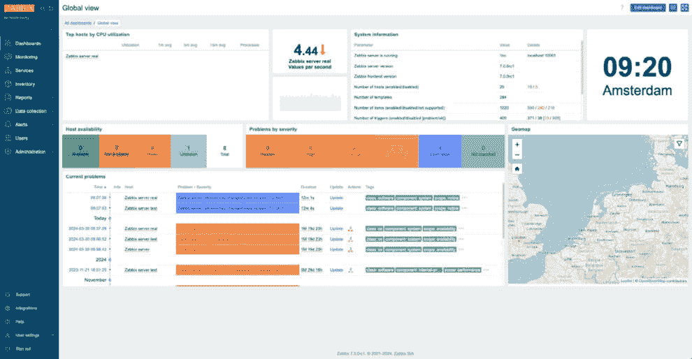

图 1.17 – 全局视图仪表板

那么，让我们通过查看默认仪表板来开始熟悉 Zabbix 7 前端。请按照前端的指引，点击并查看所提到的内容。

Zabbix 使用仪表板，并且这些仪表板充满了小部件来显示信息。让我们逐一了解默认仪表板中的不同小部件，并详细介绍它们所提供的信息。

我们先从**系统** **信息**小部件开始：

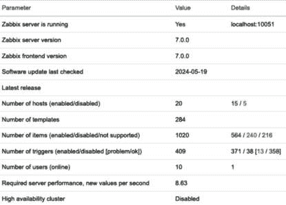

图 1.18 – 系统信息小部件

**系统信息**小部件，顾名思义，提供了所有系统信息。这样，我们可以随时关注 Zabbix 服务器的状态，看看它是否正常运行。

让我们来了解一下这些参数：

+   **Zabbix 服务器是否运行**：通知我们 Zabbix 服务器后端是否正在运行，以及它的运行位置。在这种情况下，它正在运行，并且运行在**localhost:10051**。

+   **Zabbix 服务器版本**/**Zabbix 前端版本**：现在我们有了单独的指示器，详细显示我们的 Zabbix 服务器和前端的版本。

+   **最后检查的软件更新**：这是另一项新增功能。Zabbix 现在会为你检查新的版本，并在下方的列中指示最新版本。

+   **最新版本**：此项将显示 Zabbix 的最新可用版本。

+   **主机数量（启用/禁用）**：此项将显示启用的主机数量（**15**）和禁用的主机数量（**5**）。

+   **模板数量**：这显示了我们拥有的模板总数（**284**）。

+   **项数量（启用/禁用/不支持）**：在这里，我们可以看到 Zabbix 服务器的项的详细信息——在此案例中，启用（**564**）、禁用（**240**）和不支持（**216**）。

+   **触发器数量（启用/禁用 [问题/正常]）**：这显示了触发器的数量。我们可以看到有多少被启用（**371**）和禁用（**38**），还可以看到多少处于**问题**状态（**13**），多少处于**正常**状态（**358**）。

+   **用户数量（在线）**：第一个值详细说明了总用户数。第二个值详细说明了当前登录到 Zabbix 前端的用户数。

+   **所需服务器性能，新的每秒值**：也许我在这里向你介绍一个全新的概念，那就是**每秒新值**，或**NVPS**。服务器通过项接收或请求值，并将其写入我们的 MariaDB 数据库（或其他数据库）。这里详细的 NVPS 信息显示了 Zabbix 服务器接收的估计每秒新值数。在 Zabbix 服务器增长的过程中，密切关注这个指标，它是衡量你需要多快扩展的良好指示器。

+   **高可用性集群**：如果你正在运行 Zabbix 服务器 HA 集群，你会看到它是否已启用以及故障转移延迟是多少。此外，**系统信息**页面将显示额外的 HA 信息。

根据你的配置，你可能还会看到两个附加值：

+   **数据库历史表已升级**：如果你看到这个，说明你的一个数据库历史表尚未升级。数值（浮动）表已扩展，允许每个数据点保存更多字符。这个表在从 Zabbix 4 升级到 5 或更高版本时不会自动升级，因为并非每个人都需要它，而且升级可能需要很长时间。

+   **数据库名称**：如果你看到数据库名称以及版本号的值，这可能表示你正在使用不受支持的数据库版本。你可能会看到类似以下的消息：**警告！不受支持的 <DATABASE NAME> 数据库服务器版本。应该至少为 <****DATABASE VERSION>**。

这是涉及 Zabbix 服务器时最重要的小部件之一，如果你问我，它是值得保留在主仪表板上的一个小部件。

让我们继续下一个小部件，**主机可用性**：

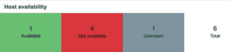

图 1.19 – 主机可用性小部件

**主机可用性**小部件是一个快速概览小部件，可以显示你想要了解的所有监控主机的可用性状态。在此小部件中，它会显示主机是否可用、不可用或状态未知。这样，你可以在一个小部件中全面了解通过 Zabbix 服务器监控的所有主机的可用性。

旁边是**按** **严重性**划分的问题小部件：


图 1.20 – 按严重程度分类的问题小部件

它会显示当前有多少主机在某种状态下触发了警报。Zabbix 中有几个默认的严重程度：

+   **灾难**

+   **高**

+   **中等**

+   **警告**

+   **信息**

+   **未分类**

我们可以完全自定义严重性级别和颜色；例如，决定哪个触发器对应哪个严重性级别。所以，如果你现在对严重性有疑虑，别担心，我们稍后会讨论这个问题。

提示

自定义严重性级别和颜色对您的组织非常有用。我们可以自定义严重性级别，使其与我们公司内部使用的级别相匹配，甚至与我们的其他监控系统相匹配。

下一个小部件是**时钟**：


图 1.21 – 时钟小部件，指示时间

这是一个显示本地 Linux 系统时间的时钟，最终是数字时间格式。还需要多说什么吗？让我们继续看**问题**小部件：

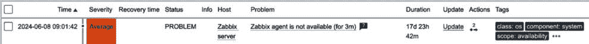

图 1.22 – 可用的其中一个问题小部件

这是一个有趣的小部件，我经常使用。我们可以在这个界面上看到当前的问题，因此如果我们正确设置了触发器，就会在这里获得有价值的信息。了解有多少主机出现问题是一个方面，但**问题**页面还会给我们提供关于问题的更多细节：

+   **时间**：Zabbix 服务器第一次注意到这个问题的时间。

+   **信息**：关于事件的信息，其中包括**手动关闭**和**已抑制**状态。

+   **主机**：此问题发生在哪个主机上。

+   **问题**/**严重性**：问题是什么，严重性如何。严重性通过颜色显示；在这种情况下是橙色，表示**中等**。

+   **持续时间**：这个问题已经存在多长时间了。

+   **更新**：一个按钮，让我们能够对现有问题进行更改，例如确认问题或添加消息。

+   **操作**：问题发生后采取了哪些行动；例如，问题是否已确认，或在问题创建时执行的自定义脚本？如果你将鼠标悬停在任何操作上，它将显示已对该问题采取的所有操作的详细信息。

+   **标签**：此问题分配了哪些标签？

**问题**小部件非常有用。我们有不同类型的小部件可供选择，正如之前提到的，它是完全可定制的，具体取决于这个小部件如何向我们展示问题。快速看一下其中一些选项，我们将在后面的章节中详细介绍：

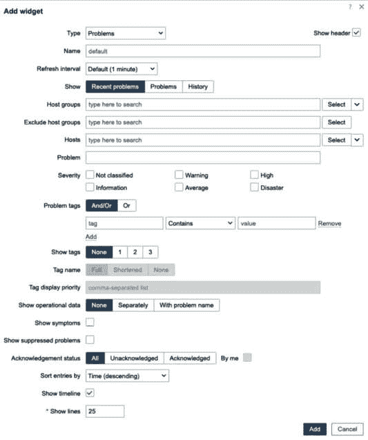

图 1.23 – 添加小部件界面

提示

我们可以从这些小部件中隐藏严重性级别，确保我们只看到重要的级别。有时，我们不想在仪表板上看到信息性严重性问题；这可能会分散我们对更重要问题的注意力。通过自定义小部件来保持仪表板的简洁。

默认仪表盘上还包括一个非常基础的 **Graph** 小部件。如你所见，它显示了每秒处理的值的数量。正如我们所说，**System information** 给出了这个值的估计。**Graph** 小部件则提供了更准确和详细的视图：

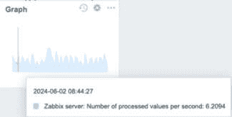

图 1.24 – 图形小部件

这些图形小部件同样完全可定制，我们将在本书后面详细讲解它们。

你将在此页面上找到一些较新的小部件，包括**Top hosts**、**Item value**和**Geomap**小部件。让我们从**Top hosts**小部件开始，仔细了解一下这些小部件：

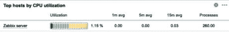

图 1.25 – Top hosts 小部件

**Top hosts**小部件可以完全自定义，展示我们想要的任何项目列表。然后我们可以对该列表进行排序，显示值最高（**Top N**）或值最低（**Bottom N**）的项目，从而为我们提供一个关于——在本例中——具有最高 CPU 负载的主机的概览。

**Item value**小部件同样非常有用，它展示了一个单一的项目值：


图 1.26 – 项目值小部件

然后，最后是 **Geomap** 小部件：一个地理地图，展示我们希望添加的所有主机。如你所见，默认情况下，我们的 Zabbix 服务器已经被包含在内。在我们的例子中，我已确保将 Zabbix 服务器的位置更新为我们位于荷兰的总部：

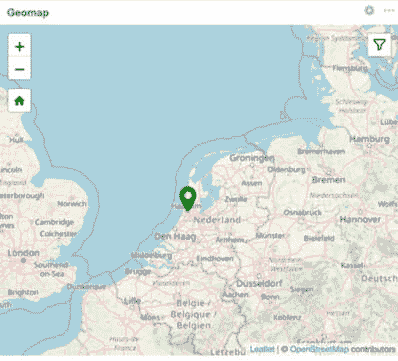

图 1.27 – Geomap 小部件

它还向我们展示了 Zabbix 服务器当前没有问题，因为图标是绿色的。如果有问题，图标会显示为问题严重程度的颜色。

我们现在知道如何使用 Zabbix 前端，可以继续学习如何浏览我们的实例。

# 浏览 Zabbix 前端

导航 Zabbix 前端比看起来更简单，尤其是自 Zabbix 5.0 版本起，UI 进行了许多令人惊叹的变化，并持续到 Zabbix 7.0。在本节中，我们将通过查看导航栏及其提供的功能，进一步探索 Zabbix 的导航 UI。

## 准备就绪

现在，我们已经看过了登录后默认仪表盘上的第一页，是时候开始浏览 Zabbix UI，看看其他可用页面了。我们将通过侧边栏浏览并探索我们 Zabbix 安装中的页面，以便在开始监控我们的网络和应用时，知道在哪里找到所有内容。

所以，在继续之前，确保你已根据前面的小节完成 Zabbix 服务器的设置。

## 如何操作…

Zabbix 导航栏是我们所有强大工具和配置设置的门户。Zabbix 使用左侧导航栏来保持 UI 尽可能简洁。此外，他们还让侧边栏消失，以便我们能更清晰地查看所有内容，而不被侧边栏遮挡视线。

提示

我们无法改变 Zabbix 导航菜单的位置，但可以将其缩小或者完全隐藏。如果你希望隐藏导航栏（或不隐藏），可以点击 Zabbix 标志右侧的第一个图标。如果你想完全隐藏导航栏，可以点击 Zabbix 标志右侧的第二个图标。

让我们从默认页面开始，看看 Zabbix 侧边栏，并了解它。请按照前端操作，点击并查看提到的内容：


图 1.28 – 在你自己的网页浏览器中看到的默认 Zabbix 页面

这里有一些类别供我们选择，类别下面有不同的页面。首先，让我们详细介绍这些类别：

+   **监控**：**监控**类别是我们可以找到所有收集数据的地方。基本上，当你在使用 Zabbix 时，需要读取你辛苦收集的任何信息时，就会用到这个类别。

+   **服务**：**服务**类别是 Zabbix 7 的新功能，作为改进的**业务服务监控**（**BSM**）功能的一部分。我们可以在这里找到所有与服务和**服务水平协议**（**SLA**）监控相关的信息。

+   **库存**：**库存**类别是 Zabbix 中的一个额外酷炫功能，我们可以用它来查看与主机相关的库存信息。你可以将软件版本或序列号等信息添加到主机中，并在这里查看。

+   **报告**：**报告**类别包含了各种预定义和用户自定义的报告，专注于显示如系统信息、触发器和收集的数据等参数的概览。

+   **数据收集**：**数据收集**类别是我们构建与监控设备相关的一切内容的地方。稍后我们将在**监控**、**库存**和**报告**中使用这些数据。我们可以编辑设置以满足我们的各种需求，从而使 Zabbix 能够以有用的方式显示数据。

+   **警报**：UI 中的**警报**部分专注于显示正确的数据。

+   **用户**：**用户**部分专门显示与用户和用户组相关的数据。它包含了你管理账户和权限所需的一切内容。

+   **管理**：**管理**类别是我们管理 Zabbix 服务器的地方。你可以在这里找到所有的服务器设置，从而使你和你的同事们能够有一个良好的 Zabbix 使用体验。

在使用本书时，你将频繁接触到这些内容，所以一定要记住它们。让我们通过逐一查看它们，进一步深入了解各个类别。首先从**监控**类别开始：


图 1.29 – 侧边栏的监控部分

**监控**标签包含以下页面：

+   **问题**：我们可以在这里详细查看当前的问题。提供了多个筛选选项，以便在需要时缩小问题搜索的范围。

+   **主机**：这个页面将提供主机状态的快速概览，并提供链接导航到显示主机数据的页面。

+   **最新数据**：这是我们在整个 Zabbix 使用过程中将会频繁使用的一个页面。**最新数据**页面显示了每个主机收集到的值，我们当然可以对这些值进行筛选。

+   **地图**：地图是 Zabbix 中一个非常有用的工具，可以帮助我们概览基础设施。我们可以将它们用于网络概览等。

+   **发现**：这个页面为我们提供了已发现设备的概览。稍后我们会更深入地处理这个内容。

接下来，我们来看一下**服务**类别：


图 1.30 – 侧边栏的服务部分

该部分侧边栏包含以下页面：

+   **服务**：这里是我们配置所有希望监控的服务的地方

+   **SLA**：我们可以在这里配置任何 SLA，然后将其应用到我们的服务中。

+   **SLA 报告**：一个关于已配置服务及其 SLA（服务级别协议）是否满足的详细概览

然后，我们来看一下**库存**类别：

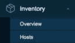

图 1.31 – 侧边栏的库存部分

**库存**标签包含以下页面：

+   **概览**：一个快速概览页面，显示您的库存信息

+   **主机**：提供更详细的每个主机的库存值视图

接下来，我们来看一下**报告**类别：

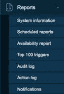

图 1.32 – 侧边栏的报告部分

**报告**标签包含以下页面：

+   **系统信息**：您可以在这里查看系统信息；它包含了我们之前讨论过的**系统信息**小部件的相同信息。

+   **定时报告**：这是我们配置任何自动 PDF 报告并可能发送的地方。

+   **可用性报告**：在这个页面上，我们可以看到触发器在**问题**状态和**正常**状态下的时间百分比。这是查看某些项目实际健康状态的一个有用方法。

+   **前 100 个触发器**：在一段时间内状态变化最频繁的前 100 个触发器。

+   **审计日志**：在这里我们可以查看谁修改了 Zabbix 服务器上的内容。这是一个很好的方式来查看是哪个同事不小心将你锁定了，或者是否是故意的。

+   **操作日志**：在这里我们可以查看已采取的操作列表；例如，由于触发器进入**问题**状态或**正常**状态。

+   **通知**：在此页面上，我们可以查看已发送给用户的通知数量。

接下来，我们有**数据收集**类别，这是一个新的条目：

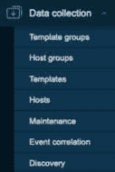

图 1.33 – 侧边栏的数据收集部分

**数据收集**标签页几乎与旧版本中的**配置**标签页相同。它包含以下页面：

+   **模板组**：在这里配置我们的模板组；例如，为我们公司内部将使用的所有模板配置一个组（*Templates/Open source ICT Solutions*），或者为所有网络设备配置一个组（*Templates/Networking*）。

+   **主机组**：我们在这里配置主机组；例如，为所有 Linux 服务器配置一个组。

+   **模板**：在这里我们配置可以用来从 Zabbix 服务器监控主机的模板。

+   **主机**：另一个**主机**标签页，但这一次它不是用来检查数据的。这里是我们添加和配置主机设置的地方。

+   **维护**：在 Zabbix 中，我们可以设置维护期；这样，触发器或通知在你进行维护时（例如，将某些设备下线）就不会打扰到你。

+   **事件关联**：我们可以在这里将问题关联，以减少噪音或防止事件风暴。通过在问题与其他问题关联时关闭新的或旧的问题来实现。

+   **发现**：在这里配置 Zabbix 发现功能，用于自动创建主机。

Zabbix 中新加入的**警报**类别：


图 1.34 – 侧边栏的警报部分

它由以下三个页面组成：

+   **操作**：在前端的这一部分，我们可以配置各种操作。我们可以设置用于发送警报、创建主机等的操作。

+   **媒体类型**：Zabbix 中预先配置了几种媒体类型，您可以在这里找到它们。我们还可以添加自定义的媒体类型。

+   **脚本**：在这里我们可以添加自定义脚本，以扩展 Zabbix 前端的功能。

倒数第二个，也是新的，我们有**用户**：

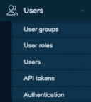

图 1.35 – 侧边栏的用户部分

我们可以在这里找到五个不同的页面：

+   **用户组**：在这里我们配置用户组及其权限。

+   **用户角色**：在这里可以配置不同用户的角色，以限制或扩展某些前端功能到特定用户。

+   **用户**：将用户添加到此页面。

+   **API 令牌**：这个页面以前有些隐藏，但现在更容易找到。我们可以在这里管理所有有权限编辑的 API 令牌：对超级管理员来说，这非常有用，可以创建和管理不同用户的令牌。

+   **身份验证**：我们可以在这里找到我们的身份验证设置，例如**轻量级目录访问协议**（**LDAP**）、**安全断言标记语言**（**SAML**）和 HTTP。它还包含新的**即时**（**JIT**）用户配置设置。

    最后，我们有了**管理**类别：

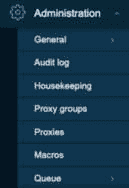

图 1.36 – 侧边栏中的管理部分

**管理**选项卡包含以下页面：

+   **常规**：常规页面包含我们的 Zabbix 服务器配置。从**家务管理**到**前端主题**的设置都可以在这里找到。

+   **审计日志**：审计日志设置位于这里。我们可以启用或禁用审计日志，并且可以更改日志存储的时长。

+   **家务管理**：一般的家务管理设置可以在这里找到。我们可以编辑希望启用或禁用的家务管理内容，并且可以更改我们存储历史记录、趋势、触发器等内容的时长。

+   **代理组**：在这个新条目中，我们将定义可以与代理一起用于故障转移和负载均衡的代理组。

+   **代理**：在这里，我们配置应连接到该 Zabbix 服务器的代理。

+   **宏**：现在全局宏更加容易访问，因为它们已经被重新定位到这里。在这里定义新的并管理现有的全局宏。

+   **队列**：在这里查看 Zabbix 服务器队列。由于数据收集或性能问题，项目可能会被卡在队列中。

提示

使用 Zabbix 身份验证（如 HTTP、LDAP 或 SAML）时，我们仍然需要在内部创建用户，并赋予正确的权限。配置用户时，需要使其用户名与身份验证方法中的用户名匹配，并使用身份验证方法进行密码管理。然而，在 Zabbix 7.0 中，可以使用即时用户配置（JIT）自动创建具有正确权限的用户，这在本书中也会提到。
