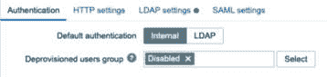

# 第二章：2

# 使用 Zabbix 用户管理准备工作

在本章中，我们将创建我们的第一个用户组、用户和用户角色。正确设置这些内容非常重要，因为它们将为用户提供正确权限，确保他们能访问你的 Zabbix 环境。通过一步一步地讲解这些内容，我们将确保在继续本书的其他部分之前，我们已经建立了一个结构化的 Zabbix 设置。

作为额外的内容，我们还将设置一些高级用户认证，使用 SAML 和 LDAP，让 Zabbix 用户的使用更加便捷，并为他们提供一个使用公司中可能已经在使用的登录凭据的方式。我们将按照以下步骤依次进行讲解：

+   创建用户组

+   使用 Zabbix 用户角色

+   创建你的第一个用户

+   Azure AD SAML 用户认证与即时用户创建（JIT）

+   OpenLDAP 用户认证与即时用户创建（JIT）

# 技术要求

我们可以在任何安装了 Zabbix 的环境中完成本章的所有工作。如果你还没有安装 Zabbix，请查看上一章学习如何安装它。我们将通过我们的 Zabbix 设置准备好所有内容，以便我们的用户开始登录并使用 Zabbix 前端。

# 创建用户组

要登录到 Zabbix 前端，我们需要用户。目前，我们使用的是默认用户，这很合理，因为我们需要一个用户来创建其他用户。不过，这样的设置不太安全，因为我们不希望继续使用 `zabbix` 作为密码。所以，我们将学习如何创建新用户并将他们分组。

在设置用户帐户之前，选择如何在 Zabbix 中管理用户非常重要。如果你想使用 LDAP 或 SAML 等方式，最好立即做出使用这些认证方法的决定，这样就不会遇到迁移问题。

## 准备工作

现在我们已经了解了 Zabbix UI 的结构和导航方式，可以开始进行实际的配置了。我们将从创建一些用户组开始，熟悉这个过程并开始使用它们。这样，我们的 Zabbix 设置不仅会更加结构化，还会更加安全。

为了开始，我们需要一个像之前食谱中使用的 Zabbix 服务器，并利用我们在那里获得的知识导航到正确的前端部分。

看一下下面的图，我们可以看到我们的示例公司**云主机提供商**是如何设置的。我们将创建图中看到的用户，以建立一个结构化且稳固的用户设置：


图 2.1 – 云主机提供商部门图

所以，**云主机提供商**有一些部门需要访问 Zabbix 前端，而另一些部门则不需要。假设我们希望给以下部门提供 Zabbix 前端的访问权限：

+   **网络**：配置和监控他们的网络设备

+   **基础设施**：配置和监控他们的 Linux 服务器

+   **采购与库存**：查看库存信息并与其他内部工具进行对比

## 如何操作…

让我们开始在 Zabbix UI 中创建这三个用户组：

1.  为此，请导航到**用户** | **用户组**，将显示以下页面：


图 2.2 – Zabbix 用户组窗口

1.  现在，让我们从点击右上角的**创建用户组**开始，创建**Networking**用户组。这将带您进入以下屏幕：


图 2.3 – Zabbix 用户组配置窗口

我们需要填写信息，从`Networking`开始。这个组还没有用户，因此我们可以跳过这一项。**前端访问**选项让我们能够提供身份验证；如果您选择**LDAP**，则会使用 LDAP 进行身份验证。我们将保持为**系统默认**，即使用 Zabbix 内部身份验证系统。

多因素身份验证

Zabbix 7.0 新增了多因素身份验证功能。如果我们希望用户强制使用此功能，可以在这里的用户组中进行设置。不过，在执行此操作之前，请确保在**用户 | 身份验证**中配置好多因素身份验证。

1.  现在，让我们进入此页面的下一个标签页，即**模板权限**：


图 2.4 – Zabbix 用户组模板权限配置窗口

在这里，我们可以指定我们的用户组可以访问哪些主机组。已经有一个默认的**网络设备**主机组，我们将在本例中使用它。

1.  点击**选择**，将弹出一个窗口，显示可用的主机组。在这里选择**模板/网络设备**，然后它会将您带回到之前的窗口，主机组已经填写好了。

1.  选择**读写**权限。

1.  我们不需要添加其他内容，因此点击右下角的大蓝色**添加**按钮以完成主机组的创建。

提示

当使用 Zabbix 身份验证（如 HTTP、LDAP 或 SAML）时，如果我们不使用 JIT 用户自动化配置，仍然需要在 Zabbix 中创建具有正确权限的用户。为此，请将用户配置为与身份验证方法中的用户名匹配，并使用该身份验证方法进行密码管理。使用 JIT 用户自动化配置时，我们无需担心此问题。

现在，我们将拥有一个新的用户组，名为**Networking**，该组只允许对**模板/网络设备**模板组进行读写：


图 2.5 – Zabbix 用户组窗口

1.  让我们重复这个过程，创建一个新的**基础设施**用户组，不过这次我们将添加**Linux 服务器**主机组，而不是添加**模板/网络设备**模板组，像这样：


图 2.6 – Zabbix 用户组权限配置窗口，显示一个主机组

1.  点击 **添加** 保存此主机组。

1.  再次重复上述步骤，添加 **采购与库存** 用户组，我们将采取不同的方法。我们会重复刚才的过程，除了权限设置部分。我们希望 **采购与库存** 用户组能够读取我们的库存数据，但不希望他们修改主机配置。将 **模板/网络设备** 模板组和 **Linux 服务器** 主机组添加到该用户组，但仅授予 **读取** 权限，如下所示：


图 2.7 – Zabbix 用户组权限配置窗口，显示两个组

恭喜！完成这一部分意味着你已经创建了三个不同的用户组，我们可以继续创建我们的第一个新用户！让我们开始吧。

## 还有更多...

Zabbix 用户组非常广泛，远比表面看起来的要复杂。由于整个权限系统基于你所属的用户组和用户角色，因此在操作之前，最好先阅读 Zabbix 文档：[`www.zabbix.com/documentation/current/en/manual/config/users_and_usergroups/usergroup`](https://www.zabbix.com/documentation/current/en/manual/config/users_and_usergroups/usergroup)。

# 使用 Zabbix 用户角色

从 Zabbix 6.0 开始，我们可以在 Zabbix 系统中创建用户角色。通过在 Zabbix 中创建自己的用户角色，我们可以提供额外的权限设置。在旧版本的 Zabbix 中，我们只能为用户分配三种类型之一：

+   **用户**

+   **管理员**

+   **超级管理员**

在早期版本中，这些用户类型的作用是限制 Zabbix 用户在前端界面中可以看到的内容，但这些限制始终是预定义的。

尽管这些用户组在 Zabbix 中依然存在，但随着我们可以创建自己定义的用户角色的加入，我们可以设置自己的前端相关限制，从而使得只向特定的 Zabbix 用户展示 UI 中的某些部分。这是通过限制用户组默认拥有的某些权限，并且遵循与用户组相关的权限来实现的。

## 准备中

在这个教程中，我们需要一台 Zabbix 服务器，最好是上一个教程中设置的那台。在前一个教程中，我们设置了不同的用户组，以便对主机组提供不同的权限。完全独立于用户组，我们将为用户分配特定的用户角色，来决定他们在 UI 中可以看到的内容。让我们来看看如何设置用户角色。

## 如何做...

1.  首先，导航到 Zabbix 前端并进入 **用户** | **用户角色**。这将显示我们从旧版本 Zabbix 中熟知的默认用户角色：


图 2.8 – 默认的 Zabbix 用户角色配置窗口

1.  在这里，我们可以点击右上角的蓝色**创建用户角色**按钮。

1.  我们将设置一个新的用户角色，称为**User+角色**。这个角色将适用于只有读取权限的 Zabbix 用户，但他们需要比仅有**监控**、**库存**和**报告**导航元素更多的访问权限。


图 2.9 – 新的 Zabbix 用户角色配置窗口的顶部部分

1.  首先，确保在**名称**字段中输入**User+角色**。

1.  首先，让我们专注于显示**访问 UI 元素**部分。当选择**用户**作为**用户类型**时，我们无法为该用户角色添加访问权限。因此，我们需要通过选择下拉菜单中的**管理员**来更改**用户类型**。

1.  我特别希望这个名为**User+角色**的用户角色能够访问维护页面。设置起来会像这样：


图 2.10 – 一个新的 Zabbix User+ 角色，具有访问维护的权限

1.  确保还要更改表单中的**访问操作**部分，方法是取消选中**管理计划报告**，如下所示：


图 2.11 – 一个新的 Zabbix User+ 角色，具有正确的访问操作设置

1.  最后但同样重要的是，点击表单底部的蓝色**添加**按钮，以添加这个新的用户角色。

## 它是如何工作的……

首先，让我们来解析在 Zabbix 中创建用户角色时所拥有的选项：

+   **名称**：我们可以在这里为我们的用户角色设置自定义名称。

+   **用户类型**：尽管用户类型现在通过用户角色分配，Zabbix 6 仍然存在用户类型。在某些用户类型能够看到的内容上仍然有限制，例如，**用户**类型永远只会有只读权限，而**超级管理员**类型在权限方面仍然没有限制。

+   **访问 UI 元素**：在这里，我们可以限制分配给该用户角色的用户在 Zabbix UI 上能够看到的内容。

+   **访问服务**：这里可以限制服务或 SLA 监控，因为我们可能不希望所有用户都能访问它。

+   **访问模块**：自定义的 Zabbix 前端模块已完全集成到用户角色系统中，这意味着我们可以选择 Zabbix 用户可以看到哪些前端模块。

+   **访问 API**：Zabbix API 可以限制为某些用户角色。例如，你可能只希望有特定的 API 用户角色，限制其他用户访问 Zabbix API。

+   **访问操作**：在 Zabbix 用户角色中，可以限制某些操作，包括编辑仪表盘、维护 API 令牌等权限。

现在，让我们看看我们在名为`用户角色`的用户角色和名为`User+ 角色`的用户角色之间做了哪些更改。默认的名为`用户角色`的用户角色具有以下对 UI 元素的访问权限：


图 2.12 – 默认的 Zabbix 用户角色，称为“用户角色”访问 UI 元素

默认情况下，在 Zabbix 6 中，我们有三个用户角色，它们反映了可用的用户类型。我们在此看到的用户角色是`用户`。它使我们能够访问上面看到的 UI 元素，将名为`用户角色`的用户角色限制为仅能查看某些内容，并且无法进行配置更改。

例如，能够设置**维护**被认为是一项有影响力的权限。因为当然，你可以通过设置**维护**来限制重要通知。但问题来了，如果你明确希望 Zabbix 用户仅能读取信息，但仍无法访问配置页面呢？在 Zabbix 5.0 中，这是不可行的，因为你只能选择**用户**、**管理员**或**超级管理员**类型，使用**管理员**和**超级管理员**用户类型时会立即获得整个配置部分的访问权限。

现在，让我们看看通过创建一个名为`User+ 角色`的新用户角色所做的工作：


图 2.13 – 新的 Zabbix 用户角色，称为“User+ 角色”访问 UI 元素

在这里，我们可以看到如果将用户类型更改为**管理员**，但不选择所有可用的**访问 UI 元素**会发生什么。我们现在有一个没有访问重要配置页面，但可以访问**维护**的用户角色。

将其与**访问操作**的设置结合，在那里我们添加了如*图 2.11*所示的**创建和编辑维护**设置，我们将拥有对维护设置的完全访问权限。

当我们在下一个配方中将此角色分配给某个用户，并以该用户身份登录时，我们将能够在 Zabbix 侧边栏中看到以下内容：


图 2.14 – 自定义用户角色 Zabbix 侧边栏

当然，这只是我们可以使用的众多配置类型之一。我们还可以通过一系列自定义用户角色下的多个参数，允许 Zabbix 用户访问菜单和选项。我们可以根据需要自由设置，从而为 Zabbix 用户提供更多灵活性。

## 还有更多...

Zabbix 目前正在进一步完善用户角色，这意味着某些部分可能仍然缺失或存在问题。由于这是一个新功能，因此它正在不断改进和扩展。有关此功能的更多信息，请查看 Zabbix 文档：[`www.zabbix.com/documentation/6.4/en/manual/web_interface/frontend_sections/users/user_roles`](https://www.zabbix.com/documentation/6.4/en/manual/web_interface/frontend_sections/users/user_roles)

# 创建您的第一个用户

通过我们新创建的用户组和用户角色，我们迈出了朝着更加结构化和安全的 Zabbix 设置迈出的第一步。下一步是将一些用户分配到新创建的用户组中，确保他们从组中获得新的用户权限，并将他们纳入用户角色，以提供对 UI 元素的正确访问。

## 准备工作

要开始配置，我们需要服务器和上一部分中新创建的用户组。所以，让我们从配置开始。

我们知道**云主机**公司有三个部门将使用我们的 Zabbix 安装。我们为他们创建了用户组，但这些部门也有一些实际想要使用我们安装的用户。让我们认识一下他们：


图 2.15 – 云主机用户图

这些是我们需要为**云主机**使用配置的用户。

## 如何操作……

让我们开始创建用户。我们将从**Networking**部门开始：

1.  导航到**用户** | **用户**，这将带我们到以下页面：


图 2.16 – Zabbix 用户窗口

1.  这是所有用户创建操作发生的地方，因为我们将从这个页面管理所有用户。要创建我们第一个**Networking**部门的用户，用户名为**s_network**，点击右上角的**创建用户**按钮，将我们带到以下界面：


图 2.17 – Zabbix 用户配置窗口

1.  填写**用户名**字段，提供该用户的用户名，即**s_network**。

1.  同时，重要的是将此用户添加到我们刚刚创建的组中，以便为用户提供正确的权限。点击**选择**并选择我们名为**Networking**的组。

1.  最后但同样重要的是，在**密码**字段中设置一个安全密码；别忘了它，因为我们稍后会用到它。

1.  接下来，进入**权限**标签页，因为我们暂时不配置**媒体**：


图 2.18 – Zabbix 用户权限配置窗口

1.  选择名为**超级管理员角色**的**角色**选项。这将允许我们的用户访问所有 UI 元素，并查看和编辑 Zabbix 服务器中所有主机组的信息。

    Zabbix 默认提供以下用户角色：

    | **默认角色** | **描述** |
    | --- | --- |
    | 用户角色 | Zabbix 用户角色可以访问我们 Zabbix 环境中的可视化方面。具体来说，监控、服务、清单和报告菜单可用。用户将始终只能对模板和主机具有只读访问权限，且必须显式分配。 |
    | Admin 角色 | Zabbix Admin 角色可以进一步管理我们 Zabbix 监控的配置。具体来说，Zabbix 用户可以访问的所有菜单都可以使用，另外还增加了数据收集和警报。用户可以被分配对模板和主机的读写权限，并且必须显式分配。 |
    | Super admin 角色 | Zabbix Super admin 角色可以访问我们 Zabbix 环境的管理方面。具体来说，Zabbix Admin 可以访问的所有菜单都可以使用，另外还增加了用户和管理功能。用户将始终拥有对所有模板和主机的读写权限。 |

8. 对于名为`y_network`的用户，让我们重复之前的步骤，但在**权限**标签中选择**Admin 角色**选项，如下所示：


图 2.19 – Zabbix 用户权限配置窗口

创建这两个用户后，我们继续创建基础设施用户`r_infra`。重复我们为`s_network`所做的步骤，当然要更改**用户名**。然后，将该用户添加到组中，并为用户赋予适当的权限。点击**选择**并选择名为**Infrastructure**的组。它将如下所示：


图 2.20 – r_infra 的 Zabbix 用户配置窗口

最后，在**权限**页面将该用户设为另一个**Super admin**。

9. 现在，对于我们的最后一个用户，让我们重复步骤，按以下方式更改**用户名**和**用户**标签中的组：


图 2.21 – e_buy 的 Zabbix 用户配置窗口

10. 如果你没有按照之前的步骤操作，可以按照我们创建的`User+角色`更改此用户的`User role`，如下所示：


图 2.22 – e_buy 的 Zabbix 用户配置窗口

将用户设置为`User+`角色还将允许`e_buy`用户创建维护期。

完成后，您将得到如下内容：

+   **s_network**：具有**Networking**用户组权限，并且具有**Super** **admin**角色的用户

+   **y_network**：具有**Networking**用户组权限，并且具有**Admin**角色的用户

+   **r_infra**：具有**Infrastructure**用户组权限，并且具有**Super** **admin**角色的用户

+   **e_buy**：一个具有 **购买和库存** 用户组权限的用户，权限包括 **用户** 角色或 **用户+** 角色

# Azure AD SAML 用户认证与 JIT 用户配置

在本篇教程中，我们将使用 **安全断言标记语言**（**SAML**）认证，这是一种在 IT 领域广泛使用的认证方式。SAML 标准允许我们在应用程序之间交换授权数据，从而实现我们在 Zabbix 应用程序和认证提供者之间的认证。我们将使用这种方式来管理 Zabbix 用户的密码。请注意，如果您仅使用 SAML 或 LDAP 设置用户密码认证，您仍然需要手动在 Zabbix 内创建用户及其权限。为了解决这个问题，自 Zabbix 6.4 以来，我们还可以设置 **即时用户配置**（**JIT**）功能。

## 准备就绪

要开始使用 SAML 认证，我们需要之前教程中配置好的 Zabbix 服务器。确保我们有之前教程中配置的所有用户。我们还需要某种用于 SAML 认证的工具。我们将使用 Microsoft Azure **活动目录**（**AD**）的 SAML。

在继续本教程之前，请确保在 Azure AD 中设置好用户。您可以使用现有的 AD 用户进行认证，因此可以使用此教程与现有的 AD 配置一起操作。

我们将使用 `s_network` 用户作为示例，并且在 Zabbix 环境中创建一个新的 `JIT_Admin` 用户组，该用户组没有设置权限。Azure 用户如下所示：


图 2.23 – Azure 用户和组窗口

对于 JIT 用户配置，我们还确保将此用户添加到新的 `zbx_admin` 用户组中：


图 2.24 – Azure 用户组详细信息窗口

这个组将只是一个空的安全组，我们将稍后用于在 Zabbix 中分配权限：


图 2.25 – Azure 组详细信息窗口

要设置 SAML，请从您的 AD 或其他 SAML 提供商处获取 SAML 设置。要与 Zabbix 配合使用，我们需要以下内容：

+   IdP 实体 ID

+   SSO 服务 URL

+   SLO 服务 URL

+   用户名属性

+   SP 实体 ID

+   SP 名称 ID 格式

对于 JIT 用户配置，我们需要以下内容：

+   用户组名称属性

+   用户名属性

+   用户姓氏属性

+   用户组映射

## 如何操作…

我们假设您的 Azure AD 已经准备好。让我们看看如何使用我们的配置来设置 SAML：

1.  让我们导航到以下 URL：[`portal.azure.com/`](https://portal.azure.com/)。

1.  登录后，导航至 Azure AD 并点击 **企业应用程序**。

1.  现在点击 **+ 新建应用程序** 来创建我们的新应用程序。在下一个窗口中，点击 **创建您自己的应用程序**：


图 2.26 – Azure 企业应用程序创建页面

1.  在下一个窗口中，命名我们的新应用程序为 **Zabbix** 并点击蓝色的 **创建** 按钮：


图 2.27 – Azure 企业新应用程序页面

1.  从列表中选择我们的新应用程序，并点击 **用户和组** 以添加正确的用户。在我们的案例中，这将是 **s_network**：


图 2.28 – Azure 企业应用程序用户添加

1.  如果我们正在设置 JIT 用户配置，确保也添加 **zbx_admin** 组：


图 2.29 – Azure 企业应用程序组添加

使用 JIT 用户配置时，添加该组应该就足够了。

1.  你还需要分配一个角色。点击 **选择角色** 并添加你想要使用的角色。使用 JIT 时可以使用 **zbx_admin** 组，否则只需将用户添加为 **用户**。


图 2.30 – Azure 企业应用程序角色分配

1.  点击 **选择** 然后点击 **分配**。

1.  现在通过点击侧边栏的 **单点登录** 来进入 SAML 设置。

1.  现在，点击下面截图中页面上的 **SAML** 并继续：


图 2.31 – Azure 企业应用程序 SAML 选项

1.  现在在 **1** 处，我们可以添加以下信息，其中黑色标记的是我们的 Zabbix 服务器 URL：


图 2.32 – Azure SAML 设置 1

1.  在 **2** 处，填写以下内容：


图 2.33 – Azure SAML 设置 2

1.  **3** 将自动填充。点击 **下载** 以获取 **证书 (Base64)**：


图 2.34 – Azure SAML 设置 3

1.  登录到 Zabbix 服务器 CLI，并使用以下命令创建一个新文件：

    ```
    vim /usr/share/zabbix/conf/certs/idp.cert
    ```

1.  将 *第 11 步* 中下载的文件内容粘贴到此处并保存文件。

1.  现在回到 **4** 处，我们将获得以下信息：


图 2.35 – Azure SAML 设置 4

1.  在 Zabbix 前端，进入 **用户** | **身份验证** | **SAML 设置** 页面，并填写以下信息：


图 2.36 – Zabbix SAML 设置

1.  如果你还想使用 JIT 用户配置，请像前一张截图中一样启用它，并填写以下信息：


图 2.37 – Zabbix SAML JIT 设置

重要提示

我使用了**JIT_Admin**用户组，正如在本食谱的*准备工作*部分中建议的那样。请使用任何你认为合适的用户组和角色，并确保将 JIT 用户配置集成到你自己的用户组和权限中。

1.  如果你已经创建了**s_network**用户，并且不打算使用 JIT 用户配置，去**用户** | **用户**页面，将**s_network**用户更改为包含使用的 Azure 域，例如：


图 2.38 – Zabbix 编辑用户屏幕（SAML 设置）

如果你使用 JIT 用户配置功能，你只需使用新的用户凭证通过 SAML 认证登录，它应该会使用正确的凭证创建该用户。

1.  按照这些步骤操作后，现在应该可以使用在 Zabbix 中配置的用户登录，并使用在 Azure AD 中为此设置的密码：


图 2.39 – Zabbix 登录窗口

## 它是如何工作的…

Zabbix SAML 用户认证默认用于集中管理密码。过去，我们无法通过这种设置将用户组和权限分配给用户。如果我们在没有启用 JIT 用户配置的情况下设置它，我们只能用它来进行简单的密码管理。

通过这种方式，我们可以确保用户更容易将密码集中管理：


图 2.40 – Zabbix SAML 认证示意图

当我们点击**登录**按钮时，Zabbix 会与我们的 Azure AD SAML 组件进行通信。然后，用户会根据你的 Azure AD 用户进行身份验证，确认信息会发送回 Zabbix 服务器。恭喜，你现在已经成功登录到 Zabbix 服务器。

然而，从 Zabbix 6.4 版本开始，也可以启用 JIT 用户配置。这一新特性使我们能够根据 SAML 服务器上的用户组来分配 Zabbix 用户组和角色。因此，包含 JIT 用户配置的整个过程大致如下：


图 2.41 – Zabbix SAML JIT 认证示意图

## 还有更多…

我们不仅可以使用 SAML 进行这种身份验证，还可以使用 HTTP 和 LDAP。这样，你可以为你的组织选择合适的高级认证方式。

查看 Zabbix 文档以了解有关不同认证方式的更多信息：[`www.zabbix.com/documentation/current/en/manual/web_interface/frontend_sections/users/authentication`](https://www.zabbix.com/documentation/current/en/manual/web_interface/frontend_sections/users/authentication)

也可以使用 Okta 或 OneLogin 等身份提供者，这意味着您的选择不限于 Azure AD：只要它支持 SAML，就可以用它来进行 Zabbix 服务器的身份验证。

# OpenLDAP 用户身份验证和 JIT 用户配置

尽管很多人将 SAML 与 Azure Active Directory 一起使用，但并非所有情况都是如此。运行用户身份验证的方法有很多种。

其中一种方法是使用 LDAP 替代 SAML，例如使用 OpenLDAP 服务器。OpenLDAP 为我们提供了一个坚实的开源实现，用于设置具有 LDAP 的用户数据库。这样做的好处是，**JIT** 用户配置不仅适用于 SAML，也适用于 LDAP，这意味着我们也可以在这里应用 JIT 用户配置。

## 准备工作

为了开始，我们需要一个已设置并准备好的 OpenLDAP 服务器。建议使用自己的 OpenLDAP 环境。网上有大量指南可以帮助您进行坚实的 OpenLDAP 实现，并且官方站点提供了最新版本的快速入门指南：[`www.openldap.org/`](https://www.openldap.org/)

另一种方法是使用 Docker 启动一个测试 OpenLDAP 环境。我们可以使用以下命令：

```
docker run -p 389:389 -p 636:636 --name openldap-server --detach oicts/openldap:1.0.0
docker run -p 8081:80 -p 4443:443 --name phpldapadmin --hostname phpldapadmin --link openldap-server:ldap-host --env PHPLDAPADMIN_LDAP_HOSTS=ldap-host --detach osixia/phpldapadmin:0.9.0
```

请仅将此用于测试，因为前面的代码可能不再使用最新版本。

## 如何操作…

一旦 OpenLDAP 设置完成，我们就可以开始在新的 OpenLDAP 环境中创建一些用户和组。首先开始这一步：

1.  我们将通过在浏览器中导航到 URL 来打开 OpenLDAP GUI：

    ```
    https://<ip_address_of_server>:4443
    ```

1.  登录后，我们开始创建一些新用户。首先，点击窗口左侧的 **登录**。默认的用户名和密码如下：

    ```
    Login DN: cn=admin,dc=example,dc=org
    Password: admin
    ```

1.  如果您使用的是我们的 Docker 镜像，您应该会看到我们已经为您创建了一些组和用户，正如以下截图所示：


图 2.42 – OpenLDAP 服务器组和用户

如果您使用的是自己的 OpenLDAP 环境，请确保至少有一个组和一个用户用于测试。

1.  我们将使用这些用户名和组来设置 LDAP 身份验证与 JIT 用户配置。

1.  前往 Zabbix 前端并导航至 **用户** | **用户**。首先，我们将确保自己随时可以访问，即使默认的身份验证方法切换为 LDAP。通过将 **Admin** 用户添加到 **Internal** 组中，将其默认身份验证方法切换为内部。


图 2.43 – Zabbix 管理员用户设置

1.  点击 **更新**，然后它应该会像以下截图一样显示。


图 2.44 – Zabbix 管理员用户具有内部前端访问权限

1.  然后，我们将进入 **用户** | **认证**，然后是 **LDAP 设置**。将默认认证方法设置为 LDAP，并按如下方式设置未配置用户组。



图 2.45 – Zabbix 默认认证方法

1.  接下来，我们点击 **LDAP 设置** 标签。这是我们配置 LDAP 服务器和 JIT 用户配置的地方。让我们先启用我们想要使用的配置项。


图 2.46 – Zabbix 默认认证方法

仅使用 LDAP 时，我们必须手动创建用户。启用 JIT 后，用户将自动创建并获得正确的权限。

1.  现在，Zabbix 也支持添加多个 LDAP 服务器。我们可以通过点击 **添加** 在 **服务器** 部分添加我们的 OpenLDAP 服务器。

1.  然后，填写以下内容。


图 2.47 – Zabbix LDAP 认证设置

默认的 `密码`。

1.  如果需要，我们还可以启用 JIT 配置。启用它并填写以下内容。


图 2.48 – Zabbix LDAP 认证设置与 JIT

1.  现在，通过点击侧边栏左下角的 **注销** 按钮，退出当前登录的帐户。

1.  现在我们应该能够使用 **user1** LDAP 用户登录。密码是 **password**。


图 2.49 – 用户 1 的 Zabbix 登录窗口

1.  当我们第一次登录时，用户将根据 JIT 用户配置步骤中定义的权限自动创建。如果以 Zabbix 超级管理员身份登录，我们可以在 **用户** | **用户** 下看到此信息。


图 2.50 – Zabbix LDAP 配置的用户

## 它是如何工作的……

如你所见，我们可以将 Zabbix 与 LDAP 服务器结合使用，从而整体简化密码管理。我们有两个选择：使用 LDAP 配合 JIT 用户配置，或者不使用 JIT 用户配置。

当我们将 Zabbix 与 LDAP 服务器结合使用，但选择不使用 JIT 用户配置时，Zabbix 将仅在点击 **登录** 按钮时与 LDAP 服务器进行通信进行密码认证。


图 2.51 – Zabbix LDAP 认证示意图

然而，从 Zabbix 6.4 开始，我们也可以启用 JIT 用户配置。这个新功能允许我们根据 LDAP 服务器上的用户组，给 Zabbix 用户分配用户组和角色。因此，整个包含 JIT 用户配置的过程大致如下：


图 2.52 – Zabbix LDAP JIT 认证示意图
