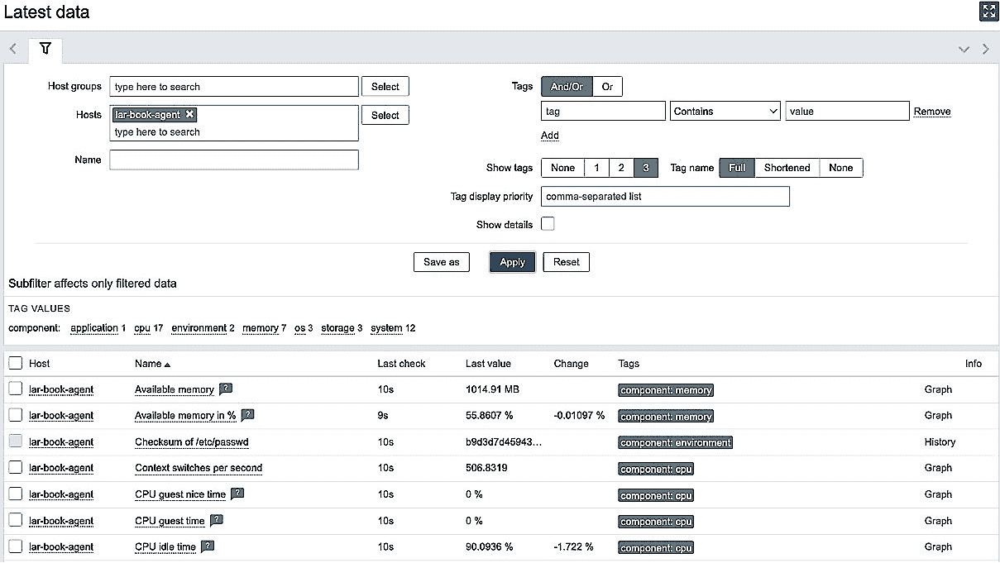
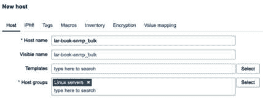
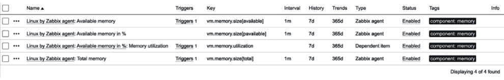
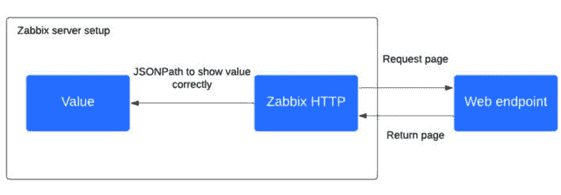

# 3

# 设置 Zabbix 监控

Zabbix 被设计为灵活的，应该能够监控你所需的几乎所有内容。在本章节中，我们将学习更多关于如何使用 Zabbix 构建各种监控选项。我们将逐个食谱地讲解它们，确保你能全面理解它们的工作原理。

我们将介绍以下不同监控类型的食谱：

+   设置 Zabbix 代理监控

+   使用旧方式进行 SNMP 监控

+   设置新的 SNMP 监控方式

+   创建 Zabbix 简单检查和 Zabbix trapper

+   使用计算项和依赖项

+   创建外部检查

+   设置 JMX 监控

+   设置数据库监控

+   设置 HTTP 代理监控

+   使用 Zabbix 浏览器项模拟 Web 用户

+   使用 Zabbix 预处理改变项值

# 技术要求

我们需要一台能够执行监控的 Zabbix 服务器，具有以下要求：

+   一台安装了 Zabbix 服务器的 Linux 发行版主机，例如 Rocky Linux 或 Ubuntu。然而，Debian、Alma Linux 等发行版也同样适用。

+   一个 MariaDB（MySQL）服务器用于监控——例如，在*第一章*中我们设置的 Zabbix 服务器数据库。

我将使用我们在上一章节中使用的相同服务器，但任何 Zabbix 服务器都适用。

# 设置 Zabbix 代理监控

从 Zabbix 5 版本开始，Zabbix 正式支持新的 Zabbix Agent 2。Zabbix Agent 2 带来了一些重大改进，甚至采用了另一种编程语言——Golang，而非 C。在本食谱中，我们将探讨如何使用 Zabbix Agent 2，并探索它带来的一些新功能。

## 准备工作

要开始使用 Zabbix Agent 2，我们需要做的就是在要监控的主机上安装它。确保你有一台空白的 **Red Hat Enterprise Linux**（**RHEL**）或 Ubuntu Linux 主机，准备好进行监控。

## 如何操作…

让我们学习如何安装 Zabbix Agent 2，然后继续使用它。

### 安装 Zabbix Agent 2

让我们从在要监控的 Linux 主机上安装 Zabbix Agent 2 开始。我将展示如何在 RHEL 和 Ubuntu 系统上进行安装：

1.  输入以下命令添加仓库。

    对于 RHEL 系统，命令如下：

    ```
    rpm -Uvh https://repo.zabbix.com/zabbix/7.0/rocky/9/x86_64/zabbix-release-7.0-2.el9.noarch.rpm
    ```

    对于 Ubuntu 系统，命令如下：

    ```
    wget https://repo.zabbix.com/zabbix/7.0/ubuntu/pool/main/z/zabbix-release/zabbix-release_7.0-1+ubuntu22.04_all.deb
    dpkg -i zabbix-release_7.0-1+ubuntu22.04_all.deb
    ```

1.  然后，输入以下命令安装 Zabbix Agent 2。

    这是 RHEL 系统的命令：

    ```
    dnf -y install zabbix-agent2
    ```

    这是 Ubuntu 系统的命令：

    ```
    apt install zabbix-agent2
    ```

恭喜——Zabbix Agent 2 现在已经安装并准备就绪！

重要提示

当向系统添加新仓库时，请务必查看 Zabbix 下载页面。你可以在这里找到适合你系统的最新仓库：[`www.zabbix.com/download`](https://www.zabbix.com/download)。

### 使用被动模式的 Zabbix 代理

让我们从构建一个带有被动检查的 Zabbix 代理开始：

1.  安装 Zabbix Agent 2 后，让我们打开 Zabbix 代理配置文件进行编辑：

    ```
    vim /etc/zabbix/zabbix_agent2.conf
    ```

    在这个文件中，我们可以编辑所有需要的 Zabbix 代理配置项，从服务器端进行配置。

1.  我们从编辑以下参数开始：

    ```
    Server=127.0.0.1
    Hostname=Zabbix server
    ```

1.  将 **Server** 的值更改为将监控此被动代理的 Zabbix 服务器的 IP 地址。将 **Hostname** 的值更改为被监控服务器的主机名。我们可以通过以下命令获取服务器的 IP 地址：

    ```
    ip addr
    ```

1.  现在，重新启动 Zabbix Agent 2 进程：

    ```
    systemctl enable zabbix-agent2
    systemctl restart zabbix-agent2
    ```

1.  接下来，前往 Zabbix 服务器的前端，并添加此主机进行监控。

1.  在 Zabbix 前端界面中，进入 **数据收集** | **主机**，然后点击右上角的 **创建主机**。

1.  要在 Zabbix 服务器中创建此主机，我们需要填写以下截图中显示的值：


图 3.1 – lar-book-agent 的 Zabbix 主机创建页面

需要添加以下内容：

+   **主机名**：用于识别主机（必须唯一）。

+   **主机组**：用于逻辑分组主机。

+   **接口**：用于在特定接口上监控此主机。没有接口意味着没有通信。如果我们不需要接口，在 Zabbix 7 中可以创建没有接口的主机。对于 Zabbix 代理监控的主机，需要一个代理接口。

1.  确保你在 **代理** 接口配置中添加了正确的 IP 地址。

1.  同样重要的是为此主机添加一个模板。在 Zabbix 7 中，这可以在同一个标签页上完成。由于这是一个由 Zabbix 代理监控的 Linux 服务器，因此让我们添加正确的开箱即用模板，如以下截图所示：


图 3.2 – lar-book-agent 的 Zabbix 主机模板页面

1.  点击蓝色的 **添加** 按钮完成创建此代理主机。现在你已经创建了这个主机，确保 **ZBX** 图标变为绿色，表示该主机已经启动并被被动 Zabbix 代理监控：


图 3.3 – lar-book-agent 的 Zabbix 配置主机页面

1.  由于我们已配置主机并添加了带有项目的模板，因此我们现在可以通过进入 **监控** | **主机** 并点击 **最新数据** 按钮来查看此主机的项目接收到的值。请注意，值可能需要大约 1 分钟才能显示：



图 3.4 – lar-book-agent 的 Zabbix 最新数据页面

### 使用 Zabbix 代理的主动模式

现在，让我们了解如何配置带有主动检查的 Zabbix 代理。我们需要在被监控的 Linux 服务器主机端更改一些值：

1.  从执行以下命令开始：

    ```
    vim /etc/zabbix/zabbix_agent2.conf
    ```

1.  现在，让我们编辑以下值，将此主机更改为主动代理：

    ```
    ServerActive=127.0.0.1
    ```

1.  将 **ServerActive** 的值更改为将监控此被动代理的 Zabbix 服务器的 IP 地址。然后，将 **Hostname** 的值更改为你的主机名。在我的例子中，这是 **lar-book-agent**：

    ```
    Hostname=lar-book-agent
    ```

重要提示

请记住，如果你正在使用多个 Zabbix 服务器或 Zabbix 代理（例如，在运行高可用性 Zabbix 服务器时），你需要在使用 **ServerActive** 参数时填写所有 Zabbix 服务器或 Zabbix 代理的 IP 地址。**高可用性** (**HA**) 节点由分号（**;**）分隔，而不同的 Zabbix 环境 IP 地址由逗号（**,**）分隔。

1.  现在，重启 Zabbix Agent 2 进程：

    ```
    systemctl restart zabbix-agent2
    ```

1.  接下来，转到 Zabbix 服务器的前端，添加另一个主机并选择一个模板，以进行主动检查，而不是被动检查。

1.  首先，让我们重命名我们的被动主机。为此，请在 Zabbix 前端中进入 **数据收集** | **主机**，然后点击我们刚创建的主机。将 **Host name** 更改如下：


图 3.5 – lar-book-agent_passive 的 Zabbix 主机配置页面

我们这样做是因为，对于主动 Zabbix 代理，Zabbix 代理配置文件中的主机名需要与我们的主机配置在 Zabbix 前端中的配置相匹配。对于被动代理，则不需要这样做。

1.  点击蓝色的 **更新** 按钮以保存更改。

1.  在 Zabbix 前端中，进入 **数据收集** | **主机**，然后点击右上角的 **创建主机**。

1.  现在，让我们创建主机，步骤如下：


图 3.6 – lar-book-agent 的 Zabbix 主机配置页面

1.  同时，确保你添加了正确的模板，名为 **Linux by Zabbix** **agent active**：


图 3.7 – lar-book-agent 的 Zabbix 主机模板页面

请注意，从 Zabbix 6.2 版本开始，**ZBX** 图标应变为绿色，表示这是一个主动代理。注意，当我们导航到 **监控** | **主机** 并查看 **最新数据** 时，我们可以看到我们的主动数据已被接收。

提示

正如你可能已经注意到的，Zabbix 代理可以同时以被动模式和主动模式运行。在创建自己的 Zabbix 代理模板时，请记住这一点，因为你可能希望将检查类型结合起来。最终，**Item** 类型将决定如何执行对代理的检查。

## 它是如何工作的…

现在，我们已经配置了 Zabbix 代理并知道它们应该如何设置，让我们看看不同模式是如何工作的。

### 被动代理

**被动代理**通过使用 Zabbix 代理从我们的主机收集数据来工作。每当主机上的一个项目达到其 *更新间隔* 时，Zabbix 服务器会询问 Zabbix 代理当前的值：


图 3.8 – 服务器与被动代理之间的通信示意图

被动代理在需要保持从 Zabbix 服务器或 Zabbix 代理端发起通信的环境中非常有效。例如，在有防火墙的情况下，防火墙仅允许外向流量，此时从 Zabbix 服务器或代理端来看，通信就受到限制。

### 主动代理

**主动代理**的工作方式是将数据从 Zabbix 代理发送到 Zabbix 服务器或 Zabbix 代理。每当代理上的某个项目达到更新间隔时，代理将收集该值并发送到服务器：


图 3.9 – 服务器与主动代理之间的通信示意图

主动代理在需要进行通信的环境中非常适用，尤其是在防火墙仅允许外向连接的情况下，从 Zabbix 代理端来看便是如此。许多环境采用这种方式，因为它可以缓解与监控主机相关的主要安全问题之一。与允许 Zabbix 服务器访问所有不同子网（这会带来更大的风险）不同，我们允许主机将数据发送到 Zabbix 服务器——即多个向一个发送，而不是一个向多个发送。

另一方面，使用 Zabbix 代理的主动模式也能提高效率。现在，大部分从 Zabbix 代理到 Zabbix 服务器的数据传输负载都转移到了 Zabbix 代理端。因为 Zabbix 代理的数量通常多于 Zabbix 服务器或代理的数量，所以将负载转移到代理端是一个很好的选择。

如前所述，我们可以同时使用两种类型的检查，这让我们有更大的自由度来配置所需的每种检查。在这种情况下，我们的设置将是这样的：


图 3.10 – 服务器与两种代理类型之间的通信示意图

在我们主要想被动监控的情况下，可能需要用到 Zabbix 代理的主动模式进行一些特定任务。例如，Zabbix 代理进行日志文件监控时必须使用主动 Zabbix 代理。在这种情况下，我们可以结合使用两种模式，并确保我们充分利用 Zabbix 代理提供的所有功能。

## 另见

Zabbix Agent 2 的背后有很多复杂的工作。如果你对 Zabbix Agent 2 的核心工作原理感兴趣，可以看看 Alexey Petrov 写的这篇有趣的博客文章：[`blog.zabbix.com/magic-of-new-zabbix-agent/8460/`](https://blog.zabbix.com/magic-of-new-zabbix-agent/8460/)。

# 使用旧方法进行 SNMP 监控

现在，让我们做一些我在使用 Zabbix 时最喜欢的事情：构建 SNMP 监控。我从事网络工程工作多年，曾使用 SNMP 监控监控各种网络设备。

请记住，尽管本教程会介绍如何使用传统方式进行 SNMP 监控，但它仍然是一个有效的选项。Zabbix 6.4 引入了一种全新的 SNMP 监控设置方式。新方式利用批量指标收集，对于 SNMP 设备和网络会话数量更加高效，因此在完成本教程后，查看这个新方法可能是个不错的选择。

## 准备就绪

要开始，我们需要前面教程中用到的两台 Linux 主机：

+   我们的 Zabbix 服务器主机

+   我们在前面的教程中使用的主机，通过 Zabbix 活动代理进行监控

## 如何操作…

通过 SNMP 拉取监控非常简单且功能强大。我们将从在监控的 Linux 主机上配置 SNMPv3 开始：

1.  我们首先通过执行以下命令在希望被 SNMP 监控的主机上安装 SNMP。

    对于基于 RHEL 的系统：

    ```
    dnf install net-snmp net-snmp-utils
    ```

    对于 Ubuntu 系统：

    ```
    apt install snmp snmpd libsnmp-dev
    ```

1.  现在，让我们创建新的 SNMPv3 用户，用来监控我们的主机。请注意，我们将使用不安全的密码，因此确保在生产环境中使用安全密码。执行以下命令：

    ```
    snmpd before executing this command. You can start it again after.This will create an SNMPv3 user with a username of `snmpv3user`, an authentication password of `my_authpass`, and a privilege password of `my_ privpass`.
    ```

1.  确保编辑 SNMP 配置文件，以便可以读取所有 SNMP 对象：

    ```
    vim /etc/snmp/snmpd.conf
    ```

1.  将以下行添加到现有的 **view systemview** 行。如果没有现有行，直接创建这一新行：

    ```
    view  systemview  included  .1
    ```

1.  现在，启用并启动 **snmpd** 守护进程，以便开始监控此服务器：

    ```
    systemctl enable snmpd
    systemctl start snmpd
    ```

    这就是在 Linux 主机端需要做的所有配置；现在我们可以去 Zabbix 前端配置我们的主机了。在 Zabbix 前端中，进入 **数据收集** | **主机**，然后点击右上角的 **创建主机**。

1.  填写主机配置页面：


图 3.11 – Zabbix 主机配置页面，适用于 lar-book-agent_snmp

1.  别忘了将 SNMP 接口的 IP 地址更改为你自己的值。

1.  确保添加正确的现成模板，如下图所示：


图 3.12 – 将 Linux 的 SNMP 模板添加到主机

提示

在从早期版本的 Zabbix 升级到 Zabbix 6 时，你不会得到所有新的现成模板。如果你觉得缺少了一些模板，可以从 Zabbix GitHub 仓库下载：[`git.zabbix.com/projects/ZBX/repos/zabbix/browse/templates`](https://git.zabbix.com/projects/ZBX/repos/zabbix/browse/templates)。

1.  我们在配置中使用了一些宏来表示用户名和密码。通过这些宏，我们可以用相同的凭据添加大量主机。例如，如果你有很多交换机使用相同的 SNMPv3 凭据，这非常有用。

    让我们在 **管理** | **宏** 中填写宏，如下所示：


图 3.13 – 带有 SNMP 宏的 Zabbix 全局宏页面

提示

Zabbix 6 的一个酷炫功能是能够通过使用**密文**宏类型在前端隐藏宏。请记住，**密文**类型的宏在 Zabbix 数据库中仍然是未加密的。因此，要实现完全加密的宏，我们需要类似 HashiCorp 或 CyberArk Vault 的工具。欲了解更多信息，请查看文档：[`www.zabbix.com/documentation/current/en/manual/config/secrets`](https://www.zabbix.com/documentation/current/en/manual/config/secrets)。

1.  使用下拉菜单将**{$SNMPV3_AUTH}**和**{$SNMPV3_PRIV}**更改为**密文**：


图 3.14 – Zabbix 密文用于隐藏敏感（认证）数据

1.  现在，点击**更新**应用这些更改后，我们应该能够通过 SNMPv3 监控我们的 Linux 服务器。让我们进入**监控** | **主机**并检查我们新主机的**最新数据**页面：


图 3.15 – SNMP – lar-book-agent_snmp 的最新数据页面

请注意，数据可能需要约 1 分钟才能显示在这里。

提示

在处理宏时，有三个级别，按级联顺序排列：全局、模板和主机级宏。在处理全局级宏时，请记住，它们不会随模板或主机一起导出。在大多数情况下，您应该使用模板级和主机级宏，以保持导出与 Zabbix 的全局设置独立。

## 它是如何工作的…

当我们创建主机时，如*步骤 4*所示，Zabbix 使用 SNMP 轮询该主机。像这样轮询 SNMP 会使用 SNMP OID。例如，当我们轮询`1.3.6.1.4.1.2021.4.6.0`时，该值会返回到 Zabbix 服务器：


图 3.16 – 显示 Zabbix 服务器与 SNMP 主机之间通信的示意图

OID 就像是我们度量标准的位置地址（或路径）。通过请求 OID，就可以请求该度量标准。

SNMPv3 为这个过程增加了认证和加密，确保当 Zabbix 服务器请求信息时，该请求首先被加密，数据也会被加密后发送回来。

我们还在配置主机时加入了使用**组合请求**的选项。组合请求在同一流中请求多个 OID，这使得它成为进行 SNMP 请求的首选方法，因为它更高效。只有在主机不支持**组合请求**时才禁用此功能。更好的方法是使用 SNMP 批量请求，我们将在下一个配方中讨论这一点。

最后，让我们来看看 SNMP OID，这是我们 SNMP 请求中最重要的部分。OID 以树状结构工作，这意味着点后面的每个数字都可以包含另一个值。例如，让我们看看这个用于我们主机的 OID：

```
1.3.6.1.4.1.2021.4 = UCD-SNMP-MIB::memory
```

如果我们使用 SNMPwalk CLI 工具或我们的 Zabbix 服务器轮询该 OID，我们将会收到多个 OID 的返回：

```
.1.3.6.1.4.1.2021.4.1.0 = INTEGER: 0
.1.3.6.1.4.1.2021.4.2.0 = STRING: swap
.1.3.6.1.4.1.2021.4.3.0 = INTEGER: 1679356 kB
.1.3.6.1.4.1.2021.4.4.0 = INTEGER: 1674464 kB
.1.3.6.1.4.1.2021.4.5.0 = INTEGER: 1872872 kB
.1.3.6.1.4.1.2021.4.6.0 = INTEGER: 184068 kB
```

这包括我们的 `1.3.6.1.4.1.2021.4.6.0` OID，其值包含我们的空闲内存。这就是 SNMP 的构建方式，像一棵树一样。

# 设置新的 SNMP 监视方式

从 Zabbix 6.4 开始，SNMP 监视已经进行了全面的更新，引入了一种新的构建 SNMP 监视的方式。旧方法仍然可用并且有效，但所有开箱即用的监视都将进行更新以适应新方法。

新方法将利用 SNMP 批量查询，使其更加高效。因此，在这个示例中，我们将看看如何使用新的方式构建 SNMP 监视。

## 准备工作

要开始，我们需要这两台 Linux 主机：

+   我们的 Zabbix 服务器环境

+   任何运行 SNMP 服务器的 Linux 主机

## 如何做……

让我们高效率地开始构建一些批量 SNMP 查询。首先要做的是准备您的主机：

1.  首先，登录到您的 Zabbix 服务器 CLI。我们将开始安装一些额外的工具，以便更轻松地构建 SNMP 监视。

    对于基于 RHEL 的系统：

    ```
    dnf install net-snmp-utils
    apt install libsnmp-dev
    ```

1.  接着，在我们希望监视的 Linux 主机上，我们必须安装 SNMP 服务器。

    对于基于 RHEL 的系统：

    ```
    dnf install net-snmp net-snmp-utils
    ```

    对于 Ubuntu 系统：

    ```
    apt install snmp snmpd libsnmp-dev
    ```

1.  现在，让我们在我们想要监视的主机上配置一个新的 SNMPv3 用户，并设置服务器以便可以查询信息：

    ```
    snmpv3user, an authentication password of my_authpass, and a privilege password of my_ privpass. Please make sure you use secure passwords in your production environments!
    ```

1.  确保您编辑 SNMP 配置文件以便可以读取所有 SNMP 对象：

    ```
    vim /etc/snmp/snmpd.conf
    ```

1.  将以下行添加到其余的 **视图** **systemview** 行中：

    ```
    view  systemview  included  .1
    ```

1.  现在，启用并启动 **snmpd** 守护进程以便可以开始监视此服务器：

    ```
    systemctl enable snmpd
    systemctl start snmpd
    ```

    这是 Linux 主机端需要完成的所有工作；现在我们可以前往 Zabbix 前端配置我们的主机。

1.  前往 Zabbix 前端的 **数据收集** | **主机**，并点击右上角的 **创建主机**。我们将使用以下信息创建一个新主机：



图 3.17 – lar-book-snmp_bulk 的 Zabbix 主机配置页面

1.  在添加主机之前，请确保您点击 **接口** 部分中的小点下划线 **添加** 按钮，并选择 **SNMP**：


图 3.18 – lar-book-snmp_bulk 的 Zabbix 接口配置

确保为您要监视的主机填写正确的 IP 地址和凭据。

1.  切换到 **宏** 标签，并添加以下信息：


图 3.19 – lar-book-snmp_bulk 的 Zabbix 主机配置宏标签

1.  我们还要前往 **数值映射** 并创建以下值映射。我们稍后会用到这个：


图 3.20 – lar-book-snmp_bulk 的 Zabbix 主机配置数值映射标签

1.  现在，你可以点击页面底部的大 **添加** 按钮，主机将被创建。

1.  此时，我们必须开始构建我们的 SNMP 检查。但在此之前，我们应该决定要构建哪些检查。让我们从 Zabbix 服务器的 Linux CLI 进行一个快速的 SNMP walk：

    ```
    snmpwalk -On -v3  -l authPriv -u snmpv3user -a SHA -A "my_authpass"  -x AES -X "my_privpass" 192.168.1.86 .1.3.6.1.2.1.2.2.1.2
    ```

    这个 SNMP walk 将会显示类似以下的输出：

    ```
    .1.3.6.1.2.1.2.2.1.2.1 = STRING: lo
    .1.3.6.1.2.1.2.2.1.2.ens192 interface. Remember that the index for the ens192 interface is the number 2; we will need it later.To add all the interface information in bulk to our Zabbix environment, I will use a lower OID. However, note that `.1.3.6.1.2.1.2.2.1` contains all our interface information.
    ```

1.  测试所有接口信息的 SNMP walk：

    ```
    snmpwalk -On -v3  -l authPriv -u snmpv3user -a SHA -A "my_authpass"  -x AES -X "my_privpass" 192.168.1.86 .1.3.6.1.2.1.2.2.1
    ```

    现在，你应该能看到更多的输出。

1.  让我们通过进入 **数据收集** | **主机**，选择 **lar-book-snmp_bulk** 主机，进入 **项目**，然后返回 Zabbix 前端。

1.  在右上角，点击 **创建项目** 并添加以下信息：


图 3.21 – Zabbix 项目配置 for ifTable.walk

1.  别忘了切换到 **标签** 标签页并添加以下内容：


图 3.22 – Zabbix 项目配置 ifTable.walk 标签页

1.  点击窗口底部的大 **添加** 按钮将此项目添加到主机中。

1.  这个项目现在将批量收集我们的 SNMP 数据。此时，我们可以创建依赖项来获取特定的值。你应该已经回到主机的 **项目** 页面，在这里我们可以再次点击 **创建项目**。

1.  我的接口名为 **ens192**，所以让我们获取该接口的操作状态。添加以下信息：

![图 3.23 – Zabbix 项目配置 for ifOperStatus[ens192]](img/B19803_03_23.jpg)

图 3.23 – Zabbix 项目配置 for ifOperStatus[ens192]

1.  别忘了切换到 **标签** 标签页并添加以下内容：

![图 3.24 – Zabbix 项目配置 ifOperStatus[ens192] 标签页](img/B19803_03_24.jpg)

图 3.24 – Zabbix 项目配置 ifOperStatus[ens192] 标签页

1.  最后但同样重要的是，我们需要进入 **预处理** 标签页。在这里我们将决定从批量中提取哪个值。还记得 *第 12 步* 中的索引吗？现在让我们使用它，通过添加接口操作状态的 OID（**1.3.6.1.2.1.2.2.1.8**）以及索引 **2**：

![图 3.25 – Zabbix 项目配置 ifOperStatus[ens192] 预处理标签页](img/B19803_03_25.jpg)

图 3.25 – Zabbix 项目配置 ifOperStatus[ens192] 预处理标签页

1.  现在，点击页面底部的大 **添加** 按钮，看看是否一切正常。

1.  进入 **监控** | **最新数据**，找到你的主机 —— 即 **lar-book-snmp_bulk**：


图 3.26 – Zabbix lar-book-snmp_bulk 在监控 | 最新数据下

如你所见，我们现在正在批量收集 SNMP 信息，然后从这些批量信息中收集单个值。

重要说明

始终建议在收集批量值的项目上使用 **不保留历史记录** 选项。这样，我们就不会无缘无故地存储重复值。在你完成构建所有 SNMP 项目后，别忘了进行这一更改。

## 它是如何工作的……

新的 SNMP walk 一开始可能让人有些困惑。我们为什么需要这个新变化？在 Zabbix 6.4 之前的内部工作方式是，它会单独收集每个 SNMP OID。虽然有一个智能机制可以将请求组合在一起以提高效率，但它从未正式作为批量请求（尽管前端是这么称呼的）。

现在，使用新的 `walk[]` 项键，我们在一个单一的 SNMP `GetBulk` 请求中收集所有 SNMP 值。这使得整个过程更加高效，并且减少了对 SNMP 设备的压力。

Zabbix 7.0 中还新增了以下三个轮询器：

+   代理轮询器

+   HTTP 代理轮询器

+   SNMP 轮询器（用于 **walk[OID]** 和 **get[OID]** 项目）

这些进程现在是异步执行的。这对使用 `walk[]` 或 `get[]` 的 SNMP 检查意味着它们可以同时执行多个（项目）检查。在 Zabbix 的旧版本中，这些轮询器每次只能执行一个检查。

仍然可以通过 **StartSNMPPollers** 添加多个这样的进程，例如，但它的工作方式有所不同。它们每个轮询器最多执行 1,000 次检查，这可以通过 **MaxConcurrentChecksPerPoller** 参数进行配置。

那么，我们使用了什么？我们从一个简单的请求开始，即获取 SNMP 接口的 OID 下的所有值——也就是 `.1.3.6.1.2.1.2.2.1`。这包含了我们所有 SNMP 接口的信息，如下图所示：


图 3.27 – Zabbix lar-book-snmp_bulk 原始 SNMP walk 在监控 | 最新数据

之后，我们从收集到的大量数据中提取了一个单一值，经过预处理步骤：


图 3.28 – Zabbix lar-book-snmp_bulk SNMP walk 值预处理

我们可以通过手动提取已经完成的 SNMP walk 中的任何 OID。如果你有大量来自 SNMP walk 项目的信息，但只需要其中少数几个静态值，这个方法非常有用。

当我们收集大量信息并开始使用 LLD 规则自动化任务时，或者当我们仍然需要获取某些特定的值时，这一点尤为明显，这些值可能不适合 LLD。所有这些信息可以通过一次 SNMP 设备调用收集，并随后拆分成 LLD 规则和单独的项目。

我们将在*第七章*中继续处理这种新的监控方式，*使用发现功能自动创建*，该章节是*使用 Zabbix SNMP 低级发现新方法*教程的一部分。

# 创建 Zabbix 简单检查和 Zabbix trapper

在这个教程中，我们将介绍两个检查，它们可以帮助你构建更为自定义的配置。Zabbix 简单检查为你提供了一种轻松监控特定数据的方法，而 Zabbix trapper 与 Zabbix sender 配合使用，将主机的数据发送到服务器，为你提供了一些脚本选项。让我们开始吧。

## 准备工作

要创建这些检查，我们需要一台 Zabbix 服务器和一台 Linux 主机来进行监控。我们可以使用之前教程中的带有 Zabbix 代理和 SNMP 监控的主机。

请注意，我们在这些检查中不需要 Zabbix 代理。

## 如何操作…

正如名称所示，使用简单检查非常简单。那我们开始吧。

### 创建简单检查

我们将创建一个简单的检查，用于监控某服务是否正在运行，并在某端口上接受 TCP 连接：

1.  为了完成这个任务，我们需要在 Zabbix 前端创建一个新主机。进入 Zabbix 前端的**数据收集** | **主机**，然后点击右上角的**创建主机**按钮。

1.  创建一个具有以下设置的主机：


图 3.29 – lar-book-agent_simple 主机的 Zabbix 主机配置页面

1.  现在，进入**数据收集** | **主机**，然后进入新创建主机的**项**页面。我们想要通过点击**创建项**按钮来创建一个新项。

    我们必须创建一个新项，填写以下值。完成后，点击页面底部的**添加**按钮：


图 3.30 – lar-book-agent_simple 主机上端口 22 检查的 Zabbix 项配置页面

1.  请确保你也为该项添加标签，因为我们在多个地方需要它来过滤和查找我们的项。在此设置：


图 3.31 – Zabbix SSH 端口项，标签选项卡

重要提示

我们在这里添加的是**net.tcp.services[ssh,,22]** 项键。此处的端口是可选的，因为如果需要，我们可以指定使用不同端口的 SSH 服务。

1.  现在，我们应该能够在**最新数据**屏幕中查看服务器是否接受端口**22**上的 SSH 连接。进入**监控** | **主机**，并检查我们的新值：


图 3.32 – lar-book-agent_simple 主机端口 22 检查的 Zabbix 最新数据页面

1.  这里还有一个问题。如你所见，目前我们没有设置值映射。此处，**最后值**只是显示 **1** 或 **0**，让人难以区分其含义。要更改此设置，请返回到 **数据采集** | **主机**，然后编辑 **lar-book-agent_simple** 主机。

1.  点击 **值映射** 标签页，然后点击小的 **添加** 按钮以添加一个值映射，如下所示：


图 3.33 – lar-book-agent_simple，值映射窗口

1.  点击蓝色的 **添加** 按钮，然后点击蓝色的 **更新** 按钮。

1.  然后，在完整的 **数据采集** | **主机** 列表中，导航到我们的 **lar-book-agent_simple** 主机，并点击该主机的 **项**。

1.  编辑 **检查端口 22 是否可用** 项，并添加以下值映射：


图 3.34 – lar-book-agent_simple，编辑项窗口

这就是在 Zabbix 中创建简单检查的全部内容。最新数据页面现在应该像这样：


图 3.35 – 我们的端口 22 检查项的最新数据页面

如你所见，现在有一个人类可读的值显示 **Up** 或 **Down**，为我们提供了一个更易理解的人类可读条目。现在，让我们看看 Zabbix trapper 项。

### 创建 trapper

一旦我们进行更高级的设置，使用 Zabbix trapper 项目可以做一些很酷的事情。但现在，让我们在 `lar-book-agent_simple` 主机上创建一个项：

1.  转到 **数据采集** | **主机**，点击该主机，然后进入 **项**。我们想在此创建一个新项，点击 **创建** **项** 按钮。

    所以，让我们创建以下项并点击 **添加** 按钮：


图 3.36 – Zabbix 项目 trap 接收器配置屏幕（lar-book-agent_simple）

1.  确保你也进入 **标签** 标签页并添加一个标签。我们稍后会用到它来进行过滤：


图 3.37 – Zabbix 项目 trap 接收器标签配置屏幕（lar-book-agent_simple）

1.  如果我们进入被监控服务器的 CLI，可以安装 Zabbix sender。

    对于基于 RHEL 的系统，运行以下命令：

    ```
    dnf -y install zabbix-sender
    ```

    对于 Ubuntu 系统，运行以下命令：

    ```
    apt install zabbix-sender
    ```

1.  安装完成后，我们可以使用 Zabbix sender 向服务器发送一些信息（确保使用 Zabbix 服务器的 IP 地址，并在使用 **-****z** 选项时进行指定）：

    ```
    zabbix_sender -z 10.16.16.152 -s "lar-book-agent_simple" -k trap -o "Let's test this book trapper"
    ```

    现在，我们应该能够看到我们被监控的主机是否发送了 Zabbix trap，并且 Zabbix 服务器已接收此 trap 进行处理。

1.  转到 **监控** | **主机**，并检查 **最新数据** 屏幕，查看我们新的值：


图 3.38 – Zabbix 最新数据页面，针对 lar-book-agent_simple 的项目陷阱接收器

就是这样——我们的 Zabbix 陷阱出现在了 Zabbix 前端。

## 它是如何工作的…

现在我们已经构建了新的项目，让我们通过深入了解 Zabbix 简单检查和陷阱的理论部分来看看它们是如何工作的。

### 简单检查

Zabbix 简单检查是一些内置的检查项，用于监控特定的值。Zabbix 文档中提供了所有可用简单检查的列表和说明：[`www.zabbix.com/documentation/current/manual/config/items/itemtypes/simple_checks`](https://www.zabbix.com/documentation/current/manual/config/items/itemtypes/simple_checks)。

所有这些检查都是由 Zabbix 服务器执行的，用于从被监控主机收集数据。例如，当我们进行 Zabbix 简单检查以检测端口是否开放时，Zabbix 服务器会请求是否能访问该端口，并将其转化为我们可以在 Zabbix 前端看到的状态。

这意味着，如果你的被监控主机的防火墙阻止了 Zabbix 服务器访问端口 `22`，我们将看到服务 *宕机* 的状态。然而，这并不一定意味着服务器上没有运行 SSH；它只是意味着从 Zabbix 服务器或代理的角度看，SSH 服务是宕机的：


图 3.39 – Zabbix 服务器与主机通信示意图

提示

请记住，使用简单检查依赖于外部因素，如被监控主机上的防火墙设置。在构建简单检查时，确保检查这些因素。

还有一点需要注意。在 Zabbix 6.4 中，增加了无需主机接口即可添加简单检查的功能。这意味着你可以通过在项目键中将连接详情作为参数来直接添加项目，而不必选择接口。

### 陷阱接收器

在使用 Zabbix 发送器时，我们做的恰恰是大多数检查的相反操作——我们在 Zabbix 服务器上构建一个项目，以便捕获陷阱项目。这使得我们可以构建一些自定义检查，从被监控的主机向 Zabbix 服务器发送数据：


图 3.40 – Zabbix 服务器陷阱接收器示意图

比如说，我们想要构建一个自定义的 Python 脚本，在脚本运行结束时将输出发送到 Zabbix 服务器。我们可以让 Python 使用 Zabbix 发送器工具发送这些数据，这样就可以在 Zabbix 服务器上处理这些数据。

这个过程被一些软件公司用来将他们的软件完全集成到 Zabbix 中。如你所见，我们可以通过 Zabbix 捕获器大大扩展我们的选项，并进一步定制我们的 Zabbix 服务器。令人惊讶的是，这也适用于低级发现，只要我们发送正确的数据格式（JSON）。

# 使用计算项和依赖项

计算项和依赖项在 Zabbix 中用于从现有值中生成额外的值。有时，我们已经收集了某个值，并且需要对该项创建的值做更多操作。我们可以通过使用计算项和依赖项来做到这一点。

## 准备工作

为了使用计算项和依赖项，我们需要前面章节中的 Zabbix 服务器和被监控的主机。我们将把项目添加到`lar-book-agent_passive`主机和我们的 Zabbix 服务器（或任何 MySQL 服务器）主机，这样我们就有一些现成的项目可用于计算和依赖。

## 如何操作……

让我们看看如何扩展我们的项目。我们将从查看计算项开始。

### 使用计算项

按照以下步骤操作：

1.  让我们通过进入**数据收集** | **主机**，点击我们的**lar-book-agent_passive**主机的**项目**区域来导航到我们的主机配置。在**名称**过滤字段中输入**内存**，你将得到以下输出：



图 3.41 – Zabbix 项目页面，lar-book-agent_passive

1.  现在，我们可以创建一个计算项，它将显示我们 15 分钟内的平均内存使用情况。我们可以使用这个值来确定在那个期间内我们的主机有多忙，而无需查看图表。

1.  让我们点击**创建项目**按钮，开始创建我们的新计算项。我们希望我们的项目具有以下值：


图 3.42 – Zabbix 项目配置页面，平均内存使用情况

1.  确保你也导航到**标签**标签页，并添加一个我们稍后用于过滤的标签：


图 3.43 – 计算项 标签标签页

1.  现在，如果我们检查**监控** | **主机**页面并选择**最新数据**，我们可以查看我们的值。确保你在**名称**字段中过滤**内存**，以便查看正确的值：


图 3.44 – Zabbix 最新数据页面，lar-book-agent_passive 内存项

如我们所见，我们正在计算新创建项目的 15 分钟内存使用率的平均值。

### 使用依赖项

现在是时候创建我们的第一个依赖项了。我将使用 `lar-book-rocky` 主机或我们的（默认情况下命名为）**Zabbix 服务器**主机，但任何 MySQL 数据库服务器都应该能工作。假设我们想从 MySQL 数据库一次性请求一些变量。在这种情况下，我们可以在第一个项上创建依赖项来进一步处理数据：

1.  让我们从创建主检查开始。进入 **数据收集** | **主机**，选择我们的主机，然后点击 **创建项** 按钮，开始创建我们的第一个新项。我们希望这个项包含以下变量：


图 3.45 – Zabbix 项目配置页面，数据库状态

这个项是一个 SSH 检查，使用 SSH 登录到我们的 Zabbix 服务器主机，然后执行在 **执行的脚本** 字段中输入的代码。此代码将登录到我们的 MariaDB 数据库，并打印其状态。确保正确输入你的凭证。

提示

不推荐在 MySQL 命令中使用明文凭证，而应该在 **执行的脚本** 字段中使用宏。这样，你可以使用 **密文文本** 宏类型，确保没有人能从前端读取你的密码。

1.  在保存这个新项之前，请确保也添加一个标签，像这样：


图 3.46 – Zabbix 主项配置页面，标签选项卡

1.  现在，点击蓝色的 **添加** 按钮保存这个新项。

1.  返回到项目列表，点击这个主机的主机名，然后选择 **宏**。在 **值** 下创建一个新的 **{$USERNAME}** 和 **{$PASSWORD}** 宏，填入你的 SSH 用户名和密码。

1.  接下来，进入 **监控** | **最新数据**，查看我们新检查项的数据。应该会有一长串 MariaDB 的值。如果是这样，我们可以继续创建依赖项。

1.  要创建依赖项，请导航到 **数据收集** | **主机**，选择我们的主机，然后点击 **创建项** 按钮。我们希望这个项包含以下变量：


图 3.47 – Zabbix 项目配置页面，MariaDB 中止客户端

1.  确保添加以下标签：


图 3.48 – Zabbix 依赖项配置页面，标签选项卡

1.  为这个项添加预处理非常重要，否则我们将只是获取与主项相同的数据。所以，让我们添加以下内容：


图 3.49 – Zabbix 项目预处理页面，MariaDB 中止客户端

添加了预处理后，结果将是我们 MariaDB 实例中已中止的客户端数量：


图 3.50 – Zabbix 最新数据页面，MariaDB 终止的客户端

如你所见，使用依赖项，我们可以利用其他 Zabbix 项中已有的信息，并将其拆分为依赖项。

## 它是如何工作的…

我们在*如何操作…*部分中处理的计算项和依赖项可能相当复杂，因此让我们来看看它们是如何工作的。

### 计算项

使用计算项是从现有数据中获取更多统计信息的好方法。有时，你只需要将多个项合并为一个特定的值。

我们刚才做的操作是通过每隔 15 分钟获取一个项的多个值并计算其平均值，具体如下：


图 3.51 – Zabbix 依赖项示意图

我们每 15 分钟获取这些值并计算平均值。这为我们提供了一个很好的指示，告诉我们在设定的时间段内做了什么。

### 依赖项

依赖项通过从主项获取数据并将其处理为其他数据来工作。这样，我们可以结构化我们的数据，并保持所有这些项的检查间隔相同，因为依赖项会按照主项的更新间隔接收数据。这意味着依赖项没有（也不需要）更新间隔：


图 3.52 – 依赖项示意图

如我们所见，依赖项充当复制器，我们可以使用预处理选项来获取特定值。请注意，必须使用预处理来提取主项的数据，因为如果没有预处理，我们的数据将与主项相同。

提示

通常，我们不需要将主项保存在数据库中，因为我们已经在依赖项中拥有该信息。当我们不希望保存主项时，我们可以简单地选择**不保存历史**选项，这样就可以节省一些存储空间。

# 创建外部检查

为了进一步扩展我们的 Zabbix 功能，我们可以使用自定义脚本，这些脚本可以作为 Zabbix 外部检查执行。并非我们想要监控的所有内容在 Zabbix 中都是标准的，尽管有很多是。总会有些东西可能缺失，外部检查正是绕过这些问题的一种方式。

## 准备工作

在这个方案中，我们只需要我们的 Zabbix 服务器。我们可以在我们的`lar-book-rocky`主机上创建一个项，它是我们的 Zabbix 服务器监控的主机。

## 如何操作…

按照以下步骤操作：

1.  首先，让我们确保 Zabbix 服务器配置正确。请在 Zabbix 服务器 CLI 中执行以下操作：

    ```
    cat /etc/zabbix/zabbix_server.conf | grep ExternalScripts=
    ```

1.  这应该会显示出我们放置 Zabbix 外部检查所使用脚本的路径。默认情况下，这是**/usr/lib/zabbix/ externalscripts/**。让我们在这个文件夹中使用以下命令创建一个名为**test_external**的新脚本：

    ```
    vim /usr/lib/zabbix/externalscripts/test_external
    ```

    将以下代码添加到此文件并保存：

    ```
    #!/bin/bash
    echo $1
    ```

1.  确保我们的 Zabbix 服务器可以执行脚本，通过为文件添加正确的权限来实现。Linux 服务器上的**zabbix**用户需要能够访问并执行该文件：

    ```
    chmod +x /usr/lib/zabbix/externalscripts/test_external
    chown zabbix:zabbix /usr/lib/zabbix/externalscripts/test_external
    ```

1.  现在，我们准备去我们的主机上创建一个新项。导航到**数据收集** | **主机**，选择我们的主机**lar-book-rocky**，然后点击**创建项**按钮。我们希望此项按如下方式创建：


图 3.53 – Zabbix 项目配置页面

1.  现在我们已经添加了这个新项，让我们导航到**监控** | **主机**并检查我们主机的**最新数据**页面。我们的**Test**变量应该会由脚本返回为 Zabbix 中的**最后值**，如下截图所示：


图 3.54 – Zabbix 最新数据页面

提示

在前端使用宏作为变量，将数据从前端发送到脚本中。通过这种方式，您可以进一步自动化检查，以增强外部检查。

## 工作原理…

外部检查看起来有一个陡峭的学习曲线，但从 Zabbix 方面来看它们相当简单。我们所要做的只是执行一个外部脚本，此时我们将收到标准的结果输出（`STDOUT`）和错误（`STDERR`）：


图 3.55 – Zabbix 服务器外部脚本通信图

在我们的示例中，我们向脚本发送了一个值`Test`，然后脚本将其回显为`$1`。

当你熟悉像 Python 这样的编程语言时，你可以利用这个功能在现有的 Zabbix 功能基础上进行更多扩展——这是一个简单而强大的工具，易于使用。

# 设置 JMX 监控

Zabbix 内置了 JMX 监控功能，使我们可以监控 Java 应用程序。在本节中，我们将学习如何使用 Zabbix JMX 监控 Apache Tomcat，从而了解这种监控选项的具体内容。

## 准备工作

为了准备好本节内容，我们需要一个 Zabbix 服务器来监控我们的 JMX 应用程序。

我在本节中使用的是一台 CentOS 7 机器，并安装了 Tomcat。由于软件包依赖关系，使用 Tomcat 在较新的 CentOS 版本上可能会很棘手，因此我建议在本例中使用 CentOS 7。在安装 Tomcat 后，您可以将以下内容添加到配置文件中，使其能够正常工作：

```
JAVA_OPTS="-Djava.rmi.server.hostname=10.16.16.155
-Dcom.sun.management.jmxremote
-Dcom.sun.management.jmxremote.port=12345
-Dcom.sun.management.jmxremote.authenticate=false
-Dcom.sun.management.jmxremote.ssl=false"
```

如果您想在生产环境中设置 JMX 监控，可以使用您可能已经在该环境中设置的配置。只需相应地更改端口和 IP 地址即可。

## 如何操作…

要设置 JMX 监控，我们将向 Zabbix 服务器添加一个主机，用来监控我们的 Apache Tomcat 安装。但首先，我们需要在`/etc/zabbix/zabbix_server.conf`文件中添加一些设置：

1.  让我们通过登录到 Zabbix 服务器并执行以下命令来编辑 **zabbix_server.conf** 文件：

    ```
    vim /etc/zabbix/zabbix_server.conf
    ```

1.  现在，我们需要在该文件中添加以下行：

    ```
    JavaGateway=127.0.0.1
    StartJavaPollers=5
    ```

提示

你可以将 Java 网关安装在与 Zabbix 分开的主机上。这样，你可以分担负载并进行更多的扩展。只需将其安装在一个单独的主机上，并将该主机的 IP 地址添加到 **JavaGateway** 参数中。只要你的 Zabbix 服务器或代理能够通过网络在端口 **10052** 上访问网关，应该就能正常工作。在本例中我们不会这样做，因此保持 Java 网关设置在 Zabbix 服务器主机上。

1.  我们还需要在 Zabbix 服务器上安装 **zabbix-java-gateway** 应用程序，使用以下命令：

    基于 RHEL 的系统：

    ```
    dnf install zabbix-java-gateway
    systemctl enable zabbix-java-gateway
    systemctl start zabbix-java-gateway
    systemctl restart zabbix-server
    ```

    Ubuntu 系统：

    ```
    apt install zabbix-java-gateway
    systemctl enable zabbix-java-gateway
    systemctl start zabbix-java-gateway
    systemctl restart zabbix-server
    ```

    这就是我们在服务器端需要做的所有工作，以使 JMX 监控正常运行。Zabbix 默认不包含这些设置，因此我们需要将相应的文本添加到文件中，并安装应用程序。

1.  要开始监控我们的 JMX 主机，进入 Zabbix 前端的 **数据收集** | **主机**，然后点击右上角的 **创建主机**。

    添加一个主机，使用以下设置：


图 3.56 – Zabbix 项目配置页面

1.  完成后，我们的 JMX 图标应该变成绿色；让我们在 **监控** | **主机** 中检查一下。它应该是这样的：


图 3.57 – 监控 | 主机

1.  如果我们点击新添加的 JMX 监控主机的 **最新数据**，我们应该也能看到传入的数据。查看一下，它应该返回像这样的统计信息：


图 3.58 – Zabbix 最新数据页面

## 工作原理……

Zabbix 利用 Java 网关，Java 网关可以托管在 Zabbix 服务器本身上，或者托管在另一台服务器（代理）上，以监控 JMX 应用程序：


图 3.59 – Zabbix 服务器与 Java 之间的通信图

Zabbix 会轮询 Java 网关，而 Java 网关则与我们的 JMX 应用程序进行通信，正如在我们的例子中与 Tomcat 的交互一样。然后，数据通过相同的路径返回，我们可以在 Zabbix 服务器上看到这些数据。

## 另见

有很多应用程序可以通过 Zabbix JMX 进行监控。请查看 Zabbix 监控和集成页面，了解更多 Zabbix JMX 监控的用途：[`www.zabbix.com/integrations/jmx`](https://www.zabbix.com/integrations/jmx)。

# 设置数据库监控

数据库对许多工程师来说就像一个黑洞；数据被写入其中，并且对这些数据进行某些处理。但如果你想了解更多关于数据库健康状况的信息呢？这就是 Zabbix 数据库监控的用武之地 —— 我们可以用它来监控数据库的健康状况。

## 准备工作

为了方便，在本食谱中，我们将监控 Zabbix 数据库。这意味着我们所需的仅仅是已安装 Zabbix 服务器和其上的数据库。在本示例中，我们将使用 MariaDB，因此，如果你有 PostgreSQL 设置，请确保在 Linux 主机上安装 MariaDB 实例（虽然如果更改一些 ODBC 参数， PostgreSQL 也可以创建类似的设置）。

## 如何操作…

在开始配置项目之前，我们需要在服务器的 CLI 端做一些准备工作：

1.  让我们从安装服务器上所需的模块开始。

    基于 RHEL 的系统：

    ```
    dnf install unixODBC mariadb-connector-odbc
    ```

    Ubuntu 系统：

    ```
    apt install odbc-mariadb unixodbc unixodbc-dev odbcinst
    ```

1.  现在，让我们验证我们的 **开放数据库连接**（**ODBC**）配置文件是否存在：

    ```
    odbcinst -j
    ```

    你的输出应类似于以下内容：

    ```
    unixODBC 2.3.7
    DRIVERS............: /etc/odbcinst.ini
    SYSTEM DATA SOURCES: /etc/odbc.ini
    FILE DATA SOURCES..: /etc/ODBCDataSources
    USER DATA SOURCES..: /root/.odbc.ini
    SQLULEN Size.......: 8
    SQLLEN Size........: 8
    SQLSETPOSIROW Size.: 8
    ```

1.  如果输出正确，我们可以进入 Linux CLI，继续编辑 **odbc.ini** 以便连接到我们的数据库：

    ```
    vim /etc/odbc.ini
    ```

    现在，填写你的 Zabbix 数据库信息。它应该是这样的：

    ```
    [book]
    Description = MySQL book test database
    Driver      = MariaDB
    Server      = 127.0.0.1
    Port        = 3306
    Database    = zabbix
    ```

1.  让我们也检查一下我们的驱动程序是否存在：

    ```
    vim /etc/odbc.ini
    ```

1.  你应该看到驱动程序：

    ```
    # Driver from the mariadb-connector-odbc package
    # Setup from the unixODBC package
    [MariaDB]
    Description     = ODBC for MariaDB
    Driver          = /usr/lib/libmaodbc.so
    Driver64        = /usr/lib64/libmaodbc.so
    FileUsage       = 1
    ```

1.  现在，让我们通过执行以下命令来测试我们的连接是否按预期工作：

    ```
    Connected; if you don’t, check your configuration files and try again.
    ```

1.  现在，让我们进入 Zabbix 前端，配置我们的第一个数据库检查。导航到 **数据采集** | **主机**，然后点击 **lar-book-rocky** 主机；请注意，它可能仍然叫做 **Zabbix server**。接下来，进入 **项目**，我们要通过点击 **创建** **项目** 按钮来创建一个新项目。

提示

如果你还没有这么做，一个保持 Zabbix 结构化的好方法是将 Zabbix 中的所有主机名设置为实际服务器的主机名。将前端中的默认 **Zabbix server** 主机重命名为你服务器的名称。

我们要添加一个具有以下参数的项目：


图 3.60 – Zabbix 项目配置页面，Zabbix 数据库中的项目

1.  确保你也为项目添加一个标签：


图 3.61 – Zabbix 项目配置页面，Zabbix 数据库中的项目，标签标签

1.  现在，点击 **添加** 按钮，然后点击主机名称以添加宏，具体如下：


图 3.62 – Zabbix 主机宏配置页面

1.  现在，如果你进入 **监控** | **主机**，然后点击我们的主机的 **最新数据**，你将看到以下内容：


图 3.63 – lar-book-rocky 的 Zabbix 最新数据页面，Zabbix 数据库中的项目

从这里，我们可以直接看到写入数据库的项目数量。

## 如何运作…

Zabbix 数据库监控通过 ODBC 中间件 API 连接到数据库。任何 ODBC 支持的数据库都可以通过 Zabbix 数据库监控进行查询：


图 3.64 – 显示 Zabbix 服务器与 ODBC 之间通信的示意图

你的 Zabbix 服务器将一个命令（例如，MySQL 查询）发送给 ODBC 连接器。你的 ODBC 连接器通过 ODBC API 将查询发送到数据库，数据库返回值给 ODBC。然后，ODBC 将该值转发给 Zabbix 服务器，最终：我们在项目下得到了一个值。

## 还有更多…

使用 Zabbix 数据库监控，你可以对数据库进行大量查询，但请记住，你正在处理实际的查询。查询数据库需要时间和处理能力，因此要确保你的数据库监控结构化，并定义正确的执行时间。

或者，我们可以使用 Zabbix Agent 2 来原生监控大多数数据库。这可以提高安全性和性能，同时保持较低的复杂性。

# 设置 HTTP 代理监控

使用 Zabbix HTTP 代理，我们可以通过从网页或 API 获取数据来监控网页或 API。例如，如果网页上有一个计数器，且我们希望关注该计数器的值，可以使用 Zabbix HTTP 监控器来实现。

## 准备工作

对于本教程，我们需要一个网页来监控，以及我们的 Zabbix 服务器。为了这个实验，我们将使用 Zabbix 更新 v1: [`services.zabbix.com/updates/v1`](https://services.zabbix.com/updates/v1)。

请注意，您的 Zabbix 服务器需要一个活跃的互联网连接才能进行此操作。

## 如何操作…

让我们从 Zabbix 拉取网页，以显示当前可用的 Zabbix 7.0 的最新版本：

1.  转到你的 Zabbix 前端，选择 **数据收集** | **主机**。然后，点击 **lar-book-agent_simple** 主机。

1.  现在，转到 **项目**；我们要通过点击 **创建项目** 按钮来创建一个新项目。我们需要创建一个 **HTTP 代理** 项目，如下图所示：


图 3.65 – Zabbix 项目配置页面，oicts.com 页面上的访问者计数

1.  确保按照以下方式填写查询字段：

    +   **类型**: **软件更新检查**

    +   **版本**: **1.0**

    +   **软件更新检查哈希**: 一个随机生成的 64 字符的字符串，包含小写字母和数字

1.  我们还需要为该项目添加一个标签：


图 3.66 – Zabbix 项目配置页面，oicts.com 页面上的访问者计数，标签选项卡

1.  使用以下预处理步骤：


图 3.67 – Zabbix 项目配置页面，oicts.com 页面上的访问者计数，预处理选项卡

1.  现在，导航到 **监控** | **主机**，并打开我们 **lar-book-agent_simple** 主机的 **最新数据** 页面。如果一切正常，我们现在应该能够请求到最新的 Zabbix 7.0 版本：


图 3.68 – Zabbix 最新数据页面

## 它是如何工作的……

在这里，我们通过 HTTP 代理导航到页面并下载整个网页，来请求 Zabbix 完整的网页内容。一旦我们拥有了页面的完整内容——在这种情况下是一个 HTML/PHP 页面——我们就可以处理这些数据：



图 3.69 – 显示 Zabbix HTTP 代理通信的图示

我们要求我们的预处理器通过 JSONPath 遍历请求的代码，并只显示 `latest_release` 节点的版本。

剩下的就是数字，准备好供我们在图表和其他类型的数据可视化中使用。

# 使用 Zabbix 浏览器项模拟网页用户

Zabbix 现在包括了一种全新的网页监控方式。现在可以使用新的 Zabbix **浏览器项** 功能来模拟浏览器用户在浏览网页时的操作。这使得模拟页面导航、点击、获取结果等变得可能。

## 准备开始

对于这个配方，我们只需要 Zabbix 服务器和 Zabbix 前端。请记住，我们将在 Zabbix 服务器上通过 Docker 运行 Selenium，以使这种新类型的监控正常工作。

我们还将使用一些预先准备好的 JavaScript，你可以在这里找到：[`github.com/PacktPublishing/Zabbix-7-IT-Infrastructure-Monitoring-Cookbook/blob/main/chapter03/browser_item_script.txt`](https://github.com/PacktPublishing/Zabbix-7-IT-Infrastructure-Monitoring-Cookbook/blob/main/chapter03/browser_item_script.txt)。

## 如何操作……

首先，我们将登录到服务器的 CLI 并开始准备环境：

1.  我们将使用一个轻量级的 Docker 容器来运行 Selenium，它将处理浏览器仿真。在 Zabbix 服务器的 CLI 中发出以下命令。

    对于基于 RHEL 的系统：

    ```
    dnf install docker-ce
    ```

    对于 Ubuntu 系统：

    ```
    dnf install docker-ce
    ```

1.  确保你也启动了 Docker：

    ```
    systemctl enable docker --now
    ```

1.  现在，让我们下载并运行我们的 Docker 容器：

    ```
    docker run -d -p 4444:4444 -p 7900:7900 --shm-size="2g" selenium/standalone-chrome:latest
    ```

1.  接下来，我们必须编辑 Zabbix 服务器配置：

    ```
    vim /etc/zabbix/zabbix_server.conf
    ```

1.  Zabbix 服务器配置文件中新增了两个参数，我们可以进行编辑。让我们连接到容器并添加一些浏览器轮询器：

    ```
    WebDriverURL=http://localhost:4444
    StartBrowserPollers=2
    ```

1.  重启 Zabbix 服务器以使更改生效：

    ```
    systemctl restart zabbbix-server
    ```

1.  完成 Zabbix 服务器端的设置后，让我们继续进行 Zabbix 前端配置。导航到 **数据采集** | **主机**。

1.  让我们添加一个新的主机来监控我们的 Zabbix 前端网站：


图 3.70 – Zabbix 网站主机配置窗口

1.  点击页面底部的 **添加** 按钮来添加这个新主机。

1.  现在，添加一个项目到此主机。点击**项目**，在**Zabbix 网站**主机旁边，然后点击右上角的**创建项目**按钮。

1.  要创建项目，我们需要从 Packt GitHub 仓库下载一些 JavaScript。你可以在这里找到它：[`github.com/PacktPublishing/Zabbix-7-IT-Infrastructure-Monitoring-Cookbook/blob/main/chapter03/browser_item_script.txt`](https://github.com/PacktPublishing/Zabbix-7-IT-Infrastructure-Monitoring-Cookbook/blob/main/chapter03/browser_item_script.txt)。

1.  现在，让我们填写新项目的字段。确保将前述脚本放入**脚本**字段。项目现在应该像这样：


图 3.71 – Zabbix 网站主机项目配置窗口

1.  确保你也添加一个标签：


图 3.72 – Zabbix 网站主机项目标签配置窗口

1.  现在，通过点击窗口底部的**添加**按钮来保存该项目。

1.  由于我们使用的是宏，请确保将它们添加到主机中。点击**Zabbix 网站**主机名。然后，添加以下宏：


图 3.73 – Zabbix 网站主机宏配置窗口

确保填写正确的 URL。同时，不要忘记将密码宏设置为**秘密** **文本**类型。

1.  导航到**监控** | **最新数据**，现在应该显示我们的新主机的值：


图 3.74 – Zabbix 网站项目结果

1.  如我们在本章前面所学，我们可以使用依赖项目从这个批量度量项目中提取数据。这就是我们接下来要做的。

1.  返回**数据收集** | **主机**，并点击**Zabbix** **网站**主机的**项目**。

1.  点击右上角的**创建项目**，并创建一个新项目来获取总时长：


图 3.75 – 浏览器监控总时长项目

1.  点击**预处理**，以便我们可以添加预处理详情：


图 3.76 – 浏览器监控总时长项目预处理

1.  点击**标签** – 我们不能忘记添加标签：


图 3.77 – 浏览器监控总时长项目标签

1.  点击**添加**以完成创建该项目。

1.  现在，再次点击右上角的**创建项目**，并创建一个新项目来获取启用主机的数量：


图 3.78 – 启用浏览器监控的主机项目

1.  点击**预处理**并添加一些预处理详情：


图 3.79 – 启用浏览器监控的主机项目预处理

1.  点击 **标签** – 我们不能忘记添加标签：


图 3.80 – 启用浏览器监控的主机项目标签

1.  点击 **添加** 来完成项目的创建。

提示

随时自己添加更多依赖项，以便从主项收集的原始 JSON 中获得更多统计数据。不要忘记在添加完依赖项后，将 **历史记录** 设置为 **不存储**，以节省一些磁盘空间。

1.  让我们来看一下这段代码是如何工作的。

## 它是如何工作的……

使用新的 Zabbix 浏览器监控，我们可以将高级 JavaScript 与 Selenium 等结合使用。这让我们可以做几乎任何普通浏览器用户能做的事情。这为我们提供了无限的机会来监控最终用户的行为。

让我们来看看我们 JavaScript 中的一些步骤：

```
try {
    var params = JSON.parse(value); // Parse the JSON string passed from Zabbix
    var webUrl = params.webUrl;
    var username = params.username;
    var password = params.password;
    browser.navigate(webUrl);
    browser.collectPerfEntries("open page");
```

我们从解析在 Zabbix 前端定义的参数开始。我们不想仅仅使用硬编码的用户名和密码——我们希望使用其他可以动态变化的值，比如 URL，这些对于解析非常有用。通过这种方式，我们创造了灵活性，这在稍后创建模板时也非常有用：

```
    // Find and fill username
    var el = browser.findElement("xpath", "//input[@id='name']");
    if (el === null) {
        throw Error("cannot find name input field");
    }
    el.sendKeys(username);
    // Find and fill password
    el = browser.findElement("xpath", "//input[@id='password']");
    if (el === null) {
        throw Error("cannot find password input field");
    }
    el.sendKeys(password);
    // Find and click the login button
    el = browser.findElement("xpath", "//button[@id='enter']");
    if (el === null) {
        throw Error("cannot find login button");
    }
    el.click();
```

接下来，我们有一个 `browser.findElement` 函数。我们将使用它来查找正确的字段，以便在点击登录按钮之前填写用户名和密码。通过这种监控方式，我们实际上是在将 JavaScript 转换为看起来像是用户也可能在做的事情：

```
    // Collect performance data after login
    browser.collectPerfEntries("login");
```

我们还收集了一些性能统计数据，以便找到登录执行的速度：

```
    // Navigate to Reports -> System information
    el = browser.findElement("xpath", "//a[contains(text(),'Reports')]");
    if (el === null) {
        throw Error("cannot find Reports menu");
    }
    el.click();
    el = browser.findElement("xpath", "//a[contains(text(),'System information')]");
    if (el === null) {
        throw Error("cannot find System information submenu");
    }
    el.click();
    // Find the required server performance row and get the value
    nvps = browser.findElement("xpath", "//tr[th[contains(text(), 'Required server performance, new values per second')]]/td[1]");
    totalHosts = browser.findElement("xpath", "//tr[th[contains(text(), 'Number of hosts (enabled/disabled)')]]/td[1]");
    enabledHosts = browser.findElement("xpath", "//tr[th[contains(text(), 'Number of hosts (enabled/disabled)')]]/td[2]/span[1]");
    disabledHosts = browser.findElement("xpath", "//tr[th[contains(text(), 'Number of hosts (enabled/disabled)')]]/td[2]/span[2]");
    numberOfTemplates = browser.findElement("xpath", "//tr[th[contains(text(), 'Number of templates')]]/td[1]");
    totalItems = browser.findElement("xpath", "//tr[th/span[contains(text(), 'Number of items (enabled/disabled/not supported)')]]/td[1]");
    enabledItems = browser.findElement("xpath", "//tr[th/span[contains(text(), 'Number of items (enabled/disabled/not supported)')]]/td[2]/span[1]");
    disabledItems = browser.findElement("xpath", "//tr[th/span[contains(text(), 'Number of items (enabled/disabled/not supported)')]]/td[2]/span[2]");
    nsItems = browser.findElement("xpath", "//tr[th/span[contains(text(), 'Number of items (enabled/disabled/not supported)')]]/td[2]/span[3]");
    if (el === null) {
        throw Error("cannot find required server performance row");
    }
    var performanceValue = nvps.getText();
    var totalHosts = totalHosts.getText();
    var enabledHosts = enabledHosts.getText();
    var disabledHosts = disabledHosts.getText();
    var numberOfTemplates = numberOfTemplates.getText();
    var totalItems = totalItems.getText();
    var enabledItems = enabledItems.getText();
    var disabledItems = disabledItems.getText();
    var nsItems = nsItems.getText();
```

然后，我们有几个 `browser.findElement` 函数，用来导航到 **报告** | **系统信息** 菜单。在这个页面上，我们要从表格中找到特定的行。这里有一点很重要，除了使用浏览器监控来收集性能数据或查看用户功能是否仍然有效外，我们还可以使用它来提取度量数据。我们很快会回到这个话题：

```
    // Find and click the logout button
    el = browser.findElement("xpath", "//a[contains(text(),'Sign out')]");
    if (el === null) {
        throw Error("cannot find logout button");
    }
    el.click();
    // Collect performance data after logout
    browser.collectPerfEntries("logout");
    // Set result with the performance value
    result = browser.getResult();
    result.performanceValue = performanceValue;
    result.totalHosts = totalHosts;
    result.enabledHosts = enabledHosts;
    result.disabledHosts = disabledHosts;
    result.numberOfTemplates = numberOfTemplates;
    result.totalItems = totalItems;
    result.enabledItems = enabledItems;
    result.disabledItems = disabledItems;
    result.nsItems = nsItems;
} catch (err) {
    if (!(err instanceof BrowserError)) {
        browser.setError(err.message);
    }
    result = browser.getResult();
    result.error.screenshot = browser.getScreenshot();
} finally {
    return JSON.stringify(result);
}
```

我们必须确保正确登出（最佳实践是在结束任何会话时正确退出），此时我们可以进行更多的错误和结果捕获。此时，我本想向你展示 JSON 结果，但我们不想不必要地多砍几棵树。打开你的 **最新数据** 页面，查看一些 JSON 条目：

```
   "duration":1.8088712692260742,
```

我们可以在 JSON 结果的顶部看到整个项目执行的总时长：

```
         {
            "mark":"open page",
            "navigation":{
….
               "transfer_size":4220,
               "duration":0.08759999996423722,
….
```

对于我们执行的每一步，我们可以看到一个 `mark` 值，这将提供更多关于我们通过浏览器执行的操作的信息：

```
"performanceValue":"9.46","totalHosts":"23","enabledHosts":"18","disabledHosts":"5","numberOfTemplates":"287","totalItems":"1108","enabledItems":"650","disabledItems":"241","nsItems":"217"}
```

最后但同样重要的是，在底部，我们有提取的 Zabbix 系统报告值。我们通过这个单一的浏览器项目监控类型收集了所有这些信息：


图 3.81 – Zabbix

利用我们之前学习的依赖项目，我们现在可以从由浏览器项目类型收集的批量度量数据中提取有用数据。这使我们能够在单个项目中获得干净、整洁的度量数据，这些数据也可以轻松用于触发器。例如，我们可以使用这些触发器来指定持续时间是否过长，或者当前启用的主机是否少于之前。

如你所见，这种单一的新项目类型为我们打开了一个全新的可能性世界。我只能想象 Zabbix 社区会发现越来越多的使用案例，并分享他们令人惊叹的新模板。

# 使用 Zabbix 预处理来修改项目值

预处理项目值是 Zabbix 中的一个重要功能，我们可以用它来创建各种检查。我们在本章中已经做了一些预处理，但让我们更深入地了解它以及它的作用。

## 入门

我们需要一个 Zabbix 服务器来创建检查。我们还需要在 Linux 主机上运行一个被动的 Zabbix 代理来获取并预处理我们的值。我们可以使用在 Zabbix 服务器上运行的代理来做这件事。在我的例子中，它是 `lar-book-rocky`。

## 如何操作…

按照以下步骤操作：

1.  让我们从登录到 Zabbix 前端并进入 **数据收集** | **主机** 开始。

1.  点击你的 Zabbix 服务器主机；在我的例子中，它叫做 **lar-book-rocky**。

1.  现在，转到 **项目** 并点击右上角的蓝色 **创建项目** 按钮。让我们创建一个新的项目，信息如下：


图 3.82 – 新项目创建屏幕，从 CLI 获取流量统计信息

1.  别忘了添加你的标签：


图 3.83 – 新项目创建屏幕，从 CLI 获取流量统计信息，标签页

1.  确保将 **ens192** 更改为你的主网络接口。你可以通过登录到 Linux CLI 并执行以下命令来找到你的主网络接口：

    ```
    Ifconfig
    ```

1.  在项目创建屏幕上，点击蓝色的**添加**按钮。此项目将使用 Zabbix 代理在 Linux CLI 上执行远程命令。

1.  当我们导航到这个新项目时，我们会看到该项目变成了不支持状态。这是因为当我们使用 **system.run** 键时，需要在 Zabbix 代理配置中允许它：


图 3.84 – 不支持的项目信息，未知的度量系统.run

1.  登录到被监控主机的 Linux CLI，并通过运行以下命令编辑 Zabbix 代理配置：

    ```
    vim /etc/zabbix/zabbix_agent2.conf
    ```

1.  转到 **Option: AllowKey** 行并添加 **AllowKey=system.run[*]**，如图所示：

![图 3.85 – Zabbix 代理配置文件，AllowKey=system.run[*]](img/B19803_03_84.jpg)

图 3.85 – Zabbix 代理配置文件，AllowKey=system.run[*]

1.  保存文件并重启 Zabbix 代理，方法如下：

    ```
    systemctl restart zabbix-agent2
    ```

1.  返回 Zabbix 前端，*步骤 7* 中我们注意到的错误应该在几分钟后消失。

1.  返回到**监控** | **最新数据**，并筛选你的 Zabbix 服务器主机，**lar-book-rocky**，以及新**从 CLI 获取流量统计信息**项目的名称。

1.  现在，值应该从主机中拉取。如果我们点击**历史**，我们可以看到完整的值，应该如下所示：


图 3.86 – Zabbix agent system.run 命令执行 ifconfig ens192 结果

1.  我们在这里看到的信息太多，无法仅用一个项目显示，所以我们需要将其拆分。我们将使用预处理从信息中获取 RX 字节数。

1.  返回到**数据采集** | **主机**，然后点击你的 Zabbix 服务器主机。进入该主机的**项目**。

1.  点击**从 CLI 获取流量统计信息**项目进行编辑。将其名称更改为**ens192 的总 RX 流量字节数**，并在**单位**中添加**B**，其中**B**表示**字节**。它将如下所示：


图 3.87 – Zabbix agent system.run 项目

1.  添加你的标签：


图 3.88 – 新项目创建屏幕，获取 CLI 流量统计信息，标签标签

1.  现在，点击**预处理**，然后点击下划线的**添加**按钮。

1.  一个**正则表达式**（regex）字段将被添加。我们将填写这个字段，以便它匹配你接口的总字节数：


图 3.89 – Zabbix agent system.run 项目预处理

1.  确保你也选中了**自定义** **失败时丢弃值**框。

1.  现在，再次点击下划线的**添加**按钮，并使用此新步骤的下拉菜单选择**丢弃不变值**。结果将如下所示：


图 3.90 – Zabbix agent system.run 项目预处理

1.  现在我们可以点击蓝色的**更新**按钮来完成编辑此项。

1.  返回到**监控** | **最新数据**，并筛选你的主机和新项目名称，**ens192 的总 RX 流量字节数**。确保使用你自己的接口名称。

1.  我们现在可以看到我们的值进来了。这里，我们有一个项目显示主接口的总 RX 流量：


图 3.91 – Zabbix 总 RX 流量项目最新数据

## 它是如何工作的…

我们在*处理计算和依赖项项目*食谱中做了一些预处理，以从主项目获取数据。我们还在*设置 HTTP agent 监控*食谱中使用了预处理，从网页中获取特定值。然而，我们并没有在这些食谱中介绍使用的预处理概念，所以我们在这里讲解一下。

在进行预处理时，了解基本的设置是很重要的。让我们在使用预处理之前，先看看传入的数据：


图 3.92 – Zabbix 代理 system.run 命令执行 ifconfig ens192 结果

这是大量的信息。当我们查看 Zabbix 项目的使用方式时，我们尝试将可理解的信息放入一个项目中。幸运的是，我们可以在将值存储到 Zabbix 之前对该项目进行预处理。在下图中，我们可以看到我们为项目添加的预处理步骤：


图 3.93 – Zabbix 代理 system.run 项目预处理的两个步骤

我们的第一步是正则表达式。此步骤将确保我们仅使用所需的数字。我们匹配单词`RX`，然后是单词`bytes`，以及它们之后的一串数字。这样，我们最终得到的是捕获组 2 中的 RX 字节总数。这就是为什么我们在输出字段中填入`\2`的原因。我们还指定了**自定义失败处理**，如果正则表达式未匹配，则丢弃任何值。

我们的第二步是丢弃任何与之前接收到的值相同的值。与其存储重复的值，我们干脆丢弃它们，从而节省了 Zabbix 数据库中的空间。

小贴士

使用像[`regex101.com/`](https://regex101.com/)这样的在线工具来构建正则表达式要容易得多。你可以看到你的捕获组将获得的数字，并且工具中还有很多有价值的信息。

需要注意的是，步骤是按照它们在前端定义的顺序执行的。如果第一步失败，除非**自定义失败处理**设置为执行其他操作，否则该项目将变得不支持。

通过在 Zabbix 中添加预处理，我们为我们的项目开启了一系列新的选项，我们几乎可以根据需要以任何方式修改数据。这两个步骤只是深入 Zabbix 预处理世界时可用选项的开始。

## 另请参见

Zabbix 中的预处理是一个重要的主题，在一个简单的方案中不可能涵盖它的每个方面。本方案中的两个预处理步骤只是我们可以使用的众多选项中的两个。请查看官方 Zabbix 文档，了解我们可以使用的其他选项：[`www.zabbix.com/documentation/current/en/manual/config/items/preprocessing`](https://www.zabbix.com/documentation/current/en/manual/config/items/preprocessing)。
