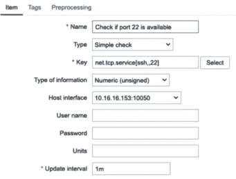
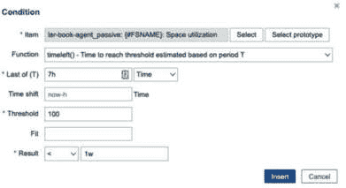
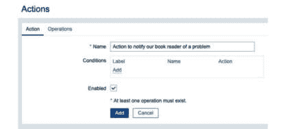

# 第四章：4

# 使用触发器和警报

现在，如果没有实际进行警报操作，那么 Zabbix 收集的所有数据又有什么用呢？当然，我们可以使用 Zabbix 来收集数据，并手动查看它们，但 Zabbix 在我们开始发送通知给用户时变得更有用。这样，我们就不需要时刻关注 Zabbix 前端，而是让触发器和警报为我们工作，只有在需要时，才会引导我们到前端。

在 Zabbix 7 中，你会发现与 Zabbix 5 相比，触发器表达式的语法有所变化。这种语法自 Zabbix 5.4 版本以来已经可用，因此如果你跳过了某些版本，这可能是你第一次接触这种语法。如果你之前使用的是 Zabbix 5.4 之前的版本，请记住，你可能需要适应这种新的语法。如果你已经运行 Zabbix 5.4 或更高版本，那么 Zabbix 7 中的语法将保持一致。

我们将在接下来的教程中详细学习如何使用新的表达式格式设置有效的触发器，以及如何设置警报：

+   设置触发器

+   设置高级触发器

+   设置警报

+   保持警报的有效性

+   自定义警报

# 技术要求

对于本章，我们需要一台 Zabbix 服务器，例如前一章中使用的那台服务器。

+   在你选择的 Linux 发行版上安装 Zabbix 服务器。我们将使用在*第一章*中设置的服务器。

+   MariaDB 设置以与 Zabbix 服务器配合工作。

+   设置 NGINX 或 Apache 以提供 Zabbix 前端。

+   我们还需要一台 Linux 主机进行监控，以便实际构建一些有趣的触发器来使用。

# 设置触发器

触发器在 Zabbix 中很重要，因为它们会通知你数据的状态变化。当我们的数据达到某个阈值或收到某个值时，我们希望触发一个警报。

那么，让我们开始设置一些有趣的触发器吧。定义触发器有许多不同的选项，但阅读完本教程后，你应该能够设置一些最常见的触发器。让我们将你的触发器经验提升到一个新的水平。

## 准备工作

对于本教程，我们需要准备好 Zabbix 服务器，并且需要一台 Linux 主机。我将使用上一章中的`lar-book-agent_simple`主机，因为我们已经在该主机上配置了一些项目。

我们还需要一个由 Zabbix 代理监控的主机，并使用 Zabbix 代理模板。我们将使用该主机上的一个项目来创建触发器。这将是上一章中的`lar-book-agent_passive`主机。

在此主机上，我们已经有一些可用的触发器，但我们将进一步扩展这些触发器，以便更好地通知我们。

## 如何操作…

在本节中，我们将创建三个触发器来监控状态变化。让我们从创建第一个触发器开始。

### 触发器 1 – SSH 服务监控

让我们在`lar-book-agent_simple`主机上创建一个简单的触发器。我们在该主机上进行了一个名为`检查端口 22 是否可用`的简单检查，但我们还没有创建任何通知机制：

1.  首先，让我们开始前往**数据收集** | **主机**，然后点击主机并进入**触发器**。在这里我们可以找到我们的触发器并创建新的触发器。我们将在右上角点击蓝色的**创建触发器**按钮来创建新的触发器。

1.  让我们创建一个新的触发器，使用以下信息：


图 4.1 – Zabbix 触发器创建页面 – 服务无法访问

1.  点击**添加**，并完成触发器的创建。这将为我们创建一个触发器，当我们的**安全外壳**（**SSH**）端口出现故障时触发。

1.  让我们通过进入我们的主机**命令行界面**（**CLI**）并执行一些命令，模拟将 Zabbix 服务器从端口**22**上关闭来测试它。我们将添加一个**iptables**规则，阻止所有进入端口**22**（SSH）的流量：

    ```
    iptables -A INPUT -p tcp -i ens192 -s 10.16.16.152
    --destination-port 22 -j DROP
    ```

1.  确保将**ens192**网卡和 IP 地址**10.16.16.152**替换为您自己的值。您可以使用以下命令来获取这些信息：

    ```
    ip addr
    ```

1.  现在，如果我们点击导航栏中的**仪表盘**，稍等片刻后，我们应该看到以下内容：


图 4.2 – Zabbix 仪表盘上的问题 – 端口 22 无法访问

### 触发器 2 – 当有新 Zabbix 版本发布时触发

现在，为了创建我们的第二个触发器，我们来稍微提高一下难度。如果您已经跟随*第三章*、*设置 Zabbix 监控*中的*设置 HTTP 代理监控*这部分，我们创建了一个项目，定期查询 Zabbix 网站以获取 Zabbix 的最新版本，Zabbix 7.0。现在，我们可能想要做的就是持续关注任何新的 Zabbix 版本发布：

1.  让我们前往**数据收集** | **主机**，并点击**lar-book-agent_simple**主机。

1.  现在，前往**触发器**并点击**创建触发器**按钮。我们将使用以下设置来构建我们的触发器：


图 4.3 – Zabbix 触发器创建页面 – 新的 Zabbix 7.0 版本触发器

1.  点击**添加**，并完成触发器的创建。

现在，这个触发器可能在前端不会立即触发，但我将在本食谱的*工作原理…*部分解释这个触发器是如何工作的。

### 触发器 3 – 在触发器中使用多个项目

我们已经看到了一些使用单个项目的触发器，但我们也可以在一个触发器中使用多个项目。让我们通过在同一个表达式中使用多个项目来构建一个新的触发器：

1.  让我们前往**数据收集** | **主机**，并点击**lar-book-agent_passive**主机。接下来，前往**触发器**并点击**创建触发器**按钮。

1.  我们将使用以下设置创建一个触发器：


图 4.4 – Zabbix 触发器创建页面 – 入站或出站数据包触发器

1.  请注意，你的项目键可能需要不同的接口名称。在我的案例中，接口名是**ens192**，因此请使用你所在主机的正确接口名称。使用以下 Linux 命令来获取你主机的接口：

    ```
    ip addr
    ```

1.  点击**添加**按钮，完成触发器的创建。

    **这里有一个小提示 -** 在触发器创建页面，使用**添加**按钮，位于**表达式**字段旁边，轻松地添加条件并构建表达式。例如，我们可以使用**选择**按钮从列表中选择一个项目。当使用**函数**下拉菜单时，还有一个非常有用的功能，就是每个触发器函数都有一个简短的说明：


图 4.5 – 触发器创建页面

这就是我们创建一个在两个项目上运行的触发器所需要做的所有工作。

## 它是如何工作的……

我们需要充分理解如何构建触发器及其工作原理，以便创建一个配置良好的监控平台。特别重要的是，我们需要确保触发器配置正确，并对其进行充分的测试。触发器是 Zabbix 中非常重要的一部分，它们对通知你监控目标的运行状态至关重要。若配置触发器过于宽松，你会错过重要信息；配置过于严格，你会被过多信息淹没。

在所有这些触发器中，我们还包括了触发器的严重性，如下图所示：


图 4.6 – 一个 Zabbix 触发器严重性选择器

这些严重性级别非常重要，可以确保你的警报根据重要性正确定义。在 Zabbix 前端的多个地方，甚至在一些操作中，我们都可以根据这些严重性级别进行筛选。

现在，让我们来看看为什么我们按照这样的方式构建触发器。

### 触发器 1 – SSH 服务监控

这是一个在 Zabbix 中非常简单但有效的触发器配置。当我们的值返回`1`表示`UP`或`0`表示`DOWN`时，我们可以轻松创建这样的触发器——不仅用于监控逻辑端口的开关状态，还适用于所有返回简单值变化的情况，例如从`1`到`0`，或者反过来。

现在，如果我们分析我们的表达式，得到以下内容：


图 4.7 – 一个 Zabbix 触发器表达式 – 端口 22 (SSH)

在构建表达式时，我们有四个部分：

+   **触发器函数**：触发器函数是表达式的一部分，决定了我们期望值的内容，例如是否只需要最后一个值，或者比如说一段时间内的平均值。

+   **主机**：表达式中的主机部分是我们定义用于触发的主机。大多数时候，它就是我们正在使用的主机（或模板）。

+   **项目键**：项目键是表达式的一部分，我们在其中定义了要用于从主机检索值并将其输入触发函数的项目键。

+   **运算符**：运算符决定了我们的函数如何基于触发表达式进行计算——例如，可能是与常数或另一个表达式进行比较。运算符可以是任何形式，如下所示：

| = | 等于。 |
| --- | --- |
| <> | 不等于。 |
| > | 大于。 |
| < | 小于。 |
| >= | 大于或等于。 |
| <= | 小于或等于。 |
| + | 加上。 |
| - | 减去。 |
| / | 除以。 |
| * | 乘以。 |
| and | 逻辑与。用于例如同时满足一个和另一个表达式。 |
| or | 逻辑或。用于例如，等于一个或另一个表达式。 |
| not | 逻辑非。用于例如，特定地不等于某个表达式。 |

+   **常量**：常量是触发函数用来确定触发器是否应该处于**OK**或**PROBLEM**状态的实际常量（通常是一个值）。我们在这里也可以使用宏。

现在，对于我们的第一个触发器，我们定义了我们的主机和提供 SSH 状态的项目。我们在触发函数中所说的是，我们希望在触发之前最后一个值为 `0`。

对于这个项目，这意味着它会在一分钟内触发，因为在我们的项目中，我们指定了以下内容：



图 4.8 – Zabbix 项目配置页面 – 端口 22 可用性项目

看着`0`并且考虑到由于`1m`间隔，SSH 端口 `22` 的停机时间最多为一分钟。

### 触发器 2 – 当有新的 Zabbix 版本时触发

现在，对于我们的第二个触发器，我们做了一些不同的事情。我们不仅为触发此问题创建了一个表达式，还为从触发器中恢复创建了一个表达式。在**问题表达式**选项中，我们定义了一个触发函数，告诉我们的主机将最后一个值与前一个值进行比较。我们通过使用**change**触发函数来实现这一点。


图 4.9 – Zabbix 触发表达式 – HTTPS 检查

因此，只有在最新的 Zabbix 版本发生更改时，我们的触发器才会被激活。我们本可以让触发器在当前值和之前的值相同的时候第一次解决，但我希望让这个触发器保持在`PROBLEM`状态稍微长一点。

因此，我还定义了一个恢复表达式。我告诉它，只有在接收到最后一个值和倒数第五个值时，问题才能恢复。请仔细查看恢复表达式：


图 4.10 – 另一个 Zabbix 触发器表达式 – 使用不同值的 HTTPS 检查

恢复表达式在你想通过稍微更多的控制来扩展触发器功能，特别是在它恢复到`OK`状态时，非常强大。

提示

你可以使用恢复表达式将触发器的**PROBLEM**状态扩展到你在**问题表达式**选项中定义的范围之外。这样，我们就知道触发器仍然接近**PROBLEM**状态。我们定义只有在达到了恢复表达式中定义的另一个阈值后，触发器才会回到**OK**状态。这将通过评估问题表达式和恢复表达式来工作，其中问题表达式必须是**FALSE**，而恢复表达式必须是**TRUE**。

### 触发器 3 – 在触发器中使用多个项

现在，触发器 3 可能看起来有些复杂，因为我们使用了多个项，但基本设置是一样的：


图 4.11 – 使用多个项的 Zabbix 触发器表达式

我们对表达式的设置是相同的，包括函数、主机、项键和值。但当我们处理多个项时，可以在项之间添加`or`语句。这样，我们可以说，我们需要匹配其中一个项才能触发**PROBLEM**状态。在这种情况下，只要任意一项超过阈值，我们就触发。

重要提示

在这个触发器表达式中，我们在不同项的表达式之间有一些空行。项表达式之间的空行是完全可以的，实际上有助于提高可读性。在构建触发器时，明智地使用这一点。

### 旧版与新版触发器表达式语法

如果你以前使用过 Zabbix 5.4 之前的版本，接下来的部分可能会对你很有意思。如我们在介绍中提到的，Zabbix 中的表达式已进行大规模更新。触发器表达式现在的工作方式与 Zabbix 中计算项以及其他地方的方式相同，提供了统一的体验。

让我们看看在 Zabbix 5.2 和更早版本中看到的旧表达式语法：


图 4.12 – 使用旧语法的 Zabbix 触发器表达式

在旧语法中，我们总是从*大括号*开始，然后是主机名或模板名。在主机名或模板名与项键之间，我们有一个冒号。在标记项键的结尾时，我们有一个*点*，但项键本身也可以包含点。然后，在*点*后，我们有触发器函数，最后是结束的*大括号*。然后，我们剩下的就是我们要用来与表达式进行比较的运算符和常量。

如你所料，这在使用项键中的点时可能会变得有些混乱。现在让我们来看一下新的触发器语法：


图 4.13 – 使用新语法的 Zabbix 触发器表达式

我们的新触发器语法从触发器函数开始，直接展示我们正在做什么，不需要任何麻烦。接下来是一个 *括号* 和一个 *斜杠*，然后进入主机或模板名称。我们随后使用另一个 *斜杠* 来分隔主机名或模板名与项键。最后以一个 *括号* 结束，然后剩下的就是我们希望与之匹配的操作符和值。

从触发器函数开始，使得这一行的作用一目了然。将主机名或模板名放入括号中，然后用斜杠将其与项键分隔开来，这让编写表达式时的体验更加连贯。我们也不再有混淆的额外点了。总的来说，这是触发器语法的一个非常好的变化，老实说，可能需要一些时间来适应。

正是这些小细节让整个软件感觉更加专业且经过深思熟虑。像这些更改，Zabbix 的引入无疑对这一点大有帮助。

## 还有更多……

我们不仅可以匹配触发器表达式中的某一项，还可以使用 `and` 语句。这样，我们可以确保触发器只有在多个项达到某一特定值时才会进入 `PROBLEM` 状态。触发器非常强大，可以让我们在详细程度上定义自己的标准。没有预定义——我们可以在触发器表达式中根据需要添加任意多的 `and`、`not` 或 `or` 语句以及不同的函数。根据您的需求自定义触发器，这样您会更加安心，因为您知道触发器会在出现问题时通知您。

## 另请参见

若要了解更多关于触发器表达式的信息，请查阅 Zabbix 文档。文档中有很多关于如何使用哪些函数来构建完美触发器的详细信息。详情请访问 [`www.zabbix.com/documentation/current/en/manual/config/triggers/expression`](https://www.zabbix.com/documentation/current/en/manual/config/triggers/expression)。

# 设置高级触发器

Zabbix 中的触发器不断变得更加高级，可能会让人难以跟上。对于使用 Zabbix 5.2 或更早版本并升级到 Zabbix 7 的用户，不仅有了全新的 Zabbix 触发器语法，还引入了全新的函数集合。

让我们深入了解如何在 Zabbix 7 中设置一些更高级的触发器。

## 准备工作

对于这个教程，我们需要准备好 Zabbix 服务器，并且需要一个通过 Zabbix 代理监控的主机，并且该主机使用了 Zabbix 代理模板。我们将使用该主机上的项来创建触发器。让我们使用上一章节中的 `lar-book-agent_passive` 主机。

如果你没有在上一章中提到的这个主机，只需连接一个新的主机，并使用默认的被动 Linux 监控模板 `Linux by` `Zabbix agent`。

我们还将讨论一些在书后部分提到的更高级主题。例如，如果你不知道如何使用**低级发现**（**LLD**），那么不妨先深入了解*第七章*，*使用发现进行自动创建*。

## 如何操作…

让我们来看一下与前一个教程中看到的三个触发器相比的三种*更高级*触发器：用于遍历趋势数据的 `trendavg`、用于预测未来值的 `timeleft` 和用于与过去比较的**时间偏移**。

### 高级触发器 1 – trendavg 功能

首先，我们来看看其中一个新的触发器功能，趋势平均（trendavg）功能：

1.  让我们从在前端创建一个新的触发器开始。导航到**数据** **收集** | **主机**并选择**lar-book-agent_passive**。

1.  导航到**触发器**，然后点击右上角的蓝色**创建触发器**按钮。

1.  在**表达式**字段旁，点击白色的**添加**按钮。使用表达式构建器填写触发器：


图 4.14 – trendavg 触发器表达式构建器

1.  点击**插入**并添加名称。如果正确完成，它将如下所示。


图 4.15 – 已填写的 trendavg 触发器表单

1.  现在，让我们点击页面底部的蓝色**添加**按钮，完成此触发器的创建。

创建此触发器就这些。请查看本教程的*如何工作...*部分，以获取更多有关触发器的信息。

### 高级触发器 2 – timeleft 功能

接下来是我们的 `timeleft` 函数，它对于诸如空间利用率之类的内容非常有用。我们来看看：

1.  我们将在 Zabbix 前端创建一个新的触发器。导航到**数据收集** | **主机**并选择**lar-book-agent_passive**。

1.  导航到**发现规则**，然后点击**已挂载** **文件系统发现**旁边的**触发器原型**。

重要提示

在这种情况下，我们直接在主机上创建触发器原型，使用现有的模板发现规则。如果你想将这样的触发器应用于每个使用模板的主机，确保在模板级别上创建触发器。此外，发现规则的详细解释可以参考本书的*第七章*，*使用发现进行自动创建*。

1.  点击**创建** **触发器原型**。

1.  在**表达式**字段旁，点击白色的**添加**按钮。使用表达式构建器填写触发器：



图 4.16 – timeleft 触发器表达式构建器

重要提示

在预测触发器中使用短时间间隔来预测长时间段是不推荐的。确保使用与我们想要预测的时间相关的正确数据集。

1.  点击蓝色的**插入**按钮，完成的触发器将如下所示。


图 4.17 – 填写完毕的 timeleft 触发器表单

1.  点击页面底部的蓝色**添加**按钮以完成触发器的设置。

我们现在有一个新的触发器，使用`timeleft`函数告诉我们硬盘在一周内何时填满。查看本配方的*工作原理…*部分以获取更多关于触发器的信息。

### 高级触发器 3 – 使用数学函数进行时间偏移

最后，我们将处理时间偏移，在这种情况下，我们将其与数学函数结合使用。时间偏移是一个有些复杂的例子，请耐心一下：

1.  让我们导航到**数据收集** | **主机**并选择我们的主机，**lar-book-agent_passive**。

1.  转到**触发器**并点击蓝色的**创建** **触发器**按钮。

1.  添加以下触发器，如截图所示：


图 4.18 – 填写完毕的时间偏移平均触发器表单

这是一个非常复杂的触发器设置，因此让我们直接进入*工作原理…*部分，看看它是如何设置的。

## 工作原理…

高级触发器可能变得非常复杂。我们刚刚设置的触发器只是冰山一角。如果这些触发器看起来令人生畏，请不要担心，外面有大量文档可以帮助你设置它们，你可以在这里找到：[`www.zabbix.com/documentation/current/en/manual/config/triggers`](https://www.zabbix.com/documentation/current/en/manual/config/triggers)。

在本书中几乎不可能覆盖所有的使用案例，所以我们设置的触发器将向你展示什么是可能的。将你在示例中学到的内容应用到你自己的场景中，但确保加入你自己的思考。

### 高级触发器 1 – trendavg 函数

让我们从*工作原理…*部分开始，介绍趋势平均。趋势平均是少数几个使用趋势数据而不是历史数据的触发器函数之一。让我们简要了解一下 Zabbix 中的历史数据和趋势数据。历史数据是每次项目从被监控主机接收数据时的确切值。趋势数据是从历史数据中创建的一个小时内的平均值、最小值和最大值，以及值的计数。

现在，让我们来看一下使用趋势数据创建触发器的可用函数：

+   **trendavg**：获取在时间段内趋势值的平均值

+   **trendmax**：获取在时间段内趋势值的最大值

+   **trendmin**：获取在时间段内趋势值的最小值

+   **trendcount**：获取在时间段内检索到的趋势值的数量

+   **trendsum**：获取一段时间内趋势值的总和

正如我所说，所有这些都将使用我们的趋势值。使用的值存储在内存中的特殊 Zabbix 趋势缓存中，用于触发器中。我们已经使用了 `trendavg` 函数。让我们再次查看我们在触发器表达式中是如何使用它的：


图 4.19 – trendavg 触发器表达式

我们以 `trendavg` 函数开始触发器，然后是之前在上一节中看到的 *主机/模板* 和 *项目键*。这里的新内容是我们声明 `1w:now-1w` 的部分。这是时间段；在这里，我们声明使用一周前的值。

这意味着，如果我们一周前的趋势平均值超过 800 Mbps，那么此触发器将进入问题状态。

### 高级触发器 2 – timeleft 函数

`timeleft` 是另一个非常有趣的触发器函数。我们可以使用 `timeleft` 创建仅在预计某个东西将来达到某个阈值时触发的触发器。这被称为预测触发器，因为它是基于旧数据做出的预测。

让我们再次检查我们的触发器表达式。


图 4.20 – timeleft 触发器表达式

正如我们所见，我们像往常一样开始表达式：*触发器函数*、*主机/模板* 和 *项目键*。在这种情况下，我们将其与用于预测触发器的时间段结合，定义其预测。我们使用了 `7h`，告知该表达式使用七小时的历史数据。再加上 `100` 的阈值，确保如果预计达到 100% 的磁盘空间使用率时会触发。现在，我们只需要一个元素来完成它，即预期结果，在这种情况下是 `<1w`。

总结一下，这个触发器表达式查看了 *七小时* 的历史数据，如果预计在 *不到一周* 内达到 *100%* 的磁盘空间，它将进入问题状态，并提醒你确保磁盘不会用完空间。

使用 `timeleft` 触发器函数与其他函数结合，限制触发警报的次数。例如，对于磁盘空间，我们可能预计磁盘将在一周内填满，但你可能不想看到除非已用空间至少少于 50 GB。再添加一个表达式，你就大功告成：


图 4.21 – timeleft 触发器函数表达式

### 高级触发器 3 – 使用数学函数的时间偏移

作为 Zabbix 培训师，时间偏移触发器表达式是我和我的学生总是需要额外花时间理解它们具体作用的地方。这是有道理的，因为它是更复杂的表达式之一，在这个例子中，我们甚至将其与一些数学函数结合使用。

那么，让我们再看一下我们的表达式并进行拆解。


图 4.22 – 时间偏移触发表达式

我们为了方便添加了行号。现在我们可以逐行解释每一行的含义：

1.  这是我们数学语句的开括号，使用两个项目之间的运算符。

1.  我们的第一个项目，使用时间偏移函数。此项目将从此时刻开始获取一周前某一时刻的内存可用百分比。如果当前日期和时间是 11 月 24 日星期一下午 14:00，它将获取 11 月 17 日星期一 13:00 到 14:00 的一小时平均值。

1.  我们的数学运算符，表示减号。这意味着我们将从第一个表达式的结果中减去第二个表达式的结果。

1.  这是我们的第二个项目，不使用时间偏移。此项目将填充上一小时的一小时平均值。

1.  结尾括号结束我们的数学语句。

1.  最后，一个运算符和常数。这说明此触发器仅在数学结果高于 20 时触发。

现在我们知道每一行的作用，让我们看看它在实际场景中的运作方式。我们将手动填写数值并查看表达式是否为`TRUE`或`FALSE`。`TRUE`表示存在问题，而`FALSE`表示一切正常。因此，数学运算如下：

```
(Last week - This week) = Result
If the Result is higher than 20 then the expression is True
This expression is: TRUE/FALSE
```

上周有 80% 的内存可用，而本周仅剩下 50%，我们可以看到以下情况发生：

```
(80 - 50) = 30
If 30 is higher than 20 the expression is TRUE
This expression is TRUE
```

让我们再来一次，但上周有 80% 的内存可用，而本周有 70%：

```
(80 - 70) = 10
If 10 is higher than 20 the expression is TRUE
This expression is FALSE
```

这是您应该设置时间偏移表达式的方法。只需使用笔记本或您喜欢的任何工具，在简单文本中写下表达式，然后进行计算。

## 还有更多内容……

触发表达式也可以在 Zabbix 内部进行测试。如果我们转到**数据收集** | **主机** | **触发器**，然后选择任何三个高级触发器中的一个，我们可以进行简单测试。例如，使用时间偏移触发器，我们可以点击**表达式构造器**。


图 4.23 – 时间偏移触发表达式构造器

在这里，我们可以选择**测试**，然后填写我们的值。让我们使用与前面示例中相同的 80% 和 50%：


图 4.24 – 时间偏移触发表达式构造器 – 测试

如您所见，这将告诉我们我们的表达式最终是否为**TRUE**或**FALSE**，使用我们希望填充的任何值。简而言之，如果您希望确保您的纸上数学与 Zabbix 中直接执行的操作相同，请使用**表达式构造器**进行测试。

# 设置警报

警报可以是 Zabbix 设置中非常重要的一部分。当设置警报时，我们希望接收方了解到正在发生的情况。同时，不要向某人发送大量警报；我们希望它是有效的。

所以，在这个食谱中，我们将介绍设置告警的基础知识，让我们从一开始就知道如何正确设置。

## 准备工作

对于这个食谱，我们只需要两样东西。我们将使用我们的 Zabbix 服务器来创建告警，并且我们将需要一些触发器，像是前一个食谱中的触发器。这些触发器将用于启动告警过程，看看 Zabbix 服务器如何传递这些信息。

## 如何操作…

1.  让我们从在 Zabbix 前端设置我们的操作开始。为此，我们将导航到**告警** | **操作** | **触发器操作**，然后我们将看到这个屏幕：


图 4.25 – Zabbix 触发器操作页面，带有一个触发器操作

已经设置了一个操作来通知**Zabbix 管理员**组有关问题事件。在 Zabbix 7 中，很多功能，如**操作**和**媒介**，都是预定义的。通常，我们只需要启用它们并填写一些信息。

1.  我们将设置我们自己的操作，因此让我们创建一个新的操作来通知**Zabbix 管理员**组的用户我们的新触发器。点击蓝色的**创建操作**按钮，进入下一页面：



图 4.26 – Zabbix 操作创建页面 – 通知书籍阅读者

1.  在此页面上，选中**启用**复选框，以确保此操作确实会生效。确保清晰地命名你的操作，以便不会在区分操作时遇到问题。

1.  现在，转到**操作**标签页：


图 4.27 – Zabbix 操作创建页面（操作标签页）– 通知书籍阅读者

1.  **操作**标签页默认是空的，因此我们需要在这里创建一些操作。我们将创建三种操作形式——让我们通过点击**添加**来开始创建**操作**操作：


图 4.28 – Zabbix 操作详情页面 – 通知书籍阅读者

1.  我们可以在此处添加用户和/或用户组，来接收告警。如果你已经跟随*第一章*，“*安装 Zabbix 并开始使用前端*”，你可以直接选择**网络**用户组。如果没有，选择仅**Zabbix 管理员**组也可以。

1.  在表单底部点击蓝色的**添加**按钮后，我们将返回到**操作**屏幕。

1.  现在，我们将创建下一个操作，命名为**恢复操作**。我们在这里创建一个操作，如下所示：


图 4.29 – Zabbix 恢复操作详情 – 通知书籍阅读者

1.  这个选项将通知所有参与之前定义的初始操作的用户。所有收到**问题**生成通知的用户也会以这种方式收到恢复通知。点击**添加**，然后继续。

    如果你像我一样，想随时掌握情况，可以创建一个更新通知。这样，我们就知道——例如——某人已确认问题并正在处理它。通常，我会为这种事情选择不同的渠道——例如，使用**短信**来处理高优先级的警报，其他事情则使用 Slack 或 Teams 渠道。

1.  让我们点击**添加**，在**更新操作**下将以下内容添加到我们的设置中：


图 4.30 – Zabbix 更新操作详情 – 通知书籍阅读者

1.  我们将按照在**恢复操作**选项中的设置做同样的事情，通知所有参与的用户关于此问题的任何更新。点击**添加**后，再次点击**操作**界面中的蓝色**添加**按钮，完成创建操作。

1.  现在，我们想做的下一件事是创建一种媒体类型，用于实际通知我们的用户问题。进入**警报** | **媒体类型**，你将看到以下界面：


图 4.31 – 带有预定义媒体选项的 Zabbix 媒体类型页面

如你所见，Zabbix 7 中有相当多的预定义媒体类型。我们有 Slack、Opsgenie，甚至 Telegram 的类型。不过，让我们从几乎每个人都有的东西开始：电子邮件。

1.  点击**电子邮件**媒体类型，我们将编辑它以满足我们的需求：


图 4.32 – 用于电子邮件的 Zabbix 媒体类型创建页面

1.  我将其设置为反映我的 Office 365 设置，但任何**简单邮件传输协议**（**SMTP**）服务器都应能正常工作。填写你的 SMTP 设置，我们就应该能够接收通知。

1.  一定要查看下一个标签页，**消息模板**。例如，**问题**生成事件的消息模板如下所示：


图 4.33 – Zabbix 问题的默认消息模板页面

我们这样设置是为了让我们收到一条告诉我们发生了什么的消息。这也是完全可定制的，可以反映我们想知道的具体内容。

1.  现在我们保持默认设置。最后，进入**用户** | **用户**，编辑**Zabbix 管理员**或**网络**组中的一个用户。我将以**Admin**用户为例。


图 4.34 – Admin 用户的 Zabbix 用户媒体页面

1.  在此窗口中，转到**媒体**并点击**添加**按钮。我们希望添加以下内容，以便在我们的电子邮件地址接收所有触发器严重性的通知：


图 4.35 – Zabbix 管理员用户的媒体创建页面

1.  现在，点击蓝色的**添加**按钮，完成创建该用户的媒体。

## 它是如何工作的…

现在，这就是我们在 Zabbix 中设置警报的方式。你将会收到发送到你电子邮件地址的警报，如下图所示的流程图：


图 4.36 – 展示 Zabbix 问题流程的图示

当某个问题发生时，Zabbix 中的**问题**会通过我们的触发器配置被触发。接着，**操作**会通过问题事件被触发，并使用媒体类型和用户媒体配置通知我们的用户。我们的用户随后解决了问题（例如，重启卡住的服务器），然后会生成一个**OK**事件。之后，我们会再次触发操作，并收到一个 OK 消息。

提示

在构建类似的警报之前，为自己创建一个工作流程（如*图 4.36*所示），明确哪些用户组和用户应该被通知。这样，你就能清楚地知道如何使用 Zabbix 进行警报。

## 还有更多…

有许多种媒体类型和集成方式，我们刚刚仅仅触及了冰山一角，看到了一些预定义的选项。请确保查看 Zabbix 集成列表（[`www.zabbix.com/integrations`](https://www.zabbix.com/integrations)）以获得更多选项，或者使用 Zabbix 的 Webhook 和其他可用的扩展来构建你自己的集成。

# 保持警报有效

保持警报有效非常重要，以确保我们不会因为通知而感到过于困扰，也不会因为缺少通知而感到失落。为此，我们将更改触发器和**电子邮件**媒体类型，只显示我们需要看到的内容。

## 准备工作

我们将使用来自第一个配方的触发器 1 和 Zabbix 中的默认电子邮件媒体类型。

当然，我们还将使用我们的 Zabbix 服务器。

## 如何操作…

要创建有效的警报，请按照以下步骤操作：

1.  让我们开始设置触发器 1，这个触发器是在本章的*设置触发器*配方中创建的。通过进入**数据采集** | **主机**，并点击该主机的**触发器**，来导航到**lar-agent-simple**主机。

1.  在这里，有时人们会使用不同的触发器名称，就像我们看到的这个：


图 4.37 – 来自上一配方的触发器 1

即使你在触发器中使用了`{HOST.NAME}`宏，这也很简单，因此幸运的是这里无需做很多更改。如果你在触发器名称中使用了主机名，我们可以更改名称，以便传达更清晰的信息。

1.  确保使用简洁且具有描述性的触发器名称，例如以下内容：


图 4.38 – 新的触发器 1 名称

1.  接下来，导航到 **标签** 页面，添加一个标签以保持触发器有序。我们来添加以下内容：


图 4.39 – 触发器 1 标签

1.  另一种保持一切有序的好方法是更改媒体类型上的消息。让我们更改媒体类型以反映我们的需求。导航到 **警报** | **媒体类型** 并选择名为 **电子邮件** 的媒体类型。

1.  选择 **消息** **模板** 并点击我们第一个问题旁边的 **编辑**。这将把我们带到以下窗口：


图 4.40 – 标准电子邮件媒体类型消息

目前，当我们不使用自定义消息时，Zabbix 使用媒体类型下默认配置的消息。但如果我们想要更改该消息，可以通过创建自定义消息来实现。**电子邮件**媒体类型下的默认消息如前面的截图所示。

1.  我们可以更改媒体类型上的消息。例如，如果您不想看到原始问题 ID 或者需要更自定义的消息，只需删除该行，如以下截图所示：


图 4.41 – 自定义电子邮件媒体类型消息

## 它是如何工作的…

在这个例子中，我们做了两件事：更改了触发器名称并向触发器添加了一个标签。

保持触发器名称简洁明了并以结构化的方式定义是保持 Zabbix 环境有序的重要因素。我们不仅仅把触发器命名为 `Port 22 SSH down on {HOST.NAME}`，而是对我们的设置进行了标准化，现在我们可以创建像这样的酷结构，应用到未来的触发器：


图 4.42 – 触发器结构图

我们的触发器都很清晰，能够立刻看到哪个主机、端口和服务出现问题。

此外，我们还为出现故障的服务添加了标签，这样它现在会立即以清晰的方式显示我们的服务，提醒我们到底发生了什么：


图 4.43 – 触发器关闭 – 结构化

在 Zabbix 6 中，引入了一种新的标签策略。我们在触发器中创建的项使用了 `availability`（可用性）、`performance`（性能）、`notification`（通知）、`security`（安全性）和 `capacity`（容量）标签。

要了解更多关于 Zabbix 7 中仍在使用的新 Zabbix 标签策略，请查看这个链接：

[`blog.zabbix.com/tags-in-zabbix-6-0-lts-usage-subfilters-and-guidelines/19565/`](https://blog.zabbix.com/tags-in-zabbix-6-0-lts-usage-subfilters-and-guidelines/19565/)

我们做的另一件事是移除了 `{HOST.NAME}` 宏（如果之前使用过的话）。因为我们已经可以通过查看 `{HOST.NAME}` 宏来确认触发器所在的主机。我们需要保持触发器名称简短有效，并在 **媒体** 中使用主机名宏，或者简单地使用前端已有的字段。

我们还改变了本节中的操作。更改媒体类型的消息是一种强有力的方式，可以保持我们的问题频道结构化。有时，我们希望在某些频道上看到更多或更少的信息，而更改媒体类型消息正是实现这一目标的一种方法。

我们还可以在**操作**级别创建自定义消息，更改发送到选定频道的所有消息。

## 还有更多内容…

我在本节中想向你展示的是，虽然设置 Zabbix 可能很简单，但如果没有计划，建立一个良好的监控解决方案并不简单——无论使用什么监控工具，都是如此。在你在 Zabbix 安装中构建一切之前，仔细规划触发器的结构非常重要。

一位以结构化方式工作的工程师，并花时间构建一个良好的监控解决方案，未来将节省大量时间，因为他们在其他人之前就能理解问题。

# 自定义警报

警报非常有用，特别是与我们在本书中学到的一些技巧结合使用，可以保持一切结构化。但有时，我们需要从警报中获得更多信息，而不仅仅是 Zabbix 默认提供的内容。

在本节中，我们将进行一些小的自定义，使警报更加符合我们的需求。

## 准备工作

对于本节，我们只需要当前的 Zabbix 服务器安装。

## 如何操作…

要自定义警报，请按照以下步骤操作：

1.  让我们在 Zabbix 服务器中创建一些自定义严重性级别，以便更好地反映我们组织的需求。导航至**管理** | **常规**，然后从侧边菜单中选择**触发器显示选项**：


图 4.44 – 管理 | 从侧边菜单的常规选项

选择此选项后，我们将进入下一页。此窗口包含默认的 Zabbix 触发器严重性，如下图所示：


图 4.45 – 默认触发器严重性页面

1.  接下来，我们可以按以下方式自定义默认的触发器严重性：


图 4.46 – 自定义触发器严重性页面

1.  别忘了点击页面底部的蓝色**更新**按钮以保存更改。

## 它是如何工作的…

不是所有公司都喜欢使用**高**和**灾难**等术语，而是更倾向于使用不同的严重性级别，例如**P1**和**P2**。通过使用自定义严重性级别，我们可以定制 Zabbix，使其更符合我们的需求，并反映我们在不同工具中已经使用的术语，例如。

更改自定义严重性级别绝非必要，但如果你习惯了不同的方式，它可能是更轻松采用 Zabbix 的好方法。
