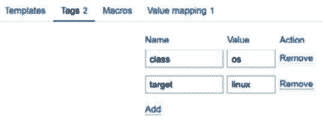
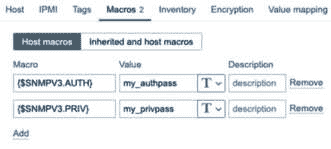
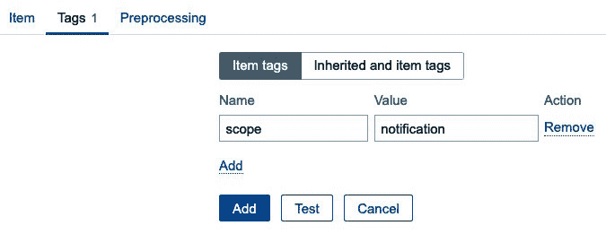
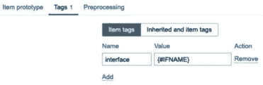

# 第五章：5

# 构建您自己的结构化模板

现在是开始 Zabbix 中最重要任务之一的时候：构建结构化模板。一个好的 Zabbix 设置非常依赖模板，良好的模板和差的模板之间差异巨大。所以，如果你是 Zabbix 新手，或者还没有开始构建自己的模板，那么请密切关注本章内容。

在本章中，我们将讲解如何设置你的模板，以及如何填充正确的项和触发器。此外，正确使用宏和**低级发现**（**LLD**）非常重要。在遵循这些配方后，你将完全准备好构建格式正确、甚至支持 LLD 的扎实 Zabbix 模板。

在本章中，我们将涵盖以下内容：

+   创建你的 Zabbix 模板

+   设置模板级标签

+   创建模板项

+   创建模板触发器

+   设置不同类型的宏

+   在模板中使用 LLD

+   嵌套 Zabbix 模板

# 技术要求

我们将需要在*第四章*中学习的**工作与触发器和警报**部分，来监控我们的**简单网络管理协议**（**SNMP**）主机。对于 SNMP 主机，我们可以使用在*第三章*的**设置 Zabbix 监控**部分中设置的主机。

# 创建你的 Zabbix 模板

在本配方中，我们将从创建 Zabbix 模板的基础开始。我们将探讨 Zabbix 模板的结构，并解释为什么我们需要关注模板中的某些方面。

## 准备就绪

本配方中所需的一切只是你的 Zabbix 服务器。

## 如何操作……

现在，让我们开始构建我们的结构化 Zabbix 模板：

1.  打开你的 Zabbix 前端并导航到**数据收集** | **模板**。

1.  在此页面，点击右上角的**创建模板**按钮。这将带你进入以下页面：


图 5.1 – 空的创建模板页面

此时，我们需要为我们的模板命名并为其分配一个模板组。我们将创建一个 SNMP 模板来监控 Linux 主机。我将在示例中使用 SNMP 来展示模板的结构。

重要提示

使用 SNMP 来监控网络设备、支持 SNMP 的自定义设备等。SNMP 非常多功能且容易理解，很多硬件厂商都已实现 SNMP。对于 Linux 主机，我仍然推荐使用功能强大的 Zabbix 代理，我们在*第三章*的**设置 Zabbix 代理监控**配方中进行了讲解。

1.  使用以下信息创建你的模板：


图 5.2 – 填充了 SNMP 模板信息的创建模板页面

我们暂时不会链接任何 **模板**、**标签** 和 **宏**，但稍后我们会讨论这些功能。到目前为止，创建模板所需的仅仅是一个名称、组和描述，其他什么也没有。

## 它是如何工作的……

创建我们第一个模板并不涉及很多工作——它非常简单。我们需要记住的是，这里正确的命名约定。

现在，你可能会问自己：*为什么模板命名如此重要？* 嗯，我们在使用 Zabbix 时会创建大量模板。例如，这是一个开箱即用模板的列表的一小部分：


图 5.3 – 一些开箱即用的模板

如你所见，这已经是一个很大的列表，所有这些模板都遵循一个简单明了的命名约定。如果你查看我们刚刚自己创建的模板名称和例如内置的 Apache 模板，它们遵循相同的约定。拆解这个约定，它看起来是这样的：


图 5.4 – 模板命名约定说明

如果我们查看这个列表并将其与*图 5.4*中我们讨论的命名约定进行比较，我们可以看到以下模式：

+   **我们在监控什么？**： （Linux）我们为模板命名——在这种情况下，我们将其命名为 Linux，因为我们监控的操作系统是 Linux。

+   **监控类型**：（通过 SNMP）我们将在模板的末尾添加数据收集方法，因为我们可能通过除 SNMP 以外的其他方式监控 Linux 操作系统，例如使用 Zabbix 代理。

遵循此命名约定中的指导方针并使用正确的模板名称，是我们创建正确模板结构的第一步。这使得我们可以轻松地找出要在哪些主机上使用哪些模板。

在我们的例子中，我们还添加了一个简短的自定义前缀，以确保我们能够将我们的模板与 Zabbix 设置中已经创建的其他模板区分开来。通常，我们可以省略这个前缀，但在本书中它很有用。作为最佳实践，建议克隆你希望使用的默认模板，并在模板名称前加上公司名称或简称。我们这样做是为了不覆盖默认模板，并确保以后可以导入官方模板而不会覆盖我们所做的任何修改。例如，我会克隆*Linux by SNMP*并将其命名为*OICTS Linux by SNMP*，以便在我们公司——开源 ICT 解决方案中使用。在**托管服务提供商**（**MSP**）环境中，这种做法同样有效，我们希望为每个客户拥有一个独特的模板。

## 还有更多……

在构建模板时，请遵循 Zabbix 指南。这也是我们在本书中所做的，结合我们在创建模板方面的经验。如果您想了解更多关于 Zabbix 模板指南的信息，请查看以下 URL：[`www.zabbix.com/documentation/guidelines/en/thosts`](https://www.zabbix.com/documentation/guidelines/en/thosts)。

# 设置模板级标签

设置 Zabbix 模板的下一步是设置模板级标签。模板级标签用于为由此模板在主机上创建的每个事件（问题）分配一个标签。然后，这些标签可用于在仪表板、操作以及**监控** | **问题**视图中筛选事件。

## 准备工作

要开始这个食谱，您需要一个 Zabbix 服务器和该服务器上的模板，最好是我们在上一个食谱中创建的模板。

## 如何操作……

创建模板级标签是确保仅由某个特定模板创建的事件才会获得已配置标签的一种方式。首先，您需要做的是导航到模板并按照以下步骤进行操作：

1.  转到 **数据收集** | **模板**，然后点击我们的模板，它叫做 **Custom Linux** **by SNMP**。

1.  然后，点击表单顶部的 **标签** 标签，您将被带到此标签页：


图 5.5 – SNMP 模板的 Zabbix 标签标签页

现在，我们可以做的第一件事是创建一些标签，以确保我们知道所有来自此模板的事件都将与 Linux 相关。

1.  第一个标签已经准备好创建了。填写 **名称** 为 **class**，然后在 **值** 字段中输入 **os**。

1.  对于第二个标签，点击小的带点下划线的 **添加** 按钮，并将第二个标签的 **名称** 设置为 **target**。然后，在 **值** 字段中输入 **linux**。它看起来会是这样：



图 5.6 – 已填写 SNMP 模板的 Zabbix 标签标签页

1.  别忘了点击蓝色的 **更新** 按钮，将标签保存到此模板中。

## 它是如何工作的……

现在，创建标签比按照本食谱步骤看起来要复杂得多。标签在保持 Zabbix 环境结构化方面起着关键作用。您将使用模板级标签在很多地方进行筛选，例如 **监控** | **问题** 窗口，在一个主机创建的许多事件中，它们将通过使问题容易筛选来提高可读性。

例如，一旦我们在本食谱中稍后配置了一些触发器，当检查我们主机的 **监控** | **问题** 页面时，我们可能会看到如下内容：


图 5.7 – 主机 lar-book-agent_snmp 的示例监控 | 问题页面

关于截图的说明

本书中使用的一些截图已调整以适应书页的边距，导致印刷版中的文本可读性降低。请参考此处提供的 PDF 版本：[`packt.link/free-ebook/978-1-80107-832-0`](https://packt.link/free-ebook/978-1-80107-832-0)，放大图像并更清晰地查看文本。

如你所见，我们在这里看到的问题是页面底部显示**target:linux**和**class:os**标签。该事件已使用模板级标签进行标记，现在我们可以看到它将始终携带该标签，允许我们进行过滤。

这为我们提供了很多机会，因为我们不再仅限于模板级标签。我们还有主机级标签、项级标签和触发器级标签。我们可以用 `department:architecture` 标记模板中的所有内容。

然后，我们可以例如创建一个操作，将所有与 Linux 相关的信息发送到某个特定的 Linux 工程邮箱地址或 Teams/Slack 频道，并根据 `department:architecture` 将信息发送到更具体的邮箱地址或 Teams/Slack 频道。

要了解 Zabbix 6 版本起的标签策略，请查看以下链接：

[`blog.zabbix.com/tags-in-zabbix-6-0-lts-usage-subfilters-and-guidelines/19565/`](https://blog.zabbix.com/tags-in-zabbix-6-0-lts-usage-subfilters-and-guidelines/19565/)

## 另见

在本章中，名为*在模板中使用 LLD*的教程还将解释**标签原型**，我们将在此基础上根据 LLD 设置自动创建标签。标签原型是创建发现时使用标签的推荐方法，并且非常适合保持模板结构化。稍后会详细介绍。

# 创建模板项

让我们开始最终创建一些真正的模板项，因为最终在 Zabbix 中，模板项才是核心。没有模板项，我们就没有数据，而没有数据，我们在监控系统中就没有任何东西可操作。

## 准备中

接下来，我们需要 Zabbix 服务器和一个可以用 SNMP 监控的主机。在*第三章*，*设置 Zabbix 监控*中，我们用 SNMP 监控了一台主机，所以我们将再次使用这台主机。我们还将使用之前教程中的 Zabbix 模板。

## 如何操作……

1.  首先，让我们登录到 Zabbix 服务器的**命令行界面**（**CLI**），并输入**snmpwalk**，使用以下命令：

    ```
    10.16.16.153 to your own value. We will receive an answer such as this:
    ```


图 5.8 – snmpwalk 回复

现在，让我们首先在模板中捕获主机名，因为这是一个重要的项。在处理 SNMP 时，我总是喜欢使用未翻译的 SNMP `.1.3.6.1.2.1.1.5.0`。

1.  如果我们有**管理信息库**（**MIB**），我们可以转换此 OID 来确保它确实是系统名称。请在 Zabbix 服务器的 CLI 中输入以下命令：

    ```
    snmptranslate .1.3.6.1.2.1.1.5.0
    ```

    这将返回以下回复：


图 5.9 – snmptranslate 回复

提示

在你的 SNMP 命令中使用 **-On** 确保我们接收到的是 OID，而不是 MIB 翻译。如果我们想要反向操作，可以在命令中省略 **-On**，然后使用 **snmptranslate** 翻译后的 OID。

1.  现在我们知道如何获取主机名，将其添加到我们的模板中。导航至 **数据收集** | **模板**，并选择我们的 **自定义 Linux 通过 SNMP** 模板。

1.  在这里，我们将进入 **项目**。在右上角选择 **创建项目**，然后创建以下项目：


图 5.10 – sysName SNMP OID 项目

1.  确保还要添加项目级别的标签。这些标签对项目分组和筛选非常重要。点击 **标签** 选项卡并添加以下内容：


图 5.11 – sysName SNMP OID 项目（标签选项卡）

现在我们有了第一个项目，让我们也创建一个主机并将模板分配给该主机。

1.  导航至 **数据收集** | **主机**，然后点击右上角的 **创建主机**。使用以下设置创建一个主机：


图 5.12 – 使用我们自创建模板的新主机

1.  不要忘记在点击 **添加** 按钮之前，将宏添加到我们的新主机。点击 **宏** 并填写以下信息：



图 5.13 – 在主机上添加宏选项卡

不要忘记将宏设置为“秘密文本”类型，以便在前端隐藏密码。

1.  现在，你可以点击 **添加** 按钮，我们的新主机将开始被监控。

## 它是如何工作的…

当我们在模板中创建类似的项目时，将模板分配给主机时，该项目也会在主机上创建。这样做的好处是，我们可以将模板分配给多个主机，这意味着我们只需要在模板级别配置一次项目，而无需在每个主机上都创建该项目。例如，我们新创建的主机将显示以下最新数据：


图 5.14 – 监控 | 我们新主机的最新数据

这个项目的值会根据每个受监控主机接收到的值而不同。

重要说明

创建 SNMP 项目时，请记住以下几点。**项目**字段中的 SNMP OID 始终包含未翻译的 OID。这是为了确保我们不需要 MIB 文件，模板就能正常工作。

此外，项目键将基于翻译后的 OID。在我们的例子中，翻译后的 OID 是 `sysName`，我们将其转化为 `sysName` 项目键。这些是我们在创建模板时应该遵循的通用规则，以确保每个人的模板结构一致。

## 另见

要了解更多关于 Zabbix 和 SNMP OID/MIB 的信息，请查看这篇博客文章：

[`blog.zabbix.com/zabbix-snmp-what-you-need-to-know-and-how-to-configure-it/10345/#snmp-oid`](https://blog.zabbix.com/zabbix-snmp-what-you-need-to-know-and-how-to-configure-it/10345/#snmp-oid)

# 创建模板触发器

创建模板触发器的方式与创建模板项目或普通触发器大致相同。让我们回顾一下这个过程，看看我们是如何操作的，以及如何保持结构化。

## 准备工作

我们需要前一个配方中的 Zabbix 服务器和主机来完成这个配方。

## 如何操作……

到目前为止，我们在模板上配置了一个项目，现在让我们为该项目创建一个触发器：

1.  在 Zabbix 前端导航到 **数据采集** | **模板**，然后选择我们的 **Custom Linux by** **SNMP** 模板。

1.  现在，点击 **触发器**，然后点击右上角的 **创建触发器**。这将带我们进入下一页，在这里我们将输入以下信息：


图 5.15 – 为 SNMP 模板创建触发器窗口

1.  如前一章所讨论，对于触发器，我们还需要添加 **作用域** 标签：


图 5.16 – 为 SNMP 模板创建触发器窗口 – 标签

1.  最后但同样重要的是，让我们编辑主机的主机名，看看触发器是否正常工作。通过在 Linux 主机的 CLI 上执行以下命令来更改主机名：

    ```
    hostnamectl set-hostname lar-book-agent-t
    ```

1.  然后，确保更改生效，通过执行以下命令：

    ```
    exec bash
    systemctl restart snmpd
    ```

## 它是如何工作的……

编辑模板时，创建的触发器将立即添加到我们名为 `lar-book-templated_snmp` 的主机上。这是因为当我们编辑模板时，主机已经配置了该模板。我们更改了主机名后，触发器可以在再次轮询该项目后立即触发：


图 5.17 – 主机名已更改的触发器，针对主机 lar-book-templated_snmp

因为我们在触发器中使用了`change`函数，当我们第二次轮询这个项目时，问题会自动消失。在我们的案例中，这将在 30 分钟后发生。

重要提示

像许多其他 Zabbix 用户一样，我总喜欢在触发器名称中使用**{HOST.NAME}**宏，但根据 Zabbix 的指南，不推荐这样做。如果你更喜欢这种方式，你仍然可以使用它，但使用 Zabbix 前端中的**主机**字段和内置的通知宏更有用。这样可以使触发器名称简洁，并且不会显示冗余信息。

# 设置不同种类的宏

当我们使用模板时，使模板更有用的一个非常有效的方法是使用宏。在这个配方中，我们将学习如何使用宏来实现这一点。

## 准备工作

我们需要之前配好的 Zabbix 服务器和 SNMP 监控的主机。还需要我们在前面的食谱中创建的 Zabbix 模板。

## 如何操作…

现在，让我们从在模板级别创建一些宏开始。我们将创建两种不同类型的宏。

### 定义用户宏

1.  首先，我们将在我们的模板上定义一个用户宏。导航到 **数据收集** | **模板** 并点击我们的 **Custom Linux by** **SNMP** 模板。

1.  在这里，我们将进入 **宏** 并填写以下字段：


图 5.18 – 模板级别的宏

1.  点击 **更新**，然后让我们转到 **触发器** 来定义一个新触发器：


图 5.19 – SNMP 模板的触发器创建窗口

1.  让我们也添加触发器标签：


图 5.20 – SNMP 模板的触发器创建窗口标签选项卡

1.  现在，通过在主机 CLI 上执行以下命令，修改主机名条目：

    ```
    hostnamectl set-hostname dev-book-agent
    ```

1.  然后，确保通过执行以下命令使更改生效：

    ```
    exec bash
    systemctl restart snmpd
    ```

1.  我们的触发器应该会触发，如下图所示：


图 5.21 – 针对 lar-book-templated_snmp 主机的主机名前缀创建的触发器问题

### 使用内置宏

1.  现在，让我们来定义一个内置宏在我们的模板上。导航到 **数据收集** | **模板** 并点击我们的 **Custom Linux by** **SNMP** 模板。

1.  现在，点击 **触发器**，在右上角点击 **创建触发器**。使用以下设置创建一个触发器：


图 5.22 – 主机名匹配的触发器创建窗口

1.  让我们也添加触发器标签：



图 5.23 – SNMP 模板的触发器创建窗口 – 标签

1.  这将按预期触发一个问题。


图 5.24 – 主机名不匹配的触发器创建问题

## 它是如何工作的…

有四种类型的宏：内置宏、用户宏、表达式宏和 LLD 宏。所有这些宏都可以在模板上使用，但也可以直接在主机和其他各种位置使用。宏对于在本应包含静态信息的地方创建唯一值非常有用。

让我们来探索它们是如何工作的。

### 用户宏的工作原理

因为我们希望此模板下的所有主机的前缀都包含 `lar`，所以我们在模板级别创建一个用户宏。这样，每个使用此模板的主机上的用户宏将是相同的。

然后，我们在触发器中定义我们的用户宏来使用该值，在这个例子中是`lar-`。我们可以在其他触发器、项目等中重用这个用户宏。好处是，定义模板级别的用户宏并不是我们能做的全部。我们可以通过定义主机级的用户宏来覆盖模板级的用户宏。因此，如果我们希望某台主机包含不同的前缀，只需使用主机级宏来覆盖模板级宏，像这样：


图 5.25 – 主机级宏页面

如果我们查看主机上继承的和主机级的宏屏幕，我们会看到以下内容：


图 5.26 – 继承和主机级宏页面

我们看到有效值现在是`dev-`，而不是`lar-`，这正是我们预期的结果。

请记住，语法总是以花括号和美元符号开始，并以花括号结束。您可以使用点号或下划线来分隔其中的文本。以下是一些示例：

+   **{$****MACRONAME}**

+   **{$****MACRO.NAME}**

+   **{$****MACRO_NAME}**

### 内置宏的工作原理

现在，内置宏来自 Zabbix 中预定义的宏列表，这些宏是硬编码的。它们用于从您的 Zabbix 系统中获取数据并将其放入项目、触发器等中。这意味着，在这种情况下使用的内置宏已经包含了一个值。

在这种情况下，我们使用了`{HOST.HOST}`，这是我们在 Zabbix 主机上定义的主机名，像这样：


图 5.27 – Zabbix 主机配置页面，主机 lar-book-templated_snmp

对于每一台主机，这个内置宏都会不同，因为我们的**主机名**值是唯一的。这意味着，虽然触发器在模板级别定义，但它总是唯一的。这种方法是使用内置宏在触发器中非常强大的一种方式，因为我们会直接从 Zabbix 中获取信息，再次将其导入 Zabbix。

请记住，语法总是以花括号开始并以花括号结束。您可以使用点号或下划线来分隔其中的文本。以下是一些示例：

+   **{****HOST.NAME}**

+   **{****INVENTORY.LOCATION.LAT}**

## 还有更多……

完整的支持（内置）宏列表可以在这里找到：

[`www.zabbix.com/documentation/current/zh/manual/appendix/macros/supported_by_location`](https://www.zabbix.com/documentation/current/en/manual/appendix/macros/supported_by_location)

这个列表会由 Zabbix 更新，就像每一篇好的 Zabbix 文档页面一样。这样，您可以始终使用此页面作为构建 Zabbix 元素时最新（内置）宏的参考。

# 在模板上使用 LLD

现在，让我们开始我最喜欢的模板创建部分：LLD。我认为这是 Zabbix 中最强大且最广泛使用的部分之一。

## 准备开始

为了准备这个配方，您需要 Zabbix 服务器、前面配方中的 SNMP 监控主机以及我们之前的模板。

还建议具备一定的 SNMP 树结构的工作知识。因此，请确保仔细阅读*第三章*中有关*与 SNMP 监控配合使用*的配方，*Zabbix 监控的设置*。

## 如何操作……

1.  让我们通过进入**数据收集**|**模板**并选择我们的**自定义 Linux 通过** **SNMP**模板来开始。

重要说明

首先，我们将添加一个值映射，供多个项原型使用。请记住，自 Zabbix 6 以来，值映射不再是全局的，而是模板或主机特定的。这是为了确保模板和主机（导出后）能够更独立于全局的 Zabbix 设置。

1.  点击**值映射**选项卡和虚线的**添加**按钮。然后添加以下内容：


图 5.28 – Zabbix 添加值映射页面

1.  确保通过点击蓝色的**添加**按钮，然后点击蓝色的**更新**按钮来保存此更改。

1.  现在，返回到模板并转到**发现规则**，然后在右上角点击**创建发现规则**。这将带您到 LLD 创建页面：


图 5.29 – Zabbix LLD 创建页面，空白

现在，我们将创建一个发现规则来发现 Linux 主机上的接口。Linux 接口的 SNMP 树位于 OID `.1.3.6.1.2.1.2`。

重要说明

确保 Linux 的**net-snmp**在**/etc/snmp/snmpd.conf**文件中已正确配置。重要的是要在此文件中将视图更改为显示从**.1**开始的所有内容，像这样：**view systemview** **included .1**

1.  现在，让我们继续创建我们的 LLD 规则，通过在 LLD 创建页面中添加以下内容：


图 5.30 – Zabbix LLD 创建页面，已填写我们的网络接口发现信息

1.  点击**添加**按钮后，我们可以返回到模板，在**数据收集**|**模板**中点击**自定义 Linux** **通过 SNMP**。

重要说明

我们将**删除丢失的资源**定义为**立即**执行；这样做是因为这是一个测试模板。此选项由 LLD 用于删除已创建的资源（如项和触发器），如果它们不再出现在我们监控的主机上。使用**立即**可能导致数据丢失，因为我们可能在一定时间内重新获得某个资源，因此请确保根据生产环境的标准调整此值。

1.  转到**发现规则**并点击我们新创建的规则，**发现** **网络接口**。

1.  现在，转到 **项目原型** 并点击右上角的 **创建项目原型**。这将打开 **项目原型** 创建弹窗，如下图所示：


图 5.31 – Zabbix LLD 项目原型创建页面，空白

在这里，我们将创建我们的第一个项目原型，用于从 LLD 创建项目。这意味着我们需要将其填充为我们希望项目包含的信息。

1.  让我们从为接口操作状态填写一个项目原型开始，像这样：


图 5.32 – Zabbix LLD 项目原型创建页面，已填充我们的接口操作状态信息

1.  在 **标签** 选项卡中，确保也添加一个标签原型，如下所示：



图 5.33 – Zabbix LLD 项目原型标签创建选项卡

提示

在下一步中，我们将创建一个与我们刚刚创建的项目非常相似的项目。使用 **克隆** 按钮而不是从头开始填写整个表单非常有用。

1.  点击 **添加** 按钮后，让我们重复这个过程，并添加以下项目原型：


图 5.34 – Zabbix LLD 项目原型创建页面，已填充我们的接口管理员状态信息

1.  不要忘记 **标签** 选项卡：


图 5.35 – Zabbix LLD 项目 2 原型标签创建选项卡

1.  现在，转到 **触发器原型** 页面，点击右上角的 **创建触发器** 原型按钮，并创建以下触发器：


图 5.36 – Zabbix LLD 触发器原型创建页面，已填充我们的接口链路状态信息

1.  最后但同样重要的是，添加触发器标签：


图 5.37 – Zabbix LLD 触发器原型创建页面 标签选项卡

## 它是如何工作的…

LLD 是 Zabbix 中一个相当广泛的主题，但通过按照本指南中的步骤，你应该能够将你在这里学到的知识应用到几乎所有需要配置的 Zabbix LLD 类型。首先，让我们看看发现是如何工作的。

在发现规则中，我们刚刚配置了以下内容：


图 5.38 – Zabbix LLD 发现密钥和 OID，键 net.if.discovery

提示

Zabbix LLD 通过使用特定的 JSON 格式工作。在创建发现规则时，我们可以始终转到主机级别的发现规则，并使用 **测试** 按钮。这样就可以显示 Zabbix 使用的 JSON 格式。

我们基本上在这里说的是，对于 OID `.1.3.6.1.2.1.2.2.1.2` 后的每个接口，我们都填充 `{#IFNAME}` LLD 宏。在我们的案例中，我们将最终得到以下 OID：

```
.1.3.6.1.2.1.2.2.1.2.1 = STRING: lo
.1.3.6.1.2.1.2.2.1.2.2 = STRING: ens192
```

因此，我们将这些保存下来以供我们的原型使用。现在，当我们查看我们对 **操作状态** 原型所做的更改时，一切都结合在一起了：


图 5.39 – Zabbix LLD 项目原型的名称、类型、键和 OID

我们告诉我们的项目原型，为每个 `{#IFNAME}` 值创建一个项，使用已定义的键和 `{#SNMPINDEX}` LLD 宏。`SNMPINDEX` 是我们 SNMP 轮询的最后一个数字。在这种情况下，我们将看到以下内容：

```
.1.3.6.1.2.1.2.2.1.8.1 = INTEGER: up(1)
.1.3.6.1.2.1.2.2.1.8.2 = INTEGER: up(1)
```

对于世界上所有的供应商来说，都有一套预定义的 SNMP 规则，他们应该遵循。在轮询 `.1.3.6.1.2.1.2.2.1.2` 时，我们的第一个接口条目是 `.1` SNMPINDEX，值为 `lo`。这意味着，当轮询 `.1.3.6.1.2.1.2.2.1.8` 时，`.1` SNMPINDEX 这里仍然应该包含 `lo` 的值。

Zabbix LLD 现在将创建一个名为 `接口 lo: 操作状态` 的项，来轮询 SNMP OID：

```
.1.3.6.1.2.1.2.2.1.8.1 = INTEGER: up(1)
```

它还将创建一个名为 `接口 ens192: 操作状态` 的项，来轮询 SNMP OID：

```
.1.3.6.1.2.1.2.2.1.8.2 = INTEGER: up(1)
```

创建的项将如下所示：


图 5.40 – 我们的 SNMP 监控主机的 Zabbix 最新数据屏幕

除了创建这些 LLD 项目外，我们还创建了一个 LLD 触发器原型。它的工作方式与项目原型相同。如果我们检查我们的主机触发器，可以看到两个已创建的触发器：


图 5.41 – 我们的 SNMP 监控主机触发器

这些触发器已与项目相同的方式创建，并且被正确的项目填充以触发：


图 5.42 – 我们的 SNMP 监控主机 ens192 的触发器

我们可以看到，对于接口操作状态，我们的 SNMPINDEX 是 `2`，`接口 ens192: 管理状态` 项目也有相同的值。现在，当操作状态为 `0` (*down*) 且管理状态为 `1` (*up*) 时，我们的触发器将被触发。

一个整洁的触发器，确保只有在管理状态为 *up* 时才会有问题；毕竟，只有当我们将接口配置为管理员 *up* 时，我们才希望收到接口故障的警报。

提示

可以使用发现过滤器，仅将管理状态为 *up* 的接口添加到我们的监控中。这样，我们可以保持 Zabbix 服务器的性能更低，同时保持数据更清洁。考虑在此类使用案例中使用发现过滤器。

## 另请参见

发现是一个广泛的主题，需要一些时间才能掌握。它可以像我们在本章中使用 SNMP 那样使用，但也可以与 Zabbix 代理一起使用，适用于许多其他使用场景。一旦你开始使用 Zabbix 发现，并且保持结构化，那时你就能开始构建出迄今为止最好的模板。

查看以下链接以获取 Zabbix LLD 文档：

[`www.zabbix.com/documentation/current/en/manual/discovery/low_level_discovery`](https://www.zabbix.com/documentation/current/en/manual/discovery/low_level_discovery)

# 嵌套 Zabbix 模板

在大多数情况下，使用每个设备或设备组的简单模板是创建 Zabbix 模板的最佳实践，但这不是唯一的方法。我们还可以使用嵌套模板将它们的部分拆分并重新组合到层级结构中的最高模板中。

在本教程中，我们将讨论如何配置这个模板及其原因。

## 准备工作

我们需要我们的 Zabbix 服务器、我们的 SNMP 监控主机以及我们在前一章节中创建的模板。

## 如何操作…

1.  让我们首先导航到**数据收集** | **模板**页面，并点击右上角的**创建模板**按钮。

1.  我们将创建一个新模板来监控我们 SNMP 主机的 uptime。请输入以下信息：


图 5.43 – 使用 SNMP 的 uptime 新模板创建页面

1.  接下来，我们将点击**添加**按钮，并点击我们的**通过 SNMP 自定义 Linux uptime**模板名称。这将带我们进入模板编辑页面。

1.  点击**项**和右上角的**创建项**。我们将在这里创建一个示例项，如下所示：


图 5.44 – 模板创建页面上的新项，名为系统 Uptime

1.  不要忘记添加一个标签，如截图所示，通过转到**标签**选项卡：


图 5.45 – 模板创建页面上的新项，系统 Uptime，标签选项卡

1.  确保点击蓝色的**添加**按钮以完成此项的添加。

1.  现在，让我们通过返回**数据收集** | **模板**页面并点击**通过 SNMP 自定义 Linux**，导航到我们原始的模板。

1.  在此页面上，通过在**模板**输入框中添加它，将一个模板链接到当前模板，如下所示：


图 5.46 – 主 SNMP 模板的模板链接页面

1.  点击蓝色的**更新**按钮以完成模板链接。

1.  最后但同样重要，导航到**数据收集** | **主机**，点击我们的**lar-book- templated_snmp** SNMP 监控主机，并检查**项**页面，看看该项是否存在：


图 5.47 – 我们的主机 | 主机 lar-book-templated_snmp 的项页面

项目存在，并显示它实际上来自另一个模板。这就是链接模板的全部操作——使用这些嵌套模板操作起来很容易，但要保持其结构化则更具挑战性。让我们看看这是如何运作的。

## 它是如何工作的……

嵌套模板具有简单的树形结构，就像这样：


图 5.48 – 模板嵌套树形结构

所以，我们有一个 Zabbix 监控的主机，它与 `Custom Linux by SNMP` 模板链接，作为唯一的模板。现在，由于我们在 `Custom Linux by SNMP` 上有一个嵌套模板（当然，它是 `Custom Linux uptime by SNMP`），该模板上的项也会链接到我们的 Zabbix 监控主机。

我们可以将此应用于许多场景——其中一个我最喜欢的场景是网络设备。如果我们有一台 Juniper EX（或 Cisco Catalyst）系列交换机和一台 Juniper QFX（或 Cisco Nexus）系列交换机，这两种系列交换机都使用相同的 SNMP 接口发现。因此，我们可以为接口创建一个模板，并将其嵌套在 EX 或 QFX 系列的主模板中，这些系列使用不同的 SNMP OID 来表示其他值。

通过这种方式，我们不需要在模板中重复编写相同的发现规则、项目、图形以及其他所有内容。我们只需做一次，并将模板整洁地嵌套在其中。
