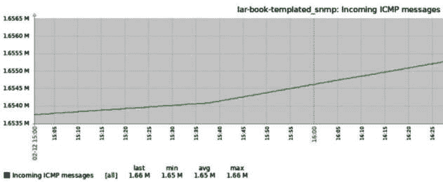
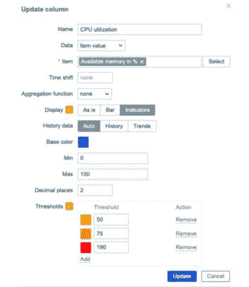
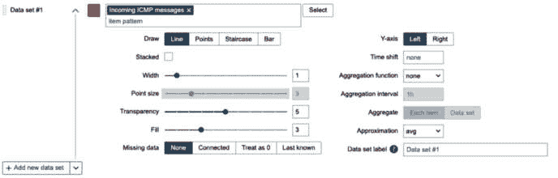
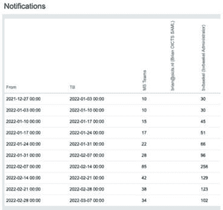

# 6

# 数据可视化、库存和报告

在使用 Zabbix 时，收集到的数据必须得到充分利用。毕竟，如果我们没有一个可以轻松访问数据的地方，这些数据就没有意义。Zabbix 已经通过 **最新数据** 页面和由触发器创建的问题有效地利用了我们的数据，但我们也可以通过自己创建一些东西来更好地利用数据，例如图表、地图、库存以及完全自定义的仪表板。我们甚至可以从仪表板生成报告并在前端使用内置报告。

完成这些操作后，你将能够设置 Zabbix 数据可视化的最重要部分。你还将能够充分利用你的库存和报告系统，以获得它们的最大功能。

在本章中，我们将涵盖以下内容，以帮助你实现良好的结果：

+   创建图表以访问可视数据

+   创建地图以监控基础设施

+   创建仪表板以获得正确的概览

+   为主机级别工作创建仪表板模板

+   设置 Zabbix 库存

+   使用 Zabbix Geomap 小部件

+   处理 Zabbix 报告

+   设置定期的 PDF 报告

+   设置改进的业务服务监控

# 技术要求

对于本章内容，我们需要 Zabbix 服务器，以及我们在 *第五章* 中配置的 **简单网络管理协议**（**SNMP**）监控的主机，*构建你自己的结构化模板*。我们将主要在 Zabbix 的前端进行操作，请准备好鼠标。

本章的代码文件可以在本书的 GitHub 仓库找到：[`github.com/PacktPublishing/Zabbix-7-IT-Infrastructure-Monitoring-Cookbook/tree/main/chapter06`](https://github.com/PacktPublishing/Zabbix-7-IT-Infrastructure-Monitoring-Cookbook/tree/main/chapter06)。

# 创建图表以访问可视数据

Zabbix 中的图表是展示你收集的数据变化的强大工具。你可能已经通过 **最新数据** 页面创建了一些临时图表，但我们也可以创建预定义图表。在本章节中，我们将逐步讲解如何做到这一点。

## 准备工作

确保你的 Zabbix 服务器已准备好，并且有一台 Linux 主机可以监控（使用 SNMP）。如果你按照 *第五章* 中的步骤操作，*构建你自己的结构化模板*，你应该已经有了一个模板。

或者，你可以下载本章中提供的模板：[`github.com/PacktPublishing/Zabbix-7-IT-Infrastructure-Monitoring-Cookbook/tree/main/chapter06`](https://github.com/PacktPublishing/Zabbix-7-IT-Infrastructure-Monitoring-Cookbook/tree/main/chapter06)。

如果你使用的是下载的模板，请先下载并导入 **Custom Linux uptime by SNMP**，然后导入 **Custom Linux by SNMP**。你可以通过进入 **数据收集** | **模板**，并点击右上角的蓝色 **导入** 按钮来导入模板。

确保你将模板应用到主机并监控它。

## 如何操作...

按照以下步骤操作：

1.  我们从导航到模板开始，进入 **数据收集** | **模板** 并选择模板。对我来说，它仍然叫做 **Custom Linux** **by SNMP**。

1.  转到 **项目** 并在模板中创建以下项目：


图 6.1 – ICMP 项目创建页面

1.  确保你进入 **标签** 标签页并添加一个标签，如下所示：


图 6.2 – ICMP 项目创建页面 – 标签标签页

1.  点击蓝色的 **添加** 按钮保存此项目。

1.  现在，回到模板配置页面，转到 **图表**。在这里我们可以看到该模板下所有配置的图表；目前还没有图表。

1.  点击右上角的 **创建图表**。这将带你到图表创建页面：


图 6.3 – 图表创建页面

这是我们可以为独立项目创建图表的地方。让我们创建一个图表来查看我们的正常运行时间。

1.  填写图表创建页面的以下信息：


图 6.4 – 填写我们信息的图表创建页面

提示

在处理图表时，最好考虑到色盲人群。全球约有 8% 的男性和 0.5% 的女性受此影响。网上有很多优秀的资源可以解释在生产环境中应使用哪些颜色。你可以在这里找到其中一个来源：[`www.tableau.com/about/blog/2016/4/examining-data-viz-rules-dont-use-red-green-together-53463`](https://www.tableau.com/about/blog/2016/4/examining-data-viz-rules-dont-use-red-green-together-53463)。

1.  现在，尝试一段时间对你的 SNMP 监控主机进行 ping 测试。通过 Zabbix 服务器的 **命令行** **界面** (**CLI**) 进行：

    ```
    ping 10.16.16.153
    ```

1.  然后，导航到 **监控** | **主机**，点击主机旁边的 **图表** 按钮。在我的案例中，主机仍然被称为 **lar-book-templated_snmp**。

1.  这将立即带我们到该主机的图表概览页面，我们可以看到新的 **传入 ICMP** **消息** 图表：



图 6.5 – 监控 | 主机图表页面，显示我们的图表

我们还可以为发现项目创建图表，这称为图表原型。它们与我们的项目原型大致相同。让我们也创建一个这样的图表：

1.  导航到 **数据收集** | **模板**，并选择我们的 **Custom Linux by** **SNMP** 模板。

1.  转到 **发现规则**。然后，对于 **发现网络接口** 发现规则，点击 **项目原型**。在右上角，点击 **创建项目原型**，并创建以下项目原型：


图 6.6 – 项目原型 – 填充了我们信息的传入比特页面

1.  现在，让我们在**标签**标签页上添加一个标签：


图 6.7 – 项目原型传入比特 – 标签页

1.  最后，确保在**预处理**页面中添加以下内容：


图 6.8 – 项目原型 – 填充了我们信息的传入比特预处理标签页

重要提示

预处理是一个相当广泛的话题。简而言之，本步骤中的预处理将确保我们的数据以每秒变化的方式进行计算，使用数学公式*(value - prev_value)/(time - prev_time)*，并且我们的数据将乘以 8，单位从字节转换为比特。

1.  点击蓝色的**添加**按钮以完成创建该项目原型。

1.  现在，在我们的**发现网络接口**发现规则中，点击**图表** **原型**按钮。

1.  在右上角，点击**创建图表原型**，并在下一页面填写以下信息：


图 6.9 – 图表原型 – 填充了我们信息的传入比特页面

1.  现在，如果我们回到**监控** | **主机**并点击**图表**按钮，我们将看到两个新图表：


图 6.10 – 我们主机的图表页面

由于我们刚刚添加了该项目，图表填充数据可能需要一些时间。给它一点时间，你会看到它们开始填充数据。

## 它是如何工作的……

图表通过将收集到的值以可视化形式呈现来工作。我们通过 SNMP 等方式从主机收集数据，并将这些数据存入数据库中。然后，我们的图表从数据库中获取数据，并将其呈现为可视化形式。对人类来说，这样更易于阅读，我们也能轻松解读数据。

图表原型几乎与项目原型相同。对于每个发现的接口，我们使用包含`{#IFNAME}` **低级发现** (**LLD**) 宏的名称创建一个图表。这样，我们就得到了一个灵活的结构化环境，因为当新接口创建（或删除）时，相应的图表也会创建（或删除）。

# 创建地图以监控基础设施

Zabbix 中的地图是获取基础设施概览的好方法。例如，它们非常适合跟踪流量流动，或者查看环境中出现问题的地方。它们不仅对网络概览非常有用，还对服务器管理概览，甚至许多酷炫的自定义也很有帮助。

地图非常有用，我们在构建的环境中经常使用它们。由于我们非常喜欢地图，我们还自作主张地提出了一个功能请求，建议对已收集的地图进行改进，以使它们更好：[`support.zabbix.com/browse/ZBXNEXT-7680`](https://support.zabbix.com/browse/ZBXNEXT-7680)。

## 准备工作

我们需要 Zabbix 服务器、SNMP 监控主机以及前面配方中的模板。

## 如何操作……

按照以下步骤操作：

1.  让我们通过导航到**数据收集** | **模板**并选择我们的**自定义 Linux 通过** **SNMP**模板来开始这个过程。

1.  进入**发现规则**，然后是**项目原型**。通过填写**项目原型**创建页面中的字段，创建以下项目原型：


图 6.11 – 项目原型创建页面

1.  我们还需要进入**标签**，如以下截图所示，添加一个新标签：


图 6.12 – 项目原型创建页面 – 标签标签

1.  最后，别忘了通过进入**预处理**标签页添加预处理：


图 6.13 – 项目原型 – 预处理标签

1.  点击蓝色的**添加**按钮完成。

1.  接下来，导航到**监控** | **地图**。这里已经有一个默认地图，所有 Zabbix 服务器安装中都会包含，叫做**本地网络**。随意查看一下：


图 6.14 – 默认本地网络地图

1.  除了您的本地 Zabbix 服务器主机以及它是否处于问题状态外，这里没什么可看的。所以，让我们点击**所有地图**。

1.  我们将创建我们自己的地图，所以点击右上角的**创建地图**按钮。通过填写以下字段来创建地图：


图 6.15 – 地图创建页面

1.  点击蓝色的**添加**按钮后，前端会将您带回到**地图**概览页面。点击这里新创建的**模板化 SNMP 主机** **地图**。

1.  点击右上角的**编辑地图**开始编辑地图。

1.  现在，我们在这里要做的是选择地图顶部水平菜单中**地图元素**旁边的**添加**按钮。这将添加以下元素：


图 6.16 – 添加的元素

1.  点击新添加的元素。这将打开以下屏幕：


图 6.17 – 地图元素编辑窗口

1.  在这里，我们可以填写我们的主机信息。让我们将以下信息添加到字段中：


图 6.18 – 地图元素 – lar-book-templated_snmp

点击`400`和`100`（参见*图 6.20*）。

1.  现在，点击 **Map element** 旁边的 **Add** 按钮添加另一个元素。编辑新元素并添加以下信息：


图 6.19 – 填写信息的地图元素 vSwitch 编辑窗口

创建两个元素后，将新的交换机元素移动到 `150` 和 `80`，如 *图 6**.20* 所示。

1.  现在，按住键盘上的 *Ctrl* 键（Mac 上是 *command* 键），选择两个元素。

1.  然后，点击 **Link** 旁边的 **Add** 按钮，添加两个元素之间的链接。现在应该是这样的：


图 6.20 – 我们新创建的地图

1.  在创建链接后，再次点击我们的图标编辑服务器信息。点击新创建的链接旁边的 **Edit** 按钮，如下图所示：


图 6.21 – 地图元素编辑窗口中的编辑链接

1.  在窗口中添加以下信息：


图 6.22 – 在地图元素编辑窗口中编辑链接并填入我们的信息

重要信息

确保主机名（在本示例中是 **lar-book-templated_snmp**）与 Zabbix 系统中的主机名完全匹配。我们是专门从该主机请求数据。我们不能在这里省略主机名或使用宏，如 **{HOST.HOST}**，因为该链接涉及两个主机，Zabbix 无法理解其上下文。

1.  让我们在 **Link indicators** 部分点击 **Add**，并添加一个红色的触发器：


图 6.23 – 填充触发器的链接指示器

1.  现在，点击窗口底部的 **Apply**，然后点击页面右上角的 **Update**。我们的第一个地图就创建完成了！

## 工作原理…

在创建并打开地图后，我们将看到如下内容：


图 6.24 – 我们新创建的地图

地图展示了我们的交换机（目前不是被监控的主机）和我们的服务器（是被监控的主机）。这意味着，当我们的服务器出现问题时，**OK** 状态会在地图上变为 **PROBLEM** 状态。

我们还可以看到我们配置的标签（见 *图 6**.24*），它展示了流量统计的实时信息。现在，当我们分解标签时，会得到如下内容：


图 6.25 – 地图标签分解

我们可以通过在 `{}` 中定义要拉取的统计数据，将实时统计数据拉入标签。在这种情况下，我们收集接口流量的值，并直接将其放入标签中，从而创建一个实时流量分析地图。

我们还在这个链接上设置了触发器。将这样的触发器放置在我们的地图上的一个酷点是，当我们的链接出现故障时，我们可以看到以下情况发生：


图 6.26 – 显示问题的地图

由于链接已经中断，流量停止流动，我们的线路变成了红色。而且，我们的主机现在在主机名下显示**问题**状态。

我们甚至可以创建带有触发器的橙色线条，表示 50%的流量利用率，如此，并通过我们的网络跟踪**分布式拒绝服务**（**DDoS**）流量。

# 创建仪表盘以获得正确的概览

现在我们已经创建了一些图表和地图，让我们继续进行，不仅要可视化数据，还要获取一个概览。在本例中，我们将为我们监控的 Linux 主机创建一个仪表盘。

## 准备工作

确保你已经完成了前两个食谱，并且你的 Zabbix 服务器已准备好。我们将使用之前食谱中的 SNMP 监控主机，以及我们之前创建的一些项目、触发器和地图。

随时可以用你环境中可能没有的任何其他项目来替代任何项目。对于仪表盘，最重要的是玩转数据，只有理解了小部件的概念，你才可以做到这一点。

## 如何操作...

按照以下步骤操作：

1.  从侧边栏导航到**仪表盘**，然后点击页面左上角的**所有仪表盘**。

1.  现在，点击右上角的**创建仪表盘**按钮，并填写你的仪表盘名称，如下所示：


图 6.27 – 仪表盘属性区域

**自动开始幻灯片**在这里已启用，但它只有在你想将此仪表盘用于幻灯片时才有用，比如在**网络运营中心**（**NOC**）房间的大屏幕上。我总是为那些在个人电脑上使用的仪表盘禁用它，以防我的页面在故障排除时跳动。

1.  我还创建了一个案例，请求 Zabbix 更改默认行为：[`support.zabbix.com/browse/ZBXNEXT-7713`](https://support.zabbix.com/browse/ZBXNEXT-7713)。

提示

将像地图和仪表盘这样的 Zabbix 元素保留给整个部门使用，最好由 Zabbix**管理员**用户拥有。这样，它们就不会依赖于某个可能会在后期离开你环境的单一用户，这意味着一旦我们想删除该用户的账户时，我们需要更改地图的所有者。元素也可以由一个禁用的用户拥有。如果你不是超级管理员，别忘了在更改所有者之前先将仪表盘分享给自己。

1.  现在，点击**应用**；你将被带到你的仪表盘：


图 6.28 – 新的空白仪表盘

创建仪表盘后，我们会看到它是空的。我们需要通过添加多个小部件来填充它，以便创建一个良好的概览。

1.  让我们首先添加一个问题小部件。点击右上角的**+ 添加**，通过填写所有字段来添加以下小部件：


图 6.29 – 新问题小部件创建窗口

1.  点击**添加**。通过这样做，我们将在仪表板上拥有第一个小部件，显示所有**未确认的问题**。它将仅显示**严重性**为警告及以上的所有 Linux 服务器上的问题：


图 6.30 – 未确认问题小部件

1.  让我们立即添加更多小部件，从我们的**地图**小部件开始。点击右上角的**+ 添加**，并添加以下小部件：


图 6.31 – 添加小部件页面

1.  同样，通过再次点击右上角的**+ 添加**按钮添加一个**图表**类型的小部件。这个稍微复杂一些。首先，我们添加名称：


图 6.32 – 新图表小部件创建窗口

1.  然后，我们需要添加我们的第一个**数据集**，像这样：


图 6.33 – 添加数据集

1.  然后，点击**+ 添加新数据集**并添加以下内容：


图 6.34 – 添加另一个数据集

1.  然后，我们可以点击**添加**，我们的图表将添加到仪表板中。

1.  我们还将在页面上添加**项目值**小部件。再次点击**+ 添加**。然后，设置以下小部件：


图 6.35 – 添加项目值小部件

如果你有兴趣改变小部件的外观，记得使用小部件配置屏幕中的**高级配置**字段。

1.  另一个我们喜欢的小部件是非常有用的**顶部主机**小部件。让我们通过再次使用**+ 添加**按钮来添加它。

1.  在小部件配置屏幕上，将**主机组**设置为**Linux 服务器**。

1.  接下来，点击**添加**按钮，位于**列**旁边，添加一个带有信息的列。按以下方式填写表单：


图 6.36 – 顶部主机小部件 1，列 1

1.  再次点击**添加**按钮，位于**列**旁边，然后添加以下内容：


图 6.37 – 顶部主机小部件 1，列 2

1.  结果应该是这样的：


图 6.38 – 顶部主机小部件 1

1.  别忘了点击表单底部的蓝色**添加**按钮来保存您的更改。

1.  让我们通过再次使用**+ 添加**按钮创建另一个**顶部主机**小部件。

1.  将**主机组**设置为**Linux 服务器**。然后，再次点击**添加**按钮，位于**列**旁边。添加以下内容：


图 6.39 – 顶级主机小部件 2，第 1 列

1.  再次点击**列**旁边的**添加**按钮，并添加以下内容：



图 6.40 – 顶级主机小部件 2，第 2 列

1.  结果将如下所示：


图 6.41 – 顶级主机小部件 2

1.  现在，我们可以自由地移动小部件，直到看到这个：


图 6.42 – 我们的信息填充的仪表盘

1.  现在，让我们添加另一个页面。点击**+ 添加**旁边的下拉箭头，然后点击**添加页面**。这将打开以下弹窗，我们将在其中添加一个名为**主机数据**的新页面：


图 6.43 – 添加新主机数据页面

1.  点击**应用**以添加新页面。现在我们可以立即开始在第一个页面上添加其他小部件。

1.  让我们再次点击**+ 添加**以添加新小部件，并首先选择名为**仪表**的小部件。

1.  让我们从默认的**Zabbix 服务器**主机中选择一个项目。点击**选择**旁边的**项目**字段，并在主机组中搜索**Zabbix 服务器**主机。在列表中选择**可用内存百分比**项目。

1.  确保表单如下所示：


图 6.44 – 仪表盘仪表小部件创建表单

1.  点击此窗口底部的**添加**按钮以保存更改并添加此小部件。

1.  现在，让我们通过再次点击**+ 添加**来添加最后一个小部件。我们将添加一个名为**饼图**的新小部件。

1.  将**名称**设置为**CPU 时间**。对于**主机模式**，设置为**Zabbix 服务器**，对于**项目模式**，设置为**CPU * 时间**。它应该是这样的：


图 6.45 – 仪表盘饼图小部件创建表单

1.  在**图例**标签中，将**行数**设置为**3**。

1.  现在，点击页面底部的**添加**按钮以保存更改并添加小部件。

1.  现在，您的新页面应该是这样的：


图 6.46 – Zabbix 全局仪表盘第二页

1.  我不喜欢第一个页面的名称，所以我们点击**页面 1**，然后点击**页面 1**旁边的三个点。它会打开一个下拉菜单，我们可以选择**属性**。

1.  在这里，给您的页面取一个新名称。我会将其命名为**概览**。我总是重新命名第一个页面，以保持组织性，避免在仪表盘中（或任何地方）出现任何默认的非描述性名称。现在应该显示我们两个不同名称的页面：


图 6.47 – Zabbix Linux 服务器全局仪表盘页面名称

1.  点击右上角的**保存更改**，完成。

## 它是如何工作的……

创建仪表板是为故障排除、日常问题监控以及——当然——在大屏幕电视墙上使用的最佳方式。我们可能都见过那些显示数据的大型操作中心。正如你在这条配方中看到的，Zabbix 非常适用于这些目的及更多用途。

## 还有更多内容…

Zabbix 在 7.0 版本中增加了许多新小部件，因为他们非常重视可视化功能。随着版本的更新，Zabbix 会继续增加新的小部件，所以如果你还缺少某些功能，请随时关注路线图：[`www.zabbix.com/roadmap`](https://www.zabbix.com/roadmap)。

我们还没有讨论每个新的小部件，因此请查看这里的*新功能*页面：[`www.zabbix.com/whats_new_7_0`](https://www.zabbix.com/whats_new_7_0)。

# 使仪表板在主机级别工作

当 Zabbix 移除了屏幕功能并完全用仪表板替代时，Zabbix 社区中的许多人非常激动，想在他们的主机级别仪表板上使用更新的小部件。不幸的是，开发时间有限，在写作时，该功能仅限于六个小部件。

在 Zabbix 7.0 中，这一切发生了变化。所有在全球仪表板中可用的小部件现在都可以在主机级别仪表板中使用，使整个功能变得非常实用。

## 准备就绪

确保你已经完成了本章的前两条配方，并且你的 Zabbix 服务器已准备好。我们将使用前两条配方中的 SNMP 监控主机，以及我们的项目、触发器和图表。

或者，只要主机上有数据且已分配模板，任何人都可以创建主机级别的仪表板。因此，你也可以自由应用你自己的数据集。

## 如何操作…

让我们开始构建一些模板化的仪表板：

1.  转到**数据采集** | **模板**，点击模板旁边的**仪表板**，编辑**通过 SNMP 的自定义 Linux**模板。

1.  现在，在右上角点击**创建仪表板**，开始创建你的第一个模板化的主机级别仪表板。

1.  我们将把这个仪表板命名为**主机概览**，因为它将包含关于我们主机的几项不同统计信息：


图 6.48 – 主机仪表板创建

1.  **自动开始幻灯片**选项在此已启用，但如果你希望在如 NOC 房间的大屏幕（电视）上使用该仪表板，则此选项非常有用。对于用于个人计算机的仪表板，我总是会禁用它，这样在故障排除时我的页面不会跳来跳去。

1.  点击**应用**以添加这个新的仪表板。

1.  现在仪表板已创建完毕，我们可以开始添加一些小部件。点击右上角的**+ 添加**按钮来添加你的第一个小部件。

1.  让我们从一个简单的**项目值**小部件开始。添加以下信息：


图 6.49 – 主机仪表板，项目值小部件

1.  确保通过点击 **+** **添加** 来应用更改并添加小部件。

1.  接下来，我们将添加一个图形小部件。点击 **+ 添加** 创建另一个小部件，并添加以下信息：


图 6.50 – 主机仪表板，图形小部件

1.  仍然在小部件创建表单上，我们还将创建一个数据集。在这种情况下，我们可以通过仅添加单项数据集来保持简单：



图 6.51 – 主机仪表板，图形小部件数据集

1.  点击 `*`) 以抓取单项模式中的多个项。

1.  让我们在这里也创建主机的一个问题概览。添加 **问题** 小部件，如下所示：


图 6.52 – 主机仪表板，问题小部件

1.  点击 **添加** 以保存更改并将小部件添加到仪表板。

1.  现在，确保你安排这些小部件，使它们形成一个合适的仪表板：


图 6.53 – 主机仪表板，完成并排布

到这时，你可能会想，为什么这个仪表板是空的。模板不包含数据，这意味着我们必须导航到某个主机以查看实际数据。

1.  转到 **监控** | **主机** 并进入 **lar-book-templated_snmp** 主机。点击旁边的 **仪表板**：


图 6.54 – 主机仪表板，适用于主机 lar-book-templated_snmp

正如你所看到的，仪表板现在包含了关于我们特定主机的数据。

## 它是如何工作的……

主机级仪表板非常有用，因为它们完全依赖于模板。我们必须在模板级别进行设置；这样，当我们设置好后，所有使用该模板的主机都会有相同的仪表板，并在小部件中显示唯一的信息。这使我们能够通过在模板级别进行设置，轻松创建数百个甚至数千个仪表板。

然而，我们必须记住，主机级仪表板与我们在之前的步骤中设置的全局仪表板是不同的。我们不仅以不同的方式访问它们，而且它们也在主机级别运行。这意味着它们主要用于显示单个主机的信息。

在 Zabbix 7.0 中，我们可以在全局仪表板级别添加所有可用的小部件，使主机级仪表板变得非常有用。如果我们有多个模板，每个模板有一个甚至多个仪表板，我们还可以使用顶部的页面来轻松导航多个仪表板：


图 6.55 – Zabbix 服务器主机的仪表板选择器

# 设置 Zabbix 库存

Zabbix 库存是我非常喜欢的功能，但最近 Zabbix 开发团队并没有对其给予太多关注，尽管它已经列入了 7.0 版本的路线图中。抱歉——我还是爱你们，Zabbix 开发者，如果你们在看这篇文章，请随时为这个功能投入一些时间！

具体来说，我在谈论这个老旧的功能请求：[`support.zabbix.com/browse/ZBXNEXT-336`](https://support.zabbix.com/browse/ZBXNEXT-336)。

库存功能使我们能够将收集的数据自动放入可视化的 **配置管理数据库**（**CMDB**），比如 Zabbix 前端的库存。我想我们都见过未更新的 CMDB 库存系统，因此缺少了需要的数据。当我们查看系统时，Zabbix 库存通过从被监控的系统中获取数据来解决这个问题。让我们开始吧。

## 准备工作

确保你登录到 Zabbix 前端，并准备好之前配好的 SNMP 监控主机。

## 如何操作……

按照以下步骤操作：

1.  首先，我们要确保 Zabbix 服务器将所有主机的库存信息填写到字段中。我通常通过进入 **管理** | **常规**，然后从左上角的下拉菜单中选择 **其他** 来完成这一步。

1.  然后，我们可以将 **默认主机库存模式** 参数设置为 **自动**。别忘了点击 **更新**：


图 6.56 – 管理 | 常规 | 其他配置参数

1.  或者，我们可以在主机级别执行此操作。进入 **配置** | **主机** 并选择我们的 **lar-book-templated_snmp** SNMP 监控主机。

1.  选择 **库存** 并将其设置为 **自动**。正如你可能注意到的那样，默认设置只会应用于从现在开始新创建的主机。

重要提示

修改全局设置不会应用于所有现有主机，只会应用于新创建的主机。可能需要对所有主机执行 **批量更新** 操作，或者逐个主机手动更改库存模式。

1.  现在，前往 **数据采集** | **模板**，然后选择 **通过 SNMP 的自定义 Linux**。

1.  进入 **项目** 并编辑 **系统主机名**。我们需要像这样更改 **填充主机库存字段** 设置：


图 6.57 – 编辑项目页面

1.  点击 **更新** 并导航至 **库存** | **主机**。你将看到以下内容：


图 6.58 – 库存 | 主机

## 它是如何工作的……

Zabbix 库存目前很简单，但还没有得到充分开发。虽然它在筛选时还没有做到精确显示我们想要看到的内容，但它依然非常有用。

如果你正在处理大量设备，比如在 MSP 环境中，逐个登录到每台设备并手动获取序列号可能会让人感到不堪重负。如果你通过轮询获取序列号并填写**资产清单**字段，你就会立刻拥有一份最新的序列号活跃列表。

同样的方法适用于从硬件信息到软件版本的任何内容。我们可以从设备中获取活动操作系统版本，并生成我们所有操作系统版本的详细列表，这在你需要修补某些东西时非常有用，例如。

在创建项目时，明智地使用 Zabbix 资产清单，并将填充设置为**自动**，就像我们在本章中所做的那样——你几乎不需要再多想这个功能了。以这种方式配置它，你会有很好的列表等待你在需要时使用。

# 使用 Zabbix 地理地图小部件

现在我们已经了解了如何创建仪表盘，让我们设置另一个仪表盘。我们将用这个仪表盘来创建一个全面的地理概览，展示 Zabbix 中一些主机的信息。我们将通过使用 Zabbix 资产清单功能来实现这一点，这个功能我们刚刚学会使用。

## 准备工作

我们为这个教程所需的只是一个具有前端访问权限的 Zabbix 设置。跟随之前的两个关于仪表盘和资产清单的教程也是明智的。如果你还没有跟随这些教程，建议你先跟随它们。

## 如何操作…

使用 Zabbix 地理地图功能非常简单——我们只需要将 Zabbix 资产清单与仪表盘小部件结合使用即可：

1.  首先，让我们导航到我们的**数据收集** | **主机**页面，编辑我们的其中一台主机。我将使用**lar-book-templated_snmp**主机，但无论你使用哪台主机都没有关系，只要它在**Linux 服务器**主机组中。

1.  进入**资产清单**选项卡，确保它被设置为**手动**或**自动**：


图 6.59 – Zabbix 主机资产清单选项卡中的资产模式选择器

1.  现在，在**位置纬度**和**位置经度**字段中，填写以下内容：


图 6.60 – Zabbix 主机上的资产清单选项卡字段

1.  点击蓝色的**更新**按钮保存这些更改。

1.  返回到**数据收集** | **主机**，我们对另一个主机做同样的操作。我将使用**lar-book-agent_simple**。

1.  进入**资产清单**选项卡，再次填写**位置纬度**和**位置经度**字段：


图 6.61 – 另一台 Zabbix 主机上的资产清单选项卡字段

1.  点击蓝色的**更新**按钮保存这些更改。

1.  现在，让我们进入**仪表盘**，在**所有仪表盘**中创建一个新的仪表盘，或者使用我们现有的**Linux 服务器**仪表盘。我将这样做。

1.  点击右上角的蓝色**编辑仪表板**按钮，然后使用**添加**按钮下拉菜单点击**添加页面**：


图 6.62 – 现有仪表板添加页面按钮

1.  我们将添加以下新页面：


图 6.63 – 仪表板页面属性

1.  点击**应用**来添加这个新页面。

1.  现在，我们可以通过点击页面上的任何地方来添加**Geomap**小部件。按如下方式填写：


图 6.64 – Zabbix Geomap 小部件属性

1.  点击**应用**来保存小部件配置。

1.  现在，我们可以点击右上角的蓝色**保存更改**按钮来保存我们的仪表板更改。

1.  这将带我们返回到仪表板页面，在那里我们可以点击此仪表板的**Geomap**页面：


图 6.65 – Zabbix 仪表板上的 Geomap 小部件，包含两个主机

现在，我们在 Zabbix 仪表板中有了一个功能齐全的 Geomap 小部件，它使用了我们 Zabbix 库存中可用的纬度和经度。

## 它是如何工作的…

Zabbix 没有创建一个全新的**监控** | **Geomap**页面，而是选择通过小部件的方式来包含这个新功能，给我们提供了创建更高级仪表板的选项。这里需要注意的是，Zabbix 还选择使用现有的库存数据。正如我们在*设置 Zabbix 库存*一节中看到的，因为可以自动填写库存数据，所以我们也可以自动化 Geomap 小部件的内容。

所以，无论您选择手动方式还是自动方式，Geomap 小部件都是我们仪表板的一个有价值的扩展。总体而言，Zabbix 通过在 Zabbix 7 中包含一系列新的小部件，极大地扩展了仪表板的功能。

本章中我们将设置 Zabbix 的自动报告功能，它也将使用仪表板功能。如果您愿意，您可以将 Geomap 小部件与自动报告结合，发送地理报告。这里的关键要点是，Zabbix 正在构建组件间的互操作性，并为我们提供了灵活性，让我们可以根据自己的需求使用像 Geomap 这样的新小部件。

在使用 Geomap 小部件的初始版本时，有些人曾问我们是否可以更改 Geomap 小部件使用的地图类型。如果我们导航到**管理** | **常规** | **地理地图**，我们可以选择几个内置的地图提供商：


图 6.66 – 管理 | 常规 | 地理地图

如果这还不够，您还可以使用**瓦片提供商**下的**其他**选项添加自定义地图提供商。只需填写表单，就可以完成设置：


图 6.67 – 管理 | 常规 | 地理地图 – 其他

如你所见，通过这个小小的组件增加了很多功能。Zabbix 社区最为期待的功能之一，我们现在可以在最新的 Zabbix 版本中进行配置并使用它。

# 通过 Zabbix 报告工作

Zabbix 报告得到了 Zabbix 开发团队的充分关注，尤其是在系统报告和审计日志的改进方面。首先，我们将介绍一些强大的功能，展示如何直接从 Zabbix 前端查看统计数据。接着，在下一个章节中，我们将介绍如何创建自动化的 PDF 报告，这是一个新功能，备受期待。

## 准备工作

对于这个章节，你只需要 Zabbix 前端和一个被监控的主机。我将使用之前章节中使用的 SNMP 监控主机。

## 如何操作…

事实上，几乎没有什么需要配置的，因为报告功能在 Zabbix 中自带。所以，让我们深入了解报告页面提供了哪些内容。

### 系统信息

如果你导航到**报告** | **系统信息**，你将看到以下表格：


图 6.68 – 报告 | 系统信息

你可能之前见过这个表格，它也可以作为仪表板组件进行配置。这个页面为我们提供了关于 Zabbix 服务器的所有信息，例如：

+   **Zabbix 服务器正在运行**：此项通知我们 Zabbix 服务器后台是否在运行，并显示运行的地址。在本例中，Zabbix 服务器正在运行，并且运行在**localhost:10051**。

+   **Zabbix 服务器版本**：显示我们实例中安装的 Zabbix 服务器守护进程版本。

+   **Zabbix 前端版本**：当前在我们的 Web 服务器上运行的 Zabbix 前端版本。

+   **软件更新上次检查**：显示 Zabbix 上次检查是否有新版本可用的时间。

+   **最新版本**：显示是否有 Zabbix 的新版本可用。

+   **主机数量**：显示已启用（**16**）和已禁用（**5**）的主机数量。它为我们提供了 Zabbix 服务器主机信息的快速概览。

+   **模板数量**：显示当前在该 Zabbix 系统中可用模板的数量。

+   **项目数量**：显示 Zabbix 服务器项目的详细信息——在本例中，已启用（**565**）、已禁用（**241**）和不支持（**217**）的项目数量。

+   **触发器数量**：显示我们的触发器数量。我们可以看到已启用（**373**）和已禁用（**38**）的触发器，还可以查看处于问题状态（**12**）和处于正常状态（**361**）的触发器数量。

+   **用户数量（在线）**：第一个值显示总用户数，第二个值显示当前登录到 Zabbix 前端的用户数。

+   **所需的服务器性能，新的每秒值**：也许我在这里向您介绍一个完全新的概念，即**每秒新的值**（**NVPS**）。一台服务器通过项目接收或请求值，并将其写入我们的 Zabbix 数据库。此处详细信息显示了 Zabbix 服务器接收到的估计 NVPS 数量。

根据您的设置，您可能还会看到以下两个额外的值：

+   **数据库名称**：如果您看到数据库名称以及版本值，这可能表明您正在运行一个不受支持的数据库版本。您可能会看到类似**警告！不受支持的 <DATABASE NAME> 数据库服务器版本。应该至少是 <****DATABASE VERSION>**的消息。

+   **高可用性集群**：如果您正在运行 Zabbix 服务器高可用性集群，您将在此看到它是否启用，以及故障转移延迟。此外，**报告** | **系统信息**页面将显示更多高可用性相关的信息。

### 可用性报告

进入**报告** | **可用性报告**，我们可以获得有关某个触发器在一定时间内处于**问题**状态与**正常**状态的时长的一些有用信息：


图 6.69 – 报告 | 可用性报告

查看我们的其中一台主机，我们可以看到，在过去的 30 天中，**Zabbix 代理不可用（持续 3 分钟）**的触发器处于**问题**状态的时间占比为**10.0000%**。知道这一点可能对我们很有帮助，以便我们可以确定某个问题出现的频率。

### 触发器前 100 名

进入**报告** | **触发器前 100 名**，我们将找到在一定时间内触发最多的前 100 个触发器：


图 6.70 – 报告 | 触发器前 100 名

对于我的 Zabbix 服务器，最繁忙的触发器是**Zabbix 代理不可用**的触发器，位于一台服务器上。这个页面非常有用，可以帮助我们了解我们在问题方面花费最多时间的地方。

### 审计

审计日志，作为 Zabbix 的一个有用补充，可以通过进入**报告** | **审计**找到：


图 6.71 – 报告 | 审计

在这里，我们可以看到哪个用户在 Zabbix 服务器上执行了哪些操作——例如，识别出某个不该做的操作的责任人。

### 操作日志

当我们进入**报告** | **操作日志**时，会看到一个页面，展示哪些操作已经触发。如果您已配置**操作**，则可以在这里查看到类似的列表：


图 6.72 – 报告 | 操作日志

如果您不确定您的操作是否成功，可以查看此列表。它对于排查问题非常有用，直到您把操作恢复到预期的状态。

当您将鼠标悬停在 **信息** 框上时，还可以看到出了什么问题。例如，对于我 Zabbix 实例中的 **失败** 项目，我必须为 **管理员** 用户定义适当的媒体类型：


图 6.73 – 报告 | 操作日志 – 信息

### 通知

最后但同样重要的是，导航到**报告** | **通知**，我们可以看到在一定时间内发送给某个用户的通知数量：



图 6.74 – 报告 | 通知

在我的案例中，`50` 个通知已发送到 `0` 号的其他用户。

# 设置定时 PDF 报告

在 Zabbix 5.4 中添加了一个备受期待的功能：通过电子邮件发送自动生成的 PDF 报告。首先需要说明的是，这个功能可能还不能完全覆盖所有 Zabbix 用户的使用情况。这个功能的作用是截取任何 Zabbix 仪表板的屏幕截图并通过电子邮件发送。不过，这不仅仅是截图——数据会在 PDF 文件中转换为文本，而且分辨率非常高。这是 Zabbix 开发人员推出的第一个设置，我认为我们应该对它的出现表示感谢。

此外，这是一种非常灵活的实现方式，因为我们可以选择任何可用的部件，并设置其过滤器，随后自动发送在报告中。更重要的是，它为 Zabbix 开发团队提供了灵活性，可以即时添加新的部件，这些新部件会立即与 PDF 报告配合使用。

## 准备工作

我们将需要一个现有的 Zabbix 安装，并且可以访问前端和命令行界面。您可以使用本书中一直使用的服务器，或者使用您自己的安装。

在多主机设置的情况下，最简单的方法是在 Zabbix 服务器也运行的地方安装这个，但也可以在任何主机上运行它。在这个示例中，我们使用的是单主机安装。

您还需要设置一个具有电子邮件媒体类型的用户。

## 如何操作…

要开始使用 Zabbix 定时报告，我们需要在 Zabbix 服务器上安装一些组件：

1.  让我们登录到 Zabbix 服务器的命令行界面，并执行以下命令来安装 Google Chrome 浏览器。

    在 RHEL 系统上，运行以下命令：

    ```
    vim /etc/yum.repos.d/google-chrome.repo
    ```

    然后，将以下内容添加到文件中：

    ```
    [google-chrome]
    name=google-chrome
    baseurl=http://dl.google.com/linux/chrome/rpm/stable/$basearch
    enabled=1
    gpgcheck=1
    gpgkey=https://dl-ssl.google.com/linux/linux_signing_key.pub
    dnf install -y google-chrome-stable
    ```

    在 Ubuntu 系统上，运行以下命令：

    ```
    wget -q -O - https://dl-ssl.google.com/linux/linux_signing_key.pub | sudo apt-key add -
    sudo sh -c 'echo "deb http://dl.google.com/linux/chrome/deb/ stable main" >> /etc/apt/sources.list.d/google.list'
    sudo apt update
    sudo apt-get install google-chrome-stable
    ```

1.  现在，让我们通过以下命令安装所需的 Zabbix Web 服务包。

    这是 RHEL 系统的命令：

    ```
    dnf install zabbix-web-service
    ```

    这是 Ubuntu 系统的命令：

    ```
    apt install install zabbix-web-service
    ```

1.  现在，让我们编辑新的 Zabbix Web 服务配置文件：

    ```
    vim /etc/zabbix/zabbix_web_service.conf
    ```

1.  我们可以在这里找到许多 Zabbix Web 服务特定的参数，包括加密。确保以下行的设置与您的 Zabbix 服务器的 IP 地址匹配：

    ```
    AllowedIP=127.0.0.1,::1
    ```

1.  现在，让我们编辑 Zabbix 服务器的配置文件：

    ```
    vim /etc/zabbix/zabbix_server.conf
    ```

1.  编辑 **WebServiceURL** 参数，以使其与您的 Zabbix Web 服务 IP 匹配，并确保设置 **StartReportWriters** 来保证我们有一个报告子进程：

    ```
    WebServiceURL=https://localhost:10053/report
    StartReportWriters=3
    ```

重要提示

要使定期报告功能正常工作，你需要为 Zabbix 前端设置 SSL 加密；我们推荐使用 Let’s Encrypt。或者，可以在**/etc/zabbix/zabbix_web_service.conf**文件中设置**IgnoreURLCertErrors=1**参数。

1.  这就是 CLI 部分的内容。接下来，让我们登录到前端并导航至**管理** | **常规** | **其他**。

1.  确保在此页面填写**前端 URL**参数，使用你的前端 URL，如下所示：


图 6.75 – 管理 | 常规 | 其他，已填写前端 URL

1.  点击页面底部的蓝色**更新**按钮，然后导航到**报告** | **定期报告**。

1.  现在，我们来到了可以设置和维护定期报告的页面。所以，让我们使用页面右上角的蓝色**创建报告**按钮来创建一个新的报告。

1.  这将带我们进入一个新页面，在这里我们可以设置一个新的报告。我们将使用现有仪表盘的**全局视图**设置一个每周报告。首先，我们将此报告命名为**全局视图仪表盘的每周概览**。

1.  通过点击**选择**按钮旁边的**全局视图**，选择仪表盘的视图。

1.  将**周期**设置为**每周**，开始时间设置为**9:00**，并将**重复日期**设置为**星期一**：


图 6.76 – 报告 | 定期报告 – 创建新报告页面，第一部分

1.  同时，确保填写**主题**和**消息**，并设置**订阅**，确保它们与用户配置文件中设置的电子邮件类型的媒体匹配：


图 6.77 – 报告 | 定期报告 – 创建新报告页面，第二部分

1.  现在你可以点击**测试**按钮，查看报告是否正常工作。一旦正常，使用蓝色的**添加**按钮完成此定期报告的设置。

## 工作原理……

这个功能是大家期待已久的，终于到来了，但它还不完整，仅仅是未来更多高级定期报告的构建模块。使用这个新报告功能时有一些关键点需要注意。我总是强调，Zabbix 开发团队力求通过增加功能并将它们互联，确保我们可以用全新的方式利用现有功能。

Zabbix 开发团队本可以决定为 Zabbix 创建一个完整的 PDF 报告引擎。但是通过使用 Zabbix 仪表盘作为所有 PDF 报告的构建模块，他们创造了更多的灵活性和可定制性。每一个新增加的仪表盘小部件现在都可以在你的 PDF 报告中使用，未来还会添加更多专注于报告的小部件。

Zabbix 会从你的仪表板抓取信息，并使用新的 Zabbix Web 服务模块和 Google Chrome 浏览器将其以 PDF 形式发送给你。完成这些先决条件后，我们可以将 PDF 报告发送给任何 Zabbix 用户，只要他们已设置了电子邮件媒体类型。

# 设置改进的业务服务监控

业务服务监控是一种监控我们作为企业提供给客户或内部员工的服务的方法。想象一下 CRM 系统、电子邮件和我们的网站。一切必须正常运作，我们希望知道这些服务是否对使用者有效。它还允许我们监控这些服务的 SLA，如果我们想要定义的话。

从 Zabbix 6.0 开始，业务服务监控进行了全面改进。如果你在 6.0 之前的版本中设置过它，可能需要花些时间重新学习基础知识，并参考本教程。如果你是从 7.0 版本开始，且完全没有接触过业务服务监控，不用担心，因为我们会在本教程中一步步教你如何设置。

## 准备工作

我们需要 Zabbix 服务器并访问其前端。我将使用我们到目前为止配置的 `lar-book-centos` 主机。我们还需要一个被监控的主机，我将使用 Zabbix 服务器本身。

## 如何操作…

我将以 Zabbix 前端为例，设置业务服务监控，我们将创建一个名为 `lar-book-zabbix-frontend` 的新主机，并为其配置一些项目和触发器。

### 设置项目和触发器

如果你已跟随之前的教程进行操作，那么你应该对设置项目和触发器有很好的理解。让我们再次回顾并为我们的业务服务监控示例设置一些项目和触发器：

1.  首先，登录到 Zabbix 前端，导航至 **数据收集** | **模板**，然后创建一个新模板。

1.  点击右上角的蓝色 **创建模板** 按钮，按照以下内容填写页面：


图 6.78 – 新的 Zabbix 前端模板配置页面

1.  确保点击蓝色 **添加** 按钮保存此新模板。

1.  现在，让我们通过导航至 **数据收集** | **主机** 来设置我们的新主机。

1.  点击右上角的蓝色 **创建主机** 按钮，按照以下内容填写页面：


图 6.79 – 新的 Zabbix 前端主机配置页面

1.  然后，通过导航至 **标签** 选项卡，添加以下标签：


图 6.80 – 新的 Zabbix 前端主机配置页面 – 标签选项卡

1.  点击蓝色 **添加** 按钮，保存此新主机配置，并导航至 **数据收集** | **模板**。

1.  编辑 **Zabbix 前端通过 Zabbix 代理** 模板，进入 **值映射**。

1.  点击下方带有蓝色虚线的小**添加**按钮，并添加以下值映射：


图 6.81 – 通过 Zabbix 代理的模板 Zabbix 前端，服务状态值映射

1.  确保点击蓝色的**更新**按钮。然后，返回到模板，进入**项**页面。

1.  点击蓝色的**创建项**按钮，并添加以下内容：


图 6.82 – ICMP ping 项

1.  在添加项之前，请确保也添加**值映射**值，如下所示：


图 6.83 – ICMP ping 项值映射

1.  我们还必须进入**标签**选项卡，为此项添加一些标签：


图 6.84 – ICMP ping 项 – 标签选项卡

1.  现在，点击页面底部的蓝色**添加**按钮。

1.  返回到**项**，点击蓝色的**创建项**按钮以创建另一个项。按照如下方式填写：


图 6.85 – 代理 ping 项

1.  我们还必须进入**标签**选项卡，为此项添加一些标签：


图 6.86 – HTTP 服务状态项 – 标签选项卡

1.  现在，通过点击页面底部的蓝色**添加**按钮来保存新项。

1.  现在我们有了两个新项，让我们进入该模板的**触发器**页面。

1.  点击右上角的**创建触发器**按钮，并添加以下触发器：


图 6.87 – ICMP 不可达触发器配置

1.  在**标签**选项卡中，我们需要添加一个新标签，表示此触发器将用于我们的 SLA 监控：


图 6.88 – ICMP 不可达触发器 – 标签选项卡

1.  现在，让我们点击蓝色的**添加**按钮来添加此触发器。然后，使用右上角的**创建触发器**按钮创建另一个触发器。

1.  让我们添加以下触发器：


图 6.89 – Zabbix 代理不可达触发器配置

1.  确保通过进入**标签**选项卡为此触发器添加 SLA 标签：


图 6.90 – Zabbix 代理不可达触发器 – 标签选项卡

1.  点击蓝色的**添加**按钮以完成此触发器的设置。

### 添加业务服务监控配置

这就是我们的项和触发器配置。现在，我们可以继续设置我们的业务服务监控：

1.  首先，通过进入**服务** | **SLA**，点击右上角的蓝色**创建 SLA**按钮来定义我们的 SLA 期间。我们将定义以下 SLA：


图 6.91 – 服务 | SLA – Zabbix SLA 设置

1.  点击窗口底部的**添加**以保存此 SLA。

1.  接下来，进入**服务** | **服务**，并使用右上角的滑动条选择**编辑**。

1.  现在，点击右上角的**创建服务**以添加一个新服务。在这里，我们将为 Zabbix 设置添加一个新服务：


图 6.92 – 服务 | 服务 – Zabbix 设置服务

1.  在**标签**选项卡中，确保添加以下内容：


图 6.93 – 服务 | 服务 – Zabbix 设置服务 – 标签选项卡

1.  点击窗口底部的蓝色**添加**按钮以添加这个新服务。然后，再次点击右上角的**创建服务**，添加以下内容：


图 6.94 – 服务 | 服务 – Zabbix 服务器服务

1.  在**标签**选项卡中，确保添加以下内容：


图 6.95 – 服务 | 服务 – Zabbix 服务器服务 – 标签选项卡

1.  再次点击蓝色的**添加**按钮，然后在右上角点击**创建服务**。在同一级别添加另一个服务，如下所示：


图 6.96 – 服务 | 服务 – Zabbix 数据库服务

1.  在**标签**选项卡中，确保添加以下内容：


图 6.97 – 服务 | 服务 – Zabbix 数据库服务 – 标签选项卡

1.  再次点击**添加**来添加此服务。

1.  最后，我们将在点击**创建服务**按钮后，添加 Zabbix 设置的最后一个子项：


图 6.98 – 服务 | 服务 – Zabbix 前端服务

1.  选择**高级配置**，然后在**新附加规则**下点击**添加**。我们将在这里添加以下计算：


图 6.99 – 服务 | 服务 – Zabbix 前端服务，附加规则

1.  在**标签**选项卡中，确保添加以下内容：


图 6.100 – 服务 | 服务 – Zabbix 数据库服务 – 标签选项卡

1.  通过点击窗口底部的**添加**按钮来完成此服务的设置。

1.  现在，我们需要添加两个服务，但这次是在 Zabbix 前端下。点击**Zabbix 前端**，然后再次点击**创建服务**，并添加以下内容：


图 6.101 – 服务 | 服务 – Zabbix 前端，ICMP 状态子服务

1.  点击蓝色的**添加**按钮，然后再次点击**创建服务**来添加最后一个服务。

1.  添加最后一个服务：


图 6.102 – 服务 | 服务 – Zabbix 前端，Zabbix 代理状态子服务

1.  点击蓝色的**添加**按钮来添加此服务。让我们看看它是否按预期工作。

## 它是如何工作的……

让我们来看一下当前配置中设置的内容。我们使用了业务服务监控来监控我们 Zabbix 堆栈的一部分。将业务服务监控视为一棵树，在这里我们只创建了两个层级。我们的初始层级是 Zabbix 配置，包括我们的 Zabbix 服务器、Zabbix 数据库和 Zabbix 前端。

在 Zabbix 前端层级下，我们还有另一个层级，在这里我们定义了另外两个服务，分别表示 ICMP 和 Zabbix 代理的状态。我们只希望在 ICMP 和 Zabbix 代理都处于问题状态时，才计算 SLA：


图 6.103 – 业务服务监控树形结构示例

正如你所看到的，一旦我们开始可视化这个结构，我们就能看到一个独特的树形结构形成。在这种情况下，发生“魔法”的部分是 Zabbix 前端服务，因为这是我们定义一旦服务出现故障，SLA 应该如何变化的地方。

让我们再看一下这个层级：


图 6.104 – Zabbix 前端服务已完成

因为我们定义了服务应始终**将状态设置为 OK**，它将仅使用我们在**附加规则**部分中定义的内容。在这里，我们指定了我们只希望影响 SLA 计算：**如果至少 2 个子服务的状态为高或更高**。实际上，这意味着只有在 Zabbix 代理无法访问且 ICMP 出现故障时，SLA 才会下降。

我们在这里为自己设计了一个安全措施，确保如果有人停止了 Zabbix 代理，但服务器仍然可以通过 ICMP 访问，SLA 不会受到影响。

现在，让我们看看结果，我们可以用它来监控这些 SLA。在**服务** | **SLA 报告**中，我们可以找到所有关于我们是否达成 SLA 的信息。我们可以设置过滤器，查看我们想要找的 SLA 所对应的时间段。我们将看到如下输出：


图 6.105 – 服务 | SLA 报告，所有带有我们的 SLA:24x7 标签的服务

在这里，我们可以看到我们的每月 24/7 SLA，其中预期的 SLA 为 99.9%。对于我们在 2021 年 10 月配置的 Zabbix，SLA 为 100，因此我们达到了所需的 SLA。然而，在 2021 年 11 月，我们注意到 SLA 下降到 100 以下，并且以红色清晰标示出我们未达成 SLA。

进一步深入，选择我们特定的服务 Zabbix 设置后，我们可以创建更详细的概览：


图 6.106 – 服务 | SLA 报告，Zabbix 设置的服务与我们的 SLA:24x7 标签

在这里，我们可以看到有关我们服务的正常运行时间和停机时间的所有详细信息，以及剩余的错误预算情况。

使用业务服务监控计算像这样，我们可以缩小服务中的弱点所在，同时将有用的统计数据附加到该度量值上。在这种情况下，我们使用了一个简单的 ICMP 和 Zabbix 代理触发器的例子，但在结合标签使用服务时，可能性是无穷无尽的。

## 还有更多...

通过业务服务监控监控服务的旧方式的主要问题之一是无法实现自动化和定制。通过使用标签，这一自动化问题已经得到大部分解决，因为我们现在可以在主机、模板或触发器级别定义标签，从而定义在业务服务监控配置中使用的内容。

在定制方面，Zabbix 为我们提供了更多的选项来进行计算：


图 6.107 – Zabbix 服务，额外的规则选项

查看这里的众多选项，我们可以看到我们有更多的空间可以操作。我们不仅可以指定要在计算中使用的子服务的确切数量，还可以使用权重和百分比，为我们提供了可能需要的选项来构建更复杂的设置。
