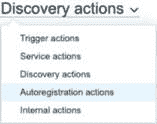
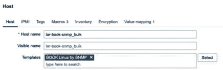

# 第七章：7

# 使用发现自动创建

本章将重点介绍如何确保作为 Zabbix 管理员，你在主机和项目创建上的工作最少。我们将学习如何进行（或者更精确地说，完善）自动化的主机、项目触发器和图形创建。查看这里的食谱，看看我们将要发现什么。

在本章中，我们将首先学习如何通过 Zabbix agent 和 **简单网络管理协议**（**SNMP**）设置 Zabbix 网络发现。接下来，我们将设置主动 agent 自动注册。随后，我们还将讨论如何使用 **低级** **发现**（**LLD**）自动创建 Windows 性能计数器、**Java 管理扩展**（**JMX**）和 SNMP 项目。

在本章中，我们将介绍以下食谱：

+   设置 Zabbix agent 主机发现

+   使用 Zabbix SNMP 网络发现

+   通过主动 agent 自动注册实现主机创建自动化

+   使用 Windows 性能计数器发现

+   发现 JMX 对象

+   以新的方式设置 Zabbix SNMP 发现

+   使用 LLD 和自定义 JSON 创建主机

# 技术要求

由于本章主要讲解主机和项目的发现，除了我们的 Zabbix 服务器，我们还需要一台新的 Linux 主机和一台 Windows 主机。这两台主机都需要安装 Zabbix agent 2，但暂时不需要配置。

此外，我们还需要配置好的 JMX 主机，如 *第三章* 中所述，*Zabbix 监控设置*，以及一台已设置 SNMP 的新主机。要了解如何设置一个 SNMP 监控的主机，请查看 *第三章* 中的 *使用旧方式监控 SNMP* 食谱，*Zabbix 监控设置*。

# 设置 Zabbix agent 网络发现

很多 Zabbix 管理员大量使用 Zabbix agent，因此花费很多时间手动创建 Zabbix agent 主机。也许他们不知道如何设置 Zabbix agent 发现，也许他们还没有时间设置，或者他们只是偏好这种方式。如果你已经准备好开始使用 Zabbix agent 发现，那么在这个食谱中我们将学习如何轻松设置它。

## 准备工作

除了我们的 Zabbix 服务器，在本章的介绍中，我提到我们将需要两台（空的）主机，并且安装了 Zabbix agent 2：一台 Windows 主机和一台 Linux 主机。如果你不知道如何安装 Zabbix agent 2，请参考 *第三章*，*Zabbix 监控设置*，或者查看 Zabbix 文档 [`www.zabbix.com/documentation/current/en/manual/concepts/agent2`](https://www.zabbix.com/documentation/current/en/manual/concepts/agent2)。

我们给服务器分配以下主机名：

+   **lar-book-disc-lnx**：适用于 Linux 主机（使用 Zabbix agent 2）

+   **lar-book-disc-win**：适用于 Windows 主机（使用 Zabbix agent 2）

## 如何操作…

按照以下步骤操作：

1.  让我们从登录到我们的**lar-book-disc-lnx** Linux 主机开始，编辑以下文件：

    ```
    vim /etc/zabbix/zabbix_agent2.conf
    ```

1.  现在，确保你的 Zabbix agent 2 配置文件至少包含以下行：

    ```
    Hostname=lar-book-disc-lnx
    ```

1.  对于你的 Windows Zabbix agent，重要的是执行相同的操作。编辑以下文件：

    ```
    C:\Program Files\Zabbix Agent 2\zabbix_agent2.conf
    ```

1.  现在，通过编辑以下行来更改主机名：

    ```
    Hostname=lar-book-disc-win
    ```

1.  接下来，在我们的 Zabbix 前端，导航至**数据采集** | **发现**，在此页面上，我们点击**创建发现规则**来创建一个具有以下设置的规则：


图 7.1 – Zabbix agent 主机的发现规则页面

重要提示

在本示例中，我们使用的更新间隔为**5**分钟。由于这可能会占用你服务器的很多资源，因此请确保根据你的生产环境调整该值。例如，一小时可能是一个更合适的生产值，以确保我们对 Zabbix 进程施加较少的负载。根据我们扫描的 IP 范围的大小和你希望多快发现设备，我们可以调整此值。

1.  点击蓝色的**添加**按钮继续。

1.  在设置完发现规则后，我们还需要设置一个操作来实际创建带有正确模板的主机。导航至**警报** | **操作** | **发现操作**：


图 7.2 – 警报 | 操作 | 发现操作

1.  在这里，我们将点击右上角的**创建操作**按钮，并在下一页填写以下信息：


图 7.3 – Zabbix agent 主机的发现操作创建页面

小贴士

在创建 Zabbix 操作时，重要的是记住**条件**的创建顺序。前面截图中看到的标签将按创建顺序添加。这意味着，如果你对所有操作保持相同的创建顺序，跟踪你的 Zabbix 操作会更加容易。

1.  接下来，点击**操作**标签。在这里我们将添加以下内容：


图 7.4 – Zabbix agent 主机的操作页面

1.  这就是 Linux agent 的设置。点击蓝色的**添加**按钮，我们继续进行 Windows 发现规则的设置。

1.  导航至**数据采集** | **主机组**。通过点击右上角的**创建主机组**来为我们的 Windows 主机创建一个主机组，并填写组名：


图 7.5 – Windows 服务器主机的创建主机组页面

1.  点击蓝色的**添加**按钮并导航至**警报** | **操作**。

1.  再次进入**发现操作**并点击**创建操作**。这次我们将填写相同的内容，但针对我们的 Windows 主机：


图 7.6 – Windows Zabbix 代理的发现操作创建页面

1.  在点击**添加**之前，我们还需要填写**操作**页面，内容如下截图所示：


图 7.7 – Windows Zabbix 代理的操作页面

1.  现在，我们可以点击蓝色的**添加**按钮，我们的第二个发现操作已经显示。

1.  继续到**监控** | **发现**。在这里我们可以看到我们的主机是否以及何时被发现：


图 7.8 – 监控 | 发现页面

提示

使用**监控** | **发现**页面密切关注您期望出现在 Zabbix 设置中的主机。它非常有用，可以跟踪新主机的加入，并查看用于创建主机的 Zabbix 发现规则。

## 它是如何工作的…

网络发现最初可能并不难设置，但有很多选项需要配置。在这个示例中，我们选择使用`agent.hostname`键作为我们的检查。我们根据 Zabbix 代理配置文件中的配置创建 Zabbix 主机名。

发生的情况是，Zabbix 网络发现找到我们的主机并执行我们的检查。在这种情况下，检查是*Zabbix 代理使用的主机名是什么？* 这些信息，加上我们的 IP 地址，然后触发操作。我们的操作接着执行我们配置的检查：

+   主机名是否包含**lnx**或**win**？

+   发现状态是否为**UP**？

+   服务类型是否为**Zabbix Agent**？

如果所有这些检查都为真，我们的操作将创建我们新发现的主机，具体如下：

+   我们配置的主机组和默认的**已发现的主机**主机组

+   我们在操作中配置的模板

我们将最终获得两个新创建的主机，所有设置都已正确配置：


图 7.9 – 数据收集 | 主机页面，展示了我们的新主机，Windows 和 Linux

## 还有更多…

通过配置文件设置创建主机并不总是最合适的方式，但它是使用网络发现的一个坚实起点。

如果您希望拥有一个更灵活的环境，甚至不需要触及 Zabbix 代理配置文件，那么您可能希望在发现规则中使用不同的检查。可以查看 Zabbix 文档中哪些键可以用来构建不同的发现规则，网址：[`www.zabbix.com/documentation/current/en/manual/config/items/itemtypes/zabbix_agent`](https://www.zabbix.com/documentation/current/en/manual/config/items/itemtypes/zabbix_agent)。

# 使用 Zabbix SNMP 网络发现

如果你需要处理大量的 SNMP 设备，但不总是想手动设置监控，网络发现就是你需要的方式。Zabbix 网络发现使用与 Zabbix 代理发现相同的功能，但配置方法不同。

## 准备就绪

要开始使用网络发现，我们需要一个可以使用 SNMP 进行监控的主机。如果你不知道如何设置这样的主机，可以查看 *第三章* 中的*使用传统方式进行 SNMP 监控*食谱，*设置 Zabbix 监控*部分。我们还需要我们的 Zabbix 服务器。

## 如何操作...

按照以下步骤操作：

1.  首先，登录到你新的 SNMP 监控主机并将主机名更改为以下内容：

    ```
    hostnamectl set-hostname lar-book-disc-snmp
    exec bash
    ```

1.  然后，使用以下命令重启 SNMP 守护进程：

    ```
    systemctl restart snmpd
    ```

1.  现在，导航至**数据收集** | **发现**，并点击右上角的**创建发现规则**。

1.  我们将创建一个新的 SNMP 发现规则，选择 SNMP **对象标识符**（**OID**）检查类型。首先填写**名称**和**IP 范围**字段，像这样：


图 7.10 – 数据收集 | 发现，SNMPv2 发现规则创建页面

1.  确保在**IP** **范围**字段中填写你自己的 IP 范围。

1.  现在，我们要创建我们的 SNMP 检查。点击**检查**旁边的**添加**，你将看到以下弹出窗口：


图 7.11 – 数据收集 | 发现，发现检查创建弹出窗口

1.  我们希望**检查类型**为**SNMPv2 代理**，并希望填写我们的社区和一个有用的 OID，在本例中将是系统名称的 OID。填写如下：


图 7.12 – 数据收集 | 发现，带有 SNMPv2 检查的发现检查创建弹出窗口

重要提示

请注意，我们的检查类型*不是*与 SNMP 版本无关的。我们有三种 SNMP 版本，因此有三种不同的检查类型可以选择，这与我们在 Zabbix 7 主机界面上选择 SNMP 接口的方式不同。

1.  再次点击**添加**，然后填写页面的其余部分，如下所示：


图 7.13 – 数据收集 | SNMPv2 代理的发现页面

1.  最后但同样重要的是，点击页面底部的**添加**按钮。这就完成了我们 Zabbix 发现规则的创建。

1.  我们还需要一个操作来从发现规则中创建我们的主机。导航至**警报** | **操作**，然后使用下拉菜单选择**发现操作**，点击**创建操作**。

1.  我们将填写以下信息：


图 7.14 – 警报 | 操作，SNMPv2 代理的操作创建页面

1.  在点击 **添加** 之前，导航到 **操作** 并填写此页面的以下详细信息：


图 7.15 – 警报 | 操作，SNMPv2 代理的操作创建操作选项卡

1.  现在，点击 **添加**，并导航到 **监控** | **发现**，查看我们的主机是否被创建：


图 7.16 – SNMPv2 代理的监控 | 发现页面

## 它是如何工作的…

在这个配方中，我们创建了另一个发现规则，但这次是针对 SNMP。正如你所注意到的，原则保持不变，但应用稍有不同。

当我们创建这个 Zabbix 发现规则时，我们给它添加了两个检查，而不是前一个配方中只做一个检查。我们在 `.1.3.6.1.2.1.1.5.0` SNMP OID 上创建了一个检查，通过 SNMP 检索设备的主机名。然后，我们将从系统中检索到的主机名放入 Zabbix，作为系统的 Zabbix 主机名。

我们还在 `.1.3.6.1.2.1.25.1.4.0` SNMP OID 上创建了一个检查。此检查将检索以下字符串（如果存在）：

```
"BOOT_IMAGE=(hd0,gpt2)/vmlinuz-4.18.0-193.6.3.el8_2.x86_64 root=/dev/mapper/cl-root ro crashkernel=auto resume=/dev/mapper/cl-swa"
```

如果字符串存在，这意味着该主机的启动镜像是 Linux。这是我们如何通过检索多个 OID 在 Zabbix 发现规则中进行多个检查的一个完美示例。如果我们监控的是网络设备，比如，我们可以选择一个 OID 来判断它是 Cisco 还是 Juniper 设备。我们可以用任何 OID 替换 `.1.3.6.1.2.1.25.1.4.0` 并进行轮询。然后，我们将根据收到的结果（Juniper 或 Cisco）创建操作，并相应地添加我们的模板。

重要提示

创建 Zabbix 发现规则时，对 SNMP 结构的一般知识非常重要。我们需要确保使用正确的 SNMP OID 作为检查。务必做好研究，使用 SNMP walk，并规划出要使用的 OID 以发现 SNMP 代理。这样，你就能构建出一个稳固的监控基础设施。

# 使用主动代理自动注册自动化主机创建

使用发现功能来设置 Zabbix 代理是自动化主机创建的一个非常有用的方法。但如果我们想进一步直观地了解我们的环境，并进行更多的自动化呢？这时我们可以使用 Zabbix 的一个功能叫做 **主动** **代理自动注册**。

## 准备就绪

对于这个配方，我们将需要一台新的 Linux 主机。我们将这台主机命名为 `lar-book-lnx-agent-auto`。确保在此主机上安装 Zabbix agent 2。除了这台新主机，我们还需要我们的 Zabbix 服务器。

## 如何操作…

1.  让我们从登录到新创建的 **lar-book-lnx-agent-auto** 主机并修改以下文件开始：

    ```
    vim /etc/zabbix/zabbix_agent2.conf
    ```

1.  然后我们将编辑文件中的以下行。确保在该行输入你的 Zabbix 服务器 IP：

    ```
    ServerActive=10.16.16.152
    ```

1.  如果我们希望手动在文件中设置主机名，我们还可以更改文件中的以下行：

    ```
    Hostname=lar-book—lnx-agent-auto
    ```

    然而，这并不是强制要求，因为如果未填写，Zabbix 代理将使用系统主机名。

1.  接下来，我们将导航到我们的 Zabbix 前端，进入**警报** | **操作**。

1.  使用下拉菜单进入**自动注册操作**，如下截图所示：



图 7.17 – 警报 | 操作页面下拉菜单

1.  现在，我们将点击右上角的蓝色**创建操作**按钮来创建一个新的操作。

1.  填写**名称**字段，然后点击**添加**文本链接：


图 7.18 – 警报 | 操作，创建新操作页面

1.  我们可以在这里设置条件，只注册具有特定主机名的主机。我们可以通过如下填写窗口来实现：


图 7.19 – 创建操作 | 新条件，针对 lar-book-lnx 主机

您的页面现在应该如下所示：


图 7.20 – 创建操作页面，已填写我们为 lar-book-lnx 主机提供的信息

提示

我们可以为不同类型的主机设置条件。例如，如果我们想添加 Windows 主机，我们可以设置一个带有不同主机名过滤器的新操作。这样，即使使用自动注册，也能轻松维护正确的组和模板。

1.  在点击蓝色的**添加**按钮之前，我们先进入**操作**标签页。

1.  点击**添加**文本链接，您将看到以下窗口：


图 7.21 – 发送消息操作，针对 lar-book-lnx 主机

1.  创建一个操作，将主机添加到**Linux 服务器**主机组：


图 7.22 – 添加到主机组操作创建

1.  创建一个操作，将主机添加到**Zabbix 代理**的**Linux 活跃**模板中：


图 7.23 – 链接到模板操作创建

1.  您最终的**操作**页面应该如下所示，我们可以点击蓝色的**添加**按钮：


图 7.24 – 操作页面，已填写我们为 lar-book-lnx 主机提供的信息

1.  导航到**数据收集** | **主机**，我们可以看到我们新的活跃自动注册主机：


图 7.25 – 数据收集 | 主机页面，显示主机 lar-book-lnx-agent-auto

## 如何操作…

主动代理自动注册是一种让主机自行注册的可靠方法。一旦在 Zabbix 服务器或代理的配置文件中设置了`ServerActive=`行，主机代理将开始向 Zabbix 服务器或代理请求配置数据。Zabbix 服务器会收到这些请求，如果在 Zabbix 中设置了某个动作（就像我们在本教程中所做的），主机将自动注册到 Zabbix。


图 7.26 – 主机自动注册过程

我们可以使用这个功能做一些非常酷的自动化工作。我们可以创建一个脚本，将正确的`ServerActive=`行填充到特定 IP 池中主机的 Zabbix 代理配置文件里。

使用 Ansible 设置新主机也会变得非常简单。我们可以通过 Ansible 自动化 Zabbix 代理的安装，同时也可以使用 Ansible 在`/etc/zabbix/zabbix_agent2.conf`文件中添加`ServerActive=`行。从这里开始，我们的 Zabbix 服务器自动注册动作将处理其余部分。

Zabbix 代理自动注册是实现零接触监控环境的完美方式，这样我们就可以确保所有最新的主机始终保持最新状态。

## 还有更多内容…

并不是每个公司使用的主机名都能反映机器的操作系统或其他属性。这时，Zabbix `HostMetadata` 就显得非常有用。我们可以将此字段添加到主动 Zabbix 代理配置中，以反映机器的属性。

之后，我们可以在 Zabbix 发现动作中使用`HostMetadata`，以执行与主机名相同类型的过滤。

我们还可以在 Zabbix 代理配置文件中找到`HostInterface`和`HostInterfaceItem`参数，它们用于自动注册。主机将使用指定的 IP 或 DNS 名称作为其 Zabbix 代理接口的 IP 或 DNS，如在 Zabbix 前端所示。我们还可以使用此功能，在使用自动注册创建主机时启用被动代理监控。

查看此链接了解更多信息：

[`www.zabbix.com/documentation/current/manual/discovery/auto_registration#using_host_metadata`](https://www.zabbix.com/documentation/current/manual/discovery/auto_registration#using_host_metadata)

# 使用 Windows 性能计数器发现

在 Zabbix 7 中，已经可以发现 Windows 性能计数器。在本教程中，我们将介绍如何发现 Windows 性能计数器并在我们的环境中使用它们。

发现 Windows 性能计数器最初看起来可能有点复杂，因为它同时使用了 Windows 和 Zabbix 特有的概念。然而，一旦完成这个教程，你将会完全了解如何设置它。

## 准备工作

在本章中，我们将`lar-book-disc-win`主机添加到我们的设置中，这也是我们在 Zabbix 代理发现过程中使用的主机。我们可以重复使用此主机来轻松发现 Windows 性能计数器。

当然，我们还需要我们的 Zabbix 服务器。

## 如何实现…

1.  首先，导航到 **数据收集** | **模板**，并通过点击右上角的 **创建模板** 来创建一个新的模板。

1.  创建以下模板：


图 7.27 – Windows 性能通过 Zabbix 代理模板创建

1.  点击蓝色的 **添加** 按钮，这将带你回到 **数据收集** | **模板**。选择新模板。

1.  现在，在继续模板之前，导航到你的 Windows 前端并打开 **perfmon.exe**：


图 7.28 – Windows 搜索栏 – perfmon.exe

1.  这样做会打开以下窗口：


图 7.29 – Windows perfmon.exe

1.  让我们点击 **性能监视器**，然后点击绿色的 **+** 图标。这将显示所有可用的 Windows 性能计数器。

1.  首先，我们使用 **处理器** 计数器。

1.  返回到 Zabbix 中的 **数据收集** | **模板** 页面，编辑我们新的 **Windows 性能通过 Zabbix** **代理** 模板。

1.  当你进入 **编辑模板** 页面时，点击模板名称旁边的 **发现规则**。

1.  点击右上角的 **创建新发现规则**，并添加以下规则：


图 7.30 – 创建 LLD 规则页面 – 发现计数器 处理器

重要提示

在这个示例中，我们使用 **1** 分钟的更新间隔。由于这可能会占用服务器大量资源，请确保根据你的生产环境调整此值。例如，一个小时是更适合生产环境的值。

1.  点击底部的蓝色 **添加** 按钮，然后点击我们新的 **发现计数器 处理器** 发现规则。

1.  点击 **项原型**，然后在右上角点击 **创建项原型**。我们将创建以下项原型：


图 7.31 – CPU 实例 C1 时间项原型创建

1.  在 **标签** 选项卡中，别忘了添加以下一些新标签：


图 7.32 – 标签选项卡

1.  保存新的 **项原型**，然后转到 **数据收集** | **主机**，并点击 **lar-book-disc-win**。

1.  添加我们的 **Windows 性能通过 Zabbix** **代理** 模板：


图 7.33 – 将 Windows 性能通过 Zabbix 代理模板添加到 lar-book-disc-win

1.  点击蓝色的 **更新** 按钮后，我们可以导航到 **监控** | **最新数据**。添加以下过滤条件：


图 7.34 – 主机 lar-book-disc-win 的最新数据过滤

1.  现在我们可以看到我们新创建的三个项目：


图 7.35 – 我们的主机 lar-book-disc-win 的监控 | 最新数据页面

## 工作原理…

Windows 性能计数器已经存在了很长时间，并且对于任何想要使用 Zabbix 监控 Windows 机器的人来说，它们都是非常重要的。将 LLD 与 Windows 性能计数器结合使用，使构建坚固的 Windows 监控变得更加容易和灵活。

在本教程中，我们通过添加带有 `perf_instance.discovery[Processor]` 项键的发现规则，创建了一个非常简单但有效的 Windows 性能计数器发现规则。此项键中的`[Processor]`部分与我们看到的`perfmon.exe`窗口直接相关。如果我们查看以下截图，已经可以看到**Processor**列出：


图 7.36 – perfmon.exe | 添加计数器 – 处理器

当我们的发现规则轮询此项键时，Zabbix 代理将返回以下值：

```
[
   {
      "{#INSTANCE}":"0"
   },
   {
      "{#INSTANCE}":"1"
   },
   {
      "{#INSTANCE}":"_Total"
   }
]
```

这个值意味着 Zabbix 会用三个值填充`{#INSTANCE}`宏：

+   **0**

+   **1**

+   **_ 总计**

然后，我们可以通过在**项目原型**中使用`{#INSTANCE}`宏来使用这三个值，正如我们在这里所做的那样：


图 7.37 – 我们创建的项目原型，CPU C1 时间

然后，它会创建三个带有宏值的项目，使用正确的键来监控计数器的第二部分 – `% C1 时间`。如果你在 `perfmon.exe` 文件中展开窗口，你可以看到我们可以添加到项目原型中的所有不同计数器，从而监控更多 Windows 性能计数器：


图 7.38 – Perfmon.exe | 添加计数器 – 处理器（展开）

# 发现 JMX 对象

在*第三章*，*设置 Zabbix 监控*中，我们已经讲解了如何在标题为*设置 JMX 监控*的教程中设置 JMX 监控。不过，我们还没有讲到如何发现 JMX 对象。

在这个教程中，我们将讲解如何使用 LLD 设置 JMX 对象，并且完成本教程后，你将知道如何设置它。

## 准备工作

对于本教程，我们将需要你在*第三章*，*设置 Zabbix 监控*中设置的 JMX 主机。确保在进行本教程之前完成该教程。

我们还需要我们的 Zabbix 服务器以及名为 `lar-book-jmx` 的 Zabbix JMX 主机。

## 如何操作…

1.  让我们从登录到 Zabbix 前端并导航到**数据收集** | **模板**开始这个教程。

1.  点击右上角的**创建模板**，创建一个新的模板。填写以下字段：


图 7.39 – App Apache Tomcat JMX 发现模板创建

1.  点击蓝色的**添加**按钮后，你将返回到**数据收集** | **模板**。点击你新创建的**App Apache Tomcat JMX** **发现**模板。

1.  我们现在将添加 JMX 发现规则。点击**发现规则**，位于模板名称旁边。

1.  现在，点击**创建发现规则**并填写以下字段：


图 7.40 – 发现 JMX 对象 MemoryPool 发现规则创建

1.  点击页面底部的蓝色**添加**按钮。然后，点击新创建的**发现 JMX 对象 MemoryPool** 发现规则旁边的**项目原型**。

1.  我们现在将在右上角点击**创建项目原型**按钮，并创建以下项目原型：


图 7.41 – 项目原型创建页面 – MemoryPool 内存类型

1.  此外，确保在**标签**选项卡中添加一个新标签，名称为**组件**，值为**memory pool**：


图 7.42 – 标签选项卡 – MemoryPool 内存类型

1.  让我们点击蓝色的**添加**按钮，然后继续。

1.  转到**数据收集** | **主机**，点击**lar-book-jmx**。我们将向该主机添加模板。

1.  点击**模板**并添加模板，如下所示：


图 7.43 – 数据收集 | 主机 – 向 lar-book-jmx 主机添加模板

1.  点击蓝色的**更新**按钮。

1.  当我们现在导航到**监控** | **最新数据**时，我们将选择**lar-book-jmx**作为**主机**，并选择**组件**作为**标签**，其值为**memory pool**，如下所示：


图 7.44 – 监控 | 最新数据页面过滤器 – lar-book-jmx 主机

1.  我们接着会看到以下结果：


图 7.45 – 具有我们结果的 lar-book-jmx 主机的监控 | 最新数据页面

## 它是如何工作的……

初次监控 JMX 应用程序可能会让人感到相当艰巨，因为在构建自己的 LLD 规则时需要处理大量的工作。但现在，既然你已经为 JMX 构建了第一个 LLD 规则，结构就变得清晰了。

首先，对于我们的发现规则，我们选择了项目键：

```
jmx.discovery[beans,"*:type=MemoryPool,name=*"]
```

`MemoryPool`是我们在 Java 中称之为**MBean**的东西。我们轮询这个 MBean 对象以获取多个 JMX 对象，并相应地填充宏。

我们选择了 `name=*` 对象来填充此发现规则中的 `{#JMXNAME}` 宏。然后，我们的宏被用在项目原型中来创建项目。

然后我们的项目就像这样创建：


图 7.46 – 我们的 JMX 监控主机上的项

如果我们查看项目的键，可以看到我们在每个具有不同名称的 `MemoryPool` 上轮询 `Type` JMX 属性。

这就是我们轻松创建 JMX LLD 规则的方法。

## 还有更多…

如果你不熟悉 MBeans，确保查阅 Java 文档。这将帮助你理解 MBeans 是什么，以及如何利用它们来监控 JMX 属性：[`docs.oracle.com/javase/tutorial/jmx/mbeans/index.html`](https://docs.oracle.com/javase/tutorial/jmx/mbeans/index.html)。

提示

在深入使用 JMX 对象发现之前，深入阅读前面的 JMX 对象文档。文档中有大量信息，它将大大提高你创建这些 LLD 规则的技能。

## 使用新方法设置 Zabbix SNMP LLD

Zabbix 6.4 对我们 Zabbix 环境中使用 SNMP 进行了彻底的更新。尽管旧的方式仍然可用（并在本书中有解释），但使用新的方法来构建 SNMP 监控可能会更好，因为它将实际使用 `GetBulk` 请求。这使得 SNMP 监控更高效，并且对我们从中收集数据的 SNMP 设备负担更小。

## 准备工作

在开始使用本教程之前，请先阅读*第三章*，*以新方式设置 SNMP 监控*。我们将需要那一章的知识来设置 SNMP LLD 发现，同时我们也将使用那一章中的一些主机和项目。确保你已经具备以下内容：

+   你的 Zabbix 环境

+   **lar-book-snmp_bulk** 主机如在*第三章*中设置，*设置 Zabbix 监控*

## 如何操作…

正如我们在*第三章*中设置了 SNMP 服务器以开始监控一样，*设置 Zabbix 监控*，我们可以立即在前端开始。在*第五章*，*构建你自己的结构化模板*，我们还学习了如何为所有监控创建模板，所以让我们从这里开始。按照以下步骤操作：

1.  在 Zabbix 前端，导航到 **数据收集** | **模板** 并点击右上角的 **创建模板**。我们将按如下方式创建一个新模板。


图 7.47 – 通过 SNMP 模板的 BOOK Linux

1.  另外，确保切换到 **标签** 选项卡，根据新的标签策略添加一些标签：


图 7.48 – 模板 BOOK Linux by SNMP 宏选项卡

1.  在窗口底部，点击我们之前设置的**lar-book-snmp_bulk**主机。让我们首先使用批量更新功能将值映射复制到我们的新模板中。

1.  在列表中选择你的模板，勾选复选框，然后点击窗口底部的**批量更新**按钮。


图 7.49 – 批量更新

1.  在**批量更新**中，切换到**值映射**标签，勾选复选框，然后点击小的带点下划线的**从主机添加**按钮。

1.  找到你的**lar-book-snmp_bulk**主机，并从列表中选择**接口启用/禁用**。它应该是这样的。


图 7.50 – 批量更新 – 从主机添加值映射

1.  现在，你可以点击窗口底部的**更新**按钮来添加此值映射。

1.  现在，我们来复制模板中的现有项目。进入**数据收集** | **主机**，然后进入**项目**，选择**lar-book-snmp_bulk**。勾选我们之前创建的两个项目，并点击窗口底部的**复制**按钮。


图 7.51 – 需要复制的 lar-book-snmp_bulk 项目

1.  将**目标类型**设置为**模板**，并输入**BOOK Linux by SNMP**。选择它后点击**复制**。


图 7.52 – lar-book-snmp_bulk 项目复制窗口

1.  现在，返回到**数据收集** | **模板**，并点击你的**BOOK Linux by SNMP**模板中的**发现**。

1.  在右上角，点击**创建发现规则**按钮。我们将在此创建以下 LLD 规则。


图 7.53 – 发现规则

我们将创建**依赖项**类型的 LLD 规则，以确保我们使用之前在**SNMP 接口批量**项目上收集的数据。然而，所有 LLD 数据必须以 JSON 数据格式呈现，因此让我们确保首先转换数据。

1.  切换到**预处理**标签并添加以下内容。


图 7.54 – 预处理

1.  现在，点击窗口底部的**添加**按钮来添加 LLD 规则。然后，进入**项目原型**以自动方式添加我们的第一个项目。

1.  在右上角，点击**创建项目原型**，并创建以下项目原型：


图 7.55 – 项目原型

1.  别忘了在**标签**标签中添加你的标签，然后再添加项目原型：


图 7.56 – 项目标签

1.  我们还需要一个预处理步骤来提取正确的信息，因此让我们通过进入**预处理**标签来添加这个步骤：


图 7.57 – 预处理

1.  现在，点击页面底部的大**添加**按钮以完成设置此新项目原型。

1.  我们还没有在主机上使用该模板，所以让我们导航到 **数据收集** | **主机** 并点击我们的 **lar-book-snmp_bulk** 主机。然后，添加模板。



图 7.58 – 将 SNMP 模板 BOOK Linux 添加到 lar-book-snmp_bulk

1.  点击窗口底部的**更新**按钮以添加模板。

1.  LLD 规则现在应该已经添加并执行。让我们查看是否已创建项目，方法是导航到 **监控** | **最新数据** 并按 **lar-book-snmp_bulk** 主机进行筛选。请记住，项目显示出来可能需要大约一分钟，收集数据可能需要另一分钟。


图 7.59 – lar-book-snmp_bulk – LLD 规则后的最新数据

## 它是如何工作的……

那么，这个新的 LLD 发现是如何工作的呢？正如你可能已经注意到的，我们仍然使用与 *第三章* 中相同的项目，*设置 Zabbix 监控*。OID `.1.3.6.1.2.1.2.2.1` 下的所有值仍然以批量方式进行收集。为了回顾大宗度量数据收集，我们再看一下这些数据：


图 7.60 – lar-book-snmp_bulk 原始大宗度量数据

我们在 SNMP walk 项目中已经拥有所有所需的数据。我们之后添加的所有项目和发现规则都在使用这些数据，并通过 Zabbix 服务器（或代理）预处理过程对其进行解析。

在 LLD 的情况下，我们需要添加 SNMP walk 到 JSON 预处理步骤，正如你在 *图 7**.54* 中所看到的，这将把正常的 SNMP walk 数据转换为 JSON 数据格式。之后它看起来会像这样：


图 7.61 – 将 lar-book-snmp_bulk 原始大宗度量数据转换为 JSON

它通过查找 OID `.1.3.6.1.2.1.2.2.1.2` 来收集我们想要的值，并将这些值添加到 `{#IFDESCR}` 发现宏中。它还保留了 SNMP 索引，并将其与 `{#SNMPINDEX}` 宏一起使用。

现在，剩下的就是设置我们的项目原型，并使用相同的原始 SNMP walk 项目，按照预处理步骤中的 SNMP walk 值来提取数据，正如我们在*图 7**.57*中所见。我们还需要确保每个项目都是唯一的，因此我们添加了 `{#SNMPINDEX}` 宏来查找每个即将创建的项目的正确值。

就这样，我们在 **SNMP 接口批量** 项目中执行了一个单一的 SNMP `GetBulk` 调用，并利用 Zabbix 依赖项和预处理功能将其进一步拆分。

# 使用 LLD 和自定义 JSON 创建主机

从 LLD 创建主机与从 LLD 规则创建其他内容的方式相同。我们只需要向 Zabbix 安装传递一个兼容的 JSON 格式数据集，并使用该数据创建新主机。然而，从 Zabbix 6.2 版本开始，发生了一些变化。通过 LLD 创建的主机现在可以在创建后进行自定义，所以，让我们来看看如何操作以及它是如何工作的。

## 准备工作

对于本教程，我们需要两样东西：任何 Zabbix 7 安装和一个包含主机及其数据的兼容 JSON 格式数据集。以下是一些可以用来从 LLD 创建主机的优秀默认模板示例：

+   VMware 主机和虚拟化管理程序

+   Kubernetes

+   Azure 和 AWS

然而，对于本示例，我们将使用一个自定义数据集，你可以在 GitHub 上找到： [`github.com/PacktPublishing/Zabbix-7-IT-Infrastructure-Monitoring-Cookbook/blob/main/chapter07/lldhosts.json`](https://github.com/PacktPublishing/Zabbix-7-IT-Infrastructure-Monitoring-Cookbook/blob/main/chapter07/lldhosts.json)。

了解 Zabbix 发送器、依赖项和预处理的基本概念也非常重要。我建议首先阅读*第三章*，《设置 Zabbix 监控》中的以下内容：

+   *创建 Zabbix 简单检查和* *Zabbix trapper*

+   *处理计算和* *依赖项*

+   *使用 Zabbix 预处理来修改* *项值*

## 如何操作…

让我们开始构建这个新的 LLD 规则，使用自定义 JSON 数据集。为此，我们首先需要构建一个 JSON 文件，或者从我们的一些数据源中获取。我们已经为你准备好了一个：

1.  首先，让我们查看位于此处的 JSON 文件：

    [`raw.githubusercontent.com/PacktPublishing/Zabbix-7-IT-Infrastructure-Monitoring-Cookbook/main/chapter07/lldhosts.json`](https://raw.githubusercontent.com/PacktPublishing/Zabbix-7-IT-Infrastructure-Monitoring-Cookbook/main/chapter07/lldhosts.json)

1.  接下来，让我们登录到 Zabbix 服务器 CLI，确保我们已经安装了 Zabbix 发送器应用程序。我们将使用它将文件发送到 Zabbix 环境：

    对于基于 RHEL 的系统，请使用以下内容：

    ```
    dnf install zabbix-sender
    ```

    对于 Ubuntu 系统，请使用以下内容：

    ```
    apt install zabbix-sender
    ```

1.  让我们设置**zabbix-sender**应用程序，每分钟将此 JSON 文件发送到我们的系统。为了简化操作，我们将暂时使用 CronJob：

    ```
    crontab -e
    ```

1.  将以下内容添加到 CronJob 文件：

    ```
    * * * * * zabbix_sender -z 127.0.0.1 -s lar-lldhost-creation -k lldhosts.raw -o '[{"vmname":"lar-lld-host1","vmip":"10.16.16.200","vmlocation":"Amsterdam"},{"vmname":"lar-lld-host2","vmip":"10.16.16.201","vmlocation":"London"},{"vmname":"lar-lld-host3","vmip":"10.16.16.202","vmlocation":"Chicago"},{"vmname":"lar-lld-host4","vmip":"10.16.16.203","vmlocation":"Tirana"}]' >/dev/null 2>&1
    ```

    上述内容只是 CronJob + Zabbix 发送器命令的组合，构建方式如下：

    ```
    * * * * *
    zabbix_sender -z 127.0.0.1 -s lar-lldhost-creation -k lldhosts.raw -o
    FILE CONTENT FROM GITHUB
    >/dev/null 2>&1
    ```

1.  现在，让我们切换到 Zabbix 前端，在这里我们将添加一个主机来接收来自 JSON 文件的数据。

1.  要添加主机，请导航到**数据采集** | **主机**，然后点击右上角的**创建主机**按钮。添加以下主机：


图 7.62 – Zabbix 主机创建窗口，展示 lar-lldhost-creation 主机

1.  点击窗口底部的 **添加** 按钮，完成此主机的创建。然后你将被带回 **数据收集** | **主机**。

1.  在此页面上，点击我们刚创建的 **lar-lldhost-creation** 主机旁边的 **项目**。在右上角，点击 **创建项目**，然后创建以下项目：


图 7.63 – lar-lldhost-creation 主机的 Zabbix 项目创建页面

1.  确保还要为项目添加标签：


图 7.64 – lldhosts.raw 项目的 Zabbix 标签创建页面

1.  现在，按下页面底部的大 **添加** 按钮。经过 Zabbix 服务器重新加载配置缓存后，我们应该在一两分钟内看到该项目的数据开始流入。

1.  同时，我们可以开始构建 LLD 规则。仍在主机编辑页面时，导航至 **发现规则**。点击右上角的 **创建发现规则**。我们将添加以下内容：


图 7.65 – 来自 hosts.from.json 的 Zabbix LLD 规则创建页面

1.  接下来，点击 **LLD 宏**，让我们定义一些从文件中使用的宏：

    ```
       {
          "vmname":"lar-lld-host1",
          "vmip":"10.16.16.200",
          "vmlocation":"Amsterdam"
       }
    ```

    我们将使用 JSONPath 将前面的数据块转换为以下内容：

    ```
       {
          "{#VMNAME}":"lar-lld-host1",
          "{#VMIP}":"10.16.16.200",
          "{#VMLOCATION}":"Amsterdam"
       }
    ```

1.  为此，切换到名为 **LLD 宏** 的标签页，并定义以下内容：


图 7.66 – 来自 hosts.from.json 的 Zabbix LLD 宏标签页

1.  现在，我们可以点击此页面底部的大 **添加** 按钮，LLD 规则就创建好了。

1.  然而，要对 LLD 规则进行操作，我们必须创建一个新的主机原型。为此，点击 **主机原型**，然后点击右上角的 **创建主机原型**。我们将添加以下内容：


图 7.67 – Zabbix LLD 主机原型创建页面

如你所见，我们使用宏来创建 **虚拟机**（**VM**）的名称，并创建一个唯一的主机组。

1.  我们还将通过切换接口至 **自定义**，按下小的带下划线的 **添加** 按钮，并添加以下内容，来使用宏定义接口：


图 7.68 – 带有自定义接口的 Zabbix LLD 主机原型创建页面

1.  现在，你可以点击页面底部的大 **添加** 按钮。这将添加主机原型。

1.  现在，导航到 **数据收集** | **主机**，在等待几分钟后，我们应该能看到新创建的主机：


图 7.69 – 通过 LLD 创建的 Zabbix 主机

## 它是如何工作的…

LLD 是 Zabbix 世界中的一个广泛主题，因此，它可能变得相当复杂。正如我们所看到的，我们在这个示例中使用了一个完全自定义的 JSON 文件。

在我们深入了解结果之前，请记住，定制的 JSON 可以从任何地方创建。这可以是一个自定义的（Python、Perl、PowerShell）脚本，一些 API 检查，或其他任何东西。另外，有时候 JSON 是由 Zabbix 环境本身提供的。只要我们遵循以下格式（无论文件中是否直接包含宏），任何内容都可以解析为 Zabbix LLD 规则：

```
[
   {
      "vmname":"lar-lld-host1",
      "vmip":"10.16.16.200",
      "vmlocation":"Amsterdam"
   },
   {
      "vmname":"lar-lld-host2",
      "vmip":"10.16.16.201",
      "vmlocation":"London"
   },
   {
      "vmname":"lar-lld-host3",
      "vmip":"10.16.16.202",
      "vmlocation":"Chicago"
   },
   {
      "vmname":"lar-lld-host4",
      "vmip":"10.16.16.203",
      "vmlocation":"Tirana"
   }
]
```

查看以下链接，获取更多示例：

[`www.zabbix.com/documentation/current/en/manual/discovery/low_level_discovery`](https://www.zabbix.com/documentation/current/en/manual/discovery/low_level_discovery)

那么，我们到底通过前面的 JSON 文件创建了什么呢？嗯，我们使用了`vmname`、`vmip`和`vmlocation`这几个 JSON 键及其值来创建一些完全自动化的定制主机。为了做到这一点，首先，我们必须使用**JSONPath**将 JSON 键解析为每个 LLD 规则所需的 LLD 宏：


图 7.70 – 使用 JSONPath 将键转换为 LLD 宏

这将把`vmip`转换为`{#VMIP}`，`vmlocation`转换为`{#VMLOCATION}`，`vmname`转换为`{#VMNAME}`。**JSONPath**正在搜索这些键，而 Zabbix 则为我们将它们转换为宏。

然后，我们在 LLD 主机原型中使用这些宏来定义每个主机的值：


图 7.71 – 我们的 LLD 宏在使用中

结果是我们的主机被创建，并且设置正确：


图 7.72 – 我们的 LLD 规则创建的 lar-lld-host4

如你所见，我们的主机名已填写，定制的主机组也已设置。我们还定义了一个具有正确 IP 的接口。我们现在将在该接口上使用该 IP，使用我们连接到主机的模板开始监控 Zabbix 代理。

## 还有更多…

等等 – 还有更多！从 Zabbix 6.2 开始，主机原型实际上变得非常有用，引入了一些重大变化。现在，可以完全自定义主机设置，例如宏、标签，甚至模板。

这意味着即使主机是从原型创建的，我们仍然可以自定义监控。例如，如果你在 VMware 中发现了你的虚拟机，我们可以自定义 LLD 规则，使其也能自动开始使用 Zabbix 代理进行监控。如果你之后想要覆盖某些宏来更改触发器阈值，假设改变某个触发器的阈值，实际上你是可以做到的。

但请记住，如果你删除了发现主机的主机或 LLD 规则，所有已发现的主机也会被删除。在删除任何内容时要小心，并且随时准备好备份！
