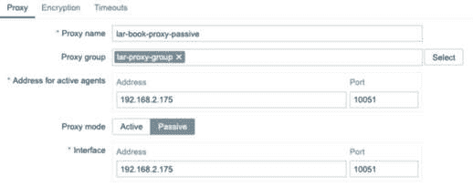

# 8

# 设置 Zabbix 代理

你不能谈论 Zabbix 而不谈论 Zabbix **代理**——最初它是一个不错的补充，但现在已经是必不可少的了。任何期望设置中型或大型 Zabbix 环境的人都需要代理。使用代理的主要原因是可扩展性，因为 Zabbix 代理将数据收集和预处理的负担从 Zabbix 服务器上卸载出去。这样，我们可以进一步扩展 Zabbix 环境，而且更为轻松。此外，代理还可以通过在本地网络中收集数据，然后将其发送到 Zabbix 服务器，为你提供额外的安全层，分散你对数据收集的访问需求，而不是将其集中在单个 Zabbix 服务器上。

在本章中，我们将首先学习如何设置 Zabbix 代理。然后我们将学习如何使用被动和主动 Zabbix 代理，以及如何使用这两种形式的 Zabbix 代理来监控主机。Zabbix 7 还引入了将代理添加到负载均衡池中的功能，我们将在本章中介绍这个新特性。我们还将讨论一些使用代理进行的 Zabbix 网络发现，并学习如何监控 Zabbix 代理以保持其健康。在这些教程完成后，你将没有更多的借口不去设置代理，因为我们将在本章中涵盖代理使用的几乎所有可能形式。

那么，让我们一起来浏览以下教程，看看如何使用 Zabbix 代理：

+   设置 Zabbix 代理

+   使用被动 Zabbix 代理

+   使用主动 Zabbix 代理

+   使用 Zabbix 代理监控主机

+   使用预共享密钥加密 Zabbix 代理连接

+   设置 Zabbix 代理负载均衡

+   使用 Zabbix 代理进行发现

+   监控你的 Zabbix 代理

# 技术要求

本章我们将需要几个新的 Linux 主机，因为我们将把它们作为 Zabbix 代理来构建。

在以下两个新主机上安装你喜欢的 RHEL 或 Ubuntu Linux 发行版，来设置两个代理：

+   **lar-book-proxy-passive**

+   **lar-book-proxy-active**

你还需要一个 Zabbix 服务器，至少有一个被监控的主机。我们将使用以下新主机，并在其上安装 Zabbix 代理进行监控：

```
lar-book-agent-by-proxy
```

# 设置 Zabbix 代理

如果你没有太多 Linux 经验，设置 Zabbix 代理可能会让人感到不知所措，但一旦掌握了它，任务其实非常简单。我们将在`lar-book-proxy-passive`服务器上安装 Zabbix 代理；你可以在`lar-book-proxy-active`上重复这个任务。

## 准备工作

确保有一台新的空 Linux 主机，并准备好并安装你选择的发行版。我们在这个教程中还不需要 Zabbix 服务器。

## 如何操作…

1.  让我们从登录到新**lar-book-proxy-passive**主机的**命令行界面**（**CLI**）开始。

1.  现在，执行以下命令来添加 Zabbix 仓库。对于基于 RHEL 的系统，使用以下命令：

    ```
    rpm -Uvh https://repo.zabbix.com/zabbix/7.0/rhel/8/ x86_64/zabbix-release-7.0-1.el8.noarch.rpm
    dnf clean all
    ```

    对于 Ubuntu 系统，使用以下命令：

    ```
    wget https://repo.zabbix.com/zabbix/7.0/ubuntu/pool/ main/z/zabbix-release/zabbix-release_7.0-1+ubuntu22.04_all.deb
    dpkg -i zabbix-release_7.0-1+ubuntu22.04_all.deb
    apt update
    ```

1.  现在，通过执行以下命令安装 Zabbix 代理。

    对于基于 RHEL 的系统，请使用以下命令：

    ```
    dnf install zabbix-proxy-sqlite3 zabbix-selinux-policy
    ```

    对于 Ubuntu 系统，请使用以下命令：

    ```
    apt install zabbix-proxy-sqlite3
    ```

提示

在基于 RHEL 的服务器上，不要忘记将 **SELinux** 设置为宽松模式或者为生产环境允许 Zabbix 代理运行。对于实验室环境，可以将 SELinux 设置为宽松模式，但在生产环境中，建议保持启用状态。对于 Ubuntu 系统，在实验室环境中，我们可以禁用 AppArmor。

1.  现在，通过执行以下命令编辑 Zabbix 代理配置：

    ```
    passive proxy. The mode will be 1 on this proxy. On the active proxy, this will be 0:

    ```

    ProxyMode=1

    ```

    ```

1.  将以下行更改为您的 Zabbix 服务器地址：

    ```
    Server=10.16.16.152
    ```

重要提示

在与 Zabbix 服务器一起使用 **高可用性** (**HA**) 时，请确保为集群中每个节点添加 Zabbix 服务器 IP 地址。代理将仅向活动节点发送数据。请注意，HA 节点之间用分号 (**;**) 而不是逗号 (**,**）分隔。

1.  将以下行更改为您的代理主机名：

    ```
    sqlite version of the proxy for the example, change the DBName parameter to the following:

    ```

    DBName=/tmp/zabbix_proxy.sqlite3

    ```

    ```

1.  您现在可以使用以下两个命令启用 Zabbix 代理并启动它：

    ```
    systemctl enable zabbix-proxy
    systemctl start zabbix-proxy
    ```

1.  您应该检查 Zabbix 代理日志是否没有显示任何错误，使用以下命令：

    ```
    tail -f /var/log/zabbix/zabbix_proxy.log
    ```

## 工作原理…

有三个版本的 Zabbix 代理可供使用：

+   **zabbix-proxy-mysql**

+   **zabbix-proxy-pgsql**

+   **zabbix-proxy-sqlite3**

我们刚刚完成了 `zabbix-proxy-sqlite3` 包的设置，这是我认为最简单的方法。如果您问我的话，`sqlite3` 版本的 Zabbix 代理使我们能够轻松设置 Zabbix 代理，因为我们实际上不需要过多担心数据库的设置和维护。

请注意，`sqlite3` 版本可能不适合负载非常高的 Zabbix 代理，因为 `sqlite3` 无法进一步扩展。在使用 Zabbix 代理时，使用 `mysql` 或 `postgresql` 数据库可以获得更多的扩展选项，通过这些数据库类型的微调机制。然而，由于在大多数情况下代理的理念是在多个代理之间分配负载，所以一旦我的数据库达到容量上限，我发现添加 SQLite3 代理更容易。

提示

对于将来的需求，始终选择正确类型的 Zabbix 代理。虽然稍后可以轻松切换代理，但在此选择上不要太随意，因为您可能会在未来节省数小时的时间。

`sqlite3` 版本的惊人之处在于，如果我们遇到数据库问题，只需运行以下命令即可轻松删除数据库：

```
rm /tmp/zabbix_proxy.sqlite3
```

有了这个，`sqlite3` Zabbix 代理会在启动时自动创建一个新的数据库，我们现在可以开始重新收集数据了。请注意，我们可能会丢失一些仍在代理数据库中的数据，这些数据作为一个缓存可能包含尚未发送到 Zabbix 的数据。如果数据尚未发送到 Zabbix 并且您删除数据库，则会丢失仍在数据库中的度量标准。

然而，在 Zabbix 7 中，代理数据库的概念有所变化，增加了内存缓存。默认情况下，Zabbix 7 中的代理将以以下三种模式之一运行：

+   混合模式（新安装的默认设置）

+   内存

+   磁盘（现有安装的默认设置）

我们可以通过编辑 Zabbix 代理配置文件中的`ProxyBufferMode=`来调整此设置。

这意味着 Zabbix 代理现在将默认将待发送的指标缓存在内存中，而不是缓存在数据库中。只有在 Zabbix 代理内存缓存已满的情况下，代理才会开始将数据缓存在数据库中。

需要记住的最后一点是，在混合模式下，我们仍然可以安全地重启 Zabbix 代理；但是，重启时，Zabbix 代理进程的数据将会被刷新到数据库中。而在内存模式下，这不是缓存，数据会在重启 Zabbix 代理进程时丢失。

## 还有更多…

更多关于安装 Zabbix 代理的信息可以在这里找到：

[`www.zabbix.com/documentation/current/manual/installation/install_from_packages`](https://www.zabbix.com/documentation/current/manual/installation/install_from_packages)

选择你正在使用的发行版，你可以在这里找到所有不同代理安装变体的指南。

# 使用被动 Zabbix 代理

现在我们已经在前面的步骤中安装了 Zabbix 代理，我们可以开始使用它了。让我们先从在前端设置我们的被动 Zabbix 代理开始，看看我们从一开始能做些什么。

## 准备就绪

你需要为此步骤准备好并安装好 `lar-book-proxy-passive` 主机，并且我们将再次在此步骤中使用 Zabbix 服务器。

## 如何操作…

1.  让我们从登录 Zabbix 前端并导航到**管理** | **代理**开始：


图 8.1 – 管理 | 代理页面，没有代理

我们的**代理**页面是进行所有前端代理相关配置的地方。

1.  让我们通过右上角的蓝色**创建代理**按钮添加一个新代理。

    这将展示给我们**创建代理**的弹出窗口，在这里我们将填写以下信息：


图 8.2 – 管理 | 代理，创建代理弹出窗口，lar-book-proxy-passive

在点击蓝色的**添加**按钮之前，让我们先看一下**加密**标签页：


图 8.3 – 管理 | 代理，创建代理弹出窗口加密标签页，lar-book-proxy-passive

默认情况下，这里勾选了**无加密**，我们将在另一个步骤中处理这个问题。目前，保持它设置为**无加密**。

重要提示

在 Zabbix 服务器和 Zabbix 代理之间交换了大量有价值的信息。如果你正在使用不安全的网络，或者只是需要额外的安全层，可以使用 Zabbix 代理加密。你可以在这里找到更多关于 Zabbix 加密的信息：[`www.zabbix.com/documentation/current/en/manual/encryption`](https://www.zabbix.com/documentation/current/en/manual/encryption)。

在继续之前，我们还需要看一眼 Zabbix 代理创建弹窗中的另一个标签 – **超时**：


图 8.4 – 管理 | 代理，创建代理弹窗中的超时标签，lar-book-proxy-passive

我们在这里不会更改**超时**标签页的任何内容，但自 Zabbix 7 起，可以覆盖不同类型项目检查的全局超时，允许我们显著调整 Zabbix 设置，以避免超时性能问题。

1.  现在，点击蓝色的**添加**按钮，这将把我们带回到代理概览页面。

1.  新添加的代理的**最后见到（时间）**部分现在应该显示一个时间值，而不是**从未**：


图 8.5 – 管理 | 代理页面，最后见到（时间）

## 它是如何工作的…

在完成安装部分后，添加代理并不是最难的任务。在本步骤中完成的操作后，我们已准备好使用此代理开始监控。

我们刚刚添加的代理是 `10051`：


图 8.6 – 显示活跃代理连接的示意图

一旦被动代理知道要监控什么，每当 Zabbix 服务器轮询数据时，数据会通过同一 TCP 连接返回。这意味着连接始终是由 Zabbix 服务器端发起的。一旦设置完成，Zabbix 服务器将不断发送配置更改，并持续轮询新的数据。

# 使用活跃 Zabbix 代理

我们现在知道如何安装和添加代理。让我们设置我们的活跃代理，就像在前面的步骤中设置被动代理一样，看看它是如何工作的。

## 准备工作

你将需要在本步骤中使用`lar-book-proxy-active`主机，它已经准备好并安装了 Zabbix 代理，如本章第一个步骤所设置。我们还将在本步骤中使用我们的 Zabbix 服务器。

## 如何操作…

1.  让我们从登录到 Zabbix 前端开始，导航到**管理** | **代理**：


图 8.7 – 管理 | 代理页面，无活跃代理

我们的**代理**页面是进行所有与代理相关配置的地方。

通过点击右上角的蓝色**创建代理**按钮，我们来添加一个新的代理。

1.  这将打开**创建代理**弹窗，在这里我们将填写以下信息：


图 8.8 – 管理 | 代理，创建代理弹窗，lar-book-proxy-active

提示

**代理地址**字段对于我们的主动代理来说实际上是可选的。您不必添加此项即可让 Zabbix 代理正常工作，但为了保持清晰，建议添加。添加**代理地址**字段也起到了一种白名单的作用，只有列出的 IP 地址才能连接。

在点击蓝色的**添加**按钮之前，先来看一下**加密**标签：


图 8.9 – 管理 | 代理，创建代理弹窗加密标签，lar-book-proxy-active

默认情况下，**不加密**是选中的，我们在这个步骤中保持不变。

在继续之前，我们需要查看 Zabbix 代理创建弹窗中的另一个标签——**超时**：


图 8.10 – 管理 | 代理，创建代理弹窗超时标签，lar-book-proxy-passive

我们在这里不会更改**超时**标签中的任何内容，但从 Zabbix 7 开始，您可以覆盖各种类型项目检查的全局超时，这使得我们能够显著调整 Zabbix 设置，以避免超时性能问题。

1.  现在，点击蓝色的**添加**按钮，这将把我们带回代理概览页面。

1.  登录 CLI 并使用以下命令检查配置：

    ```
    active proxy. The mode will be 0 on this proxy instead of 1:

    ```

    ProxyMode=0

    ```

    ```

1.  将以下行更改为您的代理主机名：

    ```
    Hostname=lar-book-proxy-active
    ```

1.  然后，重启代理：

    ```
    systemctl restart Zabbix-proxy
    ```

1.  您新添加的代理的**最后一次见面（年龄）**部分现在应该显示一个时间值，而不是**从未**。


图 8.11 – 管理 | 代理页面，最后一次见面（年龄）

根据您在代理配置文件中的设置，**最后一次见面（年龄）**部分可能需要一些时间才能更新。

## 它是如何工作的……

如果您跟随了本章中的*使用被动 Zabbix 代理*步骤，操作大致相同，唯一不同的是我们添加代理模式的部分。

我们刚刚添加的代理是一个主动代理，通过在端口`10051`上向 Zabbix 服务器请求配置来工作。


图 8.12 – 显示主动代理连接的示意图

Zabbix 代理会不断请求配置更改，并且每秒将新收集的数据发送到 Zabbix 服务器，或者如果没有数据可用，则发送心跳。

重要提示

推荐使用主动 Zabbix 代理，因为它可以帮助我们减少 Zabbix 服务器的负载。只有在有充分理由时，才使用被动代理。

# 使用 Zabbix 代理监控主机

我们已经准备好`主动`和`被动`Zabbix 代理，所以现在可以向它们添加一些主机。通过 Zabbix 前端设置来监控主机与 Zabbix 代理的操作方式与直接从 Zabbix 服务器监控的方式大致相同。不过，后端和设计完全改变，我将在本步骤的*如何工作…*部分详细解释。

## 准备工作

请确保按照本章之前的所有步骤准备好`lar-book-proxy-passive`被动代理和`lar-book-proxy-active`主动代理。

您还需要准备好 Zabbix 服务器和至少两个需要监控的主机。我们将在示例中使用`lar-book-agent_snmp`和`lar-book-agent`，但任何具有主动和被动 Zabbix 代理的主机都可以使用。

## 如何操作…

我们将在我们的主动代理和被动代理上配置一个主机，向您展示这两者之间的区别。让我们从被动代理开始。

### 被动代理

1.  让我们通过登录 Zabbix 前端并导航到**数据收集** | **主机**来开始这一步骤。

让我们将具有被动代理的主机添加到我们的被动代理中。在我的情况下，这个主机是`lar-book-agent_snmp`。

点击`lar-book-agent_snmp`主机，并将其更改为`lar-book-proxy-passive`，如下所示的截图：


图 8.13 – 配置 | 主机，编辑主机页面，主机 lar-book-agent_snmp

现在，点击蓝色的**更新**按钮。我们的主机现在将由 Zabbix 代理进行监控。

重要提示

由于配置更新的时间间隔，以及我们刚刚将监控源切换到代理，我们可以看到 SNMP 图标暂时变灰。

### 主动代理

1.  对我们的另一个**lar-book-agent**主机执行相同操作，通过导航回**数据收集** | **主机**。

1.  点击**lar-book-agent**主机，并将**由代理监控**字段更改为**lar-book-proxy-active**，如下所示的截图：


图 8.14 – 配置 | 主机，编辑主机页面，主机 lar-book-agent

1.  现在，点击蓝色的**更新**按钮。

1.  在我们被监控的 Linux 主机（**lar-book-agent**主机）的 CLI 中，执行以下命令：

    ```
    vim /etc/zabbix/zabbix_agent2.conf
    ```

1.  当使用主动 Zabbix 代理时，我们需要确保将代理的 IP 地址添加到以下行中：

    ```
    ServerActive=
    ```

一旦代理收到新的配置数据并且代理执行了检查，我们的主机将会被 Zabbix 代理监控。

## 如何工作…

使用 Zabbix 代理在被动或主动模式下监控主机，在前端的操作是相同的。我们只需在 Zabbix 前端配置哪个主机由哪个代理进行监控，其他工作就会自动完成。

让我们来看一下我们的**简单网络管理协议**（**SNMP**）代理现在如何被被动代理监控：


图 8.15 – 一个完全被动的 Zabbix 配置，带代理

我们的被动 Zabbix 代理现在从 SNMP 代理那里收集数据，收集完成后，Zabbix 服务器从 Zabbix 代理那里获取这些数据。听起来已经是一个完整的过程了，对吧？

让我们来看一下我们的激活 Zabbix 代理配置：


图 8.16 – 一个完全激活的 Zabbix 配置，带代理

我们的激活 Zabbix 代理接收来自激活 Zabbix 代理的数据，然后将这些数据发送到 Zabbix 服务器。在这个代理配置中，我们已经完全消除了被动代理等待轮询的部分。此外，我们只需要允许防火墙连接到代理或服务器，这也可以提供额外的安全性。

这是我总是建议尽可能使用激活代理——甚至是激活代理——的一些原因。如果我们看一下下面的截图，我们会看到一个你可能在公司中看到的配置：


图 8.17 – 一个带有不同监控类型的激活 Zabbix 代理配置

幸运的是，我们可以使用多种不同组合的配置选项。通过代理组合你的检查是完全可能的——甚至是合逻辑的——就像直接通过 Zabbix 服务器一样。我们可以通过代理监控所有类型的设备，无论是 Zabbix 代理、SNMP，甚至是**Java 管理扩展**（**JMX**）和**智能平台管理** **接口**（**IPMI**）。

提示

在设计新的 Zabbix 托管基础设施时，尽可能在设计中添加代理。这样，你以后就不必做太多更改。添加和更改代理很容易，但如果只使用 Zabbix 服务器，想要改为在设计中使用 Zabbix 代理就会更加困难。

## 还有更多内容……

现在我们已经有了一个稳定的配置，代理也已经启动运行。我们已经弄清楚了激活和被动代理的区别，以及它们如何影响监控。那么，我们为什么要构建这样的配置呢？其实，Zabbix 代理适用于许多环境——不仅仅是大型环境，有时在小型环境中也同样有效。

我们可以使用 Zabbix 代理将轮询和预处理任务从主 Zabbix 服务器上分担出去，从而让服务器保持清晰，以便处理诸如写入 Zabbix 数据库之类的数据。

我们可以使用 Zabbix 代理来监控远程站点，例如当你是一个**托管服务提供商**（**MSP**）并希望监控客户网络时。我们只需在现场放置一个代理进行监控。我们可以使用行业标准的技术，比如通过**虚拟专用网络**（**VPN**）进行监控，或者直接通过 Zabbix 代理的内置加密设置连接。

当与远程站点的连接断开时，我们的代理将继续在本地收集数据，并在连接恢复时将其发送到我们的 Zabbix 服务器。默认情况下，Zabbix 会将数据保存在磁盘上一个小时，这由 Zabbix 代理配置文件中的 `ProxyOfflineBuffer=` 参数指定。

我们还可以使用 Zabbix 代理绕过防火墙问题。当我们将代理放置在受监控网络中的防火墙后面时，只需要在 Zabbix 服务器和 Zabbix 代理之间配置一个防火墙规则。然后，我们的 Zabbix 代理监控不同的主机，并将收集到的数据以单一流的形式发送到 Zabbix 服务器。这意味着我们不需要在防火墙上为端口 `161`、`162`、`10050`、`10051`、Java、API 端口等开通端口。

通过这个，你已经有了很多选项可以使用 Zabbix 代理。

## 另见

查看这篇有趣的博客文章，了解 Zabbix 代理的一些更多隐藏好处：[`blog.zabbix.com/hidden-benefits-of-zabbix-proxy/9359/`](https://blog.zabbix.com/hidden-benefits-of-zabbix-proxy/9359/)。

# 使用预共享密钥加密你的 Zabbix 代理连接

为了提高安全性，建议确保 Zabbix 代理通过加密的网络连接。这样做的简单原因是，确保网络中的任何潜在入侵者无法以明文形式看到 Zabbix 服务器和 Zabbix 代理之间传输的所有数据。

想象一下，如果你配置了包含重要密码的宏。如果没有加密 Zabbix 服务器与代理之间的连接，这些宏将以明文形式通过网络传输。

## 准备工作

对于本食谱，我们需要一个 Zabbix 服务器和一个连接的代理，可以是被动或主动类型。

## 如何操作……

让我们开始在代理的命令行界面（CLI）上进行一些配置更改：

1.  首先，让我们编辑 Zabbix 代理的配置文件：

    ```
    vim /etc/zabbix/zabbix_proxy.conf
    ```

1.  我们将找到以下内容并编辑以下变量：

    ```
    TLSConnect=psk
    TLSAccept=psk
    TLSPSKIdentity=lar-book-proxy-active
    TLSPSKFile=/etc/zabbix/proxy_psk.key
    ```

`TLSConnect` 用于主动代理连接，而 `TLSAccept` 用于被动代理连接。然而，始终设置这两个参数是明智的，因为这样我们可以始终确保加密连接。

重要提示

在这个例子中，为了简化起见，我将身份设置为代理的主机名。如果每次 PSK 身份和 PSK 本身都是唯一组合，你也可以使用任何值。*不要*使用相同的 PSK 但更改身份，这样会导致错误，代理将无法连接。

1.  保存你的代理配置文件并退出。

    我们将创建一个新的文件，位于 `/etc/zabbix` 文件夹中，包含 PSK。为此，执行以下命令：

    ```
    openssl rand -hex 128 > /etc/zabbix/proxy_psk.key
    ```

    这将创建包含新预共享密钥的文件。你可以通过以下命令确保它已正确创建：

    ```
    cat /etc/zabbix/proxy_psk.key
    ```

1.  它应该如下所示：


图 8.18 – 创建的代理 PSK 文件

现在，让我们确保只有 Zabbix 代理能读取这个 PSK 文件：

```
chmod 400/etc/zabbix/proxy_psk.key
chown zabbix:zabbix /etc/zabbix/proxy_psk.key
```

3. 重启你的 Zabbix 代理以使更改生效：

```
Systemctl restart zabbix-proxy
```

4. 现在，是时候进入前端了。导航到 **管理** | **代理**。

你可能会看到代理不再连接，并且**最后一次看到（时长）**的值正在增加。编辑你正在添加加密的代理并转到加密选项卡。对于主动代理，它将显示如下：


图 8.19 – lar-book-proxy-active PSK 设置

对于被动代理，确保**连接到代理**设置为**PSK**，对于主动代理，选择**PSK**作为我们希望用于**从代理的连接**的选项。

填入在*步骤 2* 和 *步骤 6*中设置的**PSK 身份**和**PSK**。

5. 现在，点击 **更新**，你的代理应该重新连接。

## 它是如何工作的…

在设置了主动或被动 Zabbix 代理加密之后，变化不会太大。你的代理仍然会连接到或从 Zabbix 服务器连接过来。变化的地方在于，Zabbix 服务器和代理现在将在相互通信时使用加密。


图 8.20 – 加密的代理连接

我们使用的方法采用了预共享密钥（PSK）加密方法。虽然这提供了一种相对安全的加密方式，但仍然存在 PSK 泄漏的风险。由于预共享密钥永不过期，这可能会在安全上留下一个永久的漏洞，除非你定期更换预共享密钥。在实践中，这通常是不会发生的。

使用基于证书的加密方法的一个好处是证书会过期。这确实为安全增加了一层保障，但同时也意味着你需要定期更新加密设置，否则可能会失去 Zabbix 代理与服务器之间的连接。

# 设置 Zabbix 代理负载均衡

期待已久，Zabbix 终于引入了代理高可用性和负载均衡。这完成了所有必要的功能，使 Zabbix 成为即使在发生故障时也能高度可靠的产品。

这也意味着 Zabbix 现在更加容易扩展，利用代理的负载均衡将负载分配到可用的代理之间。

## 准备工作

对于本篇配方，我们将使用在本章前面配方中设置的主动和被动代理。除此之外，我们只需要 Zabbix 设置和一个主机用于监控，我们将使用处于主动模式的 Zabbix 代理。

## 如何操作…

让我们开始设置前端，在这里我们应该已经有两个（或更多）可用的 Zabbix 代理：

1.  转到**管理** | **代理**，确保你有两个可用的代理。代理模式无关紧要，因为我们可以在代理负载均衡中结合使用活动代理和被动代理。


图 8.21 – 管理 | 代理页面，显示我们将用于负载均衡的两个代理

1.  接下来，转到**管理** | **代理组**，以定义我们的第一个代理负载均衡和高可用性组。

1.  在右上角，点击**创建代理组**按钮。这将打开以下弹出窗口：


图 8.22 – 管理 | 代理组，新代理组弹出窗口

1.  在这里，我们基本上只需要给代理组命名，接下来就完成了。我们将此组命名为**lar-proxy-group**。然后，点击**添加**按钮完成添加代理组。

1.  现在，返回到**管理** | **代理**，让我们将两个代理添加到新的代理组中。

1.  点击一个代理，并通过填写**代理组**参数或使用**选择**按钮将其添加到代理组中。



图 8.23 – 管理 | 代理，向代理添加代理组

对我们希望添加到该组的所有代理执行此操作。

1.  同时，确保填写**活动代理的地址**参数，因为当我们使用活动代理时，我们需要知道每个代理的连接位置。

1.  我们将对第二个代理执行相同的操作：


图 8.24 – 管理 | 代理，向代理添加代理组

1.  现在，让我们添加一个新主机，该主机将由这个代理组进行监控。我将使用一个名为**lar-book-proxyha-test**的新主机。在创建主机时，确保添加**代理组**参数，像这样：


图 8.25 – 数据收集 | 主机，编辑或创建主机弹出窗口

1.  在我们添加的主机的代理配置文件中，让我们修改一些参数。如果是 Linux 主机，编辑配置文件：

    ```
    vim /etc/zabbix/zabbix_agent2.conf
    ```

1.  现在，编辑以下两个参数：

    ```
    ServerActive=192.168.2.175,192.168.2.174
    Hostname=lar-book-proxyha-test
    ```

1.  当两个代理处于活动状态并作为代理组的一部分进行配置，并且有一个主机被该代理监控时，我们现在完成了设置，可以在这些代理之间进行主机负载均衡。

## 它是如何工作的……

如你所见，代理负载均衡和高可用性是一种非常直接的设置，操作起来并不复杂。我们只需要将代理添加到一个组中，Zabbix 会为我们处理其余部分。

在我们的案例中，我们已将两个代理添加到该组，一个是活动代理，一个是被动代理。这两个代理现在将共同工作，负责在它们之间负载均衡主机的负载。


图 8.26 – 我们的代理组正常工作

我们的活动代理 `lar-book-proxyha-test` 主机将连接到在 `ServerActive=` 参数下定义的两个代理中的一个。在 Zabbix 前端的代理配置中，我们输入了 **活动代理地址**，因此代理组中的所有代理也知道需要重定向检查的地址，以便进行负载均衡。

我们的 Zabbix 代理组现在会确保对主机进行负载均衡，即使它们处于活动模式。如果发生故障，代理组将需要重新计算负载均衡。


图 8.27 – 我们的代理组在故障后

主机现在将被重定向到代理组中的另一个代理进行进一步监控。这就是为什么我们不需要任何浮动 IP 或虚拟 IP 来重定向活动代理检查，因为我们的代理可以为我们处理这些。

然而，请记住代理参数，确保我们的代理组能够最佳地运行。如果在代理组中有 4 个代理并设置为 `1`，请确保配置每一个代理能够处理代理组中所有主机的全部负载。否则，您的监控性能仍然会受到影响。

这同样适用于反向情况；如果我们有一个包含 4 个代理的代理组，并且设置为 `3`，那么如果我们失去两个代理，整个代理组将会宕机。确保在代理组中代理的数量与该组处理全部监控负载所需的最小代理数量之间找到正确的平衡。


图 8.28 – 我们的代理组设置

此外，我们可以更改 **故障切换周期** 的值，以确定故障切换发生的速度。

重要提示

请记住，如果您使用某些其他检查，可能需要进行一些额外配置，例如浮动 IP 或虚拟 IP。例如，对于使用 SNMP Trap 的检查，您可能需要将 Trap 发送到代理组中的所有代理（如果您的设备支持的话），这会给网络带来额外负载。

# 使用发现与 Zabbix 代理

在 *第七章*，*使用发现进行自动创建* 中，我们讨论了 Zabbix 和发现。如果您按照那一章的内容进行操作，编辑您的发现规则是一个非常好的主意。让我们看看这个方法在本教程中的应用。

## 准备工作

您需要完成 *第七章*，*使用发现进行自动创建*，或者已经设置了一些发现规则和活动代理自动注册。

我将在本示例中使用 `lar-book-lnx-agent-auto`、`lar-book-disc-lnx` 和 `lar-book-disc-win` 主机。我们还需要我们的 Zabbix 服务器。

## 如何操作…

让我们先从编辑我们的发现规则开始，然后再继续编辑我们的活动代理，以便自动注册到代理。

### 发现规则

从 Zabbix 发现规则开始，让我们看看如何确保我们从 Zabbix 代理进行此操作：

1.  登录到 **lar-book-disc-lnx** 的 CLI 并编辑 **/etc/zabbix/zabbix_agent2.conf** 文件。编辑以下行以包含我们的 Zabbix 代理地址：

    ```
    Server=127.0.0.1,10.16.16.152,10.16.16.160,10.16.16.161
    ServerActive=10.16.16.160
    ```

1.  通过执行以下命令重新启动 Zabbix 代理：

    ```
    systemctl restart zabbix-agent2
    ```

1.  现在，确保登录到 **lar-book-disc-win** 并编辑 **C:\Program Files\Zabbix agent\zabbix_agent2** 文件。编辑以下行以包含我们的 Zabbix 代理地址：

    ```
    Server=127.0.0.1,10.16.16.152,10.16.16.160,10.16.16.161
    ServerActive=10.16.16.160
    ```

重要注意事项

在我们配置文件中的 **ServerActive** 行，确保只包含我们希望发送数据的 Zabbix 代理。Zabbix 代理会主动尝试将数据发送到这里列出的所有 Zabbix 代理或 Zabbix 服务器，因此我们应该只列出我们希望使用的那个。

1.  通过在 Windows 命令行中执行以下命令来重新启动 Zabbix 代理：

    ```
    zabbix_agent2.exe --stop
    zabbix_agent2.exe --start
    ```

    或者，使用 Windows **服务** 窗口重新启动代理。

    接下来，导航到 **数据收集** | **主机** 并删除已发现的主机：

    ```
    lar-book-disc-lnx
    lar-book-disc-win
    ```

    我们这样做是为了防止重复的主机。

1.  现在，导航到 **数据收集** | **发现**。

1.  点击 **发现 Zabbix 代理主机** 并更改 **由代理发现** 字段，如下图所示：


图 8.29 – 警报 | 操作，代理 lar-book-proxy-active 的发现操作

1.  点击蓝色的 **更新** 按钮，这就是编辑您的发现规则以通过代理进行监控的全部过程。

1.  现在，您可以在 **配置** | **主机** 下查看您的新发现的主机，并看到它们是由代理监控的：


图 8.30 – 数据收集 | 主机页面显示我们发现的主机

### 活动代理自动注册

继续进行活动代理自动注册，让我们看看如何从 Zabbix 代理进行操作：

1.  首先导航到 `lar-book-lnx-agent-auto` 主机的 CLI。

1.  使用以下命令编辑 Zabbix 代理配置文件：

    ```
    vim /etc/zabbix/zabbix_agent2.conf
    ```

1.  确保编辑以下行，将 Zabbix 代理地址替换为 Zabbix 服务器地址：

    ```
    ServerActive=10.16.16.160
    ```

1.  重新启动 Zabbix 代理：

    ```
    systemctl restart zabbix-agent2
    ```

我们现在可以看到我们的主机自动注册到 Zabbix 代理，而不是 Zabbix 服务器：


图 8.31 – 数据收集 | 主机页面显示我们的两个自动注册主机

## 它是如何工作的…

使用 Zabbix 代理进行发现与使用 Zabbix 服务器进行发现的方式相同。唯一的变化是我们注册的位置或发现的来源。

如果你想了解更多关于发现和自动注册的过程，请查看 *第七章*，*使用发现进行自动创建*，如果你还没有阅读的话。

# 监控你的 Zabbix 代理

很多 Zabbix 用户——甚至是一般的监控用户——会忘记他们监控中的一个非常重要的部分。他们忘记监控监控基础设施。我希望在你设置 Zabbix 代理时，也能知道如何监控这些代理的健康状况。

让我们在这个方案中查看如何操作。

## 准备工作

对于此方案，我们需要新的 `lar-book-proxy-active` Zabbix 代理。我们还需要 Zabbix 服务器来监控 Zabbix 代理。

## 如何操作…

我们将在 Zabbix 前端构建一些监控，但我们还将检查 Zabbix 代理的集成监控选项。让我们从构建我们自己的开始。

### 使用 Zabbix 监控代理

我们可以使用 Zabbix 代理本身来监控我们的 Zabbix 代理，以确保我们确切了解发生了什么：

1.  让我们首先登录到我们的 **lar-book-proxy-active** Zabbix 代理 CLI。

1.  执行以下命令安装适用于 RHEL 系统的 Zabbix 代理 2：

    ```
    dnf install zabbix-agent2
    ```

    对于 Ubuntu，执行此命令：

    ```
    apt install zabbix-agent2
    ```

1.  通过执行以下命令编辑 Zabbix 代理配置文件：

    ```
    vim /etc/zabbix/zabbix_agent2.conf
    ```

1.  编辑以下行，指向 **localhost**：

    ```
    Server=127.0.0.1
    ServerActive=127.0.0.1
    ```

1.  同时，请确保将主机名添加到 Zabbix 代理文件中：

    ```
    Hostname=lar-book-proxy-active
    ```

1.  现在，登录到 Zabbix 前端，导航到 **数据采集** | **主机**。

1.  点击右上角的蓝色 **创建主机** 按钮，并添加以下主机：


图 8.32 – 数据采集 | 主机，创建主机弹出窗口，lar-book-proxy-active

特别注意 **由代理监控** 字段 – 我们希望从代理进行监控，因为我们正在进行 Zabbix 内部检查，这些检查需要由接收到此配置的 Zabbix 守护进程来处理。

1.  在点击蓝色的 **添加** 按钮之前，请确保添加 **模板**。将以下模板添加到主机：


图 8.33 – 数据采集 | 主机，创建主机弹出模板，主机 lar-book-proxy-active

1.  现在我们可以点击蓝色的**添加**按钮来创建主机。

1.  现在，导航到 **监控** | **最新数据** 并添加以下过滤器：


图 8.34 – 监控 | 最新数据页面，带有过滤器，主机 lar-book-proxy-active

1.  现在我们可以看到 Zabbix 代理的统计数据，例如处理的值的数量和某些内部进程的利用率：


图 8.35 – 监控 | 最新数据页面，显示来自 Zabbix 代理的数据

### 从我们的 Zabbix 服务器远程监控代理

我们还可以从 Zabbix 服务器远程监控我们的 Zabbix 代理，那么让我们来看看它是如何工作的：

1.  让我们从登录到 **lar-book-proxy-active** 主机的 CLI 并编辑以下文件开始：

    ```
    vim /etc/zabbix/zabbix_agent2.conf
    ```

1.  编辑以下行以匹配您的 Zabbix 服务器地址（Zabbix 服务器 HA 集群中的每个节点）：

    ```
    Server=127.0.0.1,10.16.16.152
    ServerActive=127.0.0.1,10.16.16.152
    ```

1.  同时，编辑以下文件：

    ```
    vim /etc/zabbix/zabbix_proxy.conf
    ```

1.  编辑以下行以匹配您的 Zabbix 服务器地址：

    ```
    StatsAllowedIP=127.0.0.1,10.16.16.152
    ```

1.  现在，导航到 Zabbix 前端，进入 **数据采集** | **主机**。

1.  点击右上角的蓝色**创建主机**按钮，添加以下主机：


图 8.36 – 数据采集 | 主机，创建主机弹出窗口，lar-book-proxy-active_remotely

1.  在点击蓝色的 **添加** 按钮之前，确保添加正确的 **模板**。将以下模板添加到主机：


图 8.37 – 数据采集 | 主机，创建新主机弹出模板，lar-book-proxy-active_ 远程

1.  现在，我们可以点击蓝色的 `lar-book-proxy-active_remotely` 主机。

1.  进入 **宏**，并添加以下两个宏：


图 8.38 – 数据采集 | 主机，编辑主机弹出窗口，宏标签，lar-book-proxy-active_remotely

现在，点击蓝色的 **更新** 按钮，这个主机设置就完成了。

1.  如果我们导航到 **监控** | **最新数据** 并检查此主机的项目，我们可以看到数据流入：


图 8.39 – 监控 | 主机 lar-book-proxy-active_remotely 的最新数据页面

### 从 Zabbix 前端监控代理

1.  让我们从导航到 **管理** | **队列** 开始。

1.  使用下拉菜单进入 **按代理概览队列**：


图 8.40 – 管理 | 队列菜单

这将把我们带到以下截图所示的页面：


图 8.41 – 管理 | 按代理概览队列页面

让我们在接下来的部分中看看这如何运作。

## 它是如何工作的……

监控您的 Zabbix 代理是一个重要任务，因此我们需要确保每次添加新 Zabbix 代理时，都像对待其他主机一样对其进行管理。

### 使用 Zabbix 监控代理

通过将 Zabbix 代理添加为主机，我们可以确保运行 Zabbix 代理的 Linux 系统是健康的。我们还可以确保运行在该服务器上的 Zabbix 代理应用程序是健康的。

除了在这些模板中设置正确的触发器外，我们还可以获得一系列选项来排查 Zabbix 代理的问题。

在监控方面，Zabbix 代理和 Zabbix 服务器一样工作。这意味着，就像 Zabbix 服务器一样，我们需要通过调整 Zabbix 代理配置文件来确保代理的健康。

一旦你搞清楚了代理的问题，扩展你的代理就变得容易得多。所以，这也是我们确保始终监控它们的原因。我们从代理本身开始监控，确保通过 Zabbix 内部检查获得正确的信息。

### 从我们的 Zabbix 服务器远程监控代理

现在，当我们使用 **远程 Zabbix 代理健康** 进行监控时，情况略有不同。我们不再从 Zabbix 代理本身进行检查，而是通过在宏中定义 Zabbix 代理地址和端口，从 Zabbix 服务器远程进行检查。此时，仍会使用 Zabbix 内部检查类型，通过 Zabbix 服务器远程执行检查。

此外，当然也建议我们继续保持 Zabbix 代理以被动或主动模式运行。


图 8.42 – Zabbix 代理在 Zabbix 服务器的监控下运行

这样，我们的 Zabbix 服务器就成为请求和接收信息的一方。即使代理有问题，检查仍然会由 Zabbix 服务器执行。

如果怀疑本地执行的内部检查存在问题，我们可以使用这个模板来更密切地关注我们的代理，或者可以使用这个模板绕过某些防火墙设置。这两种情况都是合理的。

### 从 Zabbix 前端监控代理

在前端页面，我们可以使用 **管理** | **队列** 页面来监控我们的代理。Zabbix **队列** 页面是一个重要页面，但许多新用户既不知道也没有充分利用这个页面。

当 Zabbix 的某个部分开始表现不佳时，比如我们这里的 Zabbix 代理，这时我们就能在队列中看到一些问题。Zabbix **队列** 页面有六个选项：

+   **5 秒**

+   **10 秒**

+   **30 秒**

+   **1 分钟**

+   **5 分钟**

+   **超过** **10 分钟**

**队列**中的选项意味着 Zabbix 代理正在等待接收一个配置值，这个值超出了预期。我认为，最多到一分钟不一定是问题，但这取决于检查的类型。**5 分钟**或**超过 10 分钟**的选项可能表示你的 Zabbix 代理存在严重的性能问题，需要排查。若怀疑有问题，务必密切关注 Zabbix 队列，这些问题也被作为触发器包含在我们添加的模板中，用于监控 Zabbix 代理。
