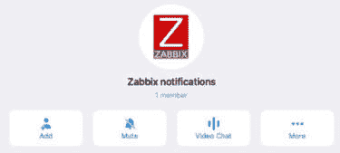
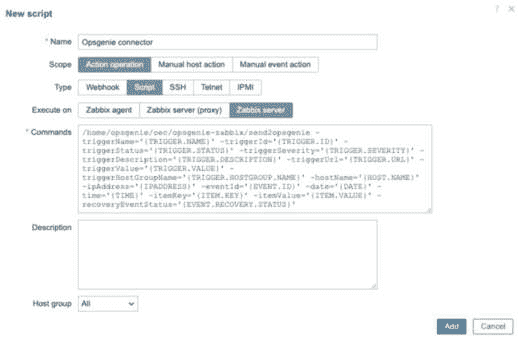
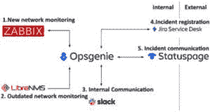

# 9

# 将 Zabbix 与外部服务集成

在本章中，我们将设置 Zabbix 提供的一些有用的外部服务集成。我们可以利用这些外部服务向 Zabbix 用户通知正在进行的问题。

我们将从学习如何设置公司内的聊天应用程序，如 Slack 和 Microsoft Teams 开始。然后，我们将学习如何使用个人聊天应用 Telegram，最后学习如何集成 Atlassian Opsgenie 以获得更广泛的警报功能。

一旦你完成了这些设置，你将能够有效地将某些服务与 Zabbix 集成。这是一个很好的起点，适用于与外部服务的集成，并且是设置 Slack、Teams、Opsgenie 和 Telegram 的最简单方式。

在本章中，我们将介绍以下几个方案：

+   使用 Zabbix 设置 Slack 警报

+   使用 Zabbix 设置 Microsoft Teams 警报

+   使用 Telegram 机器人与 Zabbix 集成

+   将 Atlassian Opsgenie 与 Zabbix 集成

让我们开始吧！

# 技术要求

本章我们需要使用 Zabbix 服务器，最好是按照本书中提供的设置方式来配置，尽管任何安装了警报功能的 Zabbix 7 服务器也可以使用。

我们还需要访问以下一些外部服务：

+   Slack（免费，有限制）：

    [`slack.com/`](https://slack.com/)

+   Microsoft Teams（免费，有限制）：

    [`www.microsoft.com/microsoft-teams`](https://www.microsoft.com/microsoft-teams)

+   Opsgenie（免费，有限制）：

    [`www.atlassian.com/software/opsgenie/`](https://www.atlassian.com/software/opsgenie/)

+   Telegram（免费）：

    [`telegram.org/`](https://telegram.org/)

我们不会介绍如何设置这些服务本身，仅介绍如何将它们与 Zabbix 集成。确保你已按照指南设置了所需的服务，并对这些服务有一定的了解。

# 使用 Zabbix 设置 Slack 警报

Slack 是一个广泛使用的工具，用于简单的文本消息、语音/视频聊天和协作。在本章中，我们将学习如何使用 Zabbix 的 Slack 集成功能将 Zabbix 问题信息发送到 Slack，从而能更好地了解问题概况。

## 准备工作

确保你已设置好 Slack。你可以访问 [`slack.com/intl/en-in/`](https://slack.com/intl/en-in/) 并在那里免费设置。我们还需要一个有一些活跃问题的 Zabbix 服务器。

## 如何操作…

1.  一旦你设置并打开 Slack，你应该能看到以下页面：


图 9.1 – Slack 默认页面

1.  让我们通过点击 **+ 添加频道** 按钮来创建一个新的 Zabbix 通知频道。然后，在下拉菜单中点击 **创建一个新频道**：


图 9.2 – Slack 创建频道窗口

1.  点击 **Next** 按钮。然后，在下一个窗口中，点击 **Create** 按钮以创建一个公开（或私人）频道：


图 9.3 – Slack，设置新频道可见性

1.  您将看到最后一步，选择将特定人员或所有人员添加到新频道。在我的测试中，我会添加所有人，所以我只需点击**完成**。


图 9.4 – Slack，添加人员窗口

1.  现在，访问以下链接创建一个与 Zabbix 配合使用的 Slack 机器人：[`api.slack.com/apps`](https://api.slack.com/apps)。

1.  您将在此页面上看到**创建新应用程序**选项。点击它，带您进入此页面：


图 9.5 – Slack，API 创建应用程序页面

1.  点击**创建新应用程序**按钮后，我们需要点击**从头开始**。

1.  然后，我们将看到一个弹出窗口，可以设置我们的新 Slack 机器人：


图 9.6 – Slack，API 名称应用程序及选择工作区窗口

1.  点击**创建应用程序**。这将带您到**基本信息**页面。在此页面上，点击**机器人**，如以下截图所示：


图 9.7 – Slack，API 添加功能和功能页面

1.  这将带您到新应用程序的**应用主页**。在页面的左侧，点击**OAuth &** **权限**选项。

1.  向下滚动至**范围**并点击**添加 OAuth 范围**：


图 9.8 – Slack，API 范围

1.  从下拉菜单中，点击**chat:write**，以允许我们的机器人向频道发送消息：


图 9.9 – Slack，API 添加 OAuth 范围下拉菜单

1.  对**im:write**和**groups:write**做同样的操作。

1.  向上滚动并点击**安装到工作区**按钮以完成应用程序的设置：


图 9.10 – Slack，API 安装到工作区按钮

1.  接下来，您将看到一个弹出消息。点击出现的绿色**允许**按钮。

1.  点击**允许**后，您将看到新的令牌。通过点击**复制**按钮复制令牌：


图 9.11 – Slack，API 我们的新 Bot 用户 OAuth 令牌

1.  最后，通过返回 Slack 频道，点击右上角的成员，选择**集成**，将您的机器人添加到**# zabbix-notifications**频道：


图 9.12 – Slack，连接应用程序到频道

1.  点击**添加** **应用程序**。

1.  只需点击白色的**添加**按钮，添加**Zabbix-Alert-Bot**：


图 9.13 – Slack，连接应用程序与机器人

1.  现在，导航到你的 Zabbix 前端，进入**警报** | **媒体类型**。

1.  点击**Slack**来编辑 Slack 媒体类型。你将看到一整套预配置的参数。我们需要将 OAuth 令牌粘贴到**bot_token**参数中，如下所示：


图 9.14 – Zabbix，Slack 媒体类型编辑页面

1.  同时，确保通过滚动到页面底部启用**媒体类型**。

1.  在**消息模板**标签页下，我们已经配置了五种消息类型。如果需要，我们可以根据自己的需求进行编辑。


图 9.15 – Zabbix，Slack 消息类型的媒体类型编辑页面

1.  现在，你可以点击**更新**来保存更改。

1.  现在，通过导航到**用户** | **用户组**并点击右上角的**创建用户组**按钮，创建一个新的用户组来为我们的媒体类型提供支持。添加以下用户组：


图 9.16 – Zabbix，创建外部服务组的用户组页面

1.  点击**主机权限**标签，然后点击**选择**。确保选择所有具有至少**读取**权限的组和子组，如下所示：


图 9.17 – Zabbix，创建外部服务组的用户组主机权限

重要说明

在为用户组应用权限时，请确保只添加你希望接收通知的主机组。在我的实验室环境和生产环境中，我通常会添加所有组，但有时我们希望筛选通知。实现这一点的一种方法是使用不同的用户组和用户，这样你就只会在特定的频道接收来自某些主机组的通知，尽管使用动作也是一种很好的方法。欲了解更多关于 Zabbix 用户权限和触发器的内容，请查看*第二章*，*使用 Zabbix 用户管理做好准备*，以及*第四章*，*使用触发器和警报*。

1.  现在，点击蓝色的**添加**按钮，完成用户组的创建。

1.  接下来，导航到**用户** | **用户**来创建一个 Slack 用户。在右上角点击蓝色的**创建用户**按钮。

1.  将以下用户添加到你的 Zabbix 服务器，并确保为其设置一个安全的密码：


图 9.18 – Zabbix 为 Slack 用户创建的用户页面

提示

在为警报或 API 访问等创建用户时，最佳做法是将用户添加到一个禁用前端访问的用户组中。这就是我们在这里添加**无前端访问**组的原因。

1.  现在，点击**媒体**标签，然后点击带下划线的**添加**文字。我们将为此用户添加以下媒体：


图 9.19 – Zabbix 为 Slack 用户创建用户媒体页面

1.  所有用户还需要一个用户角色。要添加它，前往**权限**并添加以下内容：


图 9.20 – Zabbix 为 Slack 用户创建用户媒体页面，权限

重要说明

为了方便，我们在示例中将该用户添加到**超级管理员**角色中。这会覆盖我们为**外部服务**用户组分配的只读权限。出于安全原因，你可能希望通过为用户选择**用户**或**管理员**角色来限制权限，这将遵循我们之前为主机组分配的权限。

1.  点击窗口底部的蓝色**添加**按钮，然后点击页面底部的蓝色**添加**按钮。

1.  我们还需要在**管理** | **宏**中添加一个宏。让我们添加以下宏，其中包含你的 Zabbix URL：


图 9.21 – Zabbix 管理 | 带有 Zabbix URL 的宏页面

1.  点击蓝色的**更新**按钮。

1.  最后，前往**警报** | **操作**，在**触发操作**页面上，点击蓝色的**创建** **操作**按钮。

1.  使用**通知外部服务**作为操作的名称。我们不会为这个示例设置任何条件，但建议在生产环境中设置。如果不设置任何条件，所有问题都将匹配此操作。

1.  前往**操作**并添加以下操作：


图 9.22 – Zabbix，为“通知外部服务”创建操作页面

提示

我们也可以在这里使用**通知所有相关人员**，向所有参与**操作**步骤的用户发送消息。

1.  现在，点击蓝色的**添加**按钮。完成后，你就可以在 Slack 渠道中查看任何新生成的问题（由 Zabbix 生成）：


图 9.23 – 从我们的 Zabbix 服务器发送的 Slack 通知

## 它是如何工作的……

使用媒体类型可能对你来说是完全新的，或者你过去可能做过。不管怎样，从 Zabbix 5 开始，过程稍有变化。在 Zabbix 5 之前的版本中，我们需要在线寻找合适的媒体类型或自己创建它们。

现在，借助 Zabbix 7，我们获得了许多预配置的媒体类型，已经可以直接使用。我们只需做必要的设置并填写正确的信息，就像我们刚刚为 Slack 所做的那样。然后，每当创建问题时，我们就可以将与问题相关的信息从 Zabbix 7 发送到 Slack。

在本配方中，我们告诉 Zabbix 服务器只将严重性为警告或更高的与问题相关的信息发送到 Slack，如下图所示：


图 9.24 – Zabbix 媒体页面（Slack 用户）

我们可以完全自定义这些严重性级别，但我们也可以完全自定义将哪些严重性级别发送到我们的 Slack 设置中。

我们在本章中配置的内容被称为**Zabbix webhook**。当 Zabbix 中创建一个问题，并且这个问题符合我们配置的标准（如其严重性）时，我们的操作与问题匹配，媒体类型将通过**Action**操作执行，并发送到配置的链接：


图 9.25 – Zabbix Slack 集成示意图

Zabbix 将问题发送到 Slack API，然后 API 处理该问题。接着，我们在 Slack 中配置的应用程序将问题发布到我们的频道。

现在，我们已经完成了这个配置，可以在 Slack 中查看问题，并从那里监控我们的 Zabbix 告警。

## 另见

如果你想进一步利用这个集成，查看 Slack API 文档。这个 API 可以做很多事情，我们可以为我们的频道构建一些非常棒的应用程序或机器人：[`api.slack.com`](https://api.slack.com)/。

# 使用 Zabbix 设置 Microsoft Teams 告警

本书的上一版是在 COVID-19 大流行期间编写的。当时，许多 IT 公司要求员工在家办公。因此，我们注意到 Microsoft Teams 和类似应用的使用量激增。突然间，很多公司开始使用 Microsoft Teams 等工具，以便让远程工作和协作变得更加容易。即使在大流行结束后，这一趋势依然存在，这也是我们加入此配方的原因。

让我们学习如何通过将 Zabbix 告警集成到 Microsoft Teams 中，使工作变得更加高效。

## 准备工作

我们需要 Zabbix 服务器能够为我们创建一些问题。为此，你可以使用之前章节中的 `lar-book-rocky`，或者使用任何你喜欢的 Zabbix 服务器。

我们还需要具备基本的 Microsoft Teams 知识，当然，Microsoft Teams 本身也需要已经设置并准备就绪。

## 如何操作…

1.  首先，我们需要打开 Microsoft Teams 应用程序，无论是在 Windows、macOS 还是 Linux 上，然后创建一个新频道。进入**Teams**，点击团队名称旁边的三个点（**…**），如下图所示：


图 9.26 – MS Teams，添加频道选项

1.  在**添加频道**窗口中，填写以下信息以创建我们的新频道：


图 9.27 – MS Teams，添加频道窗口

1.  现在，点击紫色的**添加**按钮以添加频道。完成后，我们将能够在列表中看到我们的新频道。

1.  点击频道旁边的三个点（**...**），如下图所示：


图 9.28 – MS Teams，连接器选项

1.  我们想从这个下拉菜单中选择**连接器**选项。这将允许我们将 Microsoft Teams 连接器添加到此频道。

1.  我们在这里使用搜索字段来查找官方的**Zabbix** **Webhook**连接器：


图 9.29 – MS Teams，添加连接器窗口

1.  点击**Zabbix Webhook**连接器旁边的**配置**按钮，将此连接器添加到我们的频道中。此操作将打开一个弹出窗口，您需要复制 webhook URL。![图 9.30 – MS Teams – Webhook URL]

图 9.30 – MS Teams – Webhook URL

1.  现在，点击**保存**按钮。完成此操作后，您可以关闭弹出窗口。

1.  前往 Zabbix 前端，导航到**警报** | **媒体类型**。点击这里的**MS Teams**媒体类型。

1.  向下滚动，直到看到**teams_endpoint**。将之前复制的 URL 粘贴到这里，如下图所示：


图 9.31 – Zabbix 警报 | 媒体类型，编辑 MS Teams 页面

1.  确保向下滚动并启用媒体类型，然后再保存。

1.  现在，点击页面底部的蓝色**更新**按钮。

1.  如果你没有按照之前的步骤操作，请通过导航到**用户** | **用户组**并点击右上角的**创建用户组**按钮来为我们的媒体类型创建一个新的用户组。添加以下用户组：


图 9.32 – Zabbix，创建用户组页面，外部服务组

1.  点击**主机权限**标签，然后点击**选择**。确保你选择了所有拥有**读取**权限的组和子组。**权限**标签将如下所示：


图 9.33 – Zabbix，创建用户组权限页面，外部服务组

1.  现在，点击蓝色的**添加**按钮，完成创建此用户组。

1.  导航到**用户** | **用户**，然后点击右上角的蓝色**创建用户**按钮。添加以下用户：


图 9.34 – Zabbix 用户 | 用户，创建新用户页面，MS Teams

提示

在创建用于警报或仅仅用于 API 访问的用户时，最佳做法是将该用户添加到一个禁用前端访问的用户组。因此我们在这里添加了**无前端访问**用户组。

1.  接下来，进入**创建用户**页面的**媒体**标签。点击下划线的**添加**文本，在此创建以下媒体：


图 9.35 – Zabbix 用户 | 用户，创建新用户媒体页面，MS Teams

1.  所有用户还需要一个**用户**角色。要添加它，请进入**权限**并添加以下内容：


图 9.36 – Zabbix – 创建用户媒体页面，MS Teams 用户，权限

重要说明

为了方便起见，我们在示例中将用户添加到了**超级管理员**角色。这覆盖了我们为**外部服务**用户组分配的只读权限。为了限制权限，请选择**用户**或**管理员**角色，这将遵守我们之前分配的主机组权限。

1.  填写完这些信息后，点击窗口底部的蓝色**添加**按钮，然后在页面底部再次点击蓝色**添加**按钮。

1.  如果你没有遵循之前的步骤，你还需要在**管理** | **宏**中添加一个宏，并添加以下宏。这个宏将包含你的 Zabbix URL：


图 9.37 – Zabbix 管理 | 宏页面，适用于 MS Teams 的 Zabbix URL

1.  点击蓝色的**更新**按钮。如果你没有遵循之前的步骤，还需要进入**警报** | **操作**，在**触发器操作**页面上点击蓝色的**创建** **操作**按钮。

1.  使用**通知外部服务**作为操作名称。我们不会在这个示例中设置任何条件，但建议在生产环境中设置条件。如果不设置任何条件，所有问题将匹配此操作。

1.  进入**操作**，并添加以下操作：


图 9.38 – Zabbix，创建操作操作页面，通知外部服务以供 MS Teams 使用

1.  现在，点击蓝色的**添加**按钮，你就完成了。现在，你可以在 MS Teams 渠道中查看发生的新问题：


图 9.39 – Zabbix 问题在 MS Teams 渠道中

## 它是如何工作的……

Microsoft Teams 的工作方式大致与我们的 Slack 设置相同。Zabbix 服务器中创建一个问题，如果该问题符合我们在 Zabbix 中配置的条件，我们会将该问题发送到 Microsoft Teams 连接器。

例如，我们配置了 Zabbix，使其只将警告或更高严重性的故障发送到 Microsoft Teams，如下所示：


图 9.40 – MS Teams 用户的 Zabbix 媒体页面

我们的 Microsoft Teams 连接器捕捉到我们的故障，并且由于这个连接器直接配置在我们的频道中，它会向频道发送通知：


图 9.41 – Zabbix Microsoft Teams 集成图

现在，我们可以在我们的频道中看到 Teams 通知，并通过 Microsoft Teams 直接跟踪所有 Zabbix 问题。

## 另请参见

有关 Zabbix webhook 连接器的更多信息，请查看此页面：[`appsource.microsoft.com/en-us/product/office/WA200001837?tab=Overview`](https://appsource.microsoft.com/en-us/product/office/WA200001837?tab=Overview)。

# 使用 Telegram 机器人与 Zabbix

如果你喜欢聊天应用中的自动化，可能听说过或使用过 Telegram Messenger。Telegram 拥有强大的 API 和惊人的机器人功能。

在这个教程中，我们将使用 Telegram 机器人为 Zabbix 警报创建一个 Telegram 群组。让我们开始吧。

## 准备就绪

确保你的 Zabbix 服务器已经准备好。你可以使用`lar-book-rocky`或任何能够发送警报的 Zabbix 服务器。

如果你对 Telegram 有一些了解，那会很有帮助，但我将逐步描述如何设置，即使你从未使用过 Telegram 机器人。只要确保你已经在电脑上安装了 Telegram 应用，并且你的账户已经设置好。

## 如何操作…

1.  首先，我们来在 Telegram 中创建一个新频道。点击搜索框旁的创建图标，然后选择**新建组**：


图 9.42 – Telegram 新建组按钮

1.  添加另一个用户——你团队中需要接收通知的人员。如果需要，可以填写组名并添加图片：


图 9.43 – Telegram 新建组页面

1.  现在，点击右上角的**创建**按钮。这将带你进入**新建** **组**页面。

1.  使用 Telegram 机器人变得简单，只需通过 Telegram 上的**@BotFather**用户即可开始。我们可以通过搜索**botfather**并点击指定的联系人来创建我们的机器人：


图 9.44 – Telegram，BotFather 用户

1.  让我们首先在聊天中发出**/start**命令。这将为你提供一个可以使用的命令列表：


图 9.45 – Telegram，BotFather 用户帮助列表

1.  现在，让我们通过在**BotFather**聊天中输入**/newbot**来立即创建一个新的机器人。按下*Enter*键发送消息。这样我们就会得到如下结果：


图 9.46 – Telegram，BotFather /newbot 命令

1.  输入机器人的新名称；我们将其命名为**zabbix-notfication-bot**。按*Enter*键发送您的名称：


图 9.47 – Telegram，BotFather 机器人用户名

1.  系统将要求您为机器人指定用户名。我将使用**lar_ zbx_notfication_bot**：


图 9.48 – Telegram，BotFather 机器人令牌

重要提示

您的机器人用户名必须是唯一的，因此您不能在这里使用**lar_zbx_ notification_bot**。选择一个独特的机器人名称并在整个操作中使用该名称。

1.  确保将**HTTP API**密钥保存在一个安全的地方。

1.  让我们回到我们的**Zabbix 通知**群组并添加我们的机器人。在聊天列表中点击该群组并点击群组名称。

1.  现在，点击**添加**来添加机器人，如下所示：



图 9.49 – Telegram，添加用户到群组按钮

1.  接下来，您需要通过机器人的用户名搜索您的机器人，如下图所示：


图 9.50 – Telegram，添加用户到群组页面

1.  点击机器人并点击**添加**按钮。这样，您的机器人就添加到频道中了。

1.  让我们进入 Zabbix 前端并导航到**警报**|**媒体类型**。点击标题为**Telegram**的媒体类型。

1.  在这里，您必须将之前生成的**HTTP API**密钥添加到我们媒体类型的**Token**字段中：


图 9.51 – Zabbix 警报 | 媒体类型，编辑 Telegram 媒体类型页面

1.  同时，向下滚动并确保启用此媒体类型。

1.  点击页面底部的蓝色**更新**按钮以完成编辑**Telegram**媒体类型。

1.  现在，让我们回到 Telegram，并将另一个机器人添加到我们的群组中。进入我们的新群组并点击群组名称。点击**添加**以添加**IDBot**用户：


图 9.52 – 添加用户页面（Telegram 群组）

1.  点击用户并点击**添加**。然后，返回 Zabbix 前端。

1.  如果您没有按照之前的任何操作创建，请通过导航到**用户**|**用户组**并点击右上角的**创建用户组**按钮，创建一个新的用户组。添加以下用户组：


图 9.53 – Zabbix 创建用户组页面及用于 Telegram 的外部服务组

1.  点击**主机权限**标签并点击**选择**。确保选择所有具有**读取**权限的组和子组，如下所示：


图 9.54 – Zabbix 创建用户组权限页面，供 Telegram 使用的外部服务

1.  现在，点击蓝色的**添加**按钮，完成创建此用户组。

1.  此时，你必须在 Zabbix 中创建一个新用户。然而，要创建这个用户，你需要我们新的组 ID。返回 Telegram 并在群聊中发送**/getgroupid@myidbot**。你将收到一个值，并需要复制该值：


图 9.55 – Telegram 用户组 ID

1.  现在，导航到**用户** | **用户**并点击蓝色的**创建用户**按钮。添加以下用户：


图 9.56 – Zabbix 创建用户页面，Telegram 用户

提示

当为警报或 API 访问创建用户时，最佳实践是将该用户添加到一个禁用前端访问的用户组中。这就是为什么我们在这里添加了**无前端访问**组。

1.  现在，选择**媒体**标签并点击带下划线的**添加**文本。添加以下媒体：


图 9.57 – Zabbix 创建用户媒体页面，Telegram 用户

1.  所有用户还需要一个**用户**角色。要添加它，请进入**权限**并添加以下内容：


图 9.58 – Zabbix 创建用户媒体页面，Telegram 用户，权限

重要提示

为了方便起见，我们在示例中将用户添加到**超级管理员**用户角色中。这会覆盖我们分配给**外部服务**用户组的只读权限。若要限制权限，请为你的用户选择**用户**或**管理员**角色，这将遵循我们之前分配的主机组权限。

1.  确保将组 ID 添加到**发送至**字段，并带有**–**文本，然后点击蓝色的**添加**按钮。

1.  如果你没有按照之前的步骤操作，你还需要进入**警报** | **操作**。然后，在**触发操作**页面上，点击蓝色的**创建** **操作**按钮。

1.  使用**通知外部服务**作为操作名称。对于本示例，我们不会设置任何条件，但在生产环境中建议这么做。如果你不设置任何条件，所有问题都会匹配此操作。

1.  进入**操作**并添加以下操作：


图 9.59 – Zabbix – 创建操作页面，通知外部服务以供 Telegram 使用

1.  现在，点击蓝色的**添加**按钮。至此，你完成了。现在，你可以在你的 Telegram 群组中查看新的问题：


图 9.60 – Zabbix 在 Telegram 聊天中的通知

## 它是如何工作的…

Slack 应用、Microsoft 连接器和 Telegram 机器人最终的工作方式都差不多。它们只是由各自公司提供了另一个后台（API），但 Zabbix 的 webhook 保持不变。

现在我们已经添加了 Zabbix Telegram 集成，我们通过 Zabbix webhook 正在向我们的 Telegram 群组发送通知：


图 9.61 – Zabbix 用户 | 用户，编辑用户媒体页面

然而，只有当通知符合我们配置的设置时，我们才会接收到这些通知。例如，我们已经添加了媒体类型，以便只将严重性为警告或更高的问题发送到我们的 Telegram 机器人：


图 9.62 – Zabbix Telegram 集成图示

现在，我们的 Zabbix 服务器将符合 **操作** 条件的问题发送到我们的 Telegram 机器人。机器人成功地捕获了这些问题。由于我们的机器人在 Telegram 群组中，这些问题就被发布到我们的 Telegram 群组中。

## 还有更多…

Telegram 上有一个非常酷的 Zabbix 社区群组。既然你已经安装了 Telegram，别忘了通过以下邀请链接加入：[`t.me/ZabbixTech`](https://t.me/ZabbixTech)。

## 另见

确保你查看 Telegram 机器人所提供的所有精彩功能。Telegram 提供了大量的直接信息，你可以通过使用它们构建出令人惊叹的集成：[`core.telegram.org/bots`](https://core.telegram.org/bots)。

# 将 Atlassian Opsgenie 与 Zabbix 集成

Atlassian Opsgenie 不仅仅是另一个接收通知的集成服务。Opsgenie 为我们提供了一个呼叫系统、短信系统、iOS 和 Android 应用、双向确认，甚至还有值班安排。

我认为 Opsgenie（和 PagerDuty）是取代老式呼叫和短信系统并与 Zabbix 完全集成的最佳工具。所以，让我们从 Opsgenie 开始，看看如何设置这个惊人的工具。

## 准备工作

确保你的 Zabbix 服务器已准备好。我将使用 `lar-book-rocky` 服务器，但任何准备好发送问题的 Zabbix 服务器都可以使用。

你还需要一个 Atlassian Opsgenie 账户，并且确保 Opsgenie 已经准备好。这次的集成与之前的示例稍有不同，因为我们还将使用一些脚本。

我不会展示如何创建账户，但我们将从 Opsgenie 已经准备好的状态开始这个方案。

## 如何操作…

1.  首先，登录到我们的 Atlassian Opsgenie 设置，并进入首页的 **设置**。在左侧边栏中，点击 **通知**。

1.  确保你通过使用 **+ 添加电子邮件** 和 **+ 添加电话号码** 按钮添加了你的电子邮件和电话号码。我们需要这些信息来接收通知：


图 9.63 – Opsgenie 配置文件，联系方式

1.  一旦添加了设置，它们将自动保存，这意味着我们可以从**设置**导航到**团队**，通过顶部的导航栏进行切换。

1.  在**团队**标签页中，点击右上角的蓝色**添加团队**按钮。然后，添加以下信息：


图 9.64 – Opsgenie，添加团队窗口

1.  我已经为我们的**Consultancy**团队设置了两个用户，他们是该团队的一部分。点击窗口底部的蓝色**添加**按钮以添加新团队。

1.  这将带你到新的**Consultancy**团队页面。点击**集成**，然后点击右上角的蓝色**添加集成**按钮。

1.  当我们使用搜索字段搜索 Zabbix 集成时，我们可以立即看到它，如下截图所示：


图 9.65 – Opsgenie，添加集成页面

1.  点击 Zabbix 集成。这将带你到下一个页面，生成**名称**和**API 密钥**值：


图 9.66 – Opsgenie，添加 Zabbix 集成页面

1.  复制**API 密钥**信息并滚动到底部。在这里，点击蓝色的**保存** **集成**按钮。

1.  现在，导航到你的 Zabbix 服务器 CLI，并执行以下代码。

    对于基于 RHEL 的系统，请使用以下命令：

    ```
    wget https://github.com/opsgenie/oec-scripts/releases/download/Zabbix-1.1.6_oec-1.1.3/opsgenie-zabbix-1.1.6.x86_64.rpm
    wget https://github.com/opsgenie/oec-scripts/releases/download/Zabbix-1.1.6_oec-1.1.3/opsgenie-zabbix_1.1.6_amd64.deb
    ```

1.  我们现在可以通过执行以下命令来安装下载的 Zabbix Opsgenie 插件：

    对于基于 RHEL 的系统，请使用以下命令：

    ```
    rpm -i opsgenie-zabbix-1.1.6.x86_64.rpm
    ```

    对于 Ubuntu 系统，请使用以下命令：

    ```
    dpkg -i opsgenie-zabbix_1.1.6_amd64.deb
    ```

1.  安装插件后，前往 Zabbix 前端。如果你没有按照之前的步骤操作，请通过导航到**用户** | **用户组**并点击右上角的**创建用户组**按钮来为我们的媒体类型创建一个新的用户组。添加以下用户组：


图 9.67 – Zabbix 创建用户组页面，适用于 Opsgenie 的外部服务组

1.  点击**权限**标签，然后点击**选择**。确保你选择了所有具有**读取**权限的组和子组，如下所示：


图 9.68 – Zabbix 创建用户组权限页面，适用于 Opsgenie 的外部服务组

1.  现在，点击蓝色的**添加**按钮，完成创建这个用户组。

1.  让我们导航到**用户** | **用户**，然后点击蓝色的**创建用户**按钮。添加以下用户：


图 9.69 – Zabbix 创建用户页面，Opsgenie 用户

提示

在为警报或仅仅是 API 访问创建用户时，最佳实践是将用户添加到一个禁用前端访问的用户组中。这就是我们在这里添加**无前端访问**组的原因。

1.  所有用户还需要一个**用户**角色。要添加此角色，请转到**权限**并添加以下内容：


图 9.70 – Zabbix 创建用户媒体页面，Opsgenie 用户，权限

重要提示

为了方便起见，我们在示例中将用户添加到**超级管理员**用户角色中。这会覆盖我们为**外部服务**用户组分配的只读权限。为了限制权限，请为您的用户选择**用户**或**管理员**角色，这将遵循我们之前分配的主机组权限。

1.  为了在我们的操作中使用，我们需要设置一个脚本；为此，请导航到**警报** | **脚本**，然后点击右上角的**创建脚本**。

1.  我们将脚本命名为**Opsgenie connector**。将**范围**设置为**操作操作**，**类型**设置为**脚本**，并将**执行于**设置为**Zabbix 服务器**。

1.  将**/home/opsgenie/oec/opsgenie-zabbix/actionCommand.txt**文件的内容粘贴到 CLI 的**命令**中，应该像下面的截图一样：



图 9.71 – Zabbix Opsgenie 连接器脚本

1.  别忘了点击页面底部的**添加**按钮来保存这个新脚本。

1.  接下来，导航到**警报** | **操作**。在**触发操作**页面上，点击右上角的蓝色**创建操作**按钮。

1.  在**名称**字段中，输入**Opsgenie 操作**，并将以下项目添加到**条件**中：


图 9.72 – Zabbix 创建新操作页面，Opsgenie 操作

1.  现在，点击**操作**标签页。

1.  点击**操作**旁边下划线的**添加**文本选项以添加第一个操作。在**操作**下拉菜单中，选择**Opsgenie 连接器**。


图 9.73 – Zabbix 创建操作窗口，Opsgenie 连接器

1.  对**恢复操作**和**更新操作**重复*步骤 24*。它应该像这样：


图 9.74 – Zabbix 创建操作页面，Opsgenie 操作

1.  点击页面底部的蓝色**添加**按钮以完成操作设置。

1.  现在，您必须配置 Opsgenie Zabbix 集成。使用以下命令编辑**config**文件：

    ```
    vim /home/opsgenie/oec/conf/config.json
    ```

1.  确保编辑**apiKey**、**command_url**、**user**和**password**行，如下所示的截图所示：


图 9.75 – Opsgenie config.json 文件

重要提示

如果你不在美国，你需要编辑 **baseUrl**。我在欧洲，所以我将其更改为 [`api.eu.opsgenie.com`](https://api.eu.opsgenie.com)。

1.  就这些！现在你可以看到警报进入并在 Opsgenie 中确认它们：


图 9.76 – 来自 Zabbix 的 Opsgenie 警报

## 它是如何工作的…

当 Zabbix 中创建警报时，它会通过 Zabbix 集成发送到 Opsgenie。这个集成利用了 Opsgenie API 来获取我们的 Zabbix 信息，并在需要时发送回回复。通过这种方式，我们在两个应用之间实现了双向通信：


图 9.77 – Opsgenie 设置图

Opsgenie 是一款出色的工具，可以将多个任务从 Zabbix 服务器中移除。我曾经使用它将监控工具从另一个平台迁移到 Zabbix。Opsgenie 让我们轻松接收来自产品的警报并集中管理通知：



图 9.78 – Opsgenie 设置示例，灵感来自 Wadie

Atlassian Opsgenie 的另一个伟大功能是它与其他 Atlassian 产品的集成。我们可以建立一个类似前面图示的设置，将公司中使用的所有产品进行集成。

## 还有更多…

Opsgenie 不仅仅允许我们发送通知。它还使我们能够在产品内定义完整的值班时间表，这让我们在程序中创建时间表变得非常简单，而 Zabbix 在这方面可能有些静态。请查看以下链接，了解如何操作：

[`support.atlassian.com/opsgenie/docs/manage-on-call-schedules-and-rotations/`](https://support.atlassian.com/opsgenie/docs/manage-on-call-schedules-and-rotations/)

此外，也有一些竞争产品与 Opsgenie 一样集成得很好。PagerDuty 就是其中之一，提供原生的 Zabbix 集成。它具有类似的功能集，最终的选择取决于个人偏好、我们可能已经拥有的其他软件，以及… 价格！
