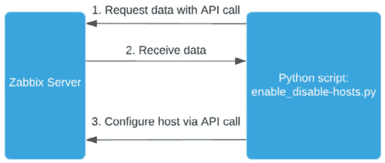

# 第十章：使用自定义脚本和 Zabbix API 扩展 Zabbix 功能

Zabbix 提供了很多开箱即用的功能。但 Zabbix 真正出色的地方在于其可定制性，不仅仅是通过默认的前端，尤其是通过脚本和 Zabbix API 来进行扩展。

本章中，我将讲解如何使用 Zabbix API 的基础知识。接着，我们将看到如何通过 Python 脚本利用 API 构建一些有趣的功能，例如跳板主机。之后，我们将使用 *Brian van Baekel* 编写的脚本，通过 Zabbix 地图启用和禁用具有有限权限的主机。

跟随这些食谱，你将完全准备好应对 Zabbix API，并且能够使用脚本扩展 Zabbix 功能。本章将扩展你在 Zabbix 中的可能性，几乎是无限的，你将准备好成为一名专业的 Zabbix 用户。

本章将涵盖以下食谱：

+   设置和管理 API 令牌

+   使用 Zabbix API 扩展功能

+   使用 Zabbix API 和 Python 构建跳板主机

+   启用和禁用 Zabbix 地图中的主机

# 技术要求

我们将需要一个 Zabbix 服务器和一些新的 Linux 主机。我们还需要具备一些基本的脚本和编程知识。我们将使用 Python 来扩展 Zabbix 的一些功能，并为此提供相应的脚本。

本章所需的代码可以在以下链接找到：

[`github.com/PacktPublishing/Zabbix-7-IT-Infrastructure-Monitoring-Cookbook/tree/main/chapter10`](https://github.com/PacktPublishing/Zabbix-7-IT-Infrastructure-Monitoring-Cookbook/tree/main/chapter10)

确保一切准备就绪，你就一定能掌握这些食谱。

# 设置和管理 API 令牌

本章开始时，我们将进行一些 Zabbix API 配置。如果你之前使用过 Zabbix API，可能会知道通过 API 调用来认证并获取 API 令牌以在脚本中使用是非常麻烦的。但现在情况不同了，我们可以通过 Zabbix 前端生成 API 令牌。

## 准备工作

对于这个食谱，我们只需要 Zabbix 设置正在运行。我们将使用前端生成 API 令牌。从这里，我们可以在本章后续的集成中使用 API 令牌。

## 如何操作…

1.  首先，让我们以超级管理员用户身份登录到 Zabbix 前端。

1.  导航到 **用户** | **用户组**，然后点击右上角的蓝色 **创建用户组** 按钮。

1.  在这里，我们将创建一个新用户组。在 **组名** 字段中填写 **API 用户**。

1.  切换到 **主机权限** 标签，点击 **选择** 按钮并选择所有主机组，授予你的 API 用户组对每个主机的权限。


图 10.1 – Zabbix 用户 | 用户组，创建用户组主机权限，API 用户

1.  接下来，转到**模板权限**选项卡，并在这里做同样的操作。


图 10.2 – Zabbix 用户 | 用户组，创建用户组模板权限，API 用户

1.  点击弹出窗口底部的蓝色**选择**按钮，然后点击**读写**，接着点击小圆点的**添加**按钮。现在应该看起来像这样：


图 10.3 – Zabbix 用户 | 用户组，用户组权限页面，API 用户

提示

我们可以选择不以超级管理员身份创建 API 用户，而是通过限制**API 用户**用户组中的主机和模板组访问权限来限制权限。这在生产环境中可能更受欢迎，因为你可能希望限制 API 访问。使用适合你需求的方式。

1.  点击页面底部的蓝色**添加**按钮，添加此新的用户组。

1.  现在，让我们转到**用户** | **用户**并点击右上角的蓝色**创建用户**按钮。

1.  在这里，我们将创建一个新的用户，称为**API** 用户。创建用户如下：


图 10.4 – Zabbix 用户 | 用户，用户创建页面，API 用户

1.  在添加用户之前，切换到**权限**选项卡并添加**超级管理员角色**。


图 10.5 – Zabbix 用户 | 用户，用户权限页面，API 用户

1.  现在，我们可以通过点击页面底部的蓝色**添加**按钮来添加用户。

1.  接下来，我们需要为这个用户创建一些 API 令牌。进入**用户** | **API 令牌**。

1.  接下来，点击右上角的蓝色**创建 API 令牌**按钮，并将**用户**字段填写为**API**，**名称**字段填写为**API 图书密钥**。将**过期时间**设置为未来某个较远的时间，或者完全禁用过期——选择你认为最安全的方式。它应该看起来像这样：


图 10.6 – 管理 | 一般 | API 令牌，API 令牌创建页面

1.  点击页面底部的蓝色**添加**按钮，生成新的 API 令牌。这将带我们到下一个页面：


图 10.7 – Zabbix API 用户 API 令牌生成页面

1.  确保将**认证令牌**的值保存到一个安全位置，例如密码保险库。稍后在实验中它会很重要。

1.  现在我们可以点击页面底部的**关闭**按钮。这将带我们返回到**API 令牌**页面，在那里我们可以管理所有已创建的 API 令牌。


图 10.8 – Zabbix API 用户 API 令牌页面

## 它是如何工作的……

由于 Zabbix 现在自带内置的 API 令牌管理功能，因此使用 Zabbix API 变得更加容易。通过使用专用的 API 用户，我们可以在一个位置管理所有令牌，或者我们可以在自己的用户账户下设置私有的 API 令牌。

在这种情况下，我们创建了一个新的 API 用户组。这很重要，因为我们的 API 令牌仍然属于一个用户账户，这意味着它们将遵循该用户的权限。如果我们在除超级管理员以外的其他用户类型下创建 API 用户，我们可以通过 **API** **Users** 组来限制我们的 API 访问。

请确保将角色应用于用户并将权限赋予用户组，根据您的环境需求进行调整。同时，请确保为您的 API 令牌设置合理的过期日期，以便我们能够定期重新生成它们。

关于设置和管理 API 令牌，没什么太多需要说明的了，但让我们看看如何在接下来的教程中应用我们在本教程中学到的内容。

# 使用 Zabbix API 扩展功能

API 是你开始扩展任何软件功能的入口。幸运的是，Zabbix 提供了一个功能强大的 API，我们可以轻松地利用它来扩展功能。Zabbix 还为 Python 发布了 `zabbix-utils`，使得构建脚本变得更加容易。虽然这是一个很棒的附加功能，但由于并非每个环境都允许使用它，而且我们希望尽量减少依赖项，所以在本次测试中我们不会使用它。尽管如此，您可以在这里查看该库：

[`github.com/zabbix/python-zabbix-utils`](https://github.com/zabbix/python-zabbix-utils)

在本教程中，我们将探索如何使用 Zabbix API 来执行一些任务，为在实际生产环境中使用 Zabbix API 打下良好的基础。

## 准备工作

我们将需要一个包含一些主机的 Zabbix 服务器。我将使用前几章中的 `lar-book-centos` 主机，但您可以自由使用任何 Zabbix 服务器。我还将使用另一台 Linux 主机来发起 API 调用，但这可以在任何 Linux 主机上完成。

我们需要在 Linux 主机上安装 Python 3，因为我们将使用它来创建 API 调用。

同时，确保你有一个 API 用户和 API 令牌。建议使用我们在第一章创建的令牌。

## 如何操作…

1.  首先，在我们的 Linux CLI 中，让我们切换到一个新目录：

    ```
    cd /home/zabbix/
    ```

1.  使用以下命令在主机上安装 Python 3。

    对于基于 RHEL 的系统，请使用以下命令：

    ```
    dnf install python3
    apt install python3
    ```

1.  Python **pip** 应该已经随着该软件包默认安装。如果没有，请执行以下命令。

    对于基于 RHEL 的系统，请使用以下命令：

    ```
    dnf install python3-pip
    ```

    对于 Ubuntu 系统，请使用以下命令：

    ```
    apt install python3-pip
    ```

重要说明

您的 Linux 发行版可能附带较旧版本的 Python(3)。如果在本章后续脚本中遇到任何错误，请确保检查错误信息，确认您的 Python 版本是否支持某些功能。

1.  现在，让我们使用 Python **pip** 安装所需的依赖项。我们将需要这些依赖项，因为它们将在脚本中使用：

    ```
    pip3 install requests
    ```

1.  从本书的 Packt GitHub 仓库下载我们脚本的开头，通过执行以下命令：

    ```
    wget https://raw.githubusercontent.com/PacktPublishing/Zabbix-7-IT-Infrastructure-Monitoring-Cookbook/main/chapter10/api_test.py
    ```

1.  如果你无法从主机上使用 **wget**，可以通过以下网址下载脚本：[`github.com/PacktPublishing/Zabbix-7-IT-Infrastructure-Monitoring-Cookbook/tree/main/chapter10/api_test.py`](https://github.com/PacktPublishing/Zabbix-7-IT-Infrastructure-Monitoring-Cookbook/tree/main/chapter10/api_test.py)。

1.  接下来，我们将通过执行以下命令来编辑我们新下载的脚本：

    ```
    vim api_test.py
    ```

1.  首先，让我们将 **url** 变量中的 IP 地址 **10.16.16.152** 更改为你 Zabbix 服务器的 IP 或 DNS。然后，确保通过将 **PUT_YOUR_TOKEN_HERE** 替换为我们在本章第一部分生成的 API 令牌，来编辑 **api_token** 变量：

    ```
    url = "http://10.16.16.152/api_jsonrpc.php"
    api_token = "c01ce8726bfdbce02664ec8750f99da 1bbbcb3cb295d924932e2f2808846273"
    ```

1.  我们还会在脚本中添加一些行代码，以便检索我们的主机 ID、主机名和所有 Zabbix 主机的接口。确保在以下截图中显示的注释之间添加新的代码：


图 10.9 – 注释显示代码放置位置

1.  现在，添加以下几行代码：

    ```
    #Function to retrieve the hosts and interfaces
    def get_hosts(api_token, url):
        payload = {
        "jsonrpc": "2.0",
        "method": "host.get",
        "params": {
            "output": [
                "hostid",
                "host"
            ],
            "selectInterfaces": [
                "interfaceid",
                "ip",
                "main"
            ]
        },
        "id": 2,
        "auth": api_token
        }
        resp = requests.post(url=url, json=payload )
        out = resp.json()
        return out['result']
    ```

1.  然后，我们还会添加几行代码，将请求的信息写入文件，以便我们查看执行后发生了什么：

    ```
    #Write the results to a file
    def generate_host_file(hosts,host_file):
        hostname = None
        f = open(host_file, "w")
        #Write the host entries retrieved from Zabbix
        for host in hosts:
            hostname = host['host']
            for interface in host["interfaces"]:
                if interface["main"] == "1":
                    f.write(hostname + " " + interface["ip"] + "\n")
        f.close()
        return
    ```

1.  现在你应该能够通过执行以下命令来运行它：

    ```
    python3 api_test.py
    ```

1.  这个应该能运行，但不会给你任何输出。如果这不起作用，请确保重新检查你的步骤。

1.  让我们检查一下文件，看看通过执行以下命令发生了什么：

    ```
    cat /home/zabbix/results
    ```

1.  上述命令的输出应该像这样：


图 10.10 – 使用 cat 命令，显示我们结果的文件

我们现在已经编写了一个简短的 Python 脚本，用来使用 Zabbix API。

## 它是如何工作的……

使用 Zabbix API 进行编程可以通过 Python 实现，但这绝对不是我们唯一的选择。我们可以使用多种编程语言，包括 Perl、Go、C# 和 Java。

然而，在我们的示例中，我们使用的是 Python，所以让我们看看我们在这里做了什么。如果我们查看脚本，我们有两个主要功能：

+   **get_hosts**

+   **generate_host_file**

首先，我们填写了 `api_token` 和 `url` 变量，这些变量用于通过 Zabbix API 进行身份验证。然后我们使用这些变量调用 `get_hosts` 函数，从 Zabbix API 获取信息：


图 10.11 – Python 函数 Zabbix API 负载

查看代码时，我们使用了 JSON 负载来请求信息，如 `host` 获取主机名、`hostid` 获取主机 ID、`ip` 获取接口的 IP 地址。

现在，如果我们查看最后一个函数`generate_host_file`，我们可以看到，我们将带有接口 IP 的主机信息写入`/home/results`文件。这样，我们就有了一个可靠的脚本，可以将主机信息写入文件。

如果你不熟悉 Python 或编程，一开始使用 Zabbix API 可能是一个大挑战。让我们来看看 API 实际是如何工作的：


图 10.12 – Python 脚本 Zabbix API 功能图

在*步骤 1*中，我们发起一个 API 调用，使用我们目标 URL 和 API 令牌（如变量中所指定）进行身份验证。接下来，在*步骤 2*中，我们从 Zabbix 接收所请求的数据，并在我们的 Python 脚本中进一步使用这些数据。

*步骤 3*是我们的数据处理步骤。我们可以对从 Zabbix API 接收到的数据做任何我们想做的事情，但在我们的案例中，我们将数据格式化并写入文件。这就是我们如何使用 Zabbix API 扩展功能的方式。正是在这一阶段，我们的文件被填充了主机名和 IP 信息。

## 另请参见

如果你对 Zabbix API 及其可用功能感兴趣，可以查看 Zabbix 文档：[`www.zabbix.com/documentation/current/en/manual/api`](https://www.zabbix.com/documentation/current/en/manual/api)。

# 使用 Zabbix API 和 Python 构建跳板主机

很多组织都有一个跳板主机（有时也称为堡垒主机），用来通过这台主机访问服务器、交换机和其他设备。跳板主机通常具有访问所有重要设备所需的防火墙规则。现在，如果我们保持监控系统的最新状态，那么我们也应该将每一台主机添加到监控系统中。

我的朋友、前同事以及 Zabbix 爱好者*Yadvir Singh*，有一个很棒的想法，创建一个 Python 脚本，将所有 Zabbix 主机及其 IP 导出到另一台 Linux 主机上的`/etc/hosts`文件中。让我们看看如何构建一个类似的跳板主机。

## 准备工作

我们需要一台安装并准备好的 Linux 主机来进行这个实验。我们将这台主机命名为`lar-book-jump`。此外，我们还需要 Zabbix 服务器，我将使用`lar-book-centos`。

此外，重要的是要访问*Yadvir*的 GitHub 账户，关注他并给他的仓库加星，如果你认为这是一个很酷的脚本：[`github.com/cheatas/zabbix_scripts`](https://github.com/cheatas/zabbix_scripts)。

重要提示

设置此脚本将覆盖你**/etc/hosts**文件的内容，每次脚本执行时都会如此。仅在你理解脚本功能的前提下使用它，确保你使用一个空的主机用于此实验，并检查默认的**/etc/hosts**设置。

## 如何操作...

1.  如果你还没有创建 API 用户和 API 令牌，请确保首先查看本章的第一个配方。

1.  使用以下命令在主机 CLI 上安装 Python 3。

    对于基于 RHEL 的系统，使用以下命令：

    ```
    dnf install python3
    apt-get install python3
    ```

1.  Python 的**pip**应该已经默认与此包一起安装。如果没有，请执行以下命令：

    对于基于 RHEL 的系统，使用以下命令：

    ```
    dnf install python3-pip
    ```

    对于 Ubuntu 系统，使用以下命令：

    ```
    apt-get install python3-pip
    ```

1.  现在，让我们使用 Python 的**pip**安装依赖项。我们将需要这些依赖项，因为它们将在脚本中使用：

    ```
    pip3 install requests
    ```

1.  首先，登录到我们的新 Linux 主机**lar-book-jump**，并使用以下命令将 Yadvir 的脚本下载到 Linux 主机上：

    ```
    wget https://raw.githubusercontent.com/cheatas/zabbix_scripts/main/host_pull_zabbix.py
    ```

1.  如果你无法从主机使用**wget**，可以通过以下网址下载脚本：[`github.com/cheatas/zabbix_scripts/blob/main/host_pull_zabbix.py`](https://github.com/cheatas/zabbix_scripts/blob/main/host_pull_zabbix.py)。

    作为备份，我们还在 Packt 仓库中提供了此脚本。你可以通过以下网址下载此版本：[`github.com/PacktPublishing/Zabbix-7-IT-Infrastructure-Monitoring-Cookbook/tree/main/chapter10/host_pull_zabbix.py`](https://github.com/PacktPublishing/Zabbix-7-IT-Infrastructure-Monitoring-Cookbook/tree/main/chapter10/host_pull_zabbix.py)。

1.  现在，让我们通过执行以下命令来编辑脚本：

    ```
    vim host_pull_zabbix.py
    ```

1.  首先，让我们通过替换[`myzabbix.com/api_jsonrpc.php`](https://myzabbix.com/api_jsonrpc.php)为我们 Zabbix 前端的 IP 地址或 DNS 名称，来编辑**zabbix_url**变量：

    ```
    zabbix_url = "http://10.16.16.152/api_jsonrpc.php"
    ```

1.  我们不需要填写用户名和密码，因为这仅在旧版本的 Zabbix 中需要。相反，我们将需要一个 API 令牌，正如在本章的第一个食谱中生成的那样。按照以下方式在脚本中填写**api_token**变量：

    ```
    api_token = "c01ce8726bfdbce02664ec8750f99da1bbbcb3cb295
    d924932e2f2808846273"
    ```

    你可以在文件的底部找到此变量。

1.  我们还需要取消注释以下几行：

    ```
    zabbix_hosts = get_hosts(api_token,zabbix_url)
    generate_host_file(zabbix_hosts,"/etc/hosts")
    ```

1.  脚本的结尾现在应该如下所示：


图 10.13 – 在接收到 API 令牌并取消注释后，脚本的结尾

1.  最后但同样重要的是，确保为你的 Linux 发行版注释和取消注释正确的行。它将如下所示：

    对于 Ubuntu，命令应该如下所示：


图 10.14 – Ubuntu 系统的文件打印

对于基于 RHEL 的系统，命令应该如下所示：


图 10.15 – 基于 RHEL 的系统的文件打印

1.  这就是要做的所有事情，所以现在我们可以再次执行脚本并开始使用它。让我们按照以下方式执行脚本：

    ```
    python3 host_pull_zabbix.py
    ```

1.  通过使用以下命令查看主机文件，测试它是否有效：

    ```
    cat /etc/hosts
    ```

    这应该会给我们一个像以下截图所示的输出：


图 10.16 – /etc/hosts 文件已填充脚本信息

1.  现在，我们可以直接通过主机名尝试 SSH 连接，而不需要使用 IP 地址，执行以下命令：

    ```
    ssh lar-book-agent_passive
    ```

1.  我们还可以使用以下命令从文件中查找主机：

    ```
    cat /etc/hosts | grep agent
    ```

1.  让我们再做一件事。我们希望这个脚本尽可能保持最新。所以，让我们添加一个定时任务。执行以下命令来添加一个定时任务：

    ```
    crontab -e
    ```

1.  然后添加以下行，确保为你的设置填写正确的脚本位置：

    ```
    */15 * * * * $(which python3) /home/host_pull_zabbix.py >> ~/cron.log 2>&1
    ```

就这样——现在我们通过新的 Python 脚本和 Zabbix，`/etc/hosts` 文件将始终保持最新。

## 它是如何工作的……

如果你的组织将 Zabbix 作为主要监控系统，那么你现在已经具备了创建一个组织良好、始终可靠更新且易于使用的跳板主机的技能和知识。

当跳板主机正确设置时，它们非常有用，但重要的是要保持它们的清洁，这样它们才容易更新。

通过使用这个脚本，我们只需在服务器上添加 Python 3 和一个简单的脚本作为要求，但最终的结果是一个能够了解所有环境中主机的跳板主机。

如果你已经跟随了之前的 *使用 Zabbix API 扩展功能* 的教程，那么你可能会注意到它的工作方式大致相同。我们可以通过下图来看我们如何利用这个脚本：


图 10.17 – 使用脚本功能的跳板主机图

编辑后，我们的脚本将从图中的 *第 1 步* 开始，通过 API 调用请求数据，我们使用 API 令牌进行身份验证。在 *第 2 步* 中，我们接收这些数据。在脚本中，我们添加默认值，然后将所有主机名和 IP 地址写入 `/etc/hosts` 文件。

现在，因为 Linux 主机使用 `/etc/hosts` 文件进行主机名到 IP 地址的转换，我们可以在 Zabbix 中使用服务器的真实名称通过 SSH 连接到主机。这使得我们使用跳板主机变得更加方便，因为我们可以使用与 Zabbix 前端中已知的主机名相同的名称。

## 参见

*Yadvir* 会在写完这个脚本后继续更新它（到目前为止，我们一直在使用 1.0 版本）。确保关注他的 GitHub 账号并为他的仓库加星，以获取更新。如果你有一些很棒的功能建议，随时可以提交拉取请求。

Zabbix 社区鼓励分享像这样的酷点子和有用的脚本。正如 *Yadvir* 所展示的那样，我们可以互相分享非常有价值的资源。像 *Yadvir* 一样——使用 Zabbix 社区 GitHub，并通过向其他 Zabbix 用户的 GitHub 仓库贡献来支持他们。你可以通过以下链接访问 Zabbix 社区 GitHub：

[`github.com/zabbix/community-templates`](https://github.com/zabbix/community-templates)

# 从 Zabbix 地图启用和禁用主机

我们注意到，作为 Zabbix 用户无法启用或禁用主机。对于一些公司来说，这可能是一个需求，所以我们为此创建了一个扩展。在本教程中，我将向你展示如何使用这个 Python 脚本并从地图上执行它。

## 准备工作

对于这个教程，我们所需要的只是 Zabbix 服务器、一些 Python 知识以及 Zabbix API 的一些知识。

## 如何操作……

1.  首先，让我们登录到 Zabbix 服务器的 CLI 并创建一个新目录：

    ```
    mkdir /etc/zabbix/frontendscripts
    ```

1.  切换到新目录：

    ```
    cd /etc/zabbix/frontendscripts
    ```

1.  现在，从*开源 ICT* *解决方案*的 GitHub 下载公共脚本：

    ```
    wget https://github.com/OpensourceICTSolutions/zabbix-toggle-hosts-from-frontend/archive/v2.0.tar.gz
    ```

1.  如果你无法从主机使用**wget**，可以在这里查看脚本：[`github.com/OpensourceICTSolutions/zabbix-toggle-hosts-from-frontend/releases/tag/v2.0`](https://github.com/OpensourceICTSolutions/zabbix-toggle-hosts-from-frontend/releases/tag/v2.0)。

1.  使用以下命令解压文件：

    ```
    tar -xvzf v2.0.tar.gz
    ```

1.  使用以下命令删除**tar**文件：

    ```
    rm v2.0.tar.gz
    ```

1.  使用以下命令将脚本从新创建的文件夹移动过来：

    ```
    mv zabbix-toggle-hosts-from-frontend-2.0/enable_disable-host.py ./
    ```

1.  我们将需要 Python 来使用这个脚本，因此让我们按如下方式安装它。

    对于基于 RHEL 的系统，使用以下命令：

    ```
    dnf install python3 python3-pip
    ```

    对于 Ubuntu 系统，使用以下命令：

    ```
    apt-get install python3 python3-pip
    ```

1.  我们还需要从**pip**安装**requests**模块。按如下方式安装：

    ```
    pip3 install requests
    ```

1.  现在，让我们使用以下命令编辑脚本：

    ```
    vim enable_disable-host.py
    ```

1.  在这个文件中，我们将修改**url**和**token**变量。将**url**变量更改为你的 Zabbix 前端 IP 或 DNS 名称。然后，将**PUT_YOUR_TOKEN_HERE**替换为你的 Zabbix API token。我将填写以下内容，但请确保输入你自己的信息：

    ```
    url = 'http://10.16.16.152/api_jsonrpc.php?'
    token = " c01ce8726bfdbce02664ec8750f99da1bbbcb3cb295d
    924932e2f2808846273 "
    ```

1.  现在，我们可以继续到 Zabbix 前端，添加前端脚本。导航到**警报** | **脚本**，然后点击右上角的蓝色**创建脚本**按钮。

1.  添加以下脚本：


图 10.18 – Zabbix 警报 | 脚本，创建脚本页面，启用

1.  点击蓝色的**添加**按钮，然后，在下一页中，再次点击右上角的蓝色**创建脚本**按钮。

1.  现在，添加第二个也是最后一个脚本，如下所示：


图 10.19 – Zabbix 警报 | 脚本，创建脚本页面，禁用

1.  现在，导航到**监控** | **地图**，你应该能看到一个名为**本地网络**的地图，因为它是 Zabbix 默认包含的。点击这个地图（或任何包含主机的其他地图）。

1.  现在，如果你在地图上点击某个主机，你将看到一个下拉菜单，像这样：


图 10.20 – Zabbix 监控 | 地图，本地网络地图下拉菜单

1.  如果我们点击这里的**禁用**，我们会得到一个弹出消息，内容如下：


图 10.21 – Zabbix 脚本确认窗口

1.  点击蓝色的**执行**按钮，这个主机将被禁用。然后，导航到**监控** | **主机**以确认是否成功。你应该能看到主机被设置为**禁用**。

1.  返回**监控** | **地图**，你可以通过相同的下拉菜单再次启用主机。这次选择**启用**。

## 它是如何工作的…

我们刚刚使用的脚本是用 Python 构建的，利用 Zabbix API。通过这个脚本，我们现在可以作为 Zabbix 用户从 Zabbix 前端启用和禁用主机。

之所以这样有效，是因为**监控** | **地图**选项即使对于 Zabbix 用户也可用。不过，这个脚本是使用 API 用户来执行的。由于我们的 Zabbix API 用户拥有更多的用户权限，它可以执行该脚本，从 Zabbix 数据库中获取主机信息，并使用这些信息创建维护期。正如下图所示，我们的脚本大致遵循与其他 Zabbix API 工具相同的步骤：



图 10.22 – Python 脚本 maintenance.py 执行图

因为 Zabbix API 非常灵活，我们可以拉取数据并写入数据，几乎可以做任何我们在前端做的事情。

我们现在可以在 Zabbix 前端的任何地方使用这个很酷的功能，只要我们看到带有主机名的虚线，即使是从**监控** | **主机**中也可以。

## 还有更多内容…

在 Zabbix 7 中，可以通过前端向脚本提供输入。如果你想测试这个功能，我们可以稍微编辑一下脚本：

1.  转到**警报** | **脚本**并编辑**主机/启用**和**主机/禁用**脚本。

1.  在**命令**字段中，将**{HOST.HOST}**替换为**{MANUALINPUT}**，使得此脚本接受动态输入。

1.  然后打开**高级配置**，填写**输入提示**、**默认输入字符串**和**输入验证规则**字段。现在应该看起来像下图所示：


图 10.23 – 手动脚本输入

1.  现在，当我们执行脚本时，它会要求我们输入。在此处填写主机名，输入的主机将在该字段中启用或禁用。


图 10.24 – 手动脚本输入执行

如你所见，使用这种新的脚本输入方式，现在可以使整个执行过程更加灵活。我们可以像这样以非静态方式执行脚本，从而在执行之前提供用户输入数据。真棒！

## 另见

*Brian van Baekel* 为*Opensource ICT Solutions*的客户创建了这个脚本，并将其开源。由于 Zabbix 拥有一个非常酷的社区，继续扩展 Zabbix 的可能性，我们也上传了一些自己的脚本。分享即关怀，所以请访问 https://github.com/OpensourceICTSolutions 查看其他开源脚本。
