# 第十一章：维护你的 Zabbix 设置

就像任何一款优秀的软件一样，Zabbix 也需要维护，以便它能够多年持续运行。许多用户从 Zabbix 2.0 时代起就一直在使用他们的设置。如果你具备正确的 Zabbix 知识，这种做法完全是可行的。

在这一章中，我们将了解如何进行一些最重要的 Zabbix 维护工作，以确保你能够保持设置的可用性并顺利运行。我们将覆盖如何创建维护周期、如何备份、如何升级 Zabbix 及其各种组件，并进行一些性能维护。

我们将在接下来的教程中讨论这些内容：

+   设置 Zabbix 维护周期

+   备份你的 Zabbix 设置

+   将 Zabbix 后端从较旧的 PHP 版本升级到 PHP 8.2 或更高版本

+   将 Zabbix 数据库从较旧的 MariaDB 版本升级到 MariaDB 10.11

+   升级你的 Zabbix 设置

+   随着时间推移维护 Zabbix 性能

# 技术要求

我们将需要几个重要的服务器来完成这些教程。首先，我们需要一台运行 Zabbix 7 服务器，用于设置维护周期并进行性能调优。

对于升级部分，我们将需要以下之一的服务器：

+   一台运行 Zabbix 服务器 6、PHP 版本低于 8.2、MariaDB 版本低于 11.4 的 Rocky Linux 8 服务器

+   一台运行 Zabbix 服务器 6、PHP 版本低于 8.3、MariaDB 版本低于 11.4 的 Ubuntu 22.04 服务器

我将把升级服务器命名为 `lar-book-zbx6`，你可以使用任何你选择的发行版运行它。

如果你之前没有使用过 Zabbix，这一章可能会是一个不错的挑战，因为我们将深入探讨 Zabbix 中一些更高级的过程。

# 设置 Zabbix 维护周期

当我们在处理 Zabbix 服务器或其他主机时，设置 Zabbix 前端的维护周期非常有用。通过维护周期，我们可以确保在维护期间不会触发警报。在 Zabbix 7 中，您会发现一个改进，即引入了近乎即时的维护周期。由于我们不再需要等待很长时间才能重新加载配置缓存，Zabbix 还调整了定时器流程，可以即时启用新的维护周期。

让我们看看如何在这个教程中安排维护周期。

## 准备工作

在本教程中，我们只需要我们的 Zabbix 服务器，我将使用 `lar-book-rocky`。该服务器至少需要一些主机和主机组，以便为其创建维护周期。此外，我们需要了解如何导航 Zabbix 前端。

## 如何操作……

1.  我们通过登录前端并导航到**数据采集** | **维护**，开始这个教程。

1.  我们将点击右上角的蓝色**创建维护周期**按钮。

1.  这将显示一个弹出窗口，在其中我们可以设置我们的维护周期。让我们从定义维护周期参数开始。填写以下内容：

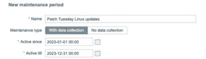

图 11.1 – Zabbix 数据收集 | 维护，创建维护窗口，Patch Tuesday

1.  现在，在**周期**部分，我们将创建一个新的维护周期。我们需要点击下划线的**添加**文本。

1.  这将带我们到另一个弹出窗口，在那里我们可以设置维护周期。我们需要填写以下信息：


图 11.2 – Zabbix 数据收集 | 维护，创建维护周期窗口，Patch Tuesday

1.  现在点击蓝色的**添加**按钮继续。你现在应该能看到我们的维护周期已经填写完成：


图 11.3 – Zabbix 配置 | 维护，创建维护周期页面，Patch Tuesday

1.  现在，在**主机组**字段旁边，点击**选择**按钮，选择**Linux 服务器**主机组。我们的页面应该看起来像这样：

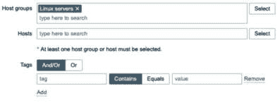

图 11.4 – Zabbix 配置 | 维护，添加主机到维护页面，Patch Tuesday

1.  如果你愿意，仍然可以添加一个**描述**。

1.  接下来，点击页面底部的蓝色**添加**按钮，完成创建维护周期。这将带我们回到**维护周期**页面，在那里我们应该能看到我们的维护窗口已经创建成功。

## 它是如何工作的…

在 Zabbix 中配置操作时，我们告诉 Zabbix 在触发器被触发时执行某个定义的操作。维护周期（带数据收集）通过在维护周期定义的时间段内抑制这些 Zabbix 操作来工作。我们这样做是为了确保在进行主机维护时，Zabbix 用户不会收到任何关于问题的通知。当然，最好只在我们实际在相关主机上工作时使用此功能。不过，只有在操作上勾选了**暂停被抑制问题的操作**复选框时，这才有效。

在这个示例中，我们已经为 2023 年整个年度创建了一个定期维护周期（带数据收集）。假设我们工作的组织有许多 Linux 主机，每周需要进行补丁更新。我们将维护周期设置为每周二晚上 22:00 到次日凌晨 04:00 之间重复。

请注意，2023 年 12 月 31 日后，Zabbix 将停止此维护期，因为它将不再处于活动状态。在设置计划维护时，我们需要牢记两个时间/日期值。一个是维护期的 **Active since**/**Active till** 时间/日期值，另一个是 **Periods** 时间/日期值。这让我们可以创建更灵活的维护期，以及像我们刚才做的那样的定期维护期。

另外，请注意，`nodata` 触发功能也会受到维护期的影响，在这两种情况下它都不会触发。

# 备份你的 Zabbix 配置

在进行任何 Zabbix 配置之前，备份所有重要内容至关重要。在本教程中，我们将介绍在对 Zabbix 配置进行维护之前，应该始终采取的一些最重要的步骤。

## 准备工作

我们需要 Zabbix 服务器，对于此我将使用 `lar-book-rocky`。确保准备好 CLI 连接到服务器，因为整个过程将使用 Linux CLI。

## 如何操作……

1.  首先，通过 Linux CLI 登录到我们的 Zabbix 服务器，并创建一些新的目录，我们将用于 Zabbix 备份。最好将这个目录放在另一个分区上：

    ```
    mkdir /opt/zbx-backup/
    mkdir /opt/zbx-backup/database/
    mkdir /opt/zbx-backup/zbx-config/
    mkdir /opt/zbx-backup/nginx/
    mkdir /opt/zbx-backup/lib/
    mkdir /opt/zbx-backup/shared/
    mkdir /opt/zbx-backup/shared/zabbix/
    mkdir /opt/zbx-backup/shared/doc/
    ```

1.  备份我们所有的 Zabbix 配置数据非常重要，这些数据位于 **/etc/zabbix/**。我们可以通过执行以下命令手动将数据从当前文件夹复制到新的备份文件夹：

    ```
    cp -r /etc/zabbix/ /opt/zbx-backup/zbx-config/
    ```

1.  现在，我们对 **nginx** 配置做同样的操作：

    ```
    cp -r /etc/nginx/ /opt/zbx-backup/nginx/
    ```

重要说明

请注意，如果你使用的是 Apache，Web 配置的位置可能会有所不同。请根据需要调整你的命令。对于基于 Red Hat 的系统，通常是 **/etc/httpd**，对于基于 Debian 的系统，通常是 **/etc/apache2**。

1.  备份我们的 Zabbix PHP 文件和二进制文件也很重要。我们可以使用以下命令来完成：

    ```
    cp -r /usr/share/zabbix/ /opt/zbx-backup/shared/zabbix/
    cp -r /usr/share/doc/zabbix-* /opt/zbx-backup/shared/doc/
    ```

1.  最后，确保也备份 **/usr/lib** 中的 Zabbix 文件：

    ```
    cp -r /usr/lib/zabbix/ /opt/zbx-backup/lib/
    ```

1.  我们还可以创建一个 cronjob，每天 **00:00** 自动压缩并备份这些文件。只需执行以下命令：

    ```
    crontab -e
    ```

1.  并添加以下信息：

    ```
    0 0 * * * tar -zcvf /opt/zbx-backup/zbx-config/zabbix.tar.gz /etc/zabbix/ >/dev/null 2>&1
    0 0 * * * tar -zcvf /opt/zbx-backup/web-config/zabbix-web.tar.gz /etc/nginx/ >/dev/null 2>&1
    0 0 * * * tar -zcvf /opt/zbx-backup/shared/zabbix/zabbix_usr_share.tar.gz /usr/share/zabbix/ >/dev/null 2>&1
    0 0 * * * tar -zcvf /opt/zbx-backup/shared/doc/zabbix_usr_share_doc.tar.gz /usr/share/doc/ >/dev/null 2>&1
    0 0 * * * tar -zcvf /opt/zbx-backup/lib /zabbix_usr_lib.tar.gz /usr/lib/zabbix/ >/dev/null 2>&1
    ```

1.  这些是我们需要从 Zabbix 堆栈中备份的最重要文件。接下来，我们处理数据库。我们现在还可以使用像 **logrotate** 这样的轮换工具来管理我们的文件。

1.  备份我们的数据库非常简单。我们可以直接使用 MySQL 和 PostgreSQL 提供的内置工具。为你的相应数据库执行以下命令（确保填写正确的用户名、数据库名和密码）：

    对于 MySQL 数据库：

    ```
    mysqldump --add-drop-table --add-locks --extended-insert --single-transaction --quick -u zabbixuser -p zabbixdb > /opt/zbx-backup/database/backup_zabbixDB_<DATE>.sql
    ```

    对于 PostgreSQL 数据库：

    ```
    pg_dump zabbixdb > /opt/zbx-backup/database/backup_ zabbixDB_<DATE>.bak
    ```

1.  确保添加正确的位置，因为如果数据库本身很大，数据库转储将会非常庞大。最好将其转储到另一个磁盘/分区，甚至更好的是，转储到另一台机器上。因此，**/opt/** 可能不是最佳位置。

1.  我们还可以通过设置一个 cronjob，执行以下命令来实现：

    ```
    crontab -e
    ```

1.  然后对于 MySQL，添加以下行，其中**-u**是用户名，**-p**是密码，数据库名是**zabbix**。这是 MySQL 的命令：

    ```
    55 22 * * 0 mysqldump -u'zabbixuser' -p'password' zabbixdb > /opt/zbx-backup/database/backup_zabbixDB.sql
    ```

1.  如果你想通过 cronjob 备份 PostgreSQL 数据库，我们需要在用户的主目录中创建一个文件：

    ```
    vim ~/.pgpass
    ```

1.  我们将以下内容添加到此文件中，其中**zabbixuser**是用户名，**zabbixdb**是数据库名：

    ```
    #hostname:port:database:username:password
    localhost:5432:zabbixdb:zabbixuser:password
    ```

1.  然后我们可以为 PostgreSQL 添加一个 cronjob，如下所示：

    ```
    55 22 * * 0 pg_dump --no-password -U zabbixuser zabbixdb > /opt/zbx-backup/database/backup_zabbixDB_date.bak
    ```

1.  我们还可以添加一个 cronjob，只保留一定天数的备份。运行以下命令：

    ```
    crontab -e
    ```

1.  然后添加以下行，其中**+60**是你希望保留备份的天数：

    ```
    55 22 * * 0 find /opt/zbx-backup/database/ -mtime +60 -type f -delete
    ```

1.  这就结束了我们展示的以简便方式备份 Zabbix 组件的过程。

重要提示

对于 MySQL 数据库，也有 ExtraBackup 等工具，而对于 Postgres，我们可以使用 PGBarman。虽然这些工具可以用于为系统创建备份，但此处提供的内建示例同样非常实用。

## 它是如何工作的……

Zabbix 设置由多个组件组成。我们有 Zabbix 前端、Zabbix 服务器和 Zabbix 数据库。这些组件在此设置中需要运行不同的软件，如下图所示：

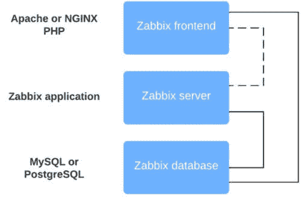

图 11.5 – Zabbix 关键组件设置图

从前面的图表中，我们可以看到我们的 Zabbix 前端运行在 NGINX 或 Apache 等 Web 引擎上。我们还需要 PHP 来运行我们的 Zabbix 网页。这意味着我们需要备份两个组件：

+   Web 引擎：NGINX、Apache 或其他

+   PHP

Zabbix 服务器是 Zabbix 设计的应用程序，所以我们这里只需备份一件事：**Zabbix 服务器的配置文件**。

最后但绝对重要的是，我们需要备份我们的数据库。最常用的数据库是 MySQL 和 PostgreSQL，因此我们只需要做一件事：**创建 Zabbix 数据库的转储**。

## 还有更多……

以这种方式备份 Zabbix 设置是一方面，但当然，这还不是全部。确保你使用快照和其他技术正确备份 Linux 系统。

当你遵循标准备份实施方案时，你应该为 Zabbix 设置中任何不可预见的情况做好准备。

# 将 Zabbix 后端从较旧的 PHP 版本升级到 PHP 8.2 或更高版本

RHEL7、Ubuntu 20.04 和 Debian 9（Stretch）已不再受到 Zabbix 支持，因此我们的升级方案不再包括从 PHP 版本 7.2 之前升级到 8.2 或更高版本的任何信息。较新的 Linux 版本已随 PHP8.0 或更高版本一起发布，这意味着当我们将 Zabbix 设置从 Zabbix 6 版本升级到 Zabbix 7 时，可以直接进行升级。

Zabbix 7 对 PHP 的要求与 Zabbix 6 不同，这意味着如果我们正在运行 PHP 7.2，实际上在运行最新的 Zabbix 7 版本之前，我们必须进行强制性升级。我个人也倾向于以*面向未来*的方式工作，所以在本教程中，我们将讲解如何将 PHP 7.2 升级到 8.2，这是截至写作时在基于 RHEL8 的系统上支持的最新版本。

## 准备工作

对于本教程，我们需要的服务器是安装了基于 RHEL8 的系统，并运行 Zabbix 服务器 6 和 PHP 7.2 版本。

另一种可能是你有一台运行 Debian 系发行版（如 Ubuntu 20.04、Debian 11 或更高版本）服务器。这些系统默认包括 PHP 7.2 或更高版本。

在本教程中，我将始终把两个可能的服务器称作`lar-book-zbx6`。

最后，确保备份你的系统并阅读你正在安装的新版本的发布说明。

## 如何操作…

本教程分为两个不同的部分，一个针对基于 RHEL8 的系统，另一个针对 Ubuntu 系统。我们将首先讲解 RHEL8 的步骤。

### 基于 RHEL8 的系统

如果你已经在基于 RHEL8 的系统上运行 PHP 7.2 版本，升级过程会更简单。让我们看看在这种情况下如何升级我们的`lar-book-zbx6`服务器：

1.  首先，始终通过以下命令验证我们正在运行的 PHP 版本：

    ```
    php-fpm --version
    ```

1.  如果版本低于 8.2，我们可以继续执行下一步。我们将执行以下命令：

    ```
    dnf module list php
    ```

1.  这将显示类似以下截图的内容：

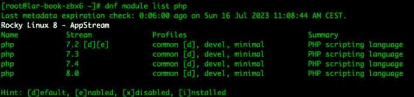

图 11.6 – RHEL8 DNF 模块列表（PHP）

1.  不幸的是，在 RHEL8 上，最新稳定的 PHP 8.3 版本并未包含在来自 AppStream 的 DNF 模块中。这意味着我们必须为基于 RHEL8 的系统找到替代的解决方案。如果你想安装 PHP 8.3 或更高版本，请继续到*步骤 9*。

1.  由于 PHP 8.2 已包含在 AppStream 列表中，请重置你当前可用的 PHP 模块：

    ```
    dnf module reset php
    ```

1.  确保回答为**Y**。然后，我们将通过以下命令启用最新的 PHP 版本：

    ```
    dnf module enable php:8.2
    ```

1.  再次回答**Y**以启用 PHP 8.2，然后我们可以通过以下命令升级 PHP 版本：

    ```
    dnf update
    ```

1.  再次回答**Y**，你的 PHP 版本现在将运行最新的 PHP 8.2 版本。

1.  如果我们无法使用**dnf module enable**方法来安装你想要的版本，我们将不得不依赖其他方式来获取 PHP，最常见的方法是使用 REMI 仓库。

1.  通过以下命令确保系统是最新的：

    ```
    dnf update
    ```

1.  REMI 依赖于 EPEL 仓库，所以我们需要首先添加 EPEL 仓库：

    ```
    dnf install epel-release
    ```

1.  安装**epel-release**后，确保将 Zabbix 从中排除。这可以确保 Zabbix 仅从官方 Zabbix 仓库下载和更新：

    ```
    [epel]
    excludepkgs=zabbix*
    ```

1.  .然后通过以下命令安装 REMI 仓库：

    ```
    sudo dnf -y install http://rpms.remirepo.net/enterprise/remi-release-8.rpm
    ```

1.  重置 PHP 模块并启用 REMI PHP 8.3 版本：

    ```
    dnf module reset php -y
    dnf module install php:remi-8.3
    ```

1.  在安装过程中，随时输入 **Y** 或 **Yes**。

1.  然后，验证升级是否成功：

    ```
    php-fpm -v
    ```

1.  确保重新启动 NGINX（或 Apache）和 **php-fpm**：

    ```
    systemctl restart nginx php-fpm
    ```

这些步骤已在 Rocky Linux RHEL 系统上测试过，但它们应该适用于任何基于 RHEL8 的系统，无论是 Stream 版本还是像 Alma Linux 这样的完整重建版本。

考虑升级到基于 RHEL9 的系统，以便支持 PHP 包的更新版本。

### Ubuntu 系统

让我们将 Ubuntu 系统升级到可用的最新版本 PHP：

1.  首先，通过以下命令将 PPA 仓库添加到我们的主机中：

    ```
    apt install software-properties-common
    add-apt-repository ppa:ondrej/php
    ```

1.  现在通过以下命令更新仓库：

    ```
    apt update
    ```

1.  在某些安装中，仓库的密钥可能不可用，在这种情况下，我们可能会看到错误提示 **Key is not available**。我们可以通过以下命令修复此问题，其中 **PUB_KEY_HERE** 是错误中显示的密钥：

    ```
    apt-key adv --keyserver keyserver.ubuntu.com --recv- keys PUB_KEY_HERE
    ```

1.  现在，我们可以通过以下命令安装 PHP 8.3 版本：

    ```
    apt install -y php8.3
    apt upgrade -y php
    apt autoremove
    ```

1.  就这样，PHP 版本现在应该是我们想要的版本。可以通过以下命令检查 PHP 版本：

    ```
    php --version
    ```

## 它是如何工作的……

因为 Zabbix 7 要求我们安装 PHP 8.0 或更高版本，如果我们仍然使用 PHP 7.2 来安装 Zabbix 6，就需要升级 PHP 版本。这是与 Zabbix 6 的不同要求，因此在某些情况下升级过程可能会比较长。如果你仍然使用 RHEL7、Ubuntu 20.04 或 Debian 9（Stretch），那么也需要先升级你的 Linux 系统。Zabbix 已停止支持这些较旧的 Linux 版本，以便简化软件包管理、安全性和支持。

目前，仍然可以通过从源代码构建的方式在较旧的 Linux 版本上运行 Zabbix，但不推荐这么做。

在本配方中，我们将 PHP 从 7.2 升级到 PHP 8.2 或 8.3，这些是本文写作时支持的最新稳定版本。进行此升级不会破坏我们当前的 Zabbix 服务器安装。如前所述，这是一个强制升级，因为 PHP 8.0 以下的版本已太旧，无法运行 Zabbix 7。即使升级是可选的，考虑运行最新的稳定软件版本总是好的，这样我们才能为未来做好准备。

现在我们已经升级了 PHP，可以继续升级 Zabbix 数据库引擎。

# 将 Zabbix 数据库从旧版本的 MariaDB 升级到 MariaDB 11.4

对于我们的 Zabbix 7 安装，我们需要 MariaDB 10.5 或更高版本，因此保持数据库版本最新是个好主意。MariaDB 定期改进其处理某些性能方面的方式。

本配方详细说明了如何将 MariaDB 升级到最新的稳定 LTS 版本，即本文写作时的 MariaDB 11.4。

## 准备工作

对于本配方，我们需要我们的服务器，我们将其命名为 `lar-book-zbx6`。此时，服务器正在运行基于 RHEL8 的发行版。

另一个选项是在运行 Debian-based 发行版（如 Ubuntu 22.04、Debian 12 或这些 Linux 发行版的更新版本）的服务器上。我们将升级此服务器上的 MariaDB 实例到 11.4 版本。

如果您已经按照 *将 Zabbix 后端从较旧的 PHP 版本升级到 PHP 8.2 或更高版本* 文档操作，则您的服务器现在将运行 PHP 版本 8.2 或更高版本。如果没有，请首先按照该文档操作是个好主意。

另外，请确保备份系统并阅读您安装的新版本的发布说明。我们在 *备份您的 Zabbix 设置* 文档中涵盖了这一点。

## 如何做…

1.  首先要做的是，让我们登录到我们的 Linux 主机 CLI，检查我们的版本。执行以下命令：

    对于 Zabbix 服务器：

    ```
    zabbix_server --version
    php-fpm --version
    ```

    对于 MariaDB：

    ```
    mysql --version
    ```

1.  在验证我们的版本与本文档 *准备工作* 部分中提到的版本相匹配后，让我们继续升级 MariaDB 的版本。

### 基于 RHEL 的系统

1.  在我们的基于 RHEL 的服务器上，在检查版本后，我们首先要做的是停止我们的 Zabbix 环境：

    ```
    systemctl stop mariadb nginx zabbix-server
    ```

1.  现在使用以下命令设置 MariaDB 的仓库文件：

    ```
    vim /etc/yum.repos.d/mariadb.repo
    ```

1.  我们将把以下代码添加到这个新文件中。如果使用除 **amd64** 以外的任何其他架构，请确保在 **baseurl** 后面添加正确的架构：

    ```
    [mariadb-main]
    name = MariaDB Server
    baseurl = https://dlm.mariadb.com/repo/mariadb-server/11.4/yum/rhel/8/x86_64
    gpgkey = file:///etc/pki/rpm-gpg/MariaDB-Server-GPG-KEY
    gpgcheck = 1
    enabled = 1
    module_hotfixes = 1
    [mariadb-maxscale]
    # To use the latest stable release of MaxScale, use "latest" as the version
    # To use the latest beta (or stable if no current beta) release of MaxScale, use "beta" as the version
    name = MariaDB MaxScale
    baseurl = https://dlm.mariadb.com/repo/maxscale/latest/yum/rhel/8/x86_64
    gpgkey = file:///etc/pki/rpm-gpg/MariaDB-MaxScale-GPG-KEY
    gpgcheck = 1
    enabled = 1
    [mariadb-tools]
    name = MariaDB Tools
    baseurl = https://downloads.mariadb.com/Tools/rhel/8/x86_64
    gpgkey = file:///etc/pki/rpm-gpg/MariaDB-Enterprise-GPG-KEY
    gpgcheck = 1
    enabled = 1
    [mariadb-main]
    name = MariaDB Server
    baseurl = https://dlm.mariadb.com/repo/mariadb-server/11.4/yum/rhel/8/x86_64
    gpgkey = file:///etc/pki/rpm-gpg/MariaDB-Server-GPG-KEY
    gpgcheck = 1
    enabled = 1
    module_hotfixes = 1
    [mariadb-maxscale]
    # To use the latest stable release of MaxScale, use "latest" as the version
    # To use the latest beta (or stable if no current beta) release of MaxScale, use "beta" as the version
    name = MariaDB MaxScale
    baseurl = https://dlm.mariadb.com/repo/maxscale/latest/yum/rhel/8/x86_64
    gpgkey = file:///etc/pki/rpm-gpg/MariaDB-MaxScale-GPG-KEY
    gpgcheck = 1
    enabled = 1
    [mariadb-tools]
    name = MariaDB Tools
    baseurl = https://downloads.mariadb.com/Tools/rhel/8/x86_64
    gpgkey = file:///etc/pki/rpm-gpg/MariaDB-Enterprise-GPG-KEY
    gpgcheck = 1
    enabled = 1
    ```

1.  或者更好的方法是使用 MariaDB 设置脚本：

    ```
    curl -LsS https://r.mariadb.com/downloads/mariadb_repo_setup | sudo bash -s -- --mariadb-server-version="mariadb-11.4"
    ```

1.  现在使用以下命令升级您的 MariaDB 服务器：

    ```
    dnf upgrade MariaDB*
    ```

1.  使用以下命令重新启动 MariaDB 服务：

    ```
    systemctl start mariadb zabbix-server nginx
    ```

1.  现在，MariaDB 应该已经升级到预期的版本。使用以下命令再次检查版本以确保：

    ```
    mariadb --version
    ```

### Ubuntu 系统

1.  在我们的 Ubuntu 服务器上，检查版本后，我们首先要做的是停止我们的 Zabbix 服务器环境：

    ```
    systemctl stop mariadb zabbix-server nginx
    ```

1.  检查 **/etc/apt/sources.list.d/mariadb.list** 中的 MariaDB 仓库文件。要检查它是否在 11.4 版本上，请使用以下命令编辑它：

    ```
    vim /etc/apt/sources.list.d/mariadb.list
    ```

1.  文件应该看起来像以下的代码块。如果看起来不对，请编辑它以匹配。如果使用除 **amd64** 外的任何其他架构，请确保在 **deb** 行上添加正确的架构：

    ```
    # MariaDB Server
    # To use a different major version of the server, or to pin to a specific minor version, change URI below.
    deb [arch=amd64,arm64] https://dlm.mariadb.com/repo/mariadb-server/11.4/repo/ubuntu jammy main
    deb [arch=amd64,arm64] https://dlm.mariadb.com/repo/mariadb-server/11.4/repo/ubuntu jammy main/debug
    # MariaDB MaxScale
    # To use the latest stable release of MaxScale, use "latest" as the version
    # To use the latest beta (or stable if no current beta) release of MaxScale, use "beta" as the version
    deb [arch=amd64,arm64] https://dlm.mariadb.com/repo/maxscale/latest/apt jammy main
    # MariaDB Tools
    deb [arch=amd64] http://downloads.mariadb.com/Tools/ubuntu jammy main
    ```

1.  或者，我们可以使用 MariaDB 仓库设置脚本来更新到正确的仓库。执行以下命令：

    ```
    curl -LsS https://r.mariadb.com/downloads/mariadb_repo_setup | sudo bash -s -- --mariadb-server-version="mariadb-11.4"
    ```

1.  我们需要使用以下命令移除旧的 MariaDB 包：

    ```
    apt remove mariadb-server mariadb-client
    ```

1.  现在使用以下命令升级 MariaDB 服务器版本：

    ```
    apt install mariadb-server mariadb-client
    ```

1.  使用以下命令重新启动 MariaDB：

    ```
    systemctl restart mariadb
    ```

1.  然后执行 **upgrade** 命令：

    ```
    mariadb-upgrade
    ```

1.  现在重新启动 Zabbix：

    ```
    systemctl restart zabbix-server nginx
    ```

1.  现在，MariaDB 应该已经升级到正确的版本。使用以下命令再次检查版本：

    ```
    mariadb --version
    ```

## 工作原理…

现在，虽然这可能并非总是必要的要求，但定期升级您的数据库版本是一个明智的想法。您的数据库引擎的新版本可能包括对稳定性和性能的改进，这两者都可能极大地改善您的 Zabbix 服务器。

但请保持关注发布说明和错误报告。在撰写本文时，MariaDB 11.4 是市场上最新的 LTS 版本。您可能希望留在一两个版本之后，因为这些版本仍然得到支持，并且已经在生产中运行了一段时间。毕竟，没有人喜欢出现意外问题，比如 bug。

对于 Zabbix 7，我们确实需要安装至少 MariaDB 10.5 或更新支持的版本，请记住这一点。

## 还有更多内容…

如果您真的无法升级到 MariaDB 版本 10.5，或者如果您运行的是其他数据库，则支持该数据库的版本，那么就有了一个新的 Zabbix 功能。Zabbix 7 允许我们运行不受支持的数据库版本。当我们编辑 Zabbix 服务器配置文件 `/etc/zabbix/zabbix_server.conf` 时，我们可以添加以下参数：

```
AllowUnsupportedDBVersions=1
```

这将允许您运行一个尚未经 Zabbix 官方测试和支持的旧版或新版数据库版本，但请记住，这样做并不建议。请查看当前 Zabbix LTS 安装要求的信息：

[`www.zabbix.com/documentation/current/zh/manual/installation/requirements`](https://www.zabbix.com/documentation/current/en/manual/installation/requirements)

# 升级您的 Zabbix 设置

正如我们在整本书中已经看到的那样，Zabbix 7 提供了许多很酷的新功能。Zabbix 7.0 是一个**长期支持**（**LTS**）版本，因此就像 5.0 和 6.0 一样，您将会长期支持它。让我们看看如何将 Zabbix 服务器从 6.0 版本升级到 7.0 版本。

## 准备就绪

对于此配方，我们将需要名为 `lar-book-zbx6` 的服务器。此时，您的服务器将运行基于 RHEL8 的 Linux 发行版或类似 Ubuntu 22.04、Debian 12 或更新版本的 Debian 发行版。

如果您按照 *将 Zabbix 后端从较旧的 PHP 版本升级到 PHP 8.2 或更高版本* 的步骤，您的服务器现在将运行 PHP 版本 8.2 或更高版本。如果没有，请首先按照该步骤操作是个不错的选择。

如果您按照 *将 Zabbix 数据库从较旧的 MariaDB 版本升级到 MariaDB 11.4* 的步骤，它现在将运行 MariaDB 版本 11.4。如果没有，请首先按照该步骤操作是个明智的选择。

此外，请务必备份您的系统并阅读您正在安装的新版本的发布说明。我们在 *备份您的 Zabbix 设置* 配方中已经覆盖了这一点。

## 如何操作…

首先，让我们登录到我们的 Linux 主机 CLI，检查我们的软件版本：

1.  发出以下命令检查各自的软件版本：

    对于 Zabbix 服务器：

    ```
    zabbix_server --version
    php-fpm --version
    ```

    对于 MariaDB：

    ```
    mariadb --version
    ```

1.  在验证我们的版本与此配方中 *准备就绪* 部分中提到的版本相匹配后，让我们继续升级我们的 Zabbix 服务器。

### 基于 RHEL 的系统

首先，我们将从 RHEL-based 系统上升级 Zabbix 服务器：

1.  让我们使用以下命令停止我们的 Zabbix 服务器组件：

    ```
    systemctl stop zabbix-server zabbix-agent2
    ```

1.  在我们的服务器上，使用以下命令添加新的 Zabbix 7.0 软件库：

    ```
    rpm -Uvh https://repo.zabbix.com/zabbix/7.0/rhel/8/ x86_64/zabbix-release-7.0-1.el8noarch.rpm
    ```

1.  使用以下命令清理软件库：

    ```
    dnf clean all
    ```

1.  现在使用以下命令升级 Zabbix 配置：

    ```
    dnf upgrade zabbix-server-mysql zabbix-web-mysql zabbix-agent2
    ```

1.  此外，安装 Zabbix NGINX 配置：

    ```
    dnf install zabbix-nginx-conf
    ```

1.  使用以下命令启动 Zabbix 组件：

    ```
    systemctl restart zabbix-server zabbix-agent2
    ```

1.  当我们检查服务器是否正在运行时，使用以下命令时，它应该显示**Active**（**running**）：

    ```
    systemctl status zabbix-server
    ```

1.  如果没有，使用以下命令检查日志，看看发生了什么：

    ```
    tail -f /var/log/zabbix/zabbix_server.log
    ```

1.  检查日志文件是否有任何明显错误，如果发现问题，修复后再继续。

1.  如果我们重新启动服务器，错误应该消失，Zabbix 服务器应继续运行：

    ```
    systemctl restart zabbix-server
    ```

1.  现在使用以下命令重启 Zabbix 组件：

    ```
    systemctl restart nginx php-fpm zabbix-server mariadb
    ```

1.  现在一切应该按预期工作，我们应该能够看到新的 Zabbix 7 前端，如下图所示：

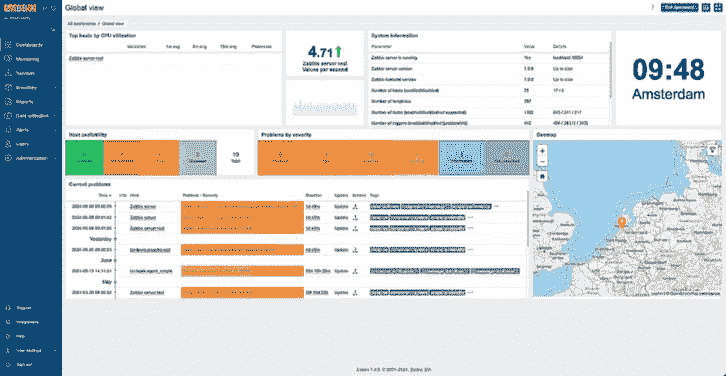

图 11.7 – RHEL 上升级后的 Zabbix 7 前端

### Ubuntu 系统

1.  首先，使用以下命令停止 Zabbix 服务器组件：

    ```
    systemctl stop zabbix-server zabbix-agent2
    ```

1.  现在使用以下命令为 Ubuntu 添加 Zabbix 7 的新软件库：

    ```
    wget https://repo.zabbix.com/zabbix/7.0/ubuntu/pool/main/z/zabbix-release/zabbix-release_7.0-1+ubuntu22.04_all.deb
    dpkg -i zabbix-release_7.0-1+ubuntu22.04_all.deb
    ```

重要提示

始终访问 **zabbix.com/download** 获取适合你系统的软件库。在本例中，我使用了 Ubuntu 的软件库。请根据你的系统替换为正确的软件库。

1.  使用以下命令更新软件库信息：

    ```
    apt update
    ```

1.  现在使用以下命令升级 Zabbix 服务器组件：

    ```
    apt install –-only-upgrade zabbix-server-mysql zabbix-frontend-php zabbix-agent2
    ```

1.  确保不要覆盖 Zabbix 服务器配置文件。如果你不小心覆盖了配置文件，可以从*备份你的 Zabbix 配置*食谱中恢复。

1.  然后使用以下命令安装新的 Zabbix NGINX 配置：

    ```
    apt install zabbix-nginx-conf
    ```

1.  使用以下命令重启 Zabbix 服务器组件，完成升级：

    ```
    systemctl restart zabbix-server nginx zabbix-agent2
    ```

1.  使用以下命令检查日志，查看发生了什么：

    ```
    tail -f /var/log/zabbix/zabbix_server.log
    ```

1.  检查日志文件是否有任何明显错误，如果发现问题，修复后再继续。

1.  如果我们重新启动服务器，错误应该消失，Zabbix 服务器应继续运行：

    ```
    systemctl restart zabbix-server
    ```

1.  这应该完成升级过程，如果我们进入前端页面，应该看到新的 Zabbix 7 前端：

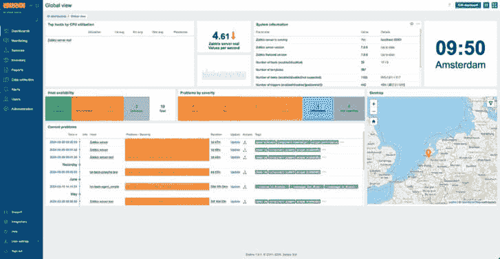

图 11.8 – Ubuntu 升级后的 Zabbix 7 前端

## 它是如何工作的……

当我们使用最新版本的 Linux 时，升级 Zabbix 可能是个简单的任务。但如果我们使用的是旧版软件，则可能会遇到一些问题。

我们刚刚遵循的步骤展示了一个 Zabbix 6 实例的升级过程，最终将系统升级为运行 Zabbix 7，并且列出了我们可能遇到的最常见问题。

重要提示

在升级过程中，请注意查看你的**zabbix_server.log**文件，因为该文件会告诉你升级过程中是否发生了任何问题。

我们确保将 PHP 升级到高于 8.0 的版本，因为这是 Zabbix 7 的要求。如果我们运行较旧的 PHP 版本，从 Zabbix 6 升级会变得有些复杂。至于数据库，Zabbix 在 Zabbix 6 和 Zabbix 7 之间保持了相同的要求，要求 MariaDB 10.5 或更新的受支持版本来配置 Zabbix。

现在，您已经升级了所有组件，应该准备好使用 Zabbix 7，并且您的设置会在一段时间内保持未来兼容——当然，直到 Zabbix 8 发布，届时可能会有新的要求。

## 另见

请确保查看您正在升级的版本的 Zabbix 文档。Zabbix 总是包含详细的要求和流程描述，以便尽可能简化您的升级过程。查看适用于您版本的文档：

[`www.zabbix.com/documentation/current/en/manual/installation/upgrade`](https://www.zabbix.com/documentation/current/en/manual/installation/upgrade)

# 维持 Zabbix 性能

确保您的 Zabbix 设置在长期内持续保持良好性能非常重要。有几个关键组件对保持 Zabbix 设置的最佳性能至关重要。让我们看看如何处理这些组件，确保 Zabbix 设置运行顺利。

## 准备工作

这个配方中，我们只需要一台 Zabbix 7 服务器。

## 如何操作…

我们将讨论在维护 Zabbix 服务器性能时人们面临的三个主要问题。首先，先来看看 Zabbix 进程以及如何编辑它们。

### Zabbix 进程

一个常见问题是 Zabbix 进程过于繁忙。让我们登录 Zabbix 前端，查看这个问题可能是什么样子。

首先，让我们通过登录到 Zabbix 服务器前端来查看一些消息：

1.  当我们导航到**监控** | **仪表盘**，然后选择默认仪表盘**全局视图**时，我们可能会看到如下内容：


图 11.9 – 来自我们 Zabbix 服务器的问题，发现器进程 75% 繁忙

1.  然后我们导航到**监控** | **主机**，点击 Zabbix 服务器主机的**最新数据**（在我的情况下，主机名是**lar-book-rocky**）。这将带我们到该主机的最新数据。

1.  对于过滤器，在**名称**字段中输入 **discovery**，然后点击**图形**以查看发现工作项。这将展示以下图形：

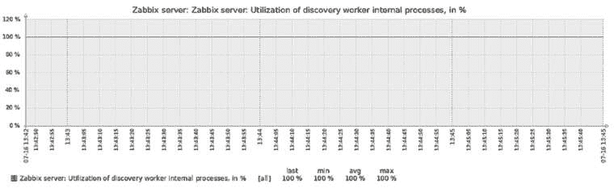

图 11.10 – Zabbix 服务器发现图，发现数据收集器的利用率百分比

这个图形几乎一直保持在 100%，这也解释了为什么我们在仪表盘上看到了*图 11.9* 中显示的问题。

1.  让我们登录到 Zabbix 服务器的 Linux CLI，编辑此进程。

1.  编辑以下文件，在你的 Zabbix 服务器上：

    ```
    vim /etc/zabbix/zabbix_server.conf
    ```

1.  现在，如果我们想要给 Zabbix 服务器的 **发现器** 进程更多空间，我们需要编辑正确的参数。向下滚动，直到你看到以下内容：

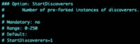

图 11.11 – Zabbix 服务器配置文件，StartDiscoverers 默认值

1.  现在，在此基础上添加一行并输入以下内容：

    ```
    StartDiscoverers=2
    ```

1.  如果你的文件现在看起来像下面的截图，你可以保存并退出文件：


图 11.12 – Zabbix 服务器配置文件，StartDiscoverers 2

1.  为了使更改生效，我们将需要使用以下命令重启 Zabbix 服务器：

    ```
    systemctl restart zabbix-server
    ```

1.  现在，如果我们返回到 Zabbix 前端，我们应该仍然停留在我们可以看到以下内容的图形界面：

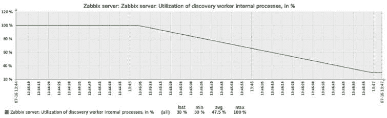

图 11.13 – Zabbix 服务器发现器图

我们的发现器进程的利用率已下降，这意味着我们的利用率问题将不再出现。这就是我们编辑 Zabbix 服务器进程的方式。

### Zabbix 维护进程

另一个人们常遇到的问题是 Zabbix 维护进程过于繁忙。让我们登录到 Zabbix 前端并检查这个问题：

1.  当我们导航到 **监控** | **仪表板**，然后选择默认仪表板 **全局视图** 时，我们可能会看到类似这样的内容：


图 11.14 – Zabbix 维护进程的问题

1.  与编辑任何 Zabbix 进程类似，我们也可以编辑 Zabbix 维护进程。让我们登录到 Zabbix 服务器的 Linux 命令行界面来编辑我们的进程。

1.  让我们在 Zabbix 服务器上编辑以下文件：

    ```
    vim /etc/zabbix/zabbix_server.conf
    ```

1.  现在，如果我们想要编辑这个过程，我们需要编辑正确的参数。向下滚动，直到你看到以下内容：

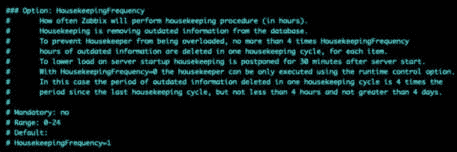

图 11.15 – Zabbix 配置文件，HousekeepingFrequency 1

1.  这是我们的第一个维护参数。让我们通过在此代码块下添加以下行来编辑此参数：

    ```
    HousekeepingFrequency=2
    ```

重要提示

延长间隔并不能解决你的问题；最多，你只是推迟了不可避免的情况。仅建议在下一个维护窗口期间更改此设置，并应尽量避免这样做。

1.  现在向下滚动，直到你看到以下内容：

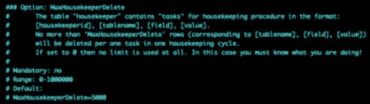

图 11.16 – Zabbix 配置文件，HousekeepingDelete 5000

1.  上面的截图显示了我们的第二个维护参数。让我们通过在此代码块下添加以下行来编辑此参数：

    ```
    MaxHousekeeperDelete=20000
    ```

1.  为了使更改生效，我们需要使用以下命令重启 Zabbix 服务器：

    ```
    systemctl restart zabbix-server
    ```

### 调整 MySQL 数据库

1.  让我们看看如何轻松调优 MySQL 数据库。首先，打开浏览器访问以下链接：[`github.com/major/MySQLTuner-perl`](https://github.com/major/MySQLTuner-perl)。

1.  这个链接将我们引导到一个由 *Major Hayden* 发起的开源 GitHub 项目。务必关注该项目并尽可能提供帮助。我们可以从 GitHub 仓库下载脚本，或者直接使用以下命令：

    ```
    wget https://raw.githubusercontent.com/major/MySQLTuner-perl/master/mysqltuner.pl
    ```

1.  现在我们可以使用以下命令执行此脚本：

    ```
    perl mysqltuner.pl
    ```

1.  这将提示我们输入 MySQL 数据库凭证。填写完毕后继续：

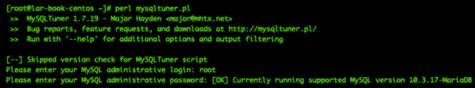

图 11.17 – MySQL 调优脚本执行

1.  现在，脚本将输出大量信息，你需要仔细阅读，但最重要的部分在最后——**Variables** **to adjust** 之后的所有内容：

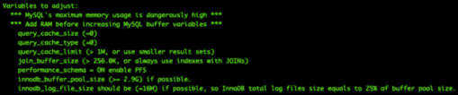

图 11.18 – MySQL 调优脚本输出

重要提示

*不要*仅仅复制脚本的输出。该脚本只是给出了可能需要调优的 MySQL 设置的提示。始终查阅建议的设置，并了解这些设置的最佳实践。

1.  我们可以在 MySQL **my.cnf** 文件中编辑这些变量。在我的情况下，我使用以下命令进行编辑：

    ```
    vim /etc/my.cnf.d/server.cnf
    ```

1.  现在，你只需编辑或添加脚本中建议的变量，然后重新启动 MySQL 服务器：

    ```
    systemctl restart mariadb
    ```

## 它是如何工作的…

我们已经做了三个主要的 Zabbix 服务器性能调优，但还有很多工作要做。让我们回顾一下我们刚刚编辑的内容，思考为什么要这么做，并弄清楚它是否真的是这么简单。

### Zabbix 进程

Zabbix 进程是 Zabbix 服务器配置的重要部分，必须小心编辑。在这个实例中，我们只是在一个小型安装中编辑了发现进程。这个问题很容易解决，因为服务器有足够的资源来支持额外的进程运行。

现在，如果我们查看以下示意图，可以看到在我们添加新的发现进程之前的情况：

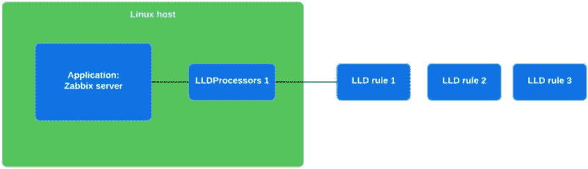

图 11.19 – Zabbix 服务器单进程配置示意图

我们可以看到我们的 **Linux 主机** 正在运行 **Zabbix 服务器** 应用程序，并且我们可以看到我们的 **LLDProcessors 1** 进程正在发现 **LLD 规则 1**。**LLD 规则 2** 和 **LLD 规则 3** 正在排队，因为一个 LLDProcessor 子进程一次只能处理一个规则。

正如我们所看到的，这对我们的系统来说显然太重了，所以我们添加了另一个 LLDProcessor：

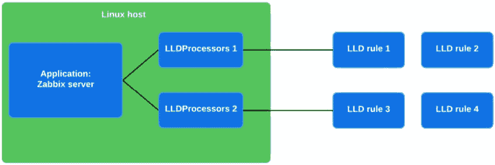

图 11.20 – Zabbix 服务器多进程配置示意图

我们的新设置将一定程度上平衡负载。发现规则只能由单个发现进程处理。这意味着如果我们有多个发现规则，我们可以像这样添加发现进程，确保每个发现规则都有足够的资源可用。其他进程也是一样的——更多的进程意味着更好的任务分配。

然而，这里有几件事需要小心。首先，并非所有问题都可以通过简单地增加更多资源来解决。有些 Zabbix 设置配置不当，配置中的某些内容使得我们的进程不必要地繁忙。如果我们解决了配置不当的问题，就可以减少高负载，从而需要更少的进程。

第二点我想强调的是，我们可以不断地向 Zabbix 服务器配置中添加进程——但有其限制。不过，在达到这些限制之前，你肯定会遇到我们的 Linux 主机硬件的极限。确保你有足够的 RAM 和 CPU 能力来实际运行所有这些进程，或者使用 Zabbix 代理来分担负载。同时也要记住，增加更多进程可能需要额外的数据库调优，例如允许更多的数据库连接。

最后但同样重要的是，记住更改 Zabbix 服务器配置需要重启 `zabbix-server` 进程。在大型安装中，这可能需要很长时间。Zabbix 服务器可能需要进行大量的数据库写入（例如，趋势数据），才能完成 `zabbix-server` 进程的关闭。

### Zabbix 清理工具

现在谈谈 Zabbix 清理工具，这对于尚未设置 MySQL 分区或 PostgreSQL TimescaleDB 分区的 Zabbix 管理员来说是一个非常重要的进程。Zabbix 清理进程连接到我们的数据库，然后逐行删除*过期*的信息。你可能会想，什么是过期？其实，我们可以在 Zabbix 服务器中设置项目在数据库中保存多久的时间限制。

如果我们查看 **管理** | **清理**，我们将看到以下截图所示的部分内容：

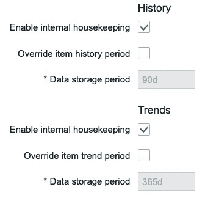

图 11.21 – Zabbix 服务器历史和趋势清理设置

这些是我们的全局 **历史** 和 **趋势** 清理参数。这定义了项目数据在数据库中应该保留多久。如果我们查看模板或主机上的项目，我们还可以看到这些参数：


图 11.22 – Zabbix 项目历史和趋势清理参数

这些设置会覆盖全局设置，因此你可以进一步调整清理工具。这就是清理工具如何保持你的数据库正常运行的方式。

但现在，让我们来看一下我们在 Zabbix 服务器配置文件中所做的调整，第一个就是 `HousekeepingFrequency`。清理频率是指清理程序进程启动的频率。我们将其从每小时一次降低为每两小时一次。现在你可能会认为这样更差，但不一定。很多时候，我们会看到清理工作在一小时后并未完成，然后就一直持续下去。

我们还更改了 `MaxHousekeeperDelete` 参数，这完全是另一回事。这个参数决定了每次清理程序运行时，Zabbix 清理程序允许删除多少数据库行。默认设置规定每小时可以删除 5000 行数据库记录。而通过我们的新设置，我们现在每两小时可以删除 20000 行数据库记录。每一行基本上就是我们允许删除的单个指标。

这会改变任何事情吗？嗯，可能不会。这完全取决于你的设置。调整 Zabbix 的清理程序对于每种设置都不同，你需要自己确定最优设置。尝试平衡你在图表中看到的内容与我们在这里讨论的两个设置，看看你能优化到什么程度。

然而，到某个时候，你的 Zabbix 设置可能会变得足够大，以至于 Zabbix 的清理程序无法跟上。这时你就需要考虑 MySQL 分区或 PostgreSQL TimescaleDB。没有预定的点可以说明 Zabbix 的清理程序无法跟上，所以从一开始就直接选择 MySQL 分区或 PostgreSQL TimescaleDB 会更为明智。毕竟，任何设置都有可能比预期增长得更大，对吧？更多相关内容请参见本书的*第十二章*。

### 调整 MySQL 数据库

现在来调整你的 MySQL 数据库，使用 `mysqltuner.pl` 脚本。这个脚本在后台做了很多工作，但我们可以将其总结为：它查看当前 MySQL 数据库的使用情况，然后输出它认为正确的调整变量。

不要将脚本输出视为最终结果，因为像 Zabbix 的清理程序一样，无法为你的数据库提供一个明确的设置。数据库的复杂性远超做几个调整就能完成的程度。

这个脚本肯定能在一定程度上帮助你调整 MySQL 数据库，尤其是对于较小的设置。但请确保通过定期阅读博客、指南和数据库书籍来扩展你的知识。

## 还有更多内容……

我们已经讨论了如何调整 MySQL 数据库，但还没有讨论如何调整 PostgreSQL 实例。为了更深入了解，建议访问 PostgreSQL 的维基页面 [`wiki.postgresql.org/wiki/Performance_Optimization`](https://wiki.postgresql.org/wiki/Performance_Optimization)。这里有各种不同的选项和偏好。确保仔细查看它们，并选择最适合你的方案。

Zabbix 7.0 版本中还新增了专门针对以下三种轮询器的功能：

+   代理轮询器

+   HTTP 代理轮询器

+   SNMP 轮询器（用于 walk[OID] 和 get[OID] 项目）

这些进程现在异步执行检查。意思是它们可以同时执行多个（项目）检查。在早期版本的 Zabbix 中，这些轮询器每次只能执行一个检查。

仍然可以通过例如 **StartAgentPollers** 添加多个这些进程，但现在其功能有所不同。这将每个轮询器执行最多 1,000 次检查，这可以通过 **MaxConcurrentChecksPerPoller** 参数进行配置。
