# 12

# 高级 Zabbix 数据库管理

无论你是已经使用 Zabbix 一段时间，还是正在准备设置你的第一个生产实例，数据库管理从一开始就非常重要。很多时候，人们设置了 Zabbix 数据库，却没有意识到它将会成为一个庞大的数据库。当数据库超过一定大小时，Zabbix 清理进程无法跟上，这时我们就需要考虑不同的方案。

在本章中，我们将讨论如何防止 Zabbix 数据库在 Zabbix 清理进程无法跟上的情况下占用 100% 的磁盘空间。对于 MySQL 用户，我们将研究如何使用数据库分区来控制数据库的大小。对于 PostgreSQL 用户，我们将关注 TimescaleDB 的支持。最后，我们还将了解如何确保 Zabbix 服务器与数据库之间的连接安全。

我们将在以下方案中完成这些任务：

+   为 Zabbix 数据库设置 MySQL 分区

+   使用 PostgreSQL 的 TimescaleDB 功能

+   保护你的 Zabbix MySQL 数据库

不再废话，让我们开始这些方案，了解如何管理我们的数据库。

# 技术要求

我们将需要一些新的服务器来实现这些方案。首先，一台 Linux 服务器需要运行带有 MySQL（MariaDB）设置的 Zabbix 服务器 7；我们将这台主机称为`lar-book-mysql-mgmt`。我们还需要一台运行带有 PostgreSQL 的 Zabbix 服务器 7 的 Linux 服务器，我们称之为`lar-book-postgresql-mgmt`。

我们还需要两台服务器来创建一个安全的 Zabbix 数据库设置。一台服务器将运行 MySQL（MariaDB）数据库；我们将这台服务器称为`lar-book-secure-db`。然后，外部连接到 Zabbix 数据库，我们将有一台 Zabbix 服务器，我们称之为`lar-book-secure-zbx`。

代码文件也可以在 GitHub 仓库中访问，链接如下：

[`github.com/PacktPublishing/Zabbix-7-IT-Infrastructure-Monitoring-Cookbook/tree/main/chapter12`](https://github.com/PacktPublishing/Zabbix-7-IT-Infrastructure-Monitoring-Cookbook/tree/main/chapter12)

# 为 Zabbix 数据库设置 MySQL 分区

在使用 MySQL 数据库时，我们面临的最大问题是 MySQL 默认存储数据的方式。如果我们想删除大量数据，默认的存储方式没有实际的顺序可以利用。MySQL 分区可以解决这个问题；让我们看看如何配置它来用于 Zabbix 数据库。

重要提示

在 Opensource ICT Solutions，我们已经修复了脚本，使其能够与 MySQL 8 一起工作。这个脚本应该可以再次适用于 *任何* MySQL 设置。有关更多信息，请查看链接：[`github.com/OpensourceICTSolutions/zabbix-mysql-partitioning-perl`](https://github.com/OpensourceICTSolutions/zabbix-mysql-partitioning-perl)。

## 准备工作

对于本教程，我们需要一个运行中的 Zabbix 服务器，并且该服务器必须有一个 MySQL 数据库。我将在示例中使用 MariaDB，但任何 MySQL 变种应该差不多。我将使用名为 `lar-book-mysql-mgmt` 的 Linux 主机，该主机已经满足要求。

如果你在生产环境中执行这些步骤，请确保首先创建数据库备份，因为事情总是可能出错。

## 如何操作…

1.  首先，登录到我们的 Linux CLI 执行命令。

1.  使用 TMUX 是个好主意，因为分区对于大型数据库来说可能需要几天时间。即使我们丢失 SSH 连接，TMUX 也会保持会话在后台打开。如果没有安装 TMUX，请先安装它，然后再继续。

    基于 RHEL 的命令如下：

    ```
    dnf install tmux
    ```

    基于 Ubuntu 的命令如下：

    ```
    apt install tmux
    ```

1.  通过执行以下命令打开一个新的 **tmux** 会话：

    ```
    tmux
    ```

重要提示

在 **tmux** 窗口中运行分区并不是必需的，但绝对是明智之举。分区一个大数据库可能需要很长时间。你可以将数据库移到另一台资源充足（CPU、内存和磁盘速度）的机器上进行分区，或者如果这不可行，可以在分区过程中停止 Zabbix 服务器进程。

1.  现在，使用以下命令以 root 用户身份登录 MySQL 应用程序：

    ```
    mysql -u root -p
    ```

1.  现在，使用以下命令切换到 Zabbix 数据库：

    ```
    USE zabbix;
    ```

1.  我们将需要对一些表进行分区，但要做到这一点，我们需要知道表中的 UNIX 时间戳：

    ```
    SELECT FROM_UNIXTIME(MIN(clock)) FROM history;
    ```

    你将收到如下输出：

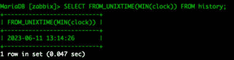

图 12.1 – MySQL 返回历史表上的时间戳

1.  这个时间戳应该对我们要分区的每个表大致相同。通过对剩余的历史表运行相同的查询来验证这一点：

    ```
    SELECT FROM_UNIXTIME(MIN(clock)) FROM 'history';
    SELECT FROM_UNIXTIME(MIN(clock)) FROM 'history_uint';
    SELECT FROM_UNIXTIME(MIN(clock)) FROM 'history_str';
    SELECT FROM_UNIXTIME(MIN(clock)) FROM 'history_text';
    SELECT FROM_UNIXTIME(MIN(clock)) FROM 'history_log';
    SELECT FROM_UNIXTIME(MIN(clock)) FROM 'history_bin';
    ```

1.  一个表可能返回不同的值，甚至没有任何值。在创建分区时我们需要考虑这一点。显示**NULL**的表没有数据，但较早的日期意味着我们需要更早的分区：

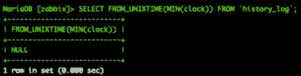

图 12.2 – MySQL 返回历史日志表上的时间戳

1.  我们从 **history** 表开始。我们将按天对这个表进行分区，直到今天的日期；对我来说是 **18-06-2023**。让我们准备以下 MySQL 查询（例如，保存在记事本中）：

    ```
    ALTER TABLE history PARTITION BY RANGE ( clock)
    (PARTITION p2023_06_11 VALUES LESS THAN (UNIX_TIMESTAMP("2023-06-12 00:00:00")) ENGINE = InnoDB,
    PARTITION p2023_06_12 VALUES LESS THAN (UNIX_TIMESTAMP("2023-06-13 00:00:00")) ENGINE = InnoDB,
    PARTITION p2023_06_13 VALUES LESS THAN (UNIX_TIMESTAMP("2023-06-14 00:00:00")) ENGINE = InnoDB,
    PARTITION p2023_06_14 VALUES LESS THAN (UNIX_TIMESTAMP("2023-06-15 00:00:00")) ENGINE = InnoDB,
    PARTITION p2023_06_15 VALUES LESS THAN (UNIX_TIMESTAMP("2023-06-16 00:00:00")) ENGINE = InnoDB,
    PARTITION p2023_06_16 VALUES LESS THAN (UNIX_TIMESTAMP("2023-06-17 00:00:00")) ENGINE = InnoDB,
    PARTITION p2023_06_17 VALUES LESS THAN (UNIX_TIMESTAMP("2023-06-18 00:00:00")) ENGINE = InnoDB,
    PARTITION p2023_06_18 VALUES LESS THAN (UNIX_TIMESTAMP("2023-06-19 00:00:00")) ENGINE = InnoDB);
    ```

提示

如果我们只有 7 天的历史数据，手动创建这个列表并不困难。如果我们要在一个大型现有数据库上执行这项操作，这可能会是一个需要手动编辑的大列表。使用像 Excel 这样的软件或编写一个小脚本来生成大列表会比较容易。

1.  确保这里最旧的分区与我们在*第 9 步*中收集的时间戳相匹配。在我的案例中，最旧的数据来自 2023 年 6 月 11 日，因此这是我的最旧分区。另外，确保你最新的分区与正在分区的日期相匹配。

1.  从*第 9 步*中复制并粘贴准备好的 MySQL 查询，并按*Enter*键。这可能需要一段时间，因为你的表可能非常大。完成后，你将看到以下内容：

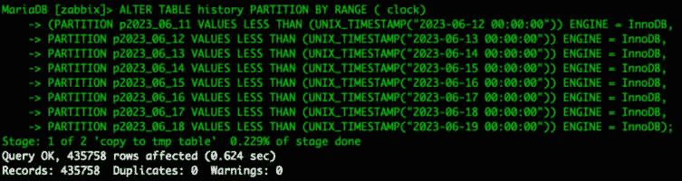

图 12.3 – MySQL 成功返回历史表的查询结果

1.  对剩余的历史表进行相同的分区；确保使用其他 UNIX 时间戳来进行最早的分区：

    +   **history_uint**

    +   **history_str**

    +   **history_text**

    +   **history_log**

    +   **history_bin**

1.  一旦你完成所有历史表的分区，接下来让我们对**trends**表进行分区。我们有两个这样的表，分别是**trends**和**trends_uint**。

1.  我们将使用以下命令再次检查时间戳：

    ```
    SELECT FROM_UNIXTIME(MIN(clock)) FROM trends;
    SELECT FROM_UNIXTIME(MIN(clock)) FROM trends_uint;
    ```

1.  对于这些表，重要的是要关注最早的月份。对于我的表，这是 2023 年 6 月。

1.  现在，让我们为这个表准备并执行分区。让我们从*第 14 步*中看到的最早时间戳开始，做两个额外的分区：

    ```
    ALTER TABLE trends PARTITION BY RANGE ( clock)
    (PARTITION p2023_06 VALUES LESS THAN (UNIX_TIMESTAMP("2023-07-01 00:00:00")) ENGINE = InnoDB,
    PARTITION p2023_07 VALUES LESS THAN (UNIX_TIMESTAMP("2023-08-01 00:00:00")) ENGINE = InnoDB,
    PARTITION p2023_08 VALUES LESS THAN (UNIX_TIMESTAMP("2023-09-01 00:00:00")) ENGINE = InnoDB);
    ```

1.  再次从最早收集的 UNIX 时间戳开始分区，一直到当前月份。但是，为未来的数据创建一些新分区也无妨：

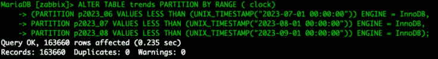

图 12.4 – MySQL 成功返回趋势表的查询结果

1.  对**trends_uint**表做同样的操作。

1.  这就结束了数据库的实际分区。让我们确保我们的分区保持管理。在你的 Zabbix 数据库 Linux 主机上，使用以下命令下载分区脚本：

    ```
    wget https://raw.githubusercontent.com/OpensourceICTSolutions/zabbix-mysql-partitioning-perl/main/mysql_zbx_part.pl
    ```

1.  如果你不能使用**wget**，只需从以下链接下载脚本：[`github.com/OpensourceICTSolutions/zabbix-mysql-partitioning-perl/blob/main/mysql_zbx_part.pl`](https://github.com/OpensourceICTSolutions/zabbix-mysql-partitioning-perl/blob/main/mysql_zbx_part.pl)。

    或者，你也可以使用此 GitHub 链接下载分区脚本：

    [`github.com/PacktPublishing/Zabbix-7-IT-Infrastructure-Monitoring-Cookbook/tree/main/chapter12/mysql_zbx_part.pl`](https://github.com/PacktPublishing/Zabbix-7-IT-Infrastructure-Monitoring-Cookbook/tree/main/chapter12/mysql_zbx_part.pl)

1.  现在，使用以下命令创建目录并将脚本移动到**/usr/lib/zabbix/**文件夹：

    ```
    mkdir /usr/lib/zabbix/
    mv mysql_zbx_part.pl /usr/lib/zabbix/
    ```

1.  我们将自定义脚本中的一些细节。使用以下内容编辑脚本：

    ```
    vim /usr/lib/zabbix/mysql_zbx_part.pl
    ```

    我们需要编辑以下部分的文本：

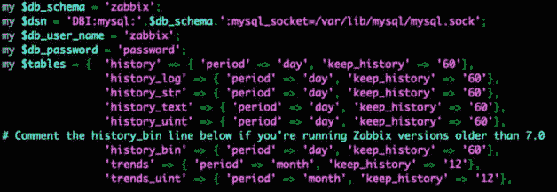

图 12.5 – MySQL Zabbix 分区脚本用户参数

1.  编辑**$db_schema**，使其匹配你的 Zabbix 数据库名称。

1.  编辑**$db_user_name**以匹配你的 Zabbix 数据库用户名。

1.  编辑**$db_password**以匹配你的 Zabbix 数据库密码。

1.  现在，在**$tables**变量中，我们将添加一些最重要的细节。在这里我们将添加要保留多少天的历史数据以及多少个月的趋势数据。添加你的值；默认设置保留 30 天的历史数据和 12 个月的趋势数据。

1.  同时，确保编辑**my $curr_tz = Etc/UTC;**行，以匹配你自己的时区。例如，我将使用 Europe/Amsterdam。

提示

如果你使用的是 Zabbix 2.2 版本之前的版本，或 MySQL 5.6 版本之前的版本，或者你正在运行 MySQL 8，那么脚本中需要注释掉并取消注释一些额外的配置行。如果适用于你，请阅读**mysql_zbx_part.pl**脚本文件中的注释并进行编辑。另外，请查看本食谱引言中提到的 GitHub 仓库。

1.  在执行脚本之前，我们需要安装一些 Perl 依赖项。在基于 RHEL 的系统上，我们需要额外的仓库。

    基于 RHEL8 的命令如下：

    ```
    dnf config-manager --set-enabled powertools
    dnf config-manager --enable crb
    ```

1.  使用以下命令安装依赖项。

    基于 RHEL 的命令如下：

    ```
    dnf update
    dnf install perl-Sys-Syslog
    dnf install perl-DateTime
    dnf install perl-DBD-mysql
    dnf install perl-DBI
    ```

    Ubuntu 命令如下：

    ```
    apt install liblogger-syslog-perl
    apt install libdatetime-perl
    ```

1.  使用以下命令使脚本可执行：

    ```
    chmod +x /usr/lib/zabbix/mysql_zbx_part.pl
    ```

1.  然后，这是我们应该准备好执行脚本并查看它是否正常工作的时刻。让我们执行它：

    ```
    /usr/lib/zabbix/mysql_zbx_part.pl
    ```

1.  一旦脚本执行完毕，让我们通过以下命令查看它是否成功：

    ```
    journalctl -t mysql_zbx_part
    ```

1.  你应该看到如下输出：

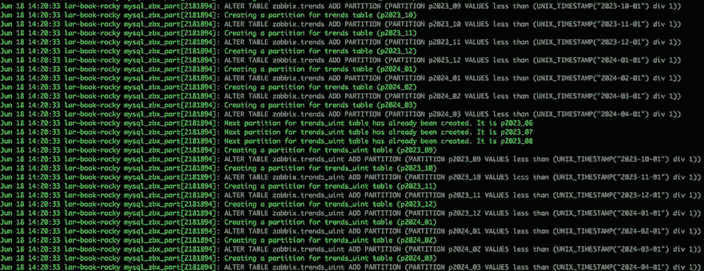

图 12.6 – MySQL Zabbix 分区脚本结果

1.  现在，执行以下命令：

    ```
    crontab -e
    ```

1.  要自动执行脚本，请将以下行添加到文件中：

    ```
    55 22 * * * /usr/lib/zabbix/mysql_zbx_part.pl
    ```

1.  我们需要做的最后一件事是进入 Zabbix 前端。导航到**管理** | **日常维护**。

1.  由于脚本将接管数据库历史和趋势的删除，必须禁用**历史**和**趋势**表的日常维护。它将如下所示：

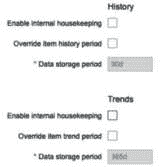

图 12.7 – Zabbix 管理 | 一般 | 历史和趋势的日常维护被禁用

这就是我们 Zabbix 数据库分区设置的结束。

## 它是如何工作的…

数据库分区看起来像是一个大胆的任务，但一旦将其拆分成小块，其实并不难。它只是将我们最重要的 Zabbix 数据库表分解为基于时间的分区的过程。一旦这些分区设置好，我们只需要通过脚本管理这些表，就可以了。

请看下图，假设今天是**2023 年 06 月 19 日**。我们有很多由脚本管理的分区。今天我们所有的**历史**数据将写入当天的分区，而所有的**趋势**数据将写入本月的分区：

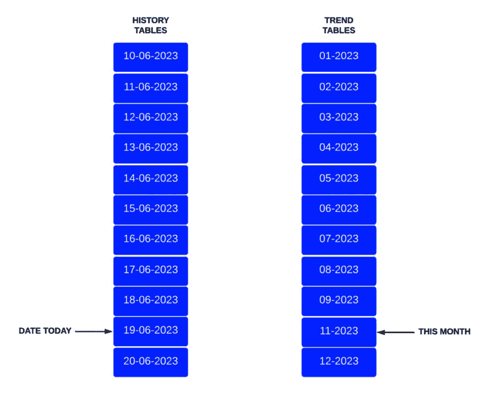

图 12.8 – Zabbix 分区示意图

实际的脚本只做两件事。它创建新的分区，并删除旧的分区。

对于删除分区，当一个分区的年龄超过`$tables`变量中指定的时间时，它将删除整个分区。

对于创建分区，每次运行脚本时，它会从今天开始创建未来的 10 个分区，当然，前提是该分区尚不存在。

这样做比使用 Zabbix housekeeper 有一个明显的优点，那就是速度更快！Zabbix housekeeper 会逐行检查数据库数据的 UNIX 时间戳，并在数据超过指定时间后删除该行。这需要时间和资源。而删除分区几乎是瞬间完成的。

然而，分区 Zabbix 数据库的一个缺点是，我们将无法使用前端的历史和趋势配置。这意味着我们不能为不同的项指定不同的历史和趋势；现在一切都是全局的。

## 另见

当我第一次使用 Zabbix 时，我没有像这本书这样的参考资料。相反，我依赖于网上可用的资源和自己的技能。有很多关于分区和其他内容的优秀指南可供参考。如果这本书没有提到某些内容，确保去 Google 上查找看看是否有相关信息。你还可以查看我们 Zabbix 同行写的一些精彩书籍，当然，如果你自己解决了某个问题，分享就是关爱！

# 使用 PostgreSQL TimescaleDB 功能

TimescaleDB 是一个开源的关系型 PostgreSQL 数据库扩展，用于基于时间的序列数据。使用 PostgreSQL TimescaleDB 是绕过使用 Zabbix housekeeper 来管理 PostgreSQL 数据库的可靠方法。在本食谱中，我们将介绍如何在新服务器上安装 PostgreSQL TimescaleDB，并与 Zabbix 配合使用。

## 准备工作

我们需要一台空的 Linux 服务器。我将使用名为`lar-book-postgresql-mgmt`的服务器。

## 如何操作……

对于基于 RHEL 的系统和 Ubuntu 系统，我们有一些不同的流程，这也是我们将 *如何操作…* 部分分为两部分的原因。我们将从 Ubuntu 系统开始。

### Ubuntu 安装

1.  让我们登录到 Linux CLI，并使用以下命令添加 PostgreSQL 仓库：

    ```
    apt install gnupg postgresql-common apt-transport-https lsb-release wget
    /usr/share/postgresql-common/pgdg/apt.postgresql.org.sh
    ```

1.  现在，添加 TimescaleDB 仓库：

    ```
    echo "deb https://packagecloud.io/timescale/timescaledb/ubuntu/ $(lsb_release -c -s) main" | sudo tee /etc/apt/sources.list.d/timescaledb.list
    wget --quiet -O - https://packagecloud.io/timescale/timescaledb/gpgkey | sudo apt-key add -
    apt update
    ```

1.  现在，使用以下安装命令安装 TimescaleDB：

    ```
    apt install timescaledb-2-postgresql-15
    ```

1.  启动并启用 PostgreSQL 12：

    ```
    systemctl enable postgresql
    systemctl start postgresql
    ```

1.  现在，继续本食谱中的*TimescaleDB 配置*部分。

### 基于 RHEL 的安装

1.  让我们从登录到 Linux CLI 开始。我们需要 PostgreSQL 版本 11 或更高版本。让我们安装版本 12；首先，禁用 AppStream：

    ```
    dnf -qy module disable postgresql
    ```

1.  添加正确的仓库：

    ```
    dnf install https://download.postgresql.org/pub/repos/yum/reporpms/EL-8-x86_64/pgdg-redhat-repo-latest.noarch.rpm
    ```

1.  然后，安装 PostgreSQL：

    ```
    dnf install postgresql15 postgresql15-server
    ```

1.  确保初始化数据库：

    ```
    /usr/pgsql-15/bin/postgresql-15-setup initdb
    ```

1.  现在，将仓库信息添加到文件中并保存：

    ```
    tee /etc/yum.repos.d/timescale_timescaledb.repo <<EOL
    [timescale_timescaledb]
    name=timescale_timescaledb
    baseurl=https://packagecloud.io/timescale/timescaledb/el/$(rpm -E %{rhel})/\$basearch
    repo_gpgcheck=1
    gpgcheck=0
    enabled=1
    gpgkey=https://packagecloud.io/timescale/timescaledb/gpgkey
    sslverify=1
    sslcacert=/etc/pki/tls/certs/ca-bundle.crt
    metadata_expire=300
    EOL
    ```

1.  使用安装命令安装 TimescaleDB：

    ```
    dnf install timescaledb-2-postgresql-15
    ```

1.  现在，继续执行本配方的 *TimescaleDB 配置* 部分。

### TimescaleDB 配置

在本节中，我们将介绍在完成安装过程后如何设置 TimescaleDB。还有更多的配置内容，让我们一起来看看：

1.  让我们首先运行以下命令：

    ```
    timescaledb-tune
    ```

1.  有时这不起作用，您可以像这样指定 PostgreSQL 的位置：

    ```
    timescaledb-tune --pg-config=/usr/pgsql-15/bin/pg_config
    ```

1.  按照步骤操作，并根据提示用 **yes** 或 **no** 回答问题。对于首次设置，所有选项选择 **yes** 是合适的。

1.  现在，重新启动 PostgreSQL：

    ```
    systemctl restart postgresql-15
    ```

1.  如果您还没有安装，请使用以下命令下载并安装 Zabbix。

    基于 RHEL 的命令如下：

    ```
    rpm -Uvh https://repo.zabbix.com/zabbix/7.0/rhel/9/ x86_64/zabbix-release-7.0-1.el8.noarch.rpm
    dnf clean all
    dnf install zabbix-server-pgsql zabbix-web-pgsql zabbix-apache-conf zabbix-agent2
    ```

    Ubuntu 的命令如下：

    ```
    wget https://repo.zabbix.com/zabbix/7.0/ubuntu/pool/main/z/zabbix-release/zabbix-release_7.0-1+ubuntu22.04_all.deb
    dpkg -i zabbix-release_7.0-1+ubuntu22.04_all.deb
    apt update
    apt install zabbix-server-pgsql zabbix-frontend-phpphp-pgsql zabbix-apache-conf zabbix-agent2
    ```

1.  使用以下命令创建初始数据库：

    ```
    sudo -u postgres createuser --pwprompt zabbix
    sudo -u postgres createdb -O zabbix zabbix
    ```

1.  导入 PostgreSQL 的数据库架构：

    ```
    zcat /usr/share/doc/zabbix-server-pgsql*/create.sql.gz | sudo -u zabbix psql zabbix
    ```

1.  通过编辑 Zabbix 配置文件，将数据库密码添加到其中：

    ```
    vim /etc/zabbix/zabbix_server.conf
    ```

1.  添加以下行，其中 **password** 是在*第 6 步*中设置的密码，**DBHost** 留空：

    ```
    DBHost=
    DBPassword=password
    ```

1.  现在，使用以下命令启用 TimescaleDB 扩展：

    ```
    echo "CREATE EXTENSION IF NOT EXISTS timescaledb CASCADE;" | sudo -u postgres psql zabbix
    ```

1.  解压位于 Zabbix 共享文件夹中的 **timescale.sql** 脚本：

    ```
    gunzip /usr/share/doc/zabbix-sql-scripts/postgresql/timescaledb.sql.gz
    ```

1.  现在，让我们运行 **timescale.sql**：

    ```
    cat /usr/share/doc/zabbix-sql-scripts/postgresql/timescaledb.sql| sudo -u zabbix psql zabbix
    ```

1.  在进入前端之前，我们还需要做一件事。我们需要编辑 **pg_hba.conf** 文件以允许我们的 Zabbix 前端进行连接。编辑以下文件：

    ```
    vim /var/lib/pgsql/15/data/pg_hba.conf
    ```

1.  确保文件中的以下行与之匹配；它们需要以 **md5** 结尾：

    ```
    # "local" is for Unix domain socket connections only
    local all all
    scram-sha256
    # IPv4 local connections:
    host all  all  127.0.0.1/32
    md5
    # IPv6 local connections:
    host all  all  ::1/128
    scram-sha256
    ```

1.  现在，启动 Zabbix 并使用以下命令完成前端设置：

    在基于 RHEL 的系统上：

    ```
    systemctl restart zabbix-server zabbix-agent2 httpd php-fpm
    systemctl enable zabbix-server zabbix-agent2 httpd php-fpm
    ```

    在 Ubuntu 系统上：

    ```
    systemctl restart zabbix-server zabbix-agent2 apache2 php-fpm
    systemctl enable zabbix-server zabbix-agent2 apache2 php-fpm
    ```

1.  一旦我们进入前端并登录到我们的设置，导航到**管理** | **日常维护**。

1.  现在，我们可以编辑以下参数以匹配我们的偏好，TimescaleDB 将负责维护数据保留期限：

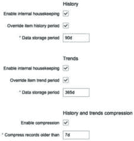

图 12.9 – Zabbix 管理 | 日常维护，TimescaleDB 特定选项

## 它是如何工作的……

使用 TimescaleDB 功能与您的 Zabbix 设置集成，可以与 PostgreSQL 数据库实现稳固的集成。该扩展由 Zabbix 支持，预计在不久的将来将变得更好。

现在，TimescaleDB 的工作原理是将您的 PostgreSQL 超表按时间分割成数据块。如果我们查看下图，我们可以看到它的样子：


图 12.10 – TimescaleDB 超表数据块示意图

这些基于时间的块比使用 Zabbix housekeeper 从数据库中删除要快得多。Zabbix housekeeper 会逐行遍历我们的数据库数据，检查 UNIX 时间戳，然后当数据超过指定时间时删除该行。这个过程需要时间和资源。而删除一个块几乎是瞬间完成的。

使用 TimescaleDB 与 Zabbix 数据库结合的另一个优点是，我们仍然可以使用前端的项目历史记录和趋势配置。更重要的是，TimescaleDB 可以压缩我们的数据，以保持数据库的较小体积。

缺点是我们不能为不同的项目指定不同的历史记录和趋势；现在这一切都是全局的。

## 另见

本教程详细介绍了 PostgreSQL TimescaleDB 的安装。由于这个过程在不断变化，你可能需要从官方 TimescaleDB 文档中获取一些新的信息。你可以在这里查看它们的文档：

[`docs.timescale.com/latest/getting-started/installation/rhel-centos/installation-yum`](https://docs.timescale.com/latest/getting-started/installation/rhel-centos/installation-yum)

# 保护你的 Zabbix MySQL 数据库

Zabbix 服务器的另一个伟大功能是能够加密数据库与 Zabbix 组件之间的数据。这在你使用分离的数据库和 Zabbix 服务器通过网络连接时尤其有用。**中间人攻击** (**MITM**) 或其他攻击可以在网络上执行，从而获取你的监控数据。

在本教程中，我们将设置 MySQL 加密，确保 Zabbix 组件和数据库之间增加另一层安全性。

## 准备工作

我们需要一个使用外部数据库的 Zabbix 设置。我将使用 Linux 的 `lar-book-secure-db` 和 `lar-book-secure-zbx` 主机。

新的服务器 `lar-book-secure-zbx` 将用于外部连接到 `lar-book-secure-db` 数据库服务器。数据库服务器不会运行我们的 Zabbix 服务器；这个过程将运行在 `lar-book-secure-zbx` 上。

确保 `lar-book-secure-db` 主机上已安装 MariaDB，并且你正在运行支持加密的最新版本。如果你不知道如何升级数据库，请查看 *第十一章* 中名为 *从旧版本的 MariaDB 升级 Zabbix 数据库到 MariaDB 10.5* 的教程，或查阅在线文档。

## 如何操作…

1.  确保*准备工作*部分中两个主机的主机文件包含 Linux 主机的主机名和 IP，并按以下内容编辑文件：

    ```
    vim /etc/hosts
    ```

1.  然后，在文件中填写你的主机名和 IP。文件应如下所示：

    ```
    10.16.16.170 lar-book-secure-db
    10.16.16.171 lar-book-secure-zbx
    ```

1.  在 **lar-book-secure-db** MySQL 服务器上，如果还没做过，请通过登录 MySQL 创建 Zabbix 数据库：

    ```
    mysql -u root -p
    ```

1.  然后，执行以下命令以创建数据库：

    ```
    create database zabbix character set utf8mb4 collate utf8mb4_ bin;
    ```

1.  同时，确保创建一个可以安全访问数据库的用户。确保 IP 地址与 Zabbix 服务器的 IP 地址匹配（如果 Zabbix 前端与服务器分开，则还需要匹配该前端的 IP 地址）：

    ```
    create user 'zabbix'@'10.16.16.171' identified BY 'password';
    grant all privileges on zabbix.* to 'zabbix'@'10.16.16.171';
    flush privileges;
    ```

1.  退出 MySQL，然后确保使用以下命令运行安全的**mysql**脚本：

    ```
    mariadb_secure_installation
    ```

1.  登录到**lar-book-secure-zbx**并使用以下命令安装 Zabbix 服务器仓库：

    ```
    rpm -Uvh https://repo.zabbix.com/zabbix/7.0/rhel/9/x86_64/zabbix-release-7.0-1.el8.noarch.rpm
    dnf clean all
    ```

1.  让我们在服务器上添加 MariaDB 仓库：

    ```
    wget https://downloads.mariadb.com/MariaDB/mariadb_repo_setup
    chmod +x mariadb_repo_setup
    ./mariadb_repo_setup
    ```

1.  然后，安装 Zabbix 服务器及其必需的组件。

    使用以下基于 RHEL 的命令：

    ```
    dnf install zabbix-server-mysql zabbix-web-mysql zabbix-apache-conf zabbix-agent2 zabbix-sql-scripts mariadb-client
    ```

    使用以下 Ubuntu 命令：

    ```
    apt install zabbix-server-mysql zabbix-frontend-php zabbix-apache-conf zabbix-agent2 mariadb-client
    ```

1.  从 Zabbix 服务器连接到远程数据库服务器，并使用以下命令导入数据库架构和默认数据：

    ```
    zcat /usr/share/doc/zabbix-sql-scripts/mysql/server.sql.gz | mysql -h 10.16.16.170 -uzabbix -p zabbix
    ```

1.  现在我们将打开名为**openssl.cnf**的文件，并通过发出以下命令进行编辑：

    ```
    vim /etc/pki/tls/openssl.cnf
    ```

1.  在此文件中，我们需要编辑以下行：

    ```
    countryName_default = XX
    stateOrProvinceName_default = Default Province
    localityName_default = Default City
    0.organizationName_default = Default Company Ltd
    organizationalUnitName_default.=
    ```

1.  完整填写后将如下所示：

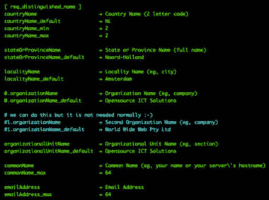

图 12.11 – 带有我们个人默认设置的 OpenSSL 配置文件

1.  我们还可以看到这一行：

    ```
    dir = /etc/pki/CA    # Where everything is kept
    ```

1.  这意味着默认目录是**/etc/pki/CA**；如果您的目录不同，请相应调整。保存并关闭文件，继续操作。

1.  让我们使用以下命令为我们的私有证书创建一个新文件夹：

    ```
    mkdir -p /etc/pki/CA/private
    ```

1.  现在，让我们在新文件夹中创建我们的密钥对。发出以下命令：

    ```
    openssl req -new -x509 -keyout /etc/pki/CA/private/cakey.pem -out /etc/pki/CA/cacert.pem -days 3650 -newkey rsa:4096
    ```

1.  现在将提示您输入密码：


图 12.12 – 证书生成响应，要求输入密码

1.  您也可能会被提示输入一些有关公司信息的内容。它将使用我们之前填写的默认值，因此您可以直接按*Enter*，直到**常用名称**。

1.  在**常用名称**处填写**根证书颁发机构**，并像这样添加您的电子邮件地址：

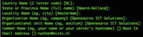

图 12.13 – 证书生成响应，要求输入信息，根证书颁发机构

1.  接下来是创建 Zabbix 服务器将使用的实际签名证书。让我们确保 OpenSSL 拥有跟踪已签名证书所需的正确文件：

    ```
    touch /etc/pki/CA/index.txt
    echo 01 > /etc/pki/CA/serial
    ```

1.  然后，创建文件夹以存放我们的证书：

    ```
    mkdir /etc/pki/CA/unsigned
    mkdir /etc/pki/CA/newcerts
    mkdir /etc/pki/CA/certs
    ```

1.  现在，让我们使用以下命令为**lar-book-secure-zbx** Zabbix 服务器创建证书签名请求：

    ```
    openssl req -nodes -new -keyout /etc/pki/CA/private/zbx-srv_key.pem -out /etc/pki/CA/unsigned/zbx-srv_req.pem -newkey rsa:2048
    ```

1.  您将被提示再次输入密码和公司信息。在**常用名称**之前使用默认设置。我们将填写我们的**常用名称**，即服务器的主机名，并像这样添加我们的电子邮件地址：

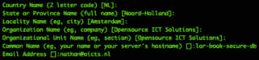

图 12.14 – 证书生成响应，要求输入信息，lar-book-secure-zbx

1.  让我们对**lar-book-secure-db**服务器执行相同的操作：

    ```
    openssl req -nodes -new -keyout /etc/pki/CA/private/mysql-srv_key.pem -out /etc/pki/CA/unsigned/mysql-srv_req.pem -newkey rsa:2048
    ```

    响应将如下所示：


图 12.15 – 证书生成响应请求信息，lar-book-secure-db

重要提示

我们的证书需要在没有密码的情况下创建；否则，MariaDB 和 Zabbix 应用程序将无法使用它们。确保指定 **-****nodes** 选项。

1.  现在，使用以下命令为 **lar-book-secure-zbx** 签署证书：

    ```
    openssl ca -policy policy_anything -days 365 -out /etc/pki/CA/certs/zbx-srv_crt.pem -infiles /etc/pki/CA/unsigned/zbx-srv_req.pem
    ```

1.  您将被提示询问**签署证书吗？[y/n]**。请回答**Y**，并对所有后续问题也回答**Y**。

1.  现在，让我们对 **lar-book-secure-db** 证书做同样的操作：

    ```
    openssl ca -policy policy_anything -days 365 -out/etc/ pki/CA/certs/mysql-srv_crt.pem -infiles/etc/pki/CA/ unsigned/mysql-srv_req.pem
    ```

1.  让我们登录到 **lar-book-secure-db** MySQL 服务器，并为我们新创建的证书创建一个目录：

    ```
    mkdir /etc/my.cnf.d/certificates/
    ```

1.  为文件夹添加正确的权限：

    ```
    chown -R mysql. /etc/my.cnf.d/certificates/
    ```

1.  现在，回到新的 **lar-book-secure-zbx** Zabbix 服务器，使用以下命令将文件复制到数据库服务器：

    ```
    scp /etc/pki/CA/private/mysql-srv_key.pem root@10.16.16.170:/etc/my.cnf.d/certificates/mysql-srv.key
    scp /etc/pki/CA/certs/mysql-srv_crt.pem root@10.16.16.170:/etc/my.cnf.d/certificates/mysql-srv.crt
    scp /etc/pki/CA/cacert.pem root@10.16.16.170:/etc/my.cnf.d/certificates/cacert.crt
    ```

1.  现在，回到 **lar-book-secure-db** MySQL 服务器，为文件添加正确的权限：

    ```
    chown -R mysql:mysql /etc/my.cnf.d/certificates/
    chmod 400 /etc/my.cnf.d/certificates/mysql-srv.key
    chmod 444 /etc/my.cnf.d/certificates/mysql-srv.crt
    chmod 444 /etc/my.cnf.d/certificates/cacert.crt
    ```

1.  使用以下命令编辑 MariaDB 配置文件：

    ```
    vim /etc/my.cnf.d/server.cnf
    ```

1.  在 **[****mysqld]** 块下的配置文件中添加以下行：

    ```
    bind-address=lar-book-secure-db
    ssl-ca=/etc/my.cnf.d/certificates/cacert.crt
    ssl-cert=/etc/my.cnf.d/certificates/mysql-srv.crt
    ssl-key=/etc/my.cnf.d/certificates/mysql-srv.key
    ```

1.  使用以下命令登录 MySQL：

    ```
    mysql -u root -p
    ```

1.  确保我们的 Zabbix MySQL 用户需要 SSL 加密，使用以下命令：

    ```
    alter user 'zabbix'@'10.16.16.152' require ssl;
    flush privileges;
    ```

    确保 IP 地址与 Zabbix 服务器的 IP 地址匹配（如果它们分开，还要确保 Zabbix 前端的 IP 地址匹配），就像我们在*步骤 2*中做的那样。

1.  退出 MariaDB CLI，然后使用以下命令重启 MariaDB：

    ```
    systemctl restart mariadb
    ```

1.  现在，回到 **lar-book-secure-zbx** Zabbix 服务器，创建一个新文件夹来存放我们的证书：

    ```
    mkdir -p /var/lib/zabbix/ssl/
    ```

1.  使用以下命令将证书复制到这个文件夹中：

    ```
    cp /etc/pki/CA/cacert.pem /var/lib/zabbix/ssl/
    cp /etc/pki/CA/certs/zbx-srv_crt.pem/var/lib/zabbix/ssl/zbx-srv.crt
    cp /etc/pki/CA/private/zbx-srv_key.pem/var/lib/zabbix/ssl/zbx-srv.key
    ```

1.  编辑 Zabbix 服务器配置文件，以便使用这些证书：

    ```
    vim /etc/zabbix/zabbix_server.conf
    ```

1.  确保以下行与我们的 **lar-book-secure-db** 数据库服务器的设置匹配：

    ```
    DBHost=lar-book-secure-db
    DBName=zabbix
    DBUser=zabbix
    DBPassword=password
    ```

1.  现在，确保我们的 SSL 配置与新文件匹配：

    ```
    DBTLSConnect=verify_full
    DBTLSCAFile=/var/lib/zabbix/ssl/cacert.pem
    DBTLSCertFile=/var/lib/zabbix/ssl/zbx-srv.crt
    DBTLSKeyFile=/var/lib/zabbix/ssl/zbx-srv.key
    ```

1.  同时，请确保为与 SSL 相关的文件添加正确的权限：

    ```
    chown -R zabbix:zabbix /var/lib/zabbix/ssl/
    chmod 400 /var/lib/zabbix/ssl/zbx-srv.key
    chmod 444 /var/lib/zabbix/ssl/zbx-srv.crt
    chmod 444 /var/lib/zabbix/ssl/cacert.pem
    ```

1.  使用以下命令启动并启用 Zabbix 服务器：

    +   基于 RHEL 的系统：

    +   **systemctl restart zabbix-server zabbix-agent2** **httpd php-fpm**

    +   **systemctl enable zabbix-server zabbix-agent2** **httpd php-fpm**

    +   Ubuntu 系统：

    +   **systemctl restart zabbix-server zabbix-agent2** **apache2 php-fpm**

    +   **systemctl enable zabbix-server zabbix-agent2** **apache2 php-fpm**

1.  然后，导航到 Zabbix 前端并填写正确的信息，如下图所示：

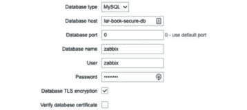

图 12.16 – Zabbix 前端配置，数据库步骤

1.  当我们点击**下一步**时，我们需要填写一些更多的信息：

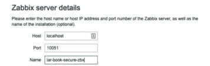

图 12.17 – Zabbix 前端配置，服务器详情步骤

1.  然后，在点击**下一步**、**下一步**和**完成**后，前端应该已经配置好并且能够正常工作。

## 它是如何工作的……

这是一篇比较长的教程，下面让我们快速总结一下：

+   在*步骤 1*至*9*中，我们准备了我们的服务器

+   在*步骤 10*至*37*中，我们执行了创建证书所需的所有操作

+   在*步骤 38*至*47*中，我们为 Zabbix 前端配置了加密

经过这些步骤后，安全地设置 Zabbix 数据库可能看起来是一项艰巨的任务，实际上确实如此。证书、登录程序、大量设置等因素都可能变得非常复杂，这也是我始终建议在尝试自己配置之前深入研究加密方法的原因。

然而，如果您的配置需要加密，本文提供的配置方法是第一次设置的良好起点。它在内部环境中运行良好，因为我们使用的是私有证书。

重要提示

确保更新您的 SSL 证书，因为它们的有效期仅限于我们定义的时长。在这种情况下是 365 天，因此我们每年都会更新一次。一个不错的计划是监控证书的到期日期，并在 Zabbix 中为其创建警报。

除了 Zabbix 服务器与 Zabbix 前端之间的通信外，所有 Zabbix 组件都可以加密，如下图所示：

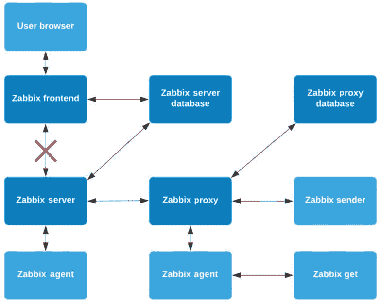

图 12.18 – Zabbix 加密方案的可能性

我们已经在以下组件之间设置了加密：

+   Zabbix 服务器和 MariaDB

+   Zabbix 前端和 MariaDB

这意味着，当我们的 Zabbix 服务器或前端请求或写入数据库数据时，它将被加密。因为我们的 Zabbix 应用程序运行在与 Zabbix 数据库不同的服务器上，这一点可能很重要。例如，我们的配置可能是这样的：

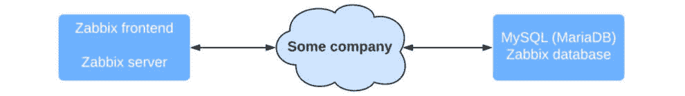

图 12.19 – 带有外部网络图的 Zabbix 配置

假设云平台的名称是**某公司**，并且其网络不由我们管理。该网络中有多个交换机和路由器，用于多个具有独立 VLAN 的客户。如果其中某个设备被攻破，我们的所有 Zabbix 数据都可能被他人查看。

即使网络设备是我们的，网络中仍然可能存在被攻破的设备，我们的数据也可能被查看。这就是为什么你可能想要添加加密，以增加额外的安全层。无论是防止其他公司及其网络的入侵，还是防止我们自己出现漏洞，像我们在本教程中做的那样保护数据库，可能会帮助你避免泄露所有数据。
