# 第十三章：将 Zabbix 引入云端与 Zabbix 云集成

在上一章，我们为你准备了一些特别的内容。作为一个长期使用 Zabbix 的用户，云集成对于像 Zabbix 这样的工具的重要性不言而喻。对于某些人来说，云可能会让人感到畏惧，因此在这一章中，我想向你展示，如何开始使用最流行的云服务提供商与 Zabbix 配合工作是多么简单。

我们将首先讨论如何使用 Zabbix 监控 **亚马逊 Web 服务** (**AWS**) 云。然后，我们还将看到如何使用 Microsoft Azure 来完成相同的操作，以便清晰地看到它们之间的差异。

在了解了这些云产品之后，我们还将查看使用 Docker 进行容器监控，Docker 是一个非常流行的产品，通过设置 Zabbix 监控，它也能受益匪浅。请仔细跟随这些食谱，你将能够轻松监控所有这些产品，并利用 Zabbix 扩展这些产品。本章包括以下食谱：

+   设置 AWS 监控

+   设置 Microsoft Azure 监控

+   构建你的 Zabbix Docker 监控

# 技术要求

由于本章关注 AWS、Microsoft Azure 和 Docker 监控，我们需要一个正在运行的 AWS、Microsoft Azure 或 Docker 设置。食谱并未覆盖如何设置这些，因此请确保你已经准备好自己的基础设施。

此外，我们还需要运行 Zabbix 7 的 Zabbix 服务器。在本章中，我们将称这个服务器为 `lar-book-rocky`。

你可以从以下 GitHub 链接下载本章的代码文件：[`github.com/PacktPublishing/Zabbix-7-IT-Infrastructure-Monitoring-Cookbook/tree/main/chapter13`](https://github.com/PacktPublishing/Zabbix-7-IT-Infrastructure-Monitoring-Cookbook/tree/main/chapter13)。

# 设置 AWS 监控

目前，许多基础设施都在向云端迁移，重要的是要像管理自己的硬件一样监控这些基础设施。在本食谱中，我们将学习如何使用 Zabbix 监控 EC2 实例、**关系型数据库服务** (**RDS**) 实例和 **S3 存储桶**。

## 准备工作

对于这个食谱，我们需要在我们的 AWS 云中至少拥有以下三种资源中的一种：

+   EC2 实例

+   RDS 实例

+   S3 存储桶

当然，我们还需要我们的 Zabbix 服务器，我们将在本食谱中称之为 `lar-book-rocky`。

重要提示

使用 Amazon CloudWatch 并不是免费的，因此你会产生费用。请在继续之前查看 Amazon AWS CloudWatch 的定价：[`aws.amazon.com/cloudwatch/pricing/`](https://aws.amazon.com/cloudwatch/pricing/)。

## 如何操作…

设置 AWS 监控一开始可能看起来是一项艰巨的任务，但一旦我们掌握了技巧，它其实并不难。让我们不再浪费时间，来看看我们可以使用的一种方法：

1.  我们从登录到我们的 Zabbix 服务器 **lar-book-rocky** 开始。

1.  通过在浏览器中导航到以下 URL，登录到你的 AWS 账户：[`aws.amazon.com/`](https://aws.amazon.com/)。

1.  在此页面上，点击**登录到控制台**。

1.  登录后，我们可以导航到**我的安全凭证**，它应该会显示在用户资料的右上角：

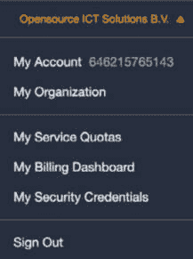

图 13.1 – AWS 网络前端用户资料

1.  在下一页的左侧，点击**访问管理**下的**用户**。

1.  让我们通过点击**添加用户**按钮来创建一个新的专用 Zabbix 监控用户。按如下方式添加用户。

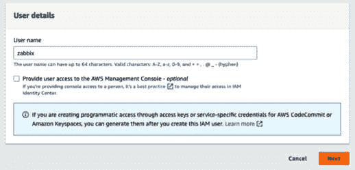

图 13.2 – AWS 新用户

1.  点击**下一步**，在第二步，如果你愿意，可以将用户添加到一个组中，以继承某些权限，复制它们，或设置自定义策略。我现在跳过这一步，再次点击**下一步**。

1.  现在点击**创建**完成该用户的设置。

1.  从列表中选择用户以编辑：

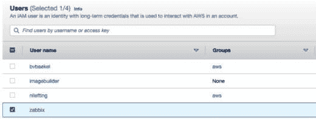

图 13.3 – AWS – 编辑新 Zabbix 用户

1.  在列表中，我们看到该用户还没有分配任何策略，因此我们将为 Zabbix 监控创建一个新的策略。

1.  从下拉列表中点击**创建内联策略**：

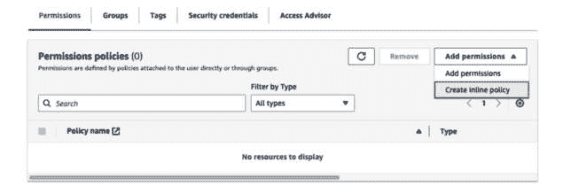

图 13.4 – AWS – 编辑新 Zabbix 用户策略

1.  然后点击**JSON**，以 JSON 格式定义新的策略。它应如下图所示：

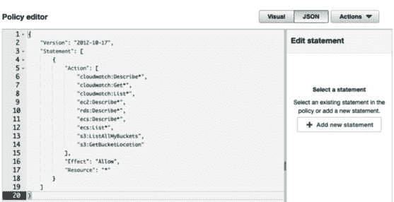

图 13.5 – AWS – 编辑新 Zabbix 用户 – 添加新策略

提示

查看 Zabbix 的集成页面，了解你将使用的 AWS 模板所需的最新权限。不同的模板需要不同的权限，未来可能会添加新的权限，以便融入新的功能或 AWS 方面的变更：[`www.zabbix.com/integrations/aws`](https://www.zabbix.com/integrations/aws)。

1.  现在，你可以点击**下一步**并为你的策略命名。

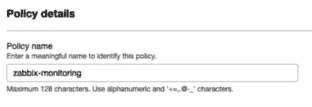

图 13.6 – AWS – 编辑新 Zabbix 用户 – 添加新策略名称

1.  然后，点击页面底部的**创建策略**。

    在权限设置好后，确保我们能够使用此用户账户进行身份验证。

1.  在创建新策略后，仍停留在同一页面，向下滚动至**访问密钥（访问密钥 ID 和秘密访问密钥）**，这将显示如下内容：

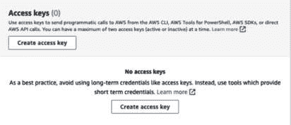

图 13.7 – AWS 访问密钥页面

1.  点击**创建访问密钥**以创建新的访问密钥。你应该看到如下内容：

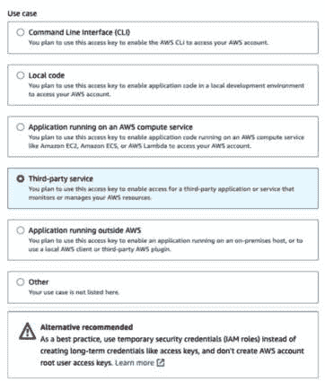

图 13.8 – AWS 访问密钥创建

1.  选择一个理由并点击**下一步**。确保你理解可能的安全隐患。

1.  给您的新访问密钥命名：

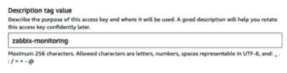

图 13.9 – AWS 访问密钥创建命名

1.  最后，点击 **创建访问密钥** 并将访问密钥和秘密访问密钥存放在安全位置（例如密码保险箱）。完成后，点击 **完成**：

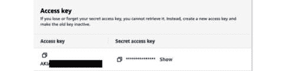

图 13.10 – AWS 访问密钥创建 – 复制密钥

1.  现在，让我们最终转向 Zabbix。登录到您的 Zabbix GUI 并导航到 **数据收集** | **主机**。

1.  通过点击右上角的 **创建主机** 来创建一个新主机。我们将创建一个名为 **lar-book-aws** 的新主机，并添加 **AWS by HTTP** 模板和一个主机组，比如 **云**。

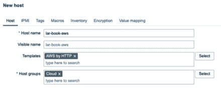

图 13.11 – 新的 AWS 主机

1.  在添加主机之前，请确保转到 **宏变量**。我们必须填写几个宏变量，以使这个新模板生效。确保填写您在 *第 19 步* 保存的键，并按照以下截图中的方式填写它们。同时，请确保添加您希望发现信息的区域。

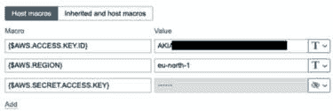

图 13.12 – 新的 AWS 主机宏变量

重要提示

在我的情况下，我运行的所有 AWS 资源都位于同一个 AWS 区域。在许多生产环境中，情况并非如此。对于这些环境，您可能希望为每个区域创建一个 Zabbix 主机，以便发现所有资源。您所需做的就是为每个主机独特地定义 **{$AWS.REGION}** 宏。

1.  现在点击 **添加** 以添加这个新主机。

1.  如果操作正确，一旦执行了发现规则，您的 AWS 资源将被添加，就像我们在下面的截图中看到的一样，显示了一些我的 EC2 实例：

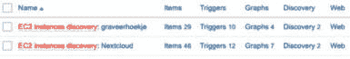

图 13.13 – 发现的 EC2 实例

## 工作原理...

现在我们已经完成了所有的设置工作，让我们看看我们实际上做了什么。Zabbix 7.0 包含了开箱即用的云监控模板，我们已经利用这些模板来监控一些常见的 AWS 资源。

Zabbix 提供的模板使用了相当广泛的 JavaScript 代码来执行针对 AWS 的 API 调用，解析接收到的数据，然后将其放入 Zabbix 的低级发现理解的 JSON 数组中。

查看 **数据收集** | **模板** 下的模板，然后打开 **发现**，查看 **AWS by HTTP** 模板，我们可以看到三个发现规则：

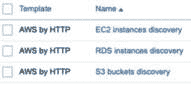

图 13.14 – AWS by HTTP 发现规则

这三个规则发现了 AWS 中的 EC2 实例、RDS 实例和 S3 存储桶，并使用 **主机原型** 为每个实例或存储桶创建了一个新主机。这些创建的主机然后会使用它们自己的模板从这些实例或存储桶获取实际的统计信息，正如我们在模板列表中所见：

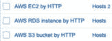

图 13.15 – Zabbix 7.0 中其他三个 AWS 模板

在我的案例中，只发现了两个 EC2 实例，因此，这两个主机通过**AWS EC2 by HTTP**模板添加，正如在*图 13.13*中所见。

所有信息随后会通过**脚本**项目类型收集，并且每个项目都有自己独特的 JavaScript 代码。我们可以在以下截图中看到代码的一部分，其中我们向 AWS 发起请求到一个特定的 URL（下划线部分），并且添加了诸如身份验证等标头：

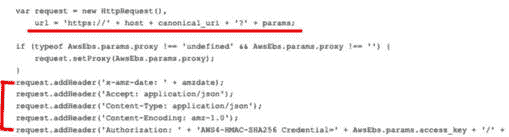

图 13.16 – AWS 模板调用

也可以编辑此 JavaScript 代码，以创建全新的调用来获取您自己的数据并创建不同类型的监控，或只是扩展现成的模板。

## 还有更多…

启动 AWS CloudWatch 监控需要时间，因为我们需要对 AWS CLI 命令和 CloudWatch 的使用有深入了解。当您使用 Zabbix 提供的模板作为基础时，您就有了一个坚实的基础，可以继续构建。

确保查看 AWS 文档，获取更多有关我们可以使用的命令的信息，使用以下链接：

[`docs.aws.amazon.com/cli/latest/reference/#available-services`](https://docs.aws.amazon.com/cli/latest/reference/#available-services)

# 设置 Microsoft Azure 监控

Microsoft Azure 云是当前云市场中的重要玩家，因此保持对该基础设施的关注与对自己硬件的关注一样重要。在本方案中，我们将探索如何使用 Zabbix 设置监控 Azure 实例。

## 准备工作

对于这个方案，我们需要在 Azure 云中至少已经具备以下其中一项资源。

+   Cosmos DB 用于 MongoDB 数据库

+   Microsoft SQL 数据库

+   MySQL 服务器

+   PostgreSQL 服务器

+   虚拟机

本方案不涵盖如何设置这些资源，所以请确保提前完成这部分工作。我们还需要 Zabbix 服务器，在本方案中我们称其为 `lar-book-rocky`。

## 如何操作…

对于 Azure 监控，我们面临的技术与 AWS 监控有一些相似之处。如果深入定制，可能会有些令人畏惧，但设置初始监控比看起来要简单得多。让我们来看看：

1.  使用 Azure 监控时，首先我们需要正确设置身份验证。为此，请导航到 [portal.azure.com](http://portal.azure.com) 并登录。

1.  在搜索框中，搜索**企业应用程序**并从列表中选择。点击**新建应用程序**：

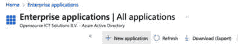

图 13.17 – Azure 企业应用程序创建

1.  然后点击**创建您自己的** **应用程序**：

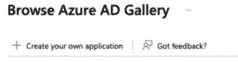

图 13.18 – Azure 企业应用程序创建 – 创建你自己的应用程序

1.  这里是我们需要为应用程序命名的地方。为它起一个合适的名字，如下图所示：

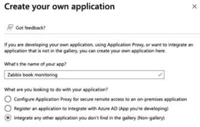

图 13.19 – Azure 企业应用程序创建 – 设置应用程序名称

1.  然后点击页面底部的**创建**按钮，完成新空应用程序的创建。页面上会显示应用程序 ID，请务必记录下来，稍后我们会用到它：

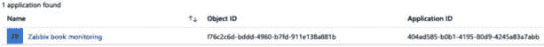

图 13.20 – Azure 企业应用程序概览页

1.  应用程序创建完成后，我们立即开始为它设置凭据。为此，使用页面顶部的 Azure 搜索栏，搜索**Azure Active Directory**，然后从列表中选择它。

1.  在左侧边栏，你应该能看到**应用注册**。我们将创建一个新的注册，点击**新建注册**：

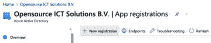

图 13.21 – Azure 企业应用程序 – 应用注册

1.  只需为你的注册起个新名称，保持其他设置为默认即可：

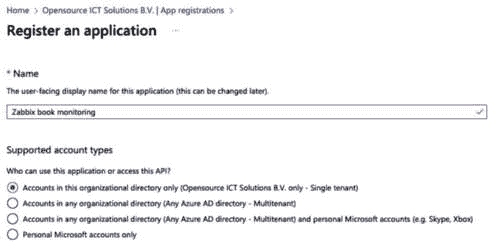

图 13.22 – Azure 企业应用程序 – 新的应用注册

1.  点击**注册**，完成此注册。这将重定向到你新创建的注册。

1.  现在我们来添加身份验证。在左侧边栏中，进入**证书与机密**。

1.  我们将在这里创建一个新的客户端机密。为此，点击**新建** **客户端机密**：

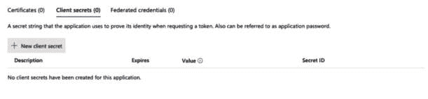

图 13.23 – Azure 企业应用程序 – 应用注册机密

1.  现在我们需要做的就是为机密命名并设置过期时间。请记住，过期时间越短，管理开销越大。较短的过期时间可能意味着更好的安全性，因为泄漏的时间窗口更小（或者一旦泄漏，使用的时间更短）：

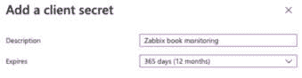

图 13.24 – Azure 企业应用程序 – 创建应用注册机密

1.  现在点击**添加**，完成设置新机密。它只会显示一次，请务必将其保存在安全的地方，例如密码保险库：

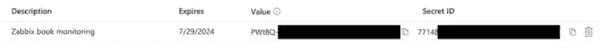

图 13.25 – Azure 企业应用程序机密

1.  身份验证完成后，只剩下一件事了。我们需要为这个新企业应用程序提供正确的权限。为此，请在页面顶部的 Azure 搜索栏中搜索**订阅**。

1.  对于 Azure 虚拟机和数据库实例监控等内容，你需要为整个订阅分配（读取）权限。找到你的资源所在的订阅。我的订阅名为**OICTS Azure**：

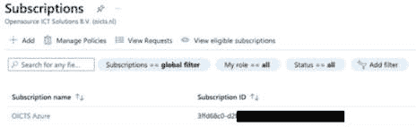

图 13.26 – Azure 订阅

1.  现在也是记录下订阅 ID 的好时机，因为我们将在稍后的步骤中需要它！

1.  选择你的订阅，然后从列表中选择**访问控制（IAM）**。然后，点击**添加** **角色分配**。

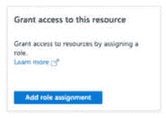

图 13.27 – Azure 订阅 – 角色分配

1.  在下一页中，从列表中选择**Reader**角色，然后点击**下一步**。

1.  在创建过程的**成员**部分，点击**+ 选择成员**。我们将添加**Zabbix 书籍监控**成员。它看起来如下：

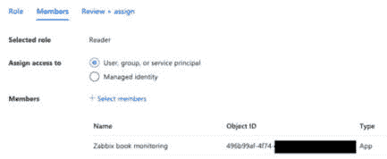

图 13.28 – Azure 订阅 – 角色分配成员

1.  现在点击**审阅 + 分配**，权限将被添加。

1.  在 Azure 门户中，还有一件事需要做。在页面顶部的搜索栏中，输入**租户属性**并从列表中选择它。在此页面上，确保记录下租户 ID，因为稍后我们需要它。

1.  设置好应用程序、创建好认证并分配好权限后，让我们继续进行 Zabbix 前端的操作。导航至**数据收集** | **主机**，然后点击右上角的**创建主机**以创建新主机：

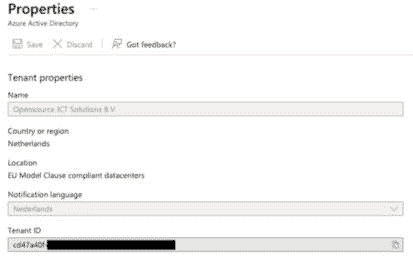

图 13.29 – Azure 租户属性

1.  创建以下主机，名称为**lar-book-azure**，选择**通过 HTTP 的 Azure**模板，并选择一个主机组，例如**云**：

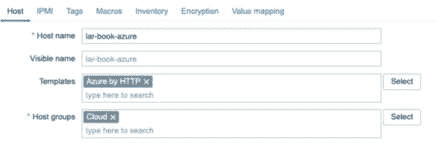

图 13.30 – Zabbix 中新的 Azure 监控主机

1.  在添加主机之前，切换到**宏**选项卡：

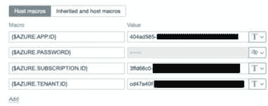

图 13.31 – Zabbix 中新的 Azure 监控主机宏

我们至少需要在此处添加以下宏：

+   对于**{$AZURE.APP.ID}**，在*第 5 步*中填写应用 ID。

+   对于**{$AZURE.PASSWORD}**，在*第 13 步*中填写**值**列下的值。

+   对于**{$AZURE.SUBSCRIPTION.ID}**，在*第 15 步*中填写订阅 ID。

+   对于**{$AZURE.TENANT.ID}**，在*第 22 步*中填写租户 ID。

1.  就这样；你现在可以通过点击**添加**按钮来添加新主机。

1.  在发现规则首次运行后，你的发现实例将被添加为新主机，正如你在下方的截图中看到的那样：

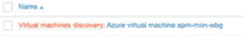

图 13.32 – 新的 Azure 发现虚拟机

就这样，你的自动化 Azure 监控现在已经按照预期工作了。让我们来看看它是如何工作的。

## 它是如何工作的……

如果您已经按照 AWS 监控的方法，您可能会认为 Azure 监控工作方式完全相同。在某种程度上，这是正确的；监控完全基于从 Zabbix 向 Azure API 发出的 API 调用。

AWS 和 Azure 之间的区别当然在于 Zabbix 项目中使用的 JavaScript 脚本。

Zabbix 7.0 提供的开箱即用的模板使用相当广泛的 JavaScript 代码来执行 API 调用向 Azure 发出请求，解析接收到的数据，然后将其放入 Zabbix 低级发现理解的 JSON 数组中。

查看在 **数据收集** | **模板** 找到的模板，然后打开 **Discovery**，查看 **Azure by HTTP** 模板，我们可以看到六个发现规则。

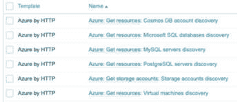

图 13.33 – Azure by HTTP 发现规则

这些六条规则发现不同类型的 Azure 数据库实例和虚拟机，并使用主机原型为每个发现的实例创建新主机。这里唯一的区别是，存储帐户不会使用主机原型，而是使用项目原型来为您提供信息。由主机原型创建的主机将反过来使用它们自己的模板从这些实例或存储桶中获取实际统计数据，正如我们在模板列表中所见：

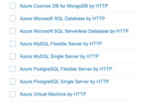

图 13.34 – Zabbix 7.0 中的其他 Azure 模板

在我的情况下，仅发现了一个虚拟机，因此，该主机已添加到 **Azure Virtual Machine by HTTP** 模板中，如 *图 13**.32* 所示。

所有信息都由其独特的 JavaScript 代码的 **Script** 项类型收集。我们可以在以下屏幕截图中看到一段代码，在这里我们调用 Azure 到特定的 URL（下划线标记）：

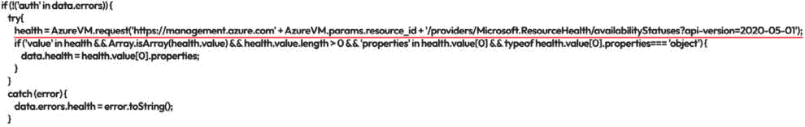

图 13.35 – Azure 模板调用

也可以编辑此 JavaScript 代码，创建全新的调用以检索您自己的数据并创建不同类型的监控，以及简单地扩展开箱即用的模板。

## 还有更多…

我们可以使用此配方中应用的方法从 Azure 中发现更多内容。我们使用的 JavaScript 用于从 Azure 获取指标，可以编辑以从 Azure API 中收集几乎任何指标。

查看 Azure API 文档，以获取有关使用 JavaScript 检索的指标的更多信息：

[`learn.microsoft.com/en-us/rest/api/azure/`](https://learn.microsoft.com/en-us/rest/api/azure/)

# 创建您的 Zabbix Docker 监控

自 Zabbix 5 发布以来，通过引入 Zabbix agent 2 和插件，监控我们的 Docker 容器变得更加简单。使用 Zabbix agent 2 和 Zabbix 7，我们能够立即监控我们的 Docker 容器。

在这个配方中，我们将看到如何设置并了解其工作原理。

## 准备工作

本食谱需要一些 Docker 容器。我们不会详细介绍 Docker 容器的设置，因此请确保自行完成此操作。此外，我们还需要在运行这些 Docker 容器的主机上安装 Zabbix 代理 2。Zabbix 代理与本食谱无关；需要安装 Zabbix 代理 2。

我们还需要确保 Zabbix 服务器能够真正监控 Docker 容器。我们将我们的 Zabbix 服务器命名为`zbx-home`。

## 如何操作…

让我们不再浪费时间，直接进入使用 Zabbix 监控 Docker 设置的过程：

1.  首先，登录到运行 Docker 容器的主机的 Linux 命令行界面。

1.  添加安装 Zabbix 组件的仓库。

    对于基于 RHEL 的系统，使用以下命令：

    ```
    rpm -Uvh https://repo.zabbix.com/zabbix/7.0/rhel/8x86_64/zabbix-release-7.0-1.el8.noarch.rpm
    dnf clean all
    ```

    对于 Ubuntu 系统，使用以下命令：

    ```
    wget https://repo.zabbix.com/zabbix/7.0/ubuntu/pool/main/z/zabbix-release/zabbix-release_7.0-1+ubuntu22.04_all.deb
    dpkg -i zabbix-release_7.0-1+ubuntu22.04_all.deb
    apt update
    ```

1.  现在，使用以下命令安装 Zabbix 代理 2。

    对于基于 RHEL 的系统，使用以下命令：

    ```
    dnf install zabbix-agent2
    ```

    对于 Ubuntu 系统，使用以下命令：

    ```
    apt install zabbix-agent2
    ```

1.  安装后，请确保使用以下命令编辑新安装的 Zabbix 代理 2 的配置文件：

    ```
    vim /etc/zabbix/zabbix_agent2.conf
    ```

1.  找到标有**Server**的行，并将 Zabbix 服务器的 IP 地址添加到文件中，如下所示：

    ```
    Server=10.16.16.102
    ```

1.  现在，我们需要通过执行以下命令将**zabbix**用户添加到 Docker 组：

    ```
    gpasswd -a zabbix docker
    ```

1.  确保保存文件，然后使用以下命令重新启动 Zabbix 代理 2：

    ```
    systemctl restart zabbix-agent2
    ```

1.  现在，进入你的 Zabbix 服务器前端，依次点击**数据收集** | **主机**，然后点击蓝色的**创建** **主机**按钮。

1.  创建一个新的主机，命名为**Docker 容器**，并确保将**Zabbix 代理 2 模板**链接到该主机。

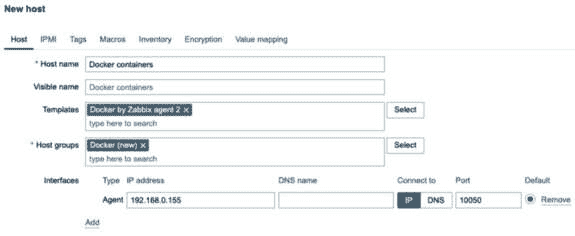

图 13.36 – 新的 Docker 主机配置

这就是通过 Zabbix 服务器监控 Docker 容器的全部内容。现在我们来看它是如何工作的。

## 它是如何工作的…

由于新的 Zabbix 代理 2 支持和默认模板，当前在 Zabbix 中监控 Docker 变得非常简单。然而，有时默认模板无法满足需求，因此让我们拆解一下所使用的项。

我们在主机上看到的几乎所有项都是依赖项，其中大多数依赖于主项`Docker: Get info`。这个主项是我们 Docker 模板中最重要的项。它执行`docker.info`项键，该键内置于新的 Zabbix 代理 2 中。该项从我们的 Docker 设置中获取一个包含各种信息的列表。我们使用依赖项和预处理来从这个主项中获取我们需要的值。

Docker 模板还包含两个 Zabbix 自动发现规则，一个用于发现 Docker 镜像，一个用于发现 Docker 容器。如果我们查看名为 `Containers discovery` 的 Docker 容器发现规则，我们可以看到发生了什么。我们的 Zabbix Docker 主机将使用 `docker.containers.discovery` 项目键来查找每个容器，并将其放入 `{#NAME}` LLD 宏中。在项目原型中，我们然后使用这个 `{#NAME}` LLD 宏与另一个主项目（如 `docker.container_info`）一起发现统计信息。从这个主项目中，我们再次使用依赖项和预处理将这些信息包含到其他项目原型中。现在，我们直接从 Docker 设置中监控一堆统计信息。

如果你想获取不在默认模板中的 Docker 值，可以查看模板中与主项目一起收集的信息。使用一个新的依赖项（原型），然后通过预处理从主项目中获取正确的数据。

## 还有更多…

如果你想了解更多关于 Zabbix agent 2 Docker 项目键的内容，请查看 Zabbix 文档中的 Zabbix agent 2 支持的项目键列表：

[https://www.zabbix.com/documentation/current/en/manual/config/items/itemtypes/zabbix_agent/zabbix_agent2?s[]=docker](https://www.zabbix.com/documentation/current/en/manual/config/items/itemtypes/zabbix_agent/zabbix_agent2?s%5B%5D=docker).
